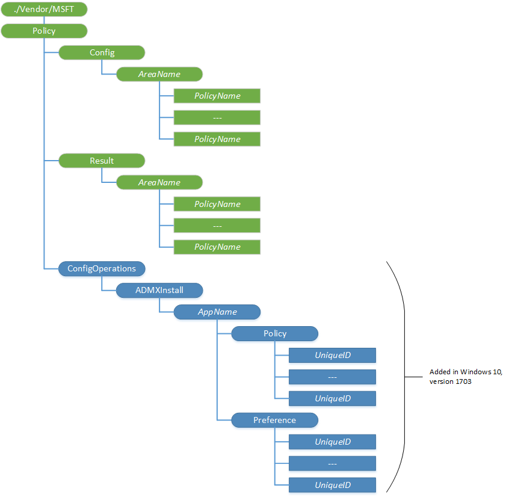

# Policy CSP

> [!WARNING]
> Some information relates to prereleased products, which may be substantially modified before it's commercially released. Microsoft makes no warranties, expressed or implied, concerning the information provided here.

The Policy configuration service provider enables the enterprise to configure policies on Windows 10. Use this configuration service provider to configure any company policies.

The Policy configuration service provider has the following sub-categories:

-   Policy/Config/*AreaName* – Handles the policy configuration request from the server.
-   Policy/Result/*AreaName* – Provides a read-only path to policies enforced on the device.

<a href="" id="policy-scope"></a>

> [!Important]
> Policy scope is the level at which a policy can be configured. Some policies can only be configured at the device level, meaning the policy will take effect independent of who is logged into the device. Other policies can be configured at the user level, meaning the policy will only take effect for that user. 
>
> The allowed scope of a specific policy is represented below its table of supported Windows editions.  To configure a policy under a specific scope (user vs. device), please use the following paths:
>
> User scope:
> -   **./User/Vendor/MSFT/Policy/Config/_AreaName/PolicyName_** to configure the policy.
> -   **./User/Vendor/MSFT/Policy/Result/_AreaName/PolicyName_** to get the result.
>
> Device scope:
> -   **./Device/Vendor/MSFT/Policy/Config/_AreaName/PolicyName_** to configure the policy.
> -   **./Device/Vendor/MSFT/Policy/Result/_AreaName/PolicyName_** to get the result.
>
> For device wide configuration the **_Device/_**  portion may be omitted from the path, deeming the following paths respectively equivalent:
>
> - **./Vendor/MSFT/Policy/Config/_AreaName/PolicyName_** to configure the policy.
> - **./Vendor/MSFT/Policy/Result/_AreaName/PolicyName_** to get the result.

The following diagram shows the Policy configuration service provider in tree format as used by both Open Mobile Alliance Device Management (OMA DM) and OMA Client Provisioning.




<a href="" id="--vendor-msft-policy"></a>**./Vendor/MSFT/Policy**  
<p style="margin-left: 20px">The root node for the Policy configuration service provider.

<p style="margin-left: 20px">Supported operation is Get.

<a href="" id="policy-config"></a>**Policy/Config**  
<p style="margin-left: 20px">Node for grouping all policies configured by one source. The configuration source can use this path to set policy values and later query any policy value that it previously set. One policy can be configured by multiple configuration sources. If a configuration source wants to query the result of conflict resolution (for example, if Exchange and MDM both attempt to set a value,) the configuration source can use the Policy/Result path to retrieve the resulting value.

<p style="margin-left: 20px">Supported operation is Get.

<a href="" id="policy-config-areaname"></a>**Policy/Config/****_AreaName_**  
<p style="margin-left: 20px">The area group that can be configured by a single technology for a single provider. Once added, you cannot change the value.

<p style="margin-left: 20px">Supported operations are Add, Get, and Delete.

<a href="" id="policy-config-areaname-policyname"></a>**Policy/Config/****_AreaName/PolicyName_**  
<p style="margin-left: 20px">Specifies the name/value pair used in the policy.

<p style="margin-left: 20px">The following list shows some tips to help you when configuring policies:

-   Separate substring values by the Unicode &\#xF000; in the XML file.

> [!NOTE]
> A query from a different caller could provide a different value as each caller could have different values for a named policy.

-   In SyncML, wrap this policy with the Atomic command so that the policy settings are treated as a single transaction.
-   Supported operations are Add, Get, Delete, and Replace.
-   Value type is string.

<a href="" id="policy-result"></a>**Policy/Result**  
<p style="margin-left: 20px">Groups the evaluated policies from all providers that can be configured.

<p style="margin-left: 20px">Supported operation is Get.

<a href="" id="policy-result-areaname"></a>**Policy/Result/****_AreaName_**  
<p style="margin-left: 20px">The area group that can be configured by a single technology independent of the providers.

<p style="margin-left: 20px">Supported operation is Get.

<a href="" id="policy-result-areaname-policyname"></a>**Policy/Result/****_AreaName/PolicyName_**  
<p style="margin-left: 20px">Specifies the name/value pair used in the policy.

<p style="margin-left: 20px">Supported operation is Get.

<a href="" id="policy-result"></a>**Policy/ConfigOperations**  
<p style="margin-left: 20px">Added in Windows 10, version 1703. The root node for grouping different configuration operations.

<p style="margin-left: 20px">Supported operations are Add, Get, and Delete.

<a href="" id="policy-configoperations-admxinstall"></a>**Policy/ConfigOperations/ADMXInstall**  
<p style="margin-left: 20px">Added in Windows 10, version 1703. Allows settings for ADMX files for Win32 and Desktop Bridge apps to be imported (ingested) by your device and processed into new ADMX-backed policies or preferences. By using ADMXInstall, you can add ADMX-backed policies for those Win32 or Desktop Bridge apps that have been added between OS releases. ADMX-backed policies are ingested to your device by using the Policy CSP URI: `./Vendor/MSFT/Policy/ConfigOperations/ADMXInstall`. Each ADMX-backed policy or preference that is added is assigned a unique ID. For more information about using Policy CSP to configure Win32 and Desktop Bridge app policies, see [Win32 and Desktop Bridge app policy configuration](win32-and-centennial-app-policy-configuration.md).

> [!NOTE]
> The OPAX settings that are managed by the Microsoft Office Customization Tool are not supported by MDM. For more information about this tool, see [Office Customization Tool](https://technet.microsoft.com/library/cc179097.aspx).

<p style="margin-left: 20px">ADMX files that have been installed by using **ConfigOperations/ADMXInstall** can later be deleted by using the URI delete operation. Deleting an ADMX file will delete the ADMX file from disk, remove the metadata from the ADMXdefault registry hive, and delete all the policies that were set from the file. The MDM server can also delete all ADMX policies that are tied to a particular app by calling delete on the URI, `./Vendor/MSFT/Policy/ConfigOperations/ADMXInstall/{AppName}`.

<p style="margin-left: 20px">Supported operations are Add, Get, and Delete.

<a href="" id="policy-configoperations-admxinstall-appname"></a>**Policy/ConfigOperations/ADMXInstall/****_AppName_**  
<p style="margin-left: 20px">Added in Windows 10, version 1703. Specifies the name of the Win32 or Desktop Bridge app associated with the ADMX file. 

<p style="margin-left: 20px">Supported operations are Add, Get, and Delete.

<a href="" id="policy-configoperations-admxinstall-appname-policy"></a>**Policy/ConfigOperations/ADMXInstall/****_AppName_/Policy**  
<p style="margin-left: 20px">Added in Windows 10, version 1703. Specifies that a Win32 or Desktop Bridge app policy is to be imported.

<p style="margin-left: 20px">Supported operations are Add, Get, and Delete.

<a href="" id="policy-configoperations-admxinstall-appname-policy-uniqueid"></a>**Policy/ConfigOperations/ADMXInstall/****_AppName_/Policy/_UniqueID_**  
<p style="margin-left: 20px">Added in Windows 10, version 1703. Specifies the unique ID of the app ADMX file that contains the policy to import.

<p style="margin-left: 20px">Supported operations are Add and Get. Does not support Delete.

<a href="" id="policy-configoperations-admxinstall-appname-preference"></a>**Policy/ConfigOperations/ADMXInstall/****_AppName_/Preference**  
<p style="margin-left: 20px">Added in Windows 10, version 1703. Specifies that a Win32 or Desktop Bridge app preference is to be imported.

<p style="margin-left: 20px">Supported operations are Add, Get, and Delete.

<a href="" id="policy-configoperations-admxinstall-appname-preference-uniqueid"></a>**Policy/ConfigOperations/ADMXInstall/****_AppName_/Preference/_UniqueID_**  
<p style="margin-left: 20px">Added in Windows 10, version 1703. Specifies the unique ID of the app ADMX file that contains the preference to import.

<p style="margin-left: 20px">Supported operations are Add and Get. Does not support Delete.


## Policies

### AboveLock policies

<dl>
  <dd>
    <a href="./policy-csp-abovelock.md#abovelock-allowactioncenternotifications" id="abovelock-allowactioncenternotifications">AboveLock/AllowActionCenterNotifications</a>
  </dd>
  <dd>
    <a href="./policy-csp-abovelock.md#abovelock-allowcortanaabovelock" id="abovelock-allowcortanaabovelock">AboveLock/AllowCortanaAboveLock</a>
  </dd>
  <dd>
    <a href="./policy-csp-abovelock.md#abovelock-allowtoasts" id="abovelock-allowtoasts">AboveLock/AllowToasts</a>
  </dd>
</dl>

### Accounts policies

<dl>
  <dd>
    <a href="./policy-csp-accounts.md#accounts-allowaddingnonmicrosoftaccountsmanually" id="accounts-allowaddingnonmicrosoftaccountsmanually">Accounts/AllowAddingNonMicrosoftAccountsManually</a>
  </dd>
  <dd>
    <a href="./policy-csp-accounts.md#accounts-allowmicrosoftaccountconnection" id="accounts-allowmicrosoftaccountconnection">Accounts/AllowMicrosoftAccountConnection</a>
  </dd>
  <dd>
    <a href="./policy-csp-accounts.md#accounts-allowmicrosoftaccountsigninassistant" id="accounts-allowmicrosoftaccountsigninassistant">Accounts/AllowMicrosoftAccountSignInAssistant</a>
  </dd>
  <dd>
    <a href="./policy-csp-accounts.md#accounts-domainnamesforemailsync" id="accounts-domainnamesforemailsync">Accounts/DomainNamesForEmailSync</a>
  </dd>
</dl>

### ActiveXControls policies

<dl>
  <dd>
    <a href="./policy-csp-activexcontrols.md#activexcontrols-approvedinstallationsites" id="activexcontrols-approvedinstallationsites">ActiveXControls/ApprovedInstallationSites</a>
  </dd>
</dl>

### ApplicationDefaults policies

<dl>
  <dd>
    <a href="./policy-csp-applicationdefaults.md#applicationdefaults-defaultassociationsconfiguration" id="applicationdefaults-defaultassociationsconfiguration">ApplicationDefaults/DefaultAssociationsConfiguration</a>
  </dd>
  <dd>
    <a href="./policy-csp-applicationdefaults.md#applicationdefaults-enableappurihandlers" id="applicationdefaults-enableappurihandlers">ApplicationDefaults/EnableAppUriHandlers</a>
  </dd>
</dl>

### ApplicationManagement policies

<dl>
  <dd>
    <a href="./policy-csp-applicationmanagement.md#applicationmanagement-allowalltrustedapps" id="applicationmanagement-allowalltrustedapps">ApplicationManagement/AllowAllTrustedApps</a>
  </dd>
  <dd>
    <a href="./policy-csp-applicationmanagement.md#applicationmanagement-allowappstoreautoupdate" id="applicationmanagement-allowappstoreautoupdate">ApplicationManagement/AllowAppStoreAutoUpdate</a>
  </dd>
  <dd>
    <a href="./policy-csp-applicationmanagement.md#applicationmanagement-allowdeveloperunlock" id="applicationmanagement-allowdeveloperunlock">ApplicationManagement/AllowDeveloperUnlock</a>
  </dd>
  <dd>
    <a href="./policy-csp-applicationmanagement.md#applicationmanagement-allowgamedvr" id="applicationmanagement-allowgamedvr">ApplicationManagement/AllowGameDVR</a>
  </dd>
  <dd>
    <a href="./policy-csp-applicationmanagement.md#applicationmanagement-allowshareduserappdata" id="applicationmanagement-allowshareduserappdata">ApplicationManagement/AllowSharedUserAppData</a>
  </dd>
  <dd>
    <a href="./policy-csp-applicationmanagement.md#applicationmanagement-allowstore" id="applicationmanagement-allowstore">ApplicationManagement/AllowStore</a>
  </dd>
  <dd>
    <a href="./policy-csp-applicationmanagement.md#applicationmanagement-applicationrestrictions" id="applicationmanagement-applicationrestrictions">ApplicationManagement/ApplicationRestrictions</a>
  </dd>
  <dd>
    <a href="./policy-csp-applicationmanagement.md#applicationmanagement-disablestoreoriginatedapps" id="applicationmanagement-disablestoreoriginatedapps">ApplicationManagement/DisableStoreOriginatedApps</a>
  </dd>
  <dd>
    <a href="./policy-csp-applicationmanagement.md#applicationmanagement-launchappafterlogon" id="applicationmanagement-launchappafterlogon">ApplicationManagement/LaunchAppAfterLogOn</a>
  </dd>
  <dd>
    <a href="./policy-csp-applicationmanagement.md#applicationmanagement-msiallowusercontroloverinstall" id="applicationmanagement-msiallowusercontroloverinstall">ApplicationManagement/MSIAllowUserControlOverInstall</a>
  </dd>
  <dd>
    <a href="./policy-csp-applicationmanagement.md#applicationmanagement-msialwaysinstallwithelevatedprivileges" id="applicationmanagement-msialwaysinstallwithelevatedprivileges">ApplicationManagement/MSIAlwaysInstallWithElevatedPrivileges</a>
  </dd>
  <dd>
    <a href="./policy-csp-applicationmanagement.md#applicationmanagement-requireprivatestoreonly" id="applicationmanagement-requireprivatestoreonly">ApplicationManagement/RequirePrivateStoreOnly</a>
  </dd>
  <dd>
    <a href="./policy-csp-applicationmanagement.md#applicationmanagement-restrictappdatatosystemvolume" id="applicationmanagement-restrictappdatatosystemvolume">ApplicationManagement/RestrictAppDataToSystemVolume</a>
  </dd>
  <dd>
    <a href="./policy-csp-applicationmanagement.md#applicationmanagement-restrictapptosystemvolume" id="applicationmanagement-restrictapptosystemvolume">ApplicationManagement/RestrictAppToSystemVolume</a>
  </dd>
  <dd>
    <a href="./policy-csp-applicationmanagement.md#applicationmanagement-scheduleforcerestartforupdatefailures" id="applicationmanagement-scheduleforcerestartforupdatefailures">ApplicationManagement/ScheduleForceRestartForUpdateFailures</a>
  </dd>
</dl>

### AppRuntime policies

<dl>
  <dd>
    <a href="./policy-csp-appruntime.md#appruntime-allowmicrosoftaccountstobeoptional" id="appruntime-allowmicrosoftaccountstobeoptional">AppRuntime/AllowMicrosoftAccountsToBeOptional</a>
  </dd>
</dl>

### AppVirtualization policies

<dl>
  <dd>
    <a href="./policy-csp-appvirtualization.md#appvirtualization-allowappvclient" id="appvirtualization-allowappvclient">AppVirtualization/AllowAppVClient</a>
  </dd>
  <dd>
    <a href="./policy-csp-appvirtualization.md#appvirtualization-allowdynamicvirtualization" id="appvirtualization-allowdynamicvirtualization">AppVirtualization/AllowDynamicVirtualization</a>
  </dd>
  <dd>
    <a href="./policy-csp-appvirtualization.md#appvirtualization-allowpackagecleanup" id="appvirtualization-allowpackagecleanup">AppVirtualization/AllowPackageCleanup</a>
  </dd>
  <dd>
    <a href="./policy-csp-appvirtualization.md#appvirtualization-allowpackagescripts" id="appvirtualization-allowpackagescripts">AppVirtualization/AllowPackageScripts</a>
  </dd>
  <dd>
    <a href="./policy-csp-appvirtualization.md#appvirtualization-allowpublishingrefreshux" id="appvirtualization-allowpublishingrefreshux">AppVirtualization/AllowPublishingRefreshUX</a>
  </dd>
  <dd>
    <a href="./policy-csp-appvirtualization.md#appvirtualization-allowreportingserver" id="appvirtualization-allowreportingserver">AppVirtualization/AllowReportingServer</a>
  </dd>
  <dd>
    <a href="./policy-csp-appvirtualization.md#appvirtualization-allowroamingfileexclusions" id="appvirtualization-allowroamingfileexclusions">AppVirtualization/AllowRoamingFileExclusions</a>
  </dd>
  <dd>
    <a href="./policy-csp-appvirtualization.md#appvirtualization-allowroamingregistryexclusions" id="appvirtualization-allowroamingregistryexclusions">AppVirtualization/AllowRoamingRegistryExclusions</a>
  </dd>
  <dd>
    <a href="./policy-csp-appvirtualization.md#appvirtualization-allowstreamingautoload" id="appvirtualization-allowstreamingautoload">AppVirtualization/AllowStreamingAutoload</a>
  </dd>
  <dd>
    <a href="./policy-csp-appvirtualization.md#appvirtualization-clientcoexistenceallowmigrationmode" id="appvirtualization-clientcoexistenceallowmigrationmode">AppVirtualization/ClientCoexistenceAllowMigrationmode</a>
  </dd>
  <dd>
    <a href="./policy-csp-appvirtualization.md#appvirtualization-integrationallowrootglobal" id="appvirtualization-integrationallowrootglobal">AppVirtualization/IntegrationAllowRootGlobal</a>
  </dd>
  <dd>
    <a href="./policy-csp-appvirtualization.md#appvirtualization-integrationallowrootuser" id="appvirtualization-integrationallowrootuser">AppVirtualization/IntegrationAllowRootUser</a>
  </dd>
  <dd>
    <a href="./policy-csp-appvirtualization.md#appvirtualization-publishingallowserver1" id="appvirtualization-publishingallowserver1">AppVirtualization/PublishingAllowServer1</a>
  </dd>
  <dd>
    <a href="./policy-csp-appvirtualization.md#appvirtualization-publishingallowserver2" id="appvirtualization-publishingallowserver2">AppVirtualization/PublishingAllowServer2</a>
  </dd>
  <dd>
    <a href="./policy-csp-appvirtualization.md#appvirtualization-publishingallowserver3" id="appvirtualization-publishingallowserver3">AppVirtualization/PublishingAllowServer3</a>
  </dd>
  <dd>
    <a href="./policy-csp-appvirtualization.md#appvirtualization-publishingallowserver4" id="appvirtualization-publishingallowserver4">AppVirtualization/PublishingAllowServer4</a>
  </dd>
  <dd>
    <a href="./policy-csp-appvirtualization.md#appvirtualization-publishingallowserver5" id="appvirtualization-publishingallowserver5">AppVirtualization/PublishingAllowServer5</a>
  </dd>
  <dd>
    <a href="./policy-csp-appvirtualization.md#appvirtualization-streamingallowcertificatefilterforclient-ssl" id="appvirtualization-streamingallowcertificatefilterforclient-ssl">AppVirtualization/StreamingAllowCertificateFilterForClient_SSL</a>
  </dd>
  <dd>
    <a href="./policy-csp-appvirtualization.md#appvirtualization-streamingallowhighcostlaunch" id="appvirtualization-streamingallowhighcostlaunch">AppVirtualization/StreamingAllowHighCostLaunch</a>
  </dd>
  <dd>
    <a href="./policy-csp-appvirtualization.md#appvirtualization-streamingallowlocationprovider" id="appvirtualization-streamingallowlocationprovider">AppVirtualization/StreamingAllowLocationProvider</a>
  </dd>
  <dd>
    <a href="./policy-csp-appvirtualization.md#appvirtualization-streamingallowpackageinstallationroot" id="appvirtualization-streamingallowpackageinstallationroot">AppVirtualization/StreamingAllowPackageInstallationRoot</a>
  </dd>
  <dd>
    <a href="./policy-csp-appvirtualization.md#appvirtualization-streamingallowpackagesourceroot" id="appvirtualization-streamingallowpackagesourceroot">AppVirtualization/StreamingAllowPackageSourceRoot</a>
  </dd>
  <dd>
    <a href="./policy-csp-appvirtualization.md#appvirtualization-streamingallowreestablishmentinterval" id="appvirtualization-streamingallowreestablishmentinterval">AppVirtualization/StreamingAllowReestablishmentInterval</a>
  </dd>
  <dd>
    <a href="./policy-csp-appvirtualization.md#appvirtualization-streamingallowreestablishmentretries" id="appvirtualization-streamingallowreestablishmentretries">AppVirtualization/StreamingAllowReestablishmentRetries</a>
  </dd>
  <dd>
    <a href="./policy-csp-appvirtualization.md#appvirtualization-streamingsharedcontentstoremode" id="appvirtualization-streamingsharedcontentstoremode">AppVirtualization/StreamingSharedContentStoreMode</a>
  </dd>
  <dd>
    <a href="./policy-csp-appvirtualization.md#appvirtualization-streamingsupportbranchcache" id="appvirtualization-streamingsupportbranchcache">AppVirtualization/StreamingSupportBranchCache</a>
  </dd>
  <dd>
    <a href="./policy-csp-appvirtualization.md#appvirtualization-streamingverifycertificaterevocationlist" id="appvirtualization-streamingverifycertificaterevocationlist">AppVirtualization/StreamingVerifyCertificateRevocationList</a>
  </dd>
  <dd>
    <a href="./policy-csp-appvirtualization.md#appvirtualization-virtualcomponentsallowlist" id="appvirtualization-virtualcomponentsallowlist">AppVirtualization/VirtualComponentsAllowList</a>
  </dd>
</dl>

### AttachmentManager policies

<dl>
  <dd>
    <a href="./policy-csp-attachmentmanager.md#attachmentmanager-donotpreservezoneinformation" id="attachmentmanager-donotpreservezoneinformation">AttachmentManager/DoNotPreserveZoneInformation</a>
  </dd>
  <dd>
    <a href="./policy-csp-attachmentmanager.md#attachmentmanager-hidezoneinfomechanism" id="attachmentmanager-hidezoneinfomechanism">AttachmentManager/HideZoneInfoMechanism</a>
  </dd>
  <dd>
    <a href="./policy-csp-attachmentmanager.md#attachmentmanager-notifyantivirusprograms" id="attachmentmanager-notifyantivirusprograms">AttachmentManager/NotifyAntivirusPrograms</a>
  </dd>
</dl>

### Authentication policies

<dl>
  <dd>
    <a href="./policy-csp-authentication.md#authentication-allowaadpasswordreset" id="authentication-allowaadpasswordreset">Authentication/AllowAadPasswordReset</a>
  </dd>
  <dd>
    <a href="./policy-csp-authentication.md#authentication-alloweapcertsso" id="authentication-alloweapcertsso">Authentication/AllowEAPCertSSO</a>
  </dd>
  <dd>
    <a href="./policy-csp-authentication.md#authentication-allowfastreconnect" id="authentication-allowfastreconnect">Authentication/AllowFastReconnect</a>
  </dd>
  <dd>
    <a href="./policy-csp-authentication.md#authentication-allowfidodevicesignon" id="authentication-allowfidodevicesignon">Authentication/AllowFidoDeviceSignon</a>
  </dd>
  <dd>
    <a href="./policy-csp-authentication.md#authentication-allowsecondaryauthenticationdevice" id="authentication-allowsecondaryauthenticationdevice">Authentication/AllowSecondaryAuthenticationDevice</a>
  </dd>
  <dd>
    <a href="./policy-csp-authentication.md#authentication-enablefastfirstsignin" id="authentication-enablefastfirstsignin">Authentication/EnableFastFirstSignIn</a>
  </dd>
  <dd>
    <a href="./policy-csp-authentication.md#authentication-enablewebsignin" id="authentication-enablewebsignin">Authentication/EnableWebSignIn</a>
  </dd>
  <dd>
    <a href="./policy-csp-authentication.md#authentication-preferredaadtenantdomainname" id="authentication-preferredaadtenantdomainname">Authentication/PreferredAadTenantDomainName</a>
  </dd>
</dl>

### Autoplay policies

<dl>
  <dd>
    <a href="./policy-csp-autoplay.md#autoplay-disallowautoplayfornonvolumedevices" id="autoplay-disallowautoplayfornonvolumedevices">Autoplay/DisallowAutoplayForNonVolumeDevices</a>
  </dd>
  <dd>
    <a href="./policy-csp-autoplay.md#autoplay-setdefaultautorunbehavior" id="autoplay-setdefaultautorunbehavior">Autoplay/SetDefaultAutoRunBehavior</a>
  </dd>
  <dd>
    <a href="./policy-csp-autoplay.md#autoplay-turnoffautoplay" id="autoplay-turnoffautoplay">Autoplay/TurnOffAutoPlay</a>
  </dd>
</dl>

### Bitlocker policies

<dl>
  <dd>
    <a href="./policy-csp-bitlocker.md#bitlocker-encryptionmethod" id="bitlocker-encryptionmethod">Bitlocker/EncryptionMethod</a>
  </dd>
</dl>

### BITS policies

<dl>
  <dd>
    <a href="./policy-csp-bits.md#bits-bandwidththrottlingendtime" id="bits-bandwidththrottlingendtime">BITS/BandwidthThrottlingEndTime</a>
  </dd>
  <dd>
    <a href="./policy-csp-bits.md#bits-bandwidththrottlingstarttime" id="bits-bandwidththrottlingstarttime">BITS/BandwidthThrottlingStartTime</a>
  </dd>
  <dd>
    <a href="./policy-csp-bits.md#bits-bandwidththrottlingtransferrate" id="bits-bandwidththrottlingtransferrate">BITS/BandwidthThrottlingTransferRate</a>
  </dd>
  <dd>
    <a href="./policy-csp-bits.md#bits-costednetworkbehaviorbackgroundpriority" id="bits-costednetworkbehaviorbackgroundpriority">BITS/CostedNetworkBehaviorBackgroundPriority</a>
  </dd>
  <dd>
    <a href="./policy-csp-bits.md#bits-costednetworkbehaviorforegroundpriority" id="bits-costednetworkbehaviorforegroundpriority">BITS/CostedNetworkBehaviorForegroundPriority</a>
  </dd>
  <dd>
    <a href="./policy-csp-bits.md#bits-jobinactivitytimeout" id="bits-jobinactivitytimeout">BITS/JobInactivityTimeout</a>
  </dd>
</dl>

### Bluetooth policies

<dl>
  <dd>
    <a href="./policy-csp-bluetooth.md#bluetooth-allowadvertising" id="bluetooth-allowadvertising">Bluetooth/AllowAdvertising</a>
  </dd>
  <dd>
    <a href="./policy-csp-bluetooth.md#bluetooth-allowdiscoverablemode" id="bluetooth-allowdiscoverablemode">Bluetooth/AllowDiscoverableMode</a>
  </dd>
  <dd>
    <a href="./policy-csp-bluetooth.md#bluetooth-allowprepairing" id="bluetooth-allowprepairing">Bluetooth/AllowPrepairing</a>
  </dd>
  <dd>
    <a href="./policy-csp-bluetooth.md#bluetooth-allowpromptedproximalconnections" id="bluetooth-allowpromptedproximalconnections">Bluetooth/AllowPromptedProximalConnections</a>
  </dd>
  <dd>
    <a href="./policy-csp-bluetooth.md#bluetooth-localdevicename" id="bluetooth-localdevicename">Bluetooth/LocalDeviceName</a>
  </dd>
  <dd>
    <a href="./policy-csp-bluetooth.md#bluetooth-servicesallowedlist" id="bluetooth-servicesallowedlist">Bluetooth/ServicesAllowedList</a>
  </dd>
</dl>

### Browser policies

<dl>
  <dd>
    <a href="./policy-csp-browser.md#browser-allowaddressbardropdown" id="browser-allowaddressbardropdown">Browser/AllowAddressBarDropdown</a>
  </dd>
  <dd>
    <a href="./policy-csp-browser.md#browser-allowautofill" id="browser-allowautofill">Browser/AllowAutofill</a>
  </dd>
  <dd>
    <a href="./policy-csp-browser.md#browser-allowbrowser" id="browser-allowbrowser">Browser/AllowBrowser</a>
  </dd>
  <dd>
    <a href="./policy-csp-browser.md#browser-allowconfigurationupdateforbookslibrary" id="browser-allowconfigurationupdateforbookslibrary">Browser/AllowConfigurationUpdateForBooksLibrary</a>
  </dd>
  <dd>
    <a href="./policy-csp-browser.md#browser-allowcookies" id="browser-allowcookies">Browser/AllowCookies</a>
  </dd>
  <dd>
    <a href="./policy-csp-browser.md#browser-allowdevelopertools" id="browser-allowdevelopertools">Browser/AllowDeveloperTools</a>
  </dd>
  <dd>
    <a href="./policy-csp-browser.md#browser-allowdonottrack" id="browser-allowdonottrack">Browser/AllowDoNotTrack</a>
  </dd>
  <dd>
    <a href="./policy-csp-browser.md#browser-allowextensions" id="browser-allowextensions">Browser/AllowExtensions</a>
  </dd>
  <dd>
    <a href="./policy-csp-browser.md#browser-allowflash" id="browser-allowflash">Browser/AllowFlash</a>
  </dd>
  <dd>
    <a href="./policy-csp-browser.md#browser-allowflashclicktorun" id="browser-allowflashclicktorun">Browser/AllowFlashClickToRun</a>
  </dd>
  <dd>
    <a href="./policy-csp-browser.md#browser-allowfullscreenmode" id="browser-allowfullscreenmode">Browser/AllowFullScreenMode</a>
  </dd>
  <dd>
    <a href="./policy-csp-browser.md#browser-allowinprivate" id="browser-allowinprivate">Browser/AllowInPrivate</a>
  </dd>
  <dd>
    <a href="./policy-csp-browser.md#browser-allowmicrosoftcompatibilitylist" id="browser-allowmicrosoftcompatibilitylist">Browser/AllowMicrosoftCompatibilityList</a>
  </dd>
  <dd>
    <a href="./policy-csp-browser.md#browser-allowpasswordmanager" id="browser-allowpasswordmanager">Browser/AllowPasswordManager</a>
  </dd>
  <dd>
    <a href="./policy-csp-browser.md#browser-allowpopups" id="browser-allowpopups">Browser/AllowPopups</a>
  </dd>
  <dd>
    <a href="./policy-csp-browser.md#browser-allowprelaunch" id="browser-allowprelaunch">Browser/AllowPrelaunch</a>
  </dd>
  <dd>
    <a href="./policy-csp-browser.md#browser-allowprinting" id="browser-allowprinting">Browser/AllowPrinting</a>
  </dd>
  <dd>
    <a href="./policy-csp-browser.md#browser-allowsavinghistory" id="browser-allowsavinghistory">Browser/AllowSavingHistory</a>
  </dd>
  <dd>
    <a href="./policy-csp-browser.md#browser-allowsearchenginecustomization" id="browser-allowsearchenginecustomization">Browser/AllowSearchEngineCustomization</a>
  </dd>
  <dd>
    <a href="./policy-csp-browser.md#browser-allowsearchsuggestionsinaddressbar" id="browser-allowsearchsuggestionsinaddressbar">Browser/AllowSearchSuggestionsinAddressBar</a>
  </dd>
  <dd>
    <a href="./policy-csp-browser.md#browser-allowsideloadingofextensions" id="browser-allowsideloadingofextensions">Browser/AllowSideloadingOfExtensions</a>
  </dd>
  <dd>
    <a href="./policy-csp-browser.md#browser-allowsmartscreen" id="browser-allowsmartscreen">Browser/AllowSmartScreen</a>
  </dd>
  <dd>
    <a href="./policy-csp-browser.md#browser-allowtabpreloading" id="browser-allowtabpreloading">Browser/AllowTabPreloading</a>
  </dd>
  <dd>
    <a href="./policy-csp-browser.md#browser-allowwebcontentonnewtabpage" id="browser-allowwebcontentonnewtabpage">Browser/AllowWebContentOnNewTabPage</a>
  </dd>
  <dd>
    <a href="./policy-csp-browser.md#browser-alwaysenablebookslibrary" id="browser-alwaysenablebookslibrary">Browser/AlwaysEnableBooksLibrary</a>
  </dd>
  <dd>
    <a href="./policy-csp-browser.md#browser-clearbrowsingdataonexit" id="browser-clearbrowsingdataonexit">Browser/ClearBrowsingDataOnExit</a>
  </dd>
  <dd>
    <a href="./policy-csp-browser.md#browser-configureadditionalsearchengines" id="browser-configureadditionalsearchengines">Browser/ConfigureAdditionalSearchEngines</a>
  </dd>
  <dd>
    <a href="./policy-csp-browser.md#browser-configurefavoritesbar" id="browser-configurefavoritesbar">Browser/ConfigureFavoritesBar</a>
  </dd>
  <dd>
    <a href="./policy-csp-browser.md#browser-configurehomebutton" id="browser-configurehomebutton">Browser/ConfigureHomeButton</a>
  </dd>
  <dd>
    <a href="./policy-csp-browser.md#browser-configurekioskmode" id="browser-configurekioskmode">Browser/ConfigureKioskMode</a>
  </dd>
  <dd>
    <a href="./policy-csp-browser.md#browser-configurekioskresetafteridletimeout" id="browser-configurekioskresetafteridletimeout">Browser/ConfigureKioskResetAfterIdleTimeout</a>
  </dd>
  <dd>
    <a href="./policy-csp-browser.md#browser-configureopenmicrosoftedgewith" id="browser-configureopenmicrosoftedgewith">Browser/ConfigureOpenMicrosoftEdgeWith</a>
  </dd>
  <dd>
    <a href="./policy-csp-browser.md#browser-configuretelemetryformicrosoft365analytics" id="browser-configuretelemetryformicrosoft365analytics">Browser/ConfigureTelemetryForMicrosoft365Analytics</a>
  </dd>
  <dd>
    <a href="./policy-csp-browser.md#browser-disablelockdownofstartpages" id="browser-disablelockdownofstartpages">Browser/DisableLockdownOfStartPages</a>
  </dd>
  <dd>
    <a href="./policy-csp-browser.md#browser-enableextendedbookstelemetry" id="browser-enableextendedbookstelemetry">Browser/EnableExtendedBooksTelemetry</a>
  </dd>
  <dd>
    <a href="./policy-csp-browser.md#browser-enterprisemodesitelist" id="browser-enterprisemodesitelist">Browser/EnterpriseModeSiteList</a>
  </dd>
  <dd>
    <a href="./policy-csp-browser.md#browser-enterprisesitelistserviceurl" id="browser-enterprisesitelistserviceurl">Browser/EnterpriseSiteListServiceUrl</a>
  </dd>
  <dd>
    <a href="./policy-csp-browser.md#browser-firstrunurl" id="browser-firstrunurl">Browser/FirstRunURL</a>
  </dd>
  <dd>
    <a href="./policy-csp-browser.md#browser-homepages" id="browser-homepages">Browser/HomePages</a>
  </dd>
  <dd>
    <a href="./policy-csp-browser.md#browser-lockdownfavorites" id="browser-lockdownfavorites">Browser/LockdownFavorites</a>
  </dd>
  <dd>
    <a href="./policy-csp-browser.md#browser-preventaccesstoaboutflagsinmicrosoftedge" id="browser-preventaccesstoaboutflagsinmicrosoftedge">Browser/PreventAccessToAboutFlagsInMicrosoftEdge</a>
  </dd>
  <dd>
    <a href="./policy-csp-browser.md#browser-preventcerterroroverrides" id="browser-preventcerterroroverrides">Browser/PreventCertErrorOverrides</a>
  </dd>
  <dd>
    <a href="./policy-csp-browser.md#browser-preventfirstrunpage" id="browser-preventfirstrunpage">Browser/PreventFirstRunPage</a>
  </dd>
  <dd>
    <a href="./policy-csp-browser.md#browser-preventlivetiledatacollection" id="browser-preventlivetiledatacollection">Browser/PreventLiveTileDataCollection</a>
  </dd>
  <dd>
    <a href="./policy-csp-browser.md#browser-preventsmartscreenpromptoverride" id="browser-preventsmartscreenpromptoverride">Browser/PreventSmartScreenPromptOverride</a>
  </dd>
  <dd>
    <a href="./policy-csp-browser.md#browser-preventsmartscreenpromptoverrideforfiles" id="browser-preventsmartscreenpromptoverrideforfiles">Browser/PreventSmartScreenPromptOverrideForFiles</a>
  </dd>
  <dd>
    <a href="./policy-csp-browser.md#browser-preventusinglocalhostipaddressforwebrtc" id="browser-preventusinglocalhostipaddressforwebrtc">Browser/PreventUsingLocalHostIPAddressForWebRTC</a>
  </dd>
  <dd>
    <a href="./policy-csp-browser.md#browser-provisionfavorites" id="browser-provisionfavorites">Browser/ProvisionFavorites</a>
  </dd>
  <dd>
    <a href="./policy-csp-browser.md#browser-sendintranettraffictointernetexplorer" id="browser-sendintranettraffictointernetexplorer">Browser/SendIntranetTraffictoInternetExplorer</a>
  </dd>
  <dd>
    <a href="./policy-csp-browser.md#browser-setdefaultsearchengine" id="browser-setdefaultsearchengine">Browser/SetDefaultSearchEngine</a>
  </dd>
  <dd>
    <a href="./policy-csp-browser.md#browser-sethomebuttonurl" id="browser-sethomebuttonurl">Browser/SetHomeButtonURL</a>
  </dd>
  <dd>
    <a href="./policy-csp-browser.md#browser-setnewtabpageurl" id="browser-setnewtabpageurl">Browser/SetNewTabPageURL</a>
  </dd>
  <dd>
    <a href="./policy-csp-browser.md#browser-showmessagewhenopeningsitesininternetexplorer" id="browser-showmessagewhenopeningsitesininternetexplorer">Browser/ShowMessageWhenOpeningSitesInInternetExplorer</a>
  </dd>
  <dd>
    <a href="./policy-csp-browser.md#browser-syncfavoritesbetweenieandmicrosoftedge" id="browser-syncfavoritesbetweenieandmicrosoftedge">Browser/SyncFavoritesBetweenIEAndMicrosoftEdge</a>
  </dd>
  <dd>
    <a href="./policy-csp-browser.md#browser-unlockhomebutton" id="browser-unlockhomebutton">Browser/UnlockHomeButton</a>
  </dd>
  <dd>
    <a href="./policy-csp-browser.md#browser-usesharedfolderforbooks" id="browser-usesharedfolderforbooks">Browser/UseSharedFolderForBooks</a>
  </dd>
</dl>

### Camera policies

<dl>
  <dd>
    <a href="./policy-csp-camera.md#camera-allowcamera" id="camera-allowcamera">Camera/AllowCamera</a>
  </dd>
</dl>

### Cellular policies

<dl>
  <dd>
    <a href="./policy-csp-cellular.md#cellular-letappsaccesscellulardata" id="cellular-letappsaccesscellulardata">Cellular/LetAppsAccessCellularData</a>
  </dd>
  <dd>
    <a href="./policy-csp-cellular.md#cellular-letappsaccesscellulardata-forceallowtheseapps" id="cellular-letappsaccesscellulardata-forceallowtheseapps">Cellular/LetAppsAccessCellularData_ForceAllowTheseApps</a>
  </dd>
  <dd>
    <a href="./policy-csp-cellular.md#cellular-letappsaccesscellulardata-forcedenytheseapps" id="cellular-letappsaccesscellulardata-forcedenytheseapps">Cellular/LetAppsAccessCellularData_ForceDenyTheseApps</a>
  </dd>
  <dd>
    <a href="./policy-csp-cellular.md#cellular-letappsaccesscellulardata-userincontroloftheseapps" id="cellular-letappsaccesscellulardata-userincontroloftheseapps">Cellular/LetAppsAccessCellularData_UserInControlOfTheseApps</a>
  </dd>
  <dd>
    <a href="./policy-csp-cellular.md#cellular-showappcellularaccessui" id="cellular-showappcellularaccessui">Cellular/ShowAppCellularAccessUI</a>
  </dd>
</dl>

### Connectivity policies

<dl>
  <dd>
    <a href="./policy-csp-connectivity.md#connectivity-allowbluetooth" id="connectivity-allowbluetooth">Connectivity/AllowBluetooth</a>
  </dd>
  <dd>
    <a href="./policy-csp-connectivity.md#connectivity-allowcellulardata" id="connectivity-allowcellulardata">Connectivity/AllowCellularData</a>
  </dd>
  <dd>
    <a href="./policy-csp-connectivity.md#connectivity-allowcellulardataroaming" id="connectivity-allowcellulardataroaming">Connectivity/AllowCellularDataRoaming</a>
  </dd>
  <dd>
    <a href="./policy-csp-connectivity.md#connectivity-allowconnecteddevices" id="connectivity-allowconnecteddevices">Connectivity/AllowConnectedDevices</a>
  </dd>
  <dd>
    <a href="./policy-csp-connectivity.md#connectivity-allownfc" id="connectivity-allownfc">Connectivity/AllowNFC</a>
  </dd>
  <dd>
    <a href="./policy-csp-connectivity.md#connectivity-allowphonepclinking" id="connectivity-allowphonepclinking">Connectivity/AllowPhonePCLinking</a>
  </dd>
  <dd>
    <a href="./policy-csp-connectivity.md#connectivity-allowusbconnection" id="connectivity-allowusbconnection">Connectivity/AllowUSBConnection</a>
  </dd>
  <dd>
    <a href="./policy-csp-connectivity.md#connectivity-allowvpnovercellular" id="connectivity-allowvpnovercellular">Connectivity/AllowVPNOverCellular</a>
  </dd>
  <dd>
    <a href="./policy-csp-connectivity.md#connectivity-allowvpnroamingovercellular" id="connectivity-allowvpnroamingovercellular">Connectivity/AllowVPNRoamingOverCellular</a>
  </dd>
  <dd>
    <a href="./policy-csp-connectivity.md#connectivity-diableprintingoverhttp" id="connectivity-diableprintingoverhttp">Connectivity/DiablePrintingOverHTTP</a>
  </dd>
  <dd>
    <a href="./policy-csp-connectivity.md#connectivity-disabledownloadingofprintdriversoverhttp" id="connectivity-disabledownloadingofprintdriversoverhttp">Connectivity/DisableDownloadingOfPrintDriversOverHTTP</a>
  </dd>
  <dd>
    <a href="./policy-csp-connectivity.md#connectivity-disableinternetdownloadforwebpublishingandonlineorderingwizards" id="connectivity-disableinternetdownloadforwebpublishingandonlineorderingwizards">Connectivity/DisableInternetDownloadForWebPublishingAndOnlineOrderingWizards</a>
  </dd>
  <dd>
    <a href="./policy-csp-connectivity.md#connectivity-disallownetworkconnectivityactivetests" id="connectivity-disallownetworkconnectivityactivetests">Connectivity/DisallowNetworkConnectivityActiveTests</a>
  </dd>
  <dd>
    <a href="./policy-csp-connectivity.md#connectivity-hardeneduncpaths" id="connectivity-hardeneduncpaths">Connectivity/HardenedUNCPaths</a>
  </dd>
  <dd>
    <a href="./policy-csp-connectivity.md#connectivity-prohibitinstallationandconfigurationofnetworkbridge" id="connectivity-prohibitinstallationandconfigurationofnetworkbridge">Connectivity/ProhibitInstallationAndConfigurationOfNetworkBridge</a>
  </dd>
</dl>

### ControlPolicyConflict policies

<dl>
  <dd>
    <a href="./policy-csp-controlpolicyconflict.md#controlpolicyconflict-mdmwinsovergp" id="controlpolicyconflict-mdmwinsovergp">ControlPolicyConflict/MDMWinsOverGP</a>
  </dd>
</dl>

### CredentialProviders policies

<dl>
  <dd>
    <a href="./policy-csp-credentialproviders.md#credentialproviders-allowpinlogon" id="credentialproviders-allowpinlogon">CredentialProviders/AllowPINLogon</a>
  </dd>
  <dd>
    <a href="./policy-csp-credentialproviders.md#credentialproviders-blockpicturepassword" id="credentialproviders-blockpicturepassword">CredentialProviders/BlockPicturePassword</a>
  </dd>
  <dd>
    <a href="./policy-csp-credentialproviders.md#credentialproviders-disableautomaticredeploymentcredentials" id="credentialproviders-disableautomaticredeploymentcredentials">CredentialProviders/DisableAutomaticReDeploymentCredentials</a>
  </dd>
</dl>

### CredentialsDelegation policies

<dl>
  <dd>
    <a href="./policy-csp-credentialsdelegation.md#credentialsdelegation-remotehostallowsdelegationofnonexportablecredentials" id="credentialsdelegation-remotehostallowsdelegationofnonexportablecredentials">CredentialsDelegation/RemoteHostAllowsDelegationOfNonExportableCredentials</a>
  </dd>
</dl>

### CredentialsUI policies

<dl>
  <dd>
    <a href="./policy-csp-credentialsui.md#credentialsui-disablepasswordreveal" id="credentialsui-disablepasswordreveal">CredentialsUI/DisablePasswordReveal</a>
  </dd>
  <dd>
    <a href="./policy-csp-credentialsui.md#credentialsui-enumerateadministrators" id="credentialsui-enumerateadministrators">CredentialsUI/EnumerateAdministrators</a>
  </dd>
</dl>

### Cryptography policies

<dl>
  <dd>
    <a href="./policy-csp-cryptography.md#cryptography-allowfipsalgorithmpolicy" id="cryptography-allowfipsalgorithmpolicy">Cryptography/AllowFipsAlgorithmPolicy</a>
  </dd>
  <dd>
    <a href="./policy-csp-cryptography.md#cryptography-tlsciphersuites" id="cryptography-tlsciphersuites">Cryptography/TLSCipherSuites</a>
  </dd>
</dl>

### DataProtection policies

<dl>
  <dd>
    <a href="./policy-csp-dataprotection.md#dataprotection-allowdirectmemoryaccess" id="dataprotection-allowdirectmemoryaccess">DataProtection/AllowDirectMemoryAccess</a>
  </dd>
  <dd>
    <a href="./policy-csp-dataprotection.md#dataprotection-legacyselectivewipeid" id="dataprotection-legacyselectivewipeid">DataProtection/LegacySelectiveWipeID</a>
  </dd>
</dl>

### DataUsage policies

<dl>
  <dd>
    <a href="./policy-csp-datausage.md#datausage-setcost3g" id="datausage-setcost3g">DataUsage/SetCost3G</a>
  </dd>
  <dd>
    <a href="./policy-csp-datausage.md#datausage-setcost4g" id="datausage-setcost4g">DataUsage/SetCost4G</a>
  </dd>
</dl>

### Defender policies

<dl>
  <dd>
    <a href="./policy-csp-defender.md#defender-allowarchivescanning" id="defender-allowarchivescanning">Defender/AllowArchiveScanning</a>
  </dd>
  <dd>
    <a href="./policy-csp-defender.md#defender-allowbehaviormonitoring" id="defender-allowbehaviormonitoring">Defender/AllowBehaviorMonitoring</a>
  </dd>
  <dd>
    <a href="./policy-csp-defender.md#defender-allowcloudprotection" id="defender-allowcloudprotection">Defender/AllowCloudProtection</a>
  </dd>
  <dd>
    <a href="./policy-csp-defender.md#defender-allowemailscanning" id="defender-allowemailscanning">Defender/AllowEmailScanning</a>
  </dd>
  <dd>
    <a href="./policy-csp-defender.md#defender-allowfullscanonmappednetworkdrives" id="defender-allowfullscanonmappednetworkdrives">Defender/AllowFullScanOnMappedNetworkDrives</a>
  </dd>
  <dd>
    <a href="./policy-csp-defender.md#defender-allowfullscanremovabledrivescanning" id="defender-allowfullscanremovabledrivescanning">Defender/AllowFullScanRemovableDriveScanning</a>
  </dd>
  <dd>
    <a href="./policy-csp-defender.md#defender-allowioavprotection" id="defender-allowioavprotection">Defender/AllowIOAVProtection</a>
  </dd>
  <dd>
    <a href="./policy-csp-defender.md#defender-allowintrusionpreventionsystem" id="defender-allowintrusionpreventionsystem">Defender/AllowIntrusionPreventionSystem</a>
  </dd>
  <dd>
    <a href="./policy-csp-defender.md#defender-allowonaccessprotection" id="defender-allowonaccessprotection">Defender/AllowOnAccessProtection</a>
  </dd>
  <dd>
    <a href="./policy-csp-defender.md#defender-allowrealtimemonitoring" id="defender-allowrealtimemonitoring">Defender/AllowRealtimeMonitoring</a>
  </dd>
  <dd>
    <a href="./policy-csp-defender.md#defender-allowscanningnetworkfiles" id="defender-allowscanningnetworkfiles">Defender/AllowScanningNetworkFiles</a>
  </dd>
  <dd>
    <a href="./policy-csp-defender.md#defender-allowscriptscanning" id="defender-allowscriptscanning">Defender/AllowScriptScanning</a>
  </dd>
  <dd>
    <a href="./policy-csp-defender.md#defender-allowuseruiaccess" id="defender-allowuseruiaccess">Defender/AllowUserUIAccess</a>
  </dd>
  <dd>
    <a href="./policy-csp-defender.md#defender-attacksurfacereductiononlyexclusions" id="defender-attacksurfacereductiononlyexclusions">Defender/AttackSurfaceReductionOnlyExclusions</a>
  </dd>
  <dd>
    <a href="./policy-csp-defender.md#defender-attacksurfacereductionrules" id="defender-attacksurfacereductionrules">Defender/AttackSurfaceReductionRules</a>
  </dd>
  <dd>
    <a href="./policy-csp-defender.md#defender-avgcpuloadfactor" id="defender-avgcpuloadfactor">Defender/AvgCPULoadFactor</a>
  </dd>
  <dd>
    <a href="./policy-csp-defender.md#defender-checkforsignaturesbeforerunningscan" id="defender-checkforsignaturesbeforerunningscan">Defender/CheckForSignaturesBeforeRunningScan</a>
  </dd>
  <dd>
    <a href="./policy-csp-defender.md#defender-cloudblocklevel" id="defender-cloudblocklevel">Defender/CloudBlockLevel</a>
  </dd>
  <dd>
    <a href="./policy-csp-defender.md#defender-cloudextendedtimeout" id="defender-cloudextendedtimeout">Defender/CloudExtendedTimeout</a>
  </dd>
  <dd>
    <a href="./policy-csp-defender.md#defender-controlledfolderaccessallowedapplications" id="defender-controlledfolderaccessallowedapplications">Defender/ControlledFolderAccessAllowedApplications</a>
  </dd>
  <dd>
    <a href="./policy-csp-defender.md#defender-controlledfolderaccessprotectedfolders" id="defender-controlledfolderaccessprotectedfolders">Defender/ControlledFolderAccessProtectedFolders</a>
  </dd>
  <dd>
    <a href="./policy-csp-defender.md#defender-daystoretaincleanedmalware" id="defender-daystoretaincleanedmalware">Defender/DaysToRetainCleanedMalware</a>
  </dd>
  <dd>
    <a href="./policy-csp-defender.md#defender-disablecatchupfullscan" id="defender-disablecatchupfullscan">Defender/DisableCatchupFullScan</a>
  </dd>
  <dd>
    <a href="./policy-csp-defender.md#defender-disablecatchupquickscan" id="defender-disablecatchupquickscan">Defender/DisableCatchupQuickScan</a>
  </dd>
  <dd>
    <a href="./policy-csp-defender.md#defender-enablecontrolledfolderaccess" id="defender-enablecontrolledfolderaccess">Defender/EnableControlledFolderAccess</a>
  </dd>
  <dd>
    <a href="./policy-csp-defender.md#defender-enablelowcpupriority" id="defender-enablelowcpupriority">Defender/EnableLowCPUPriority</a>
  </dd>
  <dd>
    <a href="./policy-csp-defender.md#defender-enablenetworkprotection" id="defender-enablenetworkprotection">Defender/EnableNetworkProtection</a>
  </dd>
  <dd>
    <a href="./policy-csp-defender.md#defender-excludedextensions" id="defender-excludedextensions">Defender/ExcludedExtensions</a>
  </dd>
  <dd>
    <a href="./policy-csp-defender.md#defender-excludedpaths" id="defender-excludedpaths">Defender/ExcludedPaths</a>
  </dd>
  <dd>
    <a href="./policy-csp-defender.md#defender-excludedprocesses" id="defender-excludedprocesses">Defender/ExcludedProcesses</a>
  </dd>
  <dd>
    <a href="./policy-csp-defender.md#defender-puaprotection" id="defender-puaprotection">Defender/PUAProtection</a>
  </dd>
  <dd>
    <a href="./policy-csp-defender.md#defender-realtimescandirection" id="defender-realtimescandirection">Defender/RealTimeScanDirection</a>
  </dd>
  <dd>
    <a href="./policy-csp-defender.md#defender-scanparameter" id="defender-scanparameter">Defender/ScanParameter</a>
  </dd>
  <dd>
    <a href="./policy-csp-defender.md#defender-schedulequickscantime" id="defender-schedulequickscantime">Defender/ScheduleQuickScanTime</a>
  </dd>
  <dd>
    <a href="./policy-csp-defender.md#defender-schedulescanday" id="defender-schedulescanday">Defender/ScheduleScanDay</a>
  </dd>
  <dd>
    <a href="./policy-csp-defender.md#defender-schedulescantime" id="defender-schedulescantime">Defender/ScheduleScanTime</a>
  </dd>
  <dd>
    <a href="./policy-csp-defender.md#defender-signatureupdatefallbackorder" id="defender-signatureupdatefallbackorder">Defender/SignatureUpdateFallbackOrder</a>
  </dd>
  <dd>
    <a href="./policy-csp-defender.md#defender-signatureupdatefilesharessources" id="defender-signatureupdatefilesharessources">Defender/SignatureUpdateFileSharesSources</a>
  </dd>
  <dd>
    <a href="./policy-csp-defender.md#defender-signatureupdateinterval" id="defender-signatureupdateinterval">Defender/SignatureUpdateInterval</a>
  </dd>
  <dd>
    <a href="./policy-csp-defender.md#defender-submitsamplesconsent" id="defender-submitsamplesconsent">Defender/SubmitSamplesConsent</a>
  </dd>
  <dd>
    <a href="./policy-csp-defender.md#defender-threatseveritydefaultaction" id="defender-threatseveritydefaultaction">Defender/ThreatSeverityDefaultAction</a>
  </dd>
</dl>

### DeliveryOptimization policies

<dl>
  <dd>
    <a href="./policy-csp-deliveryoptimization.md#deliveryoptimization-doabsolutemaxcachesize" id="deliveryoptimization-doabsolutemaxcachesize">DeliveryOptimization/DOAbsoluteMaxCacheSize</a>
  </dd>
  <dd>
    <a href="./policy-csp-deliveryoptimization.md#deliveryoptimization-doallowvpnpeercaching" id="deliveryoptimization-doallowvpnpeercaching">DeliveryOptimization/DOAllowVPNPeerCaching</a>
  </dd>
  <dd>
    <a href="./policy-csp-deliveryoptimization.md#deliveryoptimization-docachehost" id="deliveryoptimization-docachehost">DeliveryOptimization/DOCacheHost</a>
  </dd>
  <dd>
    <a href="./policy-csp-deliveryoptimization.md#deliveryoptimization-dodelaybackgrounddownloadfromhttp" id="deliveryoptimization-dodelaybackgrounddownloadfromhttp">DeliveryOptimization/DODelayBackgroundDownloadFromHttp</a>
  </dd>
  <dd>
    <a href="./policy-csp-deliveryoptimization.md#deliveryoptimization-dodelayforegrounddownloadfromhttp" id="deliveryoptimization-dodelayforegrounddownloadfromhttp">DeliveryOptimization/DODelayForegroundDownloadFromHttp</a>
  </dd>
  <dd>
    <a href="./policy-csp-deliveryoptimization.md#deliveryoptimization-dodownloadmode" id="deliveryoptimization-dodownloadmode">DeliveryOptimization/DODownloadMode</a>
  </dd>
  <dd>
    <a href="./policy-csp-deliveryoptimization.md#deliveryoptimization-dogroupid" id="deliveryoptimization-dogroupid">DeliveryOptimization/DOGroupId</a>
  </dd>
  <dd>
    <a href="./policy-csp-deliveryoptimization.md#deliveryoptimization-dogroupidsource" id="deliveryoptimization-dogroupidsource">DeliveryOptimization/DOGroupIdSource</a>
  </dd>
  <dd>
    <a href="./policy-csp-deliveryoptimization.md#deliveryoptimization-domaxcacheage" id="deliveryoptimization-domaxcacheage">DeliveryOptimization/DOMaxCacheAge</a>
  </dd>
  <dd>
    <a href="./policy-csp-deliveryoptimization.md#deliveryoptimization-domaxcachesize" id="deliveryoptimization-domaxcachesize">DeliveryOptimization/DOMaxCacheSize</a>
  </dd>
  <dd>
    <a href="./policy-csp-deliveryoptimization.md#deliveryoptimization-domaxdownloadbandwidth" id="deliveryoptimization-domaxdownloadbandwidth">DeliveryOptimization/DOMaxDownloadBandwidth</a>
  </dd>
  <dd>
    <a href="./policy-csp-deliveryoptimization.md#deliveryoptimization-domaxuploadbandwidth" id="deliveryoptimization-domaxuploadbandwidth">DeliveryOptimization/DOMaxUploadBandwidth</a>
  </dd>
  <dd>
    <a href="./policy-csp-deliveryoptimization.md#deliveryoptimization-dominbackgroundqos" id="deliveryoptimization-dominbackgroundqos">DeliveryOptimization/DOMinBackgroundQos</a>
  </dd>
  <dd>
    <a href="./policy-csp-deliveryoptimization.md#deliveryoptimization-dominbatterypercentageallowedtoupload" id="deliveryoptimization-dominbatterypercentageallowedtoupload">DeliveryOptimization/DOMinBatteryPercentageAllowedToUpload</a>
  </dd>
  <dd>
    <a href="./policy-csp-deliveryoptimization.md#deliveryoptimization-domindisksizeallowedtopeer" id="deliveryoptimization-domindisksizeallowedtopeer">DeliveryOptimization/DOMinDiskSizeAllowedToPeer</a>
  </dd>
  <dd>
    <a href="./policy-csp-deliveryoptimization.md#deliveryoptimization-dominfilesizetocache" id="deliveryoptimization-dominfilesizetocache">DeliveryOptimization/DOMinFileSizeToCache</a>
  </dd>
  <dd>
    <a href="./policy-csp-deliveryoptimization.md#deliveryoptimization-dominramallowedtopeer" id="deliveryoptimization-dominramallowedtopeer">DeliveryOptimization/DOMinRAMAllowedToPeer</a>
  </dd>
  <dd>
    <a href="./policy-csp-deliveryoptimization.md#deliveryoptimization-domodifycachedrive" id="deliveryoptimization-domodifycachedrive">DeliveryOptimization/DOModifyCacheDrive</a>
  </dd>
  <dd>
    <a href="./policy-csp-deliveryoptimization.md#deliveryoptimization-domonthlyuploaddatacap" id="deliveryoptimization-domonthlyuploaddatacap">DeliveryOptimization/DOMonthlyUploadDataCap</a>
  </dd>
  <dd>
    <a href="./policy-csp-deliveryoptimization.md#deliveryoptimization-dopercentagemaxbackgroundbandwidth" id="deliveryoptimization-dopercentagemaxbackgroundbandwidth">DeliveryOptimization/DOPercentageMaxBackgroundBandwidth</a>
  </dd>
  <dd>
    <a href="./policy-csp-deliveryoptimization.md#deliveryoptimization-dopercentagemaxdownloadbandwidth" id="deliveryoptimization-dopercentagemaxdownloadbandwidth">DeliveryOptimization/DOPercentageMaxDownloadBandwidth</a>
  </dd>
  <dd>
    <a href="./policy-csp-deliveryoptimization.md#deliveryoptimization-dopercentagemaxforegroundbandwidth" id="deliveryoptimization-dopercentagemaxforegroundbandwidth">DeliveryOptimization/DOPercentageMaxForegroundBandwidth</a>
  </dd>
  <dd>
    <a href="./policy-csp-deliveryoptimization.md#deliveryoptimization-dorestrictpeerselectionby" id="deliveryoptimization-dorestrictpeerselectionby">DeliveryOptimization/DORestrictPeerSelectionBy</a>
  </dd>
  <dd>
    <a href="./policy-csp-deliveryoptimization.md#deliveryoptimization-dosethourstolimitbackgrounddownloadbandwidth" id="deliveryoptimization-dosethourstolimitbackgrounddownloadbandwidth">DeliveryOptimization/DOSetHoursToLimitBackgroundDownloadBandwidth</a>
  </dd>
  <dd>
    <a href="./policy-csp-deliveryoptimization.md#deliveryoptimization-dosethourstolimitforegrounddownloadbandwidth" id="deliveryoptimization-dosethourstolimitforegrounddownloadbandwidth">DeliveryOptimization/DOSetHoursToLimitForegroundDownloadBandwidth</a>
  </dd>
</dl>

### Desktop policies

<dl>
  <dd>
    <a href="./policy-csp-desktop.md#desktop-preventuserredirectionofprofilefolders" id="desktop-preventuserredirectionofprofilefolders">Desktop/PreventUserRedirectionOfProfileFolders</a>
  </dd>
</dl>

### DeviceGuard policies

<dl>
  <dd>
    <a href="./policy-csp-deviceguard.md#deviceguard-configuresystemguardlaunch" id="deviceguard-configuresystemguardlaunch">DeviceGuard/ConfigureSystemGuardLaunch</a>
  </dd>
  <dd>
    <a href="./policy-csp-deviceguard.md#deviceguard-enablevirtualizationbasedsecurity" id="deviceguard-enablevirtualizationbasedsecurity">DeviceGuard/EnableVirtualizationBasedSecurity</a>
  </dd>
  <dd>
    <a href="./policy-csp-deviceguard.md#deviceguard-lsacfgflags" id="deviceguard-lsacfgflags">DeviceGuard/LsaCfgFlags</a>
  </dd>
  <dd>
    <a href="./policy-csp-deviceguard.md#deviceguard-requireplatformsecurityfeatures" id="deviceguard-requireplatformsecurityfeatures">DeviceGuard/RequirePlatformSecurityFeatures</a>
  </dd>
</dl>

### DeviceInstallation policies

<dl>
  <dd>
    <a href="./policy-csp-deviceinstallation.md#deviceinstallation-allowinstallationofmatchingdeviceids" id="deviceinstallation-allowinstallationofmatchingdeviceids">DeviceInstallation/AllowInstallationOfMatchingDeviceIDs</a>
  </dd>
  <dd>
    <a href="./policy-csp-deviceinstallation.md#deviceinstallation-allowinstallationofmatchingdevicesetupclasses" id="deviceinstallation-allowinstallationofmatchingdevicesetupclasses">DeviceInstallation/AllowInstallationOfMatchingDeviceSetupClasses</a>
  </dd>
  <dd>
    <a href="./policy-csp-deviceinstallation.md#deviceinstallation-preventdevicemetadatafromnetwork" id="deviceinstallation-preventdevicemetadatafromnetwork">DeviceInstallation/PreventDeviceMetadataFromNetwork</a>
  </dd>
  <dd>
    <a href="./policy-csp-deviceinstallation.md#deviceinstallation-preventinstallationofdevicesnotdescribedbyotherpolicysettings" id="deviceinstallation-preventinstallationofdevicesnotdescribedbyotherpolicysettings">DeviceInstallation/PreventInstallationOfDevicesNotDescribedByOtherPolicySettings</a>
  </dd>
  <dd>
    <a href="./policy-csp-deviceinstallation.md#deviceinstallation-preventinstallationofmatchingdeviceids" id="deviceinstallation-preventinstallationofmatchingdeviceids">DeviceInstallation/PreventInstallationOfMatchingDeviceIDs</a>
  </dd>
  <dd>
    <a href="./policy-csp-deviceinstallation.md#deviceinstallation-preventinstallationofmatchingdevicesetupclasses" id="deviceinstallation-preventinstallationofmatchingdevicesetupclasses">DeviceInstallation/PreventInstallationOfMatchingDeviceSetupClasses</a>
  </dd>
</dl>

### DeviceLock policies

<dl>
  <dd>
    <a href="./policy-csp-devicelock.md#devicelock-allowidlereturnwithoutpassword" id="devicelock-allowidlereturnwithoutpassword">DeviceLock/AllowIdleReturnWithoutPassword</a>
  </dd>
  <dd>
    <a href="./policy-csp-devicelock.md#devicelock-allowscreentimeoutwhilelockeduserconfig" id="devicelock-allowscreentimeoutwhilelockeduserconfig">DeviceLock/AllowScreenTimeoutWhileLockedUserConfig</a>
  </dd>
  <dd>
    <a href="./policy-csp-devicelock.md#devicelock-allowsimpledevicepassword" id="devicelock-allowsimpledevicepassword">DeviceLock/AllowSimpleDevicePassword</a>
  </dd>
  <dd>
    <a href="./policy-csp-devicelock.md#devicelock-alphanumericdevicepasswordrequired" id="devicelock-alphanumericdevicepasswordrequired">DeviceLock/AlphanumericDevicePasswordRequired</a>
  </dd>
  <dd>
    <a href="./policy-csp-devicelock.md#devicelock-devicepasswordenabled" id="devicelock-devicepasswordenabled">DeviceLock/DevicePasswordEnabled</a>
  </dd>
  <dd>
    <a href="./policy-csp-devicelock.md#devicelock-devicepasswordexpiration" id="devicelock-devicepasswordexpiration">DeviceLock/DevicePasswordExpiration</a>
  </dd>
  <dd>
    <a href="./policy-csp-devicelock.md#devicelock-devicepasswordhistory" id="devicelock-devicepasswordhistory">DeviceLock/DevicePasswordHistory</a>
  </dd>
  <dd>
    <a href="./policy-csp-devicelock.md#devicelock-enforcelockscreenandlogonimage" id="devicelock-enforcelockscreenandlogonimage">DeviceLock/EnforceLockScreenAndLogonImage</a>
  </dd>
  <dd>
    <a href="./policy-csp-devicelock.md#devicelock-enforcelockscreenprovider" id="devicelock-enforcelockscreenprovider">DeviceLock/EnforceLockScreenProvider</a>
  </dd>
  <dd>
    <a href="./policy-csp-devicelock.md#devicelock-maxdevicepasswordfailedattempts" id="devicelock-maxdevicepasswordfailedattempts">DeviceLock/MaxDevicePasswordFailedAttempts</a>
  </dd>
  <dd>
    <a href="./policy-csp-devicelock.md#devicelock-maxinactivitytimedevicelock" id="devicelock-maxinactivitytimedevicelock">DeviceLock/MaxInactivityTimeDeviceLock</a>
  </dd>
  <dd>
    <a href="./policy-csp-devicelock.md#devicelock-maxinactivitytimedevicelockwithexternaldisplay" id="devicelock-maxinactivitytimedevicelockwithexternaldisplay">DeviceLock/MaxInactivityTimeDeviceLockWithExternalDisplay</a>
  </dd>
  <dd>
    <a href="./policy-csp-devicelock.md#devicelock-mindevicepasswordcomplexcharacters" id="devicelock-mindevicepasswordcomplexcharacters">DeviceLock/MinDevicePasswordComplexCharacters</a>
  </dd>
  <dd>
    <a href="./policy-csp-devicelock.md#devicelock-mindevicepasswordlength" id="devicelock-mindevicepasswordlength">DeviceLock/MinDevicePasswordLength</a>
  </dd>
  <dd>
    <a href="./policy-csp-devicelock.md#devicelock-minimumpasswordage" id="devicelock-minimumpasswordage">DeviceLock/MinimumPasswordAge</a>
  </dd>
  <dd>
    <a href="./policy-csp-devicelock.md#devicelock-preventenablinglockscreencamera" id="devicelock-preventenablinglockscreencamera">DeviceLock/PreventEnablingLockScreenCamera</a>
  </dd>
  <dd>
    <a href="./policy-csp-devicelock.md#devicelock-preventlockscreenslideshow" id="devicelock-preventlockscreenslideshow">DeviceLock/PreventLockScreenSlideShow</a>
  </dd>
  <dd>
    <a href="./policy-csp-devicelock.md#devicelock-screentimeoutwhilelocked" id="devicelock-screentimeoutwhilelocked">DeviceLock/ScreenTimeoutWhileLocked</a>
  </dd>
</dl>

### Display policies

<dl>
  <dd>
    <a href="./policy-csp-display.md#display-disableperprocessdpiforapps" id="display-disableperprocessdpiforapps">Display/DisablePerProcessDpiForApps</a>
  </dd>
  <dd>
    <a href="./policy-csp-display.md#display-enableperprocessdpi" id="display-enableperprocessdpi">Display/EnablePerProcessDpi</a>
  </dd>
  <dd>
    <a href="./policy-csp-display.md#display-enableperprocessdpiforapps" id="display-enableperprocessdpiforapps">Display/EnablePerProcessDpiForApps</a>
  </dd>
  <dd>
    <a href="./policy-csp-display.md#display-turnoffgdidpiscalingforapps" id="display-turnoffgdidpiscalingforapps">Display/TurnOffGdiDPIScalingForApps</a>
  </dd>
  <dd>
    <a href="./policy-csp-display.md#display-turnongdidpiscalingforapps" id="display-turnongdidpiscalingforapps">Display/TurnOnGdiDPIScalingForApps</a>
  </dd>
</dl>

### DmaGuard policies

<dl>
  <dd>
    <a href="./policy-csp-dmaguard.md#dmaguard-deviceenumerationpolicy" id="dmaguard-deviceenumerationpolicy">DmaGuard/DeviceEnumerationPolicy</a>
  </dd>
</dl>

### Education policies

<dl>
  <dd>
    <a href="./policy-csp-education.md#education-defaultprintername" id="education-defaultprintername">Education/DefaultPrinterName</a>
  </dd>
  <dd>
    <a href="./policy-csp-education.md#education-preventaddingnewprinters" id="education-preventaddingnewprinters">Education/PreventAddingNewPrinters</a>
  </dd>
  <dd>
    <a href="./policy-csp-education.md#education-printernames" id="education-printernames">Education/PrinterNames</a>
  </dd>
</dl>

### EnterpriseCloudPrint policies

<dl>
  <dd>
    <a href="./policy-csp-enterprisecloudprint.md#enterprisecloudprint-cloudprintoauthauthority" id="enterprisecloudprint-cloudprintoauthauthority">EnterpriseCloudPrint/CloudPrintOAuthAuthority</a>
  </dd>
  <dd>
    <a href="./policy-csp-enterprisecloudprint.md#enterprisecloudprint-cloudprintoauthclientid" id="enterprisecloudprint-cloudprintoauthclientid">EnterpriseCloudPrint/CloudPrintOAuthClientId</a>
  </dd>
  <dd>
    <a href="./policy-csp-enterprisecloudprint.md#enterprisecloudprint-cloudprintresourceid" id="enterprisecloudprint-cloudprintresourceid">EnterpriseCloudPrint/CloudPrintResourceId</a>
  </dd>
  <dd>
    <a href="./policy-csp-enterprisecloudprint.md#enterprisecloudprint-cloudprinterdiscoveryendpoint" id="enterprisecloudprint-cloudprinterdiscoveryendpoint">EnterpriseCloudPrint/CloudPrinterDiscoveryEndPoint</a>
  </dd>
  <dd>
    <a href="./policy-csp-enterprisecloudprint.md#enterprisecloudprint-discoverymaxprinterlimit" id="enterprisecloudprint-discoverymaxprinterlimit">EnterpriseCloudPrint/DiscoveryMaxPrinterLimit</a>
  </dd>
  <dd>
    <a href="./policy-csp-enterprisecloudprint.md#enterprisecloudprint-mopriadiscoveryresourceid" id="enterprisecloudprint-mopriadiscoveryresourceid">EnterpriseCloudPrint/MopriaDiscoveryResourceId</a>
  </dd>
</dl>

### ErrorReporting policies

<dl>
  <dd>
    <a href="./policy-csp-errorreporting.md#errorreporting-customizeconsentsettings" id="errorreporting-customizeconsentsettings">ErrorReporting/CustomizeConsentSettings</a>
  </dd>
  <dd>
    <a href="./policy-csp-errorreporting.md#errorreporting-disablewindowserrorreporting" id="errorreporting-disablewindowserrorreporting">ErrorReporting/DisableWindowsErrorReporting</a>
  </dd>
  <dd>
    <a href="./policy-csp-errorreporting.md#errorreporting-displayerrornotification" id="errorreporting-displayerrornotification">ErrorReporting/DisplayErrorNotification</a>
  </dd>
  <dd>
    <a href="./policy-csp-errorreporting.md#errorreporting-donotsendadditionaldata" id="errorreporting-donotsendadditionaldata">ErrorReporting/DoNotSendAdditionalData</a>
  </dd>
  <dd>
    <a href="./policy-csp-errorreporting.md#errorreporting-preventcriticalerrordisplay" id="errorreporting-preventcriticalerrordisplay">ErrorReporting/PreventCriticalErrorDisplay</a>
  </dd>
</dl>

### EventLogService policies

<dl>
  <dd>
    <a href="./policy-csp-eventlogservice.md#eventlogservice-controleventlogbehavior" id="eventlogservice-controleventlogbehavior">EventLogService/ControlEventLogBehavior</a>
  </dd>
  <dd>
    <a href="./policy-csp-eventlogservice.md#eventlogservice-specifymaximumfilesizeapplicationlog" id="eventlogservice-specifymaximumfilesizeapplicationlog">EventLogService/SpecifyMaximumFileSizeApplicationLog</a>
  </dd>
  <dd>
    <a href="./policy-csp-eventlogservice.md#eventlogservice-specifymaximumfilesizesecuritylog" id="eventlogservice-specifymaximumfilesizesecuritylog">EventLogService/SpecifyMaximumFileSizeSecurityLog</a>
  </dd>
  <dd>
    <a href="./policy-csp-eventlogservice.md#eventlogservice-specifymaximumfilesizesystemlog" id="eventlogservice-specifymaximumfilesizesystemlog">EventLogService/SpecifyMaximumFileSizeSystemLog</a>
  </dd>
</dl>

### Experience policies

<dl>
  <dd>
    <a href="./policy-csp-experience.md#experience-allowclipboardhistory" id="experience-allowclipboardhistory">Experience/AllowClipboardHistory</a>
  </dd>
  <dd>
    <a href="./policy-csp-experience.md#experience-allowcopypaste" id="experience-allowcopypaste">Experience/AllowCopyPaste</a>
  </dd>
  <dd>
    <a href="./policy-csp-experience.md#experience-allowcortana" id="experience-allowcortana">Experience/AllowCortana</a>
  </dd>
  <dd>
    <a href="./policy-csp-experience.md#experience-allowdevicediscovery" id="experience-allowdevicediscovery">Experience/AllowDeviceDiscovery</a>
  </dd>
  <dd>
    <a href="./policy-csp-experience.md#experience-allowfindmydevice" id="experience-allowfindmydevice">Experience/AllowFindMyDevice</a>
  </dd>
  <dd>
    <a href="./policy-csp-experience.md#experience-allowmanualmdmunenrollment" id="experience-allowmanualmdmunenrollment">Experience/AllowManualMDMUnenrollment</a>
  </dd>
  <dd>
    <a href="./policy-csp-experience.md#experience-allowsimerrordialogpromptwhennosim" id="experience-allowsimerrordialogpromptwhennosim">Experience/AllowSIMErrorDialogPromptWhenNoSIM</a>
  </dd>
  <dd>
    <a href="./policy-csp-experience.md#experience-allowsaveasofofficefiles" id="experience-allowsaveasofofficefiles">Experience/AllowSaveAsOfOfficeFiles</a>
  </dd>
  <dd>
    <a href="./policy-csp-experience.md#experience-allowscreencapture" id="experience-allowscreencapture">Experience/AllowScreenCapture</a>
  </dd>
  <dd>
    <a href="./policy-csp-experience.md#experience-allowsharingofofficefiles" id="experience-allowsharingofofficefiles">Experience/AllowSharingOfOfficeFiles</a>
  </dd>
  <dd>
    <a href="./policy-csp-experience.md#experience-allowsyncmysettings" id="experience-allowsyncmysettings">Experience/AllowSyncMySettings</a>
  </dd>
  <dd>
    <a href="./policy-csp-experience.md#experience-allowtailoredexperienceswithdiagnosticdata" id="experience-allowtailoredexperienceswithdiagnosticdata">Experience/AllowTailoredExperiencesWithDiagnosticData</a>
  </dd>
  <dd>
    <a href="./policy-csp-experience.md#experience-allowtaskswitcher" id="experience-allowtaskswitcher">Experience/AllowTaskSwitcher</a>
  </dd>
  <dd>
    <a href="./policy-csp-experience.md#experience-allowthirdpartysuggestionsinwindowsspotlight" id="experience-allowthirdpartysuggestionsinwindowsspotlight">Experience/AllowThirdPartySuggestionsInWindowsSpotlight</a>
  </dd>
  <dd>
    <a href="./policy-csp-experience.md#experience-allowvoicerecording" id="experience-allowvoicerecording">Experience/AllowVoiceRecording</a>
  </dd>
  <dd>
    <a href="./policy-csp-experience.md#experience-allowwindowsconsumerfeatures" id="experience-allowwindowsconsumerfeatures">Experience/AllowWindowsConsumerFeatures</a>
  </dd>
  <dd>
    <a href="./policy-csp-experience.md#experience-allowwindowsspotlight" id="experience-allowwindowsspotlight">Experience/AllowWindowsSpotlight</a>
  </dd>
  <dd>
    <a href="./policy-csp-experience.md#experience-allowwindowsspotlightonactioncenter" id="experience-allowwindowsspotlightonactioncenter">Experience/AllowWindowsSpotlightOnActionCenter</a>
  </dd>
  <dd>
    <a href="./policy-csp-experience.md#experience-allowwindowsspotlightonsettings" id="experience-allowwindowsspotlightonsettings">Experience/AllowWindowsSpotlightOnSettings</a>
  </dd>
  <dd>
    <a href="./policy-csp-experience.md#experience-allowwindowsspotlightwindowswelcomeexperience" id="experience-allowwindowsspotlightwindowswelcomeexperience">Experience/AllowWindowsSpotlightWindowsWelcomeExperience</a>
  </dd>
  <dd>
    <a href="./policy-csp-experience.md#experience-allowwindowstips" id="experience-allowwindowstips">Experience/AllowWindowsTips</a>
  </dd>
  <dd>
    <a href="./policy-csp-experience.md#experience-configurewindowsspotlightonlockscreen" id="experience-configurewindowsspotlightonlockscreen">Experience/ConfigureWindowsSpotlightOnLockScreen</a>
  </dd>
  <dd>
    <a href="./policy-csp-experience.md#experience-donotshowfeedbacknotifications" id="experience-donotshowfeedbacknotifications">Experience/DoNotShowFeedbackNotifications</a>
  </dd>
  <dd>
    <a href="./policy-csp-experience.md#experience-donotsyncbrowsersetting" id="experience-donotsyncbrowsersetting">Experience/DoNotSyncBrowserSettings</a>
  </dd>
  <dd>
    <a href="./policy-csp-experience.md#experience-preventusersfromturningonbrowsersyncing" id="experience-preventusersfromturningonbrowsersyncing">Experience/PreventUsersFromTurningOnBrowserSyncing</a>
  </dd>
</dl>

### ExploitGuard policies

<dl>
  <dd>
    <a href="./policy-csp-exploitguard.md#exploitguard-exploitprotectionsettings" id="exploitguard-exploitprotectionsettings">ExploitGuard/ExploitProtectionSettings</a>
  </dd>
</dl>

### FileExplorer policies

<dl>
  <dd>
    <a href="./policy-csp-fileexplorer.md#fileexplorer-turnoffdataexecutionpreventionforexplorer" id="fileexplorer-turnoffdataexecutionpreventionforexplorer">FileExplorer/TurnOffDataExecutionPreventionForExplorer</a>
  </dd>
  <dd>
    <a href="./policy-csp-fileexplorer.md#fileexplorer-turnoffheapterminationoncorruption" id="fileexplorer-turnoffheapterminationoncorruption">FileExplorer/TurnOffHeapTerminationOnCorruption</a>
  </dd>
</dl>

### Games policies

<dl>
  <dd>
    <a href="./policy-csp-games.md#games-allowadvancedgamingservices" id="games-allowadvancedgamingservices">Games/AllowAdvancedGamingServices</a>
  </dd>
</dl>

### Handwriting policies

<dl>
  <dd>
    <a href="./policy-csp-handwriting.md#handwriting-paneldefaultmodedocked" id="handwriting-paneldefaultmodedocked">Handwriting/PanelDefaultModeDocked</a>
  </dd>
</dl>

### InternetExplorer policies

<dl>
  <dd>
    <a href="./policy-csp-internetexplorer.md#internetexplorer-addsearchprovider" id="internetexplorer-addsearchprovider">InternetExplorer/AddSearchProvider</a>
  </dd>
  <dd>
    <a href="./policy-csp-internetexplorer.md#internetexplorer-allowactivexfiltering" id="internetexplorer-allowactivexfiltering">InternetExplorer/AllowActiveXFiltering</a>
  </dd>
  <dd>
    <a href="./policy-csp-internetexplorer.md#internetexplorer-allowaddonlist" id="internetexplorer-allowaddonlist">InternetExplorer/AllowAddOnList</a>
  </dd>
  <dd>
    <a href="./policy-csp-internetexplorer.md#internetexplorer-allowautocomplete" id="internetexplorer-allowautocomplete">InternetExplorer/AllowAutoComplete</a>
  </dd>
  <dd>
    <a href="./policy-csp-internetexplorer.md#internetexplorer-allowcertificateaddressmismatchwarning" id="internetexplorer-allowcertificateaddressmismatchwarning">InternetExplorer/AllowCertificateAddressMismatchWarning</a>
  </dd>
  <dd>
    <a href="./policy-csp-internetexplorer.md#internetexplorer-allowdeletingbrowsinghistoryonexit" id="internetexplorer-allowdeletingbrowsinghistoryonexit">InternetExplorer/AllowDeletingBrowsingHistoryOnExit</a>
  </dd>
  <dd>
    <a href="./policy-csp-internetexplorer.md#internetexplorer-allowenhancedprotectedmode" id="internetexplorer-allowenhancedprotectedmode">InternetExplorer/AllowEnhancedProtectedMode</a>
  </dd>
  <dd>
    <a href="./policy-csp-internetexplorer.md#internetexplorer-allowenterprisemodefromtoolsmenu" id="internetexplorer-allowenterprisemodefromtoolsmenu">InternetExplorer/AllowEnterpriseModeFromToolsMenu</a>
  </dd>
  <dd>
    <a href="./policy-csp-internetexplorer.md#internetexplorer-allowenterprisemodesitelist" id="internetexplorer-allowenterprisemodesitelist">InternetExplorer/AllowEnterpriseModeSiteList</a>
  </dd>
  <dd>
    <a href="./policy-csp-internetexplorer.md#internetexplorer-allowfallbacktossl3" id="internetexplorer-allowfallbacktossl3">InternetExplorer/AllowFallbackToSSL3</a>
  </dd>
  <dd>
    <a href="./policy-csp-internetexplorer.md#internetexplorer-allowinternetexplorer7policylist" id="internetexplorer-allowinternetexplorer7policylist">InternetExplorer/AllowInternetExplorer7PolicyList</a>
  </dd>
  <dd>
    <a href="./policy-csp-internetexplorer.md#internetexplorer-allowinternetexplorerstandardsmode" id="internetexplorer-allowinternetexplorerstandardsmode">InternetExplorer/AllowInternetExplorerStandardsMode</a>
  </dd>
  <dd>
    <a href="./policy-csp-internetexplorer.md#internetexplorer-allowinternetzonetemplate" id="internetexplorer-allowinternetzonetemplate">InternetExplorer/AllowInternetZoneTemplate</a>
  </dd>
  <dd>
    <a href="./policy-csp-internetexplorer.md#internetexplorer-allowintranetzonetemplate" id="internetexplorer-allowintranetzonetemplate">InternetExplorer/AllowIntranetZoneTemplate</a>
  </dd>
  <dd>
    <a href="./policy-csp-internetexplorer.md#internetexplorer-allowlocalmachinezonetemplate" id="internetexplorer-allowlocalmachinezonetemplate">InternetExplorer/AllowLocalMachineZoneTemplate</a>
  </dd>
  <dd>
    <a href="./policy-csp-internetexplorer.md#internetexplorer-allowlockeddowninternetzonetemplate" id="internetexplorer-allowlockeddowninternetzonetemplate">InternetExplorer/AllowLockedDownInternetZoneTemplate</a>
  </dd>
  <dd>
    <a href="./policy-csp-internetexplorer.md#internetexplorer-allowlockeddownintranetzonetemplate" id="internetexplorer-allowlockeddownintranetzonetemplate">InternetExplorer/AllowLockedDownIntranetZoneTemplate</a>
  </dd>
  <dd>
    <a href="./policy-csp-internetexplorer.md#internetexplorer-allowlockeddownlocalmachinezonetemplate" id="internetexplorer-allowlockeddownlocalmachinezonetemplate">InternetExplorer/AllowLockedDownLocalMachineZoneTemplate</a>
  </dd>
  <dd>
    <a href="./policy-csp-internetexplorer.md#internetexplorer-allowlockeddownrestrictedsiteszonetemplate" id="internetexplorer-allowlockeddownrestrictedsiteszonetemplate">InternetExplorer/AllowLockedDownRestrictedSitesZoneTemplate</a>
  </dd>
  <dd>
    <a href="./policy-csp-internetexplorer.md#internetexplorer-allowonewordentry" id="internetexplorer-allowonewordentry">InternetExplorer/AllowOneWordEntry</a>
  </dd>
  <dd>
    <a href="./policy-csp-internetexplorer.md#internetexplorer-allowsitetozoneassignmentlist" id="internetexplorer-allowsitetozoneassignmentlist">InternetExplorer/AllowSiteToZoneAssignmentList</a>
  </dd>
  <dd>
    <a href="./policy-csp-internetexplorer.md#internetexplorer-allowsoftwarewhensignatureisinvalid" id="internetexplorer-allowsoftwarewhensignatureisinvalid">InternetExplorer/AllowSoftwareWhenSignatureIsInvalid</a>
  </dd>
  <dd>
    <a href="./policy-csp-internetexplorer.md#internetexplorer-allowsuggestedsites" id="internetexplorer-allowsuggestedsites">InternetExplorer/AllowSuggestedSites</a>
  </dd>
  <dd>
    <a href="./policy-csp-internetexplorer.md#internetexplorer-allowtrustedsiteszonetemplate" id="internetexplorer-allowtrustedsiteszonetemplate">InternetExplorer/AllowTrustedSitesZoneTemplate</a>
  </dd>
  <dd>
    <a href="./policy-csp-internetexplorer.md#internetexplorer-allowslockeddowntrustedsiteszonetemplate" id="internetexplorer-allowslockeddowntrustedsiteszonetemplate">InternetExplorer/AllowsLockedDownTrustedSitesZoneTemplate</a>
  </dd>
  <dd>
    <a href="./policy-csp-internetexplorer.md#internetexplorer-allowsrestrictedsiteszonetemplate" id="internetexplorer-allowsrestrictedsiteszonetemplate">InternetExplorer/AllowsRestrictedSitesZoneTemplate</a>
  </dd>
  <dd>
    <a href="./policy-csp-internetexplorer.md#internetexplorer-checkservercertificaterevocation" id="internetexplorer-checkservercertificaterevocation">InternetExplorer/CheckServerCertificateRevocation</a>
  </dd>
  <dd>
    <a href="./policy-csp-internetexplorer.md#internetexplorer-checksignaturesondownloadedprograms" id="internetexplorer-checksignaturesondownloadedprograms">InternetExplorer/CheckSignaturesOnDownloadedPrograms</a>
  </dd>
  <dd>
    <a href="./policy-csp-internetexplorer.md#internetexplorer-consistentmimehandlinginternetexplorerprocesses" id="internetexplorer-consistentmimehandlinginternetexplorerprocesses">InternetExplorer/ConsistentMimeHandlingInternetExplorerProcesses</a>
  </dd>
  <dd>
    <a href="./policy-csp-internetexplorer.md#internetexplorer-disableadobeflash" id="internetexplorer-disableadobeflash">InternetExplorer/DisableAdobeFlash</a>
  </dd>
  <dd>
    <a href="./policy-csp-internetexplorer.md#internetexplorer-disablebypassofsmartscreenwarnings" id="internetexplorer-disablebypassofsmartscreenwarnings">InternetExplorer/DisableBypassOfSmartScreenWarnings</a>
  </dd>
  <dd>
    <a href="./policy-csp-internetexplorer.md#internetexplorer-disablebypassofsmartscreenwarningsaboutuncommonfiles" id="internetexplorer-disablebypassofsmartscreenwarningsaboutuncommonfiles">InternetExplorer/DisableBypassOfSmartScreenWarningsAboutUncommonFiles</a>
  </dd>
  <dd>
    <a href="./policy-csp-internetexplorer.md#internetexplorer-disableconfiguringhistory" id="internetexplorer-disableconfiguringhistory">InternetExplorer/DisableConfiguringHistory</a>
  </dd>
  <dd>
    <a href="./policy-csp-internetexplorer.md#internetexplorer-disablecrashdetection" id="internetexplorer-disablecrashdetection">InternetExplorer/DisableCrashDetection</a>
  </dd>
  <dd>
    <a href="./policy-csp-internetexplorer.md#internetexplorer-disablecustomerexperienceimprovementprogramparticipation" id="internetexplorer-disablecustomerexperienceimprovementprogramparticipation">InternetExplorer/DisableCustomerExperienceImprovementProgramParticipation</a>
  </dd>
  <dd>
    <a href="./policy-csp-internetexplorer.md#internetexplorer-disabledeletinguservisitedwebsites" id="internetexplorer-disabledeletinguservisitedwebsites">InternetExplorer/DisableDeletingUserVisitedWebsites</a>
  </dd>
  <dd>
    <a href="./policy-csp-internetexplorer.md#internetexplorer-disableenclosuredownloading" id="internetexplorer-disableenclosuredownloading">InternetExplorer/DisableEnclosureDownloading</a>
  </dd>
  <dd>
    <a href="./policy-csp-internetexplorer.md#internetexplorer-disableencryptionsupport" id="internetexplorer-disableencryptionsupport">InternetExplorer/DisableEncryptionSupport</a>
  </dd>
  <dd>
    <a href="./policy-csp-internetexplorer.md#internetexplorer-disablefirstrunwizard" id="internetexplorer-disablefirstrunwizard">InternetExplorer/DisableFirstRunWizard</a>
  </dd>
  <dd>
    <a href="./policy-csp-internetexplorer.md#internetexplorer-disableflipaheadfeature" id="internetexplorer-disableflipaheadfeature">InternetExplorer/DisableFlipAheadFeature</a>
  </dd>
  <dd>
    <a href="./policy-csp-internetexplorer.md#internetexplorer-disablehomepagechange" id="internetexplorer-disablehomepagechange">InternetExplorer/DisableHomePageChange</a>
  </dd>
  <dd>
    <a href="./policy-csp-internetexplorer.md#internetexplorer-disableignoringcertificateerrors" id="internetexplorer-disableignoringcertificateerrors">InternetExplorer/DisableIgnoringCertificateErrors</a>
  </dd>
  <dd>
    <a href="./policy-csp-internetexplorer.md#internetexplorer-disableinprivatebrowsing" id="internetexplorer-disableinprivatebrowsing">InternetExplorer/DisableInPrivateBrowsing</a>
  </dd>
  <dd>
    <a href="./policy-csp-internetexplorer.md#internetexplorer-disableprocessesinenhancedprotectedmode" id="internetexplorer-disableprocessesinenhancedprotectedmode">InternetExplorer/DisableProcessesInEnhancedProtectedMode</a>
  </dd>
  <dd>
    <a href="./policy-csp-internetexplorer.md#internetexplorer-disableproxychange" id="internetexplorer-disableproxychange">InternetExplorer/DisableProxyChange</a>
  </dd>
  <dd>
    <a href="./policy-csp-internetexplorer.md#internetexplorer-disablesearchproviderchange" id="internetexplorer-disablesearchproviderchange">InternetExplorer/DisableSearchProviderChange</a>
  </dd>
  <dd>
    <a href="./policy-csp-internetexplorer.md#internetexplorer-disablesecondaryhomepagechange" id="internetexplorer-disablesecondaryhomepagechange">InternetExplorer/DisableSecondaryHomePageChange</a>
  </dd>
  <dd>
    <a href="./policy-csp-internetexplorer.md#internetexplorer-disablesecuritysettingscheck" id="internetexplorer-disablesecuritysettingscheck">InternetExplorer/DisableSecuritySettingsCheck</a>
  </dd>
  <dd>
    <a href="./policy-csp-internetexplorer.md#internetexplorer-disableupdatecheck" id="internetexplorer-disableupdatecheck">InternetExplorer/DisableUpdateCheck</a>
  </dd>
  <dd>
    <a href="./policy-csp-internetexplorer.md#internetexplorer-donotallowactivexcontrolsinprotectedmode" id="internetexplorer-donotallowactivexcontrolsinprotectedmode">InternetExplorer/DoNotAllowActiveXControlsInProtectedMode</a>
  </dd>
  <dd>
    <a href="./policy-csp-internetexplorer.md#internetexplorer-donotallowuserstoaddsites" id="internetexplorer-donotallowuserstoaddsites">InternetExplorer/DoNotAllowUsersToAddSites</a>
  </dd>
  <dd>
    <a href="./policy-csp-internetexplorer.md#internetexplorer-donotallowuserstochangepolicies" id="internetexplorer-donotallowuserstochangepolicies">InternetExplorer/DoNotAllowUsersToChangePolicies</a>
  </dd>
  <dd>
    <a href="./policy-csp-internetexplorer.md#internetexplorer-donotblockoutdatedactivexcontrols" id="internetexplorer-donotblockoutdatedactivexcontrols">InternetExplorer/DoNotBlockOutdatedActiveXControls</a>
  </dd>
  <dd>
    <a href="./policy-csp-internetexplorer.md#internetexplorer-donotblockoutdatedactivexcontrolsonspecificdomains" id="internetexplorer-donotblockoutdatedactivexcontrolsonspecificdomains">InternetExplorer/DoNotBlockOutdatedActiveXControlsOnSpecificDomains</a>
  </dd>
  <dd>
    <a href="./policy-csp-internetexplorer.md#internetexplorer-includealllocalsites" id="internetexplorer-includealllocalsites">InternetExplorer/IncludeAllLocalSites</a>
  </dd>
  <dd>
    <a href="./policy-csp-internetexplorer.md#internetexplorer-includeallnetworkpaths" id="internetexplorer-includeallnetworkpaths">InternetExplorer/IncludeAllNetworkPaths</a>
  </dd>
  <dd>
    <a href="./policy-csp-internetexplorer.md#internetexplorer-internetzoneallowaccesstodatasources" id="internetexplorer-internetzoneallowaccesstodatasources">InternetExplorer/InternetZoneAllowAccessToDataSources</a>
  </dd>
  <dd>
    <a href="./policy-csp-internetexplorer.md#internetexplorer-internetzoneallowautomaticpromptingforactivexcontrols" id="internetexplorer-internetzoneallowautomaticpromptingforactivexcontrols">InternetExplorer/InternetZoneAllowAutomaticPromptingForActiveXControls</a>
  </dd>
  <dd>
    <a href="./policy-csp-internetexplorer.md#internetexplorer-internetzoneallowautomaticpromptingforfiledownloads" id="internetexplorer-internetzoneallowautomaticpromptingforfiledownloads">InternetExplorer/InternetZoneAllowAutomaticPromptingForFileDownloads</a>
  </dd>
  <dd>
    <a href="./policy-csp-internetexplorer.md#internetexplorer-internetzoneallowcopypasteviascript" id="internetexplorer-internetzoneallowcopypasteviascript">InternetExplorer/InternetZoneAllowCopyPasteViaScript</a>
  </dd>
  <dd>
    <a href="./policy-csp-internetexplorer.md#internetexplorer-internetzoneallowdraganddropcopyandpastefiles" id="internetexplorer-internetzoneallowdraganddropcopyandpastefiles">InternetExplorer/InternetZoneAllowDragAndDropCopyAndPasteFiles</a>
  </dd>
  <dd>
    <a href="./policy-csp-internetexplorer.md#internetexplorer-internetzoneallowfontdownloads" id="internetexplorer-internetzoneallowfontdownloads">InternetExplorer/InternetZoneAllowFontDownloads</a>
  </dd>
  <dd>
    <a href="./policy-csp-internetexplorer.md#internetexplorer-internetzoneallowlessprivilegedsites" id="internetexplorer-internetzoneallowlessprivilegedsites">InternetExplorer/InternetZoneAllowLessPrivilegedSites</a>
  </dd>
  <dd>
    <a href="./policy-csp-internetexplorer.md#internetexplorer-internetzoneallowloadingofxamlfiles" id="internetexplorer-internetzoneallowloadingofxamlfiles">InternetExplorer/InternetZoneAllowLoadingOfXAMLFiles</a>
  </dd>
  <dd>
    <a href="./policy-csp-internetexplorer.md#internetexplorer-internetzoneallownetframeworkreliantcomponents" id="internetexplorer-internetzoneallownetframeworkreliantcomponents">InternetExplorer/InternetZoneAllowNETFrameworkReliantComponents</a>
  </dd>
  <dd>
    <a href="./policy-csp-internetexplorer.md#internetexplorer-internetzoneallowonlyapproveddomainstouseactivexcontrols" id="internetexplorer-internetzoneallowonlyapproveddomainstouseactivexcontrols">InternetExplorer/InternetZoneAllowOnlyApprovedDomainsToUseActiveXControls</a>
  </dd>
  <dd>
    <a href="./policy-csp-internetexplorer.md#internetexplorer-internetzoneallowonlyapproveddomainstousetdcactivexcontrol" id="internetexplorer-internetzoneallowonlyapproveddomainstousetdcactivexcontrol">InternetExplorer/InternetZoneAllowOnlyApprovedDomainsToUseTDCActiveXControl</a>
  </dd>
  <dd>
    <a href="./policy-csp-internetexplorer.md#internetexplorer-internetzoneallowscriptinitiatedwindows" id="internetexplorer-internetzoneallowscriptinitiatedwindows">InternetExplorer/InternetZoneAllowScriptInitiatedWindows</a>
  </dd>
  <dd>
    <a href="./policy-csp-internetexplorer.md#internetexplorer-internetzoneallowscriptingofinternetexplorerwebbrowsercontrols" id="internetexplorer-internetzoneallowscriptingofinternetexplorerwebbrowsercontrols">InternetExplorer/InternetZoneAllowScriptingOfInternetExplorerWebBrowserControls</a>
  </dd>
  <dd>
    <a href="./policy-csp-internetexplorer.md#internetexplorer-internetzoneallowscriptlets" id="internetexplorer-internetzoneallowscriptlets">InternetExplorer/InternetZoneAllowScriptlets</a>
  </dd>
  <dd>
    <a href="./policy-csp-internetexplorer.md#internetexplorer-internetzoneallowsmartscreenie" id="internetexplorer-internetzoneallowsmartscreenie">InternetExplorer/InternetZoneAllowSmartScreenIE</a>
  </dd>
  <dd>
    <a href="./policy-csp-internetexplorer.md#internetexplorer-internetzoneallowupdatestostatusbarviascript" id="internetexplorer-internetzoneallowupdatestostatusbarviascript">InternetExplorer/InternetZoneAllowUpdatesToStatusBarViaScript</a>
  </dd>
  <dd>
    <a href="./policy-csp-internetexplorer.md#internetexplorer-internetzoneallowuserdatapersistence" id="internetexplorer-internetzoneallowuserdatapersistence">InternetExplorer/InternetZoneAllowUserDataPersistence</a>
  </dd>
  <dd>
    <a href="./policy-csp-internetexplorer.md#internetexplorer-internetzoneallowvbscripttorunininternetexplorer" id="internetexplorer-internetzoneallowvbscripttorunininternetexplorer">InternetExplorer/InternetZoneAllowVBScriptToRunInInternetExplorer</a>
  </dd>
  <dd>
    <a href="./policy-csp-internetexplorer.md#internetexplorer-internetzonedonotrunantimalwareagainstactivexcontrols" id="internetexplorer-internetzonedonotrunantimalwareagainstactivexcontrols">InternetExplorer/InternetZoneDoNotRunAntimalwareAgainstActiveXControls</a>
  </dd>
  <dd>
    <a href="./policy-csp-internetexplorer.md#internetexplorer-internetzonedownloadsignedactivexcontrols" id="internetexplorer-internetzonedownloadsignedactivexcontrols">InternetExplorer/InternetZoneDownloadSignedActiveXControls</a>
  </dd>
  <dd>
    <a href="./policy-csp-internetexplorer.md#internetexplorer-internetzonedownloadunsignedactivexcontrols" id="internetexplorer-internetzonedownloadunsignedactivexcontrols">InternetExplorer/InternetZoneDownloadUnsignedActiveXControls</a>
  </dd>
  <dd>
    <a href="./policy-csp-internetexplorer.md#internetexplorer-internetzoneenablecrosssitescriptingfilter" id="internetexplorer-internetzoneenablecrosssitescriptingfilter">InternetExplorer/InternetZoneEnableCrossSiteScriptingFilter</a>
  </dd>
  <dd>
    <a href="./policy-csp-internetexplorer.md#internetexplorer-internetzoneenabledraggingofcontentfromdifferentdomainsacrosswindows" id="internetexplorer-internetzoneenabledraggingofcontentfromdifferentdomainsacrosswindows">InternetExplorer/InternetZoneEnableDraggingOfContentFromDifferentDomainsAcrossWindows</a>
  </dd>
  <dd>
    <a href="./policy-csp-internetexplorer.md#internetexplorer-internetzoneenabledraggingofcontentfromdifferentdomainswithinwindows" id="internetexplorer-internetzoneenabledraggingofcontentfromdifferentdomainswithinwindows">InternetExplorer/InternetZoneEnableDraggingOfContentFromDifferentDomainsWithinWindows</a>
  </dd>
  <dd>
    <a href="./policy-csp-internetexplorer.md#internetexplorer-internetzoneenablemimesniffing" id="internetexplorer-internetzoneenablemimesniffing">InternetExplorer/InternetZoneEnableMIMESniffing</a>
  </dd>
  <dd>
    <a href="./policy-csp-internetexplorer.md#internetexplorer-internetzoneenableprotectedmode" id="internetexplorer-internetzoneenableprotectedmode">InternetExplorer/InternetZoneEnableProtectedMode</a>
  </dd>
  <dd>
    <a href="./policy-csp-internetexplorer.md#internetexplorer-internetzoneincludelocalpathwhenuploadingfilestoserver" id="internetexplorer-internetzoneincludelocalpathwhenuploadingfilestoserver">InternetExplorer/InternetZoneIncludeLocalPathWhenUploadingFilesToServer</a>
  </dd>
  <dd>
    <a href="./policy-csp-internetexplorer.md#internetexplorer-internetzoneinitializeandscriptactivexcontrols" id="internetexplorer-internetzoneinitializeandscriptactivexcontrols">InternetExplorer/InternetZoneInitializeAndScriptActiveXControls</a>
  </dd>
  <dd>
    <a href="./policy-csp-internetexplorer.md#internetexplorer-internetzoneinitializeandscriptactivexcontrolsnotmarkedsafe" id="internetexplorer-internetzoneinitializeandscriptactivexcontrolsnotmarkedsafe">InternetExplorer/InternetZoneInitializeAndScriptActiveXControlsNotMarkedSafe</a>
  </dd>
  <dd>
    <a href="./policy-csp-internetexplorer.md#internetexplorer-internetzonejavapermissions" id="internetexplorer-internetzonejavapermissions">InternetExplorer/InternetZoneJavaPermissions</a>
  </dd>
  <dd>
    <a href="./policy-csp-internetexplorer.md#internetexplorer-internetzonelaunchingapplicationsandfilesiniframe" id="internetexplorer-internetzonelaunchingapplicationsandfilesiniframe">InternetExplorer/InternetZoneLaunchingApplicationsAndFilesInIFRAME</a>
  </dd>
  <dd>
    <a href="./policy-csp-internetexplorer.md#internetexplorer-internetzonelogonoptions" id="internetexplorer-internetzonelogonoptions">InternetExplorer/InternetZoneLogonOptions</a>
  </dd>
  <dd>
    <a href="./policy-csp-internetexplorer.md#internetexplorer-internetzonenavigatewindowsandframes" id="internetexplorer-internetzonenavigatewindowsandframes">InternetExplorer/InternetZoneNavigateWindowsAndFrames</a>
  </dd>
  <dd>
    <a href="./policy-csp-internetexplorer.md#internetexplorer-internetzonerunnetframeworkreliantcomponentssignedwithauthenticode" id="internetexplorer-internetzonerunnetframeworkreliantcomponentssignedwithauthenticode">InternetExplorer/InternetZoneRunNETFrameworkReliantComponentsSignedWithAuthenticode</a>
  </dd>
  <dd>
    <a href="./policy-csp-internetexplorer.md#internetexplorer-internetzoneshowsecuritywarningforpotentiallyunsafefiles" id="internetexplorer-internetzoneshowsecuritywarningforpotentiallyunsafefiles">InternetExplorer/InternetZoneShowSecurityWarningForPotentiallyUnsafeFiles</a>
  </dd>
  <dd>
    <a href="./policy-csp-internetexplorer.md#internetexplorer-internetzoneusepopupblocker" id="internetexplorer-internetzoneusepopupblocker">InternetExplorer/InternetZoneUsePopupBlocker</a>
  </dd>
  <dd>
    <a href="./policy-csp-internetexplorer.md#internetexplorer-intranetzoneallowaccesstodatasources" id="internetexplorer-intranetzoneallowaccesstodatasources">InternetExplorer/IntranetZoneAllowAccessToDataSources</a>
  </dd>
  <dd>
    <a href="./policy-csp-internetexplorer.md#internetexplorer-intranetzoneallowautomaticpromptingforactivexcontrols" id="internetexplorer-intranetzoneallowautomaticpromptingforactivexcontrols">InternetExplorer/IntranetZoneAllowAutomaticPromptingForActiveXControls</a>
  </dd>
  <dd>
    <a href="./policy-csp-internetexplorer.md#internetexplorer-intranetzoneallowautomaticpromptingforfiledownloads" id="internetexplorer-intranetzoneallowautomaticpromptingforfiledownloads">InternetExplorer/IntranetZoneAllowAutomaticPromptingForFileDownloads</a>
  </dd>
  <dd>
    <a href="./policy-csp-internetexplorer.md#internetexplorer-intranetzoneallowfontdownloads" id="internetexplorer-intranetzoneallowfontdownloads">InternetExplorer/IntranetZoneAllowFontDownloads</a>
  </dd>
  <dd>
    <a href="./policy-csp-internetexplorer.md#internetexplorer-intranetzoneallowlessprivilegedsites" id="internetexplorer-intranetzoneallowlessprivilegedsites">InternetExplorer/IntranetZoneAllowLessPrivilegedSites</a>
  </dd>
  <dd>
    <a href="./policy-csp-internetexplorer.md#internetexplorer-intranetzoneallownetframeworkreliantcomponents" id="internetexplorer-intranetzoneallownetframeworkreliantcomponents">InternetExplorer/IntranetZoneAllowNETFrameworkReliantComponents</a>
  </dd>
  <dd>
    <a href="./policy-csp-internetexplorer.md#internetexplorer-intranetzoneallowscriptlets" id="internetexplorer-intranetzoneallowscriptlets">InternetExplorer/IntranetZoneAllowScriptlets</a>
  </dd>
  <dd>
    <a href="./policy-csp-internetexplorer.md#internetexplorer-intranetzoneallowsmartscreenie" id="internetexplorer-intranetzoneallowsmartscreenie">InternetExplorer/IntranetZoneAllowSmartScreenIE</a>
  </dd>
  <dd>
    <a href="./policy-csp-internetexplorer.md#internetexplorer-intranetzoneallowuserdatapersistence" id="internetexplorer-intranetzoneallowuserdatapersistence">InternetExplorer/IntranetZoneAllowUserDataPersistence</a>
  </dd>
  <dd>
    <a href="./policy-csp-internetexplorer.md#internetexplorer-intranetzonedonotrunantimalwareagainstactivexcontrols" id="internetexplorer-intranetzonedonotrunantimalwareagainstactivexcontrols">InternetExplorer/IntranetZoneDoNotRunAntimalwareAgainstActiveXControls</a>
  </dd>
  <dd>
    <a href="./policy-csp-internetexplorer.md#internetexplorer-intranetzoneinitializeandscriptactivexcontrols" id="internetexplorer-intranetzoneinitializeandscriptactivexcontrols">InternetExplorer/IntranetZoneInitializeAndScriptActiveXControls</a>
  </dd>
  <dd>
    <a href="./policy-csp-internetexplorer.md#internetexplorer-intranetzonejavapermissions" id="internetexplorer-intranetzonejavapermissions">InternetExplorer/IntranetZoneJavaPermissions</a>
  </dd>
  <dd>
    <a href="./policy-csp-internetexplorer.md#internetexplorer-intranetzonenavigatewindowsandframes" id="internetexplorer-intranetzonenavigatewindowsandframes">InternetExplorer/IntranetZoneNavigateWindowsAndFrames</a>
  </dd>
  <dd>
    <a href="./policy-csp-internetexplorer.md#internetexplorer-localmachinezoneallowaccesstodatasources" id="internetexplorer-localmachinezoneallowaccesstodatasources">InternetExplorer/LocalMachineZoneAllowAccessToDataSources</a>
  </dd>
  <dd>
    <a href="./policy-csp-internetexplorer.md#internetexplorer-localmachinezoneallowautomaticpromptingforactivexcontrols" id="internetexplorer-localmachinezoneallowautomaticpromptingforactivexcontrols">InternetExplorer/LocalMachineZoneAllowAutomaticPromptingForActiveXControls</a>
  </dd>
  <dd>
    <a href="./policy-csp-internetexplorer.md#internetexplorer-localmachinezoneallowautomaticpromptingforfiledownloads" id="internetexplorer-localmachinezoneallowautomaticpromptingforfiledownloads">InternetExplorer/LocalMachineZoneAllowAutomaticPromptingForFileDownloads</a>
  </dd>
  <dd>
    <a href="./policy-csp-internetexplorer.md#internetexplorer-localmachinezoneallowfontdownloads" id="internetexplorer-localmachinezoneallowfontdownloads">InternetExplorer/LocalMachineZoneAllowFontDownloads</a>
  </dd>
  <dd>
    <a href="./policy-csp-internetexplorer.md#internetexplorer-localmachinezoneallowlessprivilegedsites" id="internetexplorer-localmachinezoneallowlessprivilegedsites">InternetExplorer/LocalMachineZoneAllowLessPrivilegedSites</a>
  </dd>
  <dd>
    <a href="./policy-csp-internetexplorer.md#internetexplorer-localmachinezoneallownetframeworkreliantcomponents" id="internetexplorer-localmachinezoneallownetframeworkreliantcomponents">InternetExplorer/LocalMachineZoneAllowNETFrameworkReliantComponents</a>
  </dd>
  <dd>
    <a href="./policy-csp-internetexplorer.md#internetexplorer-localmachinezoneallowscriptlets" id="internetexplorer-localmachinezoneallowscriptlets">InternetExplorer/LocalMachineZoneAllowScriptlets</a>
  </dd>
  <dd>
    <a href="./policy-csp-internetexplorer.md#internetexplorer-localmachinezoneallowsmartscreenie" id="internetexplorer-localmachinezoneallowsmartscreenie">InternetExplorer/LocalMachineZoneAllowSmartScreenIE</a>
  </dd>
  <dd>
    <a href="./policy-csp-internetexplorer.md#internetexplorer-localmachinezoneallowuserdatapersistence" id="internetexplorer-localmachinezoneallowuserdatapersistence">InternetExplorer/LocalMachineZoneAllowUserDataPersistence</a>
  </dd>
  <dd>
    <a href="./policy-csp-internetexplorer.md#internetexplorer-localmachinezonedonotrunantimalwareagainstactivexcontrols" id="internetexplorer-localmachinezonedonotrunantimalwareagainstactivexcontrols">InternetExplorer/LocalMachineZoneDoNotRunAntimalwareAgainstActiveXControls</a>
  </dd>
  <dd>
    <a href="./policy-csp-internetexplorer.md#internetexplorer-localmachinezoneinitializeandscriptactivexcontrols" id="internetexplorer-localmachinezoneinitializeandscriptactivexcontrols">InternetExplorer/LocalMachineZoneInitializeAndScriptActiveXControls</a>
  </dd>
  <dd>
    <a href="./policy-csp-internetexplorer.md#internetexplorer-localmachinezonejavapermissions" id="internetexplorer-localmachinezonejavapermissions">InternetExplorer/LocalMachineZoneJavaPermissions</a>
  </dd>
  <dd>
    <a href="./policy-csp-internetexplorer.md#internetexplorer-localmachinezonenavigatewindowsandframes" id="internetexplorer-localmachinezonenavigatewindowsandframes">InternetExplorer/LocalMachineZoneNavigateWindowsAndFrames</a>
  </dd>
  <dd>
    <a href="./policy-csp-internetexplorer.md#internetexplorer-lockeddowninternetzoneallowaccesstodatasources" id="internetexplorer-lockeddowninternetzoneallowaccesstodatasources">InternetExplorer/LockedDownInternetZoneAllowAccessToDataSources</a>
  </dd>
  <dd>
    <a href="./policy-csp-internetexplorer.md#internetexplorer-lockeddowninternetzoneallowautomaticpromptingforactivexcontrols" id="internetexplorer-lockeddowninternetzoneallowautomaticpromptingforactivexcontrols">InternetExplorer/LockedDownInternetZoneAllowAutomaticPromptingForActiveXControls</a>
  </dd>
  <dd>
    <a href="./policy-csp-internetexplorer.md#internetexplorer-lockeddowninternetzoneallowautomaticpromptingforfiledownloads" id="internetexplorer-lockeddowninternetzoneallowautomaticpromptingforfiledownloads">InternetExplorer/LockedDownInternetZoneAllowAutomaticPromptingForFileDownloads</a>
  </dd>
  <dd>
    <a href="./policy-csp-internetexplorer.md#internetexplorer-lockeddowninternetzoneallowfontdownloads" id="internetexplorer-lockeddowninternetzoneallowfontdownloads">InternetExplorer/LockedDownInternetZoneAllowFontDownloads</a>
  </dd>
  <dd>
    <a href="./policy-csp-internetexplorer.md#internetexplorer-lockeddowninternetzoneallowlessprivilegedsites" id="internetexplorer-lockeddowninternetzoneallowlessprivilegedsites">InternetExplorer/LockedDownInternetZoneAllowLessPrivilegedSites</a>
  </dd>
  <dd>
    <a href="./policy-csp-internetexplorer.md#internetexplorer-lockeddowninternetzoneallownetframeworkreliantcomponents" id="internetexplorer-lockeddowninternetzoneallownetframeworkreliantcomponents">InternetExplorer/LockedDownInternetZoneAllowNETFrameworkReliantComponents</a>
  </dd>
  <dd>
    <a href="./policy-csp-internetexplorer.md#internetexplorer-lockeddowninternetzoneallowscriptlets" id="internetexplorer-lockeddowninternetzoneallowscriptlets">InternetExplorer/LockedDownInternetZoneAllowScriptlets</a>
  </dd>
  <dd>
    <a href="./policy-csp-internetexplorer.md#internetexplorer-lockeddowninternetzoneallowsmartscreenie" id="internetexplorer-lockeddowninternetzoneallowsmartscreenie">InternetExplorer/LockedDownInternetZoneAllowSmartScreenIE</a>
  </dd>
  <dd>
    <a href="./policy-csp-internetexplorer.md#internetexplorer-lockeddowninternetzoneallowuserdatapersistence" id="internetexplorer-lockeddowninternetzoneallowuserdatapersistence">InternetExplorer/LockedDownInternetZoneAllowUserDataPersistence</a>
  </dd>
  <dd>
    <a href="./policy-csp-internetexplorer.md#internetexplorer-lockeddowninternetzoneinitializeandscriptactivexcontrols" id="internetexplorer-lockeddowninternetzoneinitializeandscriptactivexcontrols">InternetExplorer/LockedDownInternetZoneInitializeAndScriptActiveXControls</a>
  </dd>
  <dd>
    <a href="./policy-csp-internetexplorer.md#internetexplorer-lockeddowninternetzonejavapermissions" id="internetexplorer-lockeddowninternetzonejavapermissions">InternetExplorer/LockedDownInternetZoneJavaPermissions</a>
  </dd>
  <dd>
    <a href="./policy-csp-internetexplorer.md#internetexplorer-lockeddowninternetzonenavigatewindowsandframes" id="internetexplorer-lockeddowninternetzonenavigatewindowsandframes">InternetExplorer/LockedDownInternetZoneNavigateWindowsAndFrames</a>
  </dd>
  <dd>
    <a href="./policy-csp-internetexplorer.md#internetexplorer-lockeddownintranetjavapermissions" id="internetexplorer-lockeddownintranetjavapermissions">InternetExplorer/LockedDownIntranetJavaPermissions</a>
  </dd>
  <dd>
    <a href="./policy-csp-internetexplorer.md#internetexplorer-lockeddownintranetzoneallowaccesstodatasources" id="internetexplorer-lockeddownintranetzoneallowaccesstodatasources">InternetExplorer/LockedDownIntranetZoneAllowAccessToDataSources</a>
  </dd>
  <dd>
    <a href="./policy-csp-internetexplorer.md#internetexplorer-lockeddownintranetzoneallowautomaticpromptingforactivexcontrols" id="internetexplorer-lockeddownintranetzoneallowautomaticpromptingforactivexcontrols">InternetExplorer/LockedDownIntranetZoneAllowAutomaticPromptingForActiveXControls</a>
  </dd>
  <dd>
    <a href="./policy-csp-internetexplorer.md#internetexplorer-lockeddownintranetzoneallowautomaticpromptingforfiledownloads" id="internetexplorer-lockeddownintranetzoneallowautomaticpromptingforfiledownloads">InternetExplorer/LockedDownIntranetZoneAllowAutomaticPromptingForFileDownloads</a>
  </dd>
  <dd>
    <a href="./policy-csp-internetexplorer.md#internetexplorer-lockeddownintranetzoneallowfontdownloads" id="internetexplorer-lockeddownintranetzoneallowfontdownloads">InternetExplorer/LockedDownIntranetZoneAllowFontDownloads</a>
  </dd>
  <dd>
    <a href="./policy-csp-internetexplorer.md#internetexplorer-lockeddownintranetzoneallowlessprivilegedsites" id="internetexplorer-lockeddownintranetzoneallowlessprivilegedsites">InternetExplorer/LockedDownIntranetZoneAllowLessPrivilegedSites</a>
  </dd>
  <dd>
    <a href="./policy-csp-internetexplorer.md#internetexplorer-lockeddownintranetzoneallownetframeworkreliantcomponents" id="internetexplorer-lockeddownintranetzoneallownetframeworkreliantcomponents">InternetExplorer/LockedDownIntranetZoneAllowNETFrameworkReliantComponents</a>
  </dd>
  <dd>
    <a href="./policy-csp-internetexplorer.md#internetexplorer-lockeddownintranetzoneallowscriptlets" id="internetexplorer-lockeddownintranetzoneallowscriptlets">InternetExplorer/LockedDownIntranetZoneAllowScriptlets</a>
  </dd>
  <dd>
    <a href="./policy-csp-internetexplorer.md#internetexplorer-lockeddownintranetzoneallowsmartscreenie" id="internetexplorer-lockeddownintranetzoneallowsmartscreenie">InternetExplorer/LockedDownIntranetZoneAllowSmartScreenIE</a>
  </dd>
  <dd>
    <a href="./policy-csp-internetexplorer.md#internetexplorer-lockeddownintranetzoneallowuserdatapersistence" id="internetexplorer-lockeddownintranetzoneallowuserdatapersistence">InternetExplorer/LockedDownIntranetZoneAllowUserDataPersistence</a>
  </dd>
  <dd>
    <a href="./policy-csp-internetexplorer.md#internetexplorer-lockeddownintranetzoneinitializeandscriptactivexcontrols" id="internetexplorer-lockeddownintranetzoneinitializeandscriptactivexcontrols">InternetExplorer/LockedDownIntranetZoneInitializeAndScriptActiveXControls</a>
  </dd>
  <dd>
    <a href="./policy-csp-internetexplorer.md#internetexplorer-lockeddownintranetzonenavigatewindowsandframes" id="internetexplorer-lockeddownintranetzonenavigatewindowsandframes">InternetExplorer/LockedDownIntranetZoneNavigateWindowsAndFrames</a>
  </dd>
  <dd>
    <a href="./policy-csp-internetexplorer.md#internetexplorer-lockeddownlocalmachinezoneallowaccesstodatasources" id="internetexplorer-lockeddownlocalmachinezoneallowaccesstodatasources">InternetExplorer/LockedDownLocalMachineZoneAllowAccessToDataSources</a>
  </dd>
  <dd>
    <a href="./policy-csp-internetexplorer.md#internetexplorer-lockeddownlocalmachinezoneallowautomaticpromptingforactivexcontrols" id="internetexplorer-lockeddownlocalmachinezoneallowautomaticpromptingforactivexcontrols">InternetExplorer/LockedDownLocalMachineZoneAllowAutomaticPromptingForActiveXControls</a>
  </dd>
  <dd>
    <a href="./policy-csp-internetexplorer.md#internetexplorer-lockeddownlocalmachinezoneallowautomaticpromptingforfiledownloads" id="internetexplorer-lockeddownlocalmachinezoneallowautomaticpromptingforfiledownloads">InternetExplorer/LockedDownLocalMachineZoneAllowAutomaticPromptingForFileDownloads</a>
  </dd>
  <dd>
    <a href="./policy-csp-internetexplorer.md#internetexplorer-lockeddownlocalmachinezoneallowfontdownloads" id="internetexplorer-lockeddownlocalmachinezoneallowfontdownloads">InternetExplorer/LockedDownLocalMachineZoneAllowFontDownloads</a>
  </dd>
  <dd>
    <a href="./policy-csp-internetexplorer.md#internetexplorer-lockeddownlocalmachinezoneallowlessprivilegedsites" id="internetexplorer-lockeddownlocalmachinezoneallowlessprivilegedsites">InternetExplorer/LockedDownLocalMachineZoneAllowLessPrivilegedSites</a>
  </dd>
  <dd>
    <a href="./policy-csp-internetexplorer.md#internetexplorer-lockeddownlocalmachinezoneallownetframeworkreliantcomponents" id="internetexplorer-lockeddownlocalmachinezoneallownetframeworkreliantcomponents">InternetExplorer/LockedDownLocalMachineZoneAllowNETFrameworkReliantComponents</a>
  </dd>
  <dd>
    <a href="./policy-csp-internetexplorer.md#internetexplorer-lockeddownlocalmachinezoneallowscriptlets" id="internetexplorer-lockeddownlocalmachinezoneallowscriptlets">InternetExplorer/LockedDownLocalMachineZoneAllowScriptlets</a>
  </dd>
  <dd>
    <a href="./policy-csp-internetexplorer.md#internetexplorer-lockeddownlocalmachinezoneallowsmartscreenie" id="internetexplorer-lockeddownlocalmachinezoneallowsmartscreenie">InternetExplorer/LockedDownLocalMachineZoneAllowSmartScreenIE</a>
  </dd>
  <dd>
    <a href="./policy-csp-internetexplorer.md#internetexplorer-lockeddownlocalmachinezoneallowuserdatapersistence" id="internetexplorer-lockeddownlocalmachinezoneallowuserdatapersistence">InternetExplorer/LockedDownLocalMachineZoneAllowUserDataPersistence</a>
  </dd>
  <dd>
    <a href="./policy-csp-internetexplorer.md#internetexplorer-lockeddownlocalmachinezoneinitializeandscriptactivexcontrols" id="internetexplorer-lockeddownlocalmachinezoneinitializeandscriptactivexcontrols">InternetExplorer/LockedDownLocalMachineZoneInitializeAndScriptActiveXControls</a>
  </dd>
  <dd>
    <a href="./policy-csp-internetexplorer.md#internetexplorer-lockeddownlocalmachinezonejavapermissions" id="internetexplorer-lockeddownlocalmachinezonejavapermissions">InternetExplorer/LockedDownLocalMachineZoneJavaPermissions</a>
  </dd>
  <dd>
    <a href="./policy-csp-internetexplorer.md#internetexplorer-lockeddownlocalmachinezonenavigatewindowsandframes" id="internetexplorer-lockeddownlocalmachinezonenavigatewindowsandframes">InternetExplorer/LockedDownLocalMachineZoneNavigateWindowsAndFrames</a>
  </dd>
  <dd>
    <a href="./policy-csp-internetexplorer.md#internetexplorer-lockeddownrestrictedsiteszoneallowaccesstodatasources" id="internetexplorer-lockeddownrestrictedsiteszoneallowaccesstodatasources">InternetExplorer/LockedDownRestrictedSitesZoneAllowAccessToDataSources</a>
  </dd>
  <dd>
    <a href="./policy-csp-internetexplorer.md#internetexplorer-lockeddownrestrictedsiteszoneallowautomaticpromptingforactivexcontrols" id="internetexplorer-lockeddownrestrictedsiteszoneallowautomaticpromptingforactivexcontrols">InternetExplorer/LockedDownRestrictedSitesZoneAllowAutomaticPromptingForActiveXControls</a>
  </dd>
  <dd>
    <a href="./policy-csp-internetexplorer.md#internetexplorer-lockeddownrestrictedsiteszoneallowautomaticpromptingforfiledownloads" id="internetexplorer-lockeddownrestrictedsiteszoneallowautomaticpromptingforfiledownloads">InternetExplorer/LockedDownRestrictedSitesZoneAllowAutomaticPromptingForFileDownloads</a>
  </dd>
  <dd>
    <a href="./policy-csp-internetexplorer.md#internetexplorer-lockeddownrestrictedsiteszoneallowfontdownloads" id="internetexplorer-lockeddownrestrictedsiteszoneallowfontdownloads">InternetExplorer/LockedDownRestrictedSitesZoneAllowFontDownloads</a>
  </dd>
  <dd>
    <a href="./policy-csp-internetexplorer.md#internetexplorer-lockeddownrestrictedsiteszoneallowlessprivilegedsites" id="internetexplorer-lockeddownrestrictedsiteszoneallowlessprivilegedsites">InternetExplorer/LockedDownRestrictedSitesZoneAllowLessPrivilegedSites</a>
  </dd>
  <dd>
    <a href="./policy-csp-internetexplorer.md#internetexplorer-lockeddownrestrictedsiteszoneallownetframeworkreliantcomponents" id="internetexplorer-lockeddownrestrictedsiteszoneallownetframeworkreliantcomponents">InternetExplorer/LockedDownRestrictedSitesZoneAllowNETFrameworkReliantComponents</a>
  </dd>
  <dd>
    <a href="./policy-csp-internetexplorer.md#internetexplorer-lockeddownrestrictedsiteszoneallowscriptlets" id="internetexplorer-lockeddownrestrictedsiteszoneallowscriptlets">InternetExplorer/LockedDownRestrictedSitesZoneAllowScriptlets</a>
  </dd>
  <dd>
    <a href="./policy-csp-internetexplorer.md#internetexplorer-lockeddownrestrictedsiteszoneallowsmartscreenie" id="internetexplorer-lockeddownrestrictedsiteszoneallowsmartscreenie">InternetExplorer/LockedDownRestrictedSitesZoneAllowSmartScreenIE</a>
  </dd>
  <dd>
    <a href="./policy-csp-internetexplorer.md#internetexplorer-lockeddownrestrictedsiteszoneallowuserdatapersistence" id="internetexplorer-lockeddownrestrictedsiteszoneallowuserdatapersistence">InternetExplorer/LockedDownRestrictedSitesZoneAllowUserDataPersistence</a>
  </dd>
  <dd>
    <a href="./policy-csp-internetexplorer.md#internetexplorer-lockeddownrestrictedsiteszoneinitializeandscriptactivexcontrols" id="internetexplorer-lockeddownrestrictedsiteszoneinitializeandscriptactivexcontrols">InternetExplorer/LockedDownRestrictedSitesZoneInitializeAndScriptActiveXControls</a>
  </dd>
  <dd>
    <a href="./policy-csp-internetexplorer.md#internetexplorer-lockeddownrestrictedsiteszonejavapermissions" id="internetexplorer-lockeddownrestrictedsiteszonejavapermissions">InternetExplorer/LockedDownRestrictedSitesZoneJavaPermissions</a>
  </dd>
  <dd>
    <a href="./policy-csp-internetexplorer.md#internetexplorer-lockeddownrestrictedsiteszonenavigatewindowsandframes" id="internetexplorer-lockeddownrestrictedsiteszonenavigatewindowsandframes">InternetExplorer/LockedDownRestrictedSitesZoneNavigateWindowsAndFrames</a>
  </dd>
  <dd>
    <a href="./policy-csp-internetexplorer.md#internetexplorer-lockeddowntrustedsiteszoneallowaccesstodatasources" id="internetexplorer-lockeddowntrustedsiteszoneallowaccesstodatasources">InternetExplorer/LockedDownTrustedSitesZoneAllowAccessToDataSources</a>
  </dd>
  <dd>
    <a href="./policy-csp-internetexplorer.md#internetexplorer-lockeddowntrustedsiteszoneallowautomaticpromptingforactivexcontrols" id="internetexplorer-lockeddowntrustedsiteszoneallowautomaticpromptingforactivexcontrols">InternetExplorer/LockedDownTrustedSitesZoneAllowAutomaticPromptingForActiveXControls</a>
  </dd>
  <dd>
    <a href="./policy-csp-internetexplorer.md#internetexplorer-lockeddowntrustedsiteszoneallowautomaticpromptingforfiledownloads" id="internetexplorer-lockeddowntrustedsiteszoneallowautomaticpromptingforfiledownloads">InternetExplorer/LockedDownTrustedSitesZoneAllowAutomaticPromptingForFileDownloads</a>
  </dd>
  <dd>
    <a href="./policy-csp-internetexplorer.md#internetexplorer-lockeddowntrustedsiteszoneallowfontdownloads" id="internetexplorer-lockeddowntrustedsiteszoneallowfontdownloads">InternetExplorer/LockedDownTrustedSitesZoneAllowFontDownloads</a>
  </dd>
  <dd>
    <a href="./policy-csp-internetexplorer.md#internetexplorer-lockeddowntrustedsiteszoneallowlessprivilegedsites" id="internetexplorer-lockeddowntrustedsiteszoneallowlessprivilegedsites">InternetExplorer/LockedDownTrustedSitesZoneAllowLessPrivilegedSites</a>
  </dd>
  <dd>
    <a href="./policy-csp-internetexplorer.md#internetexplorer-lockeddowntrustedsiteszoneallownetframeworkreliantcomponents" id="internetexplorer-lockeddowntrustedsiteszoneallownetframeworkreliantcomponents">InternetExplorer/LockedDownTrustedSitesZoneAllowNETFrameworkReliantComponents</a>
  </dd>
  <dd>
    <a href="./policy-csp-internetexplorer.md#internetexplorer-lockeddowntrustedsiteszoneallowscriptlets" id="internetexplorer-lockeddowntrustedsiteszoneallowscriptlets">InternetExplorer/LockedDownTrustedSitesZoneAllowScriptlets</a>
  </dd>
  <dd>
    <a href="./policy-csp-internetexplorer.md#internetexplorer-lockeddowntrustedsiteszoneallowsmartscreenie" id="internetexplorer-lockeddowntrustedsiteszoneallowsmartscreenie">InternetExplorer/LockedDownTrustedSitesZoneAllowSmartScreenIE</a>
  </dd>
  <dd>
    <a href="./policy-csp-internetexplorer.md#internetexplorer-lockeddowntrustedsiteszoneallowuserdatapersistence" id="internetexplorer-lockeddowntrustedsiteszoneallowuserdatapersistence">InternetExplorer/LockedDownTrustedSitesZoneAllowUserDataPersistence</a>
  </dd>
  <dd>
    <a href="./policy-csp-internetexplorer.md#internetexplorer-lockeddowntrustedsiteszoneinitializeandscriptactivexcontrols" id="internetexplorer-lockeddowntrustedsiteszoneinitializeandscriptactivexcontrols">InternetExplorer/LockedDownTrustedSitesZoneInitializeAndScriptActiveXControls</a>
  </dd>
  <dd>
    <a href="./policy-csp-internetexplorer.md#internetexplorer-lockeddowntrustedsiteszonejavapermissions" id="internetexplorer-lockeddowntrustedsiteszonejavapermissions">InternetExplorer/LockedDownTrustedSitesZoneJavaPermissions</a>
  </dd>
  <dd>
    <a href="./policy-csp-internetexplorer.md#internetexplorer-lockeddowntrustedsiteszonenavigatewindowsandframes" id="internetexplorer-lockeddowntrustedsiteszonenavigatewindowsandframes">InternetExplorer/LockedDownTrustedSitesZoneNavigateWindowsAndFrames</a>
  </dd>
  <dd>
    <a href="./policy-csp-internetexplorer.md#internetexplorer-mkprotocolsecurityrestrictioninternetexplorerprocesses" id="internetexplorer-mkprotocolsecurityrestrictioninternetexplorerprocesses">InternetExplorer/MKProtocolSecurityRestrictionInternetExplorerProcesses</a>
  </dd>
  <dd>
    <a href="./policy-csp-internetexplorer.md#internetexplorer-mimesniffingsafetyfeatureinternetexplorerprocesses" id="internetexplorer-mimesniffingsafetyfeatureinternetexplorerprocesses">InternetExplorer/MimeSniffingSafetyFeatureInternetExplorerProcesses</a>
  </dd>
  <dd>
    <a href="./policy-csp-internetexplorer.md#internetexplorer-notificationbarinternetexplorerprocesses" id="internetexplorer-notificationbarinternetexplorerprocesses">InternetExplorer/NotificationBarInternetExplorerProcesses</a>
  </dd>
  <dd>
    <a href="./policy-csp-internetexplorer.md#internetexplorer-preventmanagingsmartscreenfilter" id="internetexplorer-preventmanagingsmartscreenfilter">InternetExplorer/PreventManagingSmartScreenFilter</a>
  </dd>
  <dd>
    <a href="./policy-csp-internetexplorer.md#internetexplorer-preventperuserinstallationofactivexcontrols" id="internetexplorer-preventperuserinstallationofactivexcontrols">InternetExplorer/PreventPerUserInstallationOfActiveXControls</a>
  </dd>
  <dd>
    <a href="./policy-csp-internetexplorer.md#internetexplorer-protectionfromzoneelevationinternetexplorerprocesses" id="internetexplorer-protectionfromzoneelevationinternetexplorerprocesses">InternetExplorer/ProtectionFromZoneElevationInternetExplorerProcesses</a>
  </dd>
  <dd>
    <a href="./policy-csp-internetexplorer.md#internetexplorer-removerunthistimebuttonforoutdatedactivexcontrols" id="internetexplorer-removerunthistimebuttonforoutdatedactivexcontrols">InternetExplorer/RemoveRunThisTimeButtonForOutdatedActiveXControls</a>
  </dd>
  <dd>
    <a href="./policy-csp-internetexplorer.md#internetexplorer-restrictactivexinstallinternetexplorerprocesses" id="internetexplorer-restrictactivexinstallinternetexplorerprocesses">InternetExplorer/RestrictActiveXInstallInternetExplorerProcesses</a>
  </dd>
  <dd>
    <a href="./policy-csp-internetexplorer.md#internetexplorer-restrictfiledownloadinternetexplorerprocesses" id="internetexplorer-restrictfiledownloadinternetexplorerprocesses">InternetExplorer/RestrictFileDownloadInternetExplorerProcesses</a>
  </dd>
  <dd>
    <a href="./policy-csp-internetexplorer.md#internetexplorer-restrictedsiteszoneallowaccesstodatasources" id="internetexplorer-restrictedsiteszoneallowaccesstodatasources">InternetExplorer/RestrictedSitesZoneAllowAccessToDataSources</a>
  </dd>
  <dd>
    <a href="./policy-csp-internetexplorer.md#internetexplorer-restrictedsiteszoneallowactivescripting" id="internetexplorer-restrictedsiteszoneallowactivescripting">InternetExplorer/RestrictedSitesZoneAllowActiveScripting</a>
  </dd>
  <dd>
    <a href="./policy-csp-internetexplorer.md#internetexplorer-restrictedsiteszoneallowautomaticpromptingforactivexcontrols" id="internetexplorer-restrictedsiteszoneallowautomaticpromptingforactivexcontrols">InternetExplorer/RestrictedSitesZoneAllowAutomaticPromptingForActiveXControls</a>
  </dd>
  <dd>
    <a href="./policy-csp-internetexplorer.md#internetexplorer-restrictedsiteszoneallowautomaticpromptingforfiledownloads" id="internetexplorer-restrictedsiteszoneallowautomaticpromptingforfiledownloads">InternetExplorer/RestrictedSitesZoneAllowAutomaticPromptingForFileDownloads</a>
  </dd>
  <dd>
    <a href="./policy-csp-internetexplorer.md#internetexplorer-restrictedsiteszoneallowbinaryandscriptbehaviors" id="internetexplorer-restrictedsiteszoneallowbinaryandscriptbehaviors">InternetExplorer/RestrictedSitesZoneAllowBinaryAndScriptBehaviors</a>
  </dd>
  <dd>
    <a href="./policy-csp-internetexplorer.md#internetexplorer-restrictedsiteszoneallowcopypasteviascript" id="internetexplorer-restrictedsiteszoneallowcopypasteviascript">InternetExplorer/RestrictedSitesZoneAllowCopyPasteViaScript</a>
  </dd>
  <dd>
    <a href="./policy-csp-internetexplorer.md#internetexplorer-restrictedsiteszoneallowdraganddropcopyandpastefiles" id="internetexplorer-restrictedsiteszoneallowdraganddropcopyandpastefiles">InternetExplorer/RestrictedSitesZoneAllowDragAndDropCopyAndPasteFiles</a>
  </dd>
  <dd>
    <a href="./policy-csp-internetexplorer.md#internetexplorer-restrictedsiteszoneallowfiledownloads" id="internetexplorer-restrictedsiteszoneallowfiledownloads">InternetExplorer/RestrictedSitesZoneAllowFileDownloads</a>
  </dd>
  <dd>
    <a href="./policy-csp-internetexplorer.md#internetexplorer-restrictedsiteszoneallowfontdownloads" id="internetexplorer-restrictedsiteszoneallowfontdownloads">InternetExplorer/RestrictedSitesZoneAllowFontDownloads</a>
  </dd>
  <dd>
    <a href="./policy-csp-internetexplorer.md#internetexplorer-restrictedsiteszoneallowlessprivilegedsites" id="internetexplorer-restrictedsiteszoneallowlessprivilegedsites">InternetExplorer/RestrictedSitesZoneAllowLessPrivilegedSites</a>
  </dd>
  <dd>
    <a href="./policy-csp-internetexplorer.md#internetexplorer-restrictedsiteszoneallowloadingofxamlfiles" id="internetexplorer-restrictedsiteszoneallowloadingofxamlfiles">InternetExplorer/RestrictedSitesZoneAllowLoadingOfXAMLFiles</a>
  </dd>
  <dd>
    <a href="./policy-csp-internetexplorer.md#internetexplorer-restrictedsiteszoneallowmetarefresh" id="internetexplorer-restrictedsiteszoneallowmetarefresh">InternetExplorer/RestrictedSitesZoneAllowMETAREFRESH</a>
  </dd>
  <dd>
    <a href="./policy-csp-internetexplorer.md#internetexplorer-restrictedsiteszoneallownetframeworkreliantcomponents" id="internetexplorer-restrictedsiteszoneallownetframeworkreliantcomponents">InternetExplorer/RestrictedSitesZoneAllowNETFrameworkReliantComponents</a>
  </dd>
  <dd>
    <a href="./policy-csp-internetexplorer.md#internetexplorer-restrictedsiteszoneallowonlyapproveddomainstouseactivexcontrols" id="internetexplorer-restrictedsiteszoneallowonlyapproveddomainstouseactivexcontrols">InternetExplorer/RestrictedSitesZoneAllowOnlyApprovedDomainsToUseActiveXControls</a>
  </dd>
  <dd>
    <a href="./policy-csp-internetexplorer.md#internetexplorer-restrictedsiteszoneallowonlyapproveddomainstousetdcactivexcontrol" id="internetexplorer-restrictedsiteszoneallowonlyapproveddomainstousetdcactivexcontrol">InternetExplorer/RestrictedSitesZoneAllowOnlyApprovedDomainsToUseTDCActiveXControl</a>
  </dd>
  <dd>
    <a href="./policy-csp-internetexplorer.md#internetexplorer-restrictedsiteszoneallowscriptinitiatedwindows" id="internetexplorer-restrictedsiteszoneallowscriptinitiatedwindows">InternetExplorer/RestrictedSitesZoneAllowScriptInitiatedWindows</a>
  </dd>
  <dd>
    <a href="./policy-csp-internetexplorer.md#internetexplorer-restrictedsiteszoneallowscriptingofinternetexplorerwebbrowsercontrols" id="internetexplorer-restrictedsiteszoneallowscriptingofinternetexplorerwebbrowsercontrols">InternetExplorer/RestrictedSitesZoneAllowScriptingOfInternetExplorerWebBrowserControls</a>
  </dd>
  <dd>
    <a href="./policy-csp-internetexplorer.md#internetexplorer-restrictedsiteszoneallowscriptlets" id="internetexplorer-restrictedsiteszoneallowscriptlets">InternetExplorer/RestrictedSitesZoneAllowScriptlets</a>
  </dd>
  <dd>
    <a href="./policy-csp-internetexplorer.md#internetexplorer-restrictedsiteszoneallowsmartscreenie" id="internetexplorer-restrictedsiteszoneallowsmartscreenie">InternetExplorer/RestrictedSitesZoneAllowSmartScreenIE</a>
  </dd>
  <dd>
    <a href="./policy-csp-internetexplorer.md#internetexplorer-restrictedsiteszoneallowupdatestostatusbarviascript" id="internetexplorer-restrictedsiteszoneallowupdatestostatusbarviascript">InternetExplorer/RestrictedSitesZoneAllowUpdatesToStatusBarViaScript</a>
  </dd>
  <dd>
    <a href="./policy-csp-internetexplorer.md#internetexplorer-restrictedsiteszoneallowuserdatapersistence" id="internetexplorer-restrictedsiteszoneallowuserdatapersistence">InternetExplorer/RestrictedSitesZoneAllowUserDataPersistence</a>
  </dd>
  <dd>
    <a href="./policy-csp-internetexplorer.md#internetexplorer-restrictedsiteszoneallowvbscripttorunininternetexplorer" id="internetexplorer-restrictedsiteszoneallowvbscripttorunininternetexplorer">InternetExplorer/RestrictedSitesZoneAllowVBScriptToRunInInternetExplorer</a>
  </dd>
  <dd>
    <a href="./policy-csp-internetexplorer.md#internetexplorer-restrictedsiteszonedonotrunantimalwareagainstactivexcontrols" id="internetexplorer-restrictedsiteszonedonotrunantimalwareagainstactivexcontrols">InternetExplorer/RestrictedSitesZoneDoNotRunAntimalwareAgainstActiveXControls</a>
  </dd>
  <dd>
    <a href="./policy-csp-internetexplorer.md#internetexplorer-restrictedsiteszonedownloadsignedactivexcontrols" id="internetexplorer-restrictedsiteszonedownloadsignedactivexcontrols">InternetExplorer/RestrictedSitesZoneDownloadSignedActiveXControls</a>
  </dd>
  <dd>
    <a href="./policy-csp-internetexplorer.md#internetexplorer-restrictedsiteszonedownloadunsignedactivexcontrols" id="internetexplorer-restrictedsiteszonedownloadunsignedactivexcontrols">InternetExplorer/RestrictedSitesZoneDownloadUnsignedActiveXControls</a>
  </dd>
  <dd>
    <a href="./policy-csp-internetexplorer.md#internetexplorer-restrictedsiteszoneenablecrosssitescriptingfilter" id="internetexplorer-restrictedsiteszoneenablecrosssitescriptingfilter">InternetExplorer/RestrictedSitesZoneEnableCrossSiteScriptingFilter</a>
  </dd>
  <dd>
    <a href="./policy-csp-internetexplorer.md#internetexplorer-restrictedsiteszoneenabledraggingofcontentfromdifferentdomainsacrosswindows" id="internetexplorer-restrictedsiteszoneenabledraggingofcontentfromdifferentdomainsacrosswindows">InternetExplorer/RestrictedSitesZoneEnableDraggingOfContentFromDifferentDomainsAcrossWindows</a>
  </dd>
  <dd>
    <a href="./policy-csp-internetexplorer.md#internetexplorer-restrictedsiteszoneenabledraggingofcontentfromdifferentdomainswithinwindows" id="internetexplorer-restrictedsiteszoneenabledraggingofcontentfromdifferentdomainswithinwindows">InternetExplorer/RestrictedSitesZoneEnableDraggingOfContentFromDifferentDomainsWithinWindows</a>
  </dd>
  <dd>
    <a href="./policy-csp-internetexplorer.md#internetexplorer-restrictedsiteszoneenablemimesniffing" id="internetexplorer-restrictedsiteszoneenablemimesniffing">InternetExplorer/RestrictedSitesZoneEnableMIMESniffing</a>
  </dd>
  <dd>
    <a href="./policy-csp-internetexplorer.md#internetexplorer-restrictedsiteszoneincludelocalpathwhenuploadingfilestoserver" id="internetexplorer-restrictedsiteszoneincludelocalpathwhenuploadingfilestoserver">InternetExplorer/RestrictedSitesZoneIncludeLocalPathWhenUploadingFilesToServer</a>
  </dd>
  <dd>
    <a href="./policy-csp-internetexplorer.md#internetexplorer-restrictedsiteszoneinitializeandscriptactivexcontrols" id="internetexplorer-restrictedsiteszoneinitializeandscriptactivexcontrols">InternetExplorer/RestrictedSitesZoneInitializeAndScriptActiveXControls</a>
  </dd>
  <dd>
    <a href="./policy-csp-internetexplorer.md#internetexplorer-restrictedsiteszonejavapermissions" id="internetexplorer-restrictedsiteszonejavapermissions">InternetExplorer/RestrictedSitesZoneJavaPermissions</a>
  </dd>
  <dd>
    <a href="./policy-csp-internetexplorer.md#internetexplorer-restrictedsiteszonelaunchingapplicationsandfilesiniframe" id="internetexplorer-restrictedsiteszonelaunchingapplicationsandfilesiniframe">InternetExplorer/RestrictedSitesZoneLaunchingApplicationsAndFilesInIFRAME</a>
  </dd>
  <dd>
    <a href="./policy-csp-internetexplorer.md#internetexplorer-restrictedsiteszonelogonoptions" id="internetexplorer-restrictedsiteszonelogonoptions">InternetExplorer/RestrictedSitesZoneLogonOptions</a>
  </dd>
  <dd>
    <a href="./policy-csp-internetexplorer.md#internetexplorer-restrictedsiteszonenavigatewindowsandframes" id="internetexplorer-restrictedsiteszonenavigatewindowsandframes">InternetExplorer/RestrictedSitesZoneNavigateWindowsAndFrames</a>
  </dd>
  <dd>
    <a href="./policy-csp-internetexplorer.md#internetexplorer-restrictedsiteszonerunactivexcontrolsandplugins" id="internetexplorer-restrictedsiteszonerunactivexcontrolsandplugins">InternetExplorer/RestrictedSitesZoneRunActiveXControlsAndPlugins</a>
  </dd>
  <dd>
    <a href="./policy-csp-internetexplorer.md#internetexplorer-restrictedsiteszonerunnetframeworkreliantcomponentssignedwithauthenticode" id="internetexplorer-restrictedsiteszonerunnetframeworkreliantcomponentssignedwithauthenticode">InternetExplorer/RestrictedSitesZoneRunNETFrameworkReliantComponentsSignedWithAuthenticode</a>
  </dd>
  <dd>
    <a href="./policy-csp-internetexplorer.md#internetexplorer-restrictedsiteszonescriptactivexcontrolsmarkedsafeforscripting" id="internetexplorer-restrictedsiteszonescriptactivexcontrolsmarkedsafeforscripting">InternetExplorer/RestrictedSitesZoneScriptActiveXControlsMarkedSafeForScripting</a>
  </dd>
  <dd>
    <a href="./policy-csp-internetexplorer.md#internetexplorer-restrictedsiteszonescriptingofjavaapplets" id="internetexplorer-restrictedsiteszonescriptingofjavaapplets">InternetExplorer/RestrictedSitesZoneScriptingOfJavaApplets</a>
  </dd>
  <dd>
    <a href="./policy-csp-internetexplorer.md#internetexplorer-restrictedsiteszoneshowsecuritywarningforpotentiallyunsafefiles" id="internetexplorer-restrictedsiteszoneshowsecuritywarningforpotentiallyunsafefiles">InternetExplorer/RestrictedSitesZoneShowSecurityWarningForPotentiallyUnsafeFiles</a>
  </dd>
  <dd>
    <a href="./policy-csp-internetexplorer.md#internetexplorer-restrictedsiteszoneturnonprotectedmode" id="internetexplorer-restrictedsiteszoneturnonprotectedmode">InternetExplorer/RestrictedSitesZoneTurnOnProtectedMode</a>
  </dd>
  <dd>
    <a href="./policy-csp-internetexplorer.md#internetexplorer-restrictedsiteszoneusepopupblocker" id="internetexplorer-restrictedsiteszoneusepopupblocker">InternetExplorer/RestrictedSitesZoneUsePopupBlocker</a>
  </dd>
  <dd>
    <a href="./policy-csp-internetexplorer.md#internetexplorer-scriptedwindowsecurityrestrictionsinternetexplorerprocesses" id="internetexplorer-scriptedwindowsecurityrestrictionsinternetexplorerprocesses">InternetExplorer/ScriptedWindowSecurityRestrictionsInternetExplorerProcesses</a>
  </dd>
  <dd>
    <a href="./policy-csp-internetexplorer.md#internetexplorer-searchproviderlist" id="internetexplorer-searchproviderlist">InternetExplorer/SearchProviderList</a>
  </dd>
  <dd>
    <a href="./policy-csp-internetexplorer.md#internetexplorer-securityzonesuseonlymachinesettings" id="internetexplorer-securityzonesuseonlymachinesettings">InternetExplorer/SecurityZonesUseOnlyMachineSettings</a>
  </dd>
  <dd>
    <a href="./policy-csp-internetexplorer.md#internetexplorer-specifyuseofactivexinstallerservice" id="internetexplorer-specifyuseofactivexinstallerservice">InternetExplorer/SpecifyUseOfActiveXInstallerService</a>
  </dd>
  <dd>
    <a href="./policy-csp-internetexplorer.md#internetexplorer-trustedsiteszoneallowaccesstodatasources" id="internetexplorer-trustedsiteszoneallowaccesstodatasources">InternetExplorer/TrustedSitesZoneAllowAccessToDataSources</a>
  </dd>
  <dd>
    <a href="./policy-csp-internetexplorer.md#internetexplorer-trustedsiteszoneallowautomaticpromptingforactivexcontrols" id="internetexplorer-trustedsiteszoneallowautomaticpromptingforactivexcontrols">InternetExplorer/TrustedSitesZoneAllowAutomaticPromptingForActiveXControls</a>
  </dd>
  <dd>
    <a href="./policy-csp-internetexplorer.md#internetexplorer-trustedsiteszoneallowautomaticpromptingforfiledownloads" id="internetexplorer-trustedsiteszoneallowautomaticpromptingforfiledownloads">InternetExplorer/TrustedSitesZoneAllowAutomaticPromptingForFileDownloads</a>
  </dd>
  <dd>
    <a href="./policy-csp-internetexplorer.md#internetexplorer-trustedsiteszoneallowfontdownloads" id="internetexplorer-trustedsiteszoneallowfontdownloads">InternetExplorer/TrustedSitesZoneAllowFontDownloads</a>
  </dd>
  <dd>
    <a href="./policy-csp-internetexplorer.md#internetexplorer-trustedsiteszoneallowlessprivilegedsites" id="internetexplorer-trustedsiteszoneallowlessprivilegedsites">InternetExplorer/TrustedSitesZoneAllowLessPrivilegedSites</a>
  </dd>
  <dd>
    <a href="./policy-csp-internetexplorer.md#internetexplorer-trustedsiteszoneallownetframeworkreliantcomponents" id="internetexplorer-trustedsiteszoneallownetframeworkreliantcomponents">InternetExplorer/TrustedSitesZoneAllowNETFrameworkReliantComponents</a>
  </dd>
  <dd>
    <a href="./policy-csp-internetexplorer.md#internetexplorer-trustedsiteszoneallowscriptlets" id="internetexplorer-trustedsiteszoneallowscriptlets">InternetExplorer/TrustedSitesZoneAllowScriptlets</a>
  </dd>
  <dd>
    <a href="./policy-csp-internetexplorer.md#internetexplorer-trustedsiteszoneallowsmartscreenie" id="internetexplorer-trustedsiteszoneallowsmartscreenie">InternetExplorer/TrustedSitesZoneAllowSmartScreenIE</a>
  </dd>
  <dd>
    <a href="./policy-csp-internetexplorer.md#internetexplorer-trustedsiteszoneallowuserdatapersistence" id="internetexplorer-trustedsiteszoneallowuserdatapersistence">InternetExplorer/TrustedSitesZoneAllowUserDataPersistence</a>
  </dd>
  <dd>
    <a href="./policy-csp-internetexplorer.md#internetexplorer-trustedsiteszonedonotrunantimalwareagainstactivexcontrols" id="internetexplorer-trustedsiteszonedonotrunantimalwareagainstactivexcontrols">InternetExplorer/TrustedSitesZoneDoNotRunAntimalwareAgainstActiveXControls</a>
  </dd>
  <dd>
    <a href="./policy-csp-internetexplorer.md#internetexplorer-trustedsiteszoneinitializeandscriptactivexcontrols" id="internetexplorer-trustedsiteszoneinitializeandscriptactivexcontrols">InternetExplorer/TrustedSitesZoneInitializeAndScriptActiveXControls</a>
  </dd>
  <dd>
    <a href="./policy-csp-internetexplorer.md#internetexplorer-trustedsiteszonejavapermissions" id="internetexplorer-trustedsiteszonejavapermissions">InternetExplorer/TrustedSitesZoneJavaPermissions</a>
  </dd>
  <dd>
    <a href="./policy-csp-internetexplorer.md#internetexplorer-trustedsiteszonenavigatewindowsandframes" id="internetexplorer-trustedsiteszonenavigatewindowsandframes">InternetExplorer/TrustedSitesZoneNavigateWindowsAndFrames</a>
  </dd>
</dl>

### Kerberos policies

<dl>
  <dd>
    <a href="./policy-csp-kerberos.md#kerberos-allowforestsearchorder" id="kerberos-allowforestsearchorder">Kerberos/AllowForestSearchOrder</a>
  </dd>
  <dd>
    <a href="./policy-csp-kerberos.md#kerberos-kerberosclientsupportsclaimscompoundarmor" id="kerberos-kerberosclientsupportsclaimscompoundarmor">Kerberos/KerberosClientSupportsClaimsCompoundArmor</a>
  </dd>
  <dd>
    <a href="./policy-csp-kerberos.md#kerberos-requirekerberosarmoring" id="kerberos-requirekerberosarmoring">Kerberos/RequireKerberosArmoring</a>
  </dd>
  <dd>
    <a href="./policy-csp-kerberos.md#kerberos-requirestrictkdcvalidation" id="kerberos-requirestrictkdcvalidation">Kerberos/RequireStrictKDCValidation</a>
  </dd>
  <dd>
    <a href="./policy-csp-kerberos.md#kerberos-setmaximumcontexttokensize" id="kerberos-setmaximumcontexttokensize">Kerberos/SetMaximumContextTokenSize</a>
  </dd>
  <dd>
    <a href="./policy-csp-kerberos.md#kerberos-upnnamehints" id="kerberos-upnnamehints">Kerberos/UPNNameHints</a>
  </dd>
</dl>

### KioskBrowser policies

<dl>
  <dd>
    <a href="./policy-csp-kioskbrowser.md#kioskbrowser-blockedurlexceptions" id="kioskbrowser-blockedurlexceptions">KioskBrowser/BlockedUrlExceptions</a>
  </dd>
  <dd>
    <a href="./policy-csp-kioskbrowser.md#kioskbrowser-blockedurls" id="kioskbrowser-blockedurls">KioskBrowser/BlockedUrls</a>
  </dd>
  <dd>
    <a href="./policy-csp-kioskbrowser.md#kioskbrowser-defaulturl" id="kioskbrowser-defaulturl">KioskBrowser/DefaultURL</a>
  </dd>
  <dd>
    <a href="./policy-csp-kioskbrowser.md#kioskbrowser-enableendsessionbutton" id="kioskbrowser-enableendsessionbutton">KioskBrowser/EnableEndSessionButton</a>
  </dd>
  <dd>
    <a href="./policy-csp-kioskbrowser.md#kioskbrowser-enablehomebutton" id="kioskbrowser-enablehomebutton">KioskBrowser/EnableHomeButton</a>
  </dd>
  <dd>
    <a href="./policy-csp-kioskbrowser.md#kioskbrowser-enablenavigationbuttons" id="kioskbrowser-enablenavigationbuttons">KioskBrowser/EnableNavigationButtons</a>
  </dd>
  <dd>
    <a href="./policy-csp-kioskbrowser.md#kioskbrowser-restartonidletime" id="kioskbrowser-restartonidletime">KioskBrowser/RestartOnIdleTime</a>
  </dd>
</dl>

### LanmanWorkstation policies

<dl>
  <dd>
    <a href="./policy-csp-lanmanworkstation.md#lanmanworkstation-enableinsecureguestlogons" id="lanmanworkstation-enableinsecureguestlogons">LanmanWorkstation/EnableInsecureGuestLogons</a>
  </dd>
</dl>

### Licensing policies

<dl>
  <dd>
    <a href="./policy-csp-licensing.md#licensing-allowwindowsentitlementreactivation" id="licensing-allowwindowsentitlementreactivation">Licensing/AllowWindowsEntitlementReactivation</a>
  </dd>
  <dd>
    <a href="./policy-csp-licensing.md#licensing-disallowkmsclientonlineavsvalidation" id="licensing-disallowkmsclientonlineavsvalidation">Licensing/DisallowKMSClientOnlineAVSValidation</a>
  </dd>
</dl>

### LocalPoliciesSecurityOptions policies

<dl>
  <dd>
    <a href="./policy-csp-localpoliciessecurityoptions.md#localpoliciessecurityoptions-accounts-blockmicrosoftaccounts" id="localpoliciessecurityoptions-accounts-blockmicrosoftaccounts">LocalPoliciesSecurityOptions/Accounts_BlockMicrosoftAccounts</a>
  </dd>
  <dd>
    <a href="./policy-csp-localpoliciessecurityoptions.md#localpoliciessecurityoptions-accounts-enableadministratoraccountstatus" id="localpoliciessecurityoptions-accounts-enableadministratoraccountstatus">LocalPoliciesSecurityOptions/Accounts_EnableAdministratorAccountStatus</a>
  </dd>
  <dd>
    <a href="./policy-csp-localpoliciessecurityoptions.md#localpoliciessecurityoptions-accounts-enableguestaccountstatus" id="localpoliciessecurityoptions-accounts-enableguestaccountstatus">LocalPoliciesSecurityOptions/Accounts_EnableGuestAccountStatus</a>
  </dd>
  <dd>
    <a href="./policy-csp-localpoliciessecurityoptions.md#localpoliciessecurityoptions-accounts-limitlocalaccountuseofblankpasswordstoconsolelogononly" id="localpoliciessecurityoptions-accounts-limitlocalaccountuseofblankpasswordstoconsolelogononly">LocalPoliciesSecurityOptions/Accounts_LimitLocalAccountUseOfBlankPasswordsToConsoleLogonOnly</a>
  </dd>
  <dd>
    <a href="./policy-csp-localpoliciessecurityoptions.md#localpoliciessecurityoptions-accounts-renameadministratoraccount" id="localpoliciessecurityoptions-accounts-renameadministratoraccount">LocalPoliciesSecurityOptions/Accounts_RenameAdministratorAccount</a>
  </dd>
  <dd>
    <a href="./policy-csp-localpoliciessecurityoptions.md#localpoliciessecurityoptions-accounts-renameguestaccount" id="localpoliciessecurityoptions-accounts-renameguestaccount">LocalPoliciesSecurityOptions/Accounts_RenameGuestAccount</a>
  </dd>
  <dd>
    <a href="./policy-csp-localpoliciessecurityoptions.md#localpoliciessecurityoptions-devices-allowundockwithouthavingtologon" id="localpoliciessecurityoptions-devices-allowundockwithouthavingtologon">LocalPoliciesSecurityOptions/Devices_AllowUndockWithoutHavingToLogon</a>
  </dd>
  <dd>
    <a href="./policy-csp-localpoliciessecurityoptions.md#localpoliciessecurityoptions-devices-allowedtoformatandejectremovablemedia" id="localpoliciessecurityoptions-devices-allowedtoformatandejectremovablemedia">LocalPoliciesSecurityOptions/Devices_AllowedToFormatAndEjectRemovableMedia</a>
  </dd>
  <dd>
    <a href="./policy-csp-localpoliciessecurityoptions.md#localpoliciessecurityoptions-devices-preventusersfrominstallingprinterdriverswhenconnectingtosharedprinters" id="localpoliciessecurityoptions-devices-preventusersfrominstallingprinterdriverswhenconnectingtosharedprinters">LocalPoliciesSecurityOptions/Devices_PreventUsersFromInstallingPrinterDriversWhenConnectingToSharedPrinters</a>
  </dd>
  <dd>
    <a href="./policy-csp-localpoliciessecurityoptions.md#localpoliciessecurityoptions-devices-restrictcdromaccesstolocallyloggedonuseronly" id="localpoliciessecurityoptions-devices-restrictcdromaccesstolocallyloggedonuseronly">LocalPoliciesSecurityOptions/Devices_RestrictCDROMAccessToLocallyLoggedOnUserOnly</a>
  </dd>
  <dd>
    <a href="./policy-csp-localpoliciessecurityoptions.md#localpoliciessecurityoptions-domainmember-digitallyencryptorsignsecurechanneldataalways" id="localpoliciessecurityoptions-domainmember-digitallyencryptorsignsecurechanneldataalways">LocalPoliciesSecurityOptions/DomainMember_DigitallyEncryptOrSignSecureChannelDataAlways</a>
  </dd>
  <dd>
    <a href="./policy-csp-localpoliciessecurityoptions.md#localpoliciessecurityoptions-domainmember-digitallyencryptsecurechanneldatawhenpossible" id="localpoliciessecurityoptions-domainmember-digitallyencryptsecurechanneldatawhenpossible">LocalPoliciesSecurityOptions/DomainMember_DigitallyEncryptSecureChannelDataWhenPossible</a>
  </dd>
  <dd>
    <a href="./policy-csp-localpoliciessecurityoptions.md#localpoliciessecurityoptions-domainmember-disablemachineaccountpasswordchanges" id="localpoliciessecurityoptions-domainmember-disablemachineaccountpasswordchanges">LocalPoliciesSecurityOptions/DomainMember_DisableMachineAccountPasswordChanges</a>
  </dd>
  <dd>
    <a href="./policy-csp-localpoliciessecurityoptions.md#localpoliciessecurityoptions-interactivelogon-displayuserinformationwhenthesessionislocked" id="localpoliciessecurityoptions-interactivelogon-displayuserinformationwhenthesessionislocked">LocalPoliciesSecurityOptions/InteractiveLogon_DisplayUserInformationWhenTheSessionIsLocked</a>
  </dd>
  <dd>
    <a href="./policy-csp-localpoliciessecurityoptions.md#localpoliciessecurityoptions-interactivelogon-donotdisplaylastsignedin" id="localpoliciessecurityoptions-interactivelogon-donotdisplaylastsignedin">LocalPoliciesSecurityOptions/InteractiveLogon_DoNotDisplayLastSignedIn</a>
  </dd>
  <dd>
    <a href="./policy-csp-localpoliciessecurityoptions.md#localpoliciessecurityoptions-interactivelogon-donotdisplayusernameatsignin" id="localpoliciessecurityoptions-interactivelogon-donotdisplayusernameatsignin">LocalPoliciesSecurityOptions/InteractiveLogon_DoNotDisplayUsernameAtSignIn</a>
  </dd>
  <dd>
    <a href="./policy-csp-localpoliciessecurityoptions.md#localpoliciessecurityoptions-interactivelogon-donotrequirectrlaltdel" id="localpoliciessecurityoptions-interactivelogon-donotrequirectrlaltdel">LocalPoliciesSecurityOptions/InteractiveLogon_DoNotRequireCTRLALTDEL</a>
  </dd>
  <dd>
    <a href="./policy-csp-localpoliciessecurityoptions.md#localpoliciessecurityoptions-interactivelogon-machineinactivitylimit" id="localpoliciessecurityoptions-interactivelogon-machineinactivitylimit">LocalPoliciesSecurityOptions/InteractiveLogon_MachineInactivityLimit</a>
  </dd>
  <dd>
    <a href="./policy-csp-localpoliciessecurityoptions.md#localpoliciessecurityoptions-interactivelogon-messagetextforusersattemptingtologon" id="localpoliciessecurityoptions-interactivelogon-messagetextforusersattemptingtologon">LocalPoliciesSecurityOptions/InteractiveLogon_MessageTextForUsersAttemptingToLogOn</a>
  </dd>
  <dd>
    <a href="./policy-csp-localpoliciessecurityoptions.md#localpoliciessecurityoptions-interactivelogon-messagetitleforusersattemptingtologon" id="localpoliciessecurityoptions-interactivelogon-messagetitleforusersattemptingtologon">LocalPoliciesSecurityOptions/InteractiveLogon_MessageTitleForUsersAttemptingToLogOn</a>
  </dd>
  <dd>
    <a href="./policy-csp-localpoliciessecurityoptions.md#localpoliciessecurityoptions-interactivelogon-smartcardremovalbehavior" id="localpoliciessecurityoptions-interactivelogon-smartcardremovalbehavior">LocalPoliciesSecurityOptions/InteractiveLogon_SmartCardRemovalBehavior</a>
  </dd>
  <dd>
    <a href="./policy-csp-localpoliciessecurityoptions.md#localpoliciessecurityoptions-microsoftnetworkclient-digitallysigncommunicationsalways" id="localpoliciessecurityoptions-microsoftnetworkclient-digitallysigncommunicationsalways">LocalPoliciesSecurityOptions/MicrosoftNetworkClient_DigitallySignCommunicationsAlways</a>
  </dd>
  <dd>
    <a href="./policy-csp-localpoliciessecurityoptions.md#localpoliciessecurityoptions-microsoftnetworkclient-digitallysigncommunicationsifserveragrees" id="localpoliciessecurityoptions-microsoftnetworkclient-digitallysigncommunicationsifserveragrees">LocalPoliciesSecurityOptions/MicrosoftNetworkClient_DigitallySignCommunicationsIfServerAgrees</a>
  </dd>
  <dd>
    <a href="./policy-csp-localpoliciessecurityoptions.md#localpoliciessecurityoptions-microsoftnetworkclient-sendunencryptedpasswordtothirdpartysmbservers" id="localpoliciessecurityoptions-microsoftnetworkclient-sendunencryptedpasswordtothirdpartysmbservers">LocalPoliciesSecurityOptions/MicrosoftNetworkClient_SendUnencryptedPasswordToThirdPartySMBServers</a>
  </dd>
  <dd>
    <a href="./policy-csp-localpoliciessecurityoptions.md#localpoliciessecurityoptions-microsoftnetworkserver-amountofidletimerequiredbeforesuspendingsession" id="localpoliciessecurityoptions-microsoftnetworkserver-amountofidletimerequiredbeforesuspendingsession">LocalPoliciesSecurityOptions/MicrosoftNetworkServer_AmountOfIdleTimeRequiredBeforeSuspendingSession</a>
  </dd>
  <dd>
    <a href="./policy-csp-localpoliciessecurityoptions.md#localpoliciessecurityoptions-microsoftnetworkserver-digitallysigncommunicationsalways" id="localpoliciessecurityoptions-microsoftnetworkserver-digitallysigncommunicationsalways">LocalPoliciesSecurityOptions/MicrosoftNetworkServer_DigitallySignCommunicationsAlways</a>
  </dd>
  <dd>
    <a href="./policy-csp-localpoliciessecurityoptions.md#localpoliciessecurityoptions-microsoftnetworkserver-digitallysigncommunicationsifclientagrees" id="localpoliciessecurityoptions-microsoftnetworkserver-digitallysigncommunicationsifclientagrees">LocalPoliciesSecurityOptions/MicrosoftNetworkServer_DigitallySignCommunicationsIfClientAgrees</a>
  </dd>
  <dd>
    <a href="./policy-csp-localpoliciessecurityoptions.md#localpoliciessecurityoptions-networkaccess-donotallowanonymousenumerationofsamaccounts" id="localpoliciessecurityoptions-networkaccess-donotallowanonymousenumerationofsamaccounts">LocalPoliciesSecurityOptions/NetworkAccess_DoNotAllowAnonymousEnumerationOfSAMAccounts</a>
  </dd>
  <dd>
    <a href="./policy-csp-localpoliciessecurityoptions.md#localpoliciessecurityoptions-networkaccess-donotallowanonymousenumerationofsamaccountsandshares" id="localpoliciessecurityoptions-networkaccess-donotallowanonymousenumerationofsamaccountsandshares">LocalPoliciesSecurityOptions/NetworkAccess_DoNotAllowAnonymousEnumerationOfSamAccountsAndShares</a>
  </dd>
  <dd>
    <a href="./policy-csp-localpoliciessecurityoptions.md#localpoliciessecurityoptions-networkaccess-restrictanonymousaccesstonamedpipesandshares" id="localpoliciessecurityoptions-networkaccess-restrictanonymousaccesstonamedpipesandshares">LocalPoliciesSecurityOptions/NetworkAccess_RestrictAnonymousAccessToNamedPipesAndShares</a>
  </dd>
  <dd>
    <a href="./policy-csp-localpoliciessecurityoptions.md#localpoliciessecurityoptions-networkaccess-restrictclientsallowedtomakeremotecallstosam" id="localpoliciessecurityoptions-networkaccess-restrictclientsallowedtomakeremotecallstosam">LocalPoliciesSecurityOptions/NetworkAccess_RestrictClientsAllowedToMakeRemoteCallsToSAM</a>
  </dd>
  <dd>
    <a href="./policy-csp-localpoliciessecurityoptions.md#localpoliciessecurityoptions-networksecurity-allowlocalsystemtousecomputeridentityforntlm" id="localpoliciessecurityoptions-networksecurity-allowlocalsystemtousecomputeridentityforntlm">LocalPoliciesSecurityOptions/NetworkSecurity_AllowLocalSystemToUseComputerIdentityForNTLM</a>
  </dd>
  <dd>
    <a href="./policy-csp-localpoliciessecurityoptions.md#localpoliciessecurityoptions-networksecurity-allowpku2uauthenticationrequests" id="localpoliciessecurityoptions-networksecurity-allowpku2uauthenticationrequests">LocalPoliciesSecurityOptions/NetworkSecurity_AllowPKU2UAuthenticationRequests</a>
  </dd>
  <dd>
    <a href="./policy-csp-localpoliciessecurityoptions.md#localpoliciessecurityoptions-networksecurity-donotstorelanmanagerhashvalueonnextpasswordchange" id="localpoliciessecurityoptions-networksecurity-donotstorelanmanagerhashvalueonnextpasswordchange">LocalPoliciesSecurityOptions/NetworkSecurity_DoNotStoreLANManagerHashValueOnNextPasswordChange</a>
  </dd>
  <dd>
    <a href="./policy-csp-localpoliciessecurityoptions.md#localpoliciessecurityoptions-networksecurity-lanmanagerauthenticationlevel" id="localpoliciessecurityoptions-networksecurity-lanmanagerauthenticationlevel">LocalPoliciesSecurityOptions/NetworkSecurity_LANManagerAuthenticationLevel</a>
  </dd>
  <dd>
    <a href="./policy-csp-localpoliciessecurityoptions.md#localpoliciessecurityoptions-networksecurity-minimumsessionsecurityforntlmsspbasedclients" id="localpoliciessecurityoptions-networksecurity-minimumsessionsecurityforntlmsspbasedclients">LocalPoliciesSecurityOptions/NetworkSecurity_MinimumSessionSecurityForNTLMSSPBasedClients</a>
  </dd>
  <dd>
    <a href="./policy-csp-localpoliciessecurityoptions.md#localpoliciessecurityoptions-networksecurity-minimumsessionsecurityforntlmsspbasedservers" id="localpoliciessecurityoptions-networksecurity-minimumsessionsecurityforntlmsspbasedservers">LocalPoliciesSecurityOptions/NetworkSecurity_MinimumSessionSecurityForNTLMSSPBasedServers</a>
  </dd>
  <dd>
    <a href="./policy-csp-localpoliciessecurityoptions.md#localpoliciessecurityoptions-networksecurity-restrictntlm-addremoteserverexceptionsforntlmauthentication" id="localpoliciessecurityoptions-networksecurity-restrictntlm-addremoteserverexceptionsforntlmauthentication">LocalPoliciesSecurityOptions/NetworkSecurity_RestrictNTLM_AddRemoteServerExceptionsForNTLMAuthentication</a>
  </dd>
  <dd>
    <a href="./policy-csp-localpoliciessecurityoptions.md#localpoliciessecurityoptions-networksecurity-restrictntlm-auditincomingntlmtraffic" id="localpoliciessecurityoptions-networksecurity-restrictntlm-auditincomingntlmtraffic">LocalPoliciesSecurityOptions/NetworkSecurity_RestrictNTLM_AuditIncomingNTLMTraffic</a>
  </dd>
  <dd>
    <a href="./policy-csp-localpoliciessecurityoptions.md#localpoliciessecurityoptions-networksecurity-restrictntlm-incomingntlmtraffic" id="localpoliciessecurityoptions-networksecurity-restrictntlm-incomingntlmtraffic">LocalPoliciesSecurityOptions/NetworkSecurity_RestrictNTLM_IncomingNTLMTraffic</a>
  </dd>
  <dd>
    <a href="./policy-csp-localpoliciessecurityoptions.md#localpoliciessecurityoptions-networksecurity-restrictntlm-outgoingntlmtraffictoremoteservers" id="localpoliciessecurityoptions-networksecurity-restrictntlm-outgoingntlmtraffictoremoteservers">LocalPoliciesSecurityOptions/NetworkSecurity_RestrictNTLM_OutgoingNTLMTrafficToRemoteServers</a>
  </dd>
  <dd>
    <a href="./policy-csp-localpoliciessecurityoptions.md#localpoliciessecurityoptions-recoveryconsole-allowautomaticadministrativelogon" id="localpoliciessecurityoptions-recoveryconsole-allowautomaticadministrativelogon">LocalPoliciesSecurityOptions/RecoveryConsole_AllowAutomaticAdministrativeLogon</a>
  </dd>
  <dd>
    <a href="./policy-csp-localpoliciessecurityoptions.md#localpoliciessecurityoptions-shutdown-allowsystemtobeshutdownwithouthavingtologon" id="localpoliciessecurityoptions-shutdown-allowsystemtobeshutdownwithouthavingtologon">LocalPoliciesSecurityOptions/Shutdown_AllowSystemToBeShutDownWithoutHavingToLogOn</a>
  </dd>
  <dd>
    <a href="./policy-csp-localpoliciessecurityoptions.md#localpoliciessecurityoptions-shutdown-clearvirtualmemorypagefile" id="localpoliciessecurityoptions-shutdown-clearvirtualmemorypagefile">LocalPoliciesSecurityOptions/Shutdown_ClearVirtualMemoryPageFile</a>
  </dd>
  <dd>
    <a href="./policy-csp-localpoliciessecurityoptions.md#localpoliciessecurityoptions-systemobjects-requirecaseinsensitivityfornonwindowssubsystems" id="localpoliciessecurityoptions-systemobjects-requirecaseinsensitivityfornonwindowssubsystems">LocalPoliciesSecurityOptions/SystemObjects_RequireCaseInsensitivityForNonWindowsSubsystems</a>
  </dd>
  <dd>
    <a href="./policy-csp-localpoliciessecurityoptions.md#localpoliciessecurityoptions-useraccountcontrol-allowuiaccessapplicationstopromptforelevation" id="localpoliciessecurityoptions-useraccountcontrol-allowuiaccessapplicationstopromptforelevation">LocalPoliciesSecurityOptions/UserAccountControl_AllowUIAccessApplicationsToPromptForElevation</a>
  </dd>
  <dd>
    <a href="./policy-csp-localpoliciessecurityoptions.md#localpoliciessecurityoptions-useraccountcontrol-behavioroftheelevationpromptforadministrators" id="localpoliciessecurityoptions-useraccountcontrol-behavioroftheelevationpromptforadministrators">LocalPoliciesSecurityOptions/UserAccountControl_BehaviorOfTheElevationPromptForAdministrators</a>
  </dd>
  <dd>
    <a href="./policy-csp-localpoliciessecurityoptions.md#localpoliciessecurityoptions-useraccountcontrol-behavioroftheelevationpromptforstandardusers" id="localpoliciessecurityoptions-useraccountcontrol-behavioroftheelevationpromptforstandardusers">LocalPoliciesSecurityOptions/UserAccountControl_BehaviorOfTheElevationPromptForStandardUsers</a>
  </dd>
  <dd>
    <a href="./policy-csp-localpoliciessecurityoptions.md#localpoliciessecurityoptions-useraccountcontrol-detectapplicationinstallationsandpromptforelevation" id="localpoliciessecurityoptions-useraccountcontrol-detectapplicationinstallationsandpromptforelevation">LocalPoliciesSecurityOptions/UserAccountControl_DetectApplicationInstallationsAndPromptForElevation</a>
  </dd>
  <dd>
    <a href="./policy-csp-localpoliciessecurityoptions.md#localpoliciessecurityoptions-useraccountcontrol-onlyelevateexecutablefilesthataresignedandvalidated" id="localpoliciessecurityoptions-useraccountcontrol-onlyelevateexecutablefilesthataresignedandvalidated">LocalPoliciesSecurityOptions/UserAccountControl_OnlyElevateExecutableFilesThatAreSignedAndValidated</a>
  </dd>
  <dd>
    <a href="./policy-csp-localpoliciessecurityoptions.md#localpoliciessecurityoptions-useraccountcontrol-onlyelevateuiaccessapplicationsthatareinstalledinsecurelocations" id="localpoliciessecurityoptions-useraccountcontrol-onlyelevateuiaccessapplicationsthatareinstalledinsecurelocations">LocalPoliciesSecurityOptions/UserAccountControl_OnlyElevateUIAccessApplicationsThatAreInstalledInSecureLocations</a>
  </dd>
  <dd>
    <a href="./policy-csp-localpoliciessecurityoptions.md#localpoliciessecurityoptions-useraccountcontrol-runalladministratorsinadminapprovalmode" id="localpoliciessecurityoptions-useraccountcontrol-runalladministratorsinadminapprovalmode">LocalPoliciesSecurityOptions/UserAccountControl_RunAllAdministratorsInAdminApprovalMode</a>
  </dd>
  <dd>
    <a href="./policy-csp-localpoliciessecurityoptions.md#localpoliciessecurityoptions-useraccountcontrol-switchtothesecuredesktopwhenpromptingforelevation" id="localpoliciessecurityoptions-useraccountcontrol-switchtothesecuredesktopwhenpromptingforelevation">LocalPoliciesSecurityOptions/UserAccountControl_SwitchToTheSecureDesktopWhenPromptingForElevation</a>
  </dd>
  <dd>
    <a href="./policy-csp-localpoliciessecurityoptions.md#localpoliciessecurityoptions-useraccountcontrol-useadminapprovalmode" id="localpoliciessecurityoptions-useraccountcontrol-useadminapprovalmode">LocalPoliciesSecurityOptions/UserAccountControl_UseAdminApprovalMode</a>
  </dd>
  <dd>
    <a href="./policy-csp-localpoliciessecurityoptions.md#localpoliciessecurityoptions-useraccountcontrol-virtualizefileandregistrywritefailurestoperuserlocations" id="localpoliciessecurityoptions-useraccountcontrol-virtualizefileandregistrywritefailurestoperuserlocations">LocalPoliciesSecurityOptions/UserAccountControl_VirtualizeFileAndRegistryWriteFailuresToPerUserLocations</a>
  </dd>
</dl>


### LockDown policies

<dl>
  <dd>
    <a href="./policy-csp-lockdown.md#lockdown-allowedgeswipe" id="lockdown-allowedgeswipe">LockDown/AllowEdgeSwipe</a>
  </dd>
</dl>

### Maps policies

<dl>
  <dd>
    <a href="./policy-csp-maps.md#maps-allowofflinemapsdownloadovermeteredconnection" id="maps-allowofflinemapsdownloadovermeteredconnection">Maps/AllowOfflineMapsDownloadOverMeteredConnection</a>
  </dd>
  <dd>
    <a href="./policy-csp-maps.md#maps-enableofflinemapsautoupdate" id="maps-enableofflinemapsautoupdate">Maps/EnableOfflineMapsAutoUpdate</a>
  </dd>
</dl>

### Messaging policies

<dl>
  <dd>
    <a href="./policy-csp-messaging.md#messaging-allowmms" id="messaging-allowmms">Messaging/AllowMMS</a>
  </dd>
  <dd>
    <a href="./policy-csp-messaging.md#messaging-allowmessagesync" id="messaging-allowmessagesync">Messaging/AllowMessageSync</a>
  </dd>
  <dd>
    <a href="./policy-csp-messaging.md#messaging-allowrcs" id="messaging-allowrcs">Messaging/AllowRCS</a>
  </dd>
</dl>

### MSSecurityGuide policies

<dl>
  <dd>
    <a href="./policy-csp-mssecurityguide.md#mssecurityguide-applyuacrestrictionstolocalaccountsonnetworklogon" id="mssecurityguide-applyuacrestrictionstolocalaccountsonnetworklogon">MSSecurityGuide/ApplyUACRestrictionsToLocalAccountsOnNetworkLogon</a>
  </dd>
  <dd>
    <a href="./policy-csp-mssecurityguide.md#mssecurityguide-configuresmbv1clientdriver" id="mssecurityguide-configuresmbv1clientdriver">MSSecurityGuide/ConfigureSMBV1ClientDriver</a>
  </dd>
  <dd>
    <a href="./policy-csp-mssecurityguide.md#mssecurityguide-configuresmbv1server" id="mssecurityguide-configuresmbv1server">MSSecurityGuide/ConfigureSMBV1Server</a>
  </dd>
  <dd>
    <a href="./policy-csp-mssecurityguide.md#mssecurityguide-enablestructuredexceptionhandlingoverwriteprotection" id="mssecurityguide-enablestructuredexceptionhandlingoverwriteprotection">MSSecurityGuide/EnableStructuredExceptionHandlingOverwriteProtection</a>
  </dd>
  <dd>
    <a href="./policy-csp-mssecurityguide.md#mssecurityguide-turnonwindowsdefenderprotectionagainstpotentiallyunwantedapplications" id="mssecurityguide-turnonwindowsdefenderprotectionagainstpotentiallyunwantedapplications">MSSecurityGuide/TurnOnWindowsDefenderProtectionAgainstPotentiallyUnwantedApplications</a>
  </dd>
  <dd>
    <a href="./policy-csp-mssecurityguide.md#mssecurityguide-wdigestauthentication" id="mssecurityguide-wdigestauthentication">MSSecurityGuide/WDigestAuthentication</a>
  </dd>
</dl>

### MSSLegacy policies

<dl>
  <dd>
    <a href="./policy-csp-msslegacy.md#msslegacy-allowicmpredirectstooverrideospfgeneratedroutes" id="msslegacy-allowicmpredirectstooverrideospfgeneratedroutes">MSSLegacy/AllowICMPRedirectsToOverrideOSPFGeneratedRoutes</a>
  </dd>
  <dd>
    <a href="./policy-csp-msslegacy.md#msslegacy-allowthecomputertoignorenetbiosnamereleaserequestsexceptfromwinsservers" id="msslegacy-allowthecomputertoignorenetbiosnamereleaserequestsexceptfromwinsservers">MSSLegacy/AllowTheComputerToIgnoreNetBIOSNameReleaseRequestsExceptFromWINSServers</a>
  </dd>
  <dd>
    <a href="./policy-csp-msslegacy.md#msslegacy-ipsourceroutingprotectionlevel" id="msslegacy-ipsourceroutingprotectionlevel">MSSLegacy/IPSourceRoutingProtectionLevel</a>
  </dd>
  <dd>
    <a href="./policy-csp-msslegacy.md#msslegacy-ipv6sourceroutingprotectionlevel" id="msslegacy-ipv6sourceroutingprotectionlevel">MSSLegacy/IPv6SourceRoutingProtectionLevel</a>
  </dd>
</dl>

### NetworkIsolation policies

<dl>
  <dd>
    <a href="./policy-csp-networkisolation.md#networkisolation-enterprisecloudresources" id="networkisolation-enterprisecloudresources">NetworkIsolation/EnterpriseCloudResources</a>
  </dd>
  <dd>
    <a href="./policy-csp-networkisolation.md#networkisolation-enterpriseiprange" id="networkisolation-enterpriseiprange">NetworkIsolation/EnterpriseIPRange</a>
  </dd>
  <dd>
    <a href="./policy-csp-networkisolation.md#networkisolation-enterpriseiprangesareauthoritative" id="networkisolation-enterpriseiprangesareauthoritative">NetworkIsolation/EnterpriseIPRangesAreAuthoritative</a>
  </dd>
  <dd>
    <a href="./policy-csp-networkisolation.md#networkisolation-enterpriseinternalproxyservers" id="networkisolation-enterpriseinternalproxyservers">NetworkIsolation/EnterpriseInternalProxyServers</a>
  </dd>
  <dd>
    <a href="./policy-csp-networkisolation.md#networkisolation-enterprisenetworkdomainnames" id="networkisolation-enterprisenetworkdomainnames">NetworkIsolation/EnterpriseNetworkDomainNames</a>
  </dd>
  <dd>
    <a href="./policy-csp-networkisolation.md#networkisolation-enterpriseproxyservers" id="networkisolation-enterpriseproxyservers">NetworkIsolation/EnterpriseProxyServers</a>
  </dd>
  <dd>
    <a href="./policy-csp-networkisolation.md#networkisolation-enterpriseproxyserversareauthoritative" id="networkisolation-enterpriseproxyserversareauthoritative">NetworkIsolation/EnterpriseProxyServersAreAuthoritative</a>
  </dd>
  <dd>
    <a href="./policy-csp-networkisolation.md#networkisolation-neutralresources" id="networkisolation-neutralresources">NetworkIsolation/NeutralResources</a>
  </dd>
</dl>

### Notifications policies

<dl>
  <dd>
    <a href="./policy-csp-notifications.md#notifications-disallowcloudnotification" id="notifications-disallowcloudnotification">Notifications/DisallowCloudNotification</a>
  </dd>
  <dd>
    <a href="./policy-csp-notifications.md#notifications-disallownotificationmirroring" id="notifications-disallownotificationmirroring">Notifications/DisallowNotificationMirroring</a>
  </dd>
  <dd>
    <a href="./policy-csp-notifications.md#notifications-disallowtilenotification" id="notifications-disallowtilenotification">Notifications/DisallowTileNotification</a>
  </dd>
</dl>

### Power policies

<dl>
  <dd>
    <a href="./policy-csp-power.md#power-allowstandbystateswhensleepingonbattery" id="power-allowstandbystateswhensleepingonbattery">Power/AllowStandbyStatesWhenSleepingOnBattery</a>
  </dd>
  <dd>
    <a href="./policy-csp-power.md#power-allowstandbywhensleepingpluggedin" id="power-allowstandbywhensleepingpluggedin">Power/AllowStandbyWhenSleepingPluggedIn</a>
  </dd>
  <dd>
    <a href="./policy-csp-power.md#power-displayofftimeoutonbattery" id="power-displayofftimeoutonbattery">Power/DisplayOffTimeoutOnBattery</a>
  </dd>
  <dd>
    <a href="./policy-csp-power.md#power-displayofftimeoutpluggedin" id="power-displayofftimeoutpluggedin">Power/DisplayOffTimeoutPluggedIn</a>
  </dd>
  <dd>
    <a href="./policy-csp-power.md#power-energysaverbatterythresholdonbattery"
    id="power-energysaverbatterythresholdonbattery">Power/EnergySaverBatteryThresholdOnBattery</a>
  </dd>
  <dd>
    <a href="./policy-csp-power.md#power-energysaverbatterythresholdpluggedin"
    id="power-energysaverbatterythresholdpluggedin">Power/EnergySaverBatteryThresholdPluggedIn</a>
  </dd>
  <dd>
    <a href="./policy-csp-power.md#power-hibernatetimeoutonbattery" id="power-hibernatetimeoutonbattery">Power/HibernateTimeoutOnBattery</a>
  </dd>
  <dd>
    <a href="./policy-csp-power.md#power-hibernatetimeoutpluggedin" id="power-hibernatetimeoutpluggedin">Power/HibernateTimeoutPluggedIn</a>
  </dd>
  <dd>
    <a href="./policy-csp-power.md#power-requirepasswordwhencomputerwakesonbattery" id="power-requirepasswordwhencomputerwakesonbattery">Power/RequirePasswordWhenComputerWakesOnBattery</a>
  </dd>
  <dd>
    <a href="./policy-csp-power.md#power-requirepasswordwhencomputerwakespluggedin" id="power-requirepasswordwhencomputerwakespluggedin">Power/RequirePasswordWhenComputerWakesPluggedIn</a>
  </dd>
  <dd>
    <a href="./policy-csp-power.md#power-selectlidcloseactiononbattery"
    id="power-selectlidcloseactiononbattery">Power/SelectLidCloseActionOnBattery</a>
  </dd>
  <dd>
    <a href="./policy-csp-power.md#power-selectlidcloseactionpluggedin"
    id="power-selectlidcloseactionpluggedin">Power/SelectLidCloseActionPluggedIn</a>
  </dd>
  <dd>
    <a href="./policy-csp-power.md#power-selectpowerbuttonactiononbattery"
    id="power-selectpowerbuttonactiononbattery">Power/SelectPowerButtonActionOnBattery</a>
  </dd>
  <dd>
    <a href="./policy-csp-power.md#power-selectpowerbuttonactionpluggedin"
    id="power-selectpowerbuttonactionpluggedin">Power/SelectPowerButtonActionPluggedIn</a>
  </dd>
  <dd>
    <a href="./policy-csp-power.md#power-selectsleepbuttonactiononbattery"
    id="power-selectsleepbuttonactiononbattery">Power/SelectSleepButtonActionOnBattery</a>
  </dd>
  <dd>
    <a href="./policy-csp-power.md#power-selectsleepbuttonactionpluggedin"
    id="power-selectsleepbuttonactionpluggedin">Power/SelectSleepButtonActionPluggedIn</a>
  </dd>
  <dd>
    <a href="./policy-csp-power.md#power-standbytimeoutonbattery" id="power-standbytimeoutonbattery">Power/StandbyTimeoutOnBattery</a>
  </dd>
  <dd>
    <a href="./policy-csp-power.md#power-standbytimeoutpluggedin" id="power-standbytimeoutpluggedin">Power/StandbyTimeoutPluggedIn</a>
  </dd>
  <dd>
    <a href="./policy-csp-power.md#power-turnoffhybridsleeponbattery"
    id="power-turnoffhybridsleeponbattery">Power/TurnOffHybridSleepOnBattery</a>
  </dd>
  <dd>
    <a href="./policy-csp-power.md#power-turnoffhybridsleeppluggedin"
    id="power-turnoffhybridsleeppluggedin">Power/TurnOffHybridSleepPluggedIn</a>
  </dd>
  <dd>
    <a href="./policy-csp-power.md#power-unattendedsleeptimeoutonbattery"
    id="power-unattendedsleeptimeoutonbattery">Power/UnattendedSleepTimeoutOnBattery</a>
  </dd>
  <dd>
    <a href="./policy-csp-power.md#power-unattendedsleeptimeoutpluggedin"
    id="power-unattendedsleeptimeoutpluggedin">Power/UnattendedSleepTimeoutPluggedIn</a>
  </dd>
</dl>

### Printers policies

<dl>
  <dd>
    <a href="./policy-csp-printers.md#printers-pointandprintrestrictions" id="printers-pointandprintrestrictions">Printers/PointAndPrintRestrictions</a>
  </dd>
  <dd>
    <a href="./policy-csp-printers.md#printers-pointandprintrestrictions-user" id="printers-pointandprintrestrictions-user">Printers/PointAndPrintRestrictions_User</a>
  </dd>
  <dd>
    <a href="./policy-csp-printers.md#printers-publishprinters" id="printers-publishprinters">Printers/PublishPrinters</a>
  </dd>
</dl>

### Privacy policies

<dl>
  <dd>
    <a href="./policy-csp-privacy.md#privacy-allowautoacceptpairingandprivacyconsentprompts" id="privacy-allowautoacceptpairingandprivacyconsentprompts">Privacy/AllowAutoAcceptPairingAndPrivacyConsentPrompts</a>
  </dd>
  <dd>
    <a href="./policy-csp-privacy.md#privacy-allowcrossdeviceclipboard" id="privacy-allowcrossdeviceclipboard">Privacy/AllowCrossDeviceClipboard</a>
  </dd>
  <dd>
    <a href="./policy-csp-privacy.md#privacy-allowinputpersonalization" id="privacy-allowinputpersonalization">Privacy/AllowInputPersonalization</a>
  </dd>
  <dd>
    <a href="./policy-csp-privacy.md#privacy-disableadvertisingid" id="privacy-disableadvertisingid">Privacy/DisableAdvertisingId</a>
  </dd>
  <dd>
    <a href="./policy-csp-privacy.md#privacy-disableprivacyexperience" id="privacy-disableprivacyexperience">Privacy/DisablePrivacyExperience</a>
  </dd>
  <dd>
    <a href="./policy-csp-privacy.md#privacy-enableactivityfeed" id="privacy-enableactivityfeed">Privacy/EnableActivityFeed</a>
  </dd>
  <dd>
    <a href="./policy-csp-privacy.md#privacy-letappsaccessaccountinfo" id="privacy-letappsaccessaccountinfo">Privacy/LetAppsAccessAccountInfo</a>
  </dd>
  <dd>
    <a href="./policy-csp-privacy.md#privacy-letappsaccessaccountinfo-forceallowtheseapps" id="privacy-letappsaccessaccountinfo-forceallowtheseapps">Privacy/LetAppsAccessAccountInfo_ForceAllowTheseApps</a>
  </dd>
  <dd>
    <a href="./policy-csp-privacy.md#privacy-letappsaccessaccountinfo-forcedenytheseapps" id="privacy-letappsaccessaccountinfo-forcedenytheseapps">Privacy/LetAppsAccessAccountInfo_ForceDenyTheseApps</a>
  </dd>
  <dd>
    <a href="./policy-csp-privacy.md#privacy-letappsaccessaccountinfo-userincontroloftheseapps" id="privacy-letappsaccessaccountinfo-userincontroloftheseapps">Privacy/LetAppsAccessAccountInfo_UserInControlOfTheseApps</a>
  </dd>
  <dd>
    <a href="./policy-csp-privacy.md#privacy-letappsaccesscalendar" id="privacy-letappsaccesscalendar">Privacy/LetAppsAccessCalendar</a>
  </dd>
  <dd>
    <a href="./policy-csp-privacy.md#privacy-letappsaccesscalendar-forceallowtheseapps" id="privacy-letappsaccesscalendar-forceallowtheseapps">Privacy/LetAppsAccessCalendar_ForceAllowTheseApps</a>
  </dd>
  <dd>
    <a href="./policy-csp-privacy.md#privacy-letappsaccesscalendar-forcedenytheseapps" id="privacy-letappsaccesscalendar-forcedenytheseapps">Privacy/LetAppsAccessCalendar_ForceDenyTheseApps</a>
  </dd>
  <dd>
    <a href="./policy-csp-privacy.md#privacy-letappsaccesscalendar-userincontroloftheseapps" id="privacy-letappsaccesscalendar-userincontroloftheseapps">Privacy/LetAppsAccessCalendar_UserInControlOfTheseApps</a>
  </dd>
  <dd>
    <a href="./policy-csp-privacy.md#privacy-letappsaccesscallhistory" id="privacy-letappsaccesscallhistory">Privacy/LetAppsAccessCallHistory</a>
  </dd>
  <dd>
    <a href="./policy-csp-privacy.md#privacy-letappsaccesscallhistory-forceallowtheseapps" id="privacy-letappsaccesscallhistory-forceallowtheseapps">Privacy/LetAppsAccessCallHistory_ForceAllowTheseApps</a>
  </dd>
  <dd>
    <a href="./policy-csp-privacy.md#privacy-letappsaccesscallhistory-forcedenytheseapps" id="privacy-letappsaccesscallhistory-forcedenytheseapps">Privacy/LetAppsAccessCallHistory_ForceDenyTheseApps</a>
  </dd>
  <dd>
    <a href="./policy-csp-privacy.md#privacy-letappsaccesscallhistory-userincontroloftheseapps" id="privacy-letappsaccesscallhistory-userincontroloftheseapps">Privacy/LetAppsAccessCallHistory_UserInControlOfTheseApps</a>
  </dd>
  <dd>
    <a href="./policy-csp-privacy.md#privacy-letappsaccesscamera" id="privacy-letappsaccesscamera">Privacy/LetAppsAccessCamera</a>
  </dd>
  <dd>
    <a href="./policy-csp-privacy.md#privacy-letappsaccesscamera-forceallowtheseapps" id="privacy-letappsaccesscamera-forceallowtheseapps">Privacy/LetAppsAccessCamera_ForceAllowTheseApps</a>
  </dd>
  <dd>
    <a href="./policy-csp-privacy.md#privacy-letappsaccesscamera-forcedenytheseapps" id="privacy-letappsaccesscamera-forcedenytheseapps">Privacy/LetAppsAccessCamera_ForceDenyTheseApps</a>
  </dd>
  <dd>
    <a href="./policy-csp-privacy.md#privacy-letappsaccesscamera-userincontroloftheseapps" id="privacy-letappsaccesscamera-userincontroloftheseapps">Privacy/LetAppsAccessCamera_UserInControlOfTheseApps</a>
  </dd>
  <dd>
    <a href="./policy-csp-privacy.md#privacy-letappsaccesscontacts" id="privacy-letappsaccesscontacts">Privacy/LetAppsAccessContacts</a>
  </dd>
  <dd>
    <a href="./policy-csp-privacy.md#privacy-letappsaccesscontacts-forceallowtheseapps" id="privacy-letappsaccesscontacts-forceallowtheseapps">Privacy/LetAppsAccessContacts_ForceAllowTheseApps</a>
  </dd>
  <dd>
    <a href="./policy-csp-privacy.md#privacy-letappsaccesscontacts-forcedenytheseapps" id="privacy-letappsaccesscontacts-forcedenytheseapps">Privacy/LetAppsAccessContacts_ForceDenyTheseApps</a>
  </dd>
  <dd>
    <a href="./policy-csp-privacy.md#privacy-letappsaccesscontacts-userincontroloftheseapps" id="privacy-letappsaccesscontacts-userincontroloftheseapps">Privacy/LetAppsAccessContacts_UserInControlOfTheseApps</a>
  </dd>
  <dd>
    <a href="./policy-csp-privacy.md#privacy-letappsaccessemail" id="privacy-letappsaccessemail">Privacy/LetAppsAccessEmail</a>
  </dd>
  <dd>
    <a href="./policy-csp-privacy.md#privacy-letappsaccessemail-forceallowtheseapps" id="privacy-letappsaccessemail-forceallowtheseapps">Privacy/LetAppsAccessEmail_ForceAllowTheseApps</a>
  </dd>
  <dd>
    <a href="./policy-csp-privacy.md#privacy-letappsaccessemail-forcedenytheseapps" id="privacy-letappsaccessemail-forcedenytheseapps">Privacy/LetAppsAccessEmail_ForceDenyTheseApps</a>
  </dd>
  <dd>
    <a href="./policy-csp-privacy.md#privacy-letappsaccessemail-userincontroloftheseapps" id="privacy-letappsaccessemail-userincontroloftheseapps">Privacy/LetAppsAccessEmail_UserInControlOfTheseApps</a>
  </dd>
  <dd>
    <a href="./policy-csp-privacy.md#privacy-letappsaccessgazeinput" id="privacy-letappsaccessgazeinput">Privacy/LetAppsAccessGazeInput</a>
  </dd>
  <dd>
    <a href="./policy-csp-privacy.md#privacy-letappsaccessgazeinput-forceallowtheseapps" id="privacy-letappsaccessgazeinput-forceallowtheseapps">Privacy/LetAppsAccessGazeInput_ForceAllowTheseApps</a>
  </dd>
  <dd>
    <a href="./policy-csp-privacy.md#privacy-letappsaccessgazeinput-forcedenytheseapps" id="privacy-letappsaccessgazeinput-forcedenytheseapps">Privacy/LetAppsAccessGazeInput_ForceDenyTheseApps</a>
  </dd>
  <dd>
    <a href="./policy-csp-privacy.md#privacy-letappsaccessgazeinput-userincontroloftheseapps" id="privacy-letappsaccessgazeinput-userincontroloftheseapps">Privacy/LetAppsAccessGazeInput_UserInControlOfTheseApps</a>
  </dd>
  <dd>
    <a href="./policy-csp-privacy.md#privacy-letappsaccesslocation" id="privacy-letappsaccesslocation">Privacy/LetAppsAccessLocation</a>
  </dd>
  <dd>
    <a href="./policy-csp-privacy.md#privacy-letappsaccesslocation-forceallowtheseapps" id="privacy-letappsaccesslocation-forceallowtheseapps">Privacy/LetAppsAccessLocation_ForceAllowTheseApps</a>
  </dd>
  <dd>
    <a href="./policy-csp-privacy.md#privacy-letappsaccesslocation-forcedenytheseapps" id="privacy-letappsaccesslocation-forcedenytheseapps">Privacy/LetAppsAccessLocation_ForceDenyTheseApps</a>
  </dd>
  <dd>
    <a href="./policy-csp-privacy.md#privacy-letappsaccesslocation-userincontroloftheseapps" id="privacy-letappsaccesslocation-userincontroloftheseapps">Privacy/LetAppsAccessLocation_UserInControlOfTheseApps</a>
  </dd>
  <dd>
    <a href="./policy-csp-privacy.md#privacy-letappsaccessmessaging" id="privacy-letappsaccessmessaging">Privacy/LetAppsAccessMessaging</a>
  </dd>
  <dd>
    <a href="./policy-csp-privacy.md#privacy-letappsaccessmessaging-forceallowtheseapps" id="privacy-letappsaccessmessaging-forceallowtheseapps">Privacy/LetAppsAccessMessaging_ForceAllowTheseApps</a>
  </dd>
  <dd>
    <a href="./policy-csp-privacy.md#privacy-letappsaccessmessaging-forcedenytheseapps" id="privacy-letappsaccessmessaging-forcedenytheseapps">Privacy/LetAppsAccessMessaging_ForceDenyTheseApps</a>
  </dd>
  <dd>
    <a href="./policy-csp-privacy.md#privacy-letappsaccessmessaging-userincontroloftheseapps" id="privacy-letappsaccessmessaging-userincontroloftheseapps">Privacy/LetAppsAccessMessaging_UserInControlOfTheseApps</a>
  </dd>
  <dd>
    <a href="./policy-csp-privacy.md#privacy-letappsaccessmicrophone" id="privacy-letappsaccessmicrophone">Privacy/LetAppsAccessMicrophone</a>
  </dd>
  <dd>
    <a href="./policy-csp-privacy.md#privacy-letappsaccessmicrophone-forceallowtheseapps" id="privacy-letappsaccessmicrophone-forceallowtheseapps">Privacy/LetAppsAccessMicrophone_ForceAllowTheseApps</a>
  </dd>
  <dd>
    <a href="./policy-csp-privacy.md#privacy-letappsaccessmicrophone-forcedenytheseapps" id="privacy-letappsaccessmicrophone-forcedenytheseapps">Privacy/LetAppsAccessMicrophone_ForceDenyTheseApps</a>
  </dd>
  <dd>
    <a href="./policy-csp-privacy.md#privacy-letappsaccessmicrophone-userincontroloftheseapps" id="privacy-letappsaccessmicrophone-userincontroloftheseapps">Privacy/LetAppsAccessMicrophone_UserInControlOfTheseApps</a>
  </dd>
  <dd>
    <a href="./policy-csp-privacy.md#privacy-letappsaccessmotion" id="privacy-letappsaccessmotion">Privacy/LetAppsAccessMotion</a>
  </dd>
  <dd>
    <a href="./policy-csp-privacy.md#privacy-letappsaccessmotion-forceallowtheseapps" id="privacy-letappsaccessmotion-forceallowtheseapps">Privacy/LetAppsAccessMotion_ForceAllowTheseApps</a>
  </dd>
  <dd>
    <a href="./policy-csp-privacy.md#privacy-letappsaccessmotion-forcedenytheseapps" id="privacy-letappsaccessmotion-forcedenytheseapps">Privacy/LetAppsAccessMotion_ForceDenyTheseApps</a>
  </dd>
  <dd>
    <a href="./policy-csp-privacy.md#privacy-letappsaccessmotion-userincontroloftheseapps" id="privacy-letappsaccessmotion-userincontroloftheseapps">Privacy/LetAppsAccessMotion_UserInControlOfTheseApps</a>
  </dd>
  <dd>
    <a href="./policy-csp-privacy.md#privacy-letappsaccessnotifications" id="privacy-letappsaccessnotifications">Privacy/LetAppsAccessNotifications</a>
  </dd>
  <dd>
    <a href="./policy-csp-privacy.md#privacy-letappsaccessnotifications-forceallowtheseapps" id="privacy-letappsaccessnotifications-forceallowtheseapps">Privacy/LetAppsAccessNotifications_ForceAllowTheseApps</a>
  </dd>
  <dd>
    <a href="./policy-csp-privacy.md#privacy-letappsaccessnotifications-forcedenytheseapps" id="privacy-letappsaccessnotifications-forcedenytheseapps">Privacy/LetAppsAccessNotifications_ForceDenyTheseApps</a>
  </dd>
  <dd>
    <a href="./policy-csp-privacy.md#privacy-letappsaccessnotifications-userincontroloftheseapps" id="privacy-letappsaccessnotifications-userincontroloftheseapps">Privacy/LetAppsAccessNotifications_UserInControlOfTheseApps</a>
  </dd>
  <dd>
    <a href="./policy-csp-privacy.md#privacy-letappsaccessphone" id="privacy-letappsaccessphone">Privacy/LetAppsAccessPhone</a>
  </dd>
  <dd>
    <a href="./policy-csp-privacy.md#privacy-letappsaccessphone-forceallowtheseapps" id="privacy-letappsaccessphone-forceallowtheseapps">Privacy/LetAppsAccessPhone_ForceAllowTheseApps</a>
  </dd>
  <dd>
    <a href="./policy-csp-privacy.md#privacy-letappsaccessphone-forcedenytheseapps" id="privacy-letappsaccessphone-forcedenytheseapps">Privacy/LetAppsAccessPhone_ForceDenyTheseApps</a>
  </dd>
  <dd>
    <a href="./policy-csp-privacy.md#privacy-letappsaccessphone-userincontroloftheseapps" id="privacy-letappsaccessphone-userincontroloftheseapps">Privacy/LetAppsAccessPhone_UserInControlOfTheseApps</a>
  </dd>
  <dd>
    <a href="./policy-csp-privacy.md#privacy-letappsaccessradios" id="privacy-letappsaccessradios">Privacy/LetAppsAccessRadios</a>
  </dd>
  <dd>
    <a href="./policy-csp-privacy.md#privacy-letappsaccessradios-forceallowtheseapps" id="privacy-letappsaccessradios-forceallowtheseapps">Privacy/LetAppsAccessRadios_ForceAllowTheseApps</a>
  </dd>
  <dd>
    <a href="./policy-csp-privacy.md#privacy-letappsaccessradios-forcedenytheseapps" id="privacy-letappsaccessradios-forcedenytheseapps">Privacy/LetAppsAccessRadios_ForceDenyTheseApps</a>
  </dd>
  <dd>
    <a href="./policy-csp-privacy.md#privacy-letappsaccessradios-userincontroloftheseapps" id="privacy-letappsaccessradios-userincontroloftheseapps">Privacy/LetAppsAccessRadios_UserInControlOfTheseApps</a>
  </dd>
  <dd>
    <a href="./policy-csp-privacy.md#privacy-letappsaccesstasks" id="privacy-letappsaccesstasks">Privacy/LetAppsAccessTasks</a>
  </dd>
  <dd>
    <a href="./policy-csp-privacy.md#privacy-letappsaccesstasks-forceallowtheseapps" id="privacy-letappsaccesstasks-forceallowtheseapps">Privacy/LetAppsAccessTasks_ForceAllowTheseApps</a>
  </dd>
  <dd>
    <a href="./policy-csp-privacy.md#privacy-letappsaccesstasks-forcedenytheseapps" id="privacy-letappsaccesstasks-forcedenytheseapps">Privacy/LetAppsAccessTasks_ForceDenyTheseApps</a>
  </dd>
  <dd>
    <a href="./policy-csp-privacy.md#privacy-letappsaccesstasks-userincontroloftheseapps" id="privacy-letappsaccesstasks-userincontroloftheseapps">Privacy/LetAppsAccessTasks_UserInControlOfTheseApps</a>
  </dd>
  <dd>
    <a href="./policy-csp-privacy.md#privacy-letappsaccesstrusteddevices" id="privacy-letappsaccesstrusteddevices">Privacy/LetAppsAccessTrustedDevices</a>
  </dd>
  <dd>
    <a href="./policy-csp-privacy.md#privacy-letappsaccesstrusteddevices-forceallowtheseapps" id="privacy-letappsaccesstrusteddevices-forceallowtheseapps">Privacy/LetAppsAccessTrustedDevices_ForceAllowTheseApps</a>
  </dd>
  <dd>
    <a href="./policy-csp-privacy.md#privacy-letappsaccesstrusteddevices-forcedenytheseapps" id="privacy-letappsaccesstrusteddevices-forcedenytheseapps">Privacy/LetAppsAccessTrustedDevices_ForceDenyTheseApps</a>
  </dd>
  <dd>
    <a href="./policy-csp-privacy.md#privacy-letappsaccesstrusteddevices-userincontroloftheseapps" id="privacy-letappsaccesstrusteddevices-userincontroloftheseapps">Privacy/LetAppsAccessTrustedDevices_UserInControlOfTheseApps</a>
  </dd>
  <dd>
    <a href="./policy-csp-privacy.md#privacy-letappsgetdiagnosticinfo" id="privacy-letappsgetdiagnosticinfo">Privacy/LetAppsGetDiagnosticInfo</a>
  </dd>
  <dd>
    <a href="./policy-csp-privacy.md#privacy-letappsgetdiagnosticinfo-forceallowtheseapps" id="privacy-letappsgetdiagnosticinfo-forceallowtheseapps">Privacy/LetAppsGetDiagnosticInfo_ForceAllowTheseApps</a>
  </dd>
  <dd>
    <a href="./policy-csp-privacy.md#privacy-letappsgetdiagnosticinfo-forcedenytheseapps" id="privacy-letappsgetdiagnosticinfo-forcedenytheseapps">Privacy/LetAppsGetDiagnosticInfo_ForceDenyTheseApps</a>
  </dd>
  <dd>
    <a href="./policy-csp-privacy.md#privacy-letappsgetdiagnosticinfo-userincontroloftheseapps" id="privacy-letappsgetdiagnosticinfo-userincontroloftheseapps">Privacy/LetAppsGetDiagnosticInfo_UserInControlOfTheseApps</a>
  </dd>
  <dd>
    <a href="./policy-csp-privacy.md#privacy-letappsruninbackground" id="privacy-letappsruninbackground">Privacy/LetAppsRunInBackground</a>
  </dd>
  <dd>
    <a href="./policy-csp-privacy.md#privacy-letappsruninbackground-forceallowtheseapps" id="privacy-letappsruninbackground-forceallowtheseapps">Privacy/LetAppsRunInBackground_ForceAllowTheseApps</a>
  </dd>
  <dd>
    <a href="./policy-csp-privacy.md#privacy-letappsruninbackground-forcedenytheseapps" id="privacy-letappsruninbackground-forcedenytheseapps">Privacy/LetAppsRunInBackground_ForceDenyTheseApps</a>
  </dd>
  <dd>
    <a href="./policy-csp-privacy.md#privacy-letappsruninbackground-userincontroloftheseapps" id="privacy-letappsruninbackground-userincontroloftheseapps">Privacy/LetAppsRunInBackground_UserInControlOfTheseApps</a>
  </dd>
  <dd>
    <a href="./policy-csp-privacy.md#privacy-letappssyncwithdevices" id="privacy-letappssyncwithdevices">Privacy/LetAppsSyncWithDevices</a>
  </dd>
  <dd>
    <a href="./policy-csp-privacy.md#privacy-letappssyncwithdevices-forceallowtheseapps" id="privacy-letappssyncwithdevices-forceallowtheseapps">Privacy/LetAppsSyncWithDevices_ForceAllowTheseApps</a>
  </dd>
  <dd>
    <a href="./policy-csp-privacy.md#privacy-letappssyncwithdevices-forcedenytheseapps" id="privacy-letappssyncwithdevices-forcedenytheseapps">Privacy/LetAppsSyncWithDevices_ForceDenyTheseApps</a>
  </dd>
  <dd>
    <a href="./policy-csp-privacy.md#privacy-letappssyncwithdevices-userincontroloftheseapps" id="privacy-letappssyncwithdevices-userincontroloftheseapps">Privacy/LetAppsSyncWithDevices_UserInControlOfTheseApps</a>
  </dd>
  <dd>
    <a href="./policy-csp-privacy.md#privacy-publishuseractivities" id="privacy-publishuseractivities">Privacy/PublishUserActivities</a>
  </dd>
  <dd>
    <a href="./policy-csp-privacy.md#privacy-uploaduseractivities" id="privacy-uploaduseractivities">Privacy/UploadUserActivities</a>
  </dd>
</dl>

### RemoteAssistance policies

<dl>
  <dd>
    <a href="./policy-csp-remoteassistance.md#remoteassistance-customizewarningmessages" id="remoteassistance-customizewarningmessages">RemoteAssistance/CustomizeWarningMessages</a>
  </dd>
  <dd>
    <a href="./policy-csp-remoteassistance.md#remoteassistance-sessionlogging" id="remoteassistance-sessionlogging">RemoteAssistance/SessionLogging</a>
  </dd>
  <dd>
    <a href="./policy-csp-remoteassistance.md#remoteassistance-solicitedremoteassistance" id="remoteassistance-solicitedremoteassistance">RemoteAssistance/SolicitedRemoteAssistance</a>
  </dd>
  <dd>
    <a href="./policy-csp-remoteassistance.md#remoteassistance-unsolicitedremoteassistance" id="remoteassistance-unsolicitedremoteassistance">RemoteAssistance/UnsolicitedRemoteAssistance</a>
  </dd>
</dl>

### RemoteDesktopServices policies

<dl>
  <dd>
    <a href="./policy-csp-remotedesktopservices.md#remotedesktopservices-allowuserstoconnectremotely" id="remotedesktopservices-allowuserstoconnectremotely">RemoteDesktopServices/AllowUsersToConnectRemotely</a>
  </dd>
  <dd>
    <a href="./policy-csp-remotedesktopservices.md#remotedesktopservices-clientconnectionencryptionlevel" id="remotedesktopservices-clientconnectionencryptionlevel">RemoteDesktopServices/ClientConnectionEncryptionLevel</a>
  </dd>
  <dd>
    <a href="./policy-csp-remotedesktopservices.md#remotedesktopservices-donotallowdriveredirection" id="remotedesktopservices-donotallowdriveredirection">RemoteDesktopServices/DoNotAllowDriveRedirection</a>
  </dd>
  <dd>
    <a href="./policy-csp-remotedesktopservices.md#remotedesktopservices-donotallowpasswordsaving" id="remotedesktopservices-donotallowpasswordsaving">RemoteDesktopServices/DoNotAllowPasswordSaving</a>
  </dd>
  <dd>
    <a href="./policy-csp-remotedesktopservices.md#remotedesktopservices-promptforpassworduponconnection" id="remotedesktopservices-promptforpassworduponconnection">RemoteDesktopServices/PromptForPasswordUponConnection</a>
  </dd>
  <dd>
    <a href="./policy-csp-remotedesktopservices.md#remotedesktopservices-requiresecurerpccommunication" id="remotedesktopservices-requiresecurerpccommunication">RemoteDesktopServices/RequireSecureRPCCommunication</a>
  </dd>
</dl>

### RemoteManagement policies

<dl>
  <dd>
    <a href="./policy-csp-remotemanagement.md#remotemanagement-allowbasicauthentication-client" id="remotemanagement-allowbasicauthentication-client">RemoteManagement/AllowBasicAuthentication_Client</a>
  </dd>
  <dd>
    <a href="./policy-csp-remotemanagement.md#remotemanagement-allowbasicauthentication-service" id="remotemanagement-allowbasicauthentication-service">RemoteManagement/AllowBasicAuthentication_Service</a>
  </dd>
  <dd>
    <a href="./policy-csp-remotemanagement.md#remotemanagement-allowcredsspauthenticationclient" id="remotemanagement-allowcredsspauthenticationclient">RemoteManagement/AllowCredSSPAuthenticationClient</a>
  </dd>
  <dd>
    <a href="./policy-csp-remotemanagement.md#remotemanagement-allowcredsspauthenticationservice" id="remotemanagement-allowcredsspauthenticationservice">RemoteManagement/AllowCredSSPAuthenticationService</a>
  </dd>
  <dd>
    <a href="./policy-csp-remotemanagement.md#remotemanagement-allowremoteservermanagement" id="remotemanagement-allowremoteservermanagement">RemoteManagement/AllowRemoteServerManagement</a>
  </dd>
  <dd>
    <a href="./policy-csp-remotemanagement.md#remotemanagement-allowunencryptedtraffic-client" id="remotemanagement-allowunencryptedtraffic-client">RemoteManagement/AllowUnencryptedTraffic_Client</a>
  </dd>
  <dd>
    <a href="./policy-csp-remotemanagement.md#remotemanagement-allowunencryptedtraffic-service" id="remotemanagement-allowunencryptedtraffic-service">RemoteManagement/AllowUnencryptedTraffic_Service</a>
  </dd>
  <dd>
    <a href="./policy-csp-remotemanagement.md#remotemanagement-disallowdigestauthentication" id="remotemanagement-disallowdigestauthentication">RemoteManagement/DisallowDigestAuthentication</a>
  </dd>
  <dd>
    <a href="./policy-csp-remotemanagement.md#remotemanagement-disallownegotiateauthenticationclient" id="remotemanagement-disallownegotiateauthenticationclient">RemoteManagement/DisallowNegotiateAuthenticationClient</a>
  </dd>
  <dd>
    <a href="./policy-csp-remotemanagement.md#remotemanagement-disallownegotiateauthenticationservice" id="remotemanagement-disallownegotiateauthenticationservice">RemoteManagement/DisallowNegotiateAuthenticationService</a>
  </dd>
  <dd>
    <a href="./policy-csp-remotemanagement.md#remotemanagement-disallowstoringofrunascredentials" id="remotemanagement-disallowstoringofrunascredentials">RemoteManagement/DisallowStoringOfRunAsCredentials</a>
  </dd>
  <dd>
    <a href="./policy-csp-remotemanagement.md#remotemanagement-specifychannelbindingtokenhardeninglevel" id="remotemanagement-specifychannelbindingtokenhardeninglevel">RemoteManagement/SpecifyChannelBindingTokenHardeningLevel</a>
  </dd>
  <dd>
    <a href="./policy-csp-remotemanagement.md#remotemanagement-trustedhosts" id="remotemanagement-trustedhosts">RemoteManagement/TrustedHosts</a>
  </dd>
  <dd>
    <a href="./policy-csp-remotemanagement.md#remotemanagement-turnoncompatibilityhttplistener" id="remotemanagement-turnoncompatibilityhttplistener">RemoteManagement/TurnOnCompatibilityHTTPListener</a>
  </dd>
  <dd>
    <a href="./policy-csp-remotemanagement.md#remotemanagement-turnoncompatibilityhttpslistener" id="remotemanagement-turnoncompatibilityhttpslistener">RemoteManagement/TurnOnCompatibilityHTTPSListener</a>
  </dd>
</dl>

### RemoteProcedureCall policies

<dl>
  <dd>
    <a href="./policy-csp-remoteprocedurecall.md#remoteprocedurecall-rpcendpointmapperclientauthentication" id="remoteprocedurecall-rpcendpointmapperclientauthentication">RemoteProcedureCall/RPCEndpointMapperClientAuthentication</a>
  </dd>
  <dd>
    <a href="./policy-csp-remoteprocedurecall.md#remoteprocedurecall-restrictunauthenticatedrpcclients" id="remoteprocedurecall-restrictunauthenticatedrpcclients">RemoteProcedureCall/RestrictUnauthenticatedRPCClients</a>
  </dd>
</dl>

### RemoteShell policies

<dl>
  <dd>
    <a href="./policy-csp-remoteshell.md#remoteshell-allowremoteshellaccess" id="remoteshell-allowremoteshellaccess">RemoteShell/AllowRemoteShellAccess</a>
  </dd>
  <dd>
    <a href="./policy-csp-remoteshell.md#remoteshell-maxconcurrentusers" id="remoteshell-maxconcurrentusers">RemoteShell/MaxConcurrentUsers</a>
  </dd>
  <dd>
    <a href="./policy-csp-remoteshell.md#remoteshell-specifyidletimeout" id="remoteshell-specifyidletimeout">RemoteShell/SpecifyIdleTimeout</a>
  </dd>
  <dd>
    <a href="./policy-csp-remoteshell.md#remoteshell-specifymaxmemory" id="remoteshell-specifymaxmemory">RemoteShell/SpecifyMaxMemory</a>
  </dd>
  <dd>
    <a href="./policy-csp-remoteshell.md#remoteshell-specifymaxprocesses" id="remoteshell-specifymaxprocesses">RemoteShell/SpecifyMaxProcesses</a>
  </dd>
  <dd>
    <a href="./policy-csp-remoteshell.md#remoteshell-specifymaxremoteshells" id="remoteshell-specifymaxremoteshells">RemoteShell/SpecifyMaxRemoteShells</a>
  </dd>
  <dd>
    <a href="./policy-csp-remoteshell.md#remoteshell-specifyshelltimeout" id="remoteshell-specifyshelltimeout">RemoteShell/SpecifyShellTimeout</a>
  </dd>
</dl>

### RestrictedGroups policies

<dl>
  <dd>
    <a href="./policy-csp-restrictedgroups.md#restrictedgroups-configuregroupmembership" id="restrictedgroups-configuregroupmembership">RestrictedGroups/ConfigureGroupMembership</a>
  </dd>
</dl>

### Search policies

<dl>
  <dd>
    <a href="./policy-csp-search.md#search-allowcloudsearch" id="search-allowcloudsearch">Search/AllowCloudSearch</a>
  </dd>
  <dd>
    <a href="./policy-csp-search.md#search-allowcortanainaad" id="search-allowcortanainaad">Search/AllowCortanaInAAD</a>
  </dd>
  <dd>
    <a href="./policy-csp-search.md#search-allowindexingencryptedstoresoritems" id="search-allowindexingencryptedstoresoritems">Search/AllowIndexingEncryptedStoresOrItems</a>
  </dd>
  <dd>
    <a href="./policy-csp-search.md#search-allowsearchtouselocation" id="search-allowsearchtouselocation">Search/AllowSearchToUseLocation</a>
  </dd>
  <dd>
    <a href="./policy-csp-search.md#search-allowstoringimagesfromvisionsearch" id="search-allowstoringimagesfromvisionsearch">Search/AllowStoringImagesFromVisionSearch</a>
  </dd>
  <dd>
    <a href="./policy-csp-search.md#search-allowusingdiacritics" id="search-allowusingdiacritics">Search/AllowUsingDiacritics</a>
  </dd>
  <dd>
    <a href="./policy-csp-search.md#search-allowwindowsindexer" id="search-allowwindowsindexer">Search/AllowWindowsIndexer</a>
  </dd>
  <dd>
    <a href="./policy-csp-search.md#search-alwaysuseautolangdetection" id="search-alwaysuseautolangdetection">Search/AlwaysUseAutoLangDetection</a>
  </dd>
  <dd>
    <a href="./policy-csp-search.md#search-disablebackoff" id="search-disablebackoff">Search/DisableBackoff</a>
  </dd>
  <dd>
    <a href="./policy-csp-search.md#search-disableremovabledriveindexing" id="search-disableremovabledriveindexing">Search/DisableRemovableDriveIndexing</a>
  </dd>
  <dd>
    <a href="./policy-csp-search.md#search-donotusewebresults" id="search-donotusewebresults">Search/DoNotUseWebResults</a>
  </dd>
  <dd>
    <a href="./policy-csp-search.md#search-preventindexinglowdiskspacemb" id="search-preventindexinglowdiskspacemb">Search/PreventIndexingLowDiskSpaceMB</a>
  </dd>
  <dd>
    <a href="./policy-csp-search.md#search-preventremotequeries" id="search-preventremotequeries">Search/PreventRemoteQueries</a>
  </dd>
  <dd>
    <a href="./policy-csp-search.md#search-safesearchpermissions" id="search-safesearchpermissions">Search/SafeSearchPermissions</a>
  </dd>
</dl>

### Security policies

<dl>
  <dd>
    <a href="./policy-csp-security.md#security-allowaddprovisioningpackage" id="security-allowaddprovisioningpackage">Security/AllowAddProvisioningPackage</a>
  </dd>
  <dd>
    <a href="./policy-csp-security.md#security-allowautomaticdeviceencryptionforazureadjoineddevices" id="security-allowautomaticdeviceencryptionforazureadjoineddevices">Security/AllowAutomaticDeviceEncryptionForAzureADJoinedDevices</a>
  </dd>
  <dd>
    <a href="./policy-csp-security.md#security-allowmanualrootcertificateinstallation" id="security-allowmanualrootcertificateinstallation">Security/AllowManualRootCertificateInstallation</a>
  </dd>
  <dd>
    <a href="./policy-csp-security.md#security-allowremoveprovisioningpackage" id="security-allowremoveprovisioningpackage">Security/AllowRemoveProvisioningPackage</a>
  </dd>
  <dd>
    <a href="./policy-csp-security.md#security-antitheftmode" id="security-antitheftmode">Security/AntiTheftMode</a>
  </dd>
  <dd>
    <a href="./policy-csp-security.md#security-cleartpmifnotready" id="security-cleartpmifnotready">Security/ClearTPMIfNotReady</a>
  </dd>
  <dd>
    <a href="./policy-csp-security.md#security-configurewindowspasswords" id="security-configurewindowspasswords">Security/ConfigureWindowsPasswords</a>
  </dd>
  <dd>
    <a href="./policy-csp-security.md#security-preventautomaticdeviceencryptionforazureadjoineddevices" id="security-preventautomaticdeviceencryptionforazureadjoineddevices">Security/PreventAutomaticDeviceEncryptionForAzureADJoinedDevices</a>
  </dd>
  <dd>
    <a href="./policy-csp-security.md#security-recoveryenvironmentauthentication" id="security-recoveryenvironmentauthentication">Security/RecoveryEnvironmentAuthentication</a>
  </dd>
  <dd>
    <a href="./policy-csp-security.md#security-requiredeviceencryption" id="security-requiredeviceencryption">Security/RequireDeviceEncryption</a>
  </dd>
  <dd>
    <a href="./policy-csp-security.md#security-requireprovisioningpackagesignature" id="security-requireprovisioningpackagesignature">Security/RequireProvisioningPackageSignature</a>
  </dd>
  <dd>
    <a href="./policy-csp-security.md#security-requireretrievehealthcertificateonboot" id="security-requireretrievehealthcertificateonboot">Security/RequireRetrieveHealthCertificateOnBoot</a>
  </dd>
</dl>

### Settings policies

<dl>
  <dd>
    <a href="./policy-csp-settings.md#settings-allowautoplay" id="settings-allowautoplay">Settings/AllowAutoPlay</a>
  </dd>
  <dd>
    <a href="./policy-csp-settings.md#settings-allowdatasense" id="settings-allowdatasense">Settings/AllowDataSense</a>
  </dd>
  <dd>
    <a href="./policy-csp-settings.md#settings-allowdatetime" id="settings-allowdatetime">Settings/AllowDateTime</a>
  </dd>
  <dd>
    <a href="./policy-csp-settings.md#settings-alloweditdevicename" id="settings-alloweditdevicename">Settings/AllowEditDeviceName</a>
  </dd>
  <dd>
    <a href="./policy-csp-settings.md#settings-allowlanguage" id="settings-allowlanguage">Settings/AllowLanguage</a>
  </dd>
  <dd>
    <a href="./policy-csp-settings.md#settings-allowonlinetips" id="settings-allowonlinetips">Settings/AllowOnlineTips</a>
  </dd>
  <dd>
    <a href="./policy-csp-settings.md#settings-allowpowersleep" id="settings-allowpowersleep">Settings/AllowPowerSleep</a>
  </dd>
  <dd>
    <a href="./policy-csp-settings.md#settings-allowregion" id="settings-allowregion">Settings/AllowRegion</a>
  </dd>
  <dd>
    <a href="./policy-csp-settings.md#settings-allowsigninoptions" id="settings-allowsigninoptions">Settings/AllowSignInOptions</a>
  </dd>
  <dd>
    <a href="./policy-csp-settings.md#settings-allowvpn" id="settings-allowvpn">Settings/AllowVPN</a>
  </dd>
  <dd>
    <a href="./policy-csp-settings.md#settings-allowworkplace" id="settings-allowworkplace">Settings/AllowWorkplace</a>
  </dd>
  <dd>
    <a href="./policy-csp-settings.md#settings-allowyouraccount" id="settings-allowyouraccount">Settings/AllowYourAccount</a>
  </dd>
  <dd>
    <a href="./policy-csp-settings.md#settings-configuretaskbarcalendar" id="settings-configuretaskbarcalendar">Settings/ConfigureTaskbarCalendar</a>
  </dd>
  <dd>
    <a href="./policy-csp-settings.md#settings-pagevisibilitylist" id="settings-pagevisibilitylist">Settings/PageVisibilityList</a>
  </dd>
</dl>

### SmartScreen policies

<dl>
  <dd>
    <a href="./policy-csp-smartscreen.md#smartscreen-enableappinstallcontrol" id="smartscreen-enableappinstallcontrol">SmartScreen/EnableAppInstallControl</a>
  </dd>
  <dd>
    <a href="./policy-csp-smartscreen.md#smartscreen-enablesmartscreeninshell" id="smartscreen-enablesmartscreeninshell">SmartScreen/EnableSmartScreenInShell</a>
  </dd>
  <dd>
    <a href="./policy-csp-smartscreen.md#smartscreen-preventoverrideforfilesinshell" id="smartscreen-preventoverrideforfilesinshell">SmartScreen/PreventOverrideForFilesInShell</a>
  </dd>
</dl>

### Speech policies

<dl>
  <dd>
    <a href="./policy-csp-speech.md#speech-allowspeechmodelupdate" id="speech-allowspeechmodelupdate">Speech/AllowSpeechModelUpdate</a>
  </dd>
</dl>

### Start policies

<dl>
  <dd>
    <a href="./policy-csp-start.md#start-allowpinnedfolderdocuments" id="start-allowpinnedfolderdocuments">Start/AllowPinnedFolderDocuments</a>
  </dd>
  <dd>
    <a href="./policy-csp-start.md#start-allowpinnedfolderdownloads" id="start-allowpinnedfolderdownloads">Start/AllowPinnedFolderDownloads</a>
  </dd>
  <dd>
    <a href="./policy-csp-start.md#start-allowpinnedfolderfileexplorer" id="start-allowpinnedfolderfileexplorer">Start/AllowPinnedFolderFileExplorer</a>
  </dd>
  <dd>
    <a href="./policy-csp-start.md#start-allowpinnedfolderhomegroup" id="start-allowpinnedfolderhomegroup">Start/AllowPinnedFolderHomeGroup</a>
  </dd>
  <dd>
    <a href="./policy-csp-start.md#start-allowpinnedfoldermusic" id="start-allowpinnedfoldermusic">Start/AllowPinnedFolderMusic</a>
  </dd>
  <dd>
    <a href="./policy-csp-start.md#start-allowpinnedfoldernetwork" id="start-allowpinnedfoldernetwork">Start/AllowPinnedFolderNetwork</a>
  </dd>
  <dd>
    <a href="./policy-csp-start.md#start-allowpinnedfolderpersonalfolder" id="start-allowpinnedfolderpersonalfolder">Start/AllowPinnedFolderPersonalFolder</a>
  </dd>
  <dd>
    <a href="./policy-csp-start.md#start-allowpinnedfolderpictures" id="start-allowpinnedfolderpictures">Start/AllowPinnedFolderPictures</a>
  </dd>
  <dd>
    <a href="./policy-csp-start.md#start-allowpinnedfoldersettings" id="start-allowpinnedfoldersettings">Start/AllowPinnedFolderSettings</a>
  </dd>
  <dd>
    <a href="./policy-csp-start.md#start-allowpinnedfoldervideos" id="start-allowpinnedfoldervideos">Start/AllowPinnedFolderVideos</a>
  </dd>
  <dd>
    <a href="./policy-csp-start.md#start-disablecontextmenus" id="start-disablecontextmenus">Start/DisableContextMenus</a>
  </dd>
  <dd>
    <a href="./policy-csp-start.md#start-forcestartsize" id="start-forcestartsize">Start/ForceStartSize</a>
  </dd>
  <dd>
    <a href="./policy-csp-start.md#start-hideapplist" id="start-hideapplist">Start/HideAppList</a>
  </dd>
  <dd>
    <a href="./policy-csp-start.md#start-hidechangeaccountsettings" id="start-hidechangeaccountsettings">Start/HideChangeAccountSettings</a>
  </dd>
  <dd>
    <a href="./policy-csp-start.md#start-hidefrequentlyusedapps" id="start-hidefrequentlyusedapps">Start/HideFrequentlyUsedApps</a>
  </dd>
  <dd>
    <a href="./policy-csp-start.md#start-hidehibernate" id="start-hidehibernate">Start/HideHibernate</a>
  </dd>
  <dd>
    <a href="./policy-csp-start.md#start-hidelock" id="start-hidelock">Start/HideLock</a>
  </dd>
  <dd>
    <a href="./policy-csp-start.md#start-hidepeoplebar" id="start-hidepeoplebar">Start/HidePeopleBar</a>
  </dd>
  <dd>
    <a href="./policy-csp-start.md#start-hidepowerbutton" id="start-hidepowerbutton">Start/HidePowerButton</a>
  </dd>
  <dd>
    <a href="./policy-csp-start.md#start-hiderecentjumplists" id="start-hiderecentjumplists">Start/HideRecentJumplists</a>
  </dd>
  <dd>
    <a href="./policy-csp-start.md#start-hiderecentlyaddedapps" id="start-hiderecentlyaddedapps">Start/HideRecentlyAddedApps</a>
  </dd>
  <dd>
    <a href="./policy-csp-start.md#start-hiderestart" id="start-hiderestart">Start/HideRestart</a>
  </dd>
  <dd>
    <a href="./policy-csp-start.md#start-hideshutdown" id="start-hideshutdown">Start/HideShutDown</a>
  </dd>
  <dd>
    <a href="./policy-csp-start.md#start-hidesignout" id="start-hidesignout">Start/HideSignOut</a>
  </dd>
  <dd>
    <a href="./policy-csp-start.md#start-hidesleep" id="start-hidesleep">Start/HideSleep</a>
  </dd>
  <dd>
    <a href="./policy-csp-start.md#start-hideswitchaccount" id="start-hideswitchaccount">Start/HideSwitchAccount</a>
  </dd>
  <dd>
    <a href="./policy-csp-start.md#start-hideusertile" id="start-hideusertile">Start/HideUserTile</a>
  </dd>
  <dd>
    <a href="./policy-csp-start.md#start-importedgeassets" id="start-importedgeassets">Start/ImportEdgeAssets</a>
  </dd>
  <dd>
    <a href="./policy-csp-start.md#start-nopinningtotaskbar" id="start-nopinningtotaskbar">Start/NoPinningToTaskbar</a>
  </dd>
  <dd>
    <a href="./policy-csp-start.md#start-startlayout" id="start-startlayout">Start/StartLayout</a>
  </dd>
</dl>

### Storage policies

<dl>
  <dd>
    <a href="./policy-csp-storage.md#storage-allowdiskhealthmodelupdates" id="storage-allowdiskhealthmodelupdates">Storage/AllowDiskHealthModelUpdates</a>
  </dd>
  <dd>
    <a href="./policy-csp-storage.md#storage-enhancedstoragedevices" id="storage-enhancedstoragedevices">Storage/EnhancedStorageDevices</a>
  </dd>
  <dd>
    <a href="./policy-csp-storage.md#storage-removablediskdenywriteaccess" id="storage-removablediskdenywriteaccess">Storage/RemovableDiskDenyWriteAccess</a>
  </dd>
</dl>

### System policies

<dl>
  <dd>
    <a href="./policy-csp-system.md#system-allowbuildpreview" id="system-allowbuildpreview">System/AllowBuildPreview</a>
  </dd>
  <dd>
    <a href="./policy-csp-system.md#system-allowdevicenameindiagnosticdata" id="system-allowdevicenameindiagnosticdata">System/AllowDeviceNameInDiagnosticData</a>
  </dd>
  <dd>
    <a href="./policy-csp-system.md#system-allowembeddedmode" id="system-allowembeddedmode">System/AllowEmbeddedMode</a>
  </dd>
  <dd>
    <a href="./policy-csp-system.md#system-allowexperimentation" id="system-allowexperimentation">System/AllowExperimentation</a>
  </dd>
  <dd>
    <a href="./policy-csp-system.md#system-allowfontproviders" id="system-allowfontproviders">System/AllowFontProviders</a>
  </dd>
  <dd>
    <a href="./policy-csp-system.md#system-allowlocation" id="system-allowlocation">System/AllowLocation</a>
  </dd>
  <dd>
    <a href="./policy-csp-system.md#system-allowstoragecard" id="system-allowstoragecard">System/AllowStorageCard</a>
  </dd>
  <dd>
    <a href="./policy-csp-system.md#system-allowtelemetry" id="system-allowtelemetry">System/AllowTelemetry</a>
  </dd>
  <dd>
    <a href="./policy-csp-system.md#system-allowusertoresetphone" id="system-allowusertoresetphone">System/AllowUserToResetPhone</a>
  </dd>
  <dd>
    <a href="./policy-csp-system.md#system-bootstartdriverinitialization" id="system-bootstartdriverinitialization">System/BootStartDriverInitialization</a>
  </dd>
  <dd>
    <a href="./policy-csp-system.md#system-configuremicrosoft365uploadendpoint" id="system-configuremicrosoft365uploadendpoint">System/ConfigureMicrosoft365UploadEndpoint</a>
  </dd>
  <dd>
    <a href="./policy-csp-system.md#system-configuretelemetryoptinchangenotification" id="system-configuretelemetryoptinchangenotification">System/ConfigureTelemetryOptInChangeNotification</a>
  </dd>
  <dd>
    <a href="./policy-csp-system.md#system-configuretelemetryoptinsettingsux" id="system-configuretelemetryoptinsettingsux">System/ConfigureTelemetryOptInSettingsUx</a>
  </dd>
  <dd>
    <a href="./policy-csp-system.md#system-disabledevicedelete" id="system-disabledevicedelete">System/DisableDeviceDelete</a>
  </dd>
  <dd>
    <a href="./policy-csp-system.md#system-disablediagnosticdataviewer" id="system-disablediagnosticdataviewer">System/DisableDiagnosticDataViewer</a>
  </dd>
  <dd>
    <a href="./policy-csp-system.md#system-disableenterpriseauthproxy" id="system-disableenterpriseauthproxy">System/DisableEnterpriseAuthProxy</a>
  </dd>
  <dd>
    <a href="./policy-csp-system.md#system-disableonedrivefilesync" id="system-disableonedrivefilesync">System/DisableOneDriveFileSync</a>
  </dd>
  <dd>
    <a href="./policy-csp-system.md#system-disablesystemrestore" id="system-disablesystemrestore">System/DisableSystemRestore</a>
  </dd>
  <dd>
    <a href="./policy-csp-system.md#system-feedbackhubalwayssavediagnosticslocally" id="system-feedbackhubalwayssavediagnosticslocally">System/FeedbackHubAlwaysSaveDiagnosticsLocally</a>
  </dd>
  <dd>
    <a href="./policy-csp-system.md#system-limitenhanceddiagnosticdatawindowsanalytics" id="system-limitenhanceddiagnosticdatawindowsanalytics">System/LimitEnhancedDiagnosticDataWindowsAnalytics</a>
  </dd>
  <dd>
    <a href="./policy-csp-system.md#system-telemetryproxy" id="system-telemetryproxy">System/TelemetryProxy</a>
  </dd>
</dl>

### SystemServices policies

<dl>
  <dd>
    <a href="./policy-csp-systemservices.md#systemservices-configurehomegrouplistenerservicestartupmode" id="systemservices-configurehomegrouplistenerservicestartupmode">SystemServices/ConfigureHomeGroupListenerServiceStartupMode</a>
  </dd>
  <dd>
    <a href="./policy-csp-systemservices.md#systemservices-configurehomegroupproviderservicestartupmode" id="systemservices-configurehomegroupproviderservicestartupmode">SystemServices/ConfigureHomeGroupProviderServiceStartupMode</a>
  </dd>
  <dd>
    <a href="./policy-csp-systemservices.md#systemservices-configurexboxaccessorymanagementservicestartupmode" id="systemservices-configurexboxaccessorymanagementservicestartupmode">SystemServices/ConfigureXboxAccessoryManagementServiceStartupMode</a>
  </dd>
  <dd>
    <a href="./policy-csp-systemservices.md#systemservices-configurexboxliveauthmanagerservicestartupmode" id="systemservices-configurexboxliveauthmanagerservicestartupmode">SystemServices/ConfigureXboxLiveAuthManagerServiceStartupMode</a>
  </dd>
  <dd>
    <a href="./policy-csp-systemservices.md#systemservices-configurexboxlivegamesaveservicestartupmode" id="systemservices-configurexboxlivegamesaveservicestartupmode">SystemServices/ConfigureXboxLiveGameSaveServiceStartupMode</a>
  </dd>
  <dd>
    <a href="./policy-csp-systemservices.md#systemservices-configurexboxlivenetworkingservicestartupmode" id="systemservices-configurexboxlivenetworkingservicestartupmode">SystemServices/ConfigureXboxLiveNetworkingServiceStartupMode</a>
  </dd>
</dl>

### TaskManager policies

<dl>
  <dd>
    <a href="./policy-csp-taskmanager.md#taskmanager-allowendtask" id="taskmanager-allowendtask">TaskManager/AllowEndTask</a>
  </dd>
</dl>

### TaskScheduler policies

<dl>
  <dd>
    <a href="./policy-csp-taskscheduler.md#taskscheduler-enablexboxgamesavetask" id="taskscheduler-enablexboxgamesavetask">TaskScheduler/EnableXboxGameSaveTask</a>
  </dd>
</dl>

### TextInput policies

<dl>
  <dd>
    <a href="./policy-csp-textinput.md#textinput-allowhardwarekeyboardtextsuggestions" id="textinput-allowhardwarekeyboardtextsuggestions">TextInput/AllowHardwareKeyboardTextSuggestions</a>
  </dd>
  <dd>
    <a href="./policy-csp-textinput.md#textinput-allowimelogging" id="textinput-allowimelogging">TextInput/AllowIMELogging</a>
  </dd>
  <dd>
    <a href="./policy-csp-textinput.md#textinput-allowimenetworkaccess" id="textinput-allowimenetworkaccess">TextInput/AllowIMENetworkAccess</a>
  </dd>
  <dd>
    <a href="./policy-csp-textinput.md#textinput-allowinputpanel" id="textinput-allowinputpanel">TextInput/AllowInputPanel</a>
  </dd>
  <dd>
    <a href="./policy-csp-textinput.md#textinput-allowjapaneseimesurrogatepaircharacters" id="textinput-allowjapaneseimesurrogatepaircharacters">TextInput/AllowJapaneseIMESurrogatePairCharacters</a>
  </dd>
  <dd>
    <a href="./policy-csp-textinput.md#textinput-allowjapaneseivscharacters" id="textinput-allowjapaneseivscharacters">TextInput/AllowJapaneseIVSCharacters</a>
  </dd>
  <dd>
    <a href="./policy-csp-textinput.md#textinput-allowjapanesenonpublishingstandardglyph" id="textinput-allowjapanesenonpublishingstandardglyph">TextInput/AllowJapaneseNonPublishingStandardGlyph</a>
  </dd>
  <dd>
    <a href="./policy-csp-textinput.md#textinput-allowjapaneseuserdictionary" id="textinput-allowjapaneseuserdictionary">TextInput/AllowJapaneseUserDictionary</a>
  </dd>
  <dd>
    <a href="./policy-csp-textinput.md#textinput-allowkeyboardtextsuggestions" id="textinput-allowkeyboardtextsuggestions">TextInput/AllowKeyboardTextSuggestions</a>
  </dd>
  <dd>
    <a href="./policy-csp-textinput.md#textinput-allowkoreanextendedhanja" id="textinput-allowkoreanextendedhanja">TextInput/AllowKoreanExtendedHanja</a>
  </dd>
  <dd>
    <a href="./policy-csp-textinput.md#textinput-allowlanguagefeaturesuninstall" id="textinput-allowlanguagefeaturesuninstall">TextInput/AllowLanguageFeaturesUninstall</a>
  </dd>
  <dd>
    <a href="./policy-csp-textinput.md#textinput-allowlinguisticdatacollection" id="textinput-allowlinguisticdatacollection">TextInput/AllowLinguisticDataCollection</a>
  </dd>
  <dd>
    <a href="./policy-csp-textinput.md#textinput-enabletouchkeyboardautoinvokeindesktopmode" id="textinput-enabletouchkeyboardautoinvokeindesktopmode">TextInput/EnableTouchKeyboardAutoInvokeInDesktopMode</a>
  </dd>
  <dd>
    <a href="./policy-csp-textinput.md#textinput-excludejapaneseimeexceptjis0208" id="textinput-excludejapaneseimeexceptjis0208">TextInput/ExcludeJapaneseIMEExceptJIS0208</a>
  </dd>
  <dd>
    <a href="./policy-csp-textinput.md#textinput-excludejapaneseimeexceptjis0208andeudc" id="textinput-excludejapaneseimeexceptjis0208andeudc">TextInput/ExcludeJapaneseIMEExceptJIS0208andEUDC</a>
  </dd>
  <dd>
    <a href="./policy-csp-textinput.md#textinput-excludejapaneseimeexceptshiftjis" id="textinput-excludejapaneseimeexceptshiftjis">TextInput/ExcludeJapaneseIMEExceptShiftJIS</a>
  </dd>
  <dd>
    <a href="./policy-csp-textinput.md#textinput-forcetouchkeyboarddockedstate" id="textinput-forcetouchkeyboarddockedstate">TextInput/ForceTouchKeyboardDockedState</a>
  </dd>
  <dd>
    <a href="./policy-csp-textinput.md#textinput-touchkeyboarddictationbuttonavailability" id="textinput-touchkeyboarddictationbuttonavailability">TextInput/TouchKeyboardDictationButtonAvailability</a>
  </dd>
  <dd>
    <a href="./policy-csp-textinput.md#textinput-touchkeyboardemojibuttonavailability" id="textinput-touchkeyboardemojibuttonavailability">TextInput/TouchKeyboardEmojiButtonAvailability</a>
  </dd>
  <dd>
    <a href="./policy-csp-textinput.md#textinput-touchkeyboardfullmodeavailability" id="textinput-touchkeyboardfullmodeavailability">TextInput/TouchKeyboardFullModeAvailability</a>
  </dd>
  <dd>
    <a href="./policy-csp-textinput.md#textinput-touchkeyboardhandwritingmodeavailability" id="textinput-touchkeyboardhandwritingmodeavailability">TextInput/TouchKeyboardHandwritingModeAvailability</a>
  </dd>
  <dd>
    <a href="./policy-csp-textinput.md#textinput-touchkeyboardnarrowmodeavailability" id="textinput-touchkeyboardnarrowmodeavailability">TextInput/TouchKeyboardNarrowModeAvailability</a>
  </dd>
  <dd>
    <a href="./policy-csp-textinput.md#textinput-touchkeyboardsplitmodeavailability" id="textinput-touchkeyboardsplitmodeavailability">TextInput/TouchKeyboardSplitModeAvailability</a>
  </dd>
  <dd>
    <a href="./policy-csp-textinput.md#textinput-touchkeyboardwidemodeavailability" id="textinput-touchkeyboardwidemodeavailability">TextInput/TouchKeyboardWideModeAvailability</a>
  </dd>
</dl>

### TimeLanguageSettings policies

<dl>
  <dd>
    <a href="./policy-csp-timelanguagesettings.md#timelanguagesettings-allowset24hourclock" id="timelanguagesettings-allowset24hourclock">TimeLanguageSettings/AllowSet24HourClock</a>
  </dd>
</dl>

### Update policies

<dl>
  <dd>
    <a href="./policy-csp-update.md#update-activehoursend" id="update-activehoursend">Update/ActiveHoursEnd</a>
  </dd>
  <dd>
    <a href="./policy-csp-update.md#update-activehoursmaxrange" id="update-activehoursmaxrange">Update/ActiveHoursMaxRange</a>
  </dd>
  <dd>
    <a href="./policy-csp-update.md#update-activehoursstart" id="update-activehoursstart">Update/ActiveHoursStart</a>
  </dd>
  <dd>
    <a href="./policy-csp-update.md#update-allowautoupdate" id="update-allowautoupdate">Update/AllowAutoUpdate</a>
  </dd>
  <dd>
    <a href="./policy-csp-update.md#update-allowautowindowsupdatedownloadovermeterednetwork" id="update-allowautowindowsupdatedownloadovermeterednetwork">Update/AllowAutoWindowsUpdateDownloadOverMeteredNetwork</a>
  </dd>
  <dd>
    <a href="./policy-csp-update.md#update-allowmuupdateservice" id="update-allowmuupdateservice">Update/AllowMUUpdateService</a>
  </dd>
  <dd>
    <a href="./policy-csp-update.md#update-allownonmicrosoftsignedupdate" id="update-allownonmicrosoftsignedupdate">Update/AllowNonMicrosoftSignedUpdate</a>
  </dd>
  <dd>
    <a href="./policy-csp-update.md#update-allowupdateservice" id="update-allowupdateservice">Update/AllowUpdateService</a>
  </dd>
  <dd>
    <a href="./policy-csp-update.md#update-autorestartdeadlineperiodindays" id="update-autorestartdeadlineperiodindays">Update/AutoRestartDeadlinePeriodInDays</a>
  </dd>
  <dd>
    <a href="./policy-csp-update.md#update-autorestartdeadlineperiodindaysforfeatureupdates" id="update-autorestartdeadlineperiodindaysforfeatureupdates">Update/AutoRestartDeadlinePeriodInDaysForFeatureUpdates</a>
  </dd>
  <dd>
    <a href="./policy-csp-update.md#update-autorestartnotificationschedule" id="update-autorestartnotificationschedule">Update/AutoRestartNotificationSchedule</a>
  </dd>
  <dd>
    <a href="./policy-csp-update.md#update-autorestartrequirednotificationdismissal" id="update-autorestartrequirednotificationdismissal">Update/AutoRestartRequiredNotificationDismissal</a>
  </dd>
  <dd>
    <a href="./policy-csp-update.md#update-automaticmaintenancewakeup" id="update-automaticmaintenancewakeup">Update/AutomaticMaintenanceWakeUp</a>
  </dd>
  <dd>
    <a href="./policy-csp-update.md#update-branchreadinesslevel" id="update-branchreadinesslevel">Update/BranchReadinessLevel</a>
  </dd>
  <dd>
    <a href="./policy-csp-update.md#update-configuredeadlineforfeatureupdates" id="update-configuredeadlineforfeatureupdates">Update/ConfigureDeadlineForFeatureUpdates</a>
  </dd>
  <dd>
    <a href="./policy-csp-update.md#update-configuredeadlineforqualityupdates" id="update-configuredeadlineforqualityupdates">Update/ConfigureDeadlineForQualityUpdates</a>
  </dd>
  <dd>
    <a href="./policy-csp-update.md#update-configuredeadlinegraceperiod" id="update-configuredeadlinegraceperiod">Update/ConfigureDeadlineGracePeriod</a>
  </dd>
  <dd>
    <a href="./policy-csp-update.md#update-configuredeadlinenoautoreboot" id="update-configuredeadlinenoautoreboot">Update/ConfigureDeadlineNoAutoReboot</a>
  </dd>
  <dd>
    <a href="./policy-csp-update.md#update-configurefeatureupdateuninstallperiod" id="update-configurefeatureupdateuninstallperiod">Update/ConfigureFeatureUpdateUninstallPeriod</a>
  </dd>
  <dd>
    <a href="./policy-csp-update.md#update-deferfeatureupdatesperiodindays" id="update-deferfeatureupdatesperiodindays">Update/DeferFeatureUpdatesPeriodInDays</a>
  </dd>
  <dd>
    <a href="./policy-csp-update.md#update-deferqualityupdatesperiodindays" id="update-deferqualityupdatesperiodindays">Update/DeferQualityUpdatesPeriodInDays</a>
  </dd>
  <dd>
    <a href="./policy-csp-update.md#update-deferupdateperiod" id="update-deferupdateperiod">Update/DeferUpdatePeriod</a>
  </dd>
  <dd>
    <a href="./policy-csp-update.md#update-deferupgradeperiod" id="update-deferupgradeperiod">Update/DeferUpgradePeriod</a>
  </dd>
  <dd>
    <a href="./policy-csp-update.md#update-detectionfrequency" id="update-detectionfrequency">Update/DetectionFrequency</a>
  </dd>
  <dd>
    <a href="./policy-csp-update.md#update-disabledualscan" id="update-disabledualscan">Update/DisableDualScan</a>
  </dd>
  <dd>
    <a href="./policy-csp-update.md#update-engagedrestartdeadline" id="update-engagedrestartdeadline">Update/EngagedRestartDeadline</a>
  </dd>
  <dd>
    <a href="./policy-csp-update.md#update-engagedrestartdeadlineforfeatureupdates" id="update-engagedrestartdeadlineforfeatureupdates">Update/EngagedRestartDeadlineForFeatureUpdates</a>
  </dd>
  <dd>
    <a href="./policy-csp-update.md#update-engagedrestartsnoozeschedule" id="update-engagedrestartsnoozeschedule">Update/EngagedRestartSnoozeSchedule</a>
  </dd>
  <dd>
    <a href="./policy-csp-update.md#update-engagedrestartsnoozescheduleforfeatureupdates" id="update-engagedrestartsnoozescheduleforfeatureupdates">Update/EngagedRestartSnoozeScheduleForFeatureUpdates</a>
  </dd>
  <dd>
    <a href="./policy-csp-update.md#update-engagedrestarttransitionschedule" id="update-engagedrestarttransitionschedule">Update/EngagedRestartTransitionSchedule</a>
  </dd>
  <dd>
    <a href="./policy-csp-update.md#update-engagedrestarttransitionscheduleforfeatureupdates" id="update-engagedrestarttransitionscheduleforfeatureupdates">Update/EngagedRestartTransitionScheduleForFeatureUpdates</a>
  </dd>
  <dd>
    <a href="./policy-csp-update.md#update-excludewudriversinqualityupdate" id="update-excludewudriversinqualityupdate">Update/ExcludeWUDriversInQualityUpdate</a>
  </dd>
  <dd>
    <a href="./policy-csp-update.md#update-fillemptycontenturls" id="update-fillemptycontenturls">Update/FillEmptyContentUrls</a>
  </dd>
  <dd>
    <a href="./policy-csp-update.md#update-ignoremoappdownloadlimit" id="update-ignoremoappdownloadlimit">Update/IgnoreMOAppDownloadLimit</a>
  </dd>
  <dd>
    <a href="./policy-csp-update.md#update-ignoremoupdatedownloadlimit" id="update-ignoremoupdatedownloadlimit">Update/IgnoreMOUpdateDownloadLimit</a>
  </dd>
  <dd>
    <a href="./policy-csp-update.md#update-managepreviewbuilds" id="update-managepreviewbuilds">Update/ManagePreviewBuilds</a>
  </dd>
  <dd>
    <a href="./policy-csp-update.md#update-pausedeferrals" id="update-pausedeferrals">Update/PauseDeferrals</a>
  </dd>
  <dd>
    <a href="./policy-csp-update.md#update-pausefeatureupdates" id="update-pausefeatureupdates">Update/PauseFeatureUpdates</a>
  </dd>
  <dd>
    <a href="./policy-csp-update.md#update-pausefeatureupdatesstarttime" id="update-pausefeatureupdatesstarttime">Update/PauseFeatureUpdatesStartTime</a>
  </dd>
  <dd>
    <a href="./policy-csp-update.md#update-pausequalityupdates" id="update-pausequalityupdates">Update/PauseQualityUpdates</a>
  </dd>
  <dd>
    <a href="./policy-csp-update.md#update-pausequalityupdatesstarttime" id="update-pausequalityupdatesstarttime">Update/PauseQualityUpdatesStartTime</a>
  </dd>
  <dd>
    <a href="./policy-csp-update.md#update-phoneupdaterestrictions" id="update-phoneupdaterestrictions">Update/PhoneUpdateRestrictions</a>
  </dd>
  <dd>
    <a href="./policy-csp-update.md#update-requiredeferupgrade" id="update-requiredeferupgrade">Update/RequireDeferUpgrade</a>
  </dd>
  <dd>
    <a href="./policy-csp-update.md#update-requireupdateapproval" id="update-requireupdateapproval">Update/RequireUpdateApproval</a>
  </dd>
  <dd>
    <a href="./policy-csp-update.md#update-scheduleimminentrestartwarning" id="update-scheduleimminentrestartwarning">Update/ScheduleImminentRestartWarning</a>
  </dd>
  <dd>
    <a href="./policy-csp-update.md#update-schedulerestartwarning" id="update-schedulerestartwarning">Update/ScheduleRestartWarning</a>
  </dd>
  <dd>
    <a href="./policy-csp-update.md#update-scheduledinstallday" id="update-scheduledinstallday">Update/ScheduledInstallDay</a>
  </dd>
  <dd>
    <a href="./policy-csp-update.md#update-scheduledinstalleveryweek" id="update-scheduledinstalleveryweek">Update/ScheduledInstallEveryWeek</a>
  </dd>
  <dd>
    <a href="./policy-csp-update.md#update-scheduledinstallfirstweek" id="update-scheduledinstallfirstweek">Update/ScheduledInstallFirstWeek</a>
  </dd>
  <dd>
    <a href="./policy-csp-update.md#update-scheduledinstallfourthweek" id="update-scheduledinstallfourthweek">Update/ScheduledInstallFourthWeek</a>
  </dd>
  <dd>
    <a href="./policy-csp-update.md#update-scheduledinstallsecondweek" id="update-scheduledinstallsecondweek">Update/ScheduledInstallSecondWeek</a>
  </dd>
  <dd>
    <a href="./policy-csp-update.md#update-scheduledinstallthirdweek" id="update-scheduledinstallthirdweek">Update/ScheduledInstallThirdWeek</a>
  </dd>
  <dd>
    <a href="./policy-csp-update.md#update-scheduledinstalltime" id="update-scheduledinstalltime">Update/ScheduledInstallTime</a>
  </dd>
  <dd>
    <a href="./policy-csp-update.md#update-setautorestartnotificationdisable" id="update-setautorestartnotificationdisable">Update/SetAutoRestartNotificationDisable</a>
  </dd>
  <dd>
    <a href="./policy-csp-update.md#update-setdisablepauseuxaccess" id="update-setdisablepauseuxaccess">Update/SetDisablePauseUXAccess</a>
  </dd>
  <dd>
    <a href="./policy-csp-update.md#update-setdisableuxwuaccess" id="update-setdisableuxwuaccess">Update/SetDisableUXWUAccess</a>
  </dd>
  <dd>
    <a href="./policy-csp-update.md#update-setedurestart" id="update-setedurestart">Update/SetEDURestart</a>
  </dd>
  <dd>
    <a href="./policy-csp-update.md#update-updatenotificationlevel" id="update-updatenotificationlevel">Update/UpdateNotificationLevel</a>
  </dd>
  <dd>
    <a href="./policy-csp-update.md#update-updateserviceurl" id="update-updateserviceurl">Update/UpdateServiceUrl</a>
  </dd>
  <dd>
    <a href="./policy-csp-update.md#update-updateserviceurlalternate" id="update-updateserviceurlalternate">Update/UpdateServiceUrlAlternate</a>
  </dd>
</dl>

### UserRights policies

<dl>
  <dd>
    <a href="./policy-csp-userrights.md#userrights-accesscredentialmanagerastrustedcaller" id="userrights-accesscredentialmanagerastrustedcaller">UserRights/AccessCredentialManagerAsTrustedCaller</a>
  </dd>
  <dd>
    <a href="./policy-csp-userrights.md#userrights-accessfromnetwork" id="userrights-accessfromnetwork">UserRights/AccessFromNetwork</a>
  </dd>
  <dd>
    <a href="./policy-csp-userrights.md#userrights-actaspartoftheoperatingsystem" id="userrights-actaspartoftheoperatingsystem">UserRights/ActAsPartOfTheOperatingSystem</a>
  </dd>
  <dd>
    <a href="./policy-csp-userrights.md#userrights-allowlocallogon" id="userrights-allowlocallogon">UserRights/AllowLocalLogOn</a>
  </dd>
  <dd>
    <a href="./policy-csp-userrights.md#userrights-backupfilesanddirectories" id="userrights-backupfilesanddirectories">UserRights/BackupFilesAndDirectories</a>
  </dd>
  <dd>
    <a href="./policy-csp-userrights.md#userrights-changesystemtime" id="userrights-changesystemtime">UserRights/ChangeSystemTime</a>
  </dd>
  <dd>
    <a href="./policy-csp-userrights.md#userrights-createglobalobjects" id="userrights-createglobalobjects">UserRights/CreateGlobalObjects</a>
  </dd>
  <dd>
    <a href="./policy-csp-userrights.md#userrights-createpagefile" id="userrights-createpagefile">UserRights/CreatePageFile</a>
  </dd>
  <dd>
    <a href="./policy-csp-userrights.md#userrights-createpermanentsharedobjects" id="userrights-createpermanentsharedobjects">UserRights/CreatePermanentSharedObjects</a>
  </dd>
  <dd>
    <a href="./policy-csp-userrights.md#userrights-createsymboliclinks" id="userrights-createsymboliclinks">UserRights/CreateSymbolicLinks</a>
  </dd>
  <dd>
    <a href="./policy-csp-userrights.md#userrights-createtoken" id="userrights-createtoken">UserRights/CreateToken</a>
  </dd>
  <dd>
    <a href="./policy-csp-userrights.md#userrights-debugprograms" id="userrights-debugprograms">UserRights/DebugPrograms</a>
  </dd>
  <dd>
    <a href="./policy-csp-userrights.md#userrights-denyaccessfromnetwork" id="userrights-denyaccessfromnetwork">UserRights/DenyAccessFromNetwork</a>
  </dd>
  <dd>
    <a href="./policy-csp-userrights.md#userrights-denylocallogon" id="userrights-denylocallogon">UserRights/DenyLocalLogOn</a>
  </dd>
  <dd>
    <a href="./policy-csp-userrights.md#userrights-denyremotedesktopserviceslogon" id="userrights-denyremotedesktopserviceslogon">UserRights/DenyRemoteDesktopServicesLogOn</a>
  </dd>
  <dd>
    <a href="./policy-csp-userrights.md#userrights-enabledelegation" id="userrights-enabledelegation">UserRights/EnableDelegation</a>
  </dd>
  <dd>
    <a href="./policy-csp-userrights.md#userrights-generatesecurityaudits" id="userrights-generatesecurityaudits">UserRights/GenerateSecurityAudits</a>
  </dd>
  <dd>
    <a href="./policy-csp-userrights.md#userrights-impersonateclient" id="userrights-impersonateclient">UserRights/ImpersonateClient</a>
  </dd>
  <dd>
    <a href="./policy-csp-userrights.md#userrights-increaseschedulingpriority" id="userrights-increaseschedulingpriority">UserRights/IncreaseSchedulingPriority</a>
  </dd>
  <dd>
    <a href="./policy-csp-userrights.md#userrights-loadunloaddevicedrivers" id="userrights-loadunloaddevicedrivers">UserRights/LoadUnloadDeviceDrivers</a>
  </dd>
  <dd>
    <a href="./policy-csp-userrights.md#userrights-lockmemory" id="userrights-lockmemory">UserRights/LockMemory</a>
  </dd>
  <dd>
    <a href="./policy-csp-userrights.md#userrights-manageauditingandsecuritylog" id="userrights-manageauditingandsecuritylog">UserRights/ManageAuditingAndSecurityLog</a>
  </dd>
  <dd>
    <a href="./policy-csp-userrights.md#userrights-managevolume" id="userrights-managevolume">UserRights/ManageVolume</a>
  </dd>
  <dd>
    <a href="./policy-csp-userrights.md#userrights-modifyfirmwareenvironment" id="userrights-modifyfirmwareenvironment">UserRights/ModifyFirmwareEnvironment</a>
  </dd>
  <dd>
    <a href="./policy-csp-userrights.md#userrights-modifyobjectlabel" id="userrights-modifyobjectlabel">UserRights/ModifyObjectLabel</a>
  </dd>
  <dd>
    <a href="./policy-csp-userrights.md#userrights-profilesingleprocess" id="userrights-profilesingleprocess">UserRights/ProfileSingleProcess</a>
  </dd>
  <dd>
    <a href="./policy-csp-userrights.md#userrights-remoteshutdown" id="userrights-remoteshutdown">UserRights/RemoteShutdown</a>
  </dd>
  <dd>
    <a href="./policy-csp-userrights.md#userrights-restorefilesanddirectories" id="userrights-restorefilesanddirectories">UserRights/RestoreFilesAndDirectories</a>
  </dd>
  <dd>
    <a href="./policy-csp-userrights.md#userrights-takeownership" id="userrights-takeownership">UserRights/TakeOwnership</a>
  </dd>
</dl>

### Wifi policies

<dl>
  <dd>
    <a href="./policy-csp-wifi.md#wifi-allowwifihotspotreporting" id="wifi-allowwifihotspotreporting">WiFi/AllowWiFiHotSpotReporting</a>
  </dd>
  <dd>
    <a href="./policy-csp-wifi.md#wifi-allowautoconnecttowifisensehotspots" id="wifi-allowautoconnecttowifisensehotspots">Wifi/AllowAutoConnectToWiFiSenseHotspots</a>
  </dd>
  <dd>
    <a href="./policy-csp-wifi.md#wifi-allowinternetsharing" id="wifi-allowinternetsharing">Wifi/AllowInternetSharing</a>
  </dd>
  <dd>
    <a href="./policy-csp-wifi.md#wifi-allowmanualwificonfiguration" id="wifi-allowmanualwificonfiguration">Wifi/AllowManualWiFiConfiguration</a>
  </dd>
  <dd>
    <a href="./policy-csp-wifi.md#wifi-allowwifi" id="wifi-allowwifi">Wifi/AllowWiFi</a>
  </dd>
  <dd>
    <a href="./policy-csp-wifi.md#wifi-allowwifidirect" id="wifi-allowwifidirect">Wifi/AllowWiFiDirect</a>
  </dd>
  <dd>
    <a href="./policy-csp-wifi.md#wifi-wlanscanmode" id="wifi-wlanscanmode">Wifi/WLANScanMode</a>
  </dd>
</dl>

### WindowsConnectionManager policies

<dl>
  <dd>
    <a href="./policy-csp-windowsconnectionmanager.md#windowsconnectionmanager-prohitconnectiontonondomainnetworkswhenconnectedtodomainauthenticatednetwork" id="windowsconnectionmanager-prohitconnectiontonondomainnetworkswhenconnectedtodomainauthenticatednetwork">WindowsConnectionManager/ProhitConnectionToNonDomainNetworksWhenConnectedToDomainAuthenticatedNetwork</a>
  </dd>
</dl>

### WindowsDefenderSecurityCenter policies

<dl>
  <dd>
    <a href="./policy-csp-windowsdefendersecuritycenter.md#windowsdefendersecuritycenter-companyname" id="windowsdefendersecuritycenter-companyname">WindowsDefenderSecurityCenter/CompanyName</a>
  </dd>
  <dd>
    <a href="./policy-csp-windowsdefendersecuritycenter.md#windowsdefendersecuritycenter-disableaccountprotectionui" id="windowsdefendersecuritycenter-disableaccountprotectionui">WindowsDefenderSecurityCenter/DisableAccountProtectionUI</a>
  </dd>
  <dd>
    <a href="./policy-csp-windowsdefendersecuritycenter.md#windowsdefendersecuritycenter-disableappbrowserui" id="windowsdefendersecuritycenter-disableappbrowserui">WindowsDefenderSecurityCenter/DisableAppBrowserUI</a>
  </dd>
  <dd>
    <a href="./policy-csp-windowsdefendersecuritycenter.md#windowsdefendersecuritycenter-disablecleartpmbutton" id="windowsdefendersecuritycenter-disablecleartpmbutton">WindowsDefenderSecurityCenter/DisableClearTpmButton</a>
  </dd>
  <dd>
    <a href="./policy-csp-windowsdefendersecuritycenter.md#windowsdefendersecuritycenter-disabledevicesecurityui" id="windowsdefendersecuritycenter-disabledevicesecurityui">WindowsDefenderSecurityCenter/DisableDeviceSecurityUI</a>
  </dd>
  <dd>
    <a href="./policy-csp-windowsdefendersecuritycenter.md#windowsdefendersecuritycenter-disableenhancednotifications" id="windowsdefendersecuritycenter-disableenhancednotifications">WindowsDefenderSecurityCenter/DisableEnhancedNotifications</a>
  </dd>
  <dd>
    <a href="./policy-csp-windowsdefendersecuritycenter.md#windowsdefendersecuritycenter-disablefamilyui" id="windowsdefendersecuritycenter-disablefamilyui">WindowsDefenderSecurityCenter/DisableFamilyUI</a>
  </dd>
  <dd>
    <a href="./policy-csp-windowsdefendersecuritycenter.md#windowsdefendersecuritycenter-disablehealthui" id="windowsdefendersecuritycenter-disablehealthui">WindowsDefenderSecurityCenter/DisableHealthUI</a>
  </dd>
  <dd>
    <a href="./policy-csp-windowsdefendersecuritycenter.md#windowsdefendersecuritycenter-disablenetworkui" id="windowsdefendersecuritycenter-disablenetworkui">WindowsDefenderSecurityCenter/DisableNetworkUI</a>
  </dd>
  <dd>
    <a href="./policy-csp-windowsdefendersecuritycenter.md#windowsdefendersecuritycenter-disablenotifications" id="windowsdefendersecuritycenter-disablenotifications">WindowsDefenderSecurityCenter/DisableNotifications</a>
  </dd>
  <dd>
    <a href="./policy-csp-windowsdefendersecuritycenter.md#windowsdefendersecuritycenter-disabletpmfirmwareupdatewarning" id="windowsdefendersecuritycenter-disabletpmfirmwareupdatewarning">WindowsDefenderSecurityCenter/DisableTpmFirmwareUpdateWarning</a>
  </dd>
  <dd>
    <a href="./policy-csp-windowsdefendersecuritycenter.md#windowsdefendersecuritycenter-disablevirusui" id="windowsdefendersecuritycenter-disablevirusui">WindowsDefenderSecurityCenter/DisableVirusUI</a>
  </dd>
  <dd>
    <a href="./policy-csp-windowsdefendersecuritycenter.md#windowsdefendersecuritycenter-disallowexploitprotectionoverride" id="windowsdefendersecuritycenter-disallowexploitprotectionoverride">WindowsDefenderSecurityCenter/DisallowExploitProtectionOverride</a>
  </dd>
  <dd>
    <a href="./policy-csp-windowsdefendersecuritycenter.md#windowsdefendersecuritycenter-email" id="windowsdefendersecuritycenter-email">WindowsDefenderSecurityCenter/Email</a>
  </dd>
  <dd>
    <a href="./policy-csp-windowsdefendersecuritycenter.md#windowsdefendersecuritycenter-enablecustomizedtoasts" id="windowsdefendersecuritycenter-enablecustomizedtoasts">WindowsDefenderSecurityCenter/EnableCustomizedToasts</a>
  </dd>
  <dd>
    <a href="./policy-csp-windowsdefendersecuritycenter.md#windowsdefendersecuritycenter-enableinappcustomization" id="windowsdefendersecuritycenter-enableinappcustomization">WindowsDefenderSecurityCenter/EnableInAppCustomization</a>
  </dd>
  <dd>
    <a href="./policy-csp-windowsdefendersecuritycenter.md#windowsdefendersecuritycenter-hideransomwaredatarecovery" id="windowsdefendersecuritycenter-hideransomwaredatarecovery">WindowsDefenderSecurityCenter/HideRansomwareDataRecovery</a>
  </dd>
  <dd>
    <a href="./policy-csp-windowsdefendersecuritycenter.md#windowsdefendersecuritycenter-hidesecureboot" id="windowsdefendersecuritycenter-hidesecureboot">WindowsDefenderSecurityCenter/HideSecureBoot</a>
  </dd>
  <dd>
    <a href="./policy-csp-windowsdefendersecuritycenter.md#windowsdefendersecuritycenter-hidetpmtroubleshooting" id="windowsdefendersecuritycenter-hidetpmtroubleshooting">WindowsDefenderSecurityCenter/HideTPMTroubleshooting</a>
  </dd>
  <dd>
    <a href="./policy-csp-windowsdefendersecuritycenter.md#windowsdefendersecuritycenter-hidewindowssecuritynotificationareacontrol" id="windowsdefendersecuritycenter-hidewindowssecuritynotificationareacontrol">WindowsDefenderSecurityCenter/HideWindowsSecurityNotificationAreaControl</a>
  </dd>
  <dd>
    <a href="./policy-csp-windowsdefendersecuritycenter.md#windowsdefendersecuritycenter-phone" id="windowsdefendersecuritycenter-phone">WindowsDefenderSecurityCenter/Phone</a>
  </dd>
  <dd>
    <a href="./policy-csp-windowsdefendersecuritycenter.md#windowsdefendersecuritycenter-url" id="windowsdefendersecuritycenter-url">WindowsDefenderSecurityCenter/URL</a>
  </dd>
</dl>

### WindowsInkWorkspace policies

<dl>
  <dd>
    <a href="./policy-csp-windowsinkworkspace.md#windowsinkworkspace-allowsuggestedappsinwindowsinkworkspace" id="windowsinkworkspace-allowsuggestedappsinwindowsinkworkspace">WindowsInkWorkspace/AllowSuggestedAppsInWindowsInkWorkspace</a>
  </dd>
  <dd>
    <a href="./policy-csp-windowsinkworkspace.md#windowsinkworkspace-allowwindowsinkworkspace" id="windowsinkworkspace-allowwindowsinkworkspace">WindowsInkWorkspace/AllowWindowsInkWorkspace</a>
  </dd>
</dl>

### WindowsLogon policies

<dl>
  <dd>
    <a href="./policy-csp-windowslogon.md#windowslogon-allowautomaticrestartsignon" id="windowslogon-allowautomaticrestartsignon">WindowsLogon/AllowAutomaticRestartSignOn</a>
  </dd>
  <dd>
    <a href="./policy-csp-windowslogon.md#windowslogon-configautomaticrestartsignon" id="windowslogon-configautomaticrestartsignon">WindowsLogon/ConfigAutomaticRestartSignOn</a>
  </dd>
  <dd>
    <a href="./policy-csp-windowslogon.md#windowslogon-disablelockscreenappnotifications" id="windowslogon-disablelockscreenappnotifications">WindowsLogon/DisableLockScreenAppNotifications</a>
  </dd>
  <dd>
    <a href="./policy-csp-windowslogon.md#windowslogon-dontdisplaynetworkselectionui" id="windowslogon-dontdisplaynetworkselectionui">WindowsLogon/DontDisplayNetworkSelectionUI</a>
  </dd>
  <dd>
    <a href="./policy-csp-windowslogon.md#windowslogon-enablefirstlogonanimation" id="#windowslogon-enablefirstlogonanimation">WindowsLogon/EnableFirstLogonAnimation</a>
  </dd>
  <dd>
    <a href="./policy-csp-windowslogon.md#windowslogon-enumeratelocalusersondomainjoinedcomputers" id="windowslogon-enumeratelocalusersondomainjoinedcomputers">WindowsLogon/EnumerateLocalUsersOnDomainJoinedComputers</a>
  </dd>
  <dd>
    <a href="./policy-csp-windowslogon.md#windowslogon-hidefastuserswitching" id="windowslogon-hidefastuserswitching">WindowsLogon/HideFastUserSwitching</a>
  </dd>
  </dl>

### WindowsPowerShell policies

<dl>
  <dd>
    <a href="./policy-csp-windowspowershell.md#windowspowershell-turnonpowershellscriptblocklogging" id="windowspowershell-turnonpowershellscriptblocklogging">WindowsPowerShell/TurnOnPowerShellScriptBlockLogging</a>
  </dd>
</dl>

### WirelessDisplay policies

<dl>
  <dd>
    <a href="./policy-csp-wirelessdisplay.md#wirelessdisplay-allowmdnsadvertisement" id="wirelessdisplay-allowmdnsadvertisement">WirelessDisplay/AllowMdnsAdvertisement</a>
  </dd>
  <dd>
    <a href="./policy-csp-wirelessdisplay.md#wirelessdisplay-allowmdnsdiscovery" id="wirelessdisplay-allowmdnsdiscovery">WirelessDisplay/AllowMdnsDiscovery</a>
  </dd>
  <dd>
    <a href="./policy-csp-wirelessdisplay.md#wirelessdisplay-allowprojectionfrompc" id="wirelessdisplay-allowprojectionfrompc">WirelessDisplay/AllowProjectionFromPC</a>
  </dd>
  <dd>
    <a href="./policy-csp-wirelessdisplay.md#wirelessdisplay-allowprojectionfrompcoverinfrastructure" id="wirelessdisplay-allowprojectionfrompcoverinfrastructure">WirelessDisplay/AllowProjectionFromPCOverInfrastructure</a>
  </dd>
  <dd>
    <a href="./policy-csp-wirelessdisplay.md#wirelessdisplay-allowprojectiontopc" id="wirelessdisplay-allowprojectiontopc">WirelessDisplay/AllowProjectionToPC</a>
  </dd>
  <dd>
    <a href="./policy-csp-wirelessdisplay.md#wirelessdisplay-allowprojectiontopcoverinfrastructure" id="wirelessdisplay-allowprojectiontopcoverinfrastructure">WirelessDisplay/AllowProjectionToPCOverInfrastructure</a>
  </dd>
  <dd>
    <a href="./policy-csp-wirelessdisplay.md#wirelessdisplay-allowuserinputfromwirelessdisplayreceiver" id="wirelessdisplay-allowuserinputfromwirelessdisplayreceiver">WirelessDisplay/AllowUserInputFromWirelessDisplayReceiver</a>
  </dd>
  <dd>
    <a href="./policy-csp-wirelessdisplay.md#wirelessdisplay-requirepinforpairing" id="wirelessdisplay-requirepinforpairing">WirelessDisplay/RequirePinForPairing</a>
  </dd>
</dl>


## ADMX-backed policies

-   [ActiveXControls/ApprovedInstallationSites](./policy-csp-activexcontrols.md#activexcontrols-approvedinstallationsites)
-   [AppRuntime/AllowMicrosoftAccountsToBeOptional](./policy-csp-appruntime.md#appruntime-allowmicrosoftaccountstobeoptional)
-   [AppVirtualization/AllowAppVClient](./policy-csp-appvirtualization.md#appvirtualization-allowappvclient)
-   [AppVirtualization/AllowDynamicVirtualization](./policy-csp-appvirtualization.md#appvirtualization-allowdynamicvirtualization)
-   [AppVirtualization/AllowPackageCleanup](./policy-csp-appvirtualization.md#appvirtualization-allowpackagecleanup)
-   [AppVirtualization/AllowPackageScripts](./policy-csp-appvirtualization.md#appvirtualization-allowpackagescripts)
-   [AppVirtualization/AllowPublishingRefreshUX](./policy-csp-appvirtualization.md#appvirtualization-allowpublishingrefreshux)
-   [AppVirtualization/AllowReportingServer](./policy-csp-appvirtualization.md#appvirtualization-allowreportingserver)
-   [AppVirtualization/AllowRoamingFileExclusions](./policy-csp-appvirtualization.md#appvirtualization-allowroamingfileexclusions)
-   [AppVirtualization/AllowRoamingRegistryExclusions](./policy-csp-appvirtualization.md#appvirtualization-allowroamingregistryexclusions)
-   [AppVirtualization/AllowStreamingAutoload](./policy-csp-appvirtualization.md#appvirtualization-allowstreamingautoload)
-   [AppVirtualization/ClientCoexistenceAllowMigrationmode](./policy-csp-appvirtualization.md#appvirtualization-clientcoexistenceallowmigrationmode)
-   [AppVirtualization/IntegrationAllowRootGlobal](./policy-csp-appvirtualization.md#appvirtualization-integrationallowrootglobal)
-   [AppVirtualization/IntegrationAllowRootUser](./policy-csp-appvirtualization.md#appvirtualization-integrationallowrootuser)
-   [AppVirtualization/PublishingAllowServer1](./policy-csp-appvirtualization.md#appvirtualization-publishingallowserver1)
-   [AppVirtualization/PublishingAllowServer2](./policy-csp-appvirtualization.md#appvirtualization-publishingallowserver2)
-   [AppVirtualization/PublishingAllowServer3](./policy-csp-appvirtualization.md#appvirtualization-publishingallowserver3)
-   [AppVirtualization/PublishingAllowServer4](./policy-csp-appvirtualization.md#appvirtualization-publishingallowserver4)
-   [AppVirtualization/PublishingAllowServer5](./policy-csp-appvirtualization.md#appvirtualization-publishingallowserver5)
-   [AppVirtualization/StreamingAllowCertificateFilterForClient_SSL](./policy-csp-appvirtualization.md#appvirtualization-streamingallowcertificatefilterforclient-ssl)
-   [AppVirtualization/StreamingAllowHighCostLaunch](./policy-csp-appvirtualization.md#appvirtualization-streamingallowhighcostlaunch)
-   [AppVirtualization/StreamingAllowLocationProvider](./policy-csp-appvirtualization.md#appvirtualization-streamingallowlocationprovider)
-   [AppVirtualization/StreamingAllowPackageInstallationRoot](./policy-csp-appvirtualization.md#appvirtualization-streamingallowpackageinstallationroot)
-   [AppVirtualization/StreamingAllowPackageSourceRoot](./policy-csp-appvirtualization.md#appvirtualization-streamingallowpackagesourceroot)
-   [AppVirtualization/StreamingAllowReestablishmentInterval](./policy-csp-appvirtualization.md#appvirtualization-streamingallowreestablishmentinterval)
-   [AppVirtualization/StreamingAllowReestablishmentRetries](./policy-csp-appvirtualization.md#appvirtualization-streamingallowreestablishmentretries)
-   [AppVirtualization/StreamingSharedContentStoreMode](./policy-csp-appvirtualization.md#appvirtualization-streamingsharedcontentstoremode)
-   [AppVirtualization/StreamingSupportBranchCache](./policy-csp-appvirtualization.md#appvirtualization-streamingsupportbranchcache)
-   [AppVirtualization/StreamingVerifyCertificateRevocationList](./policy-csp-appvirtualization.md#appvirtualization-streamingverifycertificaterevocationlist)
-   [AppVirtualization/VirtualComponentsAllowList](./policy-csp-appvirtualization.md#appvirtualization-virtualcomponentsallowlist)
-   [AttachmentManager/DoNotPreserveZoneInformation](./policy-csp-attachmentmanager.md#attachmentmanager-donotpreservezoneinformation)
-   [AttachmentManager/HideZoneInfoMechanism](./policy-csp-attachmentmanager.md#attachmentmanager-hidezoneinfomechanism)
-   [AttachmentManager/NotifyAntivirusPrograms](./policy-csp-attachmentmanager.md#attachmentmanager-notifyantivirusprograms)
-   [Autoplay/DisallowAutoplayForNonVolumeDevices](./policy-csp-autoplay.md#autoplay-disallowautoplayfornonvolumedevices)
-   [Autoplay/SetDefaultAutoRunBehavior](./policy-csp-autoplay.md#autoplay-setdefaultautorunbehavior)
-   [Autoplay/TurnOffAutoPlay](./policy-csp-autoplay.md#autoplay-turnoffautoplay)
-   [Cellular/ShowAppCellularAccessUI](./policy-csp-cellular.md#cellular-showappcellularaccessui)
-   [Connectivity/DiablePrintingOverHTTP](./policy-csp-connectivity.md#connectivity-diableprintingoverhttp)
-   [Connectivity/DisableDownloadingOfPrintDriversOverHTTP](./policy-csp-connectivity.md#connectivity-disabledownloadingofprintdriversoverhttp)
-   [Connectivity/DisableInternetDownloadForWebPublishingAndOnlineOrderingWizards](./policy-csp-connectivity.md#connectivity-disableinternetdownloadforwebpublishingandonlineorderingwizards)
-   [Connectivity/HardenedUNCPaths](./policy-csp-connectivity.md#connectivity-hardeneduncpaths)
-   [Connectivity/ProhibitInstallationAndConfigurationOfNetworkBridge](./policy-csp-connectivity.md#connectivity-prohibitinstallationandconfigurationofnetworkbridge)
-   [CredentialProviders/AllowPINLogon](./policy-csp-credentialproviders.md#credentialproviders-allowpinlogon)
-   [CredentialProviders/BlockPicturePassword](./policy-csp-credentialproviders.md#credentialproviders-blockpicturepassword)
-   [CredentialsDelegation/RemoteHostAllowsDelegationOfNonExportableCredentials](./policy-csp-credentialsdelegation.md#credentialsdelegation-remotehostallowsdelegationofnonexportablecredentials)
-   [CredentialsUI/DisablePasswordReveal](./policy-csp-credentialsui.md#credentialsui-disablepasswordreveal)
-   [CredentialsUI/EnumerateAdministrators](./policy-csp-credentialsui.md#credentialsui-enumerateadministrators)
-   [DataUsage/SetCost4G](./policy-csp-datausage.md#datausage-setcost4g)
-   [DeliveryOptimization/DOSetHoursToLimitBackgroundDownloadBandwidth](./policy-csp-deliveryoptimization.md#deliveryoptimization-dosethourstolimitbackgrounddownloadbandwidth)
-   [DeliveryOptimization/DOSetHoursToLimitForegroundDownloadBandwidth](./policy-csp-deliveryoptimization.md#deliveryoptimization-dosethourstolimitforegrounddownloadbandwidth)
-   [Desktop/PreventUserRedirectionOfProfileFolders](./policy-csp-desktop.md#desktop-preventuserredirectionofprofilefolders)
-   [DeviceInstallation/AllowInstallationOfMatchingDeviceIDs](./policy-csp-deviceinstallation.md#deviceinstallation-allowinstallationofmatchingdeviceids)
-   [DeviceInstallation/AllowInstallationOfMatchingDeviceSetupClasses](./policy-csp-deviceinstallation.md#deviceinstallation-allowinstallationofmatchingdevicesetupclasses)
-   [DeviceInstallation/PreventDeviceMetadataFromNetwork](./policy-csp-deviceinstallation.md#deviceinstallation-preventdevicemetadatafromnetwork)
-   [DeviceInstallation/PreventInstallationOfDevicesNotDescribedByOtherPolicySettings](./policy-csp-deviceinstallation.md#deviceinstallation-preventinstallationofdevicesnotdescribedbyotherpolicysettings)
-   [DeviceInstallation/PreventInstallationOfMatchingDeviceIDs](./policy-csp-deviceinstallation.md#deviceinstallation-preventinstallationofmatchingdeviceids)
-   [DeviceInstallation/PreventInstallationOfMatchingDeviceSetupClasses](./policy-csp-deviceinstallation.md#deviceinstallation-preventinstallationofmatchingdevicesetupclasses)
-   [DeviceLock/PreventEnablingLockScreenCamera](./policy-csp-devicelock.md#devicelock-preventenablinglockscreencamera)
-   [DeviceLock/PreventLockScreenSlideShow](./policy-csp-devicelock.md#devicelock-preventlockscreenslideshow)
-   [ErrorReporting/CustomizeConsentSettings](./policy-csp-errorreporting.md#errorreporting-customizeconsentsettings)
-   [ErrorReporting/DisableWindowsErrorReporting](./policy-csp-errorreporting.md#errorreporting-disablewindowserrorreporting)
-   [ErrorReporting/DisplayErrorNotification](./policy-csp-errorreporting.md#errorreporting-displayerrornotification)
-   [ErrorReporting/DoNotSendAdditionalData](./policy-csp-errorreporting.md#errorreporting-donotsendadditionaldata)
-   [ErrorReporting/PreventCriticalErrorDisplay](./policy-csp-errorreporting.md#errorreporting-preventcriticalerrordisplay)
-   [EventLogService/ControlEventLogBehavior](./policy-csp-eventlogservice.md#eventlogservice-controleventlogbehavior)
-   [EventLogService/SpecifyMaximumFileSizeApplicationLog](./policy-csp-eventlogservice.md#eventlogservice-specifymaximumfilesizeapplicationlog)
-   [EventLogService/SpecifyMaximumFileSizeSecurityLog](./policy-csp-eventlogservice.md#eventlogservice-specifymaximumfilesizesecuritylog)
-   [EventLogService/SpecifyMaximumFileSizeSystemLog](./policy-csp-eventlogservice.md#eventlogservice-specifymaximumfilesizesystemlog)
-   [FileExplorer/TurnOffDataExecutionPreventionForExplorer](./policy-csp-fileexplorer.md#fileexplorer-turnoffdataexecutionpreventionforexplorer)
-   [FileExplorer/TurnOffHeapTerminationOnCorruption](./policy-csp-fileexplorer.md#fileexplorer-turnoffheapterminationoncorruption)
-   [InternetExplorer/AddSearchProvider](./policy-csp-internetexplorer.md#internetexplorer-addsearchprovider)
-   [InternetExplorer/AllowActiveXFiltering](./policy-csp-internetexplorer.md#internetexplorer-allowactivexfiltering)
-   [InternetExplorer/AllowAddOnList](./policy-csp-internetexplorer.md#internetexplorer-allowaddonlist)
-   [InternetExplorer/AllowAutoComplete](./policy-csp-internetexplorer.md#internetexplorer-allowautocomplete)
-   [InternetExplorer/AllowCertificateAddressMismatchWarning](./policy-csp-internetexplorer.md#internetexplorer-allowcertificateaddressmismatchwarning)
-   [InternetExplorer/AllowDeletingBrowsingHistoryOnExit](./policy-csp-internetexplorer.md#internetexplorer-allowdeletingbrowsinghistoryonexit)
-   [InternetExplorer/AllowEnhancedProtectedMode](./policy-csp-internetexplorer.md#internetexplorer-allowenhancedprotectedmode)
-   [InternetExplorer/AllowEnterpriseModeFromToolsMenu](./policy-csp-internetexplorer.md#internetexplorer-allowenterprisemodefromtoolsmenu)
-   [InternetExplorer/AllowEnterpriseModeSiteList](./policy-csp-internetexplorer.md#internetexplorer-allowenterprisemodesitelist)
-   [InternetExplorer/AllowFallbackToSSL3](./policy-csp-internetexplorer.md#internetexplorer-allowfallbacktossl3)
-   [InternetExplorer/AllowInternetExplorer7PolicyList](./policy-csp-internetexplorer.md#internetexplorer-allowinternetexplorer7policylist)
-   [InternetExplorer/AllowInternetExplorerStandardsMode](./policy-csp-internetexplorer.md#internetexplorer-allowinternetexplorerstandardsmode)
-   [InternetExplorer/AllowInternetZoneTemplate](./policy-csp-internetexplorer.md#internetexplorer-allowinternetzonetemplate)
-   [InternetExplorer/AllowIntranetZoneTemplate](./policy-csp-internetexplorer.md#internetexplorer-allowintranetzonetemplate)
-   [InternetExplorer/AllowLocalMachineZoneTemplate](./policy-csp-internetexplorer.md#internetexplorer-allowlocalmachinezonetemplate)
-   [InternetExplorer/AllowLockedDownInternetZoneTemplate](./policy-csp-internetexplorer.md#internetexplorer-allowlockeddowninternetzonetemplate)
-   [InternetExplorer/AllowLockedDownIntranetZoneTemplate](./policy-csp-internetexplorer.md#internetexplorer-allowlockeddownintranetzonetemplate)
-   [InternetExplorer/AllowLockedDownLocalMachineZoneTemplate](./policy-csp-internetexplorer.md#internetexplorer-allowlockeddownlocalmachinezonetemplate)
-   [InternetExplorer/AllowLockedDownRestrictedSitesZoneTemplate](./policy-csp-internetexplorer.md#internetexplorer-allowlockeddownrestrictedsiteszonetemplate)
-   [InternetExplorer/AllowOneWordEntry](./policy-csp-internetexplorer.md#internetexplorer-allowonewordentry)
-   [InternetExplorer/AllowSiteToZoneAssignmentList](./policy-csp-internetexplorer.md#internetexplorer-allowsitetozoneassignmentlist)
-   [InternetExplorer/AllowSoftwareWhenSignatureIsInvalid](./policy-csp-internetexplorer.md#internetexplorer-allowsoftwarewhensignatureisinvalid)
-   [InternetExplorer/AllowSuggestedSites](./policy-csp-internetexplorer.md#internetexplorer-allowsuggestedsites)
-   [InternetExplorer/AllowTrustedSitesZoneTemplate](./policy-csp-internetexplorer.md#internetexplorer-allowtrustedsiteszonetemplate)
-   [InternetExplorer/AllowsLockedDownTrustedSitesZoneTemplate](./policy-csp-internetexplorer.md#internetexplorer-allowslockeddowntrustedsiteszonetemplate)
-   [InternetExplorer/AllowsRestrictedSitesZoneTemplate](./policy-csp-internetexplorer.md#internetexplorer-allowsrestrictedsiteszonetemplate)
-   [InternetExplorer/CheckServerCertificateRevocation](./policy-csp-internetexplorer.md#internetexplorer-checkservercertificaterevocation)
-   [InternetExplorer/CheckSignaturesOnDownloadedPrograms](./policy-csp-internetexplorer.md#internetexplorer-checksignaturesondownloadedprograms)
-   [InternetExplorer/ConsistentMimeHandlingInternetExplorerProcesses](./policy-csp-internetexplorer.md#internetexplorer-consistentmimehandlinginternetexplorerprocesses)
-   [InternetExplorer/DisableAdobeFlash](./policy-csp-internetexplorer.md#internetexplorer-disableadobeflash)
-   [InternetExplorer/DisableBypassOfSmartScreenWarnings](./policy-csp-internetexplorer.md#internetexplorer-disablebypassofsmartscreenwarnings)
-   [InternetExplorer/DisableBypassOfSmartScreenWarningsAboutUncommonFiles](./policy-csp-internetexplorer.md#internetexplorer-disablebypassofsmartscreenwarningsaboutuncommonfiles)
-   [InternetExplorer/DisableConfiguringHistory](./policy-csp-internetexplorer.md#internetexplorer-disableconfiguringhistory)
-   [InternetExplorer/DisableCrashDetection](./policy-csp-internetexplorer.md#internetexplorer-disablecrashdetection)
-   [InternetExplorer/DisableCustomerExperienceImprovementProgramParticipation](./policy-csp-internetexplorer.md#internetexplorer-disablecustomerexperienceimprovementprogramparticipation)
-   [InternetExplorer/DisableDeletingUserVisitedWebsites](./policy-csp-internetexplorer.md#internetexplorer-disabledeletinguservisitedwebsites)
-   [InternetExplorer/DisableEnclosureDownloading](./policy-csp-internetexplorer.md#internetexplorer-disableenclosuredownloading)
-   [InternetExplorer/DisableEncryptionSupport](./policy-csp-internetexplorer.md#internetexplorer-disableencryptionsupport)
-   [InternetExplorer/DisableFirstRunWizard](./policy-csp-internetexplorer.md#internetexplorer-disablefirstrunwizard)
-   [InternetExplorer/DisableFlipAheadFeature](./policy-csp-internetexplorer.md#internetexplorer-disableflipaheadfeature)
-   [InternetExplorer/DisableHomePageChange](./policy-csp-internetexplorer.md#internetexplorer-disablehomepagechange)
-   [InternetExplorer/DisableIgnoringCertificateErrors](./policy-csp-internetexplorer.md#internetexplorer-disableignoringcertificateerrors)
-   [InternetExplorer/DisableInPrivateBrowsing](./policy-csp-internetexplorer.md#internetexplorer-disableinprivatebrowsing)
-   [InternetExplorer/DisableProcessesInEnhancedProtectedMode](./policy-csp-internetexplorer.md#internetexplorer-disableprocessesinenhancedprotectedmode)
-   [InternetExplorer/DisableProxyChange](./policy-csp-internetexplorer.md#internetexplorer-disableproxychange)
-   [InternetExplorer/DisableSearchProviderChange](./policy-csp-internetexplorer.md#internetexplorer-disablesearchproviderchange)
-   [InternetExplorer/DisableSecondaryHomePageChange](./policy-csp-internetexplorer.md#internetexplorer-disablesecondaryhomepagechange)
-   [InternetExplorer/DisableSecuritySettingsCheck](./policy-csp-internetexplorer.md#internetexplorer-disablesecuritysettingscheck)
-   [InternetExplorer/DisableUpdateCheck](./policy-csp-internetexplorer.md#internetexplorer-disableupdatecheck)
-   [InternetExplorer/DoNotAllowActiveXControlsInProtectedMode](./policy-csp-internetexplorer.md#internetexplorer-donotallowactivexcontrolsinprotectedmode)
-   [InternetExplorer/DoNotAllowUsersToAddSites](./policy-csp-internetexplorer.md#internetexplorer-donotallowuserstoaddsites)
-   [InternetExplorer/DoNotAllowUsersToChangePolicies](./policy-csp-internetexplorer.md#internetexplorer-donotallowuserstochangepolicies)
-   [InternetExplorer/DoNotBlockOutdatedActiveXControls](./policy-csp-internetexplorer.md#internetexplorer-donotblockoutdatedactivexcontrols)
-   [InternetExplorer/DoNotBlockOutdatedActiveXControlsOnSpecificDomains](./policy-csp-internetexplorer.md#internetexplorer-donotblockoutdatedactivexcontrolsonspecificdomains)
-   [InternetExplorer/IncludeAllLocalSites](./policy-csp-internetexplorer.md#internetexplorer-includealllocalsites)
-   [InternetExplorer/IncludeAllNetworkPaths](./policy-csp-internetexplorer.md#internetexplorer-includeallnetworkpaths)
-   [InternetExplorer/InternetZoneAllowAccessToDataSources](./policy-csp-internetexplorer.md#internetexplorer-internetzoneallowaccesstodatasources)
-   [InternetExplorer/InternetZoneAllowAutomaticPromptingForActiveXControls](./policy-csp-internetexplorer.md#internetexplorer-internetzoneallowautomaticpromptingforactivexcontrols)
-   [InternetExplorer/InternetZoneAllowAutomaticPromptingForFileDownloads](./policy-csp-internetexplorer.md#internetexplorer-internetzoneallowautomaticpromptingforfiledownloads)
-   [InternetExplorer/InternetZoneAllowCopyPasteViaScript](./policy-csp-internetexplorer.md#internetexplorer-internetzoneallowcopypasteviascript)
-   [InternetExplorer/InternetZoneAllowDragAndDropCopyAndPasteFiles](./policy-csp-internetexplorer.md#internetexplorer-internetzoneallowdraganddropcopyandpastefiles)
-   [InternetExplorer/InternetZoneAllowFontDownloads](./policy-csp-internetexplorer.md#internetexplorer-internetzoneallowfontdownloads)
-   [InternetExplorer/InternetZoneAllowLessPrivilegedSites](./policy-csp-internetexplorer.md#internetexplorer-internetzoneallowlessprivilegedsites)
-   [InternetExplorer/InternetZoneAllowLoadingOfXAMLFiles](./policy-csp-internetexplorer.md#internetexplorer-internetzoneallowloadingofxamlfiles)
-   [InternetExplorer/InternetZoneAllowNETFrameworkReliantComponents](./policy-csp-internetexplorer.md#internetexplorer-internetzoneallownetframeworkreliantcomponents)
-   [InternetExplorer/InternetZoneAllowOnlyApprovedDomainsToUseActiveXControls](./policy-csp-internetexplorer.md#internetexplorer-internetzoneallowonlyapproveddomainstouseactivexcontrols)
-   [InternetExplorer/InternetZoneAllowOnlyApprovedDomainsToUseTDCActiveXControl](./policy-csp-internetexplorer.md#internetexplorer-internetzoneallowonlyapproveddomainstousetdcactivexcontrol)
-   [InternetExplorer/InternetZoneAllowScriptInitiatedWindows](./policy-csp-internetexplorer.md#internetexplorer-internetzoneallowscriptinitiatedwindows)
-   [InternetExplorer/InternetZoneAllowScriptingOfInternetExplorerWebBrowserControls](./policy-csp-internetexplorer.md#internetexplorer-internetzoneallowscriptingofinternetexplorerwebbrowsercontrols)
-   [InternetExplorer/InternetZoneAllowScriptlets](./policy-csp-internetexplorer.md#internetexplorer-internetzoneallowscriptlets)
-   [InternetExplorer/InternetZoneAllowSmartScreenIE](./policy-csp-internetexplorer.md#internetexplorer-internetzoneallowsmartscreenie)
-   [InternetExplorer/InternetZoneAllowUpdatesToStatusBarViaScript](./policy-csp-internetexplorer.md#internetexplorer-internetzoneallowupdatestostatusbarviascript)
-   [InternetExplorer/InternetZoneAllowUserDataPersistence](./policy-csp-internetexplorer.md#internetexplorer-internetzoneallowuserdatapersistence)
-   [InternetExplorer/InternetZoneAllowVBScriptToRunInInternetExplorer](./policy-csp-internetexplorer.md#internetexplorer-internetzoneallowvbscripttorunininternetexplorer)
-   [InternetExplorer/InternetZoneDoNotRunAntimalwareAgainstActiveXControls](./policy-csp-internetexplorer.md#internetexplorer-internetzonedonotrunantimalwareagainstactivexcontrols)
-   [InternetExplorer/InternetZoneDownloadSignedActiveXControls](./policy-csp-internetexplorer.md#internetexplorer-internetzonedownloadsignedactivexcontrols)
-   [InternetExplorer/InternetZoneDownloadUnsignedActiveXControls](./policy-csp-internetexplorer.md#internetexplorer-internetzonedownloadunsignedactivexcontrols)
-   [InternetExplorer/InternetZoneEnableCrossSiteScriptingFilter](./policy-csp-internetexplorer.md#internetexplorer-internetzoneenablecrosssitescriptingfilter)
-   [InternetExplorer/InternetZoneEnableDraggingOfContentFromDifferentDomainsAcrossWindows](./policy-csp-internetexplorer.md#internetexplorer-internetzoneenabledraggingofcontentfromdifferentdomainsacrosswindows)
-   [InternetExplorer/InternetZoneEnableDraggingOfContentFromDifferentDomainsWithinWindows](./policy-csp-internetexplorer.md#internetexplorer-internetzoneenabledraggingofcontentfromdifferentdomainswithinwindows)
-   [InternetExplorer/InternetZoneEnableMIMESniffing](./policy-csp-internetexplorer.md#internetexplorer-internetzoneenablemimesniffing)
-   [InternetExplorer/InternetZoneEnableProtectedMode](./policy-csp-internetexplorer.md#internetexplorer-internetzoneenableprotectedmode)
-   [InternetExplorer/InternetZoneIncludeLocalPathWhenUploadingFilesToServer](./policy-csp-internetexplorer.md#internetexplorer-internetzoneincludelocalpathwhenuploadingfilestoserver)
-   [InternetExplorer/InternetZoneInitializeAndScriptActiveXControls](./policy-csp-internetexplorer.md#internetexplorer-internetzoneinitializeandscriptactivexcontrols)
-   [InternetExplorer/InternetZoneJavaPermissions](./policy-csp-internetexplorer.md#internetexplorer-internetzonejavapermissions)
-   [InternetExplorer/InternetZoneLaunchingApplicationsAndFilesInIFRAME](./policy-csp-internetexplorer.md#internetexplorer-internetzonelaunchingapplicationsandfilesiniframe)
-   [InternetExplorer/InternetZoneLogonOptions](./policy-csp-internetexplorer.md#internetexplorer-internetzonelogonoptions)
-   [InternetExplorer/InternetZoneNavigateWindowsAndFrames](./policy-csp-internetexplorer.md#internetexplorer-internetzonenavigatewindowsandframes)
-   [InternetExplorer/InternetZoneRunNETFrameworkReliantComponentsSignedWithAuthenticode](./policy-csp-internetexplorer.md#internetexplorer-internetzonerunnetframeworkreliantcomponentssignedwithauthenticode)
-   [InternetExplorer/InternetZoneShowSecurityWarningForPotentiallyUnsafeFiles](./policy-csp-internetexplorer.md#internetexplorer-internetzoneshowsecuritywarningforpotentiallyunsafefiles)
-   [InternetExplorer/InternetZoneUsePopupBlocker](./policy-csp-internetexplorer.md#internetexplorer-internetzoneusepopupblocker)
-   [InternetExplorer/IntranetZoneAllowAccessToDataSources](./policy-csp-internetexplorer.md#internetexplorer-intranetzoneallowaccesstodatasources)
-   [InternetExplorer/IntranetZoneAllowAutomaticPromptingForActiveXControls](./policy-csp-internetexplorer.md#internetexplorer-intranetzoneallowautomaticpromptingforactivexcontrols)
-   [InternetExplorer/IntranetZoneAllowAutomaticPromptingForFileDownloads](./policy-csp-internetexplorer.md#internetexplorer-intranetzoneallowautomaticpromptingforfiledownloads)
-   [InternetExplorer/IntranetZoneAllowFontDownloads](./policy-csp-internetexplorer.md#internetexplorer-intranetzoneallowfontdownloads)
-   [InternetExplorer/IntranetZoneAllowLessPrivilegedSites](./policy-csp-internetexplorer.md#internetexplorer-intranetzoneallowlessprivilegedsites)
-   [InternetExplorer/IntranetZoneAllowNETFrameworkReliantComponents](./policy-csp-internetexplorer.md#internetexplorer-intranetzoneallownetframeworkreliantcomponents)
-   [InternetExplorer/IntranetZoneAllowScriptlets](./policy-csp-internetexplorer.md#internetexplorer-intranetzoneallowscriptlets)
-   [InternetExplorer/IntranetZoneAllowSmartScreenIE](./policy-csp-internetexplorer.md#internetexplorer-intranetzoneallowsmartscreenie)
-   [InternetExplorer/IntranetZoneAllowUserDataPersistence](./policy-csp-internetexplorer.md#internetexplorer-intranetzoneallowuserdatapersistence)
-   [InternetExplorer/IntranetZoneDoNotRunAntimalwareAgainstActiveXControls](./policy-csp-internetexplorer.md#internetexplorer-intranetzonedonotrunantimalwareagainstactivexcontrols)
-   [InternetExplorer/IntranetZoneInitializeAndScriptActiveXControls](./policy-csp-internetexplorer.md#internetexplorer-intranetzoneinitializeandscriptactivexcontrols)
-   [InternetExplorer/IntranetZoneJavaPermissions](./policy-csp-internetexplorer.md#internetexplorer-intranetzonejavapermissions)
-   [InternetExplorer/IntranetZoneNavigateWindowsAndFrames](./policy-csp-internetexplorer.md#internetexplorer-intranetzonenavigatewindowsandframes)
-   [InternetExplorer/LocalMachineZoneAllowAccessToDataSources](./policy-csp-internetexplorer.md#internetexplorer-localmachinezoneallowaccesstodatasources)
-   [InternetExplorer/LocalMachineZoneAllowAutomaticPromptingForActiveXControls](./policy-csp-internetexplorer.md#internetexplorer-localmachinezoneallowautomaticpromptingforactivexcontrols)
-   [InternetExplorer/LocalMachineZoneAllowAutomaticPromptingForFileDownloads](./policy-csp-internetexplorer.md#internetexplorer-localmachinezoneallowautomaticpromptingforfiledownloads)
-   [InternetExplorer/LocalMachineZoneAllowFontDownloads](./policy-csp-internetexplorer.md#internetexplorer-localmachinezoneallowfontdownloads)
-   [InternetExplorer/LocalMachineZoneAllowLessPrivilegedSites](./policy-csp-internetexplorer.md#internetexplorer-localmachinezoneallowlessprivilegedsites)
-   [InternetExplorer/LocalMachineZoneAllowNETFrameworkReliantComponents](./policy-csp-internetexplorer.md#internetexplorer-localmachinezoneallownetframeworkreliantcomponents)
-   [InternetExplorer/LocalMachineZoneAllowScriptlets](./policy-csp-internetexplorer.md#internetexplorer-localmachinezoneallowscriptlets)
-   [InternetExplorer/LocalMachineZoneAllowSmartScreenIE](./policy-csp-internetexplorer.md#internetexplorer-localmachinezoneallowsmartscreenie)
-   [InternetExplorer/LocalMachineZoneAllowUserDataPersistence](./policy-csp-internetexplorer.md#internetexplorer-localmachinezoneallowuserdatapersistence)
-   [InternetExplorer/LocalMachineZoneDoNotRunAntimalwareAgainstActiveXControls](./policy-csp-internetexplorer.md#internetexplorer-localmachinezonedonotrunantimalwareagainstactivexcontrols)
-   [InternetExplorer/LocalMachineZoneInitializeAndScriptActiveXControls](./policy-csp-internetexplorer.md#internetexplorer-localmachinezoneinitializeandscriptactivexcontrols)
-   [InternetExplorer/LocalMachineZoneJavaPermissions](./policy-csp-internetexplorer.md#internetexplorer-localmachinezonejavapermissions)
-   [InternetExplorer/LocalMachineZoneNavigateWindowsAndFrames](./policy-csp-internetexplorer.md#internetexplorer-localmachinezonenavigatewindowsandframes)
-   [InternetExplorer/LockedDownInternetZoneAllowAccessToDataSources](./policy-csp-internetexplorer.md#internetexplorer-lockeddowninternetzoneallowaccesstodatasources)
-   [InternetExplorer/LockedDownInternetZoneAllowAutomaticPromptingForActiveXControls](./policy-csp-internetexplorer.md#internetexplorer-lockeddowninternetzoneallowautomaticpromptingforactivexcontrols)
-   [InternetExplorer/LockedDownInternetZoneAllowAutomaticPromptingForFileDownloads](./policy-csp-internetexplorer.md#internetexplorer-lockeddowninternetzoneallowautomaticpromptingforfiledownloads)
-   [InternetExplorer/LockedDownInternetZoneAllowFontDownloads](./policy-csp-internetexplorer.md#internetexplorer-lockeddowninternetzoneallowfontdownloads)
-   [InternetExplorer/LockedDownInternetZoneAllowLessPrivilegedSites](./policy-csp-internetexplorer.md#internetexplorer-lockeddowninternetzoneallowlessprivilegedsites)
-   [InternetExplorer/LockedDownInternetZoneAllowNETFrameworkReliantComponents](./policy-csp-internetexplorer.md#internetexplorer-lockeddowninternetzoneallownetframeworkreliantcomponents)
-   [InternetExplorer/LockedDownInternetZoneAllowScriptlets](./policy-csp-internetexplorer.md#internetexplorer-lockeddowninternetzoneallowscriptlets)
-   [InternetExplorer/LockedDownInternetZoneAllowSmartScreenIE](./policy-csp-internetexplorer.md#internetexplorer-lockeddowninternetzoneallowsmartscreenie)
-   [InternetExplorer/LockedDownInternetZoneAllowUserDataPersistence](./policy-csp-internetexplorer.md#internetexplorer-lockeddowninternetzoneallowuserdatapersistence)
-   [InternetExplorer/LockedDownInternetZoneInitializeAndScriptActiveXControls](./policy-csp-internetexplorer.md#internetexplorer-lockeddowninternetzoneinitializeandscriptactivexcontrols)
-   [InternetExplorer/LockedDownInternetZoneJavaPermissions](./policy-csp-internetexplorer.md#internetexplorer-lockeddowninternetzonejavapermissions)
-   [InternetExplorer/LockedDownInternetZoneNavigateWindowsAndFrames](./policy-csp-internetexplorer.md#internetexplorer-lockeddowninternetzonenavigatewindowsandframes)
-   [InternetExplorer/LockedDownIntranetJavaPermissions](./policy-csp-internetexplorer.md#internetexplorer-lockeddownintranetjavapermissions)
-   [InternetExplorer/LockedDownIntranetZoneAllowAccessToDataSources](./policy-csp-internetexplorer.md#internetexplorer-lockeddownintranetzoneallowaccesstodatasources)
-   [InternetExplorer/LockedDownIntranetZoneAllowAutomaticPromptingForActiveXControls](./policy-csp-internetexplorer.md#internetexplorer-lockeddownintranetzoneallowautomaticpromptingforactivexcontrols)
-   [InternetExplorer/LockedDownIntranetZoneAllowAutomaticPromptingForFileDownloads](./policy-csp-internetexplorer.md#internetexplorer-lockeddownintranetzoneallowautomaticpromptingforfiledownloads)
-   [InternetExplorer/LockedDownIntranetZoneAllowFontDownloads](./policy-csp-internetexplorer.md#internetexplorer-lockeddownintranetzoneallowfontdownloads)
-   [InternetExplorer/LockedDownIntranetZoneAllowLessPrivilegedSites](./policy-csp-internetexplorer.md#internetexplorer-lockeddownintranetzoneallowlessprivilegedsites)
-   [InternetExplorer/LockedDownIntranetZoneAllowNETFrameworkReliantComponents](./policy-csp-internetexplorer.md#internetexplorer-lockeddownintranetzoneallownetframeworkreliantcomponents)
-   [InternetExplorer/LockedDownIntranetZoneAllowScriptlets](./policy-csp-internetexplorer.md#internetexplorer-lockeddownintranetzoneallowscriptlets)
-   [InternetExplorer/LockedDownIntranetZoneAllowSmartScreenIE](./policy-csp-internetexplorer.md#internetexplorer-lockeddownintranetzoneallowsmartscreenie)
-   [InternetExplorer/LockedDownIntranetZoneAllowUserDataPersistence](./policy-csp-internetexplorer.md#internetexplorer-lockeddownintranetzoneallowuserdatapersistence)
-   [InternetExplorer/LockedDownIntranetZoneInitializeAndScriptActiveXControls](./policy-csp-internetexplorer.md#internetexplorer-lockeddownintranetzoneinitializeandscriptactivexcontrols)
-   [InternetExplorer/LockedDownIntranetZoneNavigateWindowsAndFrames](./policy-csp-internetexplorer.md#internetexplorer-lockeddownintranetzonenavigatewindowsandframes)
-   [InternetExplorer/LockedDownLocalMachineZoneAllowAccessToDataSources](./policy-csp-internetexplorer.md#internetexplorer-lockeddownlocalmachinezoneallowaccesstodatasources)
-   [InternetExplorer/LockedDownLocalMachineZoneAllowAutomaticPromptingForActiveXControls](./policy-csp-internetexplorer.md#internetexplorer-lockeddownlocalmachinezoneallowautomaticpromptingforactivexcontrols)
-   [InternetExplorer/LockedDownLocalMachineZoneAllowAutomaticPromptingForFileDownloads](./policy-csp-internetexplorer.md#internetexplorer-lockeddownlocalmachinezoneallowautomaticpromptingforfiledownloads)
-   [InternetExplorer/LockedDownLocalMachineZoneAllowFontDownloads](./policy-csp-internetexplorer.md#internetexplorer-lockeddownlocalmachinezoneallowfontdownloads)
-   [InternetExplorer/LockedDownLocalMachineZoneAllowLessPrivilegedSites](./policy-csp-internetexplorer.md#internetexplorer-lockeddownlocalmachinezoneallowlessprivilegedsites)
-   [InternetExplorer/LockedDownLocalMachineZoneAllowNETFrameworkReliantComponents](./policy-csp-internetexplorer.md#internetexplorer-lockeddownlocalmachinezoneallownetframeworkreliantcomponents)
-   [InternetExplorer/LockedDownLocalMachineZoneAllowScriptlets](./policy-csp-internetexplorer.md#internetexplorer-lockeddownlocalmachinezoneallowscriptlets)
-   [InternetExplorer/LockedDownLocalMachineZoneAllowSmartScreenIE](./policy-csp-internetexplorer.md#internetexplorer-lockeddownlocalmachinezoneallowsmartscreenie)
-   [InternetExplorer/LockedDownLocalMachineZoneAllowUserDataPersistence](./policy-csp-internetexplorer.md#internetexplorer-lockeddownlocalmachinezoneallowuserdatapersistence)
-   [InternetExplorer/LockedDownLocalMachineZoneInitializeAndScriptActiveXControls](./policy-csp-internetexplorer.md#internetexplorer-lockeddownlocalmachinezoneinitializeandscriptactivexcontrols)
-   [InternetExplorer/LockedDownLocalMachineZoneJavaPermissions](./policy-csp-internetexplorer.md#internetexplorer-lockeddownlocalmachinezonejavapermissions)
-   [InternetExplorer/LockedDownLocalMachineZoneNavigateWindowsAndFrames](./policy-csp-internetexplorer.md#internetexplorer-lockeddownlocalmachinezonenavigatewindowsandframes)
-   [InternetExplorer/LockedDownRestrictedSitesZoneAllowAccessToDataSources](./policy-csp-internetexplorer.md#internetexplorer-lockeddownrestrictedsiteszoneallowaccesstodatasources)
-   [InternetExplorer/LockedDownRestrictedSitesZoneAllowAutomaticPromptingForActiveXControls](./policy-csp-internetexplorer.md#internetexplorer-lockeddownrestrictedsiteszoneallowautomaticpromptingforactivexcontrols)
-   [InternetExplorer/LockedDownRestrictedSitesZoneAllowAutomaticPromptingForFileDownloads](./policy-csp-internetexplorer.md#internetexplorer-lockeddownrestrictedsiteszoneallowautomaticpromptingforfiledownloads)
-   [InternetExplorer/LockedDownRestrictedSitesZoneAllowFontDownloads](./policy-csp-internetexplorer.md#internetexplorer-lockeddownrestrictedsiteszoneallowfontdownloads)
-   [InternetExplorer/LockedDownRestrictedSitesZoneAllowLessPrivilegedSites](./policy-csp-internetexplorer.md#internetexplorer-lockeddownrestrictedsiteszoneallowlessprivilegedsites)
-   [InternetExplorer/LockedDownRestrictedSitesZoneAllowNETFrameworkReliantComponents](./policy-csp-internetexplorer.md#internetexplorer-lockeddownrestrictedsiteszoneallownetframeworkreliantcomponents)
-   [InternetExplorer/LockedDownRestrictedSitesZoneAllowScriptlets](./policy-csp-internetexplorer.md#internetexplorer-lockeddownrestrictedsiteszoneallowscriptlets)
-   [InternetExplorer/LockedDownRestrictedSitesZoneAllowSmartScreenIE](./policy-csp-internetexplorer.md#internetexplorer-lockeddownrestrictedsiteszoneallowsmartscreenie)
-   [InternetExplorer/LockedDownRestrictedSitesZoneAllowUserDataPersistence](./policy-csp-internetexplorer.md#internetexplorer-lockeddownrestrictedsiteszoneallowuserdatapersistence)
-   [InternetExplorer/LockedDownRestrictedSitesZoneInitializeAndScriptActiveXControls](./policy-csp-internetexplorer.md#internetexplorer-lockeddownrestrictedsiteszoneinitializeandscriptactivexcontrols)
-   [InternetExplorer/LockedDownRestrictedSitesZoneJavaPermissions](./policy-csp-internetexplorer.md#internetexplorer-lockeddownrestrictedsiteszonejavapermissions)
-   [InternetExplorer/LockedDownRestrictedSitesZoneNavigateWindowsAndFrames](./policy-csp-internetexplorer.md#internetexplorer-lockeddownrestrictedsiteszonenavigatewindowsandframes)
-   [InternetExplorer/LockedDownTrustedSitesZoneAllowAccessToDataSources](./policy-csp-internetexplorer.md#internetexplorer-lockeddowntrustedsiteszoneallowaccesstodatasources)
-   [InternetExplorer/LockedDownTrustedSitesZoneAllowAutomaticPromptingForActiveXControls](./policy-csp-internetexplorer.md#internetexplorer-lockeddowntrustedsiteszoneallowautomaticpromptingforactivexcontrols)
-   [InternetExplorer/LockedDownTrustedSitesZoneAllowAutomaticPromptingForFileDownloads](./policy-csp-internetexplorer.md#internetexplorer-lockeddowntrustedsiteszoneallowautomaticpromptingforfiledownloads)
-   [InternetExplorer/LockedDownTrustedSitesZoneAllowFontDownloads](./policy-csp-internetexplorer.md#internetexplorer-lockeddowntrustedsiteszoneallowfontdownloads)
-   [InternetExplorer/LockedDownTrustedSitesZoneAllowLessPrivilegedSites](./policy-csp-internetexplorer.md#internetexplorer-lockeddowntrustedsiteszoneallowlessprivilegedsites)
-   [InternetExplorer/LockedDownTrustedSitesZoneAllowNETFrameworkReliantComponents](./policy-csp-internetexplorer.md#internetexplorer-lockeddowntrustedsiteszoneallownetframeworkreliantcomponents)
-   [InternetExplorer/LockedDownTrustedSitesZoneAllowScriptlets](./policy-csp-internetexplorer.md#internetexplorer-lockeddowntrustedsiteszoneallowscriptlets)
-   [InternetExplorer/LockedDownTrustedSitesZoneAllowSmartScreenIE](./policy-csp-internetexplorer.md#internetexplorer-lockeddowntrustedsiteszoneallowsmartscreenie)
-   [InternetExplorer/LockedDownTrustedSitesZoneAllowUserDataPersistence](./policy-csp-internetexplorer.md#internetexplorer-lockeddowntrustedsiteszoneallowuserdatapersistence)
-   [InternetExplorer/LockedDownTrustedSitesZoneInitializeAndScriptActiveXControls](./policy-csp-internetexplorer.md#internetexplorer-lockeddowntrustedsiteszoneinitializeandscriptactivexcontrols)
-   [InternetExplorer/LockedDownTrustedSitesZoneJavaPermissions](./policy-csp-internetexplorer.md#internetexplorer-lockeddowntrustedsiteszonejavapermissions)
-   [InternetExplorer/LockedDownTrustedSitesZoneNavigateWindowsAndFrames](./policy-csp-internetexplorer.md#internetexplorer-lockeddowntrustedsiteszonenavigatewindowsandframes)
-   [InternetExplorer/MKProtocolSecurityRestrictionInternetExplorerProcesses](./policy-csp-internetexplorer.md#internetexplorer-mkprotocolsecurityrestrictioninternetexplorerprocesses)
-   [InternetExplorer/MimeSniffingSafetyFeatureInternetExplorerProcesses](./policy-csp-internetexplorer.md#internetexplorer-mimesniffingsafetyfeatureinternetexplorerprocesses)
-   [InternetExplorer/NotificationBarInternetExplorerProcesses](./policy-csp-internetexplorer.md#internetexplorer-notificationbarinternetexplorerprocesses)
-   [InternetExplorer/PreventManagingSmartScreenFilter](./policy-csp-internetexplorer.md#internetexplorer-preventmanagingsmartscreenfilter)
-   [InternetExplorer/PreventPerUserInstallationOfActiveXControls](./policy-csp-internetexplorer.md#internetexplorer-preventperuserinstallationofactivexcontrols)
-   [InternetExplorer/ProtectionFromZoneElevationInternetExplorerProcesses](./policy-csp-internetexplorer.md#internetexplorer-protectionfromzoneelevationinternetexplorerprocesses)
-   [InternetExplorer/RemoveRunThisTimeButtonForOutdatedActiveXControls](./policy-csp-internetexplorer.md#internetexplorer-removerunthistimebuttonforoutdatedactivexcontrols)
-   [InternetExplorer/RestrictActiveXInstallInternetExplorerProcesses](./policy-csp-internetexplorer.md#internetexplorer-restrictactivexinstallinternetexplorerprocesses)
-   [InternetExplorer/RestrictFileDownloadInternetExplorerProcesses](./policy-csp-internetexplorer.md#internetexplorer-restrictfiledownloadinternetexplorerprocesses)
-   [InternetExplorer/RestrictedSitesZoneAllowAccessToDataSources](./policy-csp-internetexplorer.md#internetexplorer-restrictedsiteszoneallowaccesstodatasources)
-   [InternetExplorer/RestrictedSitesZoneAllowActiveScripting](./policy-csp-internetexplorer.md#internetexplorer-restrictedsiteszoneallowactivescripting)
-   [InternetExplorer/RestrictedSitesZoneAllowAutomaticPromptingForActiveXControls](./policy-csp-internetexplorer.md#internetexplorer-restrictedsiteszoneallowautomaticpromptingforactivexcontrols)
-   [InternetExplorer/RestrictedSitesZoneAllowAutomaticPromptingForFileDownloads](./policy-csp-internetexplorer.md#internetexplorer-restrictedsiteszoneallowautomaticpromptingforfiledownloads)
-   [InternetExplorer/RestrictedSitesZoneAllowBinaryAndScriptBehaviors](./policy-csp-internetexplorer.md#internetexplorer-restrictedsiteszoneallowbinaryandscriptbehaviors)
-   [InternetExplorer/RestrictedSitesZoneAllowCopyPasteViaScript](./policy-csp-internetexplorer.md#internetexplorer-restrictedsiteszoneallowcopypasteviascript)
-   [InternetExplorer/RestrictedSitesZoneAllowDragAndDropCopyAndPasteFiles](./policy-csp-internetexplorer.md#internetexplorer-restrictedsiteszoneallowdraganddropcopyandpastefiles)
-   [InternetExplorer/RestrictedSitesZoneAllowFileDownloads](./policy-csp-internetexplorer.md#internetexplorer-restrictedsiteszoneallowfiledownloads)
-   [InternetExplorer/RestrictedSitesZoneAllowFontDownloads](./policy-csp-internetexplorer.md#internetexplorer-restrictedsiteszoneallowfontdownloads)
-   [InternetExplorer/RestrictedSitesZoneAllowLessPrivilegedSites](./policy-csp-internetexplorer.md#internetexplorer-restrictedsiteszoneallowlessprivilegedsites)
-   [InternetExplorer/RestrictedSitesZoneAllowLoadingOfXAMLFiles](./policy-csp-internetexplorer.md#internetexplorer-restrictedsiteszoneallowloadingofxamlfiles)
-   [InternetExplorer/RestrictedSitesZoneAllowMETAREFRESH](./policy-csp-internetexplorer.md#internetexplorer-restrictedsiteszoneallowmetarefresh)
-   [InternetExplorer/RestrictedSitesZoneAllowNETFrameworkReliantComponents](./policy-csp-internetexplorer.md#internetexplorer-restrictedsiteszoneallownetframeworkreliantcomponents)
-   [InternetExplorer/RestrictedSitesZoneAllowOnlyApprovedDomainsToUseActiveXControls](./policy-csp-internetexplorer.md#internetexplorer-restrictedsiteszoneallowonlyapproveddomainstouseactivexcontrols)
-   [InternetExplorer/RestrictedSitesZoneAllowOnlyApprovedDomainsToUseTDCActiveXControl](./policy-csp-internetexplorer.md#internetexplorer-restrictedsiteszoneallowonlyapproveddomainstousetdcactivexcontrol)
-   [InternetExplorer/RestrictedSitesZoneAllowScriptInitiatedWindows](./policy-csp-internetexplorer.md#internetexplorer-restrictedsiteszoneallowscriptinitiatedwindows)
-   [InternetExplorer/RestrictedSitesZoneAllowScriptingOfInternetExplorerWebBrowserControls](./policy-csp-internetexplorer.md#internetexplorer-restrictedsiteszoneallowscriptingofinternetexplorerwebbrowsercontrols)
-   [InternetExplorer/RestrictedSitesZoneAllowScriptlets](./policy-csp-internetexplorer.md#internetexplorer-restrictedsiteszoneallowscriptlets)
-   [InternetExplorer/RestrictedSitesZoneAllowSmartScreenIE](./policy-csp-internetexplorer.md#internetexplorer-restrictedsiteszoneallowsmartscreenie)
-   [InternetExplorer/RestrictedSitesZoneAllowUpdatesToStatusBarViaScript](./policy-csp-internetexplorer.md#internetexplorer-restrictedsiteszoneallowupdatestostatusbarviascript)
-   [InternetExplorer/RestrictedSitesZoneAllowUserDataPersistence](./policy-csp-internetexplorer.md#internetexplorer-restrictedsiteszoneallowuserdatapersistence)
-   [InternetExplorer/RestrictedSitesZoneAllowVBScriptToRunInInternetExplorer](./policy-csp-internetexplorer.md#internetexplorer-restrictedsiteszoneallowvbscripttorunininternetexplorer)
-   [InternetExplorer/RestrictedSitesZoneDoNotRunAntimalwareAgainstActiveXControls](./policy-csp-internetexplorer.md#internetexplorer-restrictedsiteszonedonotrunantimalwareagainstactivexcontrols)
-   [InternetExplorer/RestrictedSitesZoneDownloadSignedActiveXControls](./policy-csp-internetexplorer.md#internetexplorer-restrictedsiteszonedownloadsignedactivexcontrols)
-   [InternetExplorer/RestrictedSitesZoneDownloadUnsignedActiveXControls](./policy-csp-internetexplorer.md#internetexplorer-restrictedsiteszonedownloadunsignedactivexcontrols)
-   [InternetExplorer/RestrictedSitesZoneEnableCrossSiteScriptingFilter](./policy-csp-internetexplorer.md#internetexplorer-restrictedsiteszoneenablecrosssitescriptingfilter)
-   [InternetExplorer/RestrictedSitesZoneEnableDraggingOfContentFromDifferentDomainsAcrossWindows](./policy-csp-internetexplorer.md#internetexplorer-restrictedsiteszoneenabledraggingofcontentfromdifferentdomainsacrosswindows)
-   [InternetExplorer/RestrictedSitesZoneEnableDraggingOfContentFromDifferentDomainsWithinWindows](./policy-csp-internetexplorer.md#internetexplorer-restrictedsiteszoneenabledraggingofcontentfromdifferentdomainswithinwindows)
-   [InternetExplorer/RestrictedSitesZoneEnableMIMESniffing](./policy-csp-internetexplorer.md#internetexplorer-restrictedsiteszoneenablemimesniffing)
-   [InternetExplorer/RestrictedSitesZoneIncludeLocalPathWhenUploadingFilesToServer](./policy-csp-internetexplorer.md#internetexplorer-restrictedsiteszoneincludelocalpathwhenuploadingfilestoserver)
-   [InternetExplorer/RestrictedSitesZoneInitializeAndScriptActiveXControls](./policy-csp-internetexplorer.md#internetexplorer-restrictedsiteszoneinitializeandscriptactivexcontrols)
-   [InternetExplorer/RestrictedSitesZoneJavaPermissions](./policy-csp-internetexplorer.md#internetexplorer-restrictedsiteszonejavapermissions)
-   [InternetExplorer/RestrictedSitesZoneLaunchingApplicationsAndFilesInIFRAME](./policy-csp-internetexplorer.md#internetexplorer-restrictedsiteszonelaunchingapplicationsandfilesiniframe)
-   [InternetExplorer/RestrictedSitesZoneLogonOptions](./policy-csp-internetexplorer.md#internetexplorer-restrictedsiteszonelogonoptions)
-   [InternetExplorer/RestrictedSitesZoneNavigateWindowsAndFrames](./policy-csp-internetexplorer.md#internetexplorer-restrictedsiteszonenavigatewindowsandframes)
-   [InternetExplorer/RestrictedSitesZoneRunActiveXControlsAndPlugins](./policy-csp-internetexplorer.md#internetexplorer-restrictedsiteszonerunactivexcontrolsandplugins)
-   [InternetExplorer/RestrictedSitesZoneRunNETFrameworkReliantComponentsSignedWithAuthenticode](./policy-csp-internetexplorer.md#internetexplorer-restrictedsiteszonerunnetframeworkreliantcomponentssignedwithauthenticode)
-   [InternetExplorer/RestrictedSitesZoneScriptActiveXControlsMarkedSafeForScripting](./policy-csp-internetexplorer.md#internetexplorer-restrictedsiteszonescriptactivexcontrolsmarkedsafeforscripting)
-   [InternetExplorer/RestrictedSitesZoneScriptingOfJavaApplets](./policy-csp-internetexplorer.md#internetexplorer-restrictedsiteszonescriptingofjavaapplets)
-   [InternetExplorer/RestrictedSitesZoneShowSecurityWarningForPotentiallyUnsafeFiles](./policy-csp-internetexplorer.md#internetexplorer-restrictedsiteszoneshowsecuritywarningforpotentiallyunsafefiles)
-   [InternetExplorer/RestrictedSitesZoneTurnOnProtectedMode](./policy-csp-internetexplorer.md#internetexplorer-restrictedsiteszoneturnonprotectedmode)
-   [InternetExplorer/RestrictedSitesZoneUsePopupBlocker](./policy-csp-internetexplorer.md#internetexplorer-restrictedsiteszoneusepopupblocker)
-   [InternetExplorer/ScriptedWindowSecurityRestrictionsInternetExplorerProcesses](./policy-csp-internetexplorer.md#internetexplorer-scriptedwindowsecurityrestrictionsinternetexplorerprocesses)
-   [InternetExplorer/SearchProviderList](./policy-csp-internetexplorer.md#internetexplorer-searchproviderlist)
-   [InternetExplorer/SecurityZonesUseOnlyMachineSettings](./policy-csp-internetexplorer.md#internetexplorer-securityzonesuseonlymachinesettings)
-   [InternetExplorer/SpecifyUseOfActiveXInstallerService](./policy-csp-internetexplorer.md#internetexplorer-specifyuseofactivexinstallerservice)
-   [InternetExplorer/TrustedSitesZoneAllowAccessToDataSources](./policy-csp-internetexplorer.md#internetexplorer-trustedsiteszoneallowaccesstodatasources)
-   [InternetExplorer/TrustedSitesZoneAllowAutomaticPromptingForActiveXControls](./policy-csp-internetexplorer.md#internetexplorer-trustedsiteszoneallowautomaticpromptingforactivexcontrols)
-   [InternetExplorer/TrustedSitesZoneAllowAutomaticPromptingForFileDownloads](./policy-csp-internetexplorer.md#internetexplorer-trustedsiteszoneallowautomaticpromptingforfiledownloads)
-   [InternetExplorer/TrustedSitesZoneAllowFontDownloads](./policy-csp-internetexplorer.md#internetexplorer-trustedsiteszoneallowfontdownloads)
-   [InternetExplorer/TrustedSitesZoneAllowLessPrivilegedSites](./policy-csp-internetexplorer.md#internetexplorer-trustedsiteszoneallowlessprivilegedsites)
-   [InternetExplorer/TrustedSitesZoneAllowNETFrameworkReliantComponents](./policy-csp-internetexplorer.md#internetexplorer-trustedsiteszoneallownetframeworkreliantcomponents)
-   [InternetExplorer/TrustedSitesZoneAllowScriptlets](./policy-csp-internetexplorer.md#internetexplorer-trustedsiteszoneallowscriptlets)
-   [InternetExplorer/TrustedSitesZoneAllowSmartScreenIE](./policy-csp-internetexplorer.md#internetexplorer-trustedsiteszoneallowsmartscreenie)
-   [InternetExplorer/TrustedSitesZoneAllowUserDataPersistence](./policy-csp-internetexplorer.md#internetexplorer-trustedsiteszoneallowuserdatapersistence)
-   [InternetExplorer/TrustedSitesZoneDoNotRunAntimalwareAgainstActiveXControls](./policy-csp-internetexplorer.md#internetexplorer-trustedsiteszonedonotrunantimalwareagainstactivexcontrols)
-   [InternetExplorer/TrustedSitesZoneInitializeAndScriptActiveXControls](./policy-csp-internetexplorer.md#internetexplorer-trustedsiteszoneinitializeandscriptactivexcontrols)
-   [InternetExplorer/TrustedSitesZoneJavaPermissions](./policy-csp-internetexplorer.md#internetexplorer-trustedsiteszonejavapermissions)
-   [InternetExplorer/TrustedSitesZoneNavigateWindowsAndFrames](./policy-csp-internetexplorer.md#internetexplorer-trustedsiteszonenavigatewindowsandframes)
-   [Kerberos/AllowForestSearchOrder](./policy-csp-kerberos.md#kerberos-allowforestsearchorder)
-   [Kerberos/KerberosClientSupportsClaimsCompoundArmor](./policy-csp-kerberos.md#kerberos-kerberosclientsupportsclaimscompoundarmor)
-   [Kerberos/RequireKerberosArmoring](./policy-csp-kerberos.md#kerberos-requirekerberosarmoring)
-   [Kerberos/RequireStrictKDCValidation](./policy-csp-kerberos.md#kerberos-requirestrictkdcvalidation)
-   [Kerberos/SetMaximumContextTokenSize](./policy-csp-kerberos.md#kerberos-setmaximumcontexttokensize)
-   [MSSLegacy/AllowICMPRedirectsToOverrideOSPFGeneratedRoutes](./policy-csp-msslegacy.md#msslegacy-allowicmpredirectstooverrideospfgeneratedroutes)
-   [MSSLegacy/AllowTheComputerToIgnoreNetBIOSNameReleaseRequestsExceptFromWINSServers](./policy-csp-msslegacy.md#msslegacy-allowthecomputertoignorenetbiosnamereleaserequestsexceptfromwinsservers)
-   [MSSLegacy/IPSourceRoutingProtectionLevel](./policy-csp-msslegacy.md#msslegacy-ipsourceroutingprotectionlevel)
-   [MSSLegacy/IPv6SourceRoutingProtectionLevel](./policy-csp-msslegacy.md#msslegacy-ipv6sourceroutingprotectionlevel)
-   [MSSecurityGuide/ApplyUACRestrictionsToLocalAccountsOnNetworkLogon](./policy-csp-mssecurityguide.md#mssecurityguide-applyuacrestrictionstolocalaccountsonnetworklogon)
-   [MSSecurityGuide/ConfigureSMBV1ClientDriver](./policy-csp-mssecurityguide.md#mssecurityguide-configuresmbv1clientdriver)
-   [MSSecurityGuide/ConfigureSMBV1Server](./policy-csp-mssecurityguide.md#mssecurityguide-configuresmbv1server)
-   [MSSecurityGuide/EnableStructuredExceptionHandlingOverwriteProtection](./policy-csp-mssecurityguide.md#mssecurityguide-enablestructuredexceptionhandlingoverwriteprotection)
-   [MSSecurityGuide/TurnOnWindowsDefenderProtectionAgainstPotentiallyUnwantedApplications](./policy-csp-mssecurityguide.md#mssecurityguide-turnonwindowsdefenderprotectionagainstpotentiallyunwantedapplications)
-   [MSSecurityGuide/WDigestAuthentication](./policy-csp-mssecurityguide.md#mssecurityguide-wdigestauthentication)
-   [Power/AllowStandbyStatesWhenSleepingOnBattery](./policy-csp-power.md#power-allowstandbystateswhensleepingonbattery)
-   [Power/AllowStandbyWhenSleepingPluggedIn](./policy-csp-power.md#power-allowstandbywhensleepingpluggedin)
-   [Power/DisplayOffTimeoutOnBattery](./policy-csp-power.md#power-displayofftimeoutonbattery)
-   [Power/DisplayOffTimeoutPluggedIn](./policy-csp-power.md#power-displayofftimeoutpluggedin)
-   [Power/HibernateTimeoutOnBattery](./policy-csp-power.md#power-hibernatetimeoutonbattery)
-   [Power/HibernateTimeoutPluggedIn](./policy-csp-power.md#power-hibernatetimeoutpluggedin)
-   [Power/RequirePasswordWhenComputerWakesOnBattery](./policy-csp-power.md#power-requirepasswordwhencomputerwakesonbattery)
-   [Power/RequirePasswordWhenComputerWakesPluggedIn](./policy-csp-power.md#power-requirepasswordwhencomputerwakespluggedin)
-   [Power/StandbyTimeoutOnBattery](./policy-csp-power.md#power-standbytimeoutonbattery)
-   [Power/StandbyTimeoutPluggedIn](./policy-csp-power.md#power-standbytimeoutpluggedin)
-   [Printers/PointAndPrintRestrictions](./policy-csp-printers.md#printers-pointandprintrestrictions)
-   [Printers/PointAndPrintRestrictions_User](./policy-csp-printers.md#printers-pointandprintrestrictions-user)
-   [Printers/PublishPrinters](./policy-csp-printers.md#printers-publishprinters)
-   [RemoteAssistance/CustomizeWarningMessages](./policy-csp-remoteassistance.md#remoteassistance-customizewarningmessages)
-   [RemoteAssistance/SessionLogging](./policy-csp-remoteassistance.md#remoteassistance-sessionlogging)
-   [RemoteAssistance/SolicitedRemoteAssistance](./policy-csp-remoteassistance.md#remoteassistance-solicitedremoteassistance)
-   [RemoteAssistance/UnsolicitedRemoteAssistance](./policy-csp-remoteassistance.md#remoteassistance-unsolicitedremoteassistance)
-   [RemoteDesktopServices/AllowUsersToConnectRemotely](./policy-csp-remotedesktopservices.md#remotedesktopservices-allowuserstoconnectremotely)
-   [RemoteDesktopServices/ClientConnectionEncryptionLevel](./policy-csp-remotedesktopservices.md#remotedesktopservices-clientconnectionencryptionlevel)
-   [RemoteDesktopServices/DoNotAllowDriveRedirection](./policy-csp-remotedesktopservices.md#remotedesktopservices-donotallowdriveredirection)
-   [RemoteDesktopServices/DoNotAllowPasswordSaving](./policy-csp-remotedesktopservices.md#remotedesktopservices-donotallowpasswordsaving)
-   [RemoteDesktopServices/PromptForPasswordUponConnection](./policy-csp-remotedesktopservices.md#remotedesktopservices-promptforpassworduponconnection)
-   [RemoteDesktopServices/RequireSecureRPCCommunication](./policy-csp-remotedesktopservices.md#remotedesktopservices-requiresecurerpccommunication)
-   [RemoteManagement/AllowBasicAuthentication_Client](./policy-csp-remotemanagement.md#remotemanagement-allowbasicauthentication-client)
-   [RemoteManagement/AllowBasicAuthentication_Service](./policy-csp-remotemanagement.md#remotemanagement-allowbasicauthentication-service)
-   [RemoteManagement/AllowCredSSPAuthenticationClient](./policy-csp-remotemanagement.md#remotemanagement-allowcredsspauthenticationclient)
-   [RemoteManagement/AllowCredSSPAuthenticationService](./policy-csp-remotemanagement.md#remotemanagement-allowcredsspauthenticationservice)
-   [RemoteManagement/AllowRemoteServerManagement](./policy-csp-remotemanagement.md#remotemanagement-allowremoteservermanagement)
-   [RemoteManagement/AllowUnencryptedTraffic_Client](./policy-csp-remotemanagement.md#remotemanagement-allowunencryptedtraffic-client)
-   [RemoteManagement/AllowUnencryptedTraffic_Service](./policy-csp-remotemanagement.md#remotemanagement-allowunencryptedtraffic-service)
-   [RemoteManagement/DisallowDigestAuthentication](./policy-csp-remotemanagement.md#remotemanagement-disallowdigestauthentication)
-   [RemoteManagement/DisallowNegotiateAuthenticationClient](./policy-csp-remotemanagement.md#remotemanagement-disallownegotiateauthenticationclient)
-   [RemoteManagement/DisallowNegotiateAuthenticationService](./policy-csp-remotemanagement.md#remotemanagement-disallownegotiateauthenticationservice)
-   [RemoteManagement/DisallowStoringOfRunAsCredentials](./policy-csp-remotemanagement.md#remotemanagement-disallowstoringofrunascredentials)
-   [RemoteManagement/SpecifyChannelBindingTokenHardeningLevel](./policy-csp-remotemanagement.md#remotemanagement-specifychannelbindingtokenhardeninglevel)
-   [RemoteManagement/TrustedHosts](./policy-csp-remotemanagement.md#remotemanagement-trustedhosts)
-   [RemoteManagement/TurnOnCompatibilityHTTPListener](./policy-csp-remotemanagement.md#remotemanagement-turnoncompatibilityhttplistener)
-   [RemoteManagement/TurnOnCompatibilityHTTPSListener](./policy-csp-remotemanagement.md#remotemanagement-turnoncompatibilityhttpslistener)
-   [RemoteProcedureCall/RPCEndpointMapperClientAuthentication](./policy-csp-remoteprocedurecall.md#remoteprocedurecall-rpcendpointmapperclientauthentication)
-   [RemoteProcedureCall/RestrictUnauthenticatedRPCClients](./policy-csp-remoteprocedurecall.md#remoteprocedurecall-restrictunauthenticatedrpcclients)
-   [RemoteShell/AllowRemoteShellAccess](./policy-csp-remoteshell.md#remoteshell-allowremoteshellaccess)
-   [RemoteShell/MaxConcurrentUsers](./policy-csp-remoteshell.md#remoteshell-maxconcurrentusers)
-   [RemoteShell/SpecifyIdleTimeout](./policy-csp-remoteshell.md#remoteshell-specifyidletimeout)
-   [RemoteShell/SpecifyMaxMemory](./policy-csp-remoteshell.md#remoteshell-specifymaxmemory)
-   [RemoteShell/SpecifyMaxProcesses](./policy-csp-remoteshell.md#remoteshell-specifymaxprocesses)
-   [RemoteShell/SpecifyMaxRemoteShells](./policy-csp-remoteshell.md#remoteshell-specifymaxremoteshells)
-   [RemoteShell/SpecifyShellTimeout](./policy-csp-remoteshell.md#remoteshell-specifyshelltimeout)
-   [Storage/EnhancedStorageDevices](./policy-csp-storage.md#storage-enhancedstoragedevices)
-   [System/BootStartDriverInitialization](./policy-csp-system.md#system-bootstartdriverinitialization)
-   [System/DisableSystemRestore](./policy-csp-system.md#system-disablesystemrestore)
-   [WindowsConnectionManager/ProhitConnectionToNonDomainNetworksWhenConnectedToDomainAuthenticatedNetwork](./policy-csp-windowsconnectionmanager.md#windowsconnectionmanager-prohitconnectiontonondomainnetworkswhenconnectedtodomainauthenticatednetwork)
-   [WindowsLogon/AllowAutomaticRestartSignOn](./policy-csp-windowslogon.md#windowslogon-allowautomaticrestartsignon)
-   [WindowsLogon/ConfigAutomaticRestartSignOn](./policy-csp-windowslogon.md#windowslogon-configautomaticrestartsignon)
-   [WindowsLogon/DisableLockScreenAppNotifications](./policy-csp-windowslogon.md#windowslogon-disablelockscreenappnotifications)
-   [WindowsLogon/DontDisplayNetworkSelectionUI](./policy-csp-windowslogon.md#windowslogon-dontdisplaynetworkselectionui)
-   [WindowsLogon/EnumerateLocalUsersOnDomainJoinedComputers](./policy-csp-windowslogon.md#windowslogon-enumeratelocalusersondomainjoinedcomputers)
-   [WindowsPowerShell/TurnOnPowerShellScriptBlockLogging](./policy-csp-windowspowershell.md#windowspowershell-turnonpowershellscriptblocklogging)


## Policies supported by GP

-   [AboveLock/AllowCortanaAboveLock](./policy-csp-abovelock.md#abovelock-allowcortanaabovelock)
-   [ActiveXControls/ApprovedInstallationSites](./policy-csp-activexcontrols.md#activexcontrols-approvedinstallationsites)
-   [AppRuntime/AllowMicrosoftAccountsToBeOptional](./policy-csp-appruntime.md#appruntime-allowmicrosoftaccountstobeoptional)
-   [AppVirtualization/AllowAppVClient](./policy-csp-appvirtualization.md#appvirtualization-allowappvclient)
-   [AppVirtualization/AllowDynamicVirtualization](./policy-csp-appvirtualization.md#appvirtualization-allowdynamicvirtualization)
-   [AppVirtualization/AllowPackageCleanup](./policy-csp-appvirtualization.md#appvirtualization-allowpackagecleanup)
-   [AppVirtualization/AllowPackageScripts](./policy-csp-appvirtualization.md#appvirtualization-allowpackagescripts)
-   [AppVirtualization/AllowPublishingRefreshUX](./policy-csp-appvirtualization.md#appvirtualization-allowpublishingrefreshux)
-   [AppVirtualization/AllowReportingServer](./policy-csp-appvirtualization.md#appvirtualization-allowreportingserver)
-   [AppVirtualization/AllowRoamingFileExclusions](./policy-csp-appvirtualization.md#appvirtualization-allowroamingfileexclusions)
-   [AppVirtualization/AllowRoamingRegistryExclusions](./policy-csp-appvirtualization.md#appvirtualization-allowroamingregistryexclusions)
-   [AppVirtualization/AllowStreamingAutoload](./policy-csp-appvirtualization.md#appvirtualization-allowstreamingautoload)
-   [AppVirtualization/ClientCoexistenceAllowMigrationmode](./policy-csp-appvirtualization.md#appvirtualization-clientcoexistenceallowmigrationmode)
-   [AppVirtualization/IntegrationAllowRootGlobal](./policy-csp-appvirtualization.md#appvirtualization-integrationallowrootglobal)
-   [AppVirtualization/IntegrationAllowRootUser](./policy-csp-appvirtualization.md#appvirtualization-integrationallowrootuser)
-   [AppVirtualization/PublishingAllowServer1](./policy-csp-appvirtualization.md#appvirtualization-publishingallowserver1)
-   [AppVirtualization/PublishingAllowServer2](./policy-csp-appvirtualization.md#appvirtualization-publishingallowserver2)
-   [AppVirtualization/PublishingAllowServer3](./policy-csp-appvirtualization.md#appvirtualization-publishingallowserver3)
-   [AppVirtualization/PublishingAllowServer4](./policy-csp-appvirtualization.md#appvirtualization-publishingallowserver4)
-   [AppVirtualization/PublishingAllowServer5](./policy-csp-appvirtualization.md#appvirtualization-publishingallowserver5)
-   [AppVirtualization/StreamingAllowCertificateFilterForClient_SSL](./policy-csp-appvirtualization.md#appvirtualization-streamingallowcertificatefilterforclient-ssl)
-   [AppVirtualization/StreamingAllowHighCostLaunch](./policy-csp-appvirtualization.md#appvirtualization-streamingallowhighcostlaunch)
-   [AppVirtualization/StreamingAllowLocationProvider](./policy-csp-appvirtualization.md#appvirtualization-streamingallowlocationprovider)
-   [AppVirtualization/StreamingAllowPackageInstallationRoot](./policy-csp-appvirtualization.md#appvirtualization-streamingallowpackageinstallationroot)
-   [AppVirtualization/StreamingAllowPackageSourceRoot](./policy-csp-appvirtualization.md#appvirtualization-streamingallowpackagesourceroot)
-   [AppVirtualization/StreamingAllowReestablishmentInterval](./policy-csp-appvirtualization.md#appvirtualization-streamingallowreestablishmentinterval)
-   [AppVirtualization/StreamingAllowReestablishmentRetries](./policy-csp-appvirtualization.md#appvirtualization-streamingallowreestablishmentretries)
-   [AppVirtualization/StreamingSharedContentStoreMode](./policy-csp-appvirtualization.md#appvirtualization-streamingsharedcontentstoremode)
-   [AppVirtualization/StreamingSupportBranchCache](./policy-csp-appvirtualization.md#appvirtualization-streamingsupportbranchcache)
-   [AppVirtualization/StreamingVerifyCertificateRevocationList](./policy-csp-appvirtualization.md#appvirtualization-streamingverifycertificaterevocationlist)
-   [AppVirtualization/VirtualComponentsAllowList](./policy-csp-appvirtualization.md#appvirtualization-virtualcomponentsallowlist)
-   [ApplicationDefaults/DefaultAssociationsConfiguration](./policy-csp-applicationdefaults.md#applicationdefaults-defaultassociationsconfiguration)
-   [ApplicationDefaults/EnableAppUriHandlers](./policy-csp-applicationdefaults.md#applicationdefaults-enableappurihandlers)
-   [ApplicationManagement/AllowAllTrustedApps](./policy-csp-applicationmanagement.md#applicationmanagement-allowalltrustedapps)
-   [ApplicationManagement/AllowAppStoreAutoUpdate](./policy-csp-applicationmanagement.md#applicationmanagement-allowappstoreautoupdate)
-   [ApplicationManagement/AllowDeveloperUnlock](./policy-csp-applicationmanagement.md#applicationmanagement-allowdeveloperunlock)
-   [ApplicationManagement/AllowGameDVR](./policy-csp-applicationmanagement.md#applicationmanagement-allowgamedvr)
-   [ApplicationManagement/AllowSharedUserAppData](./policy-csp-applicationmanagement.md#applicationmanagement-allowshareduserappdata)
-   [ApplicationManagement/DisableStoreOriginatedApps](./policy-csp-applicationmanagement.md#applicationmanagement-disablestoreoriginatedapps)
-   [ApplicationManagement/MSIAllowUserControlOverInstall](./policy-csp-applicationmanagement.md#applicationmanagement-msiallowusercontroloverinstall)
-   [ApplicationManagement/MSIAlwaysInstallWithElevatedPrivileges](./policy-csp-applicationmanagement.md#applicationmanagement-msialwaysinstallwithelevatedprivileges)
-   [ApplicationManagement/RequirePrivateStoreOnly](./policy-csp-applicationmanagement.md#applicationmanagement-requireprivatestoreonly)
-   [ApplicationManagement/RestrictAppDataToSystemVolume](./policy-csp-applicationmanagement.md#applicationmanagement-restrictappdatatosystemvolume)
-   [ApplicationManagement/RestrictAppToSystemVolume](./policy-csp-applicationmanagement.md#applicationmanagement-restrictapptosystemvolume)
-   [AttachmentManager/DoNotPreserveZoneInformation](./policy-csp-attachmentmanager.md#attachmentmanager-donotpreservezoneinformation)
-   [AttachmentManager/HideZoneInfoMechanism](./policy-csp-attachmentmanager.md#attachmentmanager-hidezoneinfomechanism)
-   [AttachmentManager/NotifyAntivirusPrograms](./policy-csp-attachmentmanager.md#attachmentmanager-notifyantivirusprograms)
-   [Authentication/AllowSecondaryAuthenticationDevice](./policy-csp-authentication.md#authentication-allowsecondaryauthenticationdevice)
-   [Autoplay/DisallowAutoplayForNonVolumeDevices](./policy-csp-autoplay.md#autoplay-disallowautoplayfornonvolumedevices)
-   [Autoplay/SetDefaultAutoRunBehavior](./policy-csp-autoplay.md#autoplay-setdefaultautorunbehavior)
-   [Autoplay/TurnOffAutoPlay](./policy-csp-autoplay.md#autoplay-turnoffautoplay)
-   [BITS/BandwidthThrottlingEndTime](./policy-csp-bits.md#bits-bandwidththrottlingendtime)
-   [BITS/BandwidthThrottlingStartTime](./policy-csp-bits.md#bits-bandwidththrottlingstarttime)
-   [BITS/BandwidthThrottlingTransferRate](./policy-csp-bits.md#bits-bandwidththrottlingtransferrate)
-   [BITS/CostedNetworkBehaviorBackgroundPriority](./policy-csp-bits.md#bits-costednetworkbehaviorbackgroundpriority)
-   [BITS/CostedNetworkBehaviorForegroundPriority](./policy-csp-bits.md#bits-costednetworkbehaviorforegroundpriority)
-   [BITS/JobInactivityTimeout](./policy-csp-bits.md#bits-jobinactivitytimeout)
-   [Browser/AllowAddressBarDropdown](./policy-csp-browser.md#browser-allowaddressbardropdown)
-   [Browser/AllowAutofill](./policy-csp-browser.md#browser-allowautofill)
-   [Browser/AllowCookies](./policy-csp-browser.md#browser-allowcookies)
-   [Browser/AllowDeveloperTools](./policy-csp-browser.md#browser-allowdevelopertools)
-   [Browser/AllowDoNotTrack](./policy-csp-browser.md#browser-allowdonottrack)
-   [Browser/AllowExtensions](./policy-csp-browser.md#browser-allowextensions)
-   [Browser/AllowFlash](./policy-csp-browser.md#browser-allowflash)
-   [Browser/AllowFlashClickToRun](./policy-csp-browser.md#browser-allowflashclicktorun)
-   [Browser/AllowFullScreenMode](./policy-csp-browser.md#browser-allowfullscreenmode)
-   [Browser/AllowInPrivate](./policy-csp-browser.md#browser-allowinprivate)
-   [Browser/AllowMicrosoftCompatibilityList](./policy-csp-browser.md#browser-allowmicrosoftcompatibilitylist)
-   [Browser/AllowPasswordManager](./policy-csp-browser.md#browser-allowpasswordmanager)
-   [Browser/AllowPopups](./policy-csp-browser.md#browser-allowpopups)
-   [Browser/AllowPrelaunch](./policy-csp-browser.md#browser-allowprelaunch)
-   [Browser/AllowPrinting](./policy-csp-browser.md#browser-allowprinting)
-   [Browser/AllowSavingHistory](./policy-csp-browser.md#browser-allowsavinghistory)
-   [Browser/AllowSearchEngineCustomization](./policy-csp-browser.md#browser-allowsearchenginecustomization)
-   [Browser/AllowSearchSuggestionsinAddressBar](./policy-csp-browser.md#browser-allowsearchsuggestionsinaddressbar)
-   [Browser/AllowSideloadingOfExtensions](./policy-csp-browser.md#browser-allowsideloadingofextensions)
-   [Browser/AllowSmartScreen](./policy-csp-browser.md#browser-allowsmartscreen)
-   [Browser/AllowTabPreloading](./policy-csp-browser.md#browser-allowtabpreloading)
-   [Browser/AllowWebContentOnNewTabPage](./policy-csp-browser.md#browser-allowwebcontentonnewtabpage)
-   [Browser/AlwaysEnableBooksLibrary](./policy-csp-browser.md#browser-alwaysenablebookslibrary)
-   [Browser/ClearBrowsingDataOnExit](./policy-csp-browser.md#browser-clearbrowsingdataonexit)
-   [Browser/ConfigureAdditionalSearchEngines](./policy-csp-browser.md#browser-configureadditionalsearchengines)
-   [Browser/ConfigureFavoritesBar](./policy-csp-browser.md#browser-configurefavoritesbar)
-   [Browser/ConfigureHomeButton](./policy-csp-browser.md#browser-configurehomebutton)
-   [Browser/ConfigureKioskMode](./policy-csp-browser.md#browser-configurekioskmode)
-   [Browser/ConfigureKioskResetAfterIdleTimeout](./policy-csp-browser.md#browser-configurekioskresetafteridletimeout)
-   [Browser/ConfigureOpenMicrosoftEdgeWith](./policy-csp-browser.md#browser-configureopenmicrosoftedgewith)
-   [Browser/ConfigureTelemetryForMicrosoft365Analytics](./policy-csp-browser.md#browser-configuretelemetryformicrosoft365analytics)
-   [Browser/DisableLockdownOfStartPages](./policy-csp-browser.md#browser-disablelockdownofstartpages)
-   [Browser/EnableExtendedBooksTelemetry](./policy-csp-browser.md#browser-enableextendedbookstelemetry)
-   [Browser/EnterpriseModeSiteList](./policy-csp-browser.md#browser-enterprisemodesitelist)
-   [Browser/HomePages](./policy-csp-browser.md#browser-homepages)
-   [Browser/LockdownFavorites](./policy-csp-browser.md#browser-lockdownfavorites)
-   [Browser/PreventAccessToAboutFlagsInMicrosoftEdge](./policy-csp-browser.md#browser-preventaccesstoaboutflagsinmicrosoftedge)
-   [Browser/PreventCertErrorOverrides](./policy-csp-browser.md#browser-preventcerterroroverrides)
-   [Browser/PreventFirstRunPage](./policy-csp-browser.md#browser-preventfirstrunpage)
-   [Browser/PreventLiveTileDataCollection](./policy-csp-browser.md#browser-preventlivetiledatacollection)
-   [Browser/PreventSmartScreenPromptOverride](./policy-csp-browser.md#browser-preventsmartscreenpromptoverride)
-   [Browser/PreventSmartScreenPromptOverrideForFiles](./policy-csp-browser.md#browser-preventsmartscreenpromptoverrideforfiles)
-   [Browser/PreventUsingLocalHostIPAddressForWebRTC](./policy-csp-browser.md#browser-preventusinglocalhostipaddressforwebrtc)
-   [Browser/ProvisionFavorites](./policy-csp-browser.md#browser-provisionfavorites)
-   [Browser/SendIntranetTraffictoInternetExplorer](./policy-csp-browser.md#browser-sendintranettraffictointernetexplorer)
-   [Browser/SetDefaultSearchEngine](./policy-csp-browser.md#browser-setdefaultsearchengine)
-   [Browser/SetHomeButtonURL](./policy-csp-browser.md#browser-sethomebuttonurl)
-   [Browser/SetNewTabPageURL](./policy-csp-browser.md#browser-setnewtabpageurl)
-   [Browser/ShowMessageWhenOpeningSitesInInternetExplorer](./policy-csp-browser.md#browser-showmessagewhenopeningsitesininternetexplorer)
-   [Browser/SyncFavoritesBetweenIEAndMicrosoftEdge](./policy-csp-browser.md#browser-syncfavoritesbetweenieandmicrosoftedge)
-   [Browser/UnlockHomeButton](./policy-csp-browser.md#browser-unlockhomebutton)
-   [Browser/UseSharedFolderForBooks](./policy-csp-browser.md#browser-usesharedfolderforbooks)
-   [Camera/AllowCamera](./policy-csp-camera.md#camera-allowcamera)
-   [Cellular/LetAppsAccessCellularData](./policy-csp-cellular.md#cellular-letappsaccesscellulardata)
-   [Cellular/LetAppsAccessCellularData_ForceAllowTheseApps](./policy-csp-cellular.md#cellular-letappsaccesscellulardata-forceallowtheseapps)
-   [Cellular/LetAppsAccessCellularData_ForceDenyTheseApps](./policy-csp-cellular.md#cellular-letappsaccesscellulardata-forcedenytheseapps)
-   [Cellular/LetAppsAccessCellularData_UserInControlOfTheseApps](./policy-csp-cellular.md#cellular-letappsaccesscellulardata-userincontroloftheseapps)
-   [Cellular/ShowAppCellularAccessUI](./policy-csp-cellular.md#cellular-showappcellularaccessui)
-   [Connectivity/AllowCellularDataRoaming](./policy-csp-connectivity.md#connectivity-allowcellulardataroaming)
-   [Connectivity/AllowPhonePCLinking](./policy-csp-connectivity.md#connectivity-allowphonepclinking)
-   [Connectivity/DiablePrintingOverHTTP](./policy-csp-connectivity.md#connectivity-diableprintingoverhttp)
-   [Connectivity/DisableDownloadingOfPrintDriversOverHTTP](./policy-csp-connectivity.md#connectivity-disabledownloadingofprintdriversoverhttp)
-   [Connectivity/DisableInternetDownloadForWebPublishingAndOnlineOrderingWizards](./policy-csp-connectivity.md#connectivity-disableinternetdownloadforwebpublishingandonlineorderingwizards)
-   [Connectivity/DisallowNetworkConnectivityActiveTests](./policy-csp-connectivity.md#connectivity-disallownetworkconnectivityactivetests)
-   [Connectivity/HardenedUNCPaths](./policy-csp-connectivity.md#connectivity-hardeneduncpaths)
-   [Connectivity/ProhibitInstallationAndConfigurationOfNetworkBridge](./policy-csp-connectivity.md#connectivity-prohibitinstallationandconfigurationofnetworkbridge)
-   [CredentialProviders/AllowPINLogon](./policy-csp-credentialproviders.md#credentialproviders-allowpinlogon)
-   [CredentialProviders/BlockPicturePassword](./policy-csp-credentialproviders.md#credentialproviders-blockpicturepassword)
-   [CredentialsDelegation/RemoteHostAllowsDelegationOfNonExportableCredentials](./policy-csp-credentialsdelegation.md#credentialsdelegation-remotehostallowsdelegationofnonexportablecredentials)
-   [CredentialsUI/DisablePasswordReveal](./policy-csp-credentialsui.md#credentialsui-disablepasswordreveal)
-   [CredentialsUI/EnumerateAdministrators](./policy-csp-credentialsui.md#credentialsui-enumerateadministrators)
-   [Cryptography/AllowFipsAlgorithmPolicy](./policy-csp-cryptography.md#cryptography-allowfipsalgorithmpolicy)
-   [DataUsage/SetCost4G](./policy-csp-datausage.md#datausage-setcost4g)
-   [Defender/AllowArchiveScanning](./policy-csp-defender.md#defender-allowarchivescanning)
-   [Defender/AllowBehaviorMonitoring](./policy-csp-defender.md#defender-allowbehaviormonitoring)
-   [Defender/AllowCloudProtection](./policy-csp-defender.md#defender-allowcloudprotection)
-   [Defender/AllowEmailScanning](./policy-csp-defender.md#defender-allowemailscanning)
-   [Defender/AllowFullScanOnMappedNetworkDrives](./policy-csp-defender.md#defender-allowfullscanonmappednetworkdrives)
-   [Defender/AllowFullScanRemovableDriveScanning](./policy-csp-defender.md#defender-allowfullscanremovabledrivescanning)
-   [Defender/AllowIOAVProtection](./policy-csp-defender.md#defender-allowioavprotection)
-   [Defender/AllowOnAccessProtection](./policy-csp-defender.md#defender-allowonaccessprotection)
-   [Defender/AllowRealtimeMonitoring](./policy-csp-defender.md#defender-allowrealtimemonitoring)
-   [Defender/AllowScanningNetworkFiles](./policy-csp-defender.md#defender-allowscanningnetworkfiles)
-   [Defender/AllowUserUIAccess](./policy-csp-defender.md#defender-allowuseruiaccess)
-   [Defender/AttackSurfaceReductionOnlyExclusions](./policy-csp-defender.md#defender-attacksurfacereductiononlyexclusions)
-   [Defender/AttackSurfaceReductionRules](./policy-csp-defender.md#defender-attacksurfacereductionrules)
-   [Defender/AvgCPULoadFactor](./policy-csp-defender.md#defender-avgcpuloadfactor)
-   [Defender/CheckForSignaturesBeforeRunningScan](./policy-csp-defender.md#defender-checkforsignaturesbeforerunningscan)
-   [Defender/CloudBlockLevel](./policy-csp-defender.md#defender-cloudblocklevel)
-   [Defender/CloudExtendedTimeout](./policy-csp-defender.md#defender-cloudextendedtimeout)
-   [Defender/ControlledFolderAccessAllowedApplications](./policy-csp-defender.md#defender-controlledfolderaccessallowedapplications)
-   [Defender/ControlledFolderAccessProtectedFolders](./policy-csp-defender.md#defender-controlledfolderaccessprotectedfolders)
-   [Defender/DaysToRetainCleanedMalware](./policy-csp-defender.md#defender-daystoretaincleanedmalware)
-   [Defender/DisableCatchupFullScan](./policy-csp-defender.md#defender-disablecatchupfullscan)
-   [Defender/DisableCatchupQuickScan](./policy-csp-defender.md#defender-disablecatchupquickscan)
-   [Defender/EnableControlledFolderAccess](./policy-csp-defender.md#defender-enablecontrolledfolderaccess)
-   [Defender/EnableLowCPUPriority](./policy-csp-defender.md#defender-enablelowcpupriority)
-   [Defender/EnableNetworkProtection](./policy-csp-defender.md#defender-enablenetworkprotection)
-   [Defender/ExcludedExtensions](./policy-csp-defender.md#defender-excludedextensions)
-   [Defender/ExcludedPaths](./policy-csp-defender.md#defender-excludedpaths)
-   [Defender/ExcludedProcesses](./policy-csp-defender.md#defender-excludedprocesses)
-   [Defender/RealTimeScanDirection](./policy-csp-defender.md#defender-realtimescandirection)
-   [Defender/ScanParameter](./policy-csp-defender.md#defender-scanparameter)
-   [Defender/ScheduleQuickScanTime](./policy-csp-defender.md#defender-schedulequickscantime)
-   [Defender/ScheduleScanDay](./policy-csp-defender.md#defender-schedulescanday)
-   [Defender/ScheduleScanTime](./policy-csp-defender.md#defender-schedulescantime)
-   [Defender/SignatureUpdateFallbackOrder](./policy-csp-defender.md#defender-signatureupdatefallbackorder)
-   [Defender/SignatureUpdateFileSharesSources](./policy-csp-defender.md#defender-signatureupdatefilesharessources)
-   [Defender/SignatureUpdateInterval](./policy-csp-defender.md#defender-signatureupdateinterval)
-   [Defender/SubmitSamplesConsent](./policy-csp-defender.md#defender-submitsamplesconsent)
-   [Defender/ThreatSeverityDefaultAction](./policy-csp-defender.md#defender-threatseveritydefaultaction)
-   [DeliveryOptimization/DOAbsoluteMaxCacheSize](./policy-csp-deliveryoptimization.md#deliveryoptimization-doabsolutemaxcachesize)
-   [DeliveryOptimization/DOAllowVPNPeerCaching](./policy-csp-deliveryoptimization.md#deliveryoptimization-doallowvpnpeercaching)
-   [DeliveryOptimization/DOCacheHost](./policy-csp-deliveryoptimization.md#deliveryoptimization-docachehost)
-   [DeliveryOptimization/DODelayBackgroundDownloadFromHttp](./policy-csp-deliveryoptimization.md#deliveryoptimization-dodelaybackgrounddownloadfromhttp)
-   [DeliveryOptimization/DODelayForegroundDownloadFromHttp](./policy-csp-deliveryoptimization.md#deliveryoptimization-dodelayforegrounddownloadfromhttp)
-   [DeliveryOptimization/DODownloadMode](./policy-csp-deliveryoptimization.md#deliveryoptimization-dodownloadmode)
-   [DeliveryOptimization/DOGroupId](./policy-csp-deliveryoptimization.md#deliveryoptimization-dogroupid)
-   [DeliveryOptimization/DOGroupIdSource](./policy-csp-deliveryoptimization.md#deliveryoptimization-dogroupidsource)
-   [DeliveryOptimization/DOMaxCacheAge](./policy-csp-deliveryoptimization.md#deliveryoptimization-domaxcacheage)
-   [DeliveryOptimization/DOMaxCacheSize](./policy-csp-deliveryoptimization.md#deliveryoptimization-domaxcachesize)
-   [DeliveryOptimization/DOMaxDownloadBandwidth](./policy-csp-deliveryoptimization.md#deliveryoptimization-domaxdownloadbandwidth)
-   [DeliveryOptimization/DOMaxUploadBandwidth](./policy-csp-deliveryoptimization.md#deliveryoptimization-domaxuploadbandwidth)
-   [DeliveryOptimization/DOMinBackgroundQos](./policy-csp-deliveryoptimization.md#deliveryoptimization-dominbackgroundqos)
-   [DeliveryOptimization/DOMinBatteryPercentageAllowedToUpload](./policy-csp-deliveryoptimization.md#deliveryoptimization-dominbatterypercentageallowedtoupload)
-   [DeliveryOptimization/DOMinDiskSizeAllowedToPeer](./policy-csp-deliveryoptimization.md#deliveryoptimization-domindisksizeallowedtopeer)
-   [DeliveryOptimization/DOMinFileSizeToCache](./policy-csp-deliveryoptimization.md#deliveryoptimization-dominfilesizetocache)
-   [DeliveryOptimization/DOMinRAMAllowedToPeer](./policy-csp-deliveryoptimization.md#deliveryoptimization-dominramallowedtopeer)
-   [DeliveryOptimization/DOModifyCacheDrive](./policy-csp-deliveryoptimization.md#deliveryoptimization-domodifycachedrive)
-   [DeliveryOptimization/DOMonthlyUploadDataCap](./policy-csp-deliveryoptimization.md#deliveryoptimization-domonthlyuploaddatacap)
-   [DeliveryOptimization/DOPercentageMaxBackgroundBandwidth](./policy-csp-deliveryoptimization.md#deliveryoptimization-dopercentagemaxbackgroundbandwidth)
-   [DeliveryOptimization/DOPercentageMaxForegroundBandwidth](./policy-csp-deliveryoptimization.md#deliveryoptimization-dopercentagemaxforegroundbandwidth)
-   [DeliveryOptimization/DORestrictPeerSelectionBy](./policy-csp-deliveryoptimization.md#deliveryoptimization-dorestrictpeerselectionby)
-   [DeliveryOptimization/DOSetHoursToLimitBackgroundDownloadBandwidth](./policy-csp-deliveryoptimization.md#deliveryoptimization-dosethourstolimitbackgrounddownloadbandwidth)
-   [DeliveryOptimization/DOSetHoursToLimitForegroundDownloadBandwidth](./policy-csp-deliveryoptimization.md#deliveryoptimization-dosethourstolimitforegrounddownloadbandwidth)
-   [Desktop/PreventUserRedirectionOfProfileFolders](./policy-csp-desktop.md#desktop-preventuserredirectionofprofilefolders)
-   [DeviceGuard/ConfigureSystemGuardLaunch](./policy-csp-deviceguard.md#deviceguard-configuresystemguardlaunch)
-   [DeviceGuard/EnableVirtualizationBasedSecurity](./policy-csp-deviceguard.md#deviceguard-enablevirtualizationbasedsecurity)
-   [DeviceGuard/LsaCfgFlags](./policy-csp-deviceguard.md#deviceguard-lsacfgflags)
-   [DeviceGuard/RequirePlatformSecurityFeatures](./policy-csp-deviceguard.md#deviceguard-requireplatformsecurityfeatures)
-   [DeviceInstallation/AllowInstallationOfMatchingDeviceIDs](./policy-csp-deviceinstallation.md#deviceinstallation-allowinstallationofmatchingdeviceids)
-   [DeviceInstallation/AllowInstallationOfMatchingDeviceSetupClasses](./policy-csp-deviceinstallation.md#deviceinstallation-allowinstallationofmatchingdevicesetupclasses)
-   [DeviceInstallation/PreventDeviceMetadataFromNetwork](./policy-csp-deviceinstallation.md#deviceinstallation-preventdevicemetadatafromnetwork)
-   [DeviceInstallation/PreventInstallationOfDevicesNotDescribedByOtherPolicySettings](./policy-csp-deviceinstallation.md#deviceinstallation-preventinstallationofdevicesnotdescribedbyotherpolicysettings)
-   [DeviceInstallation/PreventInstallationOfMatchingDeviceIDs](./policy-csp-deviceinstallation.md#deviceinstallation-preventinstallationofmatchingdeviceids)
-   [DeviceInstallation/PreventInstallationOfMatchingDeviceSetupClasses](./policy-csp-deviceinstallation.md#deviceinstallation-preventinstallationofmatchingdevicesetupclasses)
-   [DeviceLock/MinimumPasswordAge](./policy-csp-devicelock.md#devicelock-minimumpasswordage)
-   [DeviceLock/PreventEnablingLockScreenCamera](./policy-csp-devicelock.md#devicelock-preventenablinglockscreencamera)
-   [DeviceLock/PreventLockScreenSlideShow](./policy-csp-devicelock.md#devicelock-preventlockscreenslideshow)
-   [Display/DisablePerProcessDpiForApps](./policy-csp-display.md#display-disableperprocessdpiforapps)
-   [Display/EnablePerProcessDpi](./policy-csp-display.md#display-enableperprocessdpi)
-   [Display/EnablePerProcessDpiForApps](./policy-csp-display.md#display-enableperprocessdpiforapps)
-   [Display/TurnOffGdiDPIScalingForApps](./policy-csp-display.md#display-turnoffgdidpiscalingforapps)
-   [Display/TurnOnGdiDPIScalingForApps](./policy-csp-display.md#display-turnongdidpiscalingforapps)
-   [DmaGuard/DeviceEnumerationPolicy](./policy-csp-dmaguard.md#dmaguard-deviceenumerationpolicy)
-   [Education/PreventAddingNewPrinters](./policy-csp-education.md#education-preventaddingnewprinters)
-   [ErrorReporting/CustomizeConsentSettings](./policy-csp-errorreporting.md#errorreporting-customizeconsentsettings)
-   [ErrorReporting/DisableWindowsErrorReporting](./policy-csp-errorreporting.md#errorreporting-disablewindowserrorreporting)
-   [ErrorReporting/DisplayErrorNotification](./policy-csp-errorreporting.md#errorreporting-displayerrornotification)
-   [ErrorReporting/DoNotSendAdditionalData](./policy-csp-errorreporting.md#errorreporting-donotsendadditionaldata)
-   [ErrorReporting/PreventCriticalErrorDisplay](./policy-csp-errorreporting.md#errorreporting-preventcriticalerrordisplay)
-   [EventLogService/ControlEventLogBehavior](./policy-csp-eventlogservice.md#eventlogservice-controleventlogbehavior)
-   [EventLogService/SpecifyMaximumFileSizeApplicationLog](./policy-csp-eventlogservice.md#eventlogservice-specifymaximumfilesizeapplicationlog)
-   [EventLogService/SpecifyMaximumFileSizeSecurityLog](./policy-csp-eventlogservice.md#eventlogservice-specifymaximumfilesizesecuritylog)
-   [EventLogService/SpecifyMaximumFileSizeSystemLog](./policy-csp-eventlogservice.md#eventlogservice-specifymaximumfilesizesystemlog)
-   [Experience/AllowClipboardHistory](./policy-csp-experience.md#experience-allowclipboardhistory)
-   [Experience/AllowCortana](./policy-csp-experience.md#experience-allowcortana)
-   [Experience/AllowFindMyDevice](./policy-csp-experience.md#experience-allowfindmydevice)
-   [Experience/AllowTailoredExperiencesWithDiagnosticData](./policy-csp-experience.md#experience-allowtailoredexperienceswithdiagnosticdata)
-   [Experience/AllowThirdPartySuggestionsInWindowsSpotlight](./policy-csp-experience.md#experience-allowthirdpartysuggestionsinwindowsspotlight)
-   [Experience/AllowWindowsConsumerFeatures](./policy-csp-experience.md#experience-allowwindowsconsumerfeatures)
-   [Experience/AllowWindowsSpotlight](./policy-csp-experience.md#experience-allowwindowsspotlight)
-   [Experience/AllowWindowsSpotlightOnActionCenter](./policy-csp-experience.md#experience-allowwindowsspotlightonactioncenter)
-   [Experience/AllowWindowsSpotlightOnSettings](./policy-csp-experience.md#experience-allowwindowsspotlightonsettings)
-   [Experience/AllowWindowsSpotlightWindowsWelcomeExperience](./policy-csp-experience.md#experience-allowwindowsspotlightwindowswelcomeexperience)
-   [Experience/AllowWindowsTips](./policy-csp-experience.md#experience-allowwindowstips)
-   [Experience/ConfigureWindowsSpotlightOnLockScreen](./policy-csp-experience.md#experience-configurewindowsspotlightonlockscreen)
-   [Experience/DoNotShowFeedbackNotifications](./policy-csp-experience.md#experience-donotshowfeedbacknotifications)
-   [Experience/DoNotSyncBrowserSettings](./policy-csp-experience.md#experience-donotsyncbrowsersetting)
-   [Experience/PreventUsersFromTurningOnBrowserSyncing](./policy-csp-experience.md#experience-preventusersfromturningonbrowsersyncing)
-   [ExploitGuard/ExploitProtectionSettings](./policy-csp-exploitguard.md#exploitguard-exploitprotectionsettings)
-   [FileExplorer/TurnOffDataExecutionPreventionForExplorer](./policy-csp-fileexplorer.md#fileexplorer-turnoffdataexecutionpreventionforexplorer)
-   [FileExplorer/TurnOffHeapTerminationOnCorruption](./policy-csp-fileexplorer.md#fileexplorer-turnoffheapterminationoncorruption)
-   [Handwriting/PanelDefaultModeDocked](./policy-csp-handwriting.md#handwriting-paneldefaultmodedocked)
-   [InternetExplorer/AddSearchProvider](./policy-csp-internetexplorer.md#internetexplorer-addsearchprovider)
-   [InternetExplorer/AllowActiveXFiltering](./policy-csp-internetexplorer.md#internetexplorer-allowactivexfiltering)
-   [InternetExplorer/AllowAddOnList](./policy-csp-internetexplorer.md#internetexplorer-allowaddonlist)
-   [InternetExplorer/AllowAutoComplete](./policy-csp-internetexplorer.md#internetexplorer-allowautocomplete)
-   [InternetExplorer/AllowCertificateAddressMismatchWarning](./policy-csp-internetexplorer.md#internetexplorer-allowcertificateaddressmismatchwarning)
-   [InternetExplorer/AllowDeletingBrowsingHistoryOnExit](./policy-csp-internetexplorer.md#internetexplorer-allowdeletingbrowsinghistoryonexit)
-   [InternetExplorer/AllowEnhancedProtectedMode](./policy-csp-internetexplorer.md#internetexplorer-allowenhancedprotectedmode)
-   [InternetExplorer/AllowEnterpriseModeFromToolsMenu](./policy-csp-internetexplorer.md#internetexplorer-allowenterprisemodefromtoolsmenu)
-   [InternetExplorer/AllowEnterpriseModeSiteList](./policy-csp-internetexplorer.md#internetexplorer-allowenterprisemodesitelist)
-   [InternetExplorer/AllowFallbackToSSL3](./policy-csp-internetexplorer.md#internetexplorer-allowfallbacktossl3)
-   [InternetExplorer/AllowInternetExplorer7PolicyList](./policy-csp-internetexplorer.md#internetexplorer-allowinternetexplorer7policylist)
-   [InternetExplorer/AllowInternetExplorerStandardsMode](./policy-csp-internetexplorer.md#internetexplorer-allowinternetexplorerstandardsmode)
-   [InternetExplorer/AllowInternetZoneTemplate](./policy-csp-internetexplorer.md#internetexplorer-allowinternetzonetemplate)
-   [InternetExplorer/AllowIntranetZoneTemplate](./policy-csp-internetexplorer.md#internetexplorer-allowintranetzonetemplate)
-   [InternetExplorer/AllowLocalMachineZoneTemplate](./policy-csp-internetexplorer.md#internetexplorer-allowlocalmachinezonetemplate)
-   [InternetExplorer/AllowLockedDownInternetZoneTemplate](./policy-csp-internetexplorer.md#internetexplorer-allowlockeddowninternetzonetemplate)
-   [InternetExplorer/AllowLockedDownIntranetZoneTemplate](./policy-csp-internetexplorer.md#internetexplorer-allowlockeddownintranetzonetemplate)
-   [InternetExplorer/AllowLockedDownLocalMachineZoneTemplate](./policy-csp-internetexplorer.md#internetexplorer-allowlockeddownlocalmachinezonetemplate)
-   [InternetExplorer/AllowLockedDownRestrictedSitesZoneTemplate](./policy-csp-internetexplorer.md#internetexplorer-allowlockeddownrestrictedsiteszonetemplate)
-   [InternetExplorer/AllowOneWordEntry](./policy-csp-internetexplorer.md#internetexplorer-allowonewordentry)
-   [InternetExplorer/AllowSiteToZoneAssignmentList](./policy-csp-internetexplorer.md#internetexplorer-allowsitetozoneassignmentlist)
-   [InternetExplorer/AllowSoftwareWhenSignatureIsInvalid](./policy-csp-internetexplorer.md#internetexplorer-allowsoftwarewhensignatureisinvalid)
-   [InternetExplorer/AllowSuggestedSites](./policy-csp-internetexplorer.md#internetexplorer-allowsuggestedsites)
-   [InternetExplorer/AllowTrustedSitesZoneTemplate](./policy-csp-internetexplorer.md#internetexplorer-allowtrustedsiteszonetemplate)
-   [InternetExplorer/AllowsLockedDownTrustedSitesZoneTemplate](./policy-csp-internetexplorer.md#internetexplorer-allowslockeddowntrustedsiteszonetemplate)
-   [InternetExplorer/AllowsRestrictedSitesZoneTemplate](./policy-csp-internetexplorer.md#internetexplorer-allowsrestrictedsiteszonetemplate)
-   [InternetExplorer/CheckServerCertificateRevocation](./policy-csp-internetexplorer.md#internetexplorer-checkservercertificaterevocation)
-   [InternetExplorer/CheckSignaturesOnDownloadedPrograms](./policy-csp-internetexplorer.md#internetexplorer-checksignaturesondownloadedprograms)
-   [InternetExplorer/ConsistentMimeHandlingInternetExplorerProcesses](./policy-csp-internetexplorer.md#internetexplorer-consistentmimehandlinginternetexplorerprocesses)
-   [InternetExplorer/DisableAdobeFlash](./policy-csp-internetexplorer.md#internetexplorer-disableadobeflash)
-   [InternetExplorer/DisableBypassOfSmartScreenWarnings](./policy-csp-internetexplorer.md#internetexplorer-disablebypassofsmartscreenwarnings)
-   [InternetExplorer/DisableBypassOfSmartScreenWarningsAboutUncommonFiles](./policy-csp-internetexplorer.md#internetexplorer-disablebypassofsmartscreenwarningsaboutuncommonfiles)
-   [InternetExplorer/DisableConfiguringHistory](./policy-csp-internetexplorer.md#internetexplorer-disableconfiguringhistory)
-   [InternetExplorer/DisableCrashDetection](./policy-csp-internetexplorer.md#internetexplorer-disablecrashdetection)
-   [InternetExplorer/DisableCustomerExperienceImprovementProgramParticipation](./policy-csp-internetexplorer.md#internetexplorer-disablecustomerexperienceimprovementprogramparticipation)
-   [InternetExplorer/DisableDeletingUserVisitedWebsites](./policy-csp-internetexplorer.md#internetexplorer-disabledeletinguservisitedwebsites)
-   [InternetExplorer/DisableEnclosureDownloading](./policy-csp-internetexplorer.md#internetexplorer-disableenclosuredownloading)
-   [InternetExplorer/DisableEncryptionSupport](./policy-csp-internetexplorer.md#internetexplorer-disableencryptionsupport)
-   [InternetExplorer/DisableFirstRunWizard](./policy-csp-internetexplorer.md#internetexplorer-disablefirstrunwizard)
-   [InternetExplorer/DisableFlipAheadFeature](./policy-csp-internetexplorer.md#internetexplorer-disableflipaheadfeature)
-   [InternetExplorer/DisableHomePageChange](./policy-csp-internetexplorer.md#internetexplorer-disablehomepagechange)
-   [InternetExplorer/DisableIgnoringCertificateErrors](./policy-csp-internetexplorer.md#internetexplorer-disableignoringcertificateerrors)
-   [InternetExplorer/DisableInPrivateBrowsing](./policy-csp-internetexplorer.md#internetexplorer-disableinprivatebrowsing)
-   [InternetExplorer/DisableProcessesInEnhancedProtectedMode](./policy-csp-internetexplorer.md#internetexplorer-disableprocessesinenhancedprotectedmode)
-   [InternetExplorer/DisableProxyChange](./policy-csp-internetexplorer.md#internetexplorer-disableproxychange)
-   [InternetExplorer/DisableSearchProviderChange](./policy-csp-internetexplorer.md#internetexplorer-disablesearchproviderchange)
-   [InternetExplorer/DisableSecondaryHomePageChange](./policy-csp-internetexplorer.md#internetexplorer-disablesecondaryhomepagechange)
-   [InternetExplorer/DisableSecuritySettingsCheck](./policy-csp-internetexplorer.md#internetexplorer-disablesecuritysettingscheck)
-   [InternetExplorer/DisableUpdateCheck](./policy-csp-internetexplorer.md#internetexplorer-disableupdatecheck)
-   [InternetExplorer/DoNotAllowActiveXControlsInProtectedMode](./policy-csp-internetexplorer.md#internetexplorer-donotallowactivexcontrolsinprotectedmode)
-   [InternetExplorer/DoNotAllowUsersToAddSites](./policy-csp-internetexplorer.md#internetexplorer-donotallowuserstoaddsites)
-   [InternetExplorer/DoNotAllowUsersToChangePolicies](./policy-csp-internetexplorer.md#internetexplorer-donotallowuserstochangepolicies)
-   [InternetExplorer/DoNotBlockOutdatedActiveXControls](./policy-csp-internetexplorer.md#internetexplorer-donotblockoutdatedactivexcontrols)
-   [InternetExplorer/DoNotBlockOutdatedActiveXControlsOnSpecificDomains](./policy-csp-internetexplorer.md#internetexplorer-donotblockoutdatedactivexcontrolsonspecificdomains)
-   [InternetExplorer/IncludeAllLocalSites](./policy-csp-internetexplorer.md#internetexplorer-includealllocalsites)
-   [InternetExplorer/IncludeAllNetworkPaths](./policy-csp-internetexplorer.md#internetexplorer-includeallnetworkpaths)
-   [InternetExplorer/InternetZoneAllowAccessToDataSources](./policy-csp-internetexplorer.md#internetexplorer-internetzoneallowaccesstodatasources)
-   [InternetExplorer/InternetZoneAllowAutomaticPromptingForActiveXControls](./policy-csp-internetexplorer.md#internetexplorer-internetzoneallowautomaticpromptingforactivexcontrols)
-   [InternetExplorer/InternetZoneAllowAutomaticPromptingForFileDownloads](./policy-csp-internetexplorer.md#internetexplorer-internetzoneallowautomaticpromptingforfiledownloads)
-   [InternetExplorer/InternetZoneAllowCopyPasteViaScript](./policy-csp-internetexplorer.md#internetexplorer-internetzoneallowcopypasteviascript)
-   [InternetExplorer/InternetZoneAllowDragAndDropCopyAndPasteFiles](./policy-csp-internetexplorer.md#internetexplorer-internetzoneallowdraganddropcopyandpastefiles)
-   [InternetExplorer/InternetZoneAllowFontDownloads](./policy-csp-internetexplorer.md#internetexplorer-internetzoneallowfontdownloads)
-   [InternetExplorer/InternetZoneAllowLessPrivilegedSites](./policy-csp-internetexplorer.md#internetexplorer-internetzoneallowlessprivilegedsites)
-   [InternetExplorer/InternetZoneAllowLoadingOfXAMLFiles](./policy-csp-internetexplorer.md#internetexplorer-internetzoneallowloadingofxamlfiles)
-   [InternetExplorer/InternetZoneAllowNETFrameworkReliantComponents](./policy-csp-internetexplorer.md#internetexplorer-internetzoneallownetframeworkreliantcomponents)
-   [InternetExplorer/InternetZoneAllowOnlyApprovedDomainsToUseActiveXControls](./policy-csp-internetexplorer.md#internetexplorer-internetzoneallowonlyapproveddomainstouseactivexcontrols)
-   [InternetExplorer/InternetZoneAllowOnlyApprovedDomainsToUseTDCActiveXControl](./policy-csp-internetexplorer.md#internetexplorer-internetzoneallowonlyapproveddomainstousetdcactivexcontrol)
-   [InternetExplorer/InternetZoneAllowScriptInitiatedWindows](./policy-csp-internetexplorer.md#internetexplorer-internetzoneallowscriptinitiatedwindows)
-   [InternetExplorer/InternetZoneAllowScriptingOfInternetExplorerWebBrowserControls](./policy-csp-internetexplorer.md#internetexplorer-internetzoneallowscriptingofinternetexplorerwebbrowsercontrols)
-   [InternetExplorer/InternetZoneAllowScriptlets](./policy-csp-internetexplorer.md#internetexplorer-internetzoneallowscriptlets)
-   [InternetExplorer/InternetZoneAllowSmartScreenIE](./policy-csp-internetexplorer.md#internetexplorer-internetzoneallowsmartscreenie)
-   [InternetExplorer/InternetZoneAllowUpdatesToStatusBarViaScript](./policy-csp-internetexplorer.md#internetexplorer-internetzoneallowupdatestostatusbarviascript)
-   [InternetExplorer/InternetZoneAllowUserDataPersistence](./policy-csp-internetexplorer.md#internetexplorer-internetzoneallowuserdatapersistence)
-   [InternetExplorer/InternetZoneAllowVBScriptToRunInInternetExplorer](./policy-csp-internetexplorer.md#internetexplorer-internetzoneallowvbscripttorunininternetexplorer)
-   [InternetExplorer/InternetZoneDoNotRunAntimalwareAgainstActiveXControls](./policy-csp-internetexplorer.md#internetexplorer-internetzonedonotrunantimalwareagainstactivexcontrols)
-   [InternetExplorer/InternetZoneDownloadSignedActiveXControls](./policy-csp-internetexplorer.md#internetexplorer-internetzonedownloadsignedactivexcontrols)
-   [InternetExplorer/InternetZoneDownloadUnsignedActiveXControls](./policy-csp-internetexplorer.md#internetexplorer-internetzonedownloadunsignedactivexcontrols)
-   [InternetExplorer/InternetZoneEnableCrossSiteScriptingFilter](./policy-csp-internetexplorer.md#internetexplorer-internetzoneenablecrosssitescriptingfilter)
-   [InternetExplorer/InternetZoneEnableDraggingOfContentFromDifferentDomainsAcrossWindows](./policy-csp-internetexplorer.md#internetexplorer-internetzoneenabledraggingofcontentfromdifferentdomainsacrosswindows)
-   [InternetExplorer/InternetZoneEnableDraggingOfContentFromDifferentDomainsWithinWindows](./policy-csp-internetexplorer.md#internetexplorer-internetzoneenabledraggingofcontentfromdifferentdomainswithinwindows)
-   [InternetExplorer/InternetZoneEnableMIMESniffing](./policy-csp-internetexplorer.md#internetexplorer-internetzoneenablemimesniffing)
-   [InternetExplorer/InternetZoneEnableProtectedMode](./policy-csp-internetexplorer.md#internetexplorer-internetzoneenableprotectedmode)
-   [InternetExplorer/InternetZoneIncludeLocalPathWhenUploadingFilesToServer](./policy-csp-internetexplorer.md#internetexplorer-internetzoneincludelocalpathwhenuploadingfilestoserver)
-   [InternetExplorer/InternetZoneInitializeAndScriptActiveXControls](./policy-csp-internetexplorer.md#internetexplorer-internetzoneinitializeandscriptactivexcontrols)
-   [InternetExplorer/InternetZoneJavaPermissions](./policy-csp-internetexplorer.md#internetexplorer-internetzonejavapermissions)
-   [InternetExplorer/InternetZoneLaunchingApplicationsAndFilesInIFRAME](./policy-csp-internetexplorer.md#internetexplorer-internetzonelaunchingapplicationsandfilesiniframe)
-   [InternetExplorer/InternetZoneLogonOptions](./policy-csp-internetexplorer.md#internetexplorer-internetzonelogonoptions)
-   [InternetExplorer/InternetZoneNavigateWindowsAndFrames](./policy-csp-internetexplorer.md#internetexplorer-internetzonenavigatewindowsandframes)
-   [InternetExplorer/InternetZoneRunNETFrameworkReliantComponentsSignedWithAuthenticode](./policy-csp-internetexplorer.md#internetexplorer-internetzonerunnetframeworkreliantcomponentssignedwithauthenticode)
-   [InternetExplorer/InternetZoneShowSecurityWarningForPotentiallyUnsafeFiles](./policy-csp-internetexplorer.md#internetexplorer-internetzoneshowsecuritywarningforpotentiallyunsafefiles)
-   [InternetExplorer/InternetZoneUsePopupBlocker](./policy-csp-internetexplorer.md#internetexplorer-internetzoneusepopupblocker)
-   [InternetExplorer/IntranetZoneAllowAccessToDataSources](./policy-csp-internetexplorer.md#internetexplorer-intranetzoneallowaccesstodatasources)
-   [InternetExplorer/IntranetZoneAllowAutomaticPromptingForActiveXControls](./policy-csp-internetexplorer.md#internetexplorer-intranetzoneallowautomaticpromptingforactivexcontrols)
-   [InternetExplorer/IntranetZoneAllowAutomaticPromptingForFileDownloads](./policy-csp-internetexplorer.md#internetexplorer-intranetzoneallowautomaticpromptingforfiledownloads)
-   [InternetExplorer/IntranetZoneAllowFontDownloads](./policy-csp-internetexplorer.md#internetexplorer-intranetzoneallowfontdownloads)
-   [InternetExplorer/IntranetZoneAllowLessPrivilegedSites](./policy-csp-internetexplorer.md#internetexplorer-intranetzoneallowlessprivilegedsites)
-   [InternetExplorer/IntranetZoneAllowNETFrameworkReliantComponents](./policy-csp-internetexplorer.md#internetexplorer-intranetzoneallownetframeworkreliantcomponents)
-   [InternetExplorer/IntranetZoneAllowScriptlets](./policy-csp-internetexplorer.md#internetexplorer-intranetzoneallowscriptlets)
-   [InternetExplorer/IntranetZoneAllowSmartScreenIE](./policy-csp-internetexplorer.md#internetexplorer-intranetzoneallowsmartscreenie)
-   [InternetExplorer/IntranetZoneAllowUserDataPersistence](./policy-csp-internetexplorer.md#internetexplorer-intranetzoneallowuserdatapersistence)
-   [InternetExplorer/IntranetZoneDoNotRunAntimalwareAgainstActiveXControls](./policy-csp-internetexplorer.md#internetexplorer-intranetzonedonotrunantimalwareagainstactivexcontrols)
-   [InternetExplorer/IntranetZoneInitializeAndScriptActiveXControls](./policy-csp-internetexplorer.md#internetexplorer-intranetzoneinitializeandscriptactivexcontrols)
-   [InternetExplorer/IntranetZoneJavaPermissions](./policy-csp-internetexplorer.md#internetexplorer-intranetzonejavapermissions)
-   [InternetExplorer/IntranetZoneNavigateWindowsAndFrames](./policy-csp-internetexplorer.md#internetexplorer-intranetzonenavigatewindowsandframes)
-   [InternetExplorer/LocalMachineZoneAllowAccessToDataSources](./policy-csp-internetexplorer.md#internetexplorer-localmachinezoneallowaccesstodatasources)
-   [InternetExplorer/LocalMachineZoneAllowAutomaticPromptingForActiveXControls](./policy-csp-internetexplorer.md#internetexplorer-localmachinezoneallowautomaticpromptingforactivexcontrols)
-   [InternetExplorer/LocalMachineZoneAllowAutomaticPromptingForFileDownloads](./policy-csp-internetexplorer.md#internetexplorer-localmachinezoneallowautomaticpromptingforfiledownloads)
-   [InternetExplorer/LocalMachineZoneAllowFontDownloads](./policy-csp-internetexplorer.md#internetexplorer-localmachinezoneallowfontdownloads)
-   [InternetExplorer/LocalMachineZoneAllowLessPrivilegedSites](./policy-csp-internetexplorer.md#internetexplorer-localmachinezoneallowlessprivilegedsites)
-   [InternetExplorer/LocalMachineZoneAllowNETFrameworkReliantComponents](./policy-csp-internetexplorer.md#internetexplorer-localmachinezoneallownetframeworkreliantcomponents)
-   [InternetExplorer/LocalMachineZoneAllowScriptlets](./policy-csp-internetexplorer.md#internetexplorer-localmachinezoneallowscriptlets)
-   [InternetExplorer/LocalMachineZoneAllowSmartScreenIE](./policy-csp-internetexplorer.md#internetexplorer-localmachinezoneallowsmartscreenie)
-   [InternetExplorer/LocalMachineZoneAllowUserDataPersistence](./policy-csp-internetexplorer.md#internetexplorer-localmachinezoneallowuserdatapersistence)
-   [InternetExplorer/LocalMachineZoneDoNotRunAntimalwareAgainstActiveXControls](./policy-csp-internetexplorer.md#internetexplorer-localmachinezonedonotrunantimalwareagainstactivexcontrols)
-   [InternetExplorer/LocalMachineZoneInitializeAndScriptActiveXControls](./policy-csp-internetexplorer.md#internetexplorer-localmachinezoneinitializeandscriptactivexcontrols)
-   [InternetExplorer/LocalMachineZoneJavaPermissions](./policy-csp-internetexplorer.md#internetexplorer-localmachinezonejavapermissions)
-   [InternetExplorer/LocalMachineZoneNavigateWindowsAndFrames](./policy-csp-internetexplorer.md#internetexplorer-localmachinezonenavigatewindowsandframes)
-   [InternetExplorer/LockedDownInternetZoneAllowAccessToDataSources](./policy-csp-internetexplorer.md#internetexplorer-lockeddowninternetzoneallowaccesstodatasources)
-   [InternetExplorer/LockedDownInternetZoneAllowAutomaticPromptingForActiveXControls](./policy-csp-internetexplorer.md#internetexplorer-lockeddowninternetzoneallowautomaticpromptingforactivexcontrols)
-   [InternetExplorer/LockedDownInternetZoneAllowAutomaticPromptingForFileDownloads](./policy-csp-internetexplorer.md#internetexplorer-lockeddowninternetzoneallowautomaticpromptingforfiledownloads)
-   [InternetExplorer/LockedDownInternetZoneAllowFontDownloads](./policy-csp-internetexplorer.md#internetexplorer-lockeddowninternetzoneallowfontdownloads)
-   [InternetExplorer/LockedDownInternetZoneAllowLessPrivilegedSites](./policy-csp-internetexplorer.md#internetexplorer-lockeddowninternetzoneallowlessprivilegedsites)
-   [InternetExplorer/LockedDownInternetZoneAllowNETFrameworkReliantComponents](./policy-csp-internetexplorer.md#internetexplorer-lockeddowninternetzoneallownetframeworkreliantcomponents)
-   [InternetExplorer/LockedDownInternetZoneAllowScriptlets](./policy-csp-internetexplorer.md#internetexplorer-lockeddowninternetzoneallowscriptlets)
-   [InternetExplorer/LockedDownInternetZoneAllowSmartScreenIE](./policy-csp-internetexplorer.md#internetexplorer-lockeddowninternetzoneallowsmartscreenie)
-   [InternetExplorer/LockedDownInternetZoneAllowUserDataPersistence](./policy-csp-internetexplorer.md#internetexplorer-lockeddowninternetzoneallowuserdatapersistence)
-   [InternetExplorer/LockedDownInternetZoneInitializeAndScriptActiveXControls](./policy-csp-internetexplorer.md#internetexplorer-lockeddowninternetzoneinitializeandscriptactivexcontrols)
-   [InternetExplorer/LockedDownInternetZoneJavaPermissions](./policy-csp-internetexplorer.md#internetexplorer-lockeddowninternetzonejavapermissions)
-   [InternetExplorer/LockedDownInternetZoneNavigateWindowsAndFrames](./policy-csp-internetexplorer.md#internetexplorer-lockeddowninternetzonenavigatewindowsandframes)
-   [InternetExplorer/LockedDownIntranetJavaPermissions](./policy-csp-internetexplorer.md#internetexplorer-lockeddownintranetjavapermissions)
-   [InternetExplorer/LockedDownIntranetZoneAllowAccessToDataSources](./policy-csp-internetexplorer.md#internetexplorer-lockeddownintranetzoneallowaccesstodatasources)
-   [InternetExplorer/LockedDownIntranetZoneAllowAutomaticPromptingForActiveXControls](./policy-csp-internetexplorer.md#internetexplorer-lockeddownintranetzoneallowautomaticpromptingforactivexcontrols)
-   [InternetExplorer/LockedDownIntranetZoneAllowAutomaticPromptingForFileDownloads](./policy-csp-internetexplorer.md#internetexplorer-lockeddownintranetzoneallowautomaticpromptingforfiledownloads)
-   [InternetExplorer/LockedDownIntranetZoneAllowFontDownloads](./policy-csp-internetexplorer.md#internetexplorer-lockeddownintranetzoneallowfontdownloads)
-   [InternetExplorer/LockedDownIntranetZoneAllowLessPrivilegedSites](./policy-csp-internetexplorer.md#internetexplorer-lockeddownintranetzoneallowlessprivilegedsites)
-   [InternetExplorer/LockedDownIntranetZoneAllowNETFrameworkReliantComponents](./policy-csp-internetexplorer.md#internetexplorer-lockeddownintranetzoneallownetframeworkreliantcomponents)
-   [InternetExplorer/LockedDownIntranetZoneAllowScriptlets](./policy-csp-internetexplorer.md#internetexplorer-lockeddownintranetzoneallowscriptlets)
-   [InternetExplorer/LockedDownIntranetZoneAllowSmartScreenIE](./policy-csp-internetexplorer.md#internetexplorer-lockeddownintranetzoneallowsmartscreenie)
-   [InternetExplorer/LockedDownIntranetZoneAllowUserDataPersistence](./policy-csp-internetexplorer.md#internetexplorer-lockeddownintranetzoneallowuserdatapersistence)
-   [InternetExplorer/LockedDownIntranetZoneInitializeAndScriptActiveXControls](./policy-csp-internetexplorer.md#internetexplorer-lockeddownintranetzoneinitializeandscriptactivexcontrols)
-   [InternetExplorer/LockedDownIntranetZoneNavigateWindowsAndFrames](./policy-csp-internetexplorer.md#internetexplorer-lockeddownintranetzonenavigatewindowsandframes)
-   [InternetExplorer/LockedDownLocalMachineZoneAllowAccessToDataSources](./policy-csp-internetexplorer.md#internetexplorer-lockeddownlocalmachinezoneallowaccesstodatasources)
-   [InternetExplorer/LockedDownLocalMachineZoneAllowAutomaticPromptingForActiveXControls](./policy-csp-internetexplorer.md#internetexplorer-lockeddownlocalmachinezoneallowautomaticpromptingforactivexcontrols)
-   [InternetExplorer/LockedDownLocalMachineZoneAllowAutomaticPromptingForFileDownloads](./policy-csp-internetexplorer.md#internetexplorer-lockeddownlocalmachinezoneallowautomaticpromptingforfiledownloads)
-   [InternetExplorer/LockedDownLocalMachineZoneAllowFontDownloads](./policy-csp-internetexplorer.md#internetexplorer-lockeddownlocalmachinezoneallowfontdownloads)
-   [InternetExplorer/LockedDownLocalMachineZoneAllowLessPrivilegedSites](./policy-csp-internetexplorer.md#internetexplorer-lockeddownlocalmachinezoneallowlessprivilegedsites)
-   [InternetExplorer/LockedDownLocalMachineZoneAllowNETFrameworkReliantComponents](./policy-csp-internetexplorer.md#internetexplorer-lockeddownlocalmachinezoneallownetframeworkreliantcomponents)
-   [InternetExplorer/LockedDownLocalMachineZoneAllowScriptlets](./policy-csp-internetexplorer.md#internetexplorer-lockeddownlocalmachinezoneallowscriptlets)
-   [InternetExplorer/LockedDownLocalMachineZoneAllowSmartScreenIE](./policy-csp-internetexplorer.md#internetexplorer-lockeddownlocalmachinezoneallowsmartscreenie)
-   [InternetExplorer/LockedDownLocalMachineZoneAllowUserDataPersistence](./policy-csp-internetexplorer.md#internetexplorer-lockeddownlocalmachinezoneallowuserdatapersistence)
-   [InternetExplorer/LockedDownLocalMachineZoneInitializeAndScriptActiveXControls](./policy-csp-internetexplorer.md#internetexplorer-lockeddownlocalmachinezoneinitializeandscriptactivexcontrols)
-   [InternetExplorer/LockedDownLocalMachineZoneJavaPermissions](./policy-csp-internetexplorer.md#internetexplorer-lockeddownlocalmachinezonejavapermissions)
-   [InternetExplorer/LockedDownLocalMachineZoneNavigateWindowsAndFrames](./policy-csp-internetexplorer.md#internetexplorer-lockeddownlocalmachinezonenavigatewindowsandframes)
-   [InternetExplorer/LockedDownRestrictedSitesZoneAllowAccessToDataSources](./policy-csp-internetexplorer.md#internetexplorer-lockeddownrestrictedsiteszoneallowaccesstodatasources)
-   [InternetExplorer/LockedDownRestrictedSitesZoneAllowAutomaticPromptingForActiveXControls](./policy-csp-internetexplorer.md#internetexplorer-lockeddownrestrictedsiteszoneallowautomaticpromptingforactivexcontrols)
-   [InternetExplorer/LockedDownRestrictedSitesZoneAllowAutomaticPromptingForFileDownloads](./policy-csp-internetexplorer.md#internetexplorer-lockeddownrestrictedsiteszoneallowautomaticpromptingforfiledownloads)
-   [InternetExplorer/LockedDownRestrictedSitesZoneAllowFontDownloads](./policy-csp-internetexplorer.md#internetexplorer-lockeddownrestrictedsiteszoneallowfontdownloads)
-   [InternetExplorer/LockedDownRestrictedSitesZoneAllowLessPrivilegedSites](./policy-csp-internetexplorer.md#internetexplorer-lockeddownrestrictedsiteszoneallowlessprivilegedsites)
-   [InternetExplorer/LockedDownRestrictedSitesZoneAllowNETFrameworkReliantComponents](./policy-csp-internetexplorer.md#internetexplorer-lockeddownrestrictedsiteszoneallownetframeworkreliantcomponents)
-   [InternetExplorer/LockedDownRestrictedSitesZoneAllowScriptlets](./policy-csp-internetexplorer.md#internetexplorer-lockeddownrestrictedsiteszoneallowscriptlets)
-   [InternetExplorer/LockedDownRestrictedSitesZoneAllowSmartScreenIE](./policy-csp-internetexplorer.md#internetexplorer-lockeddownrestrictedsiteszoneallowsmartscreenie)
-   [InternetExplorer/LockedDownRestrictedSitesZoneAllowUserDataPersistence](./policy-csp-internetexplorer.md#internetexplorer-lockeddownrestrictedsiteszoneallowuserdatapersistence)
-   [InternetExplorer/LockedDownRestrictedSitesZoneInitializeAndScriptActiveXControls](./policy-csp-internetexplorer.md#internetexplorer-lockeddownrestrictedsiteszoneinitializeandscriptactivexcontrols)
-   [InternetExplorer/LockedDownRestrictedSitesZoneJavaPermissions](./policy-csp-internetexplorer.md#internetexplorer-lockeddownrestrictedsiteszonejavapermissions)
-   [InternetExplorer/LockedDownRestrictedSitesZoneNavigateWindowsAndFrames](./policy-csp-internetexplorer.md#internetexplorer-lockeddownrestrictedsiteszonenavigatewindowsandframes)
-   [InternetExplorer/LockedDownTrustedSitesZoneAllowAccessToDataSources](./policy-csp-internetexplorer.md#internetexplorer-lockeddowntrustedsiteszoneallowaccesstodatasources)
-   [InternetExplorer/LockedDownTrustedSitesZoneAllowAutomaticPromptingForActiveXControls](./policy-csp-internetexplorer.md#internetexplorer-lockeddowntrustedsiteszoneallowautomaticpromptingforactivexcontrols)
-   [InternetExplorer/LockedDownTrustedSitesZoneAllowAutomaticPromptingForFileDownloads](./policy-csp-internetexplorer.md#internetexplorer-lockeddowntrustedsiteszoneallowautomaticpromptingforfiledownloads)
-   [InternetExplorer/LockedDownTrustedSitesZoneAllowFontDownloads](./policy-csp-internetexplorer.md#internetexplorer-lockeddowntrustedsiteszoneallowfontdownloads)
-   [InternetExplorer/LockedDownTrustedSitesZoneAllowLessPrivilegedSites](./policy-csp-internetexplorer.md#internetexplorer-lockeddowntrustedsiteszoneallowlessprivilegedsites)
-   [InternetExplorer/LockedDownTrustedSitesZoneAllowNETFrameworkReliantComponents](./policy-csp-internetexplorer.md#internetexplorer-lockeddowntrustedsiteszoneallownetframeworkreliantcomponents)
-   [InternetExplorer/LockedDownTrustedSitesZoneAllowScriptlets](./policy-csp-internetexplorer.md#internetexplorer-lockeddowntrustedsiteszoneallowscriptlets)
-   [InternetExplorer/LockedDownTrustedSitesZoneAllowSmartScreenIE](./policy-csp-internetexplorer.md#internetexplorer-lockeddowntrustedsiteszoneallowsmartscreenie)
-   [InternetExplorer/LockedDownTrustedSitesZoneAllowUserDataPersistence](./policy-csp-internetexplorer.md#internetexplorer-lockeddowntrustedsiteszoneallowuserdatapersistence)
-   [InternetExplorer/LockedDownTrustedSitesZoneInitializeAndScriptActiveXControls](./policy-csp-internetexplorer.md#internetexplorer-lockeddowntrustedsiteszoneinitializeandscriptactivexcontrols)
-   [InternetExplorer/LockedDownTrustedSitesZoneJavaPermissions](./policy-csp-internetexplorer.md#internetexplorer-lockeddowntrustedsiteszonejavapermissions)
-   [InternetExplorer/LockedDownTrustedSitesZoneNavigateWindowsAndFrames](./policy-csp-internetexplorer.md#internetexplorer-lockeddowntrustedsiteszonenavigatewindowsandframes)
-   [InternetExplorer/MKProtocolSecurityRestrictionInternetExplorerProcesses](./policy-csp-internetexplorer.md#internetexplorer-mkprotocolsecurityrestrictioninternetexplorerprocesses)
-   [InternetExplorer/MimeSniffingSafetyFeatureInternetExplorerProcesses](./policy-csp-internetexplorer.md#internetexplorer-mimesniffingsafetyfeatureinternetexplorerprocesses)
-   [InternetExplorer/NotificationBarInternetExplorerProcesses](./policy-csp-internetexplorer.md#internetexplorer-notificationbarinternetexplorerprocesses)
-   [InternetExplorer/PreventManagingSmartScreenFilter](./policy-csp-internetexplorer.md#internetexplorer-preventmanagingsmartscreenfilter)
-   [InternetExplorer/PreventPerUserInstallationOfActiveXControls](./policy-csp-internetexplorer.md#internetexplorer-preventperuserinstallationofactivexcontrols)
-   [InternetExplorer/ProtectionFromZoneElevationInternetExplorerProcesses](./policy-csp-internetexplorer.md#internetexplorer-protectionfromzoneelevationinternetexplorerprocesses)
-   [InternetExplorer/RemoveRunThisTimeButtonForOutdatedActiveXControls](./policy-csp-internetexplorer.md#internetexplorer-removerunthistimebuttonforoutdatedactivexcontrols)
-   [InternetExplorer/RestrictActiveXInstallInternetExplorerProcesses](./policy-csp-internetexplorer.md#internetexplorer-restrictactivexinstallinternetexplorerprocesses)
-   [InternetExplorer/RestrictFileDownloadInternetExplorerProcesses](./policy-csp-internetexplorer.md#internetexplorer-restrictfiledownloadinternetexplorerprocesses)
-   [InternetExplorer/RestrictedSitesZoneAllowAccessToDataSources](./policy-csp-internetexplorer.md#internetexplorer-restrictedsiteszoneallowaccesstodatasources)
-   [InternetExplorer/RestrictedSitesZoneAllowActiveScripting](./policy-csp-internetexplorer.md#internetexplorer-restrictedsiteszoneallowactivescripting)
-   [InternetExplorer/RestrictedSitesZoneAllowAutomaticPromptingForActiveXControls](./policy-csp-internetexplorer.md#internetexplorer-restrictedsiteszoneallowautomaticpromptingforactivexcontrols)
-   [InternetExplorer/RestrictedSitesZoneAllowAutomaticPromptingForFileDownloads](./policy-csp-internetexplorer.md#internetexplorer-restrictedsiteszoneallowautomaticpromptingforfiledownloads)
-   [InternetExplorer/RestrictedSitesZoneAllowBinaryAndScriptBehaviors](./policy-csp-internetexplorer.md#internetexplorer-restrictedsiteszoneallowbinaryandscriptbehaviors)
-   [InternetExplorer/RestrictedSitesZoneAllowCopyPasteViaScript](./policy-csp-internetexplorer.md#internetexplorer-restrictedsiteszoneallowcopypasteviascript)
-   [InternetExplorer/RestrictedSitesZoneAllowDragAndDropCopyAndPasteFiles](./policy-csp-internetexplorer.md#internetexplorer-restrictedsiteszoneallowdraganddropcopyandpastefiles)
-   [InternetExplorer/RestrictedSitesZoneAllowFileDownloads](./policy-csp-internetexplorer.md#internetexplorer-restrictedsiteszoneallowfiledownloads)
-   [InternetExplorer/RestrictedSitesZoneAllowFontDownloads](./policy-csp-internetexplorer.md#internetexplorer-restrictedsiteszoneallowfontdownloads)
-   [InternetExplorer/RestrictedSitesZoneAllowLessPrivilegedSites](./policy-csp-internetexplorer.md#internetexplorer-restrictedsiteszoneallowlessprivilegedsites)
-   [InternetExplorer/RestrictedSitesZoneAllowLoadingOfXAMLFiles](./policy-csp-internetexplorer.md#internetexplorer-restrictedsiteszoneallowloadingofxamlfiles)
-   [InternetExplorer/RestrictedSitesZoneAllowMETAREFRESH](./policy-csp-internetexplorer.md#internetexplorer-restrictedsiteszoneallowmetarefresh)
-   [InternetExplorer/RestrictedSitesZoneAllowNETFrameworkReliantComponents](./policy-csp-internetexplorer.md#internetexplorer-restrictedsiteszoneallownetframeworkreliantcomponents)
-   [InternetExplorer/RestrictedSitesZoneAllowOnlyApprovedDomainsToUseActiveXControls](./policy-csp-internetexplorer.md#internetexplorer-restrictedsiteszoneallowonlyapproveddomainstouseactivexcontrols)
-   [InternetExplorer/RestrictedSitesZoneAllowOnlyApprovedDomainsToUseTDCActiveXControl](./policy-csp-internetexplorer.md#internetexplorer-restrictedsiteszoneallowonlyapproveddomainstousetdcactivexcontrol)
-   [InternetExplorer/RestrictedSitesZoneAllowScriptInitiatedWindows](./policy-csp-internetexplorer.md#internetexplorer-restrictedsiteszoneallowscriptinitiatedwindows)
-   [InternetExplorer/RestrictedSitesZoneAllowScriptingOfInternetExplorerWebBrowserControls](./policy-csp-internetexplorer.md#internetexplorer-restrictedsiteszoneallowscriptingofinternetexplorerwebbrowsercontrols)
-   [InternetExplorer/RestrictedSitesZoneAllowScriptlets](./policy-csp-internetexplorer.md#internetexplorer-restrictedsiteszoneallowscriptlets)
-   [InternetExplorer/RestrictedSitesZoneAllowSmartScreenIE](./policy-csp-internetexplorer.md#internetexplorer-restrictedsiteszoneallowsmartscreenie)
-   [InternetExplorer/RestrictedSitesZoneAllowUpdatesToStatusBarViaScript](./policy-csp-internetexplorer.md#internetexplorer-restrictedsiteszoneallowupdatestostatusbarviascript)
-   [InternetExplorer/RestrictedSitesZoneAllowUserDataPersistence](./policy-csp-internetexplorer.md#internetexplorer-restrictedsiteszoneallowuserdatapersistence)
-   [InternetExplorer/RestrictedSitesZoneAllowVBScriptToRunInInternetExplorer](./policy-csp-internetexplorer.md#internetexplorer-restrictedsiteszoneallowvbscripttorunininternetexplorer)
-   [InternetExplorer/RestrictedSitesZoneDoNotRunAntimalwareAgainstActiveXControls](./policy-csp-internetexplorer.md#internetexplorer-restrictedsiteszonedonotrunantimalwareagainstactivexcontrols)
-   [InternetExplorer/RestrictedSitesZoneDownloadSignedActiveXControls](./policy-csp-internetexplorer.md#internetexplorer-restrictedsiteszonedownloadsignedactivexcontrols)
-   [InternetExplorer/RestrictedSitesZoneDownloadUnsignedActiveXControls](./policy-csp-internetexplorer.md#internetexplorer-restrictedsiteszonedownloadunsignedactivexcontrols)
-   [InternetExplorer/RestrictedSitesZoneEnableCrossSiteScriptingFilter](./policy-csp-internetexplorer.md#internetexplorer-restrictedsiteszoneenablecrosssitescriptingfilter)
-   [InternetExplorer/RestrictedSitesZoneEnableDraggingOfContentFromDifferentDomainsAcrossWindows](./policy-csp-internetexplorer.md#internetexplorer-restrictedsiteszoneenabledraggingofcontentfromdifferentdomainsacrosswindows)
-   [InternetExplorer/RestrictedSitesZoneEnableDraggingOfContentFromDifferentDomainsWithinWindows](./policy-csp-internetexplorer.md#internetexplorer-restrictedsiteszoneenabledraggingofcontentfromdifferentdomainswithinwindows)
-   [InternetExplorer/RestrictedSitesZoneEnableMIMESniffing](./policy-csp-internetexplorer.md#internetexplorer-restrictedsiteszoneenablemimesniffing)
-   [InternetExplorer/RestrictedSitesZoneIncludeLocalPathWhenUploadingFilesToServer](./policy-csp-internetexplorer.md#internetexplorer-restrictedsiteszoneincludelocalpathwhenuploadingfilestoserver)
-   [InternetExplorer/RestrictedSitesZoneInitializeAndScriptActiveXControls](./policy-csp-internetexplorer.md#internetexplorer-restrictedsiteszoneinitializeandscriptactivexcontrols)
-   [InternetExplorer/RestrictedSitesZoneJavaPermissions](./policy-csp-internetexplorer.md#internetexplorer-restrictedsiteszonejavapermissions)
-   [InternetExplorer/RestrictedSitesZoneLaunchingApplicationsAndFilesInIFRAME](./policy-csp-internetexplorer.md#internetexplorer-restrictedsiteszonelaunchingapplicationsandfilesiniframe)
-   [InternetExplorer/RestrictedSitesZoneLogonOptions](./policy-csp-internetexplorer.md#internetexplorer-restrictedsiteszonelogonoptions)
-   [InternetExplorer/RestrictedSitesZoneNavigateWindowsAndFrames](./policy-csp-internetexplorer.md#internetexplorer-restrictedsiteszonenavigatewindowsandframes)
-   [InternetExplorer/RestrictedSitesZoneRunActiveXControlsAndPlugins](./policy-csp-internetexplorer.md#internetexplorer-restrictedsiteszonerunactivexcontrolsandplugins)
-   [InternetExplorer/RestrictedSitesZoneRunNETFrameworkReliantComponentsSignedWithAuthenticode](./policy-csp-internetexplorer.md#internetexplorer-restrictedsiteszonerunnetframeworkreliantcomponentssignedwithauthenticode)
-   [InternetExplorer/RestrictedSitesZoneScriptActiveXControlsMarkedSafeForScripting](./policy-csp-internetexplorer.md#internetexplorer-restrictedsiteszonescriptactivexcontrolsmarkedsafeforscripting)
-   [InternetExplorer/RestrictedSitesZoneScriptingOfJavaApplets](./policy-csp-internetexplorer.md#internetexplorer-restrictedsiteszonescriptingofjavaapplets)
-   [InternetExplorer/RestrictedSitesZoneShowSecurityWarningForPotentiallyUnsafeFiles](./policy-csp-internetexplorer.md#internetexplorer-restrictedsiteszoneshowsecuritywarningforpotentiallyunsafefiles)
-   [InternetExplorer/RestrictedSitesZoneTurnOnProtectedMode](./policy-csp-internetexplorer.md#internetexplorer-restrictedsiteszoneturnonprotectedmode)
-   [InternetExplorer/RestrictedSitesZoneUsePopupBlocker](./policy-csp-internetexplorer.md#internetexplorer-restrictedsiteszoneusepopupblocker)
-   [InternetExplorer/ScriptedWindowSecurityRestrictionsInternetExplorerProcesses](./policy-csp-internetexplorer.md#internetexplorer-scriptedwindowsecurityrestrictionsinternetexplorerprocesses)
-   [InternetExplorer/SearchProviderList](./policy-csp-internetexplorer.md#internetexplorer-searchproviderlist)
-   [InternetExplorer/SecurityZonesUseOnlyMachineSettings](./policy-csp-internetexplorer.md#internetexplorer-securityzonesuseonlymachinesettings)
-   [InternetExplorer/SpecifyUseOfActiveXInstallerService](./policy-csp-internetexplorer.md#internetexplorer-specifyuseofactivexinstallerservice)
-   [InternetExplorer/TrustedSitesZoneAllowAccessToDataSources](./policy-csp-internetexplorer.md#internetexplorer-trustedsiteszoneallowaccesstodatasources)
-   [InternetExplorer/TrustedSitesZoneAllowAutomaticPromptingForActiveXControls](./policy-csp-internetexplorer.md#internetexplorer-trustedsiteszoneallowautomaticpromptingforactivexcontrols)
-   [InternetExplorer/TrustedSitesZoneAllowAutomaticPromptingForFileDownloads](./policy-csp-internetexplorer.md#internetexplorer-trustedsiteszoneallowautomaticpromptingforfiledownloads)
-   [InternetExplorer/TrustedSitesZoneAllowFontDownloads](./policy-csp-internetexplorer.md#internetexplorer-trustedsiteszoneallowfontdownloads)
-   [InternetExplorer/TrustedSitesZoneAllowLessPrivilegedSites](./policy-csp-internetexplorer.md#internetexplorer-trustedsiteszoneallowlessprivilegedsites)
-   [InternetExplorer/TrustedSitesZoneAllowNETFrameworkReliantComponents](./policy-csp-internetexplorer.md#internetexplorer-trustedsiteszoneallownetframeworkreliantcomponents)
-   [InternetExplorer/TrustedSitesZoneAllowScriptlets](./policy-csp-internetexplorer.md#internetexplorer-trustedsiteszoneallowscriptlets)
-   [InternetExplorer/TrustedSitesZoneAllowSmartScreenIE](./policy-csp-internetexplorer.md#internetexplorer-trustedsiteszoneallowsmartscreenie)
-   [InternetExplorer/TrustedSitesZoneAllowUserDataPersistence](./policy-csp-internetexplorer.md#internetexplorer-trustedsiteszoneallowuserdatapersistence)
-   [InternetExplorer/TrustedSitesZoneDoNotRunAntimalwareAgainstActiveXControls](./policy-csp-internetexplorer.md#internetexplorer-trustedsiteszonedonotrunantimalwareagainstactivexcontrols)
-   [InternetExplorer/TrustedSitesZoneInitializeAndScriptActiveXControls](./policy-csp-internetexplorer.md#internetexplorer-trustedsiteszoneinitializeandscriptactivexcontrols)
-   [InternetExplorer/TrustedSitesZoneJavaPermissions](./policy-csp-internetexplorer.md#internetexplorer-trustedsiteszonejavapermissions)
-   [InternetExplorer/TrustedSitesZoneNavigateWindowsAndFrames](./policy-csp-internetexplorer.md#internetexplorer-trustedsiteszonenavigatewindowsandframes)
-   [Kerberos/AllowForestSearchOrder](./policy-csp-kerberos.md#kerberos-allowforestsearchorder)
-   [Kerberos/KerberosClientSupportsClaimsCompoundArmor](./policy-csp-kerberos.md#kerberos-kerberosclientsupportsclaimscompoundarmor)
-   [Kerberos/RequireKerberosArmoring](./policy-csp-kerberos.md#kerberos-requirekerberosarmoring)
-   [Kerberos/RequireStrictKDCValidation](./policy-csp-kerberos.md#kerberos-requirestrictkdcvalidation)
-   [Kerberos/SetMaximumContextTokenSize](./policy-csp-kerberos.md#kerberos-setmaximumcontexttokensize)
-   [LanmanWorkstation/EnableInsecureGuestLogons](./policy-csp-lanmanworkstation.md#lanmanworkstation-enableinsecureguestlogons)
-   [Licensing/AllowWindowsEntitlementReactivation](./policy-csp-licensing.md#licensing-allowwindowsentitlementreactivation)
-   [Licensing/DisallowKMSClientOnlineAVSValidation](./policy-csp-licensing.md#licensing-disallowkmsclientonlineavsvalidation)
-   [LocalPoliciesSecurityOptions/Accounts_BlockMicrosoftAccounts](./policy-csp-localpoliciessecurityoptions.md#localpoliciessecurityoptions-accounts-blockmicrosoftaccounts)
-   [LocalPoliciesSecurityOptions/Accounts_EnableAdministratorAccountStatus](./policy-csp-localpoliciessecurityoptions.md#localpoliciessecurityoptions-accounts-enableadministratoraccountstatus)
-   [LocalPoliciesSecurityOptions/Accounts_EnableGuestAccountStatus](./policy-csp-localpoliciessecurityoptions.md#localpoliciessecurityoptions-accounts-enableguestaccountstatus)
-   [LocalPoliciesSecurityOptions/Accounts_LimitLocalAccountUseOfBlankPasswordsToConsoleLogonOnly](./policy-csp-localpoliciessecurityoptions.md#localpoliciessecurityoptions-accounts-limitlocalaccountuseofblankpasswordstoconsolelogononly)
-   [LocalPoliciesSecurityOptions/Accounts_RenameAdministratorAccount](./policy-csp-localpoliciessecurityoptions.md#localpoliciessecurityoptions-accounts-renameadministratoraccount)
-   [LocalPoliciesSecurityOptions/Accounts_RenameGuestAccount](./policy-csp-localpoliciessecurityoptions.md#localpoliciessecurityoptions-accounts-renameguestaccount)
-   [LocalPoliciesSecurityOptions/Devices_AllowUndockWithoutHavingToLogon](./policy-csp-localpoliciessecurityoptions.md#localpoliciessecurityoptions-devices-allowundockwithouthavingtologon)
-   [LocalPoliciesSecurityOptions/Devices_AllowedToFormatAndEjectRemovableMedia](./policy-csp-localpoliciessecurityoptions.md#localpoliciessecurityoptions-devices-allowedtoformatandejectremovablemedia)
-   [LocalPoliciesSecurityOptions/Devices_PreventUsersFromInstallingPrinterDriversWhenConnectingToSharedPrinters](./policy-csp-localpoliciessecurityoptions.md#localpoliciessecurityoptions-devices-preventusersfrominstallingprinterdriverswhenconnectingtosharedprinters)
-   [LocalPoliciesSecurityOptions/Devices_RestrictCDROMAccessToLocallyLoggedOnUserOnly](./policy-csp-localpoliciessecurityoptions.md#localpoliciessecurityoptions-devices-restrictcdromaccesstolocallyloggedonuseronly)
-   [LocalPoliciesSecurityOptions/DomainMember_DigitallyEncryptOrSignSecureChannelDataAlways](./policy-csp-localpoliciessecurityoptions.md#localpoliciessecurityoptions-domainmember-digitallyencryptorsignsecurechanneldataalways)
-   [LocalPoliciesSecurityOptions/DomainMember_DigitallyEncryptSecureChannelDataWhenPossible](./policy-csp-localpoliciessecurityoptions.md#localpoliciessecurityoptions-domainmember-digitallyencryptsecurechanneldatawhenpossible)
-   [LocalPoliciesSecurityOptions/DomainMember_DisableMachineAccountPasswordChanges](./policy-csp-localpoliciessecurityoptions.md#localpoliciessecurityoptions-domainmember-disablemachineaccountpasswordchanges)
-   [LocalPoliciesSecurityOptions/InteractiveLogon_DisplayUserInformationWhenTheSessionIsLocked](./policy-csp-localpoliciessecurityoptions.md#localpoliciessecurityoptions-interactivelogon-displayuserinformationwhenthesessionislocked)
-   [LocalPoliciesSecurityOptions/InteractiveLogon_DoNotDisplayLastSignedIn](./policy-csp-localpoliciessecurityoptions.md#localpoliciessecurityoptions-interactivelogon-donotdisplaylastsignedin)
-   [LocalPoliciesSecurityOptions/InteractiveLogon_DoNotDisplayUsernameAtSignIn](./policy-csp-localpoliciessecurityoptions.md#localpoliciessecurityoptions-interactivelogon-donotdisplayusernameatsignin)
-   [LocalPoliciesSecurityOptions/InteractiveLogon_DoNotRequireCTRLALTDEL](./policy-csp-localpoliciessecurityoptions.md#localpoliciessecurityoptions-interactivelogon-donotrequirectrlaltdel)
-   [LocalPoliciesSecurityOptions/InteractiveLogon_MachineInactivityLimit](./policy-csp-localpoliciessecurityoptions.md#localpoliciessecurityoptions-interactivelogon-machineinactivitylimit)
-   [LocalPoliciesSecurityOptions/InteractiveLogon_MessageTextForUsersAttemptingToLogOn](./policy-csp-localpoliciessecurityoptions.md#localpoliciessecurityoptions-interactivelogon-messagetextforusersattemptingtologon)
-   [LocalPoliciesSecurityOptions/InteractiveLogon_MessageTitleForUsersAttemptingToLogOn](./policy-csp-localpoliciessecurityoptions.md#localpoliciessecurityoptions-interactivelogon-messagetitleforusersattemptingtologon)
-   [LocalPoliciesSecurityOptions/InteractiveLogon_SmartCardRemovalBehavior](./policy-csp-localpoliciessecurityoptions.md#localpoliciessecurityoptions-interactivelogon-smartcardremovalbehavior)
-   [LocalPoliciesSecurityOptions/MicrosoftNetworkClient_DigitallySignCommunicationsAlways](./policy-csp-localpoliciessecurityoptions.md#localpoliciessecurityoptions-microsoftnetworkclient-digitallysigncommunicationsalways)
-   [LocalPoliciesSecurityOptions/MicrosoftNetworkClient_DigitallySignCommunicationsIfServerAgrees](./policy-csp-localpoliciessecurityoptions.md#localpoliciessecurityoptions-microsoftnetworkclient-digitallysigncommunicationsifserveragrees)
-   [LocalPoliciesSecurityOptions/MicrosoftNetworkClient_SendUnencryptedPasswordToThirdPartySMBServers](./policy-csp-localpoliciessecurityoptions.md#localpoliciessecurityoptions-microsoftnetworkclient-sendunencryptedpasswordtothirdpartysmbservers)
-   [LocalPoliciesSecurityOptions/MicrosoftNetworkServer_AmountOfIdleTimeRequiredBeforeSuspendingSession](./policy-csp-localpoliciessecurityoptions.md#localpoliciessecurityoptions-microsoftnetworkserver-amountofidletimerequiredbeforesuspendingsession)
-   [LocalPoliciesSecurityOptions/MicrosoftNetworkServer_DigitallySignCommunicationsAlways](./policy-csp-localpoliciessecurityoptions.md#localpoliciessecurityoptions-microsoftnetworkserver-digitallysigncommunicationsalways)
-   [LocalPoliciesSecurityOptions/MicrosoftNetworkServer_DigitallySignCommunicationsIfClientAgrees](./policy-csp-localpoliciessecurityoptions.md#localpoliciessecurityoptions-microsoftnetworkserver-digitallysigncommunicationsifclientagrees)
-   [LocalPoliciesSecurityOptions/NetworkAccess_DoNotAllowAnonymousEnumerationOfSAMAccounts](./policy-csp-localpoliciessecurityoptions.md#localpoliciessecurityoptions-networkaccess-donotallowanonymousenumerationofsamaccounts)
-   [LocalPoliciesSecurityOptions/NetworkAccess_DoNotAllowAnonymousEnumerationOfSamAccountsAndShares](./policy-csp-localpoliciessecurityoptions.md#localpoliciessecurityoptions-networkaccess-donotallowanonymousenumerationofsamaccountsandshares)
-   [LocalPoliciesSecurityOptions/NetworkAccess_RestrictAnonymousAccessToNamedPipesAndShares](./policy-csp-localpoliciessecurityoptions.md#localpoliciessecurityoptions-networkaccess-restrictanonymousaccesstonamedpipesandshares)
-   [LocalPoliciesSecurityOptions/NetworkAccess_RestrictClientsAllowedToMakeRemoteCallsToSAM](./policy-csp-localpoliciessecurityoptions.md#localpoliciessecurityoptions-networkaccess-restrictclientsallowedtomakeremotecallstosam)
-   [LocalPoliciesSecurityOptions/NetworkSecurity_AllowLocalSystemToUseComputerIdentityForNTLM](./policy-csp-localpoliciessecurityoptions.md#localpoliciessecurityoptions-networksecurity-allowlocalsystemtousecomputeridentityforntlm)
-   [LocalPoliciesSecurityOptions/NetworkSecurity_AllowPKU2UAuthenticationRequests](./policy-csp-localpoliciessecurityoptions.md#localpoliciessecurityoptions-networksecurity-allowpku2uauthenticationrequests)
-   [LocalPoliciesSecurityOptions/NetworkSecurity_DoNotStoreLANManagerHashValueOnNextPasswordChange](./policy-csp-localpoliciessecurityoptions.md#localpoliciessecurityoptions-networksecurity-donotstorelanmanagerhashvalueonnextpasswordchange)
-   [LocalPoliciesSecurityOptions/NetworkSecurity_LANManagerAuthenticationLevel](./policy-csp-localpoliciessecurityoptions.md#localpoliciessecurityoptions-networksecurity-lanmanagerauthenticationlevel)
-   [LocalPoliciesSecurityOptions/NetworkSecurity_MinimumSessionSecurityForNTLMSSPBasedClients](./policy-csp-localpoliciessecurityoptions.md#localpoliciessecurityoptions-networksecurity-minimumsessionsecurityforntlmsspbasedclients)
-   [LocalPoliciesSecurityOptions/NetworkSecurity_MinimumSessionSecurityForNTLMSSPBasedServers](./policy-csp-localpoliciessecurityoptions.md#localpoliciessecurityoptions-networksecurity-minimumsessionsecurityforntlmsspbasedservers)
-   [LocalPoliciesSecurityOptions/NetworkSecurity_RestrictNTLM_AddRemoteServerExceptionsForNTLMAuthentication](./policy-csp-localpoliciessecurityoptions.md#localpoliciessecurityoptions-networksecurity-restrictntlm-addremoteserverexceptionsforntlmauthentication)
-   [LocalPoliciesSecurityOptions/NetworkSecurity_RestrictNTLM_AuditIncomingNTLMTraffic](./policy-csp-localpoliciessecurityoptions.md#localpoliciessecurityoptions-networksecurity-restrictntlm-auditincomingntlmtraffic)
-   [LocalPoliciesSecurityOptions/NetworkSecurity_RestrictNTLM_IncomingNTLMTraffic](./policy-csp-localpoliciessecurityoptions.md#localpoliciessecurityoptions-networksecurity-restrictntlm-incomingntlmtraffic)
-   [LocalPoliciesSecurityOptions/NetworkSecurity_RestrictNTLM_OutgoingNTLMTrafficToRemoteServers](./policy-csp-localpoliciessecurityoptions.md#localpoliciessecurityoptions-networksecurity-restrictntlm-outgoingntlmtraffictoremoteservers)
-   [LocalPoliciesSecurityOptions/Shutdown_AllowSystemToBeShutDownWithoutHavingToLogOn](./policy-csp-localpoliciessecurityoptions.md#localpoliciessecurityoptions-shutdown-allowsystemtobeshutdownwithouthavingtologon)
-   [LocalPoliciesSecurityOptions/Shutdown_ClearVirtualMemoryPageFile](./policy-csp-localpoliciessecurityoptions.md#localpoliciessecurityoptions-shutdown-clearvirtualmemorypagefile)
-   [LocalPoliciesSecurityOptions/UserAccountControl_AllowUIAccessApplicationsToPromptForElevation](./policy-csp-localpoliciessecurityoptions.md#localpoliciessecurityoptions-useraccountcontrol-allowuiaccessapplicationstopromptforelevation)
-   [LocalPoliciesSecurityOptions/UserAccountControl_BehaviorOfTheElevationPromptForAdministrators](./policy-csp-localpoliciessecurityoptions.md#localpoliciessecurityoptions-useraccountcontrol-behavioroftheelevationpromptforadministrators)
-   [LocalPoliciesSecurityOptions/UserAccountControl_BehaviorOfTheElevationPromptForStandardUsers](./policy-csp-localpoliciessecurityoptions.md#localpoliciessecurityoptions-useraccountcontrol-behavioroftheelevationpromptforstandardusers)
-   [LocalPoliciesSecurityOptions/UserAccountControl_DetectApplicationInstallationsAndPromptForElevation](./policy-csp-localpoliciessecurityoptions.md#localpoliciessecurityoptions-useraccountcontrol-detectapplicationinstallationsandpromptforelevation)
-   [LocalPoliciesSecurityOptions/UserAccountControl_OnlyElevateExecutableFilesThatAreSignedAndValidated](./policy-csp-localpoliciessecurityoptions.md#localpoliciessecurityoptions-useraccountcontrol-onlyelevateexecutablefilesthataresignedandvalidated)
-   [LocalPoliciesSecurityOptions/UserAccountControl_OnlyElevateUIAccessApplicationsThatAreInstalledInSecureLocations](./policy-csp-localpoliciessecurityoptions.md#localpoliciessecurityoptions-useraccountcontrol-onlyelevateuiaccessapplicationsthatareinstalledinsecurelocations)
-   [LocalPoliciesSecurityOptions/UserAccountControl_RunAllAdministratorsInAdminApprovalMode](./policy-csp-localpoliciessecurityoptions.md#localpoliciessecurityoptions-useraccountcontrol-runalladministratorsinadminapprovalmode)
-   [LocalPoliciesSecurityOptions/UserAccountControl_SwitchToTheSecureDesktopWhenPromptingForElevation](./policy-csp-localpoliciessecurityoptions.md#localpoliciessecurityoptions-useraccountcontrol-switchtothesecuredesktopwhenpromptingforelevation)
-   [LocalPoliciesSecurityOptions/UserAccountControl_UseAdminApprovalMode](./policy-csp-localpoliciessecurityoptions.md#localpoliciessecurityoptions-useraccountcontrol-useadminapprovalmode)
-   [LocalPoliciesSecurityOptions/UserAccountControl_VirtualizeFileAndRegistryWriteFailuresToPerUserLocations](./policy-csp-localpoliciessecurityoptions.md#localpoliciessecurityoptions-useraccountcontrol-virtualizefileandregistrywritefailurestoperuserlocations)
-   [LockDown/AllowEdgeSwipe](./policy-csp-lockdown.md#lockdown-allowedgeswipe)
-   [MSSLegacy/AllowICMPRedirectsToOverrideOSPFGeneratedRoutes](./policy-csp-msslegacy.md#msslegacy-allowicmpredirectstooverrideospfgeneratedroutes)
-   [MSSLegacy/AllowTheComputerToIgnoreNetBIOSNameReleaseRequestsExceptFromWINSServers](./policy-csp-msslegacy.md#msslegacy-allowthecomputertoignorenetbiosnamereleaserequestsexceptfromwinsservers)
-   [MSSLegacy/IPSourceRoutingProtectionLevel](./policy-csp-msslegacy.md#msslegacy-ipsourceroutingprotectionlevel)
-   [MSSLegacy/IPv6SourceRoutingProtectionLevel](./policy-csp-msslegacy.md#msslegacy-ipv6sourceroutingprotectionlevel)
-   [MSSecurityGuide/ApplyUACRestrictionsToLocalAccountsOnNetworkLogon](./policy-csp-mssecurityguide.md#mssecurityguide-applyuacrestrictionstolocalaccountsonnetworklogon)
-   [MSSecurityGuide/ConfigureSMBV1ClientDriver](./policy-csp-mssecurityguide.md#mssecurityguide-configuresmbv1clientdriver)
-   [MSSecurityGuide/ConfigureSMBV1Server](./policy-csp-mssecurityguide.md#mssecurityguide-configuresmbv1server)
-   [MSSecurityGuide/EnableStructuredExceptionHandlingOverwriteProtection](./policy-csp-mssecurityguide.md#mssecurityguide-enablestructuredexceptionhandlingoverwriteprotection)
-   [MSSecurityGuide/TurnOnWindowsDefenderProtectionAgainstPotentiallyUnwantedApplications](./policy-csp-mssecurityguide.md#mssecurityguide-turnonwindowsdefenderprotectionagainstpotentiallyunwantedapplications)
-   [MSSecurityGuide/WDigestAuthentication](./policy-csp-mssecurityguide.md#mssecurityguide-wdigestauthentication)
-   [Maps/EnableOfflineMapsAutoUpdate](./policy-csp-maps.md#maps-enableofflinemapsautoupdate)
-   [Messaging/AllowMessageSync](./policy-csp-messaging.md#messaging-allowmessagesync)
-   [NetworkIsolation/EnterpriseCloudResources](./policy-csp-networkisolation.md#networkisolation-enterprisecloudresources)
-   [NetworkIsolation/EnterpriseIPRange](./policy-csp-networkisolation.md#networkisolation-enterpriseiprange)
-   [NetworkIsolation/EnterpriseIPRangesAreAuthoritative](./policy-csp-networkisolation.md#networkisolation-enterpriseiprangesareauthoritative)
-   [NetworkIsolation/EnterpriseInternalProxyServers](./policy-csp-networkisolation.md#networkisolation-enterpriseinternalproxyservers)
-   [NetworkIsolation/EnterpriseProxyServers](./policy-csp-networkisolation.md#networkisolation-enterpriseproxyservers)
-   [NetworkIsolation/EnterpriseProxyServersAreAuthoritative](./policy-csp-networkisolation.md#networkisolation-enterpriseproxyserversareauthoritative)
-   [NetworkIsolation/NeutralResources](./policy-csp-networkisolation.md#networkisolation-neutralresources)
-   [Notifications/DisallowCloudNotification](./policy-csp-notifications.md#notifications-disallowcloudnotification)
-   [Notifications/DisallowNotificationMirroring](./policy-csp-notifications.md#notifications-disallownotificationmirroring)
-   [Notifications/DisallowTileNotification](./policy-csp-notifications.md#notifications-disallowtilenotification)
-   [Power/AllowStandbyStatesWhenSleepingOnBattery](./policy-csp-power.md#power-allowstandbystateswhensleepingonbattery)
-   [Power/AllowStandbyWhenSleepingPluggedIn](./policy-csp-power.md#power-allowstandbywhensleepingpluggedin)
-   [Power/DisplayOffTimeoutOnBattery](./policy-csp-power.md#power-displayofftimeoutonbattery)
-   [Power/DisplayOffTimeoutPluggedIn](./policy-csp-power.md#power-displayofftimeoutpluggedin)
-   [Power/EnergySaverBatteryThresholdOnBattery](./policy-csp-power.md#power-energysaverbatterythresholdonbattery)
-   [Power/EnergySaverBatteryThresholdPluggedIn](./policy-csp-power.md#power-energysaverbatterythresholdpluggedin)
-   [Power/HibernateTimeoutOnBattery](./policy-csp-power.md#power-hibernatetimeoutonbattery)
-   [Power/HibernateTimeoutPluggedIn](./policy-csp-power.md#power-hibernatetimeoutpluggedin)
-   [Power/RequirePasswordWhenComputerWakesOnBattery](./policy-csp-power.md#power-requirepasswordwhencomputerwakesonbattery)
-   [Power/RequirePasswordWhenComputerWakesPluggedIn](./policy-csp-power.md#power-requirepasswordwhencomputerwakespluggedin)
-   [Power/SelectLidCloseActionOnBattery](./policy-csp-power.md#power-selectlidcloseactiononbattery)
-   [Power/SelectLidCloseActionPluggedIn](./policy-csp-power.md#power-selectlidcloseactionpluggedin)
-   [Power/SelectPowerButtonActionOnBattery](./policy-csp-power.md#power-selectpowerbuttonactiononbattery)
-   [Power/SelectPowerButtonActionPluggedIn](./policy-csp-power.md#power-selectpowerbuttonactionpluggedin)
-   [Power/SelectSleepButtonActionOnBattery](./policy-csp-power.md#power-selectsleepbuttonactiononbattery)
-   [Power/SelectSleepButtonActionPluggedIn](./policy-csp-power.md#power-selectsleepbuttonactionpluggedin)
-   [Power/StandbyTimeoutOnBattery](./policy-csp-power.md#power-standbytimeoutonbattery)
-   [Power/StandbyTimeoutPluggedIn](./policy-csp-power.md#power-standbytimeoutpluggedin)
-   [Power/TurnOffHybridSleepOnBattery](./policy-csp-power.md#power-turnoffhybridsleeponbattery)
-   [Power/TurnOffHybridSleepPluggedIn](./policy-csp-power.md#power-turnoffhybridsleeppluggedin)
-   [Power/UnattendedSleepTimeoutOnBattery](./policy-csp-power.md#power-unattendedsleeptimeoutonbattery)
-   [Power/UnattendedSleepTimeoutPluggedIn](./policy-csp-power.md#power-unattendedsleeptimeoutpluggedin)
-   [Printers/PointAndPrintRestrictions](./policy-csp-printers.md#printers-pointandprintrestrictions)
-   [Printers/PointAndPrintRestrictions_User](./policy-csp-printers.md#printers-pointandprintrestrictions-user)
-   [Printers/PublishPrinters](./policy-csp-printers.md#printers-publishprinters)
-   [Privacy/AllowCrossDeviceClipboard](./policy-csp-privacy.md#privacy-allowcrossdeviceclipboard)
-   [Privacy/AllowInputPersonalization](./policy-csp-privacy.md#privacy-allowinputpersonalization)
-   [Privacy/DisableAdvertisingId](./policy-csp-privacy.md#privacy-disableadvertisingid)
-   [Privacy/DisablePrivacyExperience](./policy-csp-privacy.md#privacy-disableprivacyexperience)
-   [Privacy/EnableActivityFeed](./policy-csp-privacy.md#privacy-enableactivityfeed)
-   [Privacy/LetAppsAccessAccountInfo](./policy-csp-privacy.md#privacy-letappsaccessaccountinfo)
-   [Privacy/LetAppsAccessAccountInfo_ForceAllowTheseApps](./policy-csp-privacy.md#privacy-letappsaccessaccountinfo-forceallowtheseapps)
-   [Privacy/LetAppsAccessAccountInfo_ForceDenyTheseApps](./policy-csp-privacy.md#privacy-letappsaccessaccountinfo-forcedenytheseapps)
-   [Privacy/LetAppsAccessAccountInfo_UserInControlOfTheseApps](./policy-csp-privacy.md#privacy-letappsaccessaccountinfo-userincontroloftheseapps)
-   [Privacy/LetAppsAccessCalendar](./policy-csp-privacy.md#privacy-letappsaccesscalendar)
-   [Privacy/LetAppsAccessCalendar_ForceAllowTheseApps](./policy-csp-privacy.md#privacy-letappsaccesscalendar-forceallowtheseapps)
-   [Privacy/LetAppsAccessCalendar_ForceDenyTheseApps](./policy-csp-privacy.md#privacy-letappsaccesscalendar-forcedenytheseapps)
-   [Privacy/LetAppsAccessCalendar_UserInControlOfTheseApps](./policy-csp-privacy.md#privacy-letappsaccesscalendar-userincontroloftheseapps)
-   [Privacy/LetAppsAccessCallHistory](./policy-csp-privacy.md#privacy-letappsaccesscallhistory)
-   [Privacy/LetAppsAccessCallHistory_ForceAllowTheseApps](./policy-csp-privacy.md#privacy-letappsaccesscallhistory-forceallowtheseapps)
-   [Privacy/LetAppsAccessCallHistory_ForceDenyTheseApps](./policy-csp-privacy.md#privacy-letappsaccesscallhistory-forcedenytheseapps)
-   [Privacy/LetAppsAccessCallHistory_UserInControlOfTheseApps](./policy-csp-privacy.md#privacy-letappsaccesscallhistory-userincontroloftheseapps)
-   [Privacy/LetAppsAccessCamera](./policy-csp-privacy.md#privacy-letappsaccesscamera)
-   [Privacy/LetAppsAccessCamera_ForceAllowTheseApps](./policy-csp-privacy.md#privacy-letappsaccesscamera-forceallowtheseapps)
-   [Privacy/LetAppsAccessCamera_ForceDenyTheseApps](./policy-csp-privacy.md#privacy-letappsaccesscamera-forcedenytheseapps)
-   [Privacy/LetAppsAccessCamera_UserInControlOfTheseApps](./policy-csp-privacy.md#privacy-letappsaccesscamera-userincontroloftheseapps)
-   [Privacy/LetAppsAccessContacts](./policy-csp-privacy.md#privacy-letappsaccesscontacts)
-   [Privacy/LetAppsAccessContacts_ForceAllowTheseApps](./policy-csp-privacy.md#privacy-letappsaccesscontacts-forceallowtheseapps)
-   [Privacy/LetAppsAccessContacts_ForceDenyTheseApps](./policy-csp-privacy.md#privacy-letappsaccesscontacts-forcedenytheseapps)
-   [Privacy/LetAppsAccessContacts_UserInControlOfTheseApps](./policy-csp-privacy.md#privacy-letappsaccesscontacts-userincontroloftheseapps)
-   [Privacy/LetAppsAccessEmail](./policy-csp-privacy.md#privacy-letappsaccessemail)
-   [Privacy/LetAppsAccessEmail_ForceAllowTheseApps](./policy-csp-privacy.md#privacy-letappsaccessemail-forceallowtheseapps)
-   [Privacy/LetAppsAccessEmail_ForceDenyTheseApps](./policy-csp-privacy.md#privacy-letappsaccessemail-forcedenytheseapps)
-   [Privacy/LetAppsAccessEmail_UserInControlOfTheseApps](./policy-csp-privacy.md#privacy-letappsaccessemail-userincontroloftheseapps)
-   [Privacy/LetAppsAccessLocation](./policy-csp-privacy.md#privacy-letappsaccesslocation)
-   [Privacy/LetAppsAccessLocation_ForceAllowTheseApps](./policy-csp-privacy.md#privacy-letappsaccesslocation-forceallowtheseapps)
-   [Privacy/LetAppsAccessLocation_ForceDenyTheseApps](./policy-csp-privacy.md#privacy-letappsaccesslocation-forcedenytheseapps)
-   [Privacy/LetAppsAccessLocation_UserInControlOfTheseApps](./policy-csp-privacy.md#privacy-letappsaccesslocation-userincontroloftheseapps)
-   [Privacy/LetAppsAccessMessaging](./policy-csp-privacy.md#privacy-letappsaccessmessaging)
-   [Privacy/LetAppsAccessMessaging_ForceAllowTheseApps](./policy-csp-privacy.md#privacy-letappsaccessmessaging-forceallowtheseapps)
-   [Privacy/LetAppsAccessMessaging_ForceDenyTheseApps](./policy-csp-privacy.md#privacy-letappsaccessmessaging-forcedenytheseapps)
-   [Privacy/LetAppsAccessMessaging_UserInControlOfTheseApps](./policy-csp-privacy.md#privacy-letappsaccessmessaging-userincontroloftheseapps)
-   [Privacy/LetAppsAccessMicrophone](./policy-csp-privacy.md#privacy-letappsaccessmicrophone)
-   [Privacy/LetAppsAccessMicrophone_ForceAllowTheseApps](./policy-csp-privacy.md#privacy-letappsaccessmicrophone-forceallowtheseapps)
-   [Privacy/LetAppsAccessMicrophone_ForceDenyTheseApps](./policy-csp-privacy.md#privacy-letappsaccessmicrophone-forcedenytheseapps)
-   [Privacy/LetAppsAccessMicrophone_UserInControlOfTheseApps](./policy-csp-privacy.md#privacy-letappsaccessmicrophone-userincontroloftheseapps)
-   [Privacy/LetAppsAccessMotion](./policy-csp-privacy.md#privacy-letappsaccessmotion)
-   [Privacy/LetAppsAccessMotion_ForceAllowTheseApps](./policy-csp-privacy.md#privacy-letappsaccessmotion-forceallowtheseapps)
-   [Privacy/LetAppsAccessMotion_ForceDenyTheseApps](./policy-csp-privacy.md#privacy-letappsaccessmotion-forcedenytheseapps)
-   [Privacy/LetAppsAccessMotion_UserInControlOfTheseApps](./policy-csp-privacy.md#privacy-letappsaccessmotion-userincontroloftheseapps)
-   [Privacy/LetAppsAccessNotifications](./policy-csp-privacy.md#privacy-letappsaccessnotifications)
-   [Privacy/LetAppsAccessNotifications_ForceAllowTheseApps](./policy-csp-privacy.md#privacy-letappsaccessnotifications-forceallowtheseapps)
-   [Privacy/LetAppsAccessNotifications_ForceDenyTheseApps](./policy-csp-privacy.md#privacy-letappsaccessnotifications-forcedenytheseapps)
-   [Privacy/LetAppsAccessNotifications_UserInControlOfTheseApps](./policy-csp-privacy.md#privacy-letappsaccessnotifications-userincontroloftheseapps)
-   [Privacy/LetAppsAccessPhone](./policy-csp-privacy.md#privacy-letappsaccessphone)
-   [Privacy/LetAppsAccessPhone_ForceAllowTheseApps](./policy-csp-privacy.md#privacy-letappsaccessphone-forceallowtheseapps)
-   [Privacy/LetAppsAccessPhone_ForceDenyTheseApps](./policy-csp-privacy.md#privacy-letappsaccessphone-forcedenytheseapps)
-   [Privacy/LetAppsAccessPhone_UserInControlOfTheseApps](./policy-csp-privacy.md#privacy-letappsaccessphone-userincontroloftheseapps)
-   [Privacy/LetAppsAccessRadios](./policy-csp-privacy.md#privacy-letappsaccessradios)
-   [Privacy/LetAppsAccessRadios_ForceAllowTheseApps](./policy-csp-privacy.md#privacy-letappsaccessradios-forceallowtheseapps)
-   [Privacy/LetAppsAccessRadios_ForceDenyTheseApps](./policy-csp-privacy.md#privacy-letappsaccessradios-forcedenytheseapps)
-   [Privacy/LetAppsAccessRadios_UserInControlOfTheseApps](./policy-csp-privacy.md#privacy-letappsaccessradios-userincontroloftheseapps)
-   [Privacy/LetAppsAccessTasks](./policy-csp-privacy.md#privacy-letappsaccesstasks)
-   [Privacy/LetAppsAccessTasks_ForceAllowTheseApps](./policy-csp-privacy.md#privacy-letappsaccesstasks-forceallowtheseapps)
-   [Privacy/LetAppsAccessTasks_ForceDenyTheseApps](./policy-csp-privacy.md#privacy-letappsaccesstasks-forcedenytheseapps)
-   [Privacy/LetAppsAccessTasks_UserInControlOfTheseApps](./policy-csp-privacy.md#privacy-letappsaccesstasks-userincontroloftheseapps)
-   [Privacy/LetAppsAccessTrustedDevices](./policy-csp-privacy.md#privacy-letappsaccesstrusteddevices)
-   [Privacy/LetAppsAccessTrustedDevices_ForceAllowTheseApps](./policy-csp-privacy.md#privacy-letappsaccesstrusteddevices-forceallowtheseapps)
-   [Privacy/LetAppsAccessTrustedDevices_ForceDenyTheseApps](./policy-csp-privacy.md#privacy-letappsaccesstrusteddevices-forcedenytheseapps)
-   [Privacy/LetAppsAccessTrustedDevices_UserInControlOfTheseApps](./policy-csp-privacy.md#privacy-letappsaccesstrusteddevices-userincontroloftheseapps)
-   [Privacy/LetAppsGetDiagnosticInfo](./policy-csp-privacy.md#privacy-letappsgetdiagnosticinfo)
-   [Privacy/LetAppsGetDiagnosticInfo_ForceAllowTheseApps](./policy-csp-privacy.md#privacy-letappsgetdiagnosticinfo-forceallowtheseapps)
-   [Privacy/LetAppsGetDiagnosticInfo_ForceDenyTheseApps](./policy-csp-privacy.md#privacy-letappsgetdiagnosticinfo-forcedenytheseapps)
-   [Privacy/LetAppsGetDiagnosticInfo_UserInControlOfTheseApps](./policy-csp-privacy.md#privacy-letappsgetdiagnosticinfo-userincontroloftheseapps)
-   [Privacy/LetAppsRunInBackground](./policy-csp-privacy.md#privacy-letappsruninbackground)
-   [Privacy/LetAppsRunInBackground_ForceAllowTheseApps](./policy-csp-privacy.md#privacy-letappsruninbackground-forceallowtheseapps)
-   [Privacy/LetAppsRunInBackground_ForceDenyTheseApps](./policy-csp-privacy.md#privacy-letappsruninbackground-forcedenytheseapps)
-   [Privacy/LetAppsRunInBackground_UserInControlOfTheseApps](./policy-csp-privacy.md#privacy-letappsruninbackground-userincontroloftheseapps)
-   [Privacy/LetAppsSyncWithDevices](./policy-csp-privacy.md#privacy-letappssyncwithdevices)
-   [Privacy/LetAppsSyncWithDevices_ForceAllowTheseApps](./policy-csp-privacy.md#privacy-letappssyncwithdevices-forceallowtheseapps)
-   [Privacy/LetAppsSyncWithDevices_ForceDenyTheseApps](./policy-csp-privacy.md#privacy-letappssyncwithdevices-forcedenytheseapps)
-   [Privacy/LetAppsSyncWithDevices_UserInControlOfTheseApps](./policy-csp-privacy.md#privacy-letappssyncwithdevices-userincontroloftheseapps)
-   [Privacy/PublishUserActivities](./policy-csp-privacy.md#privacy-publishuseractivities)
-   [Privacy/UploadUserActivities](./policy-csp-privacy.md#privacy-uploaduseractivities)
-   [RemoteAssistance/CustomizeWarningMessages](./policy-csp-remoteassistance.md#remoteassistance-customizewarningmessages)
-   [RemoteAssistance/SessionLogging](./policy-csp-remoteassistance.md#remoteassistance-sessionlogging)
-   [RemoteAssistance/SolicitedRemoteAssistance](./policy-csp-remoteassistance.md#remoteassistance-solicitedremoteassistance)
-   [RemoteAssistance/UnsolicitedRemoteAssistance](./policy-csp-remoteassistance.md#remoteassistance-unsolicitedremoteassistance)
-   [RemoteDesktopServices/AllowUsersToConnectRemotely](./policy-csp-remotedesktopservices.md#remotedesktopservices-allowuserstoconnectremotely)
-   [RemoteDesktopServices/ClientConnectionEncryptionLevel](./policy-csp-remotedesktopservices.md#remotedesktopservices-clientconnectionencryptionlevel)
-   [RemoteDesktopServices/DoNotAllowDriveRedirection](./policy-csp-remotedesktopservices.md#remotedesktopservices-donotallowdriveredirection)
-   [RemoteDesktopServices/DoNotAllowPasswordSaving](./policy-csp-remotedesktopservices.md#remotedesktopservices-donotallowpasswordsaving)
-   [RemoteDesktopServices/PromptForPasswordUponConnection](./policy-csp-remotedesktopservices.md#remotedesktopservices-promptforpassworduponconnection)
-   [RemoteDesktopServices/RequireSecureRPCCommunication](./policy-csp-remotedesktopservices.md#remotedesktopservices-requiresecurerpccommunication)
-   [RemoteManagement/AllowBasicAuthentication_Client](./policy-csp-remotemanagement.md#remotemanagement-allowbasicauthentication-client)
-   [RemoteManagement/AllowBasicAuthentication_Service](./policy-csp-remotemanagement.md#remotemanagement-allowbasicauthentication-service)
-   [RemoteManagement/AllowCredSSPAuthenticationClient](./policy-csp-remotemanagement.md#remotemanagement-allowcredsspauthenticationclient)
-   [RemoteManagement/AllowCredSSPAuthenticationService](./policy-csp-remotemanagement.md#remotemanagement-allowcredsspauthenticationservice)
-   [RemoteManagement/AllowRemoteServerManagement](./policy-csp-remotemanagement.md#remotemanagement-allowremoteservermanagement)
-   [RemoteManagement/AllowUnencryptedTraffic_Client](./policy-csp-remotemanagement.md#remotemanagement-allowunencryptedtraffic-client)
-   [RemoteManagement/AllowUnencryptedTraffic_Service](./policy-csp-remotemanagement.md#remotemanagement-allowunencryptedtraffic-service)
-   [RemoteManagement/DisallowDigestAuthentication](./policy-csp-remotemanagement.md#remotemanagement-disallowdigestauthentication)
-   [RemoteManagement/DisallowNegotiateAuthenticationClient](./policy-csp-remotemanagement.md#remotemanagement-disallownegotiateauthenticationclient)
-   [RemoteManagement/DisallowNegotiateAuthenticationService](./policy-csp-remotemanagement.md#remotemanagement-disallownegotiateauthenticationservice)
-   [RemoteManagement/DisallowStoringOfRunAsCredentials](./policy-csp-remotemanagement.md#remotemanagement-disallowstoringofrunascredentials)
-   [RemoteManagement/SpecifyChannelBindingTokenHardeningLevel](./policy-csp-remotemanagement.md#remotemanagement-specifychannelbindingtokenhardeninglevel)
-   [RemoteManagement/TrustedHosts](./policy-csp-remotemanagement.md#remotemanagement-trustedhosts)
-   [RemoteManagement/TurnOnCompatibilityHTTPListener](./policy-csp-remotemanagement.md#remotemanagement-turnoncompatibilityhttplistener)
-   [RemoteManagement/TurnOnCompatibilityHTTPSListener](./policy-csp-remotemanagement.md#remotemanagement-turnoncompatibilityhttpslistener)
-   [RemoteProcedureCall/RPCEndpointMapperClientAuthentication](./policy-csp-remoteprocedurecall.md#remoteprocedurecall-rpcendpointmapperclientauthentication)
-   [RemoteProcedureCall/RestrictUnauthenticatedRPCClients](./policy-csp-remoteprocedurecall.md#remoteprocedurecall-restrictunauthenticatedrpcclients)
-   [RemoteShell/AllowRemoteShellAccess](./policy-csp-remoteshell.md#remoteshell-allowremoteshellaccess)
-   [RemoteShell/MaxConcurrentUsers](./policy-csp-remoteshell.md#remoteshell-maxconcurrentusers)
-   [RemoteShell/SpecifyIdleTimeout](./policy-csp-remoteshell.md#remoteshell-specifyidletimeout)
-   [RemoteShell/SpecifyMaxMemory](./policy-csp-remoteshell.md#remoteshell-specifymaxmemory)
-   [RemoteShell/SpecifyMaxProcesses](./policy-csp-remoteshell.md#remoteshell-specifymaxprocesses)
-   [RemoteShell/SpecifyMaxRemoteShells](./policy-csp-remoteshell.md#remoteshell-specifymaxremoteshells)
-   [RemoteShell/SpecifyShellTimeout](./policy-csp-remoteshell.md#remoteshell-specifyshelltimeout)
-   [Search/AllowCloudSearch](./policy-csp-search.md#search-allowcloudsearch)
-   [Search/AllowCortanaInAAD](./policy-csp-search.md#search-allowcortanainaad)
-   [Search/AllowIndexingEncryptedStoresOrItems](./policy-csp-search.md#search-allowindexingencryptedstoresoritems)
-   [Search/AllowSearchToUseLocation](./policy-csp-search.md#search-allowsearchtouselocation)
-   [Search/AllowUsingDiacritics](./policy-csp-search.md#search-allowusingdiacritics)
-   [Search/AlwaysUseAutoLangDetection](./policy-csp-search.md#search-alwaysuseautolangdetection)
-   [Search/DisableBackoff](./policy-csp-search.md#search-disablebackoff)
-   [Search/DisableRemovableDriveIndexing](./policy-csp-search.md#search-disableremovabledriveindexing)
-   [Search/DoNotUseWebResults](./policy-csp-search.md#search-donotusewebresults)
-   [Search/PreventIndexingLowDiskSpaceMB](./policy-csp-search.md#search-preventindexinglowdiskspacemb)
-   [Search/PreventRemoteQueries](./policy-csp-search.md#search-preventremotequeries)
-   [Security/ClearTPMIfNotReady](./policy-csp-security.md#security-cleartpmifnotready)
-   [Settings/AllowOnlineTips](./policy-csp-settings.md#settings-allowonlinetips)
-   [Settings/ConfigureTaskbarCalendar](./policy-csp-settings.md#settings-configuretaskbarcalendar)
-   [Settings/PageVisibilityList](./policy-csp-settings.md#settings-pagevisibilitylist)
-   [SmartScreen/EnableAppInstallControl](./policy-csp-smartscreen.md#smartscreen-enableappinstallcontrol)
-   [SmartScreen/EnableSmartScreenInShell](./policy-csp-smartscreen.md#smartscreen-enablesmartscreeninshell)
-   [SmartScreen/PreventOverrideForFilesInShell](./policy-csp-smartscreen.md#smartscreen-preventoverrideforfilesinshell)
-   [Speech/AllowSpeechModelUpdate](./policy-csp-speech.md#speech-allowspeechmodelupdate)
-   [Start/DisableContextMenus](./policy-csp-start.md#start-disablecontextmenus)
-   [Start/HidePeopleBar](./policy-csp-start.md#start-hidepeoplebar)
-   [Start/HideRecentlyAddedApps](./policy-csp-start.md#start-hiderecentlyaddedapps)
-   [Start/StartLayout](./policy-csp-start.md#start-startlayout)
-   [Storage/AllowDiskHealthModelUpdates](./policy-csp-storage.md#storage-allowdiskhealthmodelupdates)
-   [Storage/EnhancedStorageDevices](./policy-csp-storage.md#storage-enhancedstoragedevices)
-   [System/AllowBuildPreview](./policy-csp-system.md#system-allowbuildpreview)
-   [System/AllowDeviceNameInDiagnosticData](./policy-csp-system.md#system-allowdevicenameindiagnosticdata)
-   [System/AllowFontProviders](./policy-csp-system.md#system-allowfontproviders)
-   [System/AllowLocation](./policy-csp-system.md#system-allowlocation)
-   [System/AllowTelemetry](./policy-csp-system.md#system-allowtelemetry)
-   [System/BootStartDriverInitialization](./policy-csp-system.md#system-bootstartdriverinitialization)
-   [System/ConfigureMicrosoft365UploadEndpoint](./policy-csp-system.md#system-configuremicrosoft365uploadendpoint)
-   [System/ConfigureTelemetryOptInChangeNotification](./policy-csp-system.md#system-configuretelemetryoptinchangenotification)
-   [System/ConfigureTelemetryOptInSettingsUx](./policy-csp-system.md#system-configuretelemetryoptinsettingsux)
-   [System/DisableDeviceDelete](./policy-csp-system.md#system-disabledevicedelete)
-   [System/DisableDiagnosticDataViewer](./policy-csp-system.md#system-disablediagnosticdataviewer)
-   [System/DisableEnterpriseAuthProxy](./policy-csp-system.md#system-disableenterpriseauthproxy)
-   [System/DisableOneDriveFileSync](./policy-csp-system.md#system-disableonedrivefilesync)
-   [System/DisableSystemRestore](./policy-csp-system.md#system-disablesystemrestore)
-   [System/LimitEnhancedDiagnosticDataWindowsAnalytics](./policy-csp-system.md#system-limitenhanceddiagnosticdatawindowsanalytics)
-   [System/TelemetryProxy](./policy-csp-system.md#system-telemetryproxy)
-   [SystemServices/ConfigureHomeGroupListenerServiceStartupMode](./policy-csp-systemservices.md#systemservices-configurehomegrouplistenerservicestartupmode)
-   [SystemServices/ConfigureHomeGroupProviderServiceStartupMode](./policy-csp-systemservices.md#systemservices-configurehomegroupproviderservicestartupmode)
-   [SystemServices/ConfigureXboxAccessoryManagementServiceStartupMode](./policy-csp-systemservices.md#systemservices-configurexboxaccessorymanagementservicestartupmode)
-   [SystemServices/ConfigureXboxLiveAuthManagerServiceStartupMode](./policy-csp-systemservices.md#systemservices-configurexboxliveauthmanagerservicestartupmode)
-   [SystemServices/ConfigureXboxLiveGameSaveServiceStartupMode](./policy-csp-systemservices.md#systemservices-configurexboxlivegamesaveservicestartupmode)
-   [SystemServices/ConfigureXboxLiveNetworkingServiceStartupMode](./policy-csp-systemservices.md#systemservices-configurexboxlivenetworkingservicestartupmode)
-   [TextInput/AllowLanguageFeaturesUninstall](./policy-csp-textinput.md#textinput-allowlanguagefeaturesuninstall)
-   [TextInput/AllowLinguisticDataCollection](./policy-csp-textinput.md#textinput-allowlinguisticdatacollection)
-   [Update/ActiveHoursEnd](./policy-csp-update.md#update-activehoursend)
-   [Update/ActiveHoursMaxRange](./policy-csp-update.md#update-activehoursmaxrange)
-   [Update/ActiveHoursStart](./policy-csp-update.md#update-activehoursstart)
-   [Update/AllowAutoUpdate](./policy-csp-update.md#update-allowautoupdate)
-   [Update/AllowAutoWindowsUpdateDownloadOverMeteredNetwork](./policy-csp-update.md#update-allowautowindowsupdatedownloadovermeterednetwork)
-   [Update/AllowMUUpdateService](./policy-csp-update.md#update-allowmuupdateservice)
-   [Update/AllowUpdateService](./policy-csp-update.md#update-allowupdateservice)
-   [Update/AutoRestartDeadlinePeriodInDays](./policy-csp-update.md#update-autorestartdeadlineperiodindays)
-   [Update/AutoRestartDeadlinePeriodInDaysForFeatureUpdates](./policy-csp-update.md#update-autorestartdeadlineperiodindaysforfeatureupdates)
-   [Update/AutoRestartNotificationSchedule](./policy-csp-update.md#update-autorestartnotificationschedule)
-   [Update/AutoRestartRequiredNotificationDismissal](./policy-csp-update.md#update-autorestartrequirednotificationdismissal)
-   [Update/AutomaticMaintenanceWakeUp](./policy-csp-update.md#update-automaticmaintenancewakeup)
-   [Update/BranchReadinessLevel](./policy-csp-update.md#update-branchreadinesslevel)
-   [Update/ConfigureDeadlineForFeatureUpdates](./policy-csp-update.md#update-configuredeadlineforfeatureupdates)
-   [Update/ConfigureDeadlineForQualityUpdates](./policy-csp-update.md#update-configuredeadlineforqualityupdates)
-   [Update/ConfigureDeadlineGracePeriod](./policy-csp-update.md#update-configuredeadlinegraceperiod)
-   [Update/ConfigureDeadlineNoAutoReboot](./policy-csp-update.md#update-configuredeadlinenoautoreboot)
-   [Update/DeferFeatureUpdatesPeriodInDays](./policy-csp-update.md#update-deferfeatureupdatesperiodindays)
-   [Update/DeferQualityUpdatesPeriodInDays](./policy-csp-update.md#update-deferqualityupdatesperiodindays)
-   [Update/DeferUpdatePeriod](./policy-csp-update.md#update-deferupdateperiod)
-   [Update/DeferUpgradePeriod](./policy-csp-update.md#update-deferupgradeperiod)
-   [Update/DetectionFrequency](./policy-csp-update.md#update-detectionfrequency)
-   [Update/DisableDualScan](./policy-csp-update.md#update-disabledualscan)
-   [Update/EngagedRestartDeadline](./policy-csp-update.md#update-engagedrestartdeadline)
-   [Update/EngagedRestartDeadlineForFeatureUpdates](./policy-csp-update.md#update-engagedrestartdeadlineforfeatureupdates)
-   [Update/EngagedRestartSnoozeSchedule](./policy-csp-update.md#update-engagedrestartsnoozeschedule)
-   [Update/EngagedRestartSnoozeScheduleForFeatureUpdates](./policy-csp-update.md#update-engagedrestartsnoozescheduleforfeatureupdates)
-   [Update/EngagedRestartTransitionSchedule](./policy-csp-update.md#update-engagedrestarttransitionschedule)
-   [Update/EngagedRestartTransitionScheduleForFeatureUpdates](./policy-csp-update.md#update-engagedrestarttransitionscheduleforfeatureupdates)
-   [Update/ExcludeWUDriversInQualityUpdate](./policy-csp-update.md#update-excludewudriversinqualityupdate)
-   [Update/FillEmptyContentUrls](./policy-csp-update.md#update-fillemptycontenturls)
-   [Update/ManagePreviewBuilds](./policy-csp-update.md#update-managepreviewbuilds)
-   [Update/PauseDeferrals](./policy-csp-update.md#update-pausedeferrals)
-   [Update/PauseFeatureUpdates](./policy-csp-update.md#update-pausefeatureupdates)
-   [Update/PauseFeatureUpdatesStartTime](./policy-csp-update.md#update-pausefeatureupdatesstarttime)
-   [Update/PauseQualityUpdates](./policy-csp-update.md#update-pausequalityupdates)
-   [Update/PauseQualityUpdatesStartTime](./policy-csp-update.md#update-pausequalityupdatesstarttime)
-   [Update/RequireDeferUpgrade](./policy-csp-update.md#update-requiredeferupgrade)
-   [Update/ScheduleImminentRestartWarning](./policy-csp-update.md#update-scheduleimminentrestartwarning)
-   [Update/ScheduleRestartWarning](./policy-csp-update.md#update-schedulerestartwarning)
-   [Update/ScheduledInstallDay](./policy-csp-update.md#update-scheduledinstallday)
-   [Update/ScheduledInstallEveryWeek](./policy-csp-update.md#update-scheduledinstalleveryweek)
-   [Update/ScheduledInstallFirstWeek](./policy-csp-update.md#update-scheduledinstallfirstweek)
-   [Update/ScheduledInstallFourthWeek](./policy-csp-update.md#update-scheduledinstallfourthweek)
-   [Update/ScheduledInstallSecondWeek](./policy-csp-update.md#update-scheduledinstallsecondweek)
-   [Update/ScheduledInstallThirdWeek](./policy-csp-update.md#update-scheduledinstallthirdweek)
-   [Update/ScheduledInstallTime](./policy-csp-update.md#update-scheduledinstalltime)
-   [Update/SetAutoRestartNotificationDisable](./policy-csp-update.md#update-setautorestartnotificationdisable)
-   [Update/SetDisablePauseUXAccess](./policy-csp-update.md#update-setdisablepauseuxaccess)
-   [Update/SetDisableUXWUAccess](./policy-csp-update.md#update-setdisableuxwuaccess)
-   [Update/SetEDURestart](./policy-csp-update.md#update-setedurestart)
-   [Update/UpdateNotificationLevel](./policy-csp-update.md#update-updatenotificationlevel)
-   [Update/UpdateServiceUrl](./policy-csp-update.md#update-updateserviceurl)
-   [Update/UpdateServiceUrlAlternate](./policy-csp-update.md#update-updateserviceurlalternate)
-   [UserRights/AccessCredentialManagerAsTrustedCaller](./policy-csp-userrights.md#userrights-accesscredentialmanagerastrustedcaller)
-   [UserRights/AccessFromNetwork](./policy-csp-userrights.md#userrights-accessfromnetwork)
-   [UserRights/ActAsPartOfTheOperatingSystem](./policy-csp-userrights.md#userrights-actaspartoftheoperatingsystem)
-   [UserRights/AllowLocalLogOn](./policy-csp-userrights.md#userrights-allowlocallogon)
-   [UserRights/BackupFilesAndDirectories](./policy-csp-userrights.md#userrights-backupfilesanddirectories)
-   [UserRights/ChangeSystemTime](./policy-csp-userrights.md#userrights-changesystemtime)
-   [UserRights/CreateGlobalObjects](./policy-csp-userrights.md#userrights-createglobalobjects)
-   [UserRights/CreatePageFile](./policy-csp-userrights.md#userrights-createpagefile)
-   [UserRights/CreatePermanentSharedObjects](./policy-csp-userrights.md#userrights-createpermanentsharedobjects)
-   [UserRights/CreateSymbolicLinks](./policy-csp-userrights.md#userrights-createsymboliclinks)
-   [UserRights/CreateToken](./policy-csp-userrights.md#userrights-createtoken)
-   [UserRights/DebugPrograms](./policy-csp-userrights.md#userrights-debugprograms)
-   [UserRights/DenyAccessFromNetwork](./policy-csp-userrights.md#userrights-denyaccessfromnetwork)
-   [UserRights/DenyLocalLogOn](./policy-csp-userrights.md#userrights-denylocallogon)
-   [UserRights/DenyRemoteDesktopServicesLogOn](./policy-csp-userrights.md#userrights-denyremotedesktopserviceslogon)
-   [UserRights/EnableDelegation](./policy-csp-userrights.md#userrights-enabledelegation)
-   [UserRights/GenerateSecurityAudits](./policy-csp-userrights.md#userrights-generatesecurityaudits)
-   [UserRights/ImpersonateClient](./policy-csp-userrights.md#userrights-impersonateclient)
-   [UserRights/IncreaseSchedulingPriority](./policy-csp-userrights.md#userrights-increaseschedulingpriority)
-   [UserRights/LoadUnloadDeviceDrivers](./policy-csp-userrights.md#userrights-loadunloaddevicedrivers)
-   [UserRights/LockMemory](./policy-csp-userrights.md#userrights-lockmemory)
-   [UserRights/ManageAuditingAndSecurityLog](./policy-csp-userrights.md#userrights-manageauditingandsecuritylog)
-   [UserRights/ManageVolume](./policy-csp-userrights.md#userrights-managevolume)
-   [UserRights/ModifyFirmwareEnvironment](./policy-csp-userrights.md#userrights-modifyfirmwareenvironment)
-   [UserRights/ModifyObjectLabel](./policy-csp-userrights.md#userrights-modifyobjectlabel)
-   [UserRights/ProfileSingleProcess](./policy-csp-userrights.md#userrights-profilesingleprocess)
-   [UserRights/RemoteShutdown](./policy-csp-userrights.md#userrights-remoteshutdown)
-   [UserRights/RestoreFilesAndDirectories](./policy-csp-userrights.md#userrights-restorefilesanddirectories)
-   [UserRights/TakeOwnership](./policy-csp-userrights.md#userrights-takeownership)
-   [Wifi/AllowAutoConnectToWiFiSenseHotspots](./policy-csp-wifi.md#wifi-allowautoconnecttowifisensehotspots)
-   [Wifi/AllowInternetSharing](./policy-csp-wifi.md#wifi-allowinternetsharing)
-   [WindowsConnectionManager/ProhitConnectionToNonDomainNetworksWhenConnectedToDomainAuthenticatedNetwork](./policy-csp-windowsconnectionmanager.md#windowsconnectionmanager-prohitconnectiontonondomainnetworkswhenconnectedtodomainauthenticatednetwork)
-   [WindowsDefenderSecurityCenter/CompanyName](./policy-csp-windowsdefendersecuritycenter.md#windowsdefendersecuritycenter-companyname)
-   [WindowsDefenderSecurityCenter/DisableAccountProtectionUI](./policy-csp-windowsdefendersecuritycenter.md#windowsdefendersecuritycenter-disableaccountprotectionui)
-   [WindowsDefenderSecurityCenter/DisableAppBrowserUI](./policy-csp-windowsdefendersecuritycenter.md#windowsdefendersecuritycenter-disableappbrowserui)
-   [WindowsDefenderSecurityCenter/DisableClearTpmButton](./policy-csp-windowsdefendersecuritycenter.md#windowsdefendersecuritycenter-disablecleartpmbutton)
-   [WindowsDefenderSecurityCenter/DisableDeviceSecurityUI](./policy-csp-windowsdefendersecuritycenter.md#windowsdefendersecuritycenter-disabledevicesecurityui)
-   [WindowsDefenderSecurityCenter/DisableEnhancedNotifications](./policy-csp-windowsdefendersecuritycenter.md#windowsdefendersecuritycenter-disableenhancednotifications)
-   [WindowsDefenderSecurityCenter/DisableFamilyUI](./policy-csp-windowsdefendersecuritycenter.md#windowsdefendersecuritycenter-disablefamilyui)
-   [WindowsDefenderSecurityCenter/DisableHealthUI](./policy-csp-windowsdefendersecuritycenter.md#windowsdefendersecuritycenter-disablehealthui)
-   [WindowsDefenderSecurityCenter/DisableNetworkUI](./policy-csp-windowsdefendersecuritycenter.md#windowsdefendersecuritycenter-disablenetworkui)
-   [WindowsDefenderSecurityCenter/DisableNotifications](./policy-csp-windowsdefendersecuritycenter.md#windowsdefendersecuritycenter-disablenotifications)
-   [WindowsDefenderSecurityCenter/DisableTpmFirmwareUpdateWarning](./policy-csp-windowsdefendersecuritycenter.md#windowsdefendersecuritycenter-disabletpmfirmwareupdatewarning)
-   [WindowsDefenderSecurityCenter/DisableVirusUI](./policy-csp-windowsdefendersecuritycenter.md#windowsdefendersecuritycenter-disablevirusui)
-   [WindowsDefenderSecurityCenter/DisallowExploitProtectionOverride](./policy-csp-windowsdefendersecuritycenter.md#windowsdefendersecuritycenter-disallowexploitprotectionoverride)
-   [WindowsDefenderSecurityCenter/Email](./policy-csp-windowsdefendersecuritycenter.md#windowsdefendersecuritycenter-email)
-   [WindowsDefenderSecurityCenter/EnableCustomizedToasts](./policy-csp-windowsdefendersecuritycenter.md#windowsdefendersecuritycenter-enablecustomizedtoasts)
-   [WindowsDefenderSecurityCenter/EnableInAppCustomization](./policy-csp-windowsdefendersecuritycenter.md#windowsdefendersecuritycenter-enableinappcustomization)
-   [WindowsDefenderSecurityCenter/HideRansomwareDataRecovery](./policy-csp-windowsdefendersecuritycenter.md#windowsdefendersecuritycenter-hideransomwaredatarecovery)
-   [WindowsDefenderSecurityCenter/HideSecureBoot](./policy-csp-windowsdefendersecuritycenter.md#windowsdefendersecuritycenter-hidesecureboot)
-   [WindowsDefenderSecurityCenter/HideTPMTroubleshooting](./policy-csp-windowsdefendersecuritycenter.md#windowsdefendersecuritycenter-hidetpmtroubleshooting)
-   [WindowsDefenderSecurityCenter/HideWindowsSecurityNotificationAreaControl](./policy-csp-windowsdefendersecuritycenter.md#windowsdefendersecuritycenter-hidewindowssecuritynotificationareacontrol)
-   [WindowsDefenderSecurityCenter/Phone](./policy-csp-windowsdefendersecuritycenter.md#windowsdefendersecuritycenter-phone)
-   [WindowsDefenderSecurityCenter/URL](./policy-csp-windowsdefendersecuritycenter.md#windowsdefendersecuritycenter-url)
-   [WindowsInkWorkspace/AllowSuggestedAppsInWindowsInkWorkspace](./policy-csp-windowsinkworkspace.md#windowsinkworkspace-allowsuggestedappsinwindowsinkworkspace)
-   [WindowsInkWorkspace/AllowWindowsInkWorkspace](./policy-csp-windowsinkworkspace.md#windowsinkworkspace-allowwindowsinkworkspace)
-   [WindowsLogon/AllowAutomaticRestartSignOn](./policy-csp-windowslogon.md#windowslogon-allowautomaticrestartsignon)
-   [WindowsLogon/ConfigAutomaticRestartSignOn](./policy-csp-windowslogon.md#windowslogon-configautomaticrestartsignon)
-   [WindowsLogon/DisableLockScreenAppNotifications](./policy-csp-windowslogon.md#windowslogon-disablelockscreenappnotifications)
-   [WindowsLogon/DontDisplayNetworkSelectionUI](./policy-csp-windowslogon.md#windowslogon-dontdisplaynetworkselectionui)
-   [WindowsLogon/EnableFirstLogonAnimation](./policy-csp-windowslogon.md#windowslogon-enablefirstlogonanimation)
-   [WindowsLogon/EnumerateLocalUsersOnDomainJoinedComputers](./policy-csp-windowslogon.md#windowslogon-enumeratelocalusersondomainjoinedcomputers)
-   [WindowsLogon/HideFastUserSwitching](./policy-csp-windowslogon.md#windowslogon-hidefastuserswitching)
-   [WindowsPowerShell/TurnOnPowerShellScriptBlockLogging](./policy-csp-windowspowershell.md#windowspowershell-turnonpowershellscriptblocklogging)
-   [WirelessDisplay/AllowProjectionToPC](./policy-csp-wirelessdisplay.md#wirelessdisplay-allowprojectiontopc)
-   [WirelessDisplay/RequirePinForPairing](./policy-csp-wirelessdisplay.md#wirelessdisplay-requirepinforpairing)

<!--StartHoloLensBusiness-->
## <a href="" id="hololenbusinessspolicies"></a>Policies supported by Windows Holographic for Business  

- [Accounts/AllowMicrosoftAccountConnection](#accounts-allowmicrosoftaccountconnection)  
- [ApplicationManagement/AllowAllTrustedApps](#applicationmanagement-allowalltrustedapps)  
- [ApplicationManagement/AllowAppStoreAutoUpdate](#applicationmanagement-allowappstoreautoupdate)  
- [ApplicationManagement/AllowDeveloperUnlock](#applicationmanagement-allowdeveloperunlock)  
- [Authentication/AllowFastReconnect](#authentication-allowfastreconnect)  
- [Authentication/PreferredAadTenantDomainName](#authentication-preferredaadtenantdomainname)
- [Bluetooth/AllowAdvertising](#bluetooth-allowadvertising)  
- [Bluetooth/AllowDiscoverableMode](#bluetooth-allowdiscoverablemode)  
- [Bluetooth/LocalDeviceName](#bluetooth-localdevicename)
- [Browser/AllowAutofill](#browser-allowautofill)
- [Browser/AllowCookies](#browser-allowcookies)  
- [Browser/AllowDoNotTrack](#browser-allowdonottrack)  
- [Browser/AllowPasswordManager](#browser-allowpasswordmanager)  
- [Browser/AllowPopups](#browser-allowpopups)  
- [Browser/AllowSearchSuggestionsinAddressBar](#browser-allowsearchsuggestionsinaddressbar)  
- [Browser/AllowSmartScreen](#browser-allowsmartscreen)  
- [Connectivity/AllowBluetooth](#connectivity-allowbluetooth)  
- [Connectivity/AllowUSBConnection](#connectivity-allowusbconnection)
- [DeviceLock/AllowIdleReturnWithoutPassword](#devicelock-allowidlereturnwithoutpassword)  
- [DeviceLock/AllowSimpleDevicePassword](#devicelock-allowsimpledevicepassword)
- [DeviceLock/AlphanumericDevicePasswordRequired](#devicelock-alphanumericdevicepasswordrequired)
- [DeviceLock/DevicePasswordEnabled](#devicelock-devicepasswordenabled)  
- [DeviceLock/DevicePasswordHistory](#devicelock-devicepasswordhistory)  
- [DeviceLock/MaxDevicePasswordFailedAttempts](#devicelock-maxdevicepasswordfailedattempts)  
- [DeviceLock/MaxInactivityTimeDeviceLock](#devicelock-maxinactivitytimedevicelock)  
- [DeviceLock/MinDevicePasswordComplexCharacters](#devicelock-mindevicepasswordcomplexcharacters)
- [DeviceLock/MinDevicePasswordLength](#devicelock-mindevicepasswordlength)  
- [Experience/AllowCortana](#experience-allowcortana)  
- [Privacy/AllowInputPersonalization](#privacy-allowinputpersonalization)  
- [Search/AllowSearchToUseLocation](#search-allowsearchtouselocation)  
- [Security/RequireDeviceEncryption](#security-requiredeviceencryption)  
- [Settings/AllowDateTime](#settings-allowdatetime)  
- [Settings/AllowVPN](#settings-allowvpn)
- [Speech/AllowSpeechModelUpdate](#speech-allowspeechmodelupdate)
- [System/AllowLocation](#system-allowlocation)  
- [System/AllowTelemetry](#system-allowtelemetry)
- [Update/AllowAutoUpdate](#update-allowautoupdate)  
- [Update/AllowUpdateService](#update-allowupdateservice)  
- [Update/ConfigureDeadlineForFeatureUpdates](#update-configuredeadlineforfeatureupdates)
- [Update/ConfigureDeadlineForQualityUpdates](#update-configuredeadlineforqualityupdates)
- [Update/ConfigureDeadlineGracePeriod](#update-configuredeadlinegraceperiod)
- [Update/ConfigureDeadlineNoAutoReboot](#update-configuredeadlinenoautoreboot)
- [Update/RequireDeferUpgrade](#update-requiredeferupgrade)  
- [Update/RequireUpdateApproval](#update-requireupdateapproval)
- [Update/ScheduledInstallDay](#update-scheduledinstallday)  
- [Update/ScheduledInstallTime](#update-scheduledinstalltime)
- [Update/UpdateServiceUrl](#update-updateserviceurl)
- [Wifi/AllowManualWiFiConfiguration](policy-csp-wifi.md#wifi-allowmanualwificonfiguration)
<!--EndHoloLensBusiness-->

<!--StartHoloLens-->
## <a href="" id="hololenspolicies"></a>Policies supported by Windows Holographic

- [Accounts/AllowMicrosoftAccountConnection](#accounts-allowmicrosoftaccountconnection)
- [ApplicationManagement/AllowAppStoreAutoUpdate](#applicationmanagement-allowappstoreautoupdate)
- [ApplicationManagement/AllowDeveloperUnlock](#applicationmanagement-allowdeveloperunlock)
- [ApplicationManagement/AllowAllTrustedApps](#applicationmanagement-allowalltrustedapps)
- [Authentication/AllowFastReconnect](#authentication-allowfastreconnect)
- [Bluetooth/AllowAdvertising](#bluetooth-allowadvertising)  
- [Bluetooth/AllowDiscoverableMode](#bluetooth-allowdiscoverablemode)
- [Bluetooth/LocalDeviceName](#bluetooth-localdevicename)
- [Browser/AllowDoNotTrack](#browser-allowdonottrack)
- [Browser/AllowPasswordManager](#browser-allowpasswordmanager)
- [Browser/AllowPopups](#browser-allowpopups)
- [Browser/AllowSearchSuggestionsinAddressBar](#browser-allowsearchsuggestionsinaddressbar)
- [Browser/AllowSmartScreen](#browser-allowsmartscreen)
- [Browser/AllowCookies](#browser-allowcookies)
- [Connectivity/AllowBluetooth](#connectivity-allowbluetooth)  
- [Connectivity/AllowUSBConnection](#connectivity-allowusbconnection)
- [DeviceLock/AllowSimpleDevicePassword](#devicelock-allowsimpledevicepassword)
- [DeviceLock/MaxDevicePasswordFailedAttempts](#devicelock-maxdevicepasswordfailedattempts)
- [DeviceLock/MaxInactivityTimeDeviceLock](#devicelock-maxinactivitytimedevicelock)
- [DeviceLock/MinDevicePasswordLength](#devicelock-mindevicepasswordlength)
- [DeviceLock/DevicePasswordHistory](#devicelock-devicepasswordhistory)
- [DeviceLock/AlphanumericDevicePasswordRequired](#devicelock-alphanumericdevicepasswordrequired)
- [DeviceLock/MinDevicePasswordComplexCharacters](#devicelock-mindevicepasswordcomplexcharacters)
- [DeviceLock/AllowIdleReturnWithoutPassword](#devicelock-allowidlereturnwithoutpassword)
- [DeviceLock/DevicePasswordEnabled](#devicelock-devicepasswordenabled)
- [Experience/AllowCortana](#experience-allowcortana)
- [Privacy/AllowInputPersonalization](#privacy-allowinputpersonalization)
- [Search/AllowSearchToUseLocation](#search-allowsearchtouselocation)
- [Security/RequireDeviceEncryption](#security-requiredeviceencryption)
- [Settings/AllowDateTime](#settings-allowdatetime)
- [Settings/AllowVPN](#settings-allowvpn)
- [Speech/AllowSpeechModelUpdate](#speech-allowspeechmodelupdate)
- [System/AllowTelemetry](#system-allowtelemetry)
- [System/AllowLocation](#system-allowlocation)
- [Update/AllowAutoUpdate](#update-allowautoupdate)
- [Update/AllowUpdateService](#update-allowupdateservice)
- [Update/ConfigureDeadlineForFeatureUpdates](#update-configuredeadlineforfeatureupdates)
- [Update/ConfigureDeadlineForQualityUpdates](#update-configuredeadlineforqualityupdates)
- [Update/ConfigureDeadlineGracePeriod](#update-configuredeadlinegraceperiod)
- [Update/ConfigureDeadlineNoAutoReboot](#update-configuredeadlinenoautoreboot)
- [Update/RequireUpdateApproval](#update-requireupdateapproval)
- [Update/ScheduledInstallDay](#update-scheduledinstallday)  
- [Update/ScheduledInstallTime](#update-scheduledinstalltime)
- [Update/UpdateServiceUrl](#update-updateserviceurl)
- [Update/RequireDeferUpgrade](#update-requiredeferupgrade)
- [Wifi/AllowManualWiFiConfiguration](policy-csp-wifi.md#wifi-allowmanualwificonfiguration)
<!--EndHoloLens-->

<!--StartSurfaceHub-->
## <a href="" id="surfacehubpolicies"></a>Policies supported by Microsoft Surface Hub

- [Camera/AllowCamera](#camera-allowcamera)
- [Cellular/ShowAppCellularAccessUI](#cellular-showappcellularaccessui)
- [Cryptography/AllowFipsAlgorithmPolicy](#cryptography-allowfipsalgorithmpolicy)  
- [Cryptography/TLSCipherSuites](#cryptography-tlsciphersuites)
- [Defender/AllowArchiveScanning](#defender-allowarchivescanning)  
- [Defender/AllowBehaviorMonitoring](#defender-allowbehaviormonitoring)  
- [Defender/AllowCloudProtection](#defender-allowcloudprotection)  
- [Defender/AllowEmailScanning](#defender-allowemailscanning)  
- [Defender/AllowFullScanOnMappedNetworkDrives](#defender-allowfullscanonmappednetworkdrives)  
- [Defender/AllowFullScanRemovableDriveScanning](#defender-allowfullscanremovabledrivescanning)  
- [Defender/AllowIOAVProtection](#defender-allowioavprotection)  
- [Defender/AllowIntrusionPreventionSystem](#defender-allowintrusionpreventionsystem)  
- [Defender/AllowOnAccessProtection](#defender-allowonaccessprotection)  
- [Defender/AllowRealtimeMonitoring](#defender-allowrealtimemonitoring)  
- [Defender/AllowScanningNetworkFiles](#defender-allowscanningnetworkfiles)  
- [Defender/AllowScriptScanning](#defender-allowscriptscanning)  
- [Defender/AllowUserUIAccess](#defender-allowuseruiaccess)  
- [Defender/AvgCPULoadFactor](#defender-avgcpuloadfactor)  
- [Defender/DaysToRetainCleanedMalware](#defender-daystoretaincleanedmalware)  
- [Defender/ExcludedExtensions](#defender-excludedextensions)  
- [Defender/ExcludedPaths](#defender-excludedpaths)  
- [Defender/ExcludedProcesses](#defender-excludedprocesses)  
- [Defender/PUAProtection](#defender-puaprotection)  
- [Defender/RealTimeScanDirection](#defender-realtimescandirection)  
- [Defender/ScanParameter](#defender-scanparameter)  
- [Defender/ScheduleQuickScanTime](#defender-schedulequickscantime)  
- [Defender/ScheduleScanDay](#defender-schedulescanday)  
- [Defender/ScheduleScanTime](#defender-schedulescantime)  
- [Defender/SignatureUpdateInterval](#defender-signatureupdateinterval)  
- [Defender/SubmitSamplesConsent](#defender-submitsamplesconsent)  
- [Defender/ThreatSeverityDefaultAction](#defender-threatseveritydefaultaction)
- [DeliveryOptimization/DOAbsoluteMaxCacheSize](#deliveryoptimization-doabsolutemaxcachesize)  
- [DeliveryOptimization/DOAllowVPNPeerCaching](#deliveryoptimization-doallowvpnpeercaching)  
- [DeliveryOptimization/DODownloadMode](#deliveryoptimization-dodownloadmode)  
- [DeliveryOptimization/DOGroupId](#deliveryoptimization-dogroupid)  
- [DeliveryOptimization/DOMaxCacheAge](#deliveryoptimization-domaxcacheage)  
- [DeliveryOptimization/DOMaxCacheSize](#deliveryoptimization-domaxcachesize)  
- [DeliveryOptimization/DOMaxDownloadBandwidth](#deliveryoptimization-domaxdownloadbandwidth)  
- [DeliveryOptimization/DOMaxUploadBandwidth](#deliveryoptimization-domaxuploadbandwidth)  
- [DeliveryOptimization/DOMinBackgroundQos](#deliveryoptimization-dominbackgroundqos)  
- [DeliveryOptimization/DOMinDiskSizeAllowedToPeer](#deliveryoptimization-domindisksizeallowedtopeer)  
- [DeliveryOptimization/DOMinFileSizeToCache](#deliveryoptimization-dominfilesizetocache)  
- [DeliveryOptimization/DOMinRAMAllowedToPeer](#deliveryoptimization-dominramallowedtopeer)  
- [DeliveryOptimization/DOModifyCacheDrive](#deliveryoptimization-domodifycachedrive)  
- [DeliveryOptimization/DOMonthlyUploadDataCap](#deliveryoptimization-domonthlyuploaddatacap)  
- [DeliveryOptimization/DOPercentageMaxDownloadBandwidth](#deliveryoptimization-dopercentagemaxdownloadbandwidth)
- [Desktop/PreventUserRedirectionOfProfileFolders](#desktop-preventuserredirectionofprofilefolders)
- [TextInput/AllowIMELogging](#textinput-allowimelogging)  
- [TextInput/AllowIMENetworkAccess](#textinput-allowimenetworkaccess)  
- [TextInput/AllowInputPanel](#textinput-allowinputpanel)  
- [TextInput/AllowJapaneseIMESurrogatePairCharacters](#textinput-allowjapaneseimesurrogatepaircharacters)  
- [TextInput/AllowJapaneseIVSCharacters](#textinput-allowjapaneseivscharacters)  
- [TextInput/AllowJapaneseNonPublishingStandardGlyph](#textinput-allowjapanesenonpublishingstandardglyph)  
- [TextInput/AllowJapaneseUserDictionary](#textinput-allowjapaneseuserdictionary)  
- [TextInput/AllowLanguageFeaturesUninstall](#textinput-allowlanguagefeaturesuninstall)  
- [TextInput/ExcludeJapaneseIMEExceptJIS0208](#textinput-excludejapaneseimeexceptjis0208)  
- [TextInput/ExcludeJapaneseIMEExceptJIS0208andEUDC](#textinput-excludejapaneseimeexceptjis0208andeudc)  
- [TextInput/ExcludeJapaneseIMEExceptShiftJIS](#textinput-excludejapaneseimeexceptshiftjis)
- [WiFi/AllowWiFiHotSpotReporting](#wifi-allowwifihotspotreporting)
<!--EndSurfaceHub-->

<!--StartIoTCore-->
## <a href="" id="iotcore"></a>Policies supported by Windows 10 IoT Core

- [Camera/AllowCamera](#camera-allowcamera)
- [Cellular/ShowAppCellularAccessUI](#cellular-showappcellularaccessui)
- [CredentialProviders/AllowPINLogon](#credentialproviders-allowpinlogon)  
- [CredentialProviders/BlockPicturePassword](#credentialproviders-blockpicturepassword)
- [DataProtection/AllowDirectMemoryAccess](#dataprotection-allowdirectmemoryaccess)
- [Update/ConfigureDeadlineForFeatureUpdates](#update-configuredeadlineforfeatureupdates)
- [Update/ConfigureDeadlineForQualityUpdates](#update-configuredeadlineforqualityupdates)
- [Update/ConfigureDeadlineGracePeriod](#update-configuredeadlinegraceperiod)
- [Update/ConfigureDeadlineNoAutoReboot](#update-configuredeadlinenoautoreboot)
- [Wifi/AllowAutoConnectToWiFiSenseHotspots](#wifi-allowautoconnecttowifisensehotspots)  
- [Wifi/AllowInternetSharing](#wifi-allowinternetsharing)  
- [Wifi/AllowWiFi](#wifi-allowwifi)  
- [Wifi/WLANScanMode](#wifi-wlanscanmode)
<!--EndIoTCore-->

<!--StartIoTEnterprise-->
## <a href="" id="iotcore"></a>Policies supported by Windows 10 IoT Enterprise

- [Update/ConfigureDeadlineForFeatureUpdates](#update-configuredeadlineforfeatureupdates)
- [Update/ConfigureDeadlineForQualityUpdates](#update-configuredeadlineforqualityupdates)
- [Update/ConfigureDeadlineGracePeriod](#update-configuredeadlinegraceperiod)
- [Update/ConfigureDeadlineNoAutoReboot](#update-configuredeadlinenoautoreboot)

<!--EndIoTCoreEnterprise-->

<!--StartEAS-->
## <a href="" id="eas"></a>Policies that can be set using Exchange Active Sync (EAS)  

-   [Browser/AllowBrowser](#browser-allowbrowser)  
-   [Camera/AllowCamera](#camera-allowcamera)  
-   [Cellular/ShowAppCellularAccessUI](#cellular-showappcellularaccessui)  
-   [Connectivity/AllowBluetooth](#connectivity-allowbluetooth)  
-   [Connectivity/AllowCellularDataRoaming](#connectivity-allowcellulardataroaming)  
-   [Connectivity/AllowUSBConnection](#connectivity-allowusbconnection)  
-   [DeviceLock/AllowSimpleDevicePassword](#devicelock-allowsimpledevicepassword)  
-   [DeviceLock/AlphanumericDevicePasswordRequired](#devicelock-alphanumericdevicepasswordrequired)  
-   [DeviceLock/DevicePasswordEnabled](#devicelock-devicepasswordenabled)  
-   [DeviceLock/DevicePasswordExpiration](#devicelock-devicepasswordexpiration)  
-   [DeviceLock/DevicePasswordHistory](#devicelock-devicepasswordhistory)  
-   [DeviceLock/MaxDevicePasswordFailedAttempts](#devicelock-maxdevicepasswordfailedattempts)  
-   [DeviceLock/MaxInactivityTimeDeviceLock](#devicelock-maxinactivitytimedevicelock)  
-   [DeviceLock/MinDevicePasswordComplexCharacters](#devicelock-mindevicepasswordcomplexcharacters)  
-   [DeviceLock/MinDevicePasswordLength](#devicelock-mindevicepasswordlength)  
-   [DeviceLock/PreventLockScreenSlideShow](#devicelock-preventlockscreenslideshow)  
-   [Search/AllowSearchToUseLocation](#search-allowsearchtouselocation)  
-   [Security/RequireDeviceEncryption](#security-requiredeviceencryption)  
-   [System/AllowStorageCard](#system-allowstoragecard)  
-   [System/TelemetryProxy](#system-telemetryproxy)  
-   [Wifi/AllowInternetSharing](#wifi-allowinternetsharing)  
-   [Wifi/AllowWiFi](#wifi-allowwifi)  
<!--EndEAS-->

## Examples

Set the minimum password length to 4 characters.

``` syntax
<SyncML xmlns="SYNCML:SYNCML1.2">
    <SyncBody>
        <Replace>
            <CmdID>$CmdID$</CmdID>
            <Item>
                <Target>
                    <LocURI>./Vendor/MSFT/Policy/Config/DeviceLock/MinDevicePasswordLength</LocURI>
                </Target>
                <Meta>
                    <Format xmlns="syncml:metinf">int</Format>
                </Meta>
                <Data>4</Data>
            </Item>
        </Replace>
        <Final/>
    </SyncBody>
</SyncML>
```

Do not allow NFC.

``` syntax
<SyncML xmlns="SYNCML:SYNCML1.2">
    <SyncBody>
        <Replace>
            <CmdID>$CmdID$</CmdID>
            <Item>
                <Target>
                    <LocURI>./Vendor/MSFT/Policy/Config/Connectivity/AllowNFC</LocURI>
                </Target>
                <Meta>
                    <Format xmlns="syncml:metinf">int</Format>
                </Meta>
                <Data>0</Data>
            </Item>
        </Replace>
        <Final/>
    </SyncBody>
</SyncML>
```

## Related topics

[Configuration service provider reference](configuration-service-provider-reference.md)