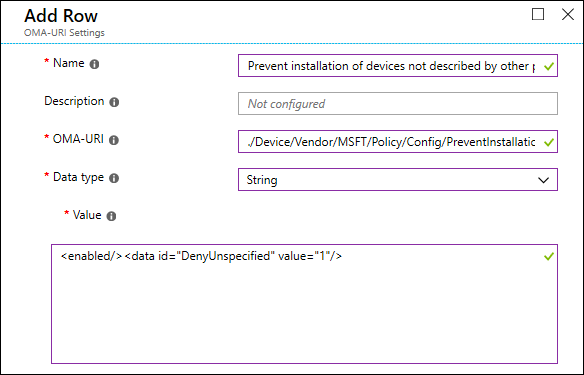
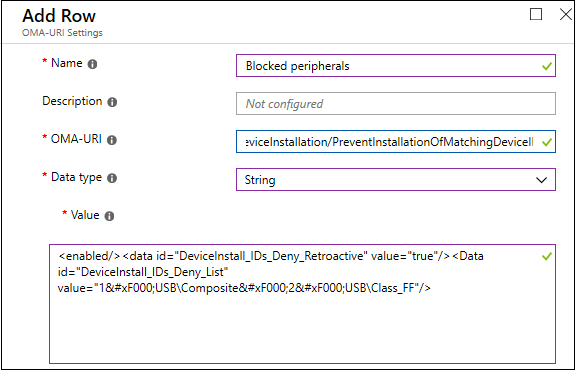
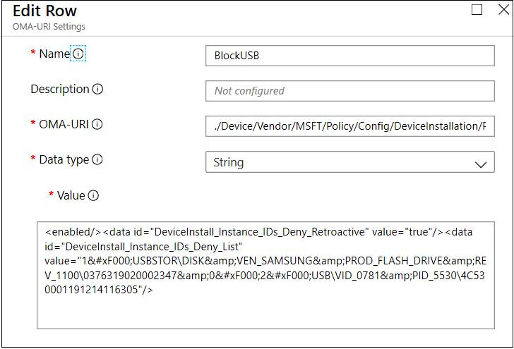

# Policy CSP - DeviceInstallation


<hr/>

<!--Policies-->
## DeviceInstallation policies  

<dl>
  <dd>
    <a href="#deviceinstallationallowinstallationofmatchingdeviceids">DeviceInstallation/AllowInstallationOfMatchingDeviceIDs</a>
  </dd>
  <dd>
    <a href="#deviceinstallationallowinstallationofmatchingdeviceinstanceids">DeviceInstallation/AllowInstallationOfMatchingDeviceInstanceIDs</a>
  </dd>
  <dd>
    <a href="#deviceinstallationallowinstallationofmatchingdevicesetupclasses">DeviceInstallation/AllowInstallationOfMatchingDeviceSetupClasses</a>
  </dd>
 <dd>
    <a href="#deviceinstallationenableinstallationpolicylayering">DeviceInstallation/EnableInstallationPolicyLayering</a>
  </dd>
  <dd>
    <a href="#deviceinstallationpreventdevicemetadatafromnetwork">DeviceInstallation/PreventDeviceMetadataFromNetwork</a>
  </dd>
  <dd>
    <a href="#deviceinstallationpreventinstallationofdevicesnotdescribedbyotherpolicysettings">DeviceInstallation/PreventInstallationOfDevicesNotDescribedByOtherPolicySettings</a>
  </dd>
  <dd>
    <a href="#deviceinstallationpreventinstallationofmatchingdeviceids">DeviceInstallation/PreventInstallationOfMatchingDeviceIDs</a>
  </dd>
  <dd>
    <a href="#deviceinstallationpreventinstallationofmatchingdeviceinstanceids">DeviceInstallation/PreventInstallationOfMatchingDeviceInstanceIDs</a>
  </dd>
  <dd>
    <a href="#deviceinstallationpreventinstallationofmatchingdevicesetupclasses">DeviceInstallation/PreventInstallationOfMatchingDeviceSetupClasses</a>
  </dd>
</dl>


<hr/>

<!--Policy-->
## DeviceInstallation/AllowInstallationOfMatchingDeviceIDs

<!--SupportedSKUs-->
<table>
<tr>
    <th>Windows Edition</th>
    <th>Supported?</th>
</tr>
<tr>
    <td>Home</td>
    <td></td>
</tr>
<tr>
    <td>Pro</td>
    <td><sup>5</sup></td>
</tr>
<tr>
    <td>Business</td>
    <td><sup>5</sup></td>
</tr>
<tr>
    <td>Enterprise</td>
    <td><sup>5</sup></td>
</tr>
<tr>
    <td>Education</td>
    <td><sup>5</sup></td>
</tr>
</table>

<!--/SupportedSKUs-->
<hr/>

<!--Scope-->
[Scope](./policy-configuration-service-provider.md#policy-scope):

> [!div class = "checklist"]
> * Device

<hr/>

<!--/Scope-->
<!--Description-->
This policy setting allows you to specify a list of plug-and-play hardware IDs and compatible IDs for devices that Windows is allowed to install. 

> [!TIP]
> This policy setting is intended to be used only when the "Apply layered order of evaluation for Allow and Prevent device installation policies across all device match criteria" policy setting is enabled, however it may also be used with the "Prevent installation of devices not described by other policy settings" policy setting for legacy policy definitions.

When this policy setting is enabled together with the "Apply layered order of evaluation for Allow and Prevent device installation policies across all device match criteria" policy setting, Windows is allowed to install or update any device whose Plug and Play hardware ID or compatible ID appears in the list you create, unless another policy setting at the same or higher layer in the hierarchy specifically prevents that installation, such as the following policy settings:
- Prevent installation of devices that match these device IDs
- Prevent installation of devices that match any of these device instance IDs

If the "Apply layered order of evaluation for Allow and Prevent device installation policies across all device match criteria" policy setting is not enabled with this policy setting, then any other policy settings specifically preventing installation will take precedence.
> [!NOTE]
> The "Prevent installation of devices not described by other policy settings" policy setting has been replaced by the "Apply layered order of evaluation for Allow and Prevent device installation policies across all device match criteria" policy setting for supported target Windows 10 versions. It is recommended that you use the "Apply layered order of evaluation for Allow and Prevent device installation policies across all device match criteria" policy setting when possible.

Alternatively, if this policy setting is enabled together with the "Prevent installation of devices not described by other policy settings" policy setting, Windows is allowed to install or update driver packages whose device setup class GUIDs appear in the list you create, unless another policy setting specifically prevents installation (for example, the "Prevent installation of devices that match these device IDs" policy setting, the "Prevent installation of devices for these device classes" policy setting, the "Prevent installation of devices that match any of these device instance IDs" policy setting, or the "Prevent installation of removable devices" policy setting).

If you enable this policy setting on a remote desktop server, the policy setting affects redirection of the specified devices from a remote desktop client to the remote desktop server.
If you disable or do not configure this policy setting, and no other policy setting describes the device, the "Prevent installation of devices not described by other policy settings" policy setting determines whether the device can be installed.

Peripherals can be specified by their [hardware identity](/windows-hardware/drivers/install/device-identification-strings). For a list of common identifier structures, see [Device Identifier Formats](/windows-hardware/drivers/install/device-identifier-formats). Test the configuration prior to rolling it out to ensure it allows the devices expected. Ideally test various instances of the hardware. For example, test multiple USB keys rather than only one.


<!--/Description-->
> [!TIP]
> This is an ADMX-backed policy and requires a special SyncML format to enable or disable.  For details, see [Understanding ADMX-backed policies](./understanding-admx-backed-policies.md).
> 
> You must specify the data type in the SyncML as &lt;Format&gt;chr&lt;/Format&gt;. For an example SyncML, refer to [Enabling a policy](./understanding-admx-backed-policies.md#enabling-a-policy).
> 
> The payload of the SyncML must be XML-encoded; for this XML encoding, there are a variety of online encoders that you can use. To avoid encoding the payload, you can use CDATA if your MDM supports it.  For more information, see [CDATA Sections](http://www.w3.org/TR/REC-xml/#sec-cdata-sect).

<!--ADMXBacked-->
ADMX Info:  
-   GP English name: *Allow installation of devices that match any of these device IDs*
-   GP name: *DeviceInstall_IDs_Allow*
-   GP path: *System/Device Installation/Device Installation Restrictions*
-   GP ADMX file name: *deviceinstallation.admx*

<!--/ADMXBacked-->
<!--SupportedValues-->

<!--/SupportedValues-->
<!--Example-->
To enable this policy, use the following SyncML. This example allows Windows to install compatible devices with a device ID of USB\Composite or USB\Class_FF. To configure multiple classes, use `&#xF000;` as a delimiter. 


```xml
<SyncML>
    <SyncBody>
        <Replace>
            <CmdID>$CmdID$</CmdID>
            <Item>
                <Target>
                    <LocURI>./Device/Vendor/MSFT/Policy/Config/DeviceInstallation/AllowInstallationOfMatchingDeviceIDs</LocURI>
                </Target>
                <Meta>
                    <Format xmlns="syncml:metinf">string</Format>
                </Meta>
                <Data><enabled/><Data id="DeviceInstall_IDs_Allow_List" value="1&#xF000;USB\Composite&#xF000;2&#xF000;USB\Class_FF"/></Data>
                </Item>
        </Replace>
    </SyncBody>
</SyncML>
```

To verify that the policy is applied, check C:\windows\INF\setupapi.dev.log and see if the following is listed near the end of the log:

```txt
>>>  [Device Installation Restrictions Policy Check]
>>>  Section start 2018/11/15 12:26:41.659
<<<  Section end 2018/11/15 12:26:41.751
<<<  [Exit status: SUCCESS]
```
<!--/Example-->
<!--Validation-->

<!--/Validation-->
<!--/Policy-->

<hr/>

<!--Policy-->
## DeviceInstallation/AllowInstallationOfMatchingDeviceInstanceIDs

<!--SupportedSKUs-->
<table>
<tr>
    <th>Windows Edition</th>
    <th>Supported?</th>
</tr>
<tr>
    <td>Home</td>
    <td></td>
</tr>
<tr>
    <td>Pro</td>
    <td><sup>6</sup></td>
</tr>
<tr>
    <td>Business</td>
    <td><sup>6</sup></td>
</tr>
<tr>
    <td>Enterprise</td>
    <td><sup>6</sup></td>
</tr>
<tr>
    <td>Education</td>
    <td><sup>6</sup></td>
</tr>
</table>

<!--/SupportedSKUs-->
<hr/>

<!--Scope-->
[Scope](./policy-configuration-service-provider.md#policy-scope):

> [!div class = "checklist"]
> * Device

<hr/>

<!--/Scope-->
<!--Description-->
Added in Windows 10, version 1903. Also available in Windows 10, version 1809. This policy setting allows you to specify a list of Plug and Play device instance IDs for devices that Windows is allowed to install. Use this policy setting only when the "Prevent installation of devices not described by other policy settings" policy setting is enabled. Other policy settings that prevent device installation take precedence over this one.

If you enable this policy setting, Windows is allowed to install or update any device whose Plug and Play device instance ID appears in the list you create, unless another policy setting specifically prevents that installation (for example, the "Prevent installation of devices that match any of these device IDs" policy setting, the "Prevent installation of devices for these device classes" policy setting, the "Prevent installation of devices that match any of these device instance IDs" policy setting, or the "Prevent installation of removable devices" policy setting). If you enable this policy setting on a remote desktop server, the policy setting affects redirection of the specified devices from a remote desktop client to the remote desktop server.

If you disable or do not configure this policy setting, and no other policy setting describes the device, the "Prevent installation of devices not described by other policy settings" policy setting determines whether the device can be installed.

Peripherals can be specified by their [device instance ID](/windows-hardware/drivers/install/device-instance-ids). Test the configuration prior to rolling it out to ensure it allows the devices expected. Ideally test various instances of the hardware. For example, test multiple USB keys rather than only one.

<!--/Description-->
> [!TIP]
> This is an ADMX-backed policy and requires a special SyncML format to enable or disable.  For details, see [Understanding ADMX-backed policies](./understanding-admx-backed-policies.md).
> 
> You must specify the data type in the SyncML as &lt;Format&gt;chr&lt;/Format&gt;. For an example SyncML, refer to [Enabling a policy](./understanding-admx-backed-policies.md#enabling-a-policy).
> 
> The payload of the SyncML must be XML-encoded; for this XML encoding, there are a variety of online encoders that you can use. To avoid encoding the payload, you can use CDATA if your MDM supports it.  For more information, see [CDATA Sections](http://www.w3.org/TR/REC-xml/#sec-cdata-sect).

<!--ADMXBacked-->
ADMX Info:  
-   GP English name: *Allow installation of devices that match any of these device instance IDs*
-   GP name: *DeviceInstall_Instance_IDs_Allow*
-   GP path: *System/Device Installation/Device Installation Restrictions*
-   GP ADMX file name: *deviceinstallation.admx*

<!--/ADMXBacked-->
<!--SupportedValues-->

<!--/SupportedValues-->
<!--Example-->
To enable this policy, use the following SyncML. 

``` xml
<SyncML>
    <SyncBody>
        <Replace>
            <CmdID>$CmdID$</CmdID>
            <Item>
                <Target>
                    <LocURI>./Device/Vendor/MSFT/Policy/Config/DeviceInstallation/AllowInstallationOfMatchingDeviceInstanceIDs</LocURI>
                </Target>
                <Meta>
                    <Format xmlns="syncml:metinf">string</Format>
                </Meta>
                <Data><enabled/><Data id="DeviceInstall_Instance_IDs_Allow_List" value="1&#xF000;USB\VID_1F75&amp;PID_0917\47802411805883"/></Data>
                </Item>
        </Replace>
    </SyncBody>
</SyncML>
```
To verify the policy is applied, check C:\windows\INF\setupapi.dev.log and see if the following is listed near the end of the log:
``` txt
>>>  [Device Installation Restrictions Policy Check]
>>>  Section start 2018/11/15 12:26:41.659
<<<  Section end 2018/11/15 12:26:41.751
<<<  [Exit status: SUCCESS]
```
<!--/Example-->
<!--Validation-->

<!--/Validation-->
<!--/Policy-->

<hr/>

<!--Policy-->
## DeviceInstallation/AllowInstallationOfMatchingDeviceSetupClasses

<!--SupportedSKUs-->
<table>
<tr>
    <th>Windows Edition</th>
    <th>Supported?</th>
</tr>
<tr>
    <td>Home</td>
    <td></td>
</tr>
<tr>
    <td>Pro</td>
    <td><sup>5</sup></td>
</tr>
<tr>
    <td>Business</td>
    <td><sup>5</sup></td>
</tr>
<tr>
    <td>Enterprise</td>
    <td><sup>5</sup></td>
</tr>
<tr>
    <td>Education</td>
    <td><sup>5</sup></td>
</tr>
</table>

<!--/SupportedSKUs-->
<hr/>

<!--Scope-->
[Scope](./policy-configuration-service-provider.md#policy-scope):

> [!div class = "checklist"]
> * Device

<hr/>

<!--/Scope-->
<!--Description-->
This policy setting allows you to specify a list of device setup class globally unique identifiers (GUIDs) for device drivers that Windows is allowed to install. 

> [!TIP]
> Use this policy setting only when the "Prevent installation of devices not described by other policy settings" policy setting is enabled. Other policy settings that prevent device installation take precedence over this one.

If you enable this policy setting, Windows is allowed to install or update device drivers whose device setup class GUIDs appear in the list you create, unless another policy setting specifically prevents installation (for example, the "Prevent installation of devices that match these device IDs" policy setting, the "Prevent installation of devices for these device classes" policy setting, or the "Prevent installation of removable devices" policy setting). If you enable this policy setting on a remote desktop server, the policy setting affects redirection of the specified devices from a remote desktop client to the remote desktop server.

This setting allows device installation based on the serial number of a removable device if that number is in the hardware ID.

If you disable or do not configure this policy setting, and no other policy setting describes the device, the "Prevent installation of devices not described by other policy settings" policy setting determines whether the device can be installed.

Peripherals can be specified by their [hardware identity](/windows-hardware/drivers/install/device-identification-strings). For a list of common identifier structures, see [Device Identifier Formats](/windows-hardware/drivers/install/device-identifier-formats). Test the configuration prior to rolling it out to ensure it allows the devices expected. Ideally test various instances of the hardware. For example, test multiple USB keys rather than only one.


<!--/Description-->
> [!TIP]
> This is an ADMX-backed policy and requires a special SyncML format to enable or disable.  For details, see [Understanding ADMX-backed policies](./understanding-admx-backed-policies.md).
> 
> You must specify the data type in the SyncML as &lt;Format&gt;chr&lt;/Format&gt;. For an example SyncML, refer to [Enabling a policy](./understanding-admx-backed-policies.md#enabling-a-policy).
> 
> The payload of the SyncML must be XML-encoded; for this XML encoding, there are a variety of online encoders that you can use. To avoid encoding the payload, you can use CDATA if your MDM supports it.  For more information, see [CDATA Sections](http://www.w3.org/TR/REC-xml/#sec-cdata-sect).

<!--ADMXBacked-->
ADMX Info:  
-   GP English name: *Allow installation of devices using drivers that match these device setup classes*
-   GP name: *DeviceInstall_Classes_Allow*
-   GP path: *System/Device Installation/Device Installation Restrictions*
-   GP ADMX file name: *deviceinstallation.admx*

<!--/ADMXBacked-->
<!--SupportedValues-->

<!--/SupportedValues-->
<!--Example-->
To enable this policy, use the following SyncML. This example allows Windows to install:

- Floppy Disks, ClassGUID = {4d36e980-e325-11ce-bfc1-08002be10318}
- CD ROMs, ClassGUID = {4d36e965-e325-11ce-bfc1-08002be10318}
- Modems, ClassGUID = {4d36e96d-e325-11ce-bfc1-08002be10318}

Enclose the class GUID within curly brackets {}. To configure multiple classes, use `&#xF000;` as a delimiter. 


```xml
<SyncML>
    <SyncBody>
        <Replace>
            <CmdID>$CmdID$</CmdID>
            <Item>
                <Target>
                    <LocURI>./Device/Vendor/MSFT/Policy/Config/DeviceInstallation/AllowInstallationOfMatchingDeviceSetupClasses</LocURI>
                </Target>
                <Meta>
                    <Format xmlns="syncml:metinf">string</Format>
                </Meta>
                <Data><enabled/><Data id="DeviceInstall_Classes_Allow_List" value="1&#xF000;{4d36e980-e325-11ce-bfc1-08002be10318}&#xF000;2&#xF000;{4d36e965-e325-11ce-bfc1-08002be10318}&#xF000;3&#xF000;{4d36e96d-e325-11ce-bfc1-08002be10318}"/></Data>
                </Item>
        </Replace>
    </SyncBody>
</SyncML>
```

To verify that the policy is applied, check C:\windows\INF\setupapi.dev.log and see if the following is listed near the end of the log:


```txt
>>>  [Device Installation Restrictions Policy Check]
>>>  Section start 2018/11/15 12:26:41.659
<<<  Section end 2018/11/15 12:26:41.751
<<<  [Exit status: SUCCESS]
```
<!--/Example-->
<!--Validation-->

<!--/Validation-->
<!--/Policy-->

<hr/>

<!--Policy-->
## DeviceInstallation/EnableInstallationPolicyLayering

<!--SupportedSKUs-->
<table>
<tr>
    <th>Windows Edition</th>
    <th>Supported?</th>
</tr>
<tr>
    <td>Home</td>
    <td></td>
</tr>
<tr>
    <td>Pro</td>
    <td><sup>5</sup></td>
</tr>
<tr>
    <td>Business</td>
    <td><sup>5</sup></td>
</tr>
<tr>
    <td>Enterprise</td>
    <td><sup>5</sup></td>
</tr>
<tr>
    <td>Education</td>
    <td><sup>5</sup></td>
</tr>
</table>

<!--/SupportedSKUs-->
<hr/>

<!--Scope-->
[Scope](./policy-configuration-service-provider.md#policy-scope):

> [!div class = "checklist"]
> * Device
Added in Windows 10, Version 2106
<hr/>

<!--/Scope-->
<!--Description-->
This policy setting will change the evaluation order in which Allow and Prevent policy settings are applied when more than one install policy setting is applicable for a given device. Enable this policy setting to ensure that overlapping device match criteria is applied based on an established hierarchy where more specific match criteria supersedes less specific match criteria. The hierarchical order of evaluation for policy settings that specify device match criteria is as follows:

Device instance IDs > Device IDs > Device setup class > Removable devices 

**Device instance IDs**
- Prevent installation of devices using drivers that match these device instance IDs.
- Allow installation of devices using drivers that match these device instance IDs.

**Device IDs**
- Prevent installation of devices using drivers that match these device IDs.
- Allow installation of devices using drivers that match these device IDs.

**Device setup class**
- Prevent installation of devices using drivers that match these device setup classes.
- Allow installation of devices using drivers that match these device setup classes.

**Removable devices**
- Prevent installation of removable devices.

> [!NOTE]
> This policy setting provides more granular control than the "Prevent installation of devices not described by other policy settings" policy setting. If these conflicting policy settings are enabled at the same time, the "Apply layered order of evaluation for Allow and Prevent device installation policies across all device match criteria" policy setting will be enabled and the other policy setting will be ignored.

If you disable or do not configure this policy setting, the default evaluation is used. By default, all "Prevent installation..." policy settings have precedence over any other policy setting that allows Windows to install a device.

<!--/Description-->
> [!TIP]
> This is an ADMX-backed policy and requires a special SyncML format to enable or disable.  For details, see [Understanding ADMX-backed policies](./understanding-admx-backed-policies.md).
> 
> You must specify the data type in the SyncML as &lt;Format&gt;chr&lt;/Format&gt;. For an example SyncML, refer to [Enabling a policy](./understanding-admx-backed-policies.md#enabling-a-policy).
> 
> The payload of the SyncML must be XML-encoded; for this XML encoding, there are a variety of online encoders that you can use. To avoid encoding the payload, you can use CDATA if your MDM supports it.  For more information, see [CDATA Sections](http://www.w3.org/TR/REC-xml/#sec-cdata-sect).

<!--ADMXBacked-->
ADMX Info:  
-   GP English name: *Apply layered order of evaluation for Allow and Prevent device installation policies across all device match criteria*
-   GP name: *DeviceInstall_Allow_Deny_Layered*
-   GP path: *System/Device Installation/Device Installation Restrictions*
-   GP ADMX file name: *deviceinstallation.admx*

<!--/ADMXBacked-->
<!--SupportedValues-->

<!--/SupportedValues-->
<!--Example-->
To enable this policy, use the following SyncML. This example applies a layered order of evaluation for Allow and Prevent device installation policies across all device match criteria:

- Floppy Disks, ClassGUID = {4d36e980-e325-11ce-bfc1-08002be10318}
- CD ROMs, ClassGUID = {4d36e965-e325-11ce-bfc1-08002be10318}
- Modems, ClassGUID = {4d36e96d-e325-11ce-bfc1-08002be10318}

Enclose the class GUID within curly brackets {}. To configure multiple classes, use `&#xF000;` as a delimiter. 


```xml
<SyncML>
    <SyncBody>
        <Replace>
            <CmdID>$CmdID$</CmdID>
            <Item>
                <Target>
                    <LocURI>./Device/Vendor/MSFT/Policy/Config/DeviceInstallation/EnableInstallationPolicyLayering</LocURI>
                </Target>
                <Meta>
                    <Format xmlns="syncml:metinf">string</Format>
                </Meta>
                <Data><enabled/><Data id="AllowDenyLayered" value="1"/></Data>;
                </Item>
        </Replace>
    </SyncBody>
</SyncML>
```

To verify that the policy is applied, check C:\windows\INF\setupapi.dev.log and see if the following is listed near the end of the log:


```txt
>>>  [Device Installation Restrictions Policy Check]
>>>  Section start 2018/11/15 12:26:41.659
<<<  Section end 2018/11/15 12:26:41.751
<<<  [Exit status: SUCCESS]
```
You can also change the evaluation order of device installation policy settings by using a custom profile in Intune.

:::image type="content" source="images/edit-row.png" alt-text="This is a edit row image":::

<!--/Example-->
<!--Validation-->

<!--/Validation-->
<!--/Policy-->
<hr/>

<!--Policy-->
## DeviceInstallation/PreventDeviceMetadataFromNetwork

<!--SupportedSKUs-->
<table>
<tr>
    <th>Windows Edition</th>
    <th>Supported?</th>
</tr>
<tr>
    <td>Home</td>
    <td></td>
</tr>
<tr>
    <td>Pro</td>
    <td><sup>5</sup></td>
</tr>
<tr>
    <td>Business</td>
    <td><sup>5</sup></td>
</tr>
<tr>
    <td>Enterprise</td>
    <td><sup>5</sup></td>
</tr>
<tr>
    <td>Education</td>
    <td><sup>5</sup></td>
</tr>
</table>

<!--/SupportedSKUs-->
<hr/>

<!--Scope-->
[Scope](./policy-configuration-service-provider.md#policy-scope):

> [!div class = "checklist"]
> * Device

<hr/>

<!--/Scope-->
<!--Description-->
This policy setting allows you to prevent Windows from retrieving device metadata from the Internet.

If you enable this policy setting, Windows does not retrieve device metadata for installed devices from the Internet. This policy setting overrides the setting in the Device Installation Settings dialog box (Control Panel > System and Security > System > Advanced System Settings > Hardware tab).

If you disable or do not configure this policy setting, the setting in the Device Installation Settings dialog box controls whether Windows retrieves device metadata from the Internet.

<!--/Description-->
> [!TIP]
> This is an ADMX-backed policy and requires a special SyncML format to enable or disable.  For details, see [Understanding ADMX-backed policies](./understanding-admx-backed-policies.md).
> 
> You must specify the data type in the SyncML as &lt;Format&gt;chr&lt;/Format&gt;. For an example SyncML, refer to [Enabling a policy](./understanding-admx-backed-policies.md#enabling-a-policy).
> 
> The payload of the SyncML must be XML-encoded; for this XML encoding, there are a variety of online encoders that you can use. To avoid encoding the payload, you can use CDATA if your MDM supports it.  For more information, see [CDATA Sections](http://www.w3.org/TR/REC-xml/#sec-cdata-sect).

<!--ADMXBacked-->
ADMX Info:  
-   GP English name: *Prevent device metadata retrieval from the Internet*
-   GP name: *DeviceMetadata_PreventDeviceMetadataFromNetwork*
-   GP path: *System/Device Installation*
-   GP ADMX file name: *DeviceSetup.admx*

<!--/ADMXBacked-->
<!--SupportedValues-->

<!--/SupportedValues-->
<!--Example-->

<!--/Example-->
<!--Validation-->

<!--/Validation-->
<!--/Policy-->

<hr/>

<!--Policy-->
## DeviceInstallation/PreventInstallationOfDevicesNotDescribedByOtherPolicySettings

<!--SupportedSKUs-->
<table>
<tr>
    <th>Windows Edition</th>
    <th>Supported?</th>
</tr>
<tr>
    <td>Home</td>
    <td></td>
</tr>
<tr>
    <td>Pro</td>
    <td><sup>5</sup></td>
</tr>
<tr>
    <td>Business</td>
    <td><sup>5</sup></td>
</tr>
<tr>
    <td>Enterprise</td>
    <td><sup>5</sup></td>
</tr>
<tr>
    <td>Education</td>
    <td><sup>5</sup></td>
</tr>
</table>

<!--/SupportedSKUs-->
<hr/>

<!--Scope-->
[Scope](./policy-configuration-service-provider.md#policy-scope):

> [!div class = "checklist"]
> * Device

<hr/>

<!--/Scope-->
<!--Description-->
This policy setting allows you to prevent the installation of devices that are not specifically described by any other policy setting.

> [!NOTE]
> This policy setting has been replaced by the "Apply layered order of evaluation for Allow and Prevent device installation policies across all device match criteria" policy setting to provide more granular control. It is recommended that you use the "Apply layered order of evaluation for Allow and Prevent device installation policies across all device match criteria" policy setting instead of this policy setting.

If you enable this policy setting, Windows is prevented from installing or updating the driver package for any device that is not described by either the "Allow installation of devices that match any of these device IDs", the "Allow installation of devices for these device classes", or the "Allow installation of devices that match any of these device instance IDs" policy setting.

If you disable or do not configure this policy setting, Windows is allowed to install or update the driver package for any device that is not described by the "Prevent installation of devices that match any of these device IDs", "Prevent installation of devices for these device classes" policy setting, "Prevent installation of devices that match any of these device instance IDs", or "Prevent installation of removable devices" policy setting.

<!--/Description-->
> [!TIP]
> This is an ADMX-backed policy and requires a special SyncML format to enable or disable.  For details, see [Understanding ADMX-backed policies](./understanding-admx-backed-policies.md).
> 
> You must specify the data type in the SyncML as &lt;Format&gt;chr&lt;/Format&gt;. For an example SyncML, refer to [Enabling a policy](./understanding-admx-backed-policies.md#enabling-a-policy).
> 
> The payload of the SyncML must be XML-encoded; for this XML encoding, there are a variety of online encoders that you can use. To avoid encoding the payload, you can use CDATA if your MDM supports it.  For more information, see [CDATA Sections](http://www.w3.org/TR/REC-xml/#sec-cdata-sect).

<!--ADMXBacked-->
ADMX Info:  
-   GP English name: *Prevent installation of devices not described by other policy settings*
-   GP name: *DeviceInstall_Unspecified_Deny*
-   GP path: *System/Device Installation/Device Installation Restrictions*
-   GP ADMX file name: *deviceinstallation.admx*

<!--/ADMXBacked-->
<!--SupportedValues-->

<!--/SupportedValues-->
<!--Example-->
To enable this policy, use the following SyncML. This example prevents Windows from installing devices that are not specifically described by any other policy setting. 


```xml
<SyncML>
    <SyncBody>
        <Replace>
            <CmdID>$CmdID$</CmdID>
            <Item>
                <Target>
                    <LocURI>./Device/Vendor/MSFT/Policy/Config/DeviceInstallation/PreventInstallationOfDevicesNotDescribedByOtherPolicySettings</LocURI>
                </Target>
                <Meta>
                    <Format xmlns="syncml:metinf">string</Format>
                </Meta>
                <Data><enabled/><data id="DenyUnspecified" value="1"/></Data>
                </Item>
        </Replace>
    </SyncBody>
</SyncML>
```

To verify the policy is applied, check C:\windows\INF\setupapi.dev.log and see if the following is listed near the end of the log:

```txt
>>>  [Device Installation Restrictions Policy Check]
>>>  Section start 2018/11/15 12:26:41.659
<<<  Section end 2018/11/15 12:26:41.751
<<<  [Exit status: SUCCESS]
```

You can also block installation by using a custom profile in Intune. 


<!--/Example-->
<!--Validation-->

<!--/Validation-->
<!--/Policy-->

<hr/>

<!--Policy-->
## DeviceInstallation/PreventInstallationOfMatchingDeviceIDs

<!--SupportedSKUs-->
<table>
<tr>
    <th>Windows Edition</th>
    <th>Supported?</th>
</tr>
<tr>
    <td>Home</td>
    <td></td>
</tr>
<tr>
    <td>Pro</td>
    <td></td>
</tr>
<tr>
    <td>Business</td>
    <td></td>
</tr>
<tr>
    <td>Enterprise</td>
    <td></td>
</tr>
<tr>
    <td>Education</td>
    <td></td>
</tr>
</table>

<!--/SupportedSKUs-->
<hr/>

<!--Scope-->
[Scope](./policy-configuration-service-provider.md#policy-scope):

> [!div class = "checklist"]
> * Device

<hr/>

<!--/Scope-->
<!--Description-->
This policy setting allows you to specify a list of Plug and Play hardware IDs and compatible IDs for devices that Windows is prevented from installing. By default, this policy setting takes precedence over any other policy setting that allows Windows to install a device.

> [!NOTE]
> To enable the "Allow installation of devices that match any of these device instance IDs" policy setting to supersede this policy setting for applicable devices, enable the "Apply layered order of evaluation for Allow and Prevent device installation policies across all device match criteria" policy setting.

If you enable this policy setting, Windows is prevented from installing a device whose hardware ID or compatible ID appears in the list you create. If you enable this policy setting on a remote desktop server, the policy setting affects redirection of the specified devices from a remote desktop client to the remote desktop server.

If you disable or do not configure this policy setting, devices can be installed and updated as allowed or prevented by other policy settings.

Peripherals can be specified by their [hardware identity](/windows-hardware/drivers/install/device-identification-strings). For a list of common identifier structures, see [Device Identifier Formats](/windows-hardware/drivers/install/device-identifier-formats). Test the configuration prior to rolling it out to ensure it blocks the devices expected. Ideally test various instances of the hardware. For example, test multiple USB keys rather than only one.

<!--/Description-->
> [!TIP]
> This is an ADMX-backed policy and requires a special SyncML format to enable or disable.  For details, see [Understanding ADMX-backed policies](./understanding-admx-backed-policies.md).
> 
> You must specify the data type in the SyncML as &lt;Format&gt;chr&lt;/Format&gt;. For an example SyncML, refer to [Enabling a policy](./understanding-admx-backed-policies.md#enabling-a-policy).
> 
> The payload of the SyncML must be XML-encoded; for this XML encoding, there are a variety of online encoders that you can use. To avoid encoding the payload, you can use CDATA if your MDM supports it.  For more information, see [CDATA Sections](http://www.w3.org/TR/REC-xml/#sec-cdata-sect).

<!--ADMXBacked-->
ADMX Info:  
-   GP English name: *Prevent installation of devices that match any of these device IDs*
-   GP name: *DeviceInstall_IDs_Deny*
-   GP path: *System/Device Installation/Device Installation Restrictions*
-   GP ADMX file name: *deviceinstallation.admx*

<!--/ADMXBacked-->
<!--SupportedValues-->

<!--/SupportedValues-->
<!--Example-->
<hr/>
To enable this policy, use the following SyncML. This example prevents Windows from installing compatible devices with a device ID of USB\Composite or USB\Class_FF. To configure multiple classes, use <code>&amp;#xF000;</code> as a delimiter. To apply the policy to matching device classes that are already installed, set DeviceInstall_IDs_Deny_Retroactive to true. 


```xml
<SyncML>
    <SyncBody>
        <Replace>
            <CmdID>$CmdID$</CmdID>
            <Item>
                <Target>
                    <LocURI>./Device/Vendor/MSFT/Policy/Config/DeviceInstallation/PreventInstallationOfMatchingDeviceIDs</LocURI>
                </Target>
                <Meta>
                    <Format xmlns="syncml:metinf">string</Format>
                </Meta>
                <Data><enabled/><data id="DeviceInstall_IDs_Deny_Retroactive" value="true"/><Data id="DeviceInstall_IDs_Deny_List" value="1&#xF000;USB\Composite&#xF000;2&#xF000;USB\Class_FF"/></Data>
                </Item>
        </Replace>
    </SyncBody>
</SyncML>
```

To verify the policy is applied, check C:\windows\INF\setupapi.dev.log and see if the following is listed near the end of the log:

```txt
>>>  [Device Installation Restrictions Policy Check]
>>>  Section start 2018/11/15 12:26:41.659
<<<  Section end 2018/11/15 12:26:41.751
<<<  [Exit status: SUCCESS]
```

You can also block installation and usage of prohibited peripherals by using a custom profile in Intune. 

For example, this custom profile blocks installation and usage of USB devices with hardware IDs "USB\Composite" and "USB\Class_FF", and applies to USB devices with matching hardware IDs that are already installed.


<!--/Example-->
<!--Validation-->

<!--/Validation-->
<!--/Policy-->

<hr/>

<!--Policy-->
## DeviceInstallation/PreventInstallationOfMatchingDeviceInstanceIDs

<!--SupportedSKUs-->
<table>
<tr>
    <th>Windows Edition</th>
    <th>Supported?</th>
</tr>
<tr>
    <td>Home</td>
    <td></td>
</tr>
<tr>
    <td>Pro</td>
    <td><sup>6</sup></td>
</tr>
<tr>
    <td>Business</td>
    <td><sup>6</sup></td>
</tr>
<tr>
    <td>Enterprise</td>
    <td><sup>6</sup></td>
</tr>
<tr>
    <td>Education</td>
    <td><sup>6</sup></td>
</tr>
</table>

<!--/SupportedSKUs-->
<hr/>

<!--Scope-->
[Scope](./policy-configuration-service-provider.md#policy-scope):

> [!div class = "checklist"]
> * Device

<hr/>

<!--/Scope-->
<!--Description-->
Added in Windows 10, version 1903. Also available in Windows 10, version 1809. This policy setting allows you to specify a list of Plug and Play device instance IDs for devices that Windows is prevented from installing. This policy setting takes precedence over any other policy setting that allows Windows to install a device.

If you enable this policy setting, Windows is prevented from installing a device whose device instance ID appears in the list you create. If you enable this policy setting on a remote desktop server, the policy setting affects redirection of the specified devices from a remote desktop client to the remote desktop server.

If you disable or do not configure this policy setting, devices can be installed and updated as allowed or prevented by other policy settings.

Peripherals can be specified by their [device instance ID](/windows-hardware/drivers/install/device-instance-ids). Test the configuration prior to rolling it out to ensure it allows the devices expected. Ideally test various instances of the hardware. For example, test multiple USB keys rather than only one.

<!--/Description-->
> [!TIP]
> This is an ADMX-backed policy and requires a special SyncML format to enable or disable.  For details, see [Understanding ADMX-backed policies](./understanding-admx-backed-policies.md).
> 
> You must specify the data type in the SyncML as &lt;Format&gt;chr&lt;/Format&gt;. For an example SyncML, refer to [Enabling a policy](./understanding-admx-backed-policies.md#enabling-a-policy).
> 
> The payload of the SyncML must be XML-encoded; for this XML encoding, there are a variety of online encoders that you can use. To avoid encoding the payload, you can use CDATA if your MDM supports it.  For more information, see [CDATA Sections](http://www.w3.org/TR/REC-xml/#sec-cdata-sect).

<!--ADMXBacked-->
ADMX Info:  
-   GP English name: *Prevent installation of devices that match any of these device instance IDs*
-   GP name: *DeviceInstall_Instance_IDs_Deny*
-   GP path: *System/Device Installation/Device Installation Restrictions*
-   GP ADMX file name: *deviceinstallation.admx*

<!--/ADMXBacked-->
<!--SupportedValues-->

<!--/SupportedValues-->
<!--Example-->
To enable this policy, use the following SyncML. This example prevents Windows from installing compatible devices with device instance IDs of USB\VID_1F75 and USB\VID_0781. To configure multiple classes, use `&#xF000;` as a delimiter.

``` xml
<SyncML>
    <SyncBody>
        <Replace>
            <CmdID>$CmdID$</CmdID>
            <Item>
                <Target>
                    <LocURI>./Device/Vendor/MSFT/Policy/Config/DeviceInstallation/PreventInstallationOfMatchingDeviceInstanceIDs</LocURI>
                </Target>
                <Meta>
                    <Format xmlns="syncml:metinf">string</Format>
                </Meta>
                <Data><enabled/><data id="DeviceInstall_Instance_IDs_Deny_Retroactive" value="true"/><Data id="DeviceInstall_Instance_IDs_Deny_List" value="1&#xF000;USB\VID_1F75&amp;PID_0917\47802411805883&#xF000;2&#xF000;USB\VID_0781&amp;PID_5530\4C530001191214116305"/></Data>
                </Item>
        </Replace>
    </SyncBody>
</SyncML>
```
To verify the policy is applied, check C:\windows\INF\setupapi.dev.log and see if the following is listed near the end of the log:  

``` txt
>>>  [Device Installation Restrictions Policy Check]
>>>  Section start 2018/11/15 12:26:41.659
<<<  Section end 2018/11/15 12:26:41.751
<<<  [Exit status: SUCCESS]
```

You can also block installation and usage of prohibited peripherals by using a custom profile in Intune. 

For example, this custom profile prevents installation of devices with matching device instance IDs.



To prevent installation of devices with matching device instance IDs by using custom profile in Intune:
1. Locate the device instance ID.
2. Replace `&` in the device instance IDs with `&amp;`.  
For example:  
Replace  
```USBSTOR\DISK&VEN_SAMSUNG&PROD_FLASH_DRIVE&REV_1100\0376319020002347&0```  
with  
```USBSTOR\DISK&amp;VEN_SAMSUNG&amp;PROD_FLASH_DRIVE&amp;REV_1100\0376319020002347&amp;0```
    > [!Note]
    > Do not use spaces in the value.
3. Replace the device instance IDs with `&amp;` into the sample SyncML. Add the SyncML into the Intune custom device configuration profile.

<!--/Example-->
<!--Validation-->

<!--/Validation-->
<!--/Policy-->

<hr/>

<!--Policy-->
## DeviceInstallation/PreventInstallationOfMatchingDeviceSetupClasses

<!--SupportedSKUs-->
<table>
<tr>
    <th>Windows Edition</th>
    <th>Supported?</th>
</tr>
<tr>
    <td>Home</td>
    <td></td>
</tr>
<tr>
    <td>Pro</td>
    <td></td>
</tr>
<tr>
    <td>Business</td>
    <td></td>
</tr>
<tr>
    <td>Enterprise</td>
    <td></td>
</tr>
<tr>
    <td>Education</td>
    <td></td>
</tr>
</table>

<!--/SupportedSKUs-->
<hr/>

<!--Scope-->
[Scope](./policy-configuration-service-provider.md#policy-scope):

> [!div class = "checklist"]
> * Device

<hr/>

<!--/Scope-->
<!--Description-->
This policy setting allows you to specify a list of device setup class globally unique identifiers (GUIDs) for driver packages that Windows is prevented from installing. By default, this policy setting takes precedence over any other policy setting that allows Windows to install a device.

> [!NOTE]
> To enable the "Allow installation of devices that match any of these device IDs" and "Allow installation of devices that match any of these device instance IDs" policy settings to supersede this policy setting for applicable devices, enable the "Apply layered order of evaluation for Allow and Prevent device installation policies across all device match criteria" policy setting.

If you enable this policy setting, Windows is prevented from installing or updating driver packages whose device setup class GUIDs appear in the list you create. If you enable this policy setting on a remote desktop server, the policy setting affects redirection of the specified devices from a remote desktop client to the remote desktop server.

If you disable or do not configure this policy setting, Windows can install and update devices as allowed or prevented by other policy settings.


Peripherals can be specified by their [hardware identity](/windows-hardware/drivers/install/device-identification-strings). For a list of common identifier structures, see [Device Identifier Formats](/windows-hardware/drivers/install/device-identifier-formats). Test the configuration prior to rolling it out to ensure it blocks the devices expected. Ideally test various instances of the hardware. For example, test multiple USB keys rather than only one.

<!--/Description-->
> [!TIP]
> This is an ADMX-backed policy and requires a special SyncML format to enable or disable.  For details, see [Understanding ADMX-backed policies](./understanding-admx-backed-policies.md).
> 
> You must specify the data type in the SyncML as &lt;Format&gt;chr&lt;/Format&gt;. For an example SyncML, refer to [Enabling a policy](./understanding-admx-backed-policies.md#enabling-a-policy).
> 
> The payload of the SyncML must be XML-encoded; for this XML encoding, there are a variety of online encoders that you can use. To avoid encoding the payload, you can use CDATA if your MDM supports it.  For more information, see [CDATA Sections](http://www.w3.org/TR/REC-xml/#sec-cdata-sect).

<!--ADMXBacked-->
ADMX Info:  
-   GP English name: *Prevent installation of devices using drivers that match these device setup classes*
-   GP name: *DeviceInstall_Classes_Deny*
-   GP path: *System/Device Installation/Device Installation Restrictions*
-   GP ADMX file name: *deviceinstallation.admx*

<!--/ADMXBacked-->
<!--SupportedValues-->

<!--/SupportedValues-->
<!--Example-->
To enable this policy, use the following SyncML. This example prevents Windows from installing:

- Floppy Disks, ClassGUID = {4d36e980-e325-11ce-bfc1-08002be10318}
- CD ROMs, ClassGUID = {4d36e965-e325-11ce-bfc1-08002be10318}
- Modems, ClassGUID = {4d36e96d-e325-11ce-bfc1-08002be10318}

Enclose the class GUID within curly brackets {}. To configure multiple classes, use `&#xF000;` as a delimiter. To apply the policy to matching device classes that are already installed, set DeviceInstall_Classes_Deny_Retroactive to true. 


```xml
<SyncML>
    <SyncBody>
        <Replace>
            <CmdID>$CmdID$</CmdID>
            <Item>
                <Target>
                    <LocURI>./Device/Vendor/MSFT/Policy/Config/DeviceInstallation/PreventInstallationOfMatchingDeviceSetupClasses</LocURI>
                </Target>
                <Meta>
                    <Format xmlns="syncml:metinf">string</Format>
                </Meta>
                <Data><enabled/><data id="DeviceInstall_Classes_Deny_Retroactive" value="true"/><Data id="DeviceInstall_Classes_Deny_List" value="1&#xF000;{4d36e980-e325-11ce-bfc1-08002be10318}&#xF000;2&#xF000;{4d36e965-e325-11ce-bfc1-08002be10318}&#xF000;3&#xF000;{4d36e96d-e325-11ce-bfc1-08002be10318}"/></Data>
                </Item>
        </Replace>
    </SyncBody>
</SyncML>
```

To verify the policy is applied, check C:\windows\INF\setupapi.dev.log and see if the following is listed near the end of the log:

```txt
>>>  [Device Installation Restrictions Policy Check]
>>>  Section start 2018/11/15 12:26:41.659
<<<  Section end 2018/11/15 12:26:41.751
<<<  [Exit status: SUCCESS]
```
<!--/Example-->
<!--Validation-->

<!--/Validation-->
<!--/Policy-->
<hr/>

Footnotes:

- 1 - Available in Windows 10, version 1607.
- 2 - Available in Windows 10, version 1703.
- 3 - Available in Windows 10, version 1709.
- 4 - Available in Windows 10, version 1803.
- 5 - Available in Windows 10, version 1809.
- 6 - Available in Windows 10, version 1903.
- 7 - Available in Windows 10, version 1909.
- 8 - Available in Windows 10, version 2004.

<!--/Policies-->
