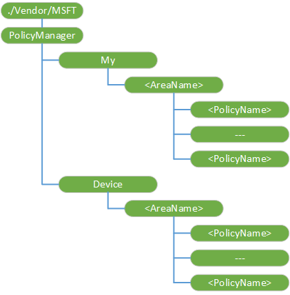

# PolicyManager CSP


The PolicyManager configuration service provider enables the enterprise to configure company policies on Windows 10 Mobile.

> **Note**   The PolicyManager CSP is supported in Windows 10 Mobile for backward compatibility. For Windows 10 devices you should use [Policy CSP](policy-configuration-service-provider.md), which replaces PolicyManager CSP. You can continue to use PolicyManager CSP for Windows Phone 8.1 and Windows Phone 8.1 GDR devices. The PolicyManager CSP will be deprecated some time in the future.

 

The PolicyManager CSP has the following sub-categories:

-   PolicyManager/My/*AreaName* – Handles the policy configuration request from the server.

-   PolicyManager/Device/*AreaName* – Provides a read-only path to policies enforced on the device.

The configuration policies for the same *AreaName* must be wrapped in an Atomic command.

The following image shows the PolicyManager configuration service provider in tree format as used by both the Open Mobile Alliance (OMA) Device Management (DM) and OMA Client Provisioning.



The following list describes the characteristics and parameters.

<a href="" id="--vendor-msft-policymanager"></a>**./Vendor/MSFT/PolicyManager**  
The root node for the PolicyManager configuration service provider.

Supported operation is Get.

<a href="" id="my"></a>**My**  
Node for policies for a specific provider that can be retrieved, modified, or deleted.

Supported operation is Get.

<a href="" id="my--areaname-"></a>**My/****_&lt;AreaName&gt;_**  
The area group that can be configured by a single technology for a single provider. Once added, you cannot change the value.

Supported operations are Add, Get, and Delete.

<a href="" id="my--areaname---policyname-"></a>**My/_&lt;AreaName&gt;_/****_&lt;PolicyName&gt;_**  
Specifies the name/value pair used in the policy. The following list shows some tips to help you when configuring policies:

-   Separate multistring values by the Unicode &\#xF000; in the XML file.

-   End multistrings with &\#xF000; For example, One string&\#xF000;two string&\#xF000;red string&\#xF000;blue string&\#xF000;&\#xF000;. Note that a query from different caller could provide a different value as each caller could have different values for a named policy.

-   In Syncml, wrap this policy with the Atomic command so that the policy settings are treated as a single transaction.

-   Supported operations are Add, Get, Delete, and Replace.

-   Value type is string.

For possible area and policy names, see [Supported company policies](#bkmk-supportedpolicies) below.

<a href="" id="device"></a>**Device**  
Groups the evaluated policies from all providers that can be configured. Supported operations is Get.

<a href="" id="device--areaname-"></a>**Device/****_&lt;AreaName&gt;_**  
The area group that can be configured by a single technology independent of the providers. Supported operation is Get.

<a href="" id="device--areaname---policyname-"></a>**Device/_&lt;AreaName&gt;_/****_&lt;PolicyName&gt;_**  
Specifies the name/value pair used in the policy. Supported operation is Get.

## <a href="" id="bkmk-supportedpolicies"></a>List of *&lt;AreaName&gt;*/*&lt;PolicyName&gt;*


<a href="" id="devicelock-devicepasswordenabled"></a>**DeviceLock/DevicePasswordEnabled**  
Specifies whether device lock is enabled.

The following list shows the supported values:

-   0 (default) - Enabled

-   1 – Disabled

> **Important**  
>The DevicePasswordEnabled setting must be set to 0 (device password is enabled) for the following settings to take effect:
>
> -   AllowSimpleDevicePassword
> -   MinDevicePasswordLength
> -   AlphanumericDevicePasswordRequired
> -   MaxDevicePasswordFailedAttempts
> -   MaxInactivityTimeDeviceLock
> -   MinDevicePasswordComplexCharacters

 

Supported via MDM and EAS

EAS policy name - DevicePasswordEnabled

Min policy value is the most restricted

<a href="" id="devicelock-allowsimpledevicepassword"></a>**DeviceLock/AllowSimpleDevicePassword**  
Specifies whether passwords like “1111” or “1234” are allowed.

The following list shows the supported values:

-   0 - Not allowed.

-   1 (default) – Allowed.

Supported via MDM and EAS

EAS policy name - AllowSimpleDevicePassword

Min policy value is the most restricted

<a href="" id="devicelock-mindevicepasswordlength"></a>**DeviceLock/MinDevicePasswordLength**  
Specifies the minimum number or characters required in the PIN.

The following list shows the supported values:

-   An integer X where

    4 &lt;= X &lt;= 16.

-   0- Not enforced.

-   Default: 4.

Supported via MDM and EAS

EAS policy name - MinDevicePasswordLength

Max policy value is the most restricted

<a href="" id="devicelock-alphanumericdevicepasswordrequired"></a>**DeviceLock/AlphanumericDevicePasswordRequired**  
Determines the type of password required. This policy only applies if DevicedPasswordEnabled policy is set to 0 (required).

The following list shows the supported values:

-   0 - Alphanumeric password required.

-   1 - Numeric password required.

-   2 (default) - Users can choose: Numeric Password, or Alphanumeric Password.

Supported via MDM and EAS

EAS policy name - AlphanumericDevicePasswordRequired

Min policy value is the most restricted

<a href="" id="devicelock-devicepasswordexpiration"></a>**DeviceLock/DevicePasswordExpiration**  
Specifies when the password expires (in days).

The following list shows the supported values:

-   An integer X where

    0 &lt;= X &lt;= 730.

-   0 (default) - Passwords do not expire.

Supported via MDM and EAS

EAS policy name - DevicePasswordExpiration

If all policy values = 0 then 0; otherwise, Min policy value is the most secure value

<a href="" id="devicelock-devicepasswordhistory"></a>**DeviceLock/DevicePasswordHistory**  
Specifies how many passwords can be stored in the history that can’t be used.

The following list shows the supported values:

-   An integer X where

    0 &lt;= X &lt;=50.

-   Default: 0

Supported via MDM and EAS

EAS policy name - DevicePasswordHistory

Max policy value is the most restricted

<a href="" id="devicelock-maxdevicepasswordfailedattempts"></a>**DeviceLock/MaxDevicePasswordFailedAttempts**  
The number of authentication failures allowed before the device will be wiped. A value of 0 disables device wipe functionality.

The following list shows the supported values:

-   An integer X where

    0 &lt;= X &lt;= 999.

-   Default: 0. The device is never wiped after wrong passwords are entered.

Supported via MDM and EAS

EAS policy name - MaxDevicePasswordFailedAttempts

If all policy values = 0 then 0; otherwise, Min policy value is the most restricted value.

<a href="" id="devicelock-maxinactivitytimedevicelock"></a>**DeviceLock/MaxInactivityTimeDeviceLock**  
Specifies the amount of time (in minutes) after the device is idle that will cause the device to become password locked.

The following list shows the supported values:

-   An integer X where

    0 &lt;= X &lt;= 999.

-   0 (default) - No timeout is defined. The default of "0" is Mango parity and is interpreted by as "No timeout is defined."

Supported via MDM and EAS

EAS policy name - MaxInactivityTimeDeviceLock

Min policy value (except ‘0’) is the most restricted value.

<a href="" id="devicelock-mindevicepasswordcomplexcharacters"></a>**DeviceLock/MinDevicePasswordComplexCharacters**  
The number of complex element types (uppercase and lowercase letters, numbers, and punctuation) required for a strong password.

The following list shows the supported values:

-   An integer X where

    1 &lt;= X &lt;= 4.

The default value is 1.

Supported via MDM and EAS.

EAS policy name - MinDevicePasswordComplexCharacters

Max policy value is the most restricted

<a href="" id="devicelock-allowidlereturnwithoutpassword"></a>**DeviceLock/AllowIdleReturnWithoutPassword**  
Force the user to input password every time the device returns from an idle state.

> **Note**  This policy is only supported in Windows 10 Mobile.

 

The following list shows the supported values:

-   0 - user is not able to set the password grace period timer, and the value is set as "each time."

    1 (default) - user is able to set the password grace period timer.

Supported via MDM and EAS.

Most restricted value is 0.

<a href="" id="wifi-allowwifi"></a>**WiFi/AllowWiFi**  
Allow or disallow Wi-Fi connection. (Configurable by Exchange as well – definition will be consistent with EAS definition.)

> **Note**  The policy is only supported in Windows 10 Mobile.

 

The following list shows the supported values:

-   0 – Use Wi-Fi connection is disallowed.

-   1 (default) – Use Wi-Fi connection is allowed.

Supported via MDM and EAS.

EAS policy name - AllowWiFi

Most restricted value is 0.

<a href="" id="wifi-allowinternetsharing"></a>**WiFi/AllowInternetSharing**  
Allow or disallow internet sharing.

(Configurable by Exchange as well – definition will be consistent with EAS definition.)

The following list shows the supported values:

-   0 – Do not allow the use of Internet Sharing.

-   1 (default) – Allow the use of Internet Sharing.

Supported via MDM and EAS.

EAS policy name - AllowInternetSharing

Most restricted value is 0.

<a href="" id="wifi-allowautoconnecttowifisensehotspots"></a>**WiFi/AllowAutoConnectToWiFiSenseHotspots**  
Allow or disallow the device to automatically connect to Wi-Fi hotspots and friend social network.

The following list shows the supported values:

-   0 – Not allowed.

-   1 (default) – Allowed.

Most restricted value is 0.

<a href="" id="wifi-allowwifihotspotreporting"></a>**WiFi/AllowWiFiHotSpotReporting**  
Allow or disallow Wi-Fi Hotspot information reporting to Microsoft. Once disallowed, the user cannot turn it on.

The following list shows the supported values:

-   0 – HotSpot reporting is not allowed.

-   1 (default) – HotSpot reporting is allowed.

Most restricted value is 0.

<a href="" id="wifi-allowmanualwificonfiguration"></a>**WiFi/AllowManualWiFiConfiguration**  
Allow or disallow connecting to Wi-Fi outside of MDM server-installed networks.

> **Note**  The policy is only supported in Windows 10 Mobile.

 

The following list shows the supported values:

-   0 – No Wi-Fi connection outside of MDM provisioned network is allowed.

-   1 (default) – Adding new network SSIDs beyond the already MDM provisioned ones is allowed.

Most restricted value is 0.

<a href="" id="connectivity-allownfc"></a>**Connectivity/AllowNFC**  
Allow or disallow near field communication (NFC) on the device.

> **Note**  This policy is only supported in Windows 10 Mobile.

 

The following list shows the supported values:

-   0 – Do not allow NFC capabilities.

-   1 (default) – Allow NFC capabilities.

Most restricted value is 0.

<a href="" id="connectivity-allowcellulardataroaming"></a>**Connectivity/AllowCellularDataRoaming**  
Allows or disallows cellular data roaming on the device.

The following list shows the supported values:

-   0 – Not allowed.

-   1 (default) – Allowed.

Most restricted value is 0.

<a href="" id="connectivity-allowusbconnection"></a>**Connectivity/AllowUSBConnection**  
Enables USB connection between the device and a computer to sync files with the device or to use developer tools to deploy or debug applications. Changing this policy does not affect USB charging.

Both Media Transfer Protocol (MTP) and IP over USB are disabled when this policy is enforced.

> **Note**  This policy is only supported in Windows 10 Mobile.

 

The following list shows the supported values:

-   0 - Not allowed.

-   1 (default) - Allowed.

Most restricted value is 0.

<a href="" id="connectivity-allowvpnovercellular"></a>**Connectivity/AllowVPNOverCellular**  
This policy specifies what type of underlying connections VPN is allowed to use.

The following list shows the supported values:

-   0 - VPN is not allowed over cellular.

-   1 (default) – VPN could use any connection including cellular.

Most restricted value is 0.

<a href="" id="connectivity-allowvpnroamingovercellular"></a>**Connectivity/AllowVPNRoamingOverCellular**  
This policy, when enforced, will prevent the device from connecting VPN when the device roams over cellular networks.

The following list shows the supported values:

-   0 – Not allowed.

-   1 (default) - Allowed.

Most restricted value is 0.

<a href="" id="connectivity-allowbluetooth"></a>**Connectivity/AllowBluetooth**  
Allow the user to enable Bluetooth or restrict access.

The following list shows the possible values:

-   0 – Disable Bluetooth.

-   1 – Not supported in Windows 10 Mobile for MDM and EAS Disable Bluetooth, but allow the configuration of hands-free profiles.

-   2 (default) – Allow Bluetooth.

Supported via MDM and EAS.

EAS policy name - AllowBluetooth

Most restricted value is 0.

<a href="" id="system-allowstoragecard"></a>**System/AllowStorageCard**  
Controls whether the user is allowed to use the storage card for device storage. This setting does not prevent programmatic access to the storage card, it only prevents the user from using the card as a storage location.

The following list shows the supported values:

-   0 – SD card use is not allowed. This does not prevent programmatic access to the storage card.

-   1 (default) – Allow a storage card.

EAS policy name - AllowStorageCard

Most restricted value is 0.

<a href="" id="system-allowlocation"></a>**System/AllowLocation**  
Specifies whether to allow a location service.

The following list shows the supported values:

-   0 – Not allowed.

-   1 (default) – Allowed.

Most restricted value is 0.

<a href="" id="system-allowtelemetry"></a>**System/AllowTelemetry**  
Allow the device to send telemetry information (such as Software Quality Management (SQM) and Watson).

The following list shows the supported values:

-   0 – Not allowed.

-   1 – Allowed, except for Secondary Data Requests.

-   2 (default) – Allowed.

Most restricted value is 0.

<a href="" id="system-allowusertoresetphone"></a>**System/AllowUserToResetPhone**  
Specifies whether to allow the user to factory reset the phone by using control panel and hardware key combination.

> **Note**  This policy is only supported in Windows 10 Mobile.

 

The following list shows the possible values:

-   0 - Not allowed.

-   1 (default) - Allowed to reset to factory default settings.

Most restricted value is 0.

<a href="" id="experience-allowsaveasofofficefiles"></a>**Experience/AllowSaveAsOfOfficeFiles**  
Specifies whether the user is allowed to save a file on the device as an office file.

> **Note**  This policy is not supported and deprecated in Windows 10.

 

The following list shows the supported values:

-   0 – Not allowed.

-   1 (default) – Allowed.

Most restricted value is 0.

<a href="" id="experience-allowcopypaste"></a>**Experience/AllowCopyPaste**  
Specifies whether copy and paste is allowed.

> **Note**  This policy is only supported in Windows 10 Mobile.

 

The following list shows the supported values:

-   0 – Not allowed.

-   1 (default) – Allowed.

Most restricted value is 0.

<a href="" id="experience-allowscreencapture"></a>**Experience/AllowScreenCapture**  
Specifies whether screen capture is allowed.

> **Note**  This policy is only supported in Windows 10 Mobile.

 

The following list shows the supported values:

-   0 – Not allowed.

-   1 (default) – Allowed.

Most restricted value is 0.

<a href="" id="experience-allowvoicerecording"></a>**Experience/AllowVoiceRecording**  
Specifies whether voice recording is allowed.

> **Note**  This policy is only supported in Windows 10 Mobile.

 

The following list shows the supported values:

-   0 – Not allowed.

-   1 (default) – Allowed.

Most restricted value is 0.

<a href="" id="experience-allowcortana"></a>**Experience/AllowCortana**  
Specifies whether Cortana is allowed on the device.

The following list shows the supported values:

-   0 – Not allowed.

-   1 (default) – Allowed.

Most restricted value is 0.

<a href="" id="experience-allowsyncmysettings"></a>**Experience/AllowSyncMySettings**  
Allows the enterprise to disallow roaming settings among devices (in/from a device). If not enforced, whether or not roaming is allowed may depend on other factors.

The following list shows the supported values:

-   0 – Roaming is not allowed.

-   1 (default) – The enterprise does not enforce roaming restrictions.

Most restricted value is 0.

<a href="" id="-experience-allowmanualmdmunenrollment"></a> **Experience/AllowManualMDMUnenrollment**  
Specifies whether to allow the user to delete the workplace account using the workplace control panel. The MDM server can always remotely delete the account.

-   0 - Not allowed server.

-   1 – Allowed.

Most restricted value is 0.

<a href="" id="-experience-allowsharingofofficefiles"></a> **Experience/AllowSharingOfOfficeFiles**  
Specifies whether the user is allowed to share Office files.

The following list shows the supported values:

> **Note**  This policy is not supported in Windows 10.

 

-   0 – Not allowed.

-   1 (default) – Allowed.

Most restricted value is 0.

<a href="" id="accounts-allowmicrosoftaccountconnection"></a>**Accounts/AllowMicrosoftAccountConnection**  
Specifies whether user is allowed to use an MSA account for non-email related connection authentication and services.

The following list shows the supported values:

-   0 – Not allowed.

-   1 (default) – Allowed.

Most restricted value is 0.

<a href="" id="accounts-allowaddingnonmicrosoftaccountsmanually"></a>**Accounts/AllowAddingNonMicrosoftAccountsManually**  
Specifies whether user is allowed to add non-MSA email accounts.

The following list shows the supported values:

-   0 – Not allowed.

-   1 (default) – Allowed.

Most restricted value is 0.

<a href="" id="security-allowmanualrootcertificateinstallation"></a>**Security/AllowManualRootCertificateInstallation**  
Specifies whether the user is allowed to manually install root and intermediate CAP certificates.

> **Note**  This policy is only supported in Windows 10 Mobile.

 

The following list shows the supported values:

-   0 – Not allowed.

-   1 (default) – Allowed.

Most restricted value is 0.

<a href="" id="security-requiredeviceencryption"></a>**Security/RequireDeviceEncryption**  
Allows enterprise to turn on internal storage encryption. Note that once turned on, it cannot be turned off via policy.

The following list shows the supported values:

-   0 (default) – Encryption is not required.

-   1 – Encryption is required.

Supported via MDM and EAS.

EAS policy name - RequireDeviceEncryption

Most restricted value is 1.

<a href="" id="browser-allowbrowser"></a>**Browser/AllowBrowser**  
Specifies whether Internet Explorer is allowed in the device.

> **Note**  This policy in only supported in Windows 10 Mobile.

 

The following list shows the supported values:

-   0 – Not allowed.

-   1 (default) – Allowed.

Supported via MDM and EAS.

EAS policy name - AllowBrowser

Most restricted value is 0.

<a href="" id="camera-allowcamera"></a>**Camera/AllowCamera**  
Disables or enables the camera.

The following list shows the supported values:

-   0 – Use of camera is disallowed.

-   1 (default) – Use of camera is allowed.

Most restricted value is 0.

<a href="" id="applicationmanagement-allowstore"></a>**ApplicationManagement/AllowStore**  
Specifies whether app store is allowed at the device.

> **Note**  This policy is only supported in Windows 10 Mobile.

 

The following list shows the supported values:

-   0 – Not allowed.

-   1 (default) – Allowed.

Most restricted value is 0.

<a href="" id="applicationmanagement-applicationrestrictions"></a>**ApplicationManagement/ApplicationRestrictions**  
An XML blob that specifies the application restrictions company want to put to the device. It could be app allow list, app disallow list, allowed publisher IDs, etc. An application that is running may not be immediately terminated.

> **Note**  This policy is only supported in Windows 10 Mobile.

 

> **Note**  List of known issues:
-   When you upgrade Windows Phone 8.1 devices to Windows 10 Mobile with a list of allowed apps, some Windows inbox apps get blocked causing unexpected behavior. To work around this issue, you must include the [inbox apps](applocker-csp.md#inboxappsandcomponents) that you need to your list of allowed apps.

    Here's additional guidance for the upgrade process:

    -   Use Windows 10 product IDs for the apps listed in [inbox apps](applocker-csp.md#inboxappsandcomponents).
    -   Use the new Microsoft publisher name (PublisherName="CN=Microsoft Corporation, O=Microsoft Corporation, L=Redmond, S=Washington, C=US") and Publisher="CN=Microsoft Windows, O=Microsoft Corporation, L=Redmond, S=Washington, C=US" if you are using the publisher policy. Do not remove the Windows Phone 8.1 publisher if you are using it.
    -   In the SyncML, you must use lowercase product ID.
    -   Do not duplicate a product ID. Messaging and Skype Video use the same product ID. Duplicates cause an error.

    For a sample SyncML, see [Examples](#examples).

-   You cannot disable or enable **Contact Support** and **Windows Feedback** apps using ApplicationManagement/ApplicationRestrictions policy, although these are listed in the [inbox apps](applocker-csp.md#inboxappsandcomponents).
-   When ApplicationManagement/ApplicationRestrictions policy is deployed to Windows 10 Mobile, installation and update of apps dependent on Microsoft Frameworks may get blocked with error 0x80073CF9. To work around this issue, you must include the Microsoft Framework Id to your list of allowed apps.

    ``` syntax
    <App ProductId="{00000000-0000-0000-0000-000000000000}" PublisherName="CN=Microsoft Corporation, O=Microsoft Corporation, L=Redmond, S=Washington, C=US" />
    ```

 

Value type is chr.

Value evaluation rule - The information for PolicyManager is opaque. There is no most restricted value evaluation. Whenever there is a change to the value, the device parses the node value and enforces specified policies.

<a href="" id="applicationmanagement-allowdeveloperunlock"></a>**ApplicationManagement/AllowDeveloperUnlock**  
Specifies whether developer unlock is allowed at the device.

The following list shows the supported values:

-   0 – Not allowed.

-   1 (default) – Allowed.

Most restricted value is 0.

<a href="" id="search-allowsearchtouselocation"></a>**Search/AllowSearchToUseLocation**  
Specifies whether search could leverage location information.

The following list shows the supported values:

-   0 – Not allowed.

-   1 (default) – Allowed.

Most restricted value is 0.

<a href="" id="search-safesearchpermissions"></a>**Search/SafeSearchPermissions**  
Specifies what level of safe search (filtering adult content) is required.

> **Note**  This policy is only supported in Windows 10 Mobile.

 

The following list shows the supported values:

-   0 – Strict, highest filtering against adult content.

-   1 (default) – Moderate filtering against adult content (valid search results will not be filtered.

Most restricted value is 0.

<a href="" id="search-allowstoringimagesfromvisionsearch"></a>**Search/AllowStoringImagesFromVisionSearch**  
Specifies whether to allow Bing Vision to store the contents of the images captured when performing Bing Vision search.

> **Note**  This policy is not supported in Windows 10.

 

The following list shows the supported values:

-   0 – Not allowed.

-   1 (default) – Allowed.

Most restricted value is 0.

<a href="" id="abovelock-allowactioncenternotifications"></a>**AboveLock/AllowActionCenterNotifications**  
Specifies whether to allow action center notifications above the device lock screen.

> **Note**  This policy is only supported in Windows 10 Mobile.

 

The following list shows the supported values:

-   0 – Not allowed.

-   1 (default) – Allowed.

Most restricted value is 0.

## Examples


Here is an example SyncML for ApplicationRestrictions for adding all the inbox apps listed in [inbox apps](applocker-csp.md#inboxappsandcomponents).

``` syntax
<SyncML>
  <SyncBody>
    <Atomic>
      <CmdID>144-0</CmdID>
      <Replace>
        <CmdID>144-1</CmdID>
        <Item>
          <Target>
            <LocURI>./Vendor/MSFT/PolicyManager/My/ApplicationManagement/ApplicationRestrictions</LocURI>
          </Target>
          <Meta>
            <Format xmlns="syncml:metinf">chr</Format>
            <Type xmlns="syncml:metinf">text/plain</Type>
          </Meta>
          <Data>
&lt;AppPolicy Version=&quot;1&quot; xmlns=&quot;http://schemas.microsoft.com/phone/2013/policy&quot;&gt;
&lt;Allow&gt;

            &lt;!-- Alarms and clock --&gt;
            &lt;App ProductId=&quot;{44f7d2b4-553d-4bec-a8b7-634ce897ed5f}&quot; /&gt;
            &lt;!--Calculator --&gt;
            &lt;App ProductId=&quot;{b58171c6-c70c-4266-a2e8-8f9c994f4456}&quot; /&gt;
            &lt;!--Camera --&gt;
            &lt;App ProductId=&quot;{f0d8fefd-31cd-43a1-a45a-d0276db069f1}&quot; /&gt;
           
            &lt;App ProductId=&quot;{0db5fcff-4544-458a-b320-e352dfd9ca2b}&quot; /&gt;
            &lt;!--Cortana --&gt;
            &lt;App ProductId=&quot;{fd68dcf4-166f-4c55-a4ca-348020f71b94}&quot; /&gt;
            &lt;!--Excel --&gt;
            &lt;App ProductId=&quot;{ead3e7c0-fae6-4603-8699-6a448138f4dc}&quot; /&gt;
            &lt;!--Facebook --&gt;
            &lt;App ProductId=&quot;{82a23635-5bd9-df11-a844-00237de2db9e}&quot; /&gt;
            &lt;!--File Explorer --&gt;
            &lt;App ProductId=&quot;{c5e2524a-ea46-4f67-841f-6a9465d9d515}&quot; /&gt;
            &lt;!--FM Radio --&gt;
            &lt;App ProductId=&quot;{f725010e-455d-4c09-ac48-bcdef0d4b626}&quot; /&gt;
            &lt;!--Get Started --&gt;
            &lt;App ProductId=&quot;{b3726308-3d74-4a14-a84c-867c8c735c3c}&quot; /&gt;
            &lt;!--Groove Music --&gt;
            &lt;App ProductId=&quot;{d2b6a184-da39-4c9a-9e0a-8b589b03dec0}&quot; /&gt;
            &lt;!--Maps --&gt;
            &lt;App ProductId=&quot;{ed27a07e-af57-416b-bc0c-2596b622ef7d}&quot; /&gt;

            &lt;!--Messaging --&gt;
            &lt;App ProductId=&quot;{27e26f40-e031-48a6-b130-d1f20388991a}&quot; /&gt;
            &lt;!--Microsoft Edge --&gt;
            &lt;App ProductId=&quot;{395589fb-5884-4709-b9df-f7d558663ffd}&quot; /&gt;
            &lt;!--Money --&gt;
            &lt;App ProductId=&quot;{1e0440f1-7abf-4b9a-863d-177970eefb5e}&quot; /&gt;
            &lt;!--Movies and TV --&gt;
            &lt;App ProductId=&quot;{6affe59e-0467-4701-851f-7ac026e21665}&quot; /&gt;
            &lt;!--News --&gt;
            &lt;App ProductId=&quot;{9c3e8cad-6702-4842-8f61-b8b33cc9caf1}&quot; /&gt;
            &lt;!--OneDrive --&gt;
            &lt;App ProductId=&quot;{ad543082-80ec-45bb-aa02-ffe7f4182ba8}&quot; /&gt;
            &lt;!--OneNote --&gt;
            &lt;App ProductId=&quot;{ca05b3ab-f157-450c-8c49-a1f127f5e71d}&quot; /&gt;
            &lt;!--Outlook Mail Calendar --&gt;
            &lt;App ProductId=&quot;{a558feba-85d7-4665-b5d8-a2ff9c19799b}&quot; /&gt;
            &lt;!--People --&gt;
            &lt;App ProductId=&quot;{60be1fb8-3291-4b21-bd39-2221ab166481}&quot; /&gt;
            &lt;!--Phone (dialer) --&gt;
            &lt;App ProductId=&quot;{f41b5d0e-ee94-4f47-9cfe-3d3934c5a2c7}&quot; /&gt;
            &lt;!--Photos --&gt;
            &lt;App ProductId=&quot;{fca55e1b-b9a4-4289-882f-084ef4145005}&quot; /&gt;
            
            &lt;!--Podcasts --&gt;
            &lt;App ProductId=&quot;{c3215724-b279-4206-8c3e-61d1a9d63ed3}&quot; /&gt;
            &lt;!--Powerpoint --&gt;
            &lt;App ProductId=&quot;{b50483c4-8046-4e1b-81ba-590b24935798}&quot; /&gt;
            &lt;!--Settings --&gt;
            &lt;App ProductId=&quot;{2a4e62d8-8809-4787-89f8-69d0f01654fb}&quot; /&gt;
            &lt;!--Skype --&gt;
            &lt;App ProductId=&quot;{c3f8e570-68b3-4d6a-bdbb-c0a3f4360a51}&quot; /&gt;
            &lt;!--Skype Video GUID is same as Messaging --&gt;
            &lt;!--Sports --&gt;
            &lt;App ProductId=&quot;{0f4c8c7e-7114-4e1e-a84c-50664db13b17}&quot; /&gt;
            &lt;!--Storage --&gt;
            &lt;App ProductId=&quot;{5b04b775-356b-4aa0-aaf8-6491ffea564d}&quot; /&gt;
            &lt;!--Store --&gt;
            &lt;App ProductId=&quot;{7d47d89a-7900-47c5-93f2-46eb6d94c159}&quot; /&gt;

            &lt;!--Voice recorder --&gt;
            &lt;App ProductId=&quot;{7311b9c5-a4e9-4c74-bc3c-55b06ba95ad0}&quot; /&gt;
            &lt;!--Wallet --&gt;
            &lt;App ProductId=&quot;{587a4577-7868-4745-a29e-f996203f1462}&quot; /&gt;
            &lt;!--Weather --&gt;
            &lt;App ProductId=&quot;{63c2a117-8604-44e7-8cef-df10be3a57c8}&quot; /&gt;
         
            &lt;App ProductId=&quot;{7604089d-d13f-4a2d-9998-33fc02b63ce3}&quot; /&gt;
            &lt;!--Word --&gt;
            &lt;App ProductId=&quot;{258f115c-48f4-4adb-9a68-1387e634459b}&quot; /&gt;
            &lt;!--Xbox --&gt;
            &lt;App ProductId=&quot;{b806836f-eebe-41c9-8669-19e243b81b83}&quot; /&gt;

            &lt;!-- CloudExperienceHost --&gt;
            &lt;App ProductId=&quot;{3a4fae89-7b7e-44b4-867b-f7e2772b8253}&quot; /&gt;
            &lt;!-- AAD BrokerPlugin --&gt;
            &lt;App ProductId=&quot;{e5f8b2c4-75ae-45ee-9be8-212e34f77747}&quot; /&gt;
            &lt;!-- Ringtone --&gt;
            &lt;App ProductId=&quot;{3e962450-486b-406b-abb5-d38b4ee7e6fe}&quot; /&gt;
            &lt;!-- Advanced Info --&gt;
            &lt;App ProductId=&quot;{b6e3e590-9fa5-40c0-86ac-ef475de98e88}&quot; /&gt;
            &lt;!-- Glance --&gt;
            &lt;App ProductId=&quot;{106e0a97-8b19-42cf-8879-a8ed2598fcbb}&quot; /&gt;
            &lt;!-- Connect --&gt;
            &lt;App ProductId=&quot;{af7d2801-56c0-4eb1-824b-dd91cdf7ece5}&quot; /&gt;
            &lt;!-- Miracast View --&gt;
            &lt;App ProductId=&quot;{906beeda-b7e6-4ddc-ba8d-ad5031223ef9}&quot; /&gt;
            &lt;!-- PrintDialog --&gt;
            &lt;App ProductId=&quot;{0d32eeb1-32f0-40da-8558-cea6fcbec4a4}&quot; /&gt;

            &lt;!-- Music downloads--&gt;
            &lt;App ProductId=&quot;{3da8a0c1-f7e5-47c0-a680-be8fd013f747}&quot; /&gt;
            &lt;!-- App downloads--&gt;
            &lt;App ProductId=&quot;{20bf77a0-19c7-4daa-8db5-bc3dfdfa44ac}&quot; /&gt;
            &lt;!-- Podcast downloads--&gt;
            &lt;App ProductId=&quot;{063773e7-f26f-4a92-81f0-aa71a1161e30}&quot; /&gt;
            &lt;!-- Email and accounts--&gt;
            &lt;App ProductId=&quot;{39cf127b-8c67-c149-539a-c02271d07060}&quot; /&gt;
            &lt;!-- Assigned Access Lock app--&gt;
            &lt;App ProductId=&quot;{b84f4722-313e-4f85-8f41-cf5417c9c5cb}&quot; /&gt;
            &lt;!-- Windows Hello Setup--&gt;
            &lt;App ProductId=&quot;{01293c37-72ec-3c8b-0eb3-1de4f7d0cdc4}&quot; /&gt;
            &lt;!-- Purchase Dialog--&gt;
            &lt;App ProductId=&quot;{c60e79ca-063b-4e5d-9177-1309357b2c3f}&quot; /&gt;
            &lt;!-- Xbox Identity Provider--&gt;
            &lt;App ProductId=&quot;{ba88225b-059a-45a2-a8eb-d3580283e49d}&quot; /&gt;
            &lt;!-- Block and Filter--&gt;
            &lt;App ProductId=&quot;{59553c14-5701-49a2-9909-264d034deb3d}&quot; /&gt;
            &lt;!-- Sharing--&gt;
            &lt;App ProductId=&quot;{b0894dfd-4671-4bb9-bc17-a8b39947ffb6}&quot; /&gt;
            &lt;!-- Setup wizard--&gt;
            &lt;App ProductId=&quot;{07d87655-e4f0-474b-895a-773790ad4a32}&quot; /&gt;
            &lt;!-- Phone Reset Dialog--&gt;
            &lt;App ProductId=&quot;{2864278d-09b5-46f7-b502-1c24139ecbdd}&quot; /&gt;
            &lt;!-- SaveRingtone--&gt;
            &lt;App ProductId=&quot;{d8cf8ec7-ec6d-4892-aab9-1e3a4b5fa24b}&quot; /&gt;
            &lt;!-- HAP Update Background Worker--&gt;
            &lt;App ProductId=&quot;{73c73cdd-4dea-462c-bd83-fa983056a4ef}&quot; /&gt;
            &lt;!-- Windows Default Lock Screen--&gt;
            &lt;App ProductId=&quot;{cdd63e31-9307-4ccb-ab62-1ffa5721b503}&quot; /&gt;
            &lt;!-- navigation bar--&gt;
            &lt;App ProductId=&quot;{2cd23676-8f68-4d07-8dd2-e693d4b01279}&quot; /&gt;
            &lt;!-- SSMHost--&gt;
            &lt;App ProductId=&quot;{e232aa77-2b6d-442c-b0c3-f3bb9788af2a}&quot; /&gt;
            &lt;!-- Bing lock images--&gt;
            &lt;App ProductId=&quot;{5f28c179-2780-41df-b966-27807b8de02c}&quot; /&gt;
            &lt;!-- CertInstaller--&gt;
            &lt;App ProductId=&quot;{4c4ad968-7100-49de-8cd1-402e198d869e}&quot; /&gt;
            &lt;!-- Age Out Worker--&gt;
            &lt;App ProductId=&quot;{09296e27-c9f3-4ab9-aa76-ecc4497d94bb}&quot; /&gt;
            &lt;!-- EnterpriseInstall App--&gt;
            &lt;App ProductId=&quot;{da52fa01-ac0f-479d-957f-bfe4595941cb}&quot; /&gt;
            &lt;!-- Hands-Free Activation--&gt;
            &lt;App ProductId=&quot;{df6c9621-e873-4e86-bb56-93e9f21b1d6f}&quot; /&gt;
            &lt;!-- Hands-Free Activation--&gt;
            &lt;App ProductId=&quot;{72803bd5-4f36-41a4-a349-e83e027c4722}&quot; /&gt;


            &lt;!--Field Medic --&gt;
            &lt;App ProductId=&quot;{73c58570-d5a7-46f8-b1b2-2a90024fc29c}&quot; /&gt;
            &lt;!--Windows Insider --&gt;
            &lt;App ProductId=&quot;{ed2b1421-6414-4544-bd8d-06d58ee402a5}&quot; /&gt;

            &lt;!-- Microsoft Frameworks --&gt;
            &lt;App ProductId=&quot;{00000000-0000-0000-0000-000000000000}&quot; PublisherName=&quot;CN=Microsoft Corporation, O=Microsoft Corporation, L=Redmond, S=Washington, C=US&quot; /&gt;

            &lt;/Allow&gt;
&lt;/AppPolicy&gt;

          </Data>
        </Item>
      </Replace>
    </Atomic>
    <Final />
  </SyncBody>
</SyncML>
```

## Related topics


[Configuration service provider reference](configuration-service-provider-reference.md)

 

 


