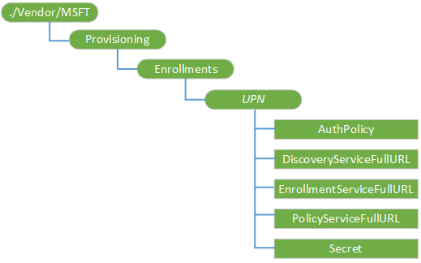

# Provisioning CSP

The Provisioning configuration service provider is used for bulk user enrollment to an MDM service.

> **Note**  Bulk enrollment does not work when two factor authentication is enabled.

 

For bulk enrollment step-by-step guide, see [Bulk enrollment](bulk-enrollment-using-windows-provisioning-tool.md).

The following diagram shows the Provisioning configuration service provider in tree format.

**./Vendor/MSFT**  
Root node for Provisioning CSP.

**Provisioning/Enrollments**  
Node for defining bulk enrollment of users into an MDM service.

**Provisioning/Enrollments/****_UPN_**  
Unique identifier for the enrollment. For bulk enrollment, this must a service account that is allowed to enroll multiple users. Example, "generic-device@contoso.com"

**Provisioning/Enrollments/*UPN*/DiscoveryServiceFullURL**  
The full URL for the discovery service.

**Provisioning/Enrollments/*UPN*/Secret**  
This information is dependent on the AuthPolicy being used. Possible values:

-   Password string for on-premises authentication enrollment
-   Federated security token for federated enrollment
-   Certificate thumb print for certificated based enrollment

**Provisioning/Enrollments/*UPN*/AuthPolicy**  
Specifies the authentication policy used by the MDM service. Valid values:

-   OnPremise
-   Certificate

**Provisioning/Enrollments/*UPN*/PolicyServiceFullURL**  
Specifies the policy service URL.

**Provisioning/Enrollments/*UPN*/EnrollmentServiceFullURL**  
Specifies the enrollment service URL.

 

 

