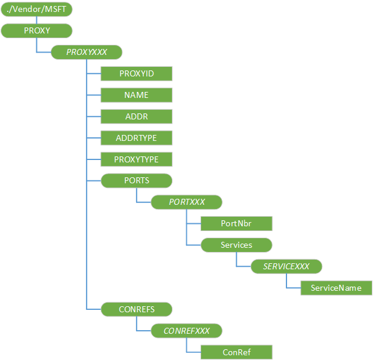

# PROXY CSP

The PROXY configuration service provider is used to configure proxy connections.

> **Note**  Use [CM\_ProxyEntries CSP](cm-proxyentries-csp.md) instead of PROXY CSP, which will be deprecated in a future release.

This configuration service provider requires the ID\_CAP\_CSP\_FOUNDATION and ID\_CAP\_NETWORKING\_ADMIN capabilities to be accessed from a network configuration application.

 

For the PROXY CSP, you cannot use the Replace command unless the node already exists.

The following diagram shows the PROXY configuration service provider management object in tree format as used by OMA DM. The OMA Client Provisioning protocol is not supported by this configuration service provider.

**./Vendor/MSFT/Proxy**  
Root node for the proxy connection.

***ProxyName***  
Defines the name of a proxy connection.

It is recommended that this element name is specified as a numbered node beginning at zero. For example, to provision two proxy connections, use "PROXY0" and "PROXY1" as the element names. Any unique name can be used if desired (such as "GPRS-NAP"), but no spaces may appear in the name (use %20 instead).

The addition, update, and deletion of this sub-tree of nodes have be specified in a single atomic transaction.

***ProxyName*/PROXYID**  
Specifies the unique identifier of the proxy connection.

***ProxyName*/NAME**  
Specifies the user-friendly name of the proxy connection.

***ProxyName*/ADDR**  
Specifies the address of the proxy server.

This value may be the network name of the server, or any other string (such as an IP address) used to uniquely identify the proxy connection.

***ProxyName*/ADDRTYPE**  
Specifies the type of address used to identify the proxy server.

The valid values are IPV4, IPV6, E164, ALPHA.

***ProxyName*/PROXYTYPE**  
Specifies the type of proxy connection.

Depending on the ProxyID, the valid values are ISA, WAP, SOCKS, or NULL.

***ProxyName*/Ports**  
Node for port information.

***ProxyName*/Ports/**<strong>*PortName*</strong>  
Defines the name of a port.

It is recommended that this element name is specified as a numbered node beginning at zero. For example, to provision two ports, use "PORT0" and "PORT1" as the element names.

***ProxyName*/Ports/*PortName*/PortNbr**  
Specifies the port number to be associated with the parent port.

***ProxyName*/Ports/*PortName*/Services**  
Node for services information.

***ProxyName*/Ports/Services/**<strong>*ServiceName*</strong>  
Defines the name of a service.

It is recommended that this element name is specified as a numbered node beginning at zero. For example, to provision two services, use "SERVICE0" and "SERVICE1" as the element names.

***ProxyName*/Ports/Services/*ServiceName*/ServiceName**  
Specifies the protocol to be associated with the parent port.

One commonly used value is "HTTP".

***ProxyName*/ConRefs**  
Node for connection reference information

***ProxyName*/ConRefs/**<strong>*ConRefName*</strong>  
Defines the name of a connection reference.

It is recommended that this element name is specified as a numbered node beginning at zero. For example, to provision two connection references, use "CONREF0" and "CONREF1" as the element names.

***ProxyName*/ConRefs/*ConRefName*/ConRef**  
Specifies one single connectivity object associated with the proxy connection.

## Related topics

[Configuration service provider reference](configuration-service-provider-reference.md)

 

 

