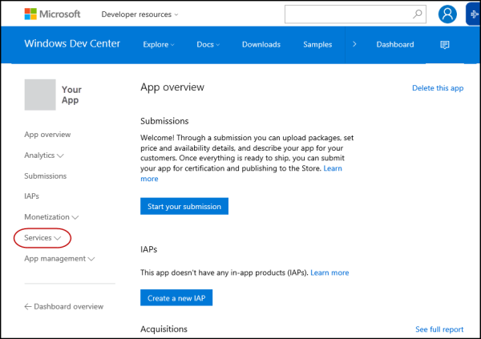

# Push notification support for device management

The [DMClient CSP](dmclient-csp.md) supports the ability to configure push-initiated device management sessions. Using the [Windows Notification Services (WNS)](https://go.microsoft.com/fwlink/p/?linkid=528800), a management server can request a device to establish a management session with the server through a push notification. A device is configured to support push by the management server by providing the device with a PFN for an application. Once the device is configured, it registers a persistent connection with the WNS cloud (Battery Sense and Data Sense conditions permitting).

To initiate a device management session, the management server must first authenticate with WNS using its SID and client secret. Once authenticated, the server receives a token that it can use to initiate a raw push notification for any ChannelURI. When the management server wants to initiate a device management session with a device, it can utilize its token and the device ChannelURI and begin communicating with the device.

For more information about how to get push credentials (SID and client secret) and PFN to use in WNS, see [Get WNS credentials and PFN for MDM push notification](#get-wns-credentials-and-pfn-for-mdm-push-notification).

Because a device may not always be connected to the internet, WNS supports caching notifications for delivery to the device once it reconnects. To ensure your notification is cached for delivery, set the X-WNS-Cache-Policy header to Cache. Additionally, if the server wants to send a time-bound raw push notification, the server can use the X-WNS-TTL header that will provide WNS with a time-to-live binding so that the notification will expire after the time has passed. For more information, see [Raw notification overview (Windows Runtime apps)](https://go.microsoft.com/fwlink/p/?LinkId=733254).

Note the following restrictions related to push notifications and WNS:

-   Push for device management uses raw push notifications. This means that these raw push notifications do not support or utilize push notification payloads.
-   Receipt of push notifications are sensitive to the Battery Saver and Data Sense settings on the device. For example, if the battery drops below certain thresholds, the persistent connection of the device with WNS will be terminated. Additionally, if the user is utilizing Data Sense and has exceeded their monthly allotment of data, the persistent connection of the device with WNS will also be terminated.
-   A ChannelURI provided to the management server by the device is only valid for 30 days. The device automatically renews the ChannelURI after 15 days and triggers a management session on successful renewal of the ChannelURI. It is strongly recommended that, during every management session, the management server queries the ChannelURI value to ensure that it has received the latest value. This will ensure that the management server will not attempt to use a ChannelURI that has expired.
-   Push is not a replacement for having a polling schedule.
-   WNS reserves the right to block push notifications to your PFN if improper use of notifications is detected. Any devices being managed using this PFN will cease to have push initiated device management support.
-   On Windows 10, version 1511 as well as Windows 8 and 8.1, MDM Push may fail to renew the WNS Push channel automatically causing it to expire. It can also potentially hang when setting the PFN for the channel.

    To workaround this issue, when a 410 is returned by the WNS server when attempting to send a Push notification to the device the PFN should be set during the next sync session. To prevent the push channel from expiring on older builds, servers can reset the PFN before the channel expires (~30 days). If they’re already running Windows 10, there should be an update available that they can install that should fix the issue.

-   On Windows 10, version 1511, we use the following retry logic for the DMClient:
    -   If ExpiryTime is greater than 15 days a schedule is set for when 15 days are left.
    -   If ExpiryTime is between now and 15 days a schedule set for 4 +/- 1 hours from now.
    -   If ExpiryTime has passed a schedule is set for 1 day +/- 4 hours from now.

-   On Windows 10, version 1607, we check for network connectivity before retrying. We do not check for internet connectivity. If network connectivity is not available we will skip the retry and set schedule for 4+/-1 hours to try again.

## Get WNS credentials and PFN for MDM push notification

To get a PFN and WNS credentials, you must create an Microsoft Store app.

1.  Go to the Windows [Dashboard](https://dev.windows.com/en-US/dashboard) and sign in with your developer account.

    
2.  Create a new app.

    
3.  Reserve an app name.

    
4.  Click **Services**.

    
5.  Click **Push notifications**.

    
6.  Click **Live Services site**. A new window opens for the **Application Registration Portal** page.

    
7.  In the **Application Registration Portal** page, you will see the properties for the app that you created, such as:
    -   Application Id
    -   Application Secrets
    -   Microsoft Store Package SID, Application Identity, and Publisher.

    
8.  Click **Save**.
9.  Close the **Application Registration Portal** window and go back to the Windows Dev Center Dashboard.
10. Select your app from the list on the left.
11. From the left nav, expand **App management** and then click **App identity**.

    
12. In the **App identity** page, you will see the **Package Family Name (PFN)** of your app.

 

