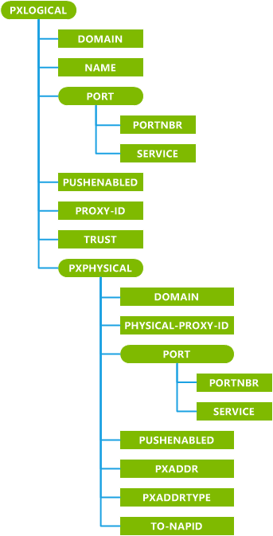
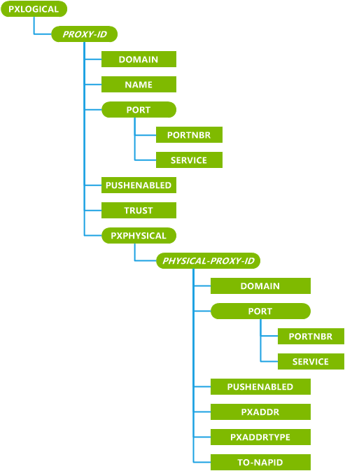

# PXLOGICAL configuration service provider

The PXLOGICAL configuration service provider is used to add, remove, or modify WAP logical and physical proxies by using WAP or the standard Windows techniques.

> **Note**   This configuration service provider requires the ID\_CAP\_CSP\_FOUNDATION and ID\_CAP\_NETWORKING\_ADMIN capabilities to be accessed from a network configuration application.

 

The following diagram shows the PXLOGICAL configuration service provider management object in tree format as used by OMA Client Provisioning for initial bootstrapping of the device. The OMA DM protocol is not supported by this configuration service provider.

The following diagram shows the PXLOGICAL configuration service provider management object in tree format as used by OMA Client Provisioning for updating the bootstrapping of the device. The OMA DM protocol is not supported by this configuration service provider.

**PXPHYSICAL**  
Defines a group of logical proxy settings.

The element's mwid attribute is a Microsoft provisioning XML attribute, and is optional when adding a NAP or a proxy. It is required when updating and deleting existing NAPs and proxies and must have its value set to 1.

**DOMAIN**  
Specifies the domain associated with the proxy (for example, "\*.com").

A Windows device supports only one proxy that does not have a DOMAIN parameter, or has an empty DOMAIN value. That is, the device only supports one default proxy. All other proxy configurations must have a DOMAIN parameter with a non-empty value. A query of this parameter returns a semicolon delimited string of all domains associated with the proxy.

**NAME**  
Specifies the name of the logical proxy.

When a list of proxies is displayed to the user they are displayed together in a single line, so the length of this value should be short for readability.

**PORT**  
Defines the bindings between a port number and one or more protocols or services.

This configuration service provider can accept a maximum of two ports per physical proxy. A query of this characteristic returns information relating only to the first port.

**PORTNBR**  
Specifies the port number associated with some services on this proxy.

If the PORTNBR is 80 or 443, or the PORT characteristic is missing, it is treated as an HTTP proxy.

**SERVICE**  
Specifies the service associated with the port number.

Windows supports accepting WAP push connectionless sessions over a Short Message Service (SMS) bearer for WAP push messages. Internet Explore uses HTTP protocol, not WAP proxy. A query of this parameter returns a semicolon-delimited string of services for only the first port.

**PUSHENABLED**  
Specifies whether or not push operations are enabled.

If this element is used in PXLOGICAL, it applies to all of the PXPHYSICAL elements embedded in the PXLOGICAL element. A value of "0" indicates that the proxy does not support push operations. A value of "1" indicates that the proxy supports push operations.

**PROXY-ID**  
Used during initial bootstrapping. Specifies the unique identifier of the logical proxy.

***PROXY-ID***  
Used during bootstrapping updates. Specifies the unique identifier of the logical proxy.

The name of the **PROXY-ID** element is the same as the value passed during initial bootstrapping.

**TRUST**  
Specifies whether or not the physical proxies in this logical proxy are privileged. The SECPOLICY\_TRUSTED\_WAP\_PROXY security policy (4121) governs what roles can set this element.

**PXPHYSICAL**  
Defines a group of physical proxy settings associated with the parent logical proxy.

The element's mwid attribute is a Microsoft provisioning XML attribute, and is optional when adding a NAP or a proxy. It is required when updating and deleting existing NAPs and proxies and must have its value set to 1.

**PHYSICAL-PROXY-ID**  
Used during initial bootstrapping. Specifies the identifier of the physical proxy.

When a list of proxies is displayed to the user they are displayed together in a single line, so the length of this value should be short for readability.

***PHYSICAL-PROXY-ID***  
Used during bootstrapping updates. Specifies the identifier of the physical proxy.

The name of the **PHYSICAL-PROXY-ID** element is the same as the value passed during initial bootstrapping.

**PXADDR**  
Specifies the address of the physical proxy.

**PXADDRTYPE**  
Specifies the format and protocol of the PXADDR element for a physical proxy.

The only values supported are "E164" and "IPv4".

**TO-NAPID**  
Specifies the network access point associated with this physical proxy. Only one per proxy is supported.

If **TO-NAPID** is used, the NAP whose **NAPID** is referred to by **TO-NAPID** must also be added.

## Microsoft Custom Elements

The following table shows the Microsoft custom elements that this configuration service provider supports for OMA Client Provisioning.

These features are available only for the device technique. In addition, the parameter-query and characteristic-query features are not supported for all PXPHYSICAL proxy parameters for all PXADDR types. All parameters can be queried when the PXPHYSICAL proxy PXADDRType is IPv4. For example, if a mobile operator queries the TO-NAPID parameter of a PXPHYSICAL proxy and the PXADDR Type is E164, a noparm is returned.

<table>
<colgroup>
<col width="50%" />
<col width="50%" />
</colgroup>
<thead>
<tr class="header">
<th>Feature</th>
<th>Available</th>
</tr>
</thead>
<tbody>
<tr class="odd">
<td>
parm-query
</td>
<td>
Yes
</td>
</tr>
<tr class="even">
<td>
noparm
</td>
<td>
Yes
</td>
</tr>
<tr class="odd">
<td>
nocharacteristic
</td>
<td>
Yes
</td>
</tr>
<tr class="even">
<td>
characteristic-query
</td>
<td>
Yes
</td>
</tr>
</tbody>
</table>

 

## Related topics

[Configuration service provider reference](configuration-service-provider-reference.md)

 

 

