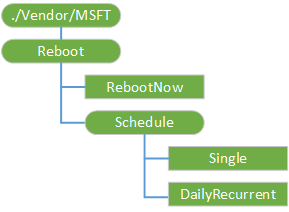

# Reboot CSP

The Reboot configuration service provider is used to configure reboot settings.

The following diagram shows the Reboot configuration service provider management objects in tree format as used by Open Mobile Alliance Device Management (OMA DM), OMA Client Provisioning, and Enterprise DM.

**./Vendor/MSFT/Reboot**  

The root node for the Reboot configuration service provider.

The supported operation is Get.

**RebootNow**  

This node executes a reboot of the device. RebootNow triggers a reboot within 5 minutes to allow the user to wrap up any active work.

> [!Note]  
> If this node is set to execute during a sync session, the device will reboot at the end of the sync session.

The supported operations are Execute and Get.

**Schedule**  

The supported operation is Get.

**Schedule/Single**  

This node will execute a reboot at a scheduled date and time. Setting a null (empty) date will delete the existing schedule. The date and time value is ISO8601, and both the date and time are required. For example: 2015-12-15T07:36:25Z

The supported operations are Get, Add, Replace, and Delete.

**Schedule/DailyRecurrent**  

This node will execute a reboot each day at a scheduled time starting at the configured starting time and date. Setting a null (empty) date will delete the existing schedule. The date and time value is ISO8601, and both the date and time are required. For example: 2015-12-15T07:36:25Z

The supported operations are Get, Add, Replace, and Delete.

## Related topics

[Configuration service provider reference](configuration-service-provider-reference.md)

 

 

