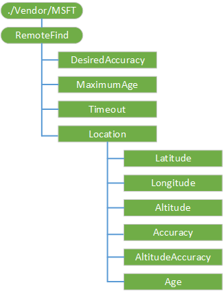

# RemoteFind CSP


The RemoteFind configuration service provider retrieves the location information for a particular device.

The following diagram shows the RemoteFind configuration service provider management object in tree format as used by OMA Client Provisioning.



<a href="" id="desiredaccuracy"></a>**DesiredAccuracy**  
Optional. The node accepts the requested radius value in meters. Valid values for accuracy are any value between 1 and 1000 meters.

The default value is 50. Replacing this value only replaces it for the current session. The value is not retained.

Supported operations are Replace and Get. The Add command is not supported.

<a href="" id="timeout"></a>**Timeout**  
Optional. Value is DWORD in seconds.

The default value is 7, and the range is 0 to 1800 seconds. Replacing this value only replaces it for the current session. The value is not retained.

Supported operations are Replace and Get. The Add command is not supported.

<a href="" id="maximumage"></a>**MaximumAge**  
Optional. The value represents the desired time window in minutes that the server will accept a successful location retrieval. The node enables the server to set the requested age value in 100 nanoseconds. Valid values for accuracy include any integer value between 0 and 1440 minutes.

The default value is 60. Replacing this value only replaces it for the current session. The value is not retained.

Supported operations are Replace and Get. The Add command is not supported.

<a href="" id="location"></a>**Location**  
Required. Nodes under this path must be queried atomically in order to succeed. This is to prevent servers from querying incomplete sets of data.

<a href="" id="latitude"></a>**Latitude**  
Required. Provides the latitude of the last successful remote find.

The value returned is double.

The default value is Null.

Supported operation is Get.

<a href="" id="longitude"></a>**Longitude**  
Required. Provides the longitude of the last successful remote find.

The value returned is double.

The default value is Null.

Supported operation is Get.

<a href="" id="altitude"></a>**Altitude**  
Required. Provides the altitude of the last successful remote find.

The value returned is double.

The default value is Null.

Supported operation is Get.

<a href="" id="accuracy"></a>**Accuracy**  
Required. Provides the accuracy in meters of the location fix of the last successful remote find. Values range from 0 – 1000 meters.

The value returned is an integer.

The default value is 0.

Supported operation is Get.

<a href="" id="altitudeaccuracy"></a>**AltitudeAccuracy**  
Required. Provides the altitude accuracy in meters of the location fix of the last successful remote find. Values range from 0 – 1000 meters.

The value returned is an integer.

The default value is 0.

Supported operation is Get.

<a href="" id="age"></a>**Age**  
Required. Provides the age in 100 nanoseconds for current location data.

The value returned is an integer.

The default value is 0.

Supported operation is Get.

## Examples


``` syntax
<SyncML xmlns="SYNCML:SYNCML1.2">
    <SyncBody>
        <Atomic>  
            <CmdID>1</CmdID>  
            <Sequence> 
                <CmdID>10</CmdID>  
                <Get>         
                    <CmdID>30</CmdID>  
                    <Item>  
                        <Target>  
                            <LocURI>./Vendor/MSFT/RemoteFind/Location/Latitude</LocURI>  
                        </Target>  
                    </Item>  
                </Get> 
                <Get> 
                    <CmdID>40</CmdID>  
                    <Item>  
                        <Target>  
                            <LocURI>./Vendor/MSFT/RemoteFind/Location/Longitude</LocURI>  
                        </Target>  
                    </Item>  
                </Get> 
                <Get> 
                    <CmdID>40</CmdID>  
                    <Item>  
                        <Target>  
                            <LocURI>./Vendor/MSFT/RemoteFind/Location/Altitude</LocURI>  
                        </Target>  
                    </Item>  
                </Get> 
                <Get> 
                    <CmdID>45</CmdID>  
                    <Item>  
                        <Target>  
                            <LocURI>./Vendor/MSFT/RemoteFind/Location/Accuracy</LocURI>  
                        </Target>  
                    </Item>  
                </Get> 
                <Get> 
                    <CmdID>50</CmdID>  
                    <Item>  
                        <Target>  
                            <LocURI>./Vendor/MSFT/RemoteFind/Location/AltitudeAccuracy</LocURI>  
                        </Target>  
                    </Item>  
                </Get> 
                <Get> 
                    <CmdID>60</CmdID>  
                    <Item>  
                        <Target>  
                            <LocURI>./Vendor/MSFT/RemoteFind/Location/Age</LocURI>  
                        </Target>  
                    </Item>  
                </Get>                  
            </Sequence> 
        </Atomic> 
    </SyncBody>
</SyncML>
```

## Related topics


[Configuration service provider reference](configuration-service-provider-reference.md)

 

 


