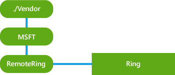

# RemoteRing CSP


The RemoteRing configuration service provider can be used to remotely trigger a device to produce an audible ringing sound regardless of the volume that is set on the device.

The following diagram shows the RemoteRing configuration service provider in tree format.



<a href="" id="ring"></a>**Ring**  
Required. The node accepts requests to ring the device.

The supported operation is Exec.

## Examples


The following sample shows how to initiate a remote ring on the device.

``` syntax
<Exec>
  <CmdID>5</CmdID> 
    <Item> 
    <Target> 
      <LocURI>./Vendor/MSFT/RemoteRing/Ring </LocURI> 
    </Target> 
    </Item> 
</Exec>
```

 

 


