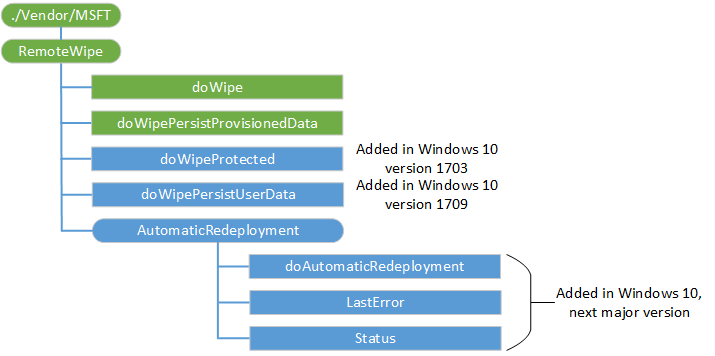

# RemoteWipe CSP

The RemoteWipe configuration service provider can be used by mobile operators DM server or enterprise management server to remotely wipe a device. The RemoteWipe configuration service provider can make the data stored in memory and hard disks difficult to recover if the device is remotely wiped after being lost or stolen.

The following diagram shows the RemoteWipe configuration service provider management object in tree format as used by both OMA DM and OMA Client Provisioning. Enterprise IT Professionals can update these settings by using the Exchange Server.

**doWipe**  
Specifies that a remote wipe of the device should be performed. The return status code indicates whether the device accepted the Exec command.

When used with OMA Client Provisioning, a dummy value of "1" should be included for this element.

Supported operation is Exec.

**doWipePersistProvisionedData**  
Specifies that provisioning data should be backed up to a persistent location, and then a remote wipe of the device should be performed.

Supported operation is Exec.

When used with OMA Client Provisioning, a dummy value of "1" should be included for this element.

The information that was backed up will be restored and applied to the device when it resumes. The return status code shows whether the device accepted the Exec command.

**doWipeProtected**  
Added in Windows 10, version 1703. Exec on this node performs a remote wipe on the device and fully clean the internal drive. In some device configurations, this command may leave the device unable to boot. The return status code indicates whether the device accepted the Exec command.

The doWipeProtected is functionally similar to doWipe. But unlike doWipe, which can be easily circumvented by simply power cycling the device, doWipeProtected will keep trying to reset the device until it’s done.

Supported operation is Exec.

**doWipePersistUserData**  
Added in Windows 10, version 1709.  Exec on this node will perform a remote reset on the device and persist user accounts and data. The return status code shows whether the device accepted the Exec command.

**AutomaticRedeployment**  
Added in Windows 10, next major update. Node for the Autopilot Reset operation.

**AutomaticRedeployment/doAutomaticRedeployment**  
Added in Windows 10, next major update. Exec on this node triggers Autopilot Reset operation. This works like PC Reset, similar to other existing nodes in this RemoteWipe CSP, except that it keeps the device enrolled in Azure AD and MDM, keeps Wi-Fi profiles, and a few other settings like region, language, keyboard.

**AutomaticRedeployment/LastError**  
Added in Windows 10, next major update. Error value, if any, associated with Autopilot Reset operation (typically an HRESULT).

**AutomaticRedeployment/Status**  
Added in Windows 10, next major update. Status value indicating current state of an Autopilot Reset operation. 

Supported values:  

-  0: Never run (not started). The default state. 
-  1: Complete. 
-  10: Reset has been scheduled. 
-  20: Reset is scheduled and waiting for a reboot. 
-  30: Failed during CSP Execute ("Exec" in SyncML). 
-  40: Failed: power requirements not met. 
-  50: Failed: reset internals failed during reset attempt.

## Related topics

[Configuration service provider reference](configuration-service-provider-reference.md)

 

 

