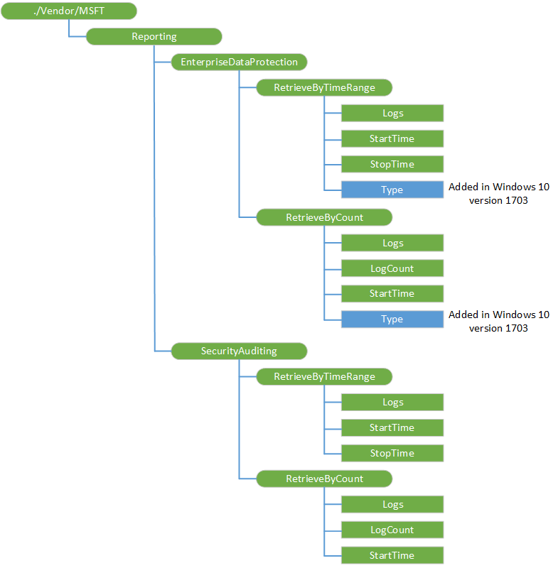

# Reporting CSP


The Reporting configuration service provider is used to retrieve Windows Information Protection (formerly known as Enterprise Data Protection) and security auditing logs. This CSP was added in Windows 10, version 1511.

The following diagram shows the Reporting configuration service provider in tree format.



<a href="" id="reporting"></a>**Reporting**  
Root node.

<a href="" id="reporting-enterprisedataprotection"></a>**Reporting/EnterpriseDataProtection**  
Interior node for retrieving the Windows Information Protection (formerly known as Enterprise Data Protection) logs.

<a href="" id="reporting-securityauditing--for-mobile-only-"></a>**Reporting/SecurityAuditing** (for mobile only)  
Interior node for retrieving the security auditing logs. This node is only for mobile devices.

<a href="" id="retrievebytimerange"></a>**RetrieveByTimeRange**  
Returns the logs that exist within the StartTime and StopTime. The StartTime and StopTime are expressed in ISO 8601 format. If the StartTime and StopTime are not specified, then the values are interpreted as either first existing or last existing time.

Here are the other possible scenarios:

-   If the StartTime and StopTime are not specified, then it returns all existing logs.
-   If the StopTime is specified, but the StartTime is not specified, then all logs that exist before the StopTime are returned.
-   If the StartTime is specified, but the StopTime is not specified, then all that logs that exist from the StartTime are returned.

<a href="" id="retrievebycount"></a>**RetrieveByCount**  
Interior node for retrieving a specified number of logs from the StartTime. The StartTime is expressed in ISO 8601 format. You can set the number of logs required by setting LogCount and StartTime. It returns the specified number of log or less, if the total number logs is less than LogCount.

<a href="" id="logs"></a>**Logs**  
Contains the reporting logs.

Value type is XML.

Supported operations is Get.

<a href="" id="starttime"></a>**StartTime**  
Specifies the starting time for retrieving logs.

Value type is string. Use ISO 8601 format.

Supported operations are Get and Replace.

<a href="" id="stoptime"></a>**StopTime**  
Specifies the ending time for retrieving logs.

Value type is string. Use ISO 8601 format.

Supported operations are Get and Replace.

<a href="" id="type"></a>**Type**  
Added in Windows 10, version 1703. Specifies the type of logs to retrieve. You can use this to retrieve the WIP learning logs.

Value type is integer.

Supported operations are Get and Replace.

<a href="" id="logcount"></a>**LogCount**  
Specifies the number of logs to retrieve from the StartTime.

Value type is int.

Supported operations are Get and Replace.

## Examples

Retrieve all available Windows Information Protection (formerly known as Enterprise Data Protection) logs starting from the specified StartTime.

``` syntax
<SyncML>
    <SyncBody>
        <Replace>
            <CmdID>2</CmdID>
            <Item>
                <Target><LocURI>./Vendor/MSFT/Reporting/EnterpriseDataProtection/RetrieveByTimeRange/StartTime</LocURI></Target>
                <Data>2012-11-30T01:48:14.233Z</Data>
            </Item>
        </Replace>
        <Get>
            <CmdID>4</CmdID>
            <Item>
                <Target><LocURI>./Vendor/MSFT/Reporting/EnterpriseDataProtection/RetrieveByTimeRange/Logs</LocURI></Target>
            </Item>
        </Get>
        <Final/>
    </SyncBody>
</SyncML>
```

Retrieve a specified number of security auditing logs starting from the specified StartTime.

``` syntax
<SyncML xmlns="SYNCML:SYNCML1.2">
  <SyncBody>
    <Replace>
      <CmdID>1</CmdID>
      <Item>
        <Target>
          <LocURI>
            ./Vendor/MSFT/Reporting/SecurityAuditing/RetrieveByCount/LogCount
          </LocURI>
        </Target>
        <Meta>
          <Format xmlns="syncml:metinf">int</Format>
          <Type>text/plain</Type>
        </Meta>
        <Data>10</Data>
      </Item>
    </Replace>
    <Replace>
      <CmdID>2</CmdID>
      <Item>
        <Target>
          <LocURI>
            ./Vendor/MSFT/Reporting/SecurityAuditing/RetrieveByCount/StartTime
          </LocURI>
        </Target>
        <Meta>
          <Format xmlns="syncml:metinf">chr</Format>
          <Type>text/plain</Type>
        </Meta>
        <Data>2015-08-12T08:15:30:27</Data>
      </Item>
    </Replace>
    <Get>
      <CmdID>3</CmdID>
      <Item>
        <Target>
          <LocURI>
            ./Vendor/MSFT/Reporting/SecurityAuditing/RetrieveByCount/Logs
          </LocURI>
        </Target>
      </Item>
    </Get>
    <Final/> 
  </SyncBody>
</SyncML>
```

 

 


