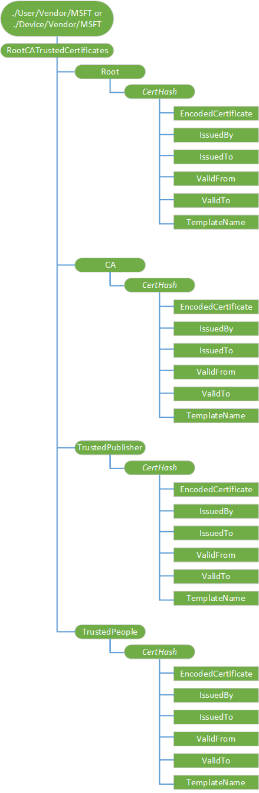

# RootCATrustedCertificates CSP

The RootCATrustedCertificates configuration service provider enables the enterprise to set the Root Certificate Authority (CA) certificates.

> [!Note]
> The **./User/** configuration is not supported for **RootCATrustedCertificates/Root/**.

 
The following image shows the RootCATrustedCertificates configuration service provider in tree format.

**Device or User**  
For device certificates, use **./Device/Vendor/MSFT** path and for user certificates use **./User/Vendor/MSFT** path.

**RootCATrustedCertificates**  
The root node for the RootCATrustedCertificates configuration service provider.

**RootCATrustedCertificates/Root/**  
Defines the certificate store that contains root, or self-signed certificates, in this case, the computer store.

> [!Note]
> The **./User/** configuration is not supported for **RootCATrustedCertificates/Root/**.

 
**RootCATrustedCertificates/CA**  
Node for CA certificates.

**RootCATrustedCertificates/TrustedPublisher**  
Node for trusted publisher certificates.

**RootCATrustedCertificates/TrustedPeople**  
Node for trusted people certificates.

**RootCATrustedCertificates/UntrustedCertificates**  
Addeded in Windows 10, version 1803. Node for certificates that are not trusted. IT admin can use this node to immediately flag certificates that have been compromised and no longer usable.

**_CertHash_**  
Defines the SHA1 hash for the certificate. The 20-byte value of the SHA1 certificate hash is specified as a hexadecimal string value.

The supported operations are Get and Delete.

**/EncodedCertificate**  
Specifies the X.509 certificate as a Base64-encoded string. The Base-64 string value cannot include extra formatting characters such as embedded linefeeds, etc.

The supported operations are Add, Get, and Replace.

**/IssuedBy**  
Returns the name of the certificate issuer. This is equivalent to the **Issuer** member in the CERT\_INFO data structure.

The only supported operation is Get.

**/IssuedTo**  
Returns the name of the certificate subject. This is equivalent to the **Subject** member in the CERT\_INFO data structure.

The only supported operation is Get.

**/ValidFrom**  
Returns the starting date of the certificate's validity. This is equivalent to the **NotBefore** member in the CERT\_INFO data structure.

The only supported operation is Get.

**/ValidTo**  
Returns the expiration date of the certificate. This is equivalent to the **NotAfter** member in the CERT\_INFO data structure.

The only supported operation is Get.

**/TemplateName**  
Returns the certificate template name.

The only supported operation is Get.

## Related topics

[Configuration service provider reference](configuration-service-provider-reference.md)

 

 

