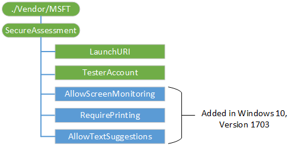

# SecureAssessment CSP

The SecureAssessment configuration service provider is used to provide configuration information for the secure assessment browser.

The following diagram shows the SecureAssessment configuration service provider management objects in tree format as used by Open Mobile Alliance Device Management (OMA DM), OMA Client Provisioning, and Enterprise DM.

**./Vendor/MSFT/SecureAssessment**  
The root node for the SecureAssessment configuration service provider.

The supported operation is Get.

**LaunchURI**  
URI Link to an assessment that's automatically loaded when the secure assessment browser is launched.

The supported operations are Add, Delete, Get, and Replace.

**TesterAccount**  
The user name of the test taking account.

-   To specify a domain account, use domain\\user.
-   To specify an AAD account, use username@tenant.com.
-   To specify a local account, use the username.

The supported operations are Add, Delete, Get, and Replace.

**AllowScreenMonitoring**  
Added in Windows 10, version 1703. Boolean value that indicates whether screen capture is allowed by the app.  

Supported operations are Get and Replace.

**RequirePrinting**  
Added in Windows 10, version 1703. Boolean value that indicates whether printing is allowed by the app.

Supported operations are Get and Replace.  

**AllowTextSuggestions**  
Added in Windows 10, version 1703. Boolean value that indicates whether keyboard text suggestions are allowed by the app.  

Supported operations are Get and Replace.

## Related topics

[Set up Take a Test on multiple PCs](https://technet.microsoft.com/edu/windows/take-a-test-multiple-pcs)  

[Configuration service provider reference](configuration-service-provider-reference.md)

 

 

