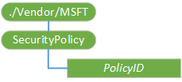

# SecurityPolicy CSP


The SecurityPolicy configuration service provider is used to configure security policy settings for WAP push, OMA Client Provisioning, OMA DM, Service Indication (SI), Service Loading (SL), and MMS.

>  **Note**   This configuration service provider requires the ID\_CAP\_CSP\_FOUNDATION and ID\_CAP\_DEVICE\_MANAGEMENT\_SECURITY\_POLICIES capabilities to be accessed from a network configuration application.

 

For the SecurityPolicy CSP, you cannot use the Replace command unless the node already exists.

The following diagram shows the SecurityPolicy configuration service provider management object in tree format as used by both OMA DM and OMA Client Provisioning.



<a href="" id="policyid"></a>***PolicyID***  
Defines the security policy identifier as a decimal value.

The following security policies are supported.

<table>
<colgroup>
<col width="15%" />
<col width="25%" />
<col width="55%" />
</colgroup>
<thead>
<tr class="header">
<th>PolicyID</th>
<th>Policy name</th>
<th>Policy description</th>
</tr>
</thead>
<tbody>
<tr class="odd">
<td><p>4104</p>
<p>Hex:1008</p></td>
<td><p>TPS Policy</p></td>
<td><p>This setting indicates whether mobile operators can be assigned the Trusted Provisioning Server (TPS) SECROLE_OPERATOR_TPS role.</p>
<p>Default value: 1</p>
<p>Supported values:</p>
<p>0: The TPS role assignment is disabled.</p>
<p>1: The TPS role assignment is enabled, and can be assigned to mobile operators.</p></td>
</tr>
<tr class="even">
<td><p>4105</p>
<p>Hex:1009</p></td>
<td><p>Message Authentication Retry Policy</p></td>
<td><p>This setting specifies the maximum number of times the user is allowed to try authenticating a Wireless Application Protocol (WAP) PIN-signed message.</p>
<p>Default value: 3</p>
<p>Possible values: 0 through 256.</p></td>
</tr>
<tr class="odd">
<td><p>4108</p>
<p>Hex:100c</p></td>
<td><p>Service Loading Policy</p></td>
<td><p>This setting indicates whether SL messages are accepted, by specifying the security roles that can accept SL messages. An SL message downloads new services or provisioning XML to the device.</p>
<p>Default value: 256 (SECROLE_KNOWN_PPG)</p>
<p>Supported values: SECROLE_ANY_PUSH_SOURCE, SECROLE_KNOWN_PPG</p>
<p></p></td>
</tr>
<tr class="even">
<td><p>4109</p>
<p>Hex:100d</p></td>
<td><p>Service Indication Policy</p></td>
<td><p>This setting indicates whether SI messages are accepted, by specifying the security roles that can accept SI messages. An SI message is sent to the device to notify users of new services, service updates, and provisioning services.</p>
<p>Default value: 256 (SECROLE_KNOWN_PPG)</p>
<p>Supported values: SECROLE_ANY_PUSH_SOURCE, SECROLE_KNOWN_PPG</p></td>
</tr>
<tr class="odd">
<td><p>4111</p>
<p>Hex:100f</p></td>
<td><p>OTA Provisioning Policy</p></td>
<td><p>This setting determines whether PIN signed OMA Client Provisioning messages will be processed. This policy's value specifies a role mask. If a message contains at least one of the following roles in the role mask, then the message is processed. To ensure properly signed OMA Client Provisioning messages are accepted by the configuration client, all of the roles that are set in 4141, 4142, and 4143 policies must also be set in this policy. For example, to ensure properly signed USERNETWPIN signed OMA Client Provisioning messages are accepted by the device, if policy 4143 is set to 4096 (SECROLE_ANY_PUSH_SOURCE) for an carrier-unlocked device, policy 4111 must also have the SECROLE_ANY_PUSH_SOURCE role set.</p>
<p>Default value: 384 (SECROLE_OPERATOR_TPS | SECROLE_KNOWN_PPG)</p>
<p>Supported values: SECROLE_KNOWN_PPG, SECROLE_ANY_PUSH_SOURCE, SECROLE_OPERATOR_TPS</p>
<p></p></td>
</tr>
<tr class="even">
<td><p>4113</p>
<p>Hex:1011</p></td>
<td><p>WSP Push Policy</p></td>
<td><p>This setting indicates whether Wireless Session Protocol (WSP) notifications from the WAP stack are routed.</p>
<p>Default value: 1</p>
<p>Supported values:</p>
<p>0: Routing of WSP notifications is not allowed.</p>
<p>1: Routing of WSP notifications is allowed.</p></td>
</tr>
<tr class="odd">
<td><p>4132</p>
<p>Hex:1024</p></td>
<td><p>Network PIN signed OTA Provision Message User Prompt Policy</p></td>
<td><p>This policy specifies whether the device will prompt a UI to get the user confirmation before processing a pure network pin signed OTA Provisioning message. If prompt, the user has the ability to discard the OTA provisioning message.</p>
<p>Default value: 0</p>
<p>Supported values:</p>
<p>0: The device prompts a UI to get user confirmation when the OTA WAP provisioning message is signed purely with network pin.</p>
<p>1: There is no user prompt.</p></td>
</tr>
<tr class="even">
<td><p>4141</p>
<p>Hex:102d</p></td>
<td><p>OMA CP NETWPIN Policy</p></td>
<td><p>This setting determines whether the OMA network PIN signed message will be accepted. The message's role mask and the policy's role mask are combined using the AND operator. If the result is non-zero, then the message is accepted.</p>
<p>Default value: 0</p>
<p>Supported values: SECROLE_KNOWN_PPG, SECROLE_ANY_PUSH_SOURCE , SECROLE_OPERATOR_TPS</p>
<p></p></td>
</tr>
<tr class="odd">
<td><p>4142</p>
<p>Hex:102e</p></td>
<td><p>OMA CP USERPIN Policy</p></td>
<td><p>This setting determines whether the OMA user PIN or user MAC signed message will be accepted. The message's role mask and the policy's role mask are combined using the AND operator. If the result is non-zero, then the message is accepted.</p>
<p>Default value: 256</p>
<p>Supported values: SECROLE_OPERATOR_TPS, SECROLE_ANY_PUSH_SOURCE, SECROLE_KNOWN_PPG</p></td>
</tr>
<tr class="even">
<td><p>4143</p>
<p>Hex:102f</p></td>
<td><p>OMA CP USERNETWPIN Policy</p></td>
<td><p>This setting determines whether the OMA user network PIN signed message will be accepted. The message's role mask and the policy's role mask are combined using the AND operator. If the result is non-zero, then the message is accepted.</p>
<p>Default value: 256</p>
<p>Supported values: SECROLE_KNOWN_PPG, SECROLE_ANY_PUSH_SOURCE, SECROLE_OPERATOR_TPS</p>
<p></p></td>
</tr>
<tr class="odd">
<td><p>4144</p>
<p>Hex:1030</p></td>
<td><p>MMS Message Policy</p></td>
<td><p>This setting determines whether MMS messages will be processed. This policy's value specifies a role mask. If a message contains at least one of the roles in the role mask, then the message is processed.</p>
<p>Default value: 256 (SECROLE_KNOWN_PPG)</p>
<p>Supported values: SECROLE_KNOWN_PPG, SECROLE_ANY_PUSH_SOURCE</p></td>
</tr>
</tbody>
</table>

 

## Remarks


Security roles allow or restrict access to device resources. The security role is based on the message origin and how the message is signed. You can assign multiple roles to a message in the security policy XML document by combining the decimal values of the roles that you want to assign. For example, to assign both the SECROLE\_KNOWN\_PPG and SECROLE\_OPERATOR\_TPS roles, use the decimal value 384 (256+128).

The following security roles are supported.

<table>
<colgroup>
<col width="15%" />
<col width="25%" />
<col width="33%" />
</colgroup>
<thead>
<tr class="header">
<th>Security role</th>
<th>Decimal value</th>
<th>Description</th>
</tr>
</thead>
<tbody>
<tr class="odd">
<td><p>SECROLE_OPERATOR_TPS</p></td>
<td><p>128</p></td>
<td><p>Trusted Provisioning Server.</p>
<p>Assigned to WAP messages that come from a Push Initiator that is authenticated (SECROLE_PPG_AUTH) by a trusted Push Proxy Gateway (SECROLE_TRUSTED_PPG), and where the Uniform Resource Identifier (URI) of the Push Initiator corresponds to the URI of the Trusted Provisioning Server (TPS) on the device.</p>
<p>The mobile operator can determine whether this role and the SECROLE_OPERATOR role require the same permissions.</p></td>
</tr>
<tr class="even">
<td><p>SECROLE_KNOWN_PPG</p></td>
<td><p>256</p></td>
<td><p>Known Push Proxy Gateway.</p>
<p>Messages assigned this role indicate that the device knows the address to the Push Proxy Gateway.</p></td>
</tr>
<tr class="odd">
<td><p>SECROLE_ANY_PUSH_SOURCE</p></td>
<td><p>4096</p></td>
<td><p>Push Router.</p>
<p>Messages received by the push router will be assigned to this role.</p></td>
</tr>
</tbody>
</table>

 

## OMA Client Provisioning examples


Setting a security policy:

``` syntax
<wap-provisioningdoc>
    <characteristic type="SecurityPolicy">
        <parm name="4141" value="0"/>
    </characteristic>
<wap-provisioningdoc>
```

Querying a security policy:

``` syntax
<wap-provisioningdoc>
    <characteristic type="SecurityPolicy">
        <parm-query name="4141"/>
    </characteristic>
<wap-provisioningdoc>
```

## OMA DM examples


Setting a security policy:

``` syntax
<SyncML xmlns='SYNCML:SYNCML1.2'>
    <SyncHdr>
    …
    </SyncHdr>
    <SyncBody>
        <Replace>
            <CmdID>1</CmdID>
            <Item>
                <Target><LocURI>./Vendor/MSFT/SecurityPolicy/4141</LocURI></Target>
                <Meta>
                    <Format xmlns="syncml:metinf">int</Format> 
                </Meta>
                <Data>0</Data>
            </Item>
        </Replace>
        <Final/>
    </SyncBody>
</SyncML>
```

Querying a security policy:

``` syntax
<SyncML xmlns='SYNCML:SYNCML1.2'>
    <SyncHdr>
    …
    </SyncHdr>
    <SyncBody>
        <Get>
            <CmdID>1</CmdID>
            <Item>
            <Target><LocURI>./Vendor/MSFT/SecurityPolicy/4141</LocURI></Target> 
            </Item>
        </Get>
        <Final/>
    </SyncBody>
</SyncML>
```

## Microsoft Custom Elements


The following table shows the Microsoft custom elements that this Configuration Service Provider supports for OMA Client Provisioning.

<table>
<colgroup>
<col width="50%" />
<col width="50%" />
</colgroup>
<thead>
<tr class="header">
<th>Elements</th>
<th>Available</th>
</tr>
</thead>
<tbody>
<tr class="odd">
<td><p>parm-query</p></td>
<td><p>Yes</p></td>
</tr>
<tr class="even">
<td><p>noparm</p></td>
<td><p>Yes. If this is used, then the policy is set to 0 by default (corresponding to the most restrictive of policy values).</p></td>
</tr>
</tbody>
</table>

 

## Related topics


[Configuration service provider reference](configuration-service-provider-reference.md)

 

 


