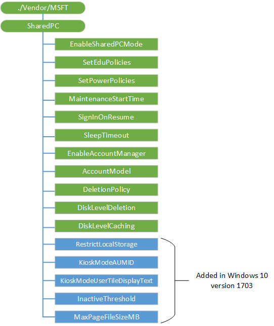

# SharedPC CSP

The SharedPC configuration service provider is used to configure settings for Shared PC usage.

The following diagram shows the SharedPC configuration service provider management objects in tree format as used by Open Mobile Alliance Device Management (OMA DM), OMA Client Provisioning, and Enterprise DM.

**./Vendor/MSFT/SharedPC**  
The root node for the SharedPC configuration service provider.

The supported operation is Get.

**EnableSharedPCMode**  
A boolean value that specifies whether Shared PC mode is enabled.

The supported operations are Get and Replace.

Setting this value to True triggers the action to configure a device to Shared PC mode.

The default value is False.

**SetEduPolicies**  
A boolean value that specifies whether the policies for education environment are enabled. Setting this value to true triggers the action to configure a device as education environment.

The supported operations are Get and Replace.

The default value changed to false in Windows 10, version 1703. This node needs to be configured independent of EnableSharedPCMode. In Windows 10, version 1607, the default value is true and education environment is automatically configured when SharedPC mode is configured.

**SetPowerPolicies**  
Optional. A boolean value that specifies that the power policies should be set when configuring SharedPC mode.

> [!Note]  
> If used, this value must be set before the action on the **EnableSharedPCMode** node is taken.

The supported operations are Get and Replace.

The default value is True.

**MaintenanceStartTime**  
Optional. An integer value that specifies the daily start time of maintenance hour. Given in minutes from midnight. The range is 0-1440.

> [!Note]  
>  If used, this value must be set before the action on the **EnableSharedPCMode** node is taken.

The supported operations are Get and Replace.

The default value is 0 (12 AM).

**SignInOnResume**  
Optional. A boolean value that, when set to True, requires sign in whenever the device wakes up from sleep mode.

> [!Note]  
> If used, this value must be set before the action on the **EnableSharedPCMode** node is taken.

The supported operations are Get and Replace.

The default value is True.

**SleepTimeout**  
The amount of time in seconds before the PC sleeps. 0 means the PC never sleeps. Default is 5 minutes. This node is optional. 

> [!Note]  
> If used, this value must be set before the action on the **EnableSharedPCMode** node is taken.

The supported operations are Get and Replace.

The default value changed to 300 in Windows 10, version 1703. The default value is 3600 in Windows 10, version 1607.

**EnableAccountManager**  
A boolean that enables the account manager for shared PC mode.

> [!Note]  
> If used, this value must be set before the action on the **EnableSharedPCMode** node is taken.

The supported operations are Get and Replace.

The default value is True.

**AccountModel**  
Configures which type of accounts are allowed to use the PC.

> [!Note]  
> If used, this value must be set before the action on the **EnableSharedPCMode** node is taken.

The supported operations are Get and Replace.

The following list shows the supported values:

-   0 (default) - Only guest accounts are allowed.
-   1 - Only domain-joined accounts are enabled.
-   2 - Domain-joined and guest accounts are allowed.

**DeletionPolicy**  
Configures when accounts are deleted.

> [!Note]  
> If used, this value must be set before the action on the **EnableSharedPCMode** node is taken.

The supported operations are Get and Replace.

For Windows 10, version 1607, here is the list shows the supported values:

-   0 - Delete immediately.
-   1 (default) - Delete at disk space threshold.

For Windows 10, version 1703, here is the list of supported values:  

- 0 - Delete immediately
- 1 - Delete at disk space threshold
- 2 - Delete at disk space threshold and inactive threshold

**DiskLevelDeletion**  
Sets the percentage of disk space remaining on a PC before cached accounts will be deleted to free disk space. Accounts that have been inactive the longest will be deleted first.

> [!Note]  
> If used, this value must be set before the action on the **EnableSharedPCMode** node is taken.

The default value is 25.

For example, if the **DiskLevelCaching** number is set to 50 and the **DiskLevelDeletion** number is set to 25 (both default values). Accounts will be cached while the free disk space is above 25%. When the free disk space is less than 25% (the deletion number) during a maintenance period, accounts will be deleted (oldest last used first) until the free disk space is above 50% (the caching number). Accounts will be deleted immediately at sign off of an account if free space is under the deletion threshold and disk space is very low, regardless whether the PC is actively in use or not.

The supported operations are Get and Replace.

**DiskLevelCaching**  
Sets the percentage of available disk space a PC should have before it stops deleting cached accounts.

> [!Note]  
> If used, this value must set before the action on the **EnableSharedPCMode** node is taken.

The default value is 50.

For example, if the **DiskLevelCaching** number is set to 50 and the **DiskLevelDeletion** number is set to 25 (both default values). Accounts will be cached while the free disk space is above 25%. When the free disk space is less than 25% (the deletion number) during a maintenance period, accounts will be deleted (oldest last used first) until the free disk space is above 50% (the caching number). Accounts will be deleted immediately at sign off of an account if free space is under the deletion threshold and disk space is very low, regardless whether the PC is actively in use or not.

**RestrictLocalStorage**  
Added in Windows 10, version 1703. Restricts the user from using local storage. This node is optional. 

Default value is true Value type is bool. Supported operations are Get and Replace. 

> [!Note]  
> If used, this value must set before the action on the **EnableSharedPCMode** node is taken.

**KioskModeAUMID**  
Added in Windows 10, version 1703. Specifies the AUMID of the app to use with assigned access. This node is optional. 

Value type is string. Supported operations are Get and Replace.  

> [!Note]  
> If used, this value must set before the action on the **EnableSharedPCMode** node is taken.

**KioskModeUserTileDisplayText**  
Added in Windows 10, version 1703. Specifies the display text for the account shown on the sign-in screen which launches the app specified by KioskModeAUMID. This node is optional. 

Value type is string. Supported operations are Get and Replace. 

> [!Note]  
> If used, this value must set before the action on the **EnableSharedPCMode** node is taken.

**InactiveThreshold**  
Added in Windows 10, version 1703. Accounts will start being deleted when they have not been logged on during the specified period, given as number of days.

Default value is 30. Value type is integer. Supported operations are Get and Replace.

**MaxPageFileSizeMB**  
Added in Windows 10, version 1703. Maximum size of the paging file in MB. Applies only to systems with less than 32 GB storage and at least 3 GB of RAM. This node is optional. 

> [!Note]  
> If used, this value must set before the action on the **EnableSharedPCMode** node is taken.

Default value is 1024. Value type is integer. Supported operations are Get and Replace.

## Related topics

[Configuration service provider reference](configuration-service-provider-reference.md)

 

 

