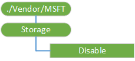

# Storage CSP

The Storage enterprise configuration service provider is used to configure the storage card settings. Currently, the only setting that needs to be configured is to enable or disable storage cards.

> **Note**  The Storage CSP is deprecated in Windows 10 and it is only supported in Windows 10 Mobile for backward compatibility. Use System/AllowStorageCard in [Policy CSP](policy-configuration-service-provider.md) instead.

 

The following diagram shows the Storage configuration service provider in tree format.

**Disable**  
Required. A Boolean value that specifies whether to enable or disable a storage card. A value of **True** disables the storage card. A value of **False** enables the storage card. The default value is **False**. The value is case sensitive.

The supported operations are Get and Replace.

> **Note**   If the device returns a 404 error code when the server applies the Get command to ./Vendor/MSFT/Storage/Disable, it means that the device does not have an SD card.

 

## Related topics

[Configuration service provider reference](configuration-service-provider-reference.md)

 

 

