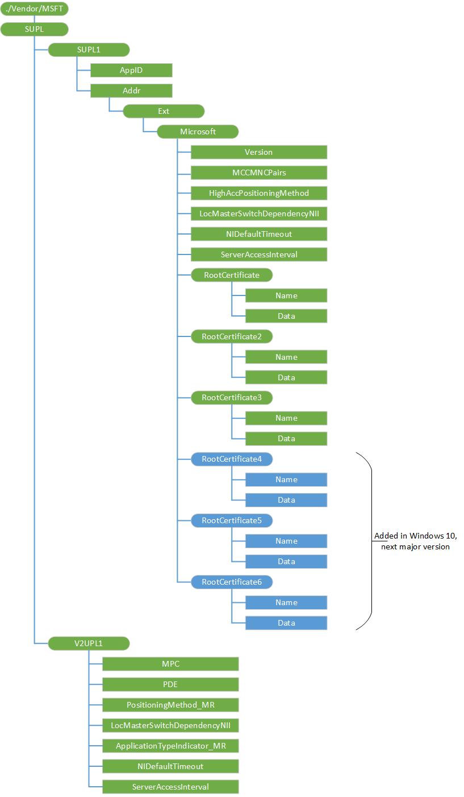

# SUPL CSP

> [!WARNING]
> Some information relates to prereleased product which may be substantially modified before it's commercially released. Microsoft makes no warranties, express or implied, with respect to the information provided here.

The SUPL configuration service provider is used to configure the location client, as shown in the following table.

<table>
<colgroup>
<col width="20%" />
<col width="40%" />
<col width="40%" />
</colgroup>
<thead>
<tr class="header">
<th>Location Service</th>
<th>SUPL</th>
<th>V2 UPL</th>
</tr>
</thead>
<tbody>
<tr class="odd">
<td><p>Connection type</p></td>
<td><p>All connections other than CDMA</p></td>
<td><p>CDMA</p></td>
</tr>
<tr class="even">
<td><p>Configuration</p></td>
<td><ul>
<li><p>Settings that need to get pushed to the GNSS driver to configure the SUPL behavior:</p>
<ul>
<li><p>Address of the Home SUPL (H-SLP) server.</p></li>
<li><p>H-SLP server certificate.</p></li>
<li><p>Positioning method.</p></li>
<li><p>Version of the protocol to use by default.</p></li>
</ul></li>
<li><p>MCC/MNC value pairs which are used to specify which networks' UUIC the SUPL account matches.</p></li>
</ul></td>
<td><ul>
<li><p>Address of the server—a mobile positioning center for non-trusted mode.</p></li>
<li><p>The positioning method used by the MPC for non-trusted mode.</p></li>
</ul></td>
</tr>
</tbody>
</table>

 

The SUPL or V2 UPL connection will be reconfigured every time the device is rebooted, a new UICC is inserted, or new settings are provisioned by using OMA Client Provisioning, OMA DM, or test tools. When the device is in roaming mode, it reverts to Mobile Station Standalone mode, in which only the built–in Microsoft location components are used.

The following diagram shows the SUPL configuration service provider management object in tree format as used by OMA DM and OMA Client Provisioning.

> **Note**   This configuration service provider requires the ID\_CAP\_CSP\_FOUNDATION capability to be accessed from a network configuration application.

 




<a href="" id="supl1"></a>**SUPL1**  
Required for SUPL. Defines the account for the SUPL Enabled Terminal (SET) node. Only one SUPL account is supported at a given time.

<a href="" id="appid"></a>**AppID**  
Required. The AppID for SUPL is automatically set to `"ap0004"`. This is a read-only value.

<a href="" id="addr"></a>**Addr**  
Optional. Specifies the address of the Home SUPL Location Platform (H-SLP) server for non-proxy mode. The value is a server address specified as a fully qualified domain name, and the port specified as an integer, with the format *server*: *port*.

If this value is not specified, the device infers the H-SLP address from the IMSI as defined in the SUPL standard. To use automatic generation of the H-SLP address based on the IMSI, the MNC length must be set correctly on the UICC. Generally, this value is 2 or 3.

For OMA DM, if the format for this node is incorrect the entry will be ignored and an error will be returned, but the configuration service provider will continue processing the rest of the parameters.

<a href="" id="version"></a>**Version**  
Optional. Determines the version of the SUPL protocol to use. For SUPL 1.0, set this value to `1`. For SUPL 2.0, set this value to `2`. The default is 1.

<a href="" id="mccmncpairs"></a>**MCCMNCPairs**  
Required. List all of the MCC and MNC pairs owned by the mobile operator. This list is used to verify that the UICC matches the network and SUPL can be used. When the UICC and network do not match, the device uses the default location service and does not use SUPL.

This value is a string with the format "(X1,Y1)(X2,Y2)…(Xn,Yn)", in which `X` is a MCC and `Y` is an MNC.

For OMA DM, if the format for this node is incorrect the entry will be ignored and an error will be returned, but the configuration service provider will continue processing the rest of the parameters.

<a href="" id="highaccpositioningmethod"></a>**HighAccPositioningMethod**  
Optional. Specifies the positioning method that the SUPL client will use for mobile originated position requests. The value can be one of the following integers:

<table>
<colgroup>
<col width="15%" />
<col width="85%" />
</colgroup>
<thead>
<tr class="header">
<th>Value</th>
<th>Description</th>
</tr>
</thead>
<tbody>
<tr class="odd">
<td><p>0</p></td>
<td><p>None: The device uses the default positioning method. In this default mode, the GNSS obtains assistance (time injection, coarse position injection and ephemeris data) from the Microsoft Positioning Service.</p></td>
</tr>
<tr class="even">
<td><p>1</p></td>
<td><p>Mobile Station Assisted: The device contacts the H-SLP server to obtain a position. The H-SLP does the calculation of the position and returns it to the device.</p></td>
</tr>
<tr class="odd">
<td><p>2</p></td>
<td><p>Mobile Station Based: The device obtains location-aiding data (almanac, ephemeris data, time and coarse initial position of the device) from the H-SLP server, and the device uses this information to help GPS obtain a fix. All position calculations are done in the device.</p></td>
</tr>
<tr class="even">
<td><p>3</p></td>
<td><p>Mobile Station Standalone: The device obtains assistance as required from the Microsoft location services.</p></td>
</tr>
<tr class="odd">
<td><p>4</p></td>
<td><p>OTDOA</p></td>
</tr>
<tr class="even">
<td><p>5</p></td>
<td><p>AFLT</p></td>
</tr>
</tbody>
</table>

 

The default is 0. The default method in Windows devices provides high-quality assisted GNSS positioning for mobile originated position requests without loading the mobile operator’s network or location services.

> **Important**   The Mobile Station Assisted, OTDOA, and AFLT positioning methods must only be configured for test purposes.

 

For OMA DM, if the format for this node is incorrect the entry will be ignored and an error will be returned, but the configuration service provider will continue processing the rest of the parameters.

<a href="" id="locmasterswitchdependencynii"></a>**LocMasterSwitchDependencyNII**  
Optional. Boolean. Specifies whether the location toggle on the **location** screen in **Settings** is also used to manage SUPL network-initiated (NI) requests for location. If the value is set to 0, the NI behavior is independent from the current location toggle setting. If the value is set to 1, the NI behavior follows the current location toggle setting. The default value is 1.

This value manages the settings for both SUPL and v2 UPL. If a device is configured for both SUPL and V2 UPL and these values differ, the SUPL setting will always be used.

<table>
<colgroup>
<col width="33%" />
<col width="33%" />
<col width="33%" />
</colgroup>
<thead>
<tr class="header">
<th>Location toggle setting</th>
<th>LocMasterSwitchDependencyNII setting</th>
<th>NI request processing allowed</th>
</tr>
</thead>
<tbody>
<tr class="odd">
<td><p>On</p></td>
<td><p>0</p></td>
<td><p>Yes</p></td>
</tr>
<tr class="even">
<td><p>On</p></td>
<td><p>1</p></td>
<td><p>Yes</p></td>
</tr>
<tr class="odd">
<td><p>Off</p></td>
<td><p>0</p></td>
<td><p>Yes</p></td>
</tr>
<tr class="even">
<td><p>Off</p></td>
<td><p>1</p></td>
<td><p>No (unless privacyOverride is set)</p></td>
</tr>
</tbody>
</table>

 

When the location toggle is set to Off and this value is set to 1, the following application requests will fail:

-   `noNotificationNoVerification`

-   `notificationOnly`

-   `notificationAndVerficationAllowedNA`

-   `notificationAndVerficationDeniedNA`

However, if `privacyOverride` is set in the message, the location will be returned.

When the location toggle is set to Off and this value is set to 0, the location toggle does not prevent SUPL network-initiated requests from working.

For OMA DM, if the format for this node is incorrect the entry will be ignored and an error will be returned, but the configuration service provider will continue processing the rest of the parameters.

<a href="" id="nidefaulttimeout"></a>**NIDefaultTimeout**  
Optional. Time in seconds that the network-initiated location request is displayed to the user, while awaiting a response and before doing the default action. The default is 30 seconds. A value between 20 and 60 seconds is recommended.

This value manages the settings for both SUPL and v2 UPL. If a device is configured for both SUPL and V2 UPL and these values differ, the SUPL setting will always be used.

<a href="" id="serveraccessinterval"></a>**ServerAccessInterval**  
Optional. Integer. Defines the minimum interval of time in seconds between mobile originated requests sent to the server to prevent overloading the mobile operator's network. The default value is 60.

<a href="" id="rootcertificate"></a>**RootCertificate**  
Required. Specifies the root certificate for the H-SLP server. Windows does not support a non-secure mode. If this node is not included, the configuration service provider will fail but may not return a specific error.

<a href="" id="rootcertificate-name"></a>**RootCertificate/Name**  
Specifies the name of the H-SLP root certificate as a string, in the format *name*.cer.

<a href="" id="rootcertificate-data"></a>**RootCertificate/Data**  
The base 64 encoded blob of the H-SLP root certificate.

<a href="" id="rootcertificate"></a>**RootCertificate2**  
Specifies the root certificate for the H-SLP server.

<a href="" id="rootcertificate2-name"></a>**RootCertificate2/Name**  
Specifies the name of the H-SLP root certificate as a string, in the format *name*.cer.

<a href="" id="rootcertificate2-data"></a>**RootCertificate2/Data**  
The base 64 encoded blob of the H-SLP root certificate.

<a href="" id="rootcertificate"></a>**RootCertificate3**  
Specifies the root certificate for the H-SLP server.

<a href="" id="rootcertificate3-name"></a>**RootCertificate3/Name**  
Specifies the name of the H-SLP root certificate as a string, in the format *name*.cer.

<a href="" id="rootcertificate3-data"></a>**RootCertificate3/Data**  
The base 64 encoded blob of the H-SLP root certificate.

<a href="" id="rootcertificate"></a>**RootCertificate4**  
Added in Windows 10, version 1809. Specifies the root certificate for the H-SLP server.

<a href="" id="rootcertificate-name"></a>**RootCertificate4/Name**  
Added in Windows 10, version 1809. Specifies the name of the H-SLP root certificate as a string, in the format *name*.cer.

<a href="" id="rootcertificate-data"></a>**RootCertificate4/Data**  
Added in Windows 10, version 1809. The base 64 encoded blob of the H-SLP root certificate.

<a href="" id="rootcertificate"></a>**RootCertificate5**  
Added in Windows 10, version 1809. Specifies the root certificate for the H-SLP server.

<a href="" id="rootcertificate2-name"></a>**RootCertificate5/Name**  
Added in Windows 10, version 1809. Specifies the name of the H-SLP root certificate as a string, in the format *name*.cer.

<a href="" id="rootcertificate2-data"></a>**RootCertificate5/Data**  
Added in Windows 10, version 1809. The base 64 encoded blob of the H-SLP root certificate.

<a href="" id="rootcertificate"></a>**RootCertificate6**  
Added in Windows 10, version 1809. Specifies the root certificate for the H-SLP server.

<a href="" id="rootcertificate3-name"></a>**RootCertificate6/Name**  
Added in Windows 10, version 1809. Specifies the name of the H-SLP root certificate as a string, in the format *name*.cer.

<a href="" id="rootcertificate3-data"></a>**RootCertificate6/Data**  
Added in Windows 10, version 1809. The base 64 encoded blob of the H-SLP root certificate.

<a href="" id="v2upl1"></a>**V2UPL1**  
Required for V2 UPL for CDMA. Specifies the account settings for user plane location and IS-801 for CDMA. Only one account is supported at a given time.

<a href="" id="mpc"></a>**MPC**  
Optional. The address of the mobile positioning center (MPC), in the format *ipAddress*: *portNumber*. For non-trusted mode of operation, this parameter is mandatory and the PDE parameter must be empty.

<a href="" id="pde"></a>**PDE**  
Optional. The address of the Position Determination Entity (PDE), in the format *ipAddress*: *portNumber*. For non-trusted mode of operation, this parameter must be empty.

<a href="" id="positioningmethod-mr"></a>**PositioningMethod\_MR**  
Optional. Specifies the positioning method that the SUPL client will use for mobile originated position requests. The value can be one of the following integers:

<table>
<colgroup>
<col width="15%" />
<col width="85%" />
</colgroup>
<thead>
<tr class="header">
<th>Value</th>
<th>Description</th>
</tr>
</thead>
<tbody>
<tr class="odd">
<td><p>0</p></td>
<td><p>None: The device uses the default positioning method. In this default mode, the GNSS obtains assistance (time injection, coarse position injection and ephemeris data) from the Microsoft Positioning Service.</p></td>
</tr>
<tr class="even">
<td><p>1</p></td>
<td><p>Mobile Station Assisted: The device contacts the H-SLP server to obtain a position. The H-SLP does the calculation of the position and returns it to the device.</p></td>
</tr>
<tr class="odd">
<td><p>2</p></td>
<td><p>Mobile Station Based: The device obtains location-aiding data (almanac, ephemeris data, time and coarse initial position of the device) from the H-SLP server, and the device uses this information to help GPS obtain a fix. All position calculations are done in the device.</p></td>
</tr>
<tr class="even">
<td><p>3</p></td>
<td><p>Mobile Station Standalone: The device obtains assistance as required from the Microsoft location services.</p></td>
</tr>
<tr class="odd">
<td><p>4</p></td>
<td><p>AFLT</p></td>
</tr>
</tbody>
</table>

 

The default is 0. The default method provides high-quality assisted GNSS positioning for mobile originated position requests without loading the mobile operator’s network or location services.

>  **Important**   The Mobile Station Assisted and AFLT positioning methods must only be configured for test purposes.

 

For OMA DM, if the format for this node is incorrect the entry will be ignored and an error will be returned, but the configuration service provider will continue processing the rest of the parameters.

<a href="" id="locmasterswitchdependencynii"></a>**LocMasterSwitchDependencyNII**  
Optional. Boolean. Specifies whether the location toggle on the **location** screen in **Settings** is also used to manage network-initiated requests for location. If the value is set to 0, the NI behavior is independent from the current location toggle setting. If the value is set to 1, the NI behavior follows the current location toggle setting. For CDMA devices, this value must be set to 1. The default value is 1.

This value manages the settings for both SUPL and v2 UPL. If a device is configured for both SUPL and V2 UPL and these values differ, the SUPL setting will always be used.

<table>
<colgroup>
<col width="33%" />
<col width="33%" />
<col width="33%" />
</colgroup>
<thead>
<tr class="header">
<th>Location toggle setting</th>
<th>LocMasterSwitchDependencyNII setting</th>
<th>NI request processing allowed</th>
</tr>
</thead>
<tbody>
<tr class="odd">
<td><p>On</p></td>
<td><p>0</p></td>
<td><p>Yes</p></td>
</tr>
<tr class="even">
<td><p>On</p></td>
<td><p>1</p></td>
<td><p>Yes</p></td>
</tr>
<tr class="odd">
<td><p>Off</p></td>
<td><p>0</p></td>
<td><p>Yes</p></td>
</tr>
<tr class="even">
<td><p>Off</p></td>
<td><p>1</p></td>
<td><p>No (unless privacyOverride is set)</p></td>
</tr>
</tbody>
</table>

 

When the location toggle is set to Off and this value is set to 1, the following application requests will fail:

-   `noNotificationNoVerification`

-   `notificationOnly`

-   `notificationAndVerficationAllowedNA`

-   `notificationAndVerficationDeniedNA`

However, if `privacyOverride` is set in the message, the location will be returned.

When the location toggle is set to Off and this value is set to 0, the location toggle does not prevent SUPL network-initiated requests from working.

For OMA DM, if the format for this node is incorrect the entry will be ignored and an error will be returned, but the configuration service provider will continue processing the rest of the parameters.

<a href="" id="applicationtypeindicator-mr"></a>**ApplicationTypeIndicator\_MR**  
Required. This value must always be set to `00000011`.

<a href="" id="nidefaulttimeout"></a>**NIDefaultTimeout**  
Optional. Time in seconds that the network-initiated location request is displayed to the user, while awaiting a response and before doing the default action. The default is 30 seconds. A value between 20 and 60 seconds is recommended.

This value manages the settings for both SUPL and v2 UPL. If a device is configured for both SUPL and V2 UPL and these values differ, the SUPL setting will always be used.

<a href="" id="serveraccessinterval"></a>**ServerAccessInterval**  
Optional. Integer. Defines the minimum interval of time in seconds between mobile originated requests sent to the server to prevent overloading the mobile operator's network. The default value is 60.

## Unsupported Nodes


The following optional nodes are not supported on Windows devices.

-   ProviderID

-   Name

-   PrefConRef

-   ToConRef

-   ToConRef/&lt;X&gt;

-   ToConRef/&lt;X&gt;/ConRef

-   AddrType

If the configuration application tries to set, delete or query these nodes, a response indicating this node is not implemented will be returned over OMA DM. In OMA Client Provisioning, the request to set this node will be ignored and the configuration service provider will continue processing the rest of the nodes.

If a mobile operator requires the communication with the H-SLP to take place over a specific connection rather than a default cellular connection, then this must be configured by using the [CM\_CellularEntries configuration service provider](cm-cellularentries-csp.md) and the [CM\_ProxyEntries configuration service provider](cm-proxyentries-csp.md) to map the H-SLP server with the required connection.

## OMA Client Provisioning examples


Adding new configuration information for a H-SLP server for SUPL. Values in italic must be replaced with correct settings for the mobile operator network. A valid binary blob must be included for the root certificate data value.

``` syntax
<?xml version="1.0" encoding="utf-8"?>
<wap-provisioningdoc>
  <characteristic type="SUPL">
    <characteristic type="SUPL1">
      <parm name="Addr" value="supl.abc.def.example.com: 7777" />
      <characteristic type="Ext">
      <characteristic type="Microsoft">
      <characteristic type="RootCertificate">
        <parm name="Name" value="certName.cer" />
        <parm name="Data" value="" datatype="binary"/>
      </characteristic>
         <parm name="MCCMNCPairs" value="(111,000)(222,111)(333,333)(444,222)" />
         <parm name="HighAccPositioningMethod" datatype="integer" value="0" />
         <parm name="LocMasterSwitchDependencyNII" datatype="integer" value="1" />
      </characteristic>
      </characteristic>
    </characteristic>
  </characteristic>
</wap-provisioningdoc>
```

Adding a SUPL and a V2 UPL account to the same device. Values in italic must be replaced with correct settings for the mobile operator network. A valid binary blob must be included for the root certificate data value.

``` syntax
<?xml version="1.0" encoding="utf-8"?>
<wap-provisioningdoc>
  <characteristic type="SUPL">
    <characteristic type="V2UPL1">
      <parm name="MPC" value="192.0.2.1:7777" />
      <parm name="PDE" value="192.0.2.1:7778" />
      <parm name="PositioningMethod_MR" datatype="integer" value="1" />
    </characteristic>
    <characteristic type="SUPL1">
      <parm name="Addr" value="supl.abc.def.example.com:7777" />
      <characteristic type="Ext">
      <characteristic type="Microsoft">
      <characteristic type="RootCertificate">
        <parm name="Name" value="certName.cer" />
        <parm name="Data" value="" datatype="binary"/>
      </characteristic>
         <parm name="MCCMNCPairs" value="(111,000)(222,111)(333,333)(444,222)" />
         <parm name="HighAccPositioningMethod" datatype="integer" value="2" />
         <parm name="LocMasterSwitchDependencyNII" datatype="integer" value="1" />
      </characteristic>
      </characteristic>
    </characteristic>
  </characteristic>
</wap-provisioningdoc>
```

## OMA DM examples


Adding a SUPL account to a device. Values in italic must be replaced with correct settings for the mobile operator network. A valid binary blob must be included for the root certificate data value.

``` syntax
<SyncML xmlns="SYNCML:SYNCML1.1">
    <SyncBody>
        <Add>
            <CmdID>Add FQDN</CmdID>
            <Item>
                <Target><LocURI>./Vendor/MSFT/SUPL/SUPL1/Addr</LocURI></Target>
                <Meta>
                <Format xmlns="syncml:metinf">chr</Format>
                </Meta>
                <Data>supl.abc.def.example.com:2222</Data>
            </Item>
        </Add>
        <Add>
            <CmdID>Add MCCMNC</CmdID>
            <Item>
                <Target><LocURI>./Vendor/MSFT/SUPL/SUPL1/Ext/Microsoft/MCCMNCPairs</LocURI></Target>
                <Meta>
                <Format xmlns="syncml:metinf">chr</Format>
                </Meta>
                <Data>(111,000)(222,111)(333,333)(444,222)</Data>
            </Item>
        </Add>
        <Add>
            <CmdID>Add HighAccPositioningMethod</CmdID>
            <Item>
                <Target><LocURI>./Vendor/MSFT/SUPL/SUPL1/Ext/Microsoft/HighAccPositioningMethod</LocURI></Target>
                <Meta>
                <Format xmlns="syncml:metinf">int</Format>
                </Meta>
                <Data>2</Data>
            </Item>
        </Add>
        <Add>
            <CmdID>Add LocMasterSWDepend</CmdID>
            <Item>
                <Target><LocURI>./Vendor/MSFT/SUPL/SUPL1/Ext/Microsoft/LocMasterSwitchDependencyNII</LocURI></Target>
                <Meta>
                <Format xmlns="syncml:metinf">int</Format>
                </Meta>
                <Data>1</Data>
            </Item>
        </Add>
        <Add>
            <CmdID>Add Cert name</CmdID>

            <Item>
                <Target><LocURI>./Vendor/MSFT/SUPL/SUPL1/Ext/Microsoft/RootCertificate/Name</LocURI></Target>
                <Meta>
                <Format xmlns="syncml:metinf">chr</Format>
                </Meta>
                <Data>certName.cer</Data>
            </Item>
        </Add>
        <Add>
            <CmdID>Add Cert data - 200</CmdID>

            <Item>
                <Target><LocURI>./Vendor/MSFT/SUPL/SUPL1/Ext/Microsoft/RootCertificate/Data</LocURI></Target>
                <Meta>
                <Format xmlns="syncml:metinf">b64</Format>
                </Meta>
                <Data></Data>
            </Item>
        </Add>
        <Final/>
    </SyncBody>
</SyncML>
```

## Microsoft Custom Elements


The following table shows the Microsoft custom elements that this configuration service provider supports for OMA Client Provisioning.

<table>
<colgroup>
<col width="50%" />
<col width="50%" />
</colgroup>
<thead>
<tr class="header">
<th>Elements</th>
<th>Available</th>
</tr>
</thead>
<tbody>
<tr class="odd">
<td><p>parm-query</p></td>
<td><p>Yes</p></td>
</tr>
<tr class="even">
<td><p>characteristic-query</p></td>
<td><p>Yes</p>
<p>Recursive query: No</p>
<p>Top level query: No</p></td>
</tr>
</tbody>
</table>

 

## Related topics


[Configuration service provider reference](configuration-service-provider-reference.md)

 

 


