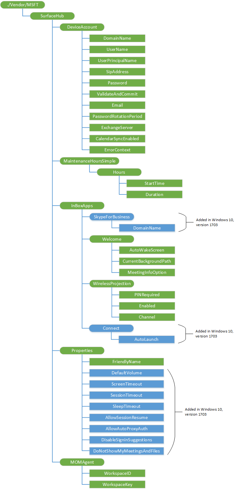

# SurfaceHub CSP

The SurfaceHub configuration service provider (CSP) is used to configure Microsoft Surface Hub settings. This CSP was added in Windows 10, version 1511.

The following diagram shows the SurfaceHub CSP management objects in tree format.



<a href="" id="--vendor-msft-surfacehub"></a>**./Vendor/MSFT/SurfaceHub**  
<p style="margin-left: 20px">The root node for the Surface Hub configuration service provider.

<a href="" id="deviceaccount"></a>**DeviceAccount**  
<p style="margin-left: 20px">Node for setting device account information. A device account is a Microsoft Exchange account that is connected with Skype for Business, which allows people to join scheduled meetings, make Skype for Business calls, and share content from the device. See the Surface Hub administrator guide for more information about setting up a device account.

<p style="margin-left: 20px">To use a device account from Azure Active Directory

1.  Set the UserPrincipalName (for Azure AD).
2.  Set a valid Password.
3.  Execute ValidateAndCommit to validate the specified username and password combination against Azure AD.
4.  Get the ErrorContext in case something goes wrong during validation.

> [!NOTE]
> If the device cannot auto-discover the Exchange server and Session Initiation Protocol (SIP) address from this information, you should specify the ExchangeServer and SipAddress.

 
<p style="margin-left: 20px">Here&#39;s a SyncML example.

``` syntax
 <SyncML xmlns="SYNCML:SYNCML1.2">
        <SyncBody>
            <Replace>
                <CmdID>1</CmdID>
                <Item>
                    <Target>
                        <LocURI>./Vendor/MSFT/SurfaceHub/DeviceAccount/UserPrincipalName</LocURI>
                    </Target>
                    <Meta>
                        <Format xmlns="syncml:metinf">chr</Format>
                    </Meta>
                    <Data>user@contoso.com</Data>
                </Item>
            </Replace>
            <Replace>
                <CmdID>2</CmdID>
                <Item>
                    <Target>
                        <LocURI>./Vendor/MSFT/SurfaceHub/DeviceAccount/Password</LocURI>
                    </Target>
                    <Meta>
                        <Format xmlns="syncml:metinf">chr</Format>
                    </Meta>
                    <Data>password</Data>
                </Item>
            </Replace>
            <Exec>
                <CmdID>3</CmdID>
                <Item>
                    <Target>
                        <LocURI>./Vendor/MSFT/SurfaceHub/DeviceAccount/ValidateAndCommit</LocURI>
                    </Target>
                </Item>
            </Exec>
            <Get>
                <CmdID>4</CmdID>
                <Item>
                    <Target>
                        <LocURI>./Vendor/MSFT/SurfaceHub/DeviceAccount/ErrorContext</LocURI>
                    </Target>
                </Item>
            </Get>
            <Final/> 
        </SyncBody>
    </SyncML>
```

<p style="margin-left: 20px">To use a device account from Active Directory

1.  Set the DomainName.
2.  Set the UserName.
3.  Set a valid Password.
4.  Execute the ValidateAndCommit node.

<a href="" id="deviceaccount-domainname"></a>**DeviceAccount/DomainName**  
<p style="margin-left: 20px">Domain of the device account when you are using Active Directory. To use a device account from Active Directory, you should specify both DomainName and UserName for the device account.

<p style="margin-left: 20px">The data type is char. Supported operation is Get and Replace.

<a href="" id="deviceaccount-username"></a>**DeviceAccount/UserName**  
<p style="margin-left: 20px">Username of the device account when you are using Active Directory. To use a device account from Active Directory, you should specify both DomainName and UserName for the device account.

<p style="margin-left: 20px">The data type is char. Supported operation is Get and Replace.

<a href="" id="deviceaccount-userprincipalname"></a>**DeviceAccount/UserPrincipalName**  
<p style="margin-left: 20px">User principal name (UPN) of the device account. To use a device account from Azure Active Directory or a hybrid deployment, you should specify the UPN of the device account.

<p style="margin-left: 20px">The data type is char. Supported operation is Get and Replace.

<a href="" id="deviceaccount-sipaddress"></a>**DeviceAccount/SipAddress**  
<p style="margin-left: 20px">Session Initiation Protocol (SIP) address of the device account. Normally, the device will try to auto-discover the SIP. This field is only required if auto-discovery fails.

<p style="margin-left: 20px">The data type is char. Supported operation is Get and Replace.

<a href="" id="deviceaccount-password"></a>**DeviceAccount/Password**  
<p style="margin-left: 20px">Password for the device account.

<p style="margin-left: 20px">The data type is char. Supported operation is Get and Replace. The operation Get is allowed, but it will always return a blank.

<a href="" id="deviceaccount-validateandcommit"></a>**DeviceAccount/ValidateAndCommit**  
<p style="margin-left: 20px">This method validates the data provided and then commits the changes.

<p style="margin-left: 20px">The data type is char. Supported operation is Execute.

<a href="" id="deviceaccount-email"></a>**DeviceAccount/Email**  
<p style="margin-left: 20px">Email address of the device account.

<p style="margin-left: 20px">The data type is char.

<a href="" id="deviceaccount-passwordrotationenabled"></a>**DeviceAccount/PasswordRotationEnabled**  
<p style="margin-left: 20px">Specifies whether automatic password rotation is enabled. If you enforce a password expiration policy on the device account, use this setting to allow the device to manage its own password by changing it frequently, without requiring you to manually update the account information when the password expires. You can reset the password at any time using Active Directory (or Azure AD).

<p style="margin-left: 20px">Valid values:

-   0 - password rotation enabled
-   1 - disabled

<p style="margin-left: 20px">The data type is int. Supported operation is Get and Replace.

<a href="" id="deviceaccount-exchangeserver"></a>**DeviceAccount/ExchangeServer**  
<p style="margin-left: 20px">Exchange server of the device account. Normally, the device will try to auto-discover the Exchange server. This field is only required if auto-discovery fails.

<p style="margin-left: 20px">The data type is char. Supported operation is Get and Replace.

<a href="" id="deviceaccount-calendarsyncenabled"></a>**DeviceAccount/CalendarSyncEnabled**  
<p style="margin-left: 20px">Specifies whether calendar sync and other Exchange server services is enabled.

<p style="margin-left: 20px">The data type is bool. Supported operation is Get and Replace.

<a href="" id="deviceaccount-errorcontext"></a>**DeviceAccount/ErrorContext**  
<p style="margin-left: 20px">If there is an error calling ValidateAndCommit, there is additional context for that error in this node. Here are the possible error values:

<table style="margin-left: 20px">
<colgroup>
<col width="15%" />
<col width="20%" />
<col width="65%" />
</colgroup>
<thead>
<tr class="header">
<th>ErrorContext value</th>
<th>Stage where error occured</th>
<th>Description and suggestions</th>
</tr>
</thead>
<tbody>
<tr class="odd">
<td><p>1</p></td>
<td><p>Unknown</p></td>
<td><p></p></td>
</tr>
<tr class="even">
<td><p>2</p></td>
<td><p>Populating account</p></td>
<td><p>Unable to retrieve account details using the username and password you provided.</p>
<ul>
<li>For Azure AD accounts, ensure that UserPrincipalName and Password are valid.</li>
<li>For AD accounts, ensure that DomainName, UserName, and Password are valid.</li>
<li>Ensure that the specified account has an Exchange server mailbox.</li>
</ul></td>
</tr>
<tr class="odd">
<td><p>3</p></td>
<td><p>Populating Exchange server address</p></td>
<td><p>Unable to auto-discover your Exchange server address. Try to manually specify the Exchange server address using the ExchangeServer field.</p></td>
</tr>
<tr class="even">
<td><p>4</p></td>
<td><p>Validating Exchange server address</p></td>
<td><p>Unable to validate the Exchange server address. Ensure that the ExchangeServer field is valid.</p></td>
</tr>
<tr class="odd">
<td><p>5</p></td>
<td><p>Saving account information</p></td>
<td><p>Unable to save account details to the system.</p></td>
</tr>
<tr class="even">
<td><p>6</p></td>
<td><p>Validating EAS policies</p></td>
<td><p>The device account uses an unsupported EAS policy. Make sure the EAS policy is configured correctly according to the admin guide.</p></td>
</tr>
</tbody>
</table>
 
<p style="margin-left: 20px">The data type is int. Supported operation is Get.

<a href="" id="maintenancehourssimple-hours"></a>**MaintenanceHoursSimple/Hours**  
<p style="margin-left: 20px">Node for maintenance schedule.

<a href="" id="maintenancehourssimple-hours-starttime"></a>**MaintenanceHoursSimple/Hours/StartTime**  
<p style="margin-left: 20px">Specifies the start time for maintenance hours in minutes from midnight. For example, to set a 2:00 am start time, set this value to 120.

<p style="margin-left: 20px">The data type is int. Supported operation is Get and Replace.

<a href="" id="maintenancehourssimple-hours-duration"></a>**MaintenanceHoursSimple/Hours/Duration**  
<p style="margin-left: 20px">Specifies the duration of maintenance window in minutes. For example, to set a 3-hour duration, set this value to 180.

<p style="margin-left: 20px">The data type is int. Supported operation is Get and Replace.

<a href="" id="inboxapps"></a>**InBoxApps**  
<p style="margin-left: 20px">Node for the in-box app settings.

<a href="" id="inboxapps-skypeforbusiness"></a>**InBoxApps/SkypeForBusiness**   
<p style="margin-left: 20px">Added in Windows 10, version 1703. Node for the Skype for Business settings.

<a href="" id="inboxapps-skypeforbusiness-domainname"></a>**InBoxApps/SkypeForBusiness/DomainName**  
<p style="margin-left: 20px">Added in Windows 10, version 1703. Specifies the domain of the Skype for Business account when you are using Active Directory. For more information, see <a href="https://support.office.com/en-us/article/Set-up-Skype-for-Business-Online-40296968-e779-4259-980b-c2de1c044c6e?ui=en-US&amp;rs=en-US&amp;ad=US#bkmk_users" data-raw-source="[Set up Skype for Business Online](https://support.office.com/en-us/article/Set-up-Skype-for-Business-Online-40296968-e779-4259-980b-c2de1c044c6e?ui=en-US&amp;rs=en-US&amp;ad=US#bkmk_users)">Set up Skype for Business Online</a>.

<p style="margin-left: 20px">The data type is char. Supported operation is Get and Replace.

<a href="" id="inboxapps-welcome"></a>**InBoxApps/Welcome**  
<p style="margin-left: 20px">Node for the welcome screen.

<a href="" id="inboxapps-welcome-autowakescreen"></a>**InBoxApps/Welcome/AutoWakeScreen**  
<p style="margin-left: 20px">Automatically turn on the screen using motion sensors.

<p style="margin-left: 20px">The data type is bool. Supported operation is Get and Replace.

<a href="" id="inboxapps-welcome-currentbackgroundpath"></a>**InBoxApps/Welcome/CurrentBackgroundPath**  
<p style="margin-left: 20px">Background image for the welcome screen. To set this, specify a https URL to a PNG file (only PNGs are supported for security reasons).

<p style="margin-left: 20px">The data type is string. Supported operation is Get and Replace.

<a href="" id="inboxapps-welcome-meetinginfooption"></a>**InBoxApps/Welcome/MeetingInfoOption**  
<p style="margin-left: 20px">Meeting information displayed on the welcome screen.

<p style="margin-left: 20px">Valid values:

-   0 - Organizer and time only
-   1 - Organizer, time, and subject. Subject is hidden in private meetings.

<p style="margin-left: 20px">The data type is int. Supported operation is Get and Replace.

<a href="" id="inboxapps-wirelessprojection"></a>**InBoxApps/WirelessProjection**  
<p style="margin-left: 20px">Node for the wireless projector app settings.

<a href="" id="inboxapps-wirelessprojection-pinrequired"></a>**InBoxApps/WirelessProjection/PINRequired**  
<p style="margin-left: 20px">Users must enter a PIN to wirelessly project to the device.

<p style="margin-left: 20px">The data type is bool. Supported operation is Get and Replace.

<a href="" id="inboxapps-wirelessprojection-enabled"></a>**InBoxApps/WirelessProjection/Enabled**  
<p style="margin-left: 20px">Enables wireless projection to the device.

<p style="margin-left: 20px">The data type is bool. Supported operation is Get and Replace.

<a href="" id="inboxapps-wirelessprojection-channel"></a>**InBoxApps/WirelessProjection/Channel**  
<p style="margin-left: 20px">Wireless channel to use for Miracast operation. The supported channels are defined by the Wi-Fi Alliance Wi-Fi Direct specification.

<table style="margin-left: 20px">
<colgroup>
<col width="50%" />
<col width="50%" />
</colgroup>
<tbody>
<tr class="odd">
<td><p>Works with all Miracast senders in all regions</p></td>
<td><p>1, 3, 4, 5, 6, 7, 8, 9, 10, 11</p></td>
</tr>
<tr class="even">
<td><p>Works with all 5ghz band Miracast senders in all regions</p></td>
<td><p>36, 40, 44, 48</p></td>
</tr>
<tr class="odd">
<td><p>Works with all 5ghz band Miracast senders in all regions except Japan</p></td>
<td><p>149, 153, 157, 161, 165</p></td>
</tr>
</tbody>
</table>

 
<p style="margin-left: 20px">The default value is 255. Outside of regulatory concerns, if the channel is configured incorrectly the driver will either not boot, or will broadcast on the wrong channel (which senders won&#39;t be looking for).

<p style="margin-left: 20px">The data type is int. Supported operation is Get and Replace.

<a href="" id="inboxapps-connect"></a>**InBoxApps/Connect**  
<p style="margin-left: 20px">Added in Windows 10, version 1703. Node for the Connect app.

<a href="" id="inboxapps-welcome-autowakescreen"></a>**InBoxApps/Connect/AutoLaunch**  
<p style="margin-left: 20px">Added in Windows 10, version 1703. Specifies whether to automatically launch the Connect app whenever a projection is initiated.

<p style="margin-left: 20px">If this setting is true, the Connect app will be automatically launched. If false, the user will need to launch the Connect app manually from the Hub’s settings.

<p style="margin-left: 20px">The data type is bool. Supported operation is Get and Replace.

<a href="" id="properties"></a>**Properties**  
<p style="margin-left: 20px">Node for the device properties.

<a href="" id="properties-friendlyname"></a>**Properties/FriendlyName**  
<p style="margin-left: 20px">Friendly name of the device. Specifies the name that users see when they want to wirelessly project to the device.

<p style="margin-left: 20px">The data type is string. Supported operation is Get and Replace.

<a href="" id="properties-defaultvolume"></a>**Properties/DefaultVolume**  
<p style="margin-left: 20px">Added in Windows 10, version 1703. Specifies the default volume value for a new session. Permitted values are 0-100. The default is 45.

<p style="margin-left: 20px">The data type is int. Supported operation is Get and Replace.

<a href="" id="properties-screentimeout"></a>**Properties/ScreenTimeout**  
<p style="margin-left: 20px">Added in Windows 10, version 1703. Specifies the number of minutes until the Hub screen turns off. 

<p style="margin-left: 20px">The following table shows the permitted values.

<table style="margin-left: 20px">
<thead>
<tr class="header">
<th>Value</th>
<th>Description</th>
</tr>
</thead>
<tbody>
<tr>
<td>0</td>
<td>Never timeout</td></tr>
<tr>
<td>1</td>
<td>1 minute</td>
</tr>
<tr>
<td>2</td>
<td>2 minutes</td></tr>
<tr>
<td>3</td>
<td>3 minutes</td></tr>
<tr>
<td>5</td>
<td>5 minutes (default)</td></tr>
<tr>
<td>10</td>
<td>10 minutes</td></tr>
<tr>
<td>15</td>
<td>15 minutes</td></tr>
<tr>
<td>30</td>
<td>30 minutes</td></tr>
<tr>
<td>60</td>
<td>1 hour</td></tr>
<tr>
<td>120</td>
<td>2 hours</td></tr>
<tr>
<td>240</td>
<td>4 hours</td></tr>
</tbody>
</table>

<p style="margin-left: 20px">The data type is int. Supported operation is Get and Replace.

<a href="" id="properties-sessiontimeout"></a>**Properties/SessionTimeout**  
<p style="margin-left: 20px">Added in Windows 10, version 1703. Specifies the number of minutes until the session times out. 

<p style="margin-left: 20px">The following table shows the permitted values.

<table style="margin-left: 20px">
<thead>
<tr class="header">
<th>Value</th>
<th>Description</th>
</tr>
</thead>
<tbody>
<tr>
<td>0</td>
<td>Never timeout</td></tr>
<tr>
<td>1</td>
<td>1 minute (default)</td>
</tr>
<tr>
<td>2</td>
<td>2 minutes</td></tr>
<tr>
<td>3</td>
<td>3 minutes</td></tr>
<tr>
<td>5</td>
<td>5 minutes</td></tr>
<tr>
<td>10</td>
<td>10 minutes</td></tr>
<tr>
<td>15</td>
<td>15 minutes</td></tr>
<tr>
<td>30</td>
<td>30 minutes</td></tr>
<tr>
<td>60</td>
<td>1 hour</td></tr>
<tr>
<td>120</td>
<td>2 hours</td></tr>
<tr>
<td>240</td>
<td>4 hours</td></tr>
</tbody>
</table>

<p style="margin-left: 20px">The data type is int. Supported operation is Get and Replace.

<a href="" id="properties-sleeptimeout"></a>**Properties/SleepTimeout**  
<p style="margin-left: 20px">Added in Windows 10, version 1703. Specifies the number of minutes until the Hub enters sleep mode. 

<p style="margin-left: 20px">The following table shows the permitted values.

<table style="margin-left: 20px">
<thead>
<tr class="header">
<th>Value</th>
<th>Description</th>
</tr>
</thead>
<tbody>
<tr>
<td>0</td>
<td>Never timeout</td></tr>
<tr>
<td>1</td>
<td>1 minute</td>
</tr>
<tr>
<td>2</td>
<td>2 minutes</td></tr>
<tr>
<td>3</td>
<td>3 minutes</td></tr>
<tr>
<td>5</td>
<td>5 minutes (default)</td></tr>
<tr>
<td>10</td>
<td>10 minutes</td></tr>
<tr>
<td>15</td>
<td>15 minutes</td></tr>
<tr>
<td>30</td>
<td>30 minutes</td></tr>
<tr>
<td>60</td>
<td>1 hour</td></tr>
<tr>
<td>120</td>
<td>2 hours</td></tr>
<tr>
<td>240</td>
<td>4 hours</td></tr>
</tbody>
</table>

<p style="margin-left: 20px">The data type is int. Supported operation is Get and Replace.

<a href="" id="properties-allowsessionresume"></a>**Properties/AllowSessionResume**  
<p style="margin-left: 20px">Added in Windows 10, version 1703. Specifies whether to allow the ability to resume a session when the session times out. 

<p style="margin-left: 20px">If this setting is true, the &quot;Resume Session&quot; feature will be available on the welcome screen when the screen is idle. If false, once the screen idles, the session will be automatically cleaned up as if the “End Session&quot; feature was initiated. 

<p style="margin-left: 20px">The data type is bool. Supported operation is Get and Replace.

<a href="" id="properties-allowautoproxyauth"></a>**Properties/AllowAutoProxyAuth**  
<p style="margin-left: 20px">Added in Windows 10, version 1703. Specifies whether to use the device account for proxy authentication.

<p style="margin-left: 20px">If this setting is true, the device account will be used for proxy authentication. If false, a separate account will be used.

<p style="margin-left: 20px">The data type is bool. Supported operation is Get and Replace.

<a href="" id="properties-disablesigninsuggestions"></a>**Properties/DisableSigninSuggestions**  
<p style="margin-left: 20px">Added in Windows 10, version 1703. Specifies whether to disable auto-populating of the sign-in dialog with invitees from scheduled meetings. 

<p style="margin-left: 20px">If this setting is true, the sign-in dialog will not be populated. If false, the dialog will auto-populate.

<p style="margin-left: 20px">The data type is bool. Supported operation is Get and Replace.

<a href="" id="properties-donotshowmymeetingsandfiles"></a>**Properties/DoNotShowMyMeetingsAndFiles**  
<p style="margin-left: 20px">Added in Windows 10, version 1703. Specifies whether to disable the &quot;My meetings and files&quot; feature in the Start menu, which shows the signed-in user&#39;s meetings and files from Office 365.

<p style="margin-left: 20px">If this setting is true, the “My meetings and files” feature will not be shown. When false, the “My meetings and files” feature will be shown.

<p style="margin-left: 20px">The data type is bool. Supported operation is Get and Replace.

<a href="" id="momagent"></a>**MOMAgent**  
<p style="margin-left: 20px">Node for the Microsoft Operations Management Suite.

<a href="" id="momagent-workspaceid"></a>**MOMAgent/WorkspaceID**  
<p style="margin-left: 20px">GUID identifying the Microsoft Operations Management Suite workspace ID to collect the data. Set this to an empty string to disable the MOM agent.

<p style="margin-left: 20px">The data type is string. Supported operation is Get and Replace.

<a href="" id="momagent-workspacekey"></a>**MOMAgent/WorkspaceKey**  
<p style="margin-left: 20px">Primary key for authenticating with the workspace.

<p style="margin-left: 20px">The data type is string. Supported operation is Get and Replace. The Get operation is allowed, but it will always return an empty string.

 

 


