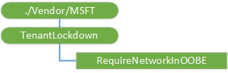

# TenantLockdown CSP

> [!WARNING]
> Some information relates to prereleased product which may be substantially modified before it's commercially released. Microsoft makes no warranties, express or implied, with respect to the information provided here. This CSP was added in Windows 10, version 1809.

The TenantLockdown configuration service provider is used by the IT admin to lock a device to a tenant, which ensures that the device remains bound to the tenant in case of accidental or intentional resets or wipes.

> [!Note]  
> The forced network connection is only applicable to devices after reset (not new).

The following diagram shows the TenantLockdown configuration service provider in tree format.

**./Vendor/MSFT/TenantLockdown**  
The root node.

**RequireNetworkInOOBE**  
Specifies whether to require a network connection during the out-of-box experience (OOBE) at first logon.

When RequireNetworkInOOBE is true, when the device goes through OOBE at first logon or after a reset, the user is required to choose a network before proceeding. There is no "skip for now" option.

Value type is bool. Supported operations are Get and Replace.

-  true - Require network in OOBE  
-  false - No network connection requirement in OOBE

Example scenario:  Henry is the IT admin at Contoso. He deploys 1000 devices successfully with RequireNetworkInOOBE set to true. When users accidentally or intentionally reset their device, they are required to connect to a network before they can proceed. Upon successful connection, users see the Contoso branded sign-in experience where they must use their Azure AD credentials. There is no option to skip the network connection and create a local account.
