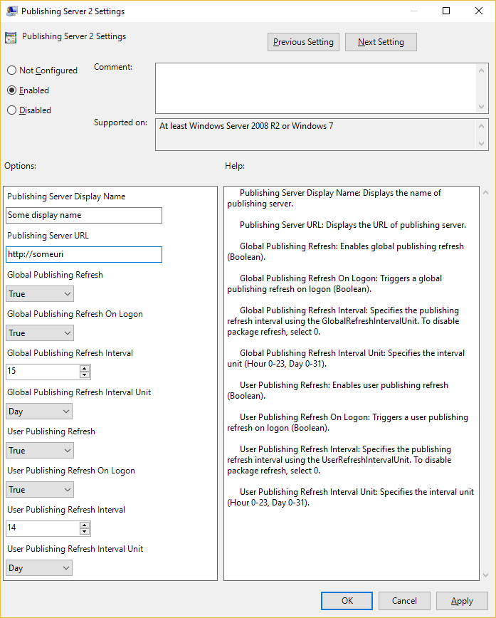

# Understanding ADMX-backed policies

Due to increased simplicity and the ease with which devices can be targeted, enterprise businesses are finding it increasingly advantageous to move their PC management to a cloud-based device management solution. Unfortunately, current Windows PC device-management solutions lack the critical policy and app settings configuration capabilities that are supported in a traditional PC management solution. 

Starting in Windows 10 version 1703, Mobile Device Management (MDM) policy configuration support will be expanded to allow access of select Group Policy administrative templates (ADMX-backed policies) for Windows PCs via the Policy configuration service provider (CSP). This expanded access ensures that enterprises do not need to compromise security of their devices in the cloud.

## <a href="" id="background"></a>Background

In addition to standard policies, the Policy CSP can now also handle ADMX-backed policies. In an ADMX-backed policy, an administrative template contains the metadata of a Window Group Policy and can be edited in the Local Group Policy Editor on a PC. Each administrative template specifies the registry keys (and their values) that are associated with a Group Policy and defines the policy settings that can be managed. Administrative templates organize Group Policies in a hierarchy in which each segment in the hierarchical path is defined as a category. Each setting in a Group Policy administrative template corresponds to a specific registry value. These Group Policy settings are defined in a standards-based, XML file format known as an ADMX file. For more information, see [Group Policy ADMX Syntax Reference Guide](https://technet.microsoft.com/library/cc753471(v=ws.10).aspx). 

ADMX files can either describe operating system (OS) Group Policies that are shipped with Windows or they can describe settings of applications, which are separate from the OS and can usually be downloaded and installed on a PC.
Depending on the specific category of the settings that they control (OS or application), the administrative template settings are found in the following two locations in the Local Group Policy Editor:
-	OS settings: Computer Configuration/Administrative Templates
-	Application settings: User Configuration/Administrative Templates 

In a domain controller/Group Policy ecosystem, Group Policies are automatically added to the registry of the client computer or user profile by the Administrative Templates Client Side Extension (CSE) whenever the client computer processes a Group Policy. Conversely, in an MDM-managed client, ADMX files are leveraged to define policies independent of Group Policies. Therefore, in an MDM-managed client, a Group Policy infrastructure, including the Group Policy Service (gpsvc.exe), is not required.

An ADMX file can either be shipped with Windows (located at `%SystemRoot%\policydefinitions`) or it can be ingested to a device through the Policy CSP URI (`./Vendor/MSFT/Policy/ConfigOperations/ADMXInstall`). Inbox ADMX files are processed into MDM policies at OS-build time. ADMX files that are ingested are processed into MDM policies post-OS shipment through the Policy CSP. Because the Policy CSP does not rely upon any aspect of the Group Policy client stack, including the PC’s Group Policy Service (GPSvc), the policy handlers that are ingested to the device are able to react to policies that are set by the MDM.

Windows maps the name and category path of a Group Policy to a MDM policy area and policy name by parsing the associated ADMX file, finding the specified Group Policy, and storing the definition (metadata) in the MDM Policy CSP client store. When the MDM policy is referenced by a SyncML command and the Policy CSP URI, `.\[device|user]\vendor\msft\policy\[config|result]\<area>\<policy>`, this metadata is referenced and determines which registry keys are set or removed. For a list of ADMX-backed policies supported by MDM, see [Policy CSP - ADMX-backed policies](https://docs.microsoft.com/windows/client-management/mdm/policy-configuration-service-provider#admx-backed-policies).

>[!TIP]
>Intune has added a number of ADMX-backed administrative templates in public preview. Check if the policy settings you need are available in a template before using the SyncML method described below. [Learn more about Intune's administrative templates.](https://docs.microsoft.com/intune/administrative-templates-windows)

## <a href="" id="admx-files-and-the-group-policy-editor"></a>ADMX files and the Group Policy Editor

To capture the end-to-end MDM handling of ADMX Group Policies, an IT administrator must use a UI, such as the Group Policy Editor (gpedit.msc), to gather the necessary data. The MDM ISV console UI determines how to gather the needed Group Policy data from the IT administrator. ADMX-backed Group Policies are organized in a hierarchy and can have a scope of machine, user, or both. The Group Policy example in the next section uses a machine-wide Group Policy named “Publishing Server 2 Settings.” When this Group Policy is selected, its available states are **Not Configured**, **Enabled**, and **Disabled**. 

The ADMX file that the MDM ISV uses to determine what UI to display to the IT administrator is the same ADMX file that the client uses for the policy definition. The ADMX file is processed either by the OS at build time or set by the client at OS runtime. In either case, the client and the MDM ISV must be synchronized with the ADMX policy definitions. Each ADMX file corresponds to a Group Policy category and typically contains several policy definitions, each of which represents a single Group Policy. For example, the policy definition for the “Publishing Server 2 Settings” is contained in the appv.admx file, which holds the policy definitions for the Microsoft Application Virtualization (App-V) Group Policy category. 

Group Policy option button setting:
-	If **Enabled** is selected, the necessary data entry controls are displayed for the user in the UI. When IT administrator enters the data and clicks **Apply**, the following events occur:
    -	 The MDM ISV server sets up a Replace SyncML command with a payload that contains the user-entered data.  
    -	 The MDM client stack receives this data, which causes the Policy CSP to update the device’s registry per the ADMX-backed policy definition.

-	If **Disabled** is selected and you click **Apply**, the following events occur:
    -	 The MDM ISV server sets up a Replace SyncML command with a payload set to `<disabled\>`. 
    -	 The MDM client stack receives this command, which causes the Policy CSP to either delete the device’s registry settings, set the registry keys, or both, per the state change directed by the ADMX-backed policy definition.

-	If **Not Configured** is selected and you click **Apply**, the following events occur:
    -	 MDM ISV server sets up a Delete SyncML command. 
    -	 The MDM client stack receives this command, which causes the Policy CSP to delete the device’s registry settings per the ADMX-backed policy definition.

The following diagram shows the main display for the Group Policy Editor.


The following diagram shows the settings for the "Publishing Server 2 Settings" Group Policy in the Group Policy Editor.



Note that most Group Policies are a simple Boolean type. For a Boolean Group Policy, if you select **Enabled**, the options panel contains no data input fields and the payload of the SyncML is simply `<enabled/>`. However, if there are data input fields in the options panel, the MDM server must supply this data. The following *Enabling a Group Policy* example illustrates this complexity. In this example, 10 name-value pairs are described by `<data />` tags in the payload, which correspond to the 10 data input fields in the Group Policy Editor options panel for the "Publishing Server 2 Settings" Group Policy. The ADMX file, which defines the Group Policies, is consumed by the MDM server, similarly to how the Group Policy Editor consumes it. The Group Policy Editor displays a UI to receive the complete Group Policy instance data, which the MDM server’s IT administrator console must also do. For every `<text>` element and id attribute in the ADMX policy definition, there must be a corresponding `<data />` element and id attribute in the payload. The ADMX file drives the policy definition and is required by the MDM server via the SyncML protocol.

> [!IMPORTANT]
> Any data entry field that is displayed in the Group Policy page of the Group Policy Editor must be supplied in the encoded XML of the SyncML payload. The SyncML data payload is equivalent to the user-supplied Group Policy data through GPEdit.msc. 

For more information about the Group Policy description format, see [Administrative Template File (ADMX) format](https://msdn.microsoft.com/library/aa373476(v=vs.85).aspx). Elements can be Text, MultiText, Boolean, Enum, Decimal, or List (for more information, see [policy elements](https://msdn.microsoft.com/library/dn606004(v=vs.85).aspx)). 

For example, if you search for the string, "Publishing_Server2_Name_Prompt" in both the *Enabling a policy* example and its corresponding ADMX policy definition in the appv.admx file, you will find the following occurrences:

Enabling a policy example:
```XML
`<data id="Publishing_Server2_Name_Prompt" value="name"/>` 
```

Appv.admx file:
```XML
      <elements>
        <text id="Publishing_Server2_Name_Prompt" valueName="Name" required="true"/>
```


## <a href="" id="admx-backed-policy-examples"></a>ADMX-backed policy examples

The following SyncML examples describe how to set a MDM policy that is defined by an ADMX template, specifically the Publishing_Server2_Policy Group Policy description in the application virtualization ADMX file, appv.admx. Note that the functionality that this Group Policy manages is not important; it is used to illustrate only how an MDM ISV can set an ADMX-backed policy. These SyncML examples illustrate common options and the corresponding SyncML code that can be used for testing your policies. Note that the payload of the SyncML must be XML-encoded; for this XML encoding, you can use favorite online tool. To avoid encoding the payload, you can use CData if your MDM supports it. For more information, see [CDATA Sections](http://www.w3.org/TR/REC-xml/#sec-cdata-sect).


### <a href="" id="enabling-a-policy"></a>Enabling a policy

**Payload**
```XML
<enabled/>
<data id="Publishing_Server2_Name_Prompt" value="Name"/>
<data id="Publishing_Server_URL_Prompt" value="http://someuri"/>
<data id="Global_Publishing_Refresh_Options" value="1"/>
<data id="Global_Refresh_OnLogon_Options" value="0"/>
<data id="Global_Refresh_Interval_Prompt" value="15"/>
<data id="Global_Refresh_Unit_Options" value="0"/>
<data id="User_Publishing_Refresh_Options" value="0"/>
<data id="User_Refresh_OnLogon_Options" value="0"/>
<data id="User_Refresh_Interval_Prompt" value="15"/>
<data id="User_Refresh_Unit_Options" value="1"/>
```
**Request SyncML**
```XML
<?xml version="1.0" encoding="utf-8"?>
<SyncML xmlns="SYNCML:SYNCML1.2">
  <SyncBody>
    <Replace>
      <CmdID>2</CmdID>
      <Item>
        <Meta>
          <Format>chr</Format>
          <Type>text/plain</Type>
        </Meta>
        <Target>
          <LocURI>./Device/Vendor/MSFT/Policy/Config/AppVirtualization/PublishingAllowServer2</LocURI>
        </Target>
        <Data>
        <![CDATA[<enabled/><data id="Publishing_Server2_Name_Prompt" value="name prompt"/><data 
          id="Publishing_Server_URL_Prompt" value="URL prompt"/><data 
          id="Global_Publishing_Refresh_Options" value="1"/><data 
          id="Global_Refresh_OnLogon_Options" value="0"/><data 
          id="Global_Refresh_Interval_Prompt" value="15"/><data 
          id="Global_Refresh_Unit_Options" value="0"/><data 
          id="User_Publishing_Refresh_Options" value="0"/><data 
          id="User_Refresh_OnLogon_Options" value="0"/><data 
          id="User_Refresh_Interval_Prompt" value="15"/><data 
          id="User_Refresh_Unit_Options" value="1"/>]]>
        </Data>
      </Item>
    </Replace>
    <Final/>
  </SyncBody>
</SyncML>
```

**Response SyncML**
```XML
<Status>
  <CmdID>2</CmdID>
  <MsgRef>1</MsgRef>
  <CmdRef>2</CmdRef>
  <Cmd>Replace</Cmd>
  <Data>200</Data>
</Status>
```

### <a href="" id="disabling-a-policy"></a>Disabling a policy

**Payload**
```XML
<disabled/>
```

**Request SyncML**
```XML
<?xml version="1.0" encoding="utf-8"?>
<SyncML xmlns="SYNCML:SYNCML1.2">
  <SyncBody>
    <Replace>
      <CmdID>2</CmdID>
      <Item>
        <Meta>
          <Format>chr</Format>
          <Type>text/plain</Type>
        </Meta>
        <Target>
          <LocURI>./Device/Vendor/MSFT/Policy/Config/AppVirtualization/PublishingAllowServer2</LocURI>
        </Target>
        <Data><disabled/></Data>
      </Item>
    </Replace>
    <Final/>
  </SyncBody>
</SyncML>
''''

**Response SyncML**
```XML
<Status>
  <CmdID>2</CmdID>
  <MsgRef>1</MsgRef>
  <CmdRef>2</CmdRef>
  <Cmd>Replace</Cmd>
  <Data>200</Data>
</Status>
```

### <a href="" id="setting-a-policy-to-not-configured"></a>Setting a policy to not configured

**Payload**

(None)

**Request SyncML**

```XML
<?xml version="1.0" encoding="utf-8"?>
<SyncML xmlns="SYNCML:SYNCML1.2">
  <SyncBody>
    <Delete>
      <CmdID>1</CmdID>
      <Item>
        <Target>
          <LocURI>./Device/Vendor/MSFT/Policy/Config/AppVirtualization/PublishingAllowServer2</LocURI>
        </Target>
      </Item>
    </Delete>
    <Final/>
  </SyncBody>
</SyncML>
```

**Response SyncML**

```XML
<Status>
  <CmdID>2</CmdID>
  <MsgRef>1</MsgRef>
  <CmdRef>1</CmdRef>
  <Cmd>Delete</Cmd>
  <Data>200</Data>
</Status>
```

## <a href="" id="sample-syncml-for-various-admx-elements"></a>Sample SyncML for various ADMX elements

This section describes sample SyncML for the various ADMX elements like Text, Multi-Text, Decimal, Boolean, and List.

### <a href="" id="how-a-group-policy-policy-category-path-and-name-are-mapped-to-a-mdm-area-and-policy-name"></a>How a Group Policy policy category path and name are mapped to a MDM area and policy name

Below is the internal OS mapping of a Group Policy to a MDM area and name. This is part of a set of Windows manifest that when compiled parses out the associated ADMX file, finds the specified Group Policy policy and stores that definition (metadata) in the MDM Policy CSP client store.  ADMX backed policies are organized hierarchically. Their scope can be **machine**, **user**, or have a scope of **both**. When the MDM policy is referred to through a SyncML command and the Policy CSP URI, as shown below, this metadata is referenced and determines what registry keys are set or removed. Machine-scope policies are referenced via .\Device and the user scope policies via .\User. 

`./[Device|User]/Vendor/MSFT/Policy/Config/[config|result]/<area>/<policy>`

Note that the data payload of the SyncML needs to be encoded so that it does not conflict with the boilerplate SyncML XML tags. Use this online tool for encoding and encoding the policy data [Coder's Toolbox](http://coderstoolbox.net/string/#!encoding=xml&action=encode&charset=us_ascii)

**Snippet of manifest for AppVirtualization area:**

```XML
<identity xmlns="urn:Microsoft.CompPlat/ManifestSchema.v1.00"  xmlns:xsd="http://www.w3.org/2001/XMLSchema" xmlns:xsi="http://www.w3.org/2001/XMLSchema-instance" owner="Microsoft" namespace="Windows-DeviceManagement-PolicyDefinition" name="AppVirtualization">
  <policyDefinitions>
    <area name="AppVirtualization">
      <policies>
.
.
.
		 <stringPolicy name="PublishingAllowServer2" notSupportedOnPlatform="phone" admxbacked="appv.admx" scope="machine">
			<ADMXPolicy area="appv~AT~System~CAT_AppV~CAT_Publishing" name="Publishing_Server2_Policy" scope="machine" />
		   <registryKeyRedirect path="SOFTWARE\Policies\Microsoft\AppV\Client\Publishing\Servers\2" />
		 </stringPolicy >
.
.
.
```

The **LocURI** for the above GP policy is:

`.\Device\Vendor\MSFT\Policy\Config\AppVirtualization\PublishingAllowServer2`

To construct SyncML for your area/policy using the samples below, you need to update the **data id** and the **value** in the `<Data>` section of the SyncML. The items prefixed with an '&' character are the escape characters needed and can be retained as shown.

### <a href="" id="text-element"></a>Text Element

The `text` element simply corresponds to a string and correspondingly to an edit box in a policy panel display by gpedit.msc. The string is stored in the registry of type REG_SZ.

**ADMX file: inetres.admx**

```XML
<policy name="RestrictHomePage" class="User" displayName="$(string.RestrictHomePage)" explainText="$(string.IE_ExplainRestrictHomePage)" presentation="$(presentation.RestrictHomePage)" key="Software\Policies\Microsoft\Internet Explorer\Control Panel" valueName="HomePage">
  <parentCategory ref="InternetExplorer" />
  <supportedOn ref="SUPPORTED_IE5" />
  <elements>
	<text id="EnterHomePagePrompt" key="Software\Policies\Microsoft\Internet Explorer\Main" valueName="Start Page" required="true" />
  </elements>
</policy>
```

#### Corresponding SyncML:

```XML
<?xml version="1.0" encoding="utf-8"?>
<SyncML xmlns="SYNCML:SYNCML1.2">
  <SyncBody>
    <Replace>
      <CmdID>$CmdId$</CmdID>
      <Item>
        <Meta>
          <Format>chr</Format>
          <Type>text/plain</Type>
        </Meta>
        <Target>
          <LocURI>./User/Vendor/MSFT/Policy/Config/InternetExplorer/DisableHomePageChange</LocURI>
        </Target>
        <Data><![CDATA[<enabled/><data id="EnterHomePagePrompt" value="mystartpage"/>]]></Data>
      </Item>
    </Replace>
    <Final/>
  </SyncBody>
</SyncML>
```

### <a href="" id="multitext-element"></a>MultiText Element

The `multiText` element simply corresponds to a REG_MULTISZ registry string and correspondingly to a grid to enter multiple strings in a policy panel display by gpedit.msc.  Note that it is expected that each string in the SyncML is to be separated by the Unicode character 0xF000 (encoded version: `&#xF000;`)

```XML
<policy name="Virtualization_JITVAllowList" class="Machine" displayName="$(string.Virtualization_JITVAllowList)"
		explainText="$(string.Virtualization_JITVAllowList_Help)" presentation="$(presentation.Virtualization_JITVAllowList)"
		  key="SOFTWARE\Policies\Microsoft\AppV\Client\Virtualization"
		  valueName="ProcessesUsingVirtualComponents">
	<parentCategory ref="CAT_Virtualization" />
	<supportedOn ref="windows:SUPPORTED_Windows7" />
	<elements>
	<multiText id="Virtualization_JITVAllowList_Prompt" valueName="ProcessesUsingVirtualComponents" />
	</elements>
</policy>
```

#### Corresponding SyncML:

```XML
<?xml version="1.0" encoding="utf-8"?>
<SyncML xmlns="SYNCML:SYNCML1.2">
  <SyncBody>
    <Replace>
      <CmdID>2</CmdID>
      <Item>
        <Meta>
          <Format>chr</Format>
          <Type>text/plain</Type>
        </Meta>
        <Target>
          <LocURI>./Device/Vendor/MSFT/Policy/Config/AppVirtualization/VirtualComponentsAllowList</LocURI>
        </Target>
        <Data><enabled/><data id="Virtualization_JITVAllowList_Prompt" value="C:\QuickPatch\TEST\snot.exe&#xF000;C:\QuickPatch\TEST\foo.exe&#xF000;C:\QuickPatch\TEST\bar.exe"/></Data>
      </Item>
    </Replace>
    <Final/>
  </SyncBody>
</SyncML>
```

### <a href="" id="list-element"></a>List Element (and its variations)

The `list` element simply corresponds to a hive of REG_SZ registry strings and correspondingly to a grid to enter multiple strings in a policy panel display by gpedit.msc. How this is represented in SyncML is as a string containing pairs of strings. Each pair is a REG_SZ name/value key. It is best to apply the policy through gpedit.msc (run as Administrator) and go to the registry hive location and see how the list values are stored. This will give you an idea of the way the name/value pairs are stored to express it through SyncML.

> [!NOTE]
> It is expected that each string in the SyncML is to be separated by the Unicode character 0xF000 (encoded version: `&#xF000;`).

Variations of the `list` element are dictated by attributes. These attributes are ignored by the Policy Manager runtime. It is expected that the MDM server manages the name/value pairs. See below for a simple writeup of Group Policy List.

**ADMX file: inetres.admx**

```XML
<policy name="SecondaryHomePages" class="Both" displayName="$(string.SecondaryHomePages)" explainText="$(string.IE_ExplainSecondaryHomePages)" presentation="$(presentation.SecondaryHomePages)" key="Software\Policies\Microsoft\Internet Explorer\Main\SecondaryStartPages">
  <parentCategory ref="InternetExplorer" />
  <supportedOn ref="SUPPORTED_IE8" />
  <elements>
	<list id="SecondaryHomePagesList" additive="true" />
  </elements>
</policy>
```

#### Corresponding SyncML:

```XML
<SyncML xmlns="SYNCML:SYNCML1.2">
  <SyncBody>
    <Replace>
      <CmdID>2</CmdID>
      <Item>
        <Meta>
          <Format>chr</Format>
          <Type>text/plain</Type>
        </Meta>
        <Target>
          <LocURI>./User/Vendor/MSFT/Policy/Config/InternetExplorer/DisableSecondaryHomePageChange</LocURI>
        </Target>
        <Data><Enabled/><Data id="SecondaryHomePagesList" value="http://name1&#xF000;http://name1&#xF000;http://name2&#xF000;http://name2"/></Data>
      </Item>
    </Replace>
    <Final/>
  </SyncBody>
</SyncML>
```

### <a href="" id="no-elements"></a>No Elements

```XML
<policy name="NoUpdateCheck" class="Machine" displayName="$(string.NoUpdateCheck)" explainText="$(string.IE_ExplainNoUpdateCheck)" key="Software\Policies\Microsoft\Internet Explorer\Infodelivery\Restrictions" valueName="NoUpdateCheck">
  <parentCategory ref="InternetExplorer" />
  <supportedOn ref="SUPPORTED_IE5_6" />
</policy>
```

#### Corresponding SyncML:

```XML
<SyncML xmlns="SYNCML:SYNCML1.2">
  <SyncBody>
    <Replace>
      <CmdID>2</CmdID>
      <Item>
        <Meta>
          <Format>chr</Format>
          <Type>text/plain</Type>
        </Meta>
        <Target>
          <LocURI>./Device/Vendor/MSFT/Policy/Config/InternetExplorer/DisableUpdateCheck</LocURI>
        </Target>
        <Data><Enabled/></Data>
      </Item>
    </Replace>
    <Final/>
  </SyncBody>
</SyncML>
```

### <a href="" id="enum"></a>Enum

```XML
<policy name="EncryptionMethodWithXts_Name" class="Machine" displayName="$(string.EncryptionMethodWithXts_Name)" explainText="$(string.EncryptionMethodWithXts_Help)" presentation="$(presentation.EncryptionMethodWithXts_Name)" key="SOFTWARE\Policies\Microsoft\FVE">
	<parentCategory ref="FVECategory" />
	<!--Bug OS:4242178 -->
	<supportedOn ref="windows:SUPPORTED_Windows_10_0" />
	<elements>
		<enum id="EncryptionMethodWithXtsOsDropDown_Name" valueName="EncryptionMethodWithXtsOs" required="true">
			<item displayName="$(string.EncryptionMethodDropDown_AES128_Name2)">
				<value>
					<decimal value="3" />
				</value>
			</item>
			<item displayName="$(string.EncryptionMethodDropDown_AES256_Name2)">
				<value>
					<decimal value="4" />
				</value>
			</item>
			<item displayName="$(string.EncryptionMethodDropDown_XTS_AES128_Name)">
				<value>
					<decimal value="6" />
				</value>
			</item>
			<item displayName="$(string.EncryptionMethodDropDown_XTS_AES256_Name)">
				<value>
					<decimal value="7" />
				</value>
			</item>
		</enum>
   </elements>
</policy>
```

#### Corresponding SyncML:

```XML
<SyncML xmlns="SYNCML:SYNCML1.2">
  <SyncBody>
    <Replace>
      <CmdID>2</CmdID>
      <Item>
        <Target>
          <LocURI>./Device/Vendor/MSFT/Policy/Config/BitLocker/EncryptionMethodByDriveType</LocURI>
        </Target>
        <Data>
          <enabled/>
          <data id="EncryptionMethodWithXtsOsDropDown_Name" value="4"/>
        </Data>
      </Item>
    </Replace>
    <Final/>
  </SyncBody>
</SyncML>
```

### <a href="" id="decimal-element"></a>Decimal Element

```XML
<policy name="Streaming_Reestablishment_Interval" class="Machine" displayName="$(string.Streaming_Reestablishment_Interval)" 
            explainText="$(string.Streaming_Reestablishment_Interval_Help)"
			presentation="$(presentation.Streaming_Reestablishment_Interval)"
            key="SOFTWARE\Policies\Microsoft\AppV\Client\Streaming">
	<parentCategory ref="CAT_Streaming" />
	<supportedOn ref="windows:SUPPORTED_Windows7" />
	<elements>
		<decimal id="Streaming_Reestablishment_Interval_Prompt" valueName="ReestablishmentInterval" minValue="0" maxValue="3600"/>
	</elements>
</policy>
```

#### Corresponding SyncML:

```XML
<SyncML xmlns="SYNCML:SYNCML1.2">
  <SyncBody>
    <Replace>
      <CmdID>2</CmdID>
      <Item>
        <Target>
          <LocURI>./Device/Vendor/MSFT/Policy/Config/AppVirtualization/StreamingAllowReestablishmentInterval</LocURI>
        </Target>
        <Data>
          <enabled/>
          <data id="Streaming_Reestablishment_Interval_Prompt" value="4"/>
        </Data>
      </Item>
    </Replace>
    <Final/>
  </SyncBody>
</SyncML>
```

### <a href="" id="boolean-element"></a>Boolean Element

```XML
<policy name="DeviceInstall_Classes_Deny" class="Machine" displayName="$(string.DeviceInstall_Classes_Deny)" explainText="$(string.DeviceInstall_Classes_Deny_Help)" presentation="$(presentation.DeviceInstall_Classes_Deny)" key="Software\Policies\Microsoft\Windows\DeviceInstall\Restrictions" valueName="DenyDeviceClasses">
	<parentCategory ref="DeviceInstall_Restrictions_Category" />
	<supportedOn ref="windows:SUPPORTED_WindowsVista" />
	<enabledValue>
	<decimal value="1" />
	</enabledValue>
	<disabledValue>
	<decimal value="0" />
	</disabledValue>
	<elements>
		<list id="DeviceInstall_Classes_Deny_List" key="Software\Policies\Microsoft\Windows\DeviceInstall\Restrictions\DenyDeviceClasses" valuePrefix="" />
		<boolean id="DeviceInstall_Classes_Deny_Retroactive" valueName="DenyDeviceClassesRetroactive" >
			<trueValue>
				<decimal value="1" />
			</trueValue>
			<falseValue>
				<decimal value="0" />
			</falseValue>
		</boolean>
	</elements>
</policy>
```

#### Corresponding SyncML:

```XML
<?xml version="1.0" encoding="utf-8"?>
<SyncML xmlns="SYNCML:SYNCML1.2">
  <SyncBody>
    <Replace>
      <CmdID>2</CmdID>
      <Item>
        <Meta>
          <Format>chr</Format>
          <Type>text/plain</Type>
        </Meta>
        <Target>
          <LocURI>./Device/Vendor/MSFT/Policy/Config/DeviceInstallation/PreventInstallationOfMatchingDeviceSetupClasses</LocURI>
        </Target>
        <Data>
          <enabled/><data id="DeviceInstall_Classes_Deny_Retroactive" value="true"/>
          <Data id="DeviceInstall_Classes_Deny_List" value="1&#xF000;deviceId1&#xF000;2&#xF000;deviceId2"/>
        </Data>
      </Item>
    </Replace>
    <Final/>
  </SyncBody>
</SyncML>
```
