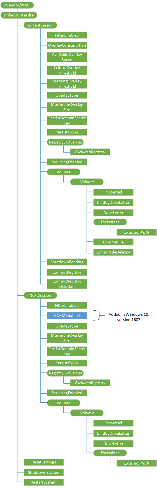

# UnifiedWriteFilter CSP

The UnifiedWriteFilter (UWF) configuration service provider enables the IT administrator to remotely manage the UWF to help protect physical storage media including any writable storage type.

> **Note**  The UnifiedWriteFilter CSP is only supported in Windows 10 Enterprise and Windows 10 Education.

 

The following diagram shows the UWF configuration service provider in tree format.

**CurrentSession**  
Required. Represents the current UWF configuration in the current session (power cycle).

**CurrentSession/FilterEnabled**  
Required. Indicates if UWF is enabled for the current session.

The only supported operation is Get.

**CurrentSession/OverlayConsumption**  
Required. The current size, in megabytes, of the UWF overlay.

The only supported operation is Get.

**CurrentSession/AvailableOverlaySpace**  
Required. The amount of free space, in megabytes, available for the UWF overlay.

The only supported operation is Get.

**CurrentSession/CriticalOverlayThreshold**  
Required. The critical threshold size, in megabytes. UWF sends a critical threshold notification event when the UWF overlay size reaches or exceeds this value.

Supported operations are Get and Replace.

**CurrentSession/WarningOverlayThreshold**  
Required. The warning threshold size, in megabytes. UWF sends a warning threshold notification event when the UWF overlay size reaches or exceeds this value.

Supported operations are Get and Replace.

**CurrentSession/OverlayType**  
Required. Indicates the type of overlay in the current session.

The only supported operation is Get.

**CurrentSession/MaximumOverlaySize**  
Required. Indicates the maximum cache size, in megabytes, of the overlay in the current session.

The only supported operation is Get.

**CurrentSession/PersisitDomainSecretKey**  
Required. Indicates if the domain secret registry key is in the registry exclusion list. If the registry key is not in the exclusion list, changes do not persist after a restart.

The only supported operation is Get.

**CurrentSession/PersistTSCAL**  
Required. Indicates if the Terminal Server Client Access License (TSCAL) registry key is in the UWF registry exclusion list. If the registry key is not in the exclusion list, changes do not persist after a restart.

The only supported operation is Get.

**CurrentSession/RegistryExclusions**  
Required. The root node that contains all registry exclusions.

**CurrentSession/RegistryExclusions/****_ExcludedRegistry_**  
Optional. A registry key in the registry exclusion list for UWF in the current session.

The only supported operation is Get.

**CurrentSession/ServicingEnabled**  
Required. Indicates when servicing is enabled in the current session.

The only supported operation is Get.

**CurrentSession/Volume**  
Required. The root node to contain all volumes protected by UWF in the current session.

**CurrentSession/Volume/****_Volume_**  
Optional. Represents a specific volume in the current session.

**CurrentSession/Volume/*Volume*/Protected**  
Required. Indicates if the volume is currently protected by UWF in the current session.

The only supported operation is Get.

**CurrentSession/Volume/*Volume*/BindByDriveLetter**  
Required. Indicates the type of binding that the volume uses in the current session.

The only supported operation is Get.

**CurrentSession/Volume/*Volume*/DriveLetter**  
Required. The drive letter of the volume. If the volume does not have a drive letter, this value is NULL.

The only supported operation is Get.

**CurrentSession/Volume/*Volume*/Exclusions**  
Required. The root node that contains all file exclusions for the volume.

**CurrentSession/Volume/*Volume*/Exclusions/****_ExclusionPath_**  
Optional. A string that contains the full path of the file or folder relative to the volume.

The only supported operation is Get.

**CurrentSession/Volume/*Volume*/CommitFile**  
Required. This method commits changes from the overlay to the physical volume for a specified file on a volume protected by Unified Write Filter (UWF).

Supported operations are Get and Execute.

**CurrentSession/Volume/*Volume*/CommitFileDeletion**  
Required. This method deletes the specified file and commits the deletion to the physical volume.

Supported operations are Get and Execute.

**CurrentSession/ShutdownPending**  
Required. This value is True if the system is pending on shutdown. Otherwise, it is False.

The only supported operation is Get.

**CurrentSession/CommitRegistry**  
Required. This method commits changes to the specified registry key and value.

Supported operations are Get and Execute.

**CurrentSession/CommitRegistryDeletion**  
Required. This method deletes the specified registry key or registry value and commits the deletion.

Supported operations are Get and Execute.

**NextSession**  
Required.

The root node that contains settings for the next UWF session (after a reboot).

**NextSession/FilterEnabled**  
Required. Boolean value that indicates if UWF is enabled for the next session.

Supported operations are Get and Replace.

**NextSession/HORMEnabled**  
Added in Windows 10, version 1607. Required. Boolean value that indicates if Hibernate Once/Resume Many (HORM) is enabled for the next session.

Supported operations are Get and Replace.

**NextSession/OverlayType**  
Required. Indicates the type of overlay for the next session.

Supported operations are Get and Replace.

**NextSession/MaximumOverlaySize**  
Required. Indicates the maximum cache size, in megabytes, of the overlay for the next session.

Supported operations are Get and Replace.

**NextSession/PersisitDomainSecretKey**  
Required. Indicates if the domain secret registry key is in the registry exclusion list. If the registry key is not in the exclusion list, changes do not persist after a restart.

Supported operations are Get and Replace.

**NextSession/PersistTSCAL**  
Required. Indicates if the Terminal Server Client Access License (TSCAL) registry key is in the UWF registry exclusion list. If the registry key is not in the exclusion list, changes do not persist after a restart.

Supported operations are Get and Replace.

**NextSession/RegistryExclusions**  
Required. The root node that contains all registry exclusions for the next session.

Supported operations are Add, Delete, and Replace.

**NextSession/RegistryExclusions/****_ExcludedRegistry_**  
Optional. A registry key in the registry exclusion list for UWF.

Supported operations are Add, Delete, Get, and Replace.

**NextSession/ServicingEnabled**  
Required. Indicates when to enable servicing.

Supported operations are Get and Replace.

**NextSession/Volume**  
Required. The root node that contains all volumes protected by UWF for the next session.

**NextSession/Volume/****_Volume_**  
Optional. Represents a specific volume in the next session.

Supported operations are Add, Delete, and Replace.

**NextSession/Volume/*Volume*/Protected**  
Required. Indicates if the volume is currently protected by UWF in the next session.

Supported operations are Get and Replace.

**NextSession/Volume/*Volume*/BindByDriveLetter**  
Required. Indicates the type of binding that the volume uses in the next session.

Supported operations are Get and Replace.

**NextSession/Volume/*Volume*/DriveLetter**  
The drive letter of the volume. If the volume does not have a drive letter, this value is NULL.

The only supported operation is Get.

**NextSession/Volume/*Volume*/Exclusions**  
Required. The root node that contains all file exclusions for this volume in the next session.

**NextSession/Volume/*Volume*/Exclusions/****_ExclusionPath_**  
Optional. A string that contains the full path of the file or folder relative to the volume.

Supported operations are Add, Delete, Get, and Replace.

**ResetSettings**  
Required. Restores UWF settings to the original state that was captured at installation time.

Supported operations are Get and Execute.

**ShutdownSystem**  
Required. Safely shuts down a system protected by UWF, even if the overlay is full.

Supported operations are Get and Execute.

**RestartSystem**  
Required. Safely restarts a system protected by UWF, even if the overlay is full.

Supported operations are Get and Execute.

## Related topics

[Configuration service provider reference](configuration-service-provider-reference.md)

 

 

