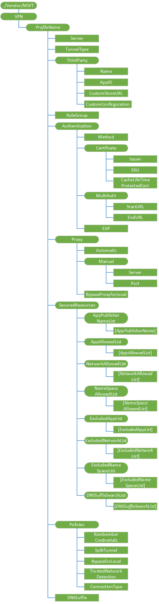

# VPN CSP

The VPN configuration service provider allows the MDM server to configure the VPN profile of the device. Windows 10 supports both IKEv2 VPN and SSL VPN profiles. For information about IKEv2, see [Configure IKEv2-based Remote Access](https://technet.microsoft.com/library/ff687731%28v=ws.10%29.aspx).

> **Note**   The VPN CSP is deprecated in Windows 10 and it only supported in Windows 10 Mobile for backward compatibility. Use [VPNv2 CSP](vpnv2-csp.md) instead.

 

Important considerations:

-   For a VPN that requires a client certificate, the server must first enroll the needed client certificate before deploying a VPN profile to ensure that there is a functional VPN profile at the device. This is particularly critical for forced tunnel VPN.

-   VPN configuration commands must be wrapped with an Atomic command as shown in the example below.

-   Only one VPN profile provisioning per one OMA request is supported. Multiple VPN profiles per one OMA message request are not supported.

-   For the VPN CSP, you cannot use the Replace command unless the node already exists.

The following diagram shows the VPN configuration service provider in tree format.

***ProfileName***
Unique alpha numeric Identifier for the profile. The profile name must not include a forward slash (/).

Value type is chr. Supported operations include Get, Add, Replace, and Delete.

**Server**
Required. Public or routable IP address or DNS name for the VPN gateway server farm. It can point to the external IP of a gateway or a virtual IP for a server farm.

Supported operations are Get, Add, and Replace.

Value type is chr. Some examples are 208.23.45.130 or vpn.contoso.com.

**TunnelType**
Optional, but required when deploying a 3rd party IKEv2 VPN profile. Only a value of IKEv2 is supported for this release.

Value type is chr. Supported operations are Get and Add.

**ThirdParty**
Optional, but required if deploying 3rd party SSL-VPN plugin profile. Defines a group of setting applied to SSL-VPN profile provisioning.

Supported operations are Get and Add.

**ThirdParty/Name**
Required when ThirdParty is defined for SSL-VPN profile provisioning.

Value type is chr. Supported operations are Get and Add.

Valid values:

-   JunOS Pulse

-   SonicWall Mobile Connect

-   F5 Big-IP Edge Client

-   Checkpoint Mobile VPN

**ThirdParty/AppID**
Optional, but required when deploying a 3rd party SSL-VPN plugin app from a private enterprise storefront. This is the ProductID associated with the store application. The client will use this ProductID to ensure that only the enterprise approved plugin is initialized.

Value type is chr. Supported operations are Get, Add, Replace, and Delete.

**ThirdParty/CustomStoreURL**
Optional, but required if an enterprise is deploying a 3rd party SSL-VPN plugin app from the private enterprise storefront. This node specifies the URL of the 3rd party SSL-VPN plugin app.

Value type is chr. Supported operations are Get, Add, Replace, and Delete.

**ThirdParty/CustomConfiguration**
Optional. This is an HTML encoded XML blob for SSL-VPN plugin specific configuration that is deployed to the device to make it available for SSL-VPN plugins.

Value type is char. Supported operations are Get, Add, Replace, and Delete.

**RoleOrGroup**
Not Implemented. Optional.

Value type is char. Supported operations are Get, Add, Delete, and Replace.

**Authentication**
Optional node for ThirdParty VPN profiles, but required for IKEv2. This is a collection of configuration objects to ensure that the correct authentication policy is used on the device based on the chosen TunnelType.

Supported operations are Get and Add.

**Authentication/Method**
Required for IKEv2 profiles and optional for third party profiles. This specifies the authentication provider to use for VPN client authentication. Only the EAP method is supported for IKEv2 profiles.

Supported operations are Get and Add.

Value type is chr.

> **Note**  For EAP, use Authentication/EAP instead.

 

**Authentication/Certificate**
Optional node. A collection of nodes that enables simpler authentication experiences for end users when using VPN. This and its subnodes should not be used for IKEv2 profiles.

Supported operations are Get and Add.

**Authentication/Certificate/Issuer**
Optional. Filters out the installed certificates with private keys stored in registry or TPM. This can be used in conjunction with EKU for more granular filtering.

Value type is chr. Supported operations are Get, Add, Delete, and Replace.

> **Note**  Do not use this element for IKev2 profiles.

 

**Authentication/Certificate/EKU**
Optional. This Extended Key Usage (EKU) element is used to filter out the installed certificates with private keys stored in the registry or TPM. You can use this in conjunction with ISSUER for a more granular filtering.

Value type is chr. Supported operations are Get, Add, Delete, and Replace.

> **Note**  Do not use this element for IKev2 profiles.

 

**Authentication/Certificate/CacheLifeTimeForProtectedCert**
Not Implemented. Optional.

Value type is int. Supported operations are Get, Add, Replace, and Delete.

**Authentication/EAP**
Required when IKEv2 is selected. Defines the EAP blob to be used for IKEv2 authentication. You can use EAP-MSCHAPv2 or EAP-TLS. EAP blob is HTML encoded XML as defined in EAP Host Config schemas. You can find the schemas in [Microsoft EAP MsChapV2 Schema](https://go.microsoft.com/fwlink/p/?LinkId=523885) and [Microsoft EAP TLS Schema](https://go.microsoft.com/fwlink/p/?LinkId=523884).

Supported operations are Get, Add, and Replace.

Value type is chr.

**Proxy**
Optional node. A collection of configuration objects to enable a post-connect proxy support for VPN. The proxy defined for this profile will be applied when this profile is active and connected.

Supported operations are Add, Delete, and Replace.

**Proxy/Manual/Server**
Optional. Set this element together with PORT. The value is the proxy server address as a fully qualified hostname or an IP address, for example, proxy.constoso.com.

Supported operations are Get, Add, Replace, and Delete.

Value type is chr.

**Proxy/Manual/Port**
Optional. Set this element together with Server. The value is the proxy server port number in the range of 1-65535, for example, 8080.

Supported operations are Get, Add, Replace, and Delete.

Value type is int.

**Proxy/BypassForLocal**
Optional. When this setting is enabled, any web requests to resources in the intranet zone will not be sent to the proxy. When this is false, the setting should be disabled and all requests should go to the proxy. When this is true, the setting is enabled and intranet requests will not go to the proxy.

Supported operations are Get, Add, Replace, and Delete.

Value type is bool.

Default is False.

**SecuredResources**
Optional node. A collection of configuration objects that define the inclusion resource lists for what can be secured over VPN. Allowed lists are applied only when Policies/SplitTunnel element is set to True. VPN exclusions are not supported..

**SecuredResources/AppAllowedList/AppAllowedList**
Optional. Specifies one or more ProductIDs for the enterprise line of business applications built for Windows. When this element is defined, then all traffic sourced from specified apps will be secured over VPN (assuming protected networks defined allows access). They will not be able to connect directly bypassing the VPN connection. When the profile is auto-triggered, VPN is triggered automatically by these apps.

Supported operations are Get, Add, Replace and Delete.

Value type is chr.

Examples are {F05DC613-E223-40AD-ABA9-CCCE04277CD9} and ContosoApp.ContosoCorp\_jlsnulm3s397u.

**SecuredResources/NetworkAllowedList/NetworkAllowedList**
Optional, but required when Policies/SplitTunnel is set to true for IKEv2 profile. Specifies one or more IP ranges that you want secured over VPN. Applications connecting to protected resources that match this list will be secured over VPN. Otherwise, they’ll continue to connect directly. The IP ranges are defined in the format 10.0.0.0/8. When the profile is auto-triggered, the VPN is triggered automatically by these protected networks.

Supported operations are Get, Add, Replace, and Delete.

Value type is chr.

An example is 172.31.0.0/16.

**SecuredResources/NameSpaceAllowedList/NameSpaceAllowedList**
Optional. Specifies one or more namespaces that you want secured over VPN. All requests to the specified namespaces are secured over VPN. Applications connecting to namespaces are secured over VPN. Otherwise, they’ll continue to connect directly. Namespaces are defined in the format \*.corp.contoso.com. Restrictions such as \* or \*.\* or \*.com.\* are not allowed. NetworkAllowedList is required for IKEv2 profiles for routing the traffic correctly over split tunnel.

Supported operations are Get, Add, Replace, and Delete.

Value type is chr.

An example is \*.corp.contoso.com.

**SecuredResources/ExcluddedAppList/ExcludedAppList**
Optional. Specifies one or more ProductIDs for enterprise line of business applications built for Windows. When the element is defined, these apps will never use VPN. They will connect directly and bypass the VPN connection.

Supported operations are Get, Add, Replace, and Delete.

Value type is chr.

Examples are {F05DC613-E223-40AD-ABA9-CCCE04277CD9} and ContosoApp.ContosoCorp\_jlsnulm3s397u.

**SecuredResources/ExcludedNetworkList/ExcludedNetworkList**
Optional. Specifies one or more IP addresses that will never use VPN. Any app connecting to the configured excluded IP list will use the internet directly and bypass VPN. Values are defined in the format 10.0.0.0/8.

Supported operations are Get, Add, Replace, and Delete.

Value type is chr.

An example is 172.31.0.0/16.

**SecuredResources/ExcludedNameSpaceList/ExcludedNameSpaceList**
Optional. Specifies one or more namespaces of hosts that will never use VPN. Any app connecting to the configured excluded host list will use the internet and bypass VPN. Restrictions such as \* or \*.\* or \*.com.\* are not allowed.

Supported operations are Get, Add, Replace, and Delete.

Value type is chr.

An example is \*.corp.contoso.com.

**SecuredResources/DNSSuffixSearchList/DNSSuffixSearchList**
Optional. Specifies one or many DNS suffixes that will be appended to shortname URLs for DNS resolution and connectivity.

Supported operations are Get, Add, Replace, and Delete.

Value type is chr.

An example is .corp.contoso.com.

**Policies**
Optional node. A collection of configuration objects you can use to enforce profile-specific restrictions.

**Policies/SplitTunnel**
Optional. When this is False, all traffic goes to the VPN gateway in force tunnel mode. When this is True, only the specific traffic to defined secured resources goes to the VPN gateway.

Supported operations are Get, Add, Replace, and Delete.

Value type is bool.

Default value is True.

**Policies/ByPassForLocal**
Optional. When this setting is True, requests to local resources that are available on the same Wi-Fi network as the VPN client can bypass the VPN. For example, if enterprise policy for VPN requires force tunnel for VPN, but enterprise intends to allow the remote user to connect locally to media center in their home, then this option should be set to True. The user can bypass VPN for local subnet traffic. When this is set to False, the setting is disabled and no subnet exceptions are allowed.

Supported operations are Get, Add, Replace, and Delete.

Value type is bool.

Default value is False.

**Policies/TrustedNetworkDetection**
Optional. When this setting is set to True, the VPN cannot connect when the user is on their corporate wireless network where protected resources are directly accessible to the device. When this is False, the VPN connects over corporate wireless network. This node has a dependency on the DNSSuffix node setting to detect the corporate wireless network.

Supported operations are Get, Add, Replace, and Delete.

Value type is bool.

Default value is False.

**Policies/ConnectionType**
Optional. Valid values are:

-   Triggering: A VPN automatically connects as applications require connectivity to protected resources. The life cycle of the VPN is based on applications using the VPN. Recommended setting for optimizing usage of power resources.

-   Manual: User must manually connect / disconnect VPN.

Supported operations are Get, Add, and Replace.

Value type is chr.

Default value is Triggering.

**DNSSuffix**
Optional, but it is required to set the specific DNS suffix of the primary connection. Supported operations are Get, Add, Delete, and Replace.

Value type is chr.

An example is corp.contoso.com.

## Related topics

[Configuration service provider reference](configuration-service-provider-reference.md)

 

 

