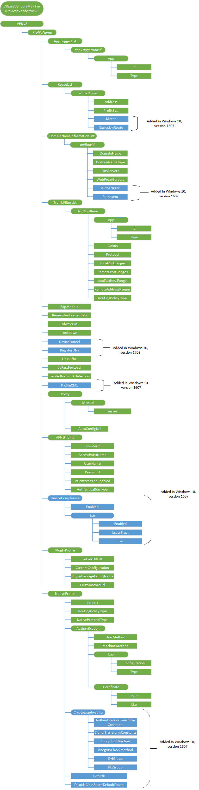

# VPNv2 CSP


The VPNv2 configuration service provider allows the mobile device management (MDM) server to configure the VPN profile of the device.

Here are the requirements for this CSP:

-   VPN configuration commands must be wrapped in an Atomic block in SyncML.
-   For best results, configure your VPN certificates first before pushing down VPN profiles to devices. If you are using Windows Information Protection (WIP) (formerly known as Enterprise Data Protection), then you should configure VPN first before you configure WIP policies.
-   Instead of changing individual properties, follow these steps to make any changes:

    -   Send a Delete command for the ProfileName to delete the entire profile.
    -   Send the entire profile again with new values wrapped in an Atomic block.

    In certain conditions you can change some properties directly, but we do not recommend it.

The XSDs for all EAP methods are shipped in the box and can be found at the following locations:

-   C:\\Windows\\schemas\\EAPHost
-   C:\\Windows\\schemas\\EAPMethods

The following diagram shows the VPNv2 configuration service provider in tree format.



<a href="" id="device-or-user-profile"></a>**Device or User profile**  
For user profile, use **./User/Vendor/MSFT** path and for device profile, use **./Device/Vendor/MSFT** path.

<a href="" id="vpnv2-profilename"></a>**VPNv2/***ProfileName*  
Unique alpha numeric identifier for the profile. The profile name must not include a forward slash (/).

Supported operations include Get, Add, and Delete.

> **Note**  If the profile name has a space or other non-alphanumeric character, it must be properly escaped according to the URL encoding standard.

<a href="" id="vpnv2-profilename-apptriggerlist"></a>**VPNv2/***ProfileName***/AppTriggerList**  
Optional node. List of applications set to trigger the VPN. If any of these apps are launched and the VPN profile is currently the active profile, this VPN profile will be triggered to connect.

<a href="" id="vpnv2-profilename-apptriggerlist-apptriggerrowid"></a>**VPNv2/***ProfileName***/AppTriggerList/***appTriggerRowId*  
A sequential integer identifier which allows the ability to specify multiple apps for App Trigger. Sequencing must start at 0 and you should not skip numbers.

Supported operations include Get, Add, Replace, and Delete.

<a href="" id="vpnv2-profilename-apptriggerlist-apptriggerrowid-app"></a>**VPNv2/***ProfileName***/AppTriggerList/***appTriggerRowId***/App**  
App Node under the Row Id.

<a href="" id="vpnv2-profilename-apptriggerlist-apptriggerrowid-app-id"></a>**VPNv2/***ProfileName***/AppTriggerList/***appTriggerRowId***/App/Id**  
App identity, which is either an app’s package family name or file path. The type is inferred by the Id, and therefore cannot be specified in the get only App/Type field

<a href="" id="vpnv2-profilename-apptriggerlist-apptriggerrowid-app-type"></a>**VPNv2/***ProfileName***/AppTriggerList/***appTriggerRowId***/App/Type**  
Returns the type of **App/Id**. This value can be either of the following:

-   PackageFamilyName - When this is returned, the App/Id value represents the PackageFamilyName of the app. The PackageFamilyName is the unique name of the Microsoft Store application.
-   FilePath - When this is returned, the App/Id value represents the full file path of the app. For example, `C:\Windows\System\Notepad.exe`.

Value type is chr. Supported operation is Get.

<a href="" id="vpnv2-profilename-routelist-"></a>**VPNv2/***ProfileName***/RouteList/**  
Optional node. List of routes to be added to the routing table for the VPN interface. This is required for split tunneling case where the VPN server site has more subnets that the default subnet based on the IP assigned to the interface.

Every computer that runs TCP/IP makes routing decisions. These decisions are controlled by the IP routing table. Adding values under this node updates the routing table with routes for the VPN interface post connection. The values under this node represent the destination prefix of IP routes. A destination prefix consists of an IP address prefix and a prefix length.

Adding a route here allows the networking stack to identify the traffic that needs to go over the VPN interface for split tunnel VPN. Some VPN servers can configure this during connect negotiation and do not need this information in the VPN Profile. Please check with your VPN server administrator to determine whether you need this information in the VPN profile.

<a href="" id="vpnv2-profilename-routelist-routerowid"></a>**VPNv2/***ProfileName***/RouteList/***routeRowId*  
A sequential integer identifier for the RouteList. This is required if you are adding routes. Sequencing must start at 0.

Supported operations include Get, Add, Replace, and Delete.

<a href="" id="vpnv2-profilename-routelist-routerowid-address"></a>**VPNv2/***ProfileName***/RouteList/***routeRowId***/Address**  
Subnet address in IPv4/v6 address format which, along with the prefix will be used to determine the destination prefix to send via the VPN Interface. This is the IP address part of the destination prefix.

Supported operations include Get, Add, Replace, and Delete. Value type is chr. Example, `192.168.0.0`

<a href="" id="vpnv2-profilename-routelist-routerowid-prefixsize"></a>**VPNv2/***ProfileName***/RouteList/***routeRowId***/PrefixSize**  
The subnet prefix size part of the destination prefix for the route entry. This, along with the address will be used to determine the destination prefix to route through the VPN Interface.

Value type is int. Supported operations include Get, Add, Replace, and Delete.

<a href="" id="vpnv2-profilename-routelist-routerowid-metric"></a>**VPNv2/***ProfileName***/RouteList/***routeRowId***/Metric**  
Added in Windows 10, version 1607. The route's metric.

Value type is int. Supported operations include Get, Add, Replace, and Delete.

<a href="" id="vpnv2-profilename-routelist-routerowid-exclusionroute"></a>**VPNv2/***ProfileName***/RouteList/***routeRowId***/ExclusionRoute**  
Added in Windows 10, version 1607. A boolean value that specifies if the route being added should point to the VPN Interface or the Physical Interface as the Gateway. Valid values:

-   False (default) - This route will direct traffic over the VPN
-   True - This route will direct traffic over the physical interface.

Supported operations include Get, Add, Replace, and Delete.

<a href="" id="vpnv2-profilename-domainnameinformationlist"></a>**VPNv2/***ProfileName***/DomainNameInformationList**  
Optional node. Name Resolution Policy Table (NRPT) rules for the VPN profile.

The Name Resolution Policy Table (NRPT) is a table of namespaces and corresponding settings stored in the Windows registry that determines the DNS client behavior when issuing queries and processing responses. Each row in the NRPT represents a rule for a portion of the namespace for which the DNS client issues queries. Before issuing name resolution queries, the DNS client consults the NRPT to determine if any additional flags must be set in the query. After receiving the response, the client again consults the NRPT to check for any special processing or policy requirements. In the absence of the NRPT, the client operates based on the DNS servers and suffixes set on the interface.

<a href="" id="vpnv2-profilename-domainnameinformationlist-dnirowid"></a>**VPNv2/***ProfileName***/DomainNameInformationList/***dniRowId*  
A sequential integer identifier for the Domain Name information. Sequencing must start at 0.

Supported operations include Get, Add, Replace, and Delete.

<a href="" id="vpnv2-profilename-domainnameinformationlist-dnirowid-domainname"></a>**VPNv2/***ProfileName***/DomainNameInformationList/***dniRowId***/DomainName**  
Used to indicate the namespace to which the policy applies. When a Name query is issued, the DNS client compares the name in the query to all of the namespaces under DomainNameInformationList to find a match. This parameter can be one of the following types:

-   FQDN - Fully qualified domain name
-   Suffix - A domain suffix that will be appended to the shortname query for DNS resolution. To specify a suffix, prepend a **.** to the DNS suffix.

Value type is chr. Supported operations include Get, Add, Replace, and Delete.

<a href="" id="vpnv2-profilename-domainnameinformationlist-dnirowid-domainnametype"></a>**VPNv2/***ProfileName***/DomainNameInformationList/***dniRowId***/DomainNameType**  
Returns the namespace type. This value can be one of the following:

-   FQDN - If the DomainName was not prepended with a **.** and applies only to the fully qualified domain name (FQDN) of a specified host.
-   Suffix - If the DomainName was prepended with a **.** and applies to the specified namespace, all records in that namespace, and all subdomains.

Value type is chr. Supported operation is Get.

<a href="" id="vpnv2-profilename-domainnameinformationlist-dnirowid-dnsservers"></a>**VPNv2/***ProfileName***/DomainNameInformationList/***dniRowId***/DnsServers**  
List of comma separated DNS Server IP addresses to use for the namespace.

Value type is chr. Supported operations include Get, Add, Replace, and Delete.

<a href="" id="vpnv2-profilename-domainnameinformationlist-dnirowid-webproxyservers"></a>**VPNv2/***ProfileName***/DomainNameInformationList/***dniRowId***/WebProxyServers**  
Optional. Web Proxy Server IP address if you are redirecting traffic through your intranet.

> **Note**  Currently only one web proxy server is supported.

 

Value type is chr. Supported operations include Get, Add, Replace, and Delete.

<a href="" id="vpnv2-profilename-domainnameinformationlist-dnirowid-autotrigger"></a>**VPNv2/***ProfileName***/DomainNameInformationList/***dniRowId***/AutoTrigger**  
Added in Windows 10, version 1607. Optional. Boolean to determine whether this domain name rule will trigger the VPN.

If set to False, this DomainName rule will not trigger the VPN.

If set to True, this DomainName rule will trigger the VPN

By default, this value is false.

Value type is bool.

<a href="" id="vpnv2-profilename-domainnameinformationlist-dnirowid-persistent"></a>**VPNv2/***ProfileName***/DomainNameInformationList/***dniRowId***/Persistent**  
Added in Windows 10, version 1607. A boolean value that specifies if the rule being added should persist even when the VPN is not connected. Value values:

-   False (default) - This DomainName rule will only be applied when VPN is connected.
-   True - This DomainName rule will always be present and applied.

Supported operations include Get, Add, Replace, and Delete.

<a href="" id="vpnv2-profilename-trafficfilterlist"></a>**VPNv2/***ProfileName***/TrafficFilterList**  
An optional node that specifies a list of rules. Only traffic that matches these rules can be sent via the VPN Interface.

> **Note**  Once a TrafficFilterList is added, all traffic are blocked other than the ones matching the rules.

 

When adding multiple rules, each rule operates based on an OR with the other rules. Within each rule, each property operates based on an AND with each other.

<a href="" id="vpnv2-profilename-trafficfilterlist-trafficfilterid"></a>**VPNv2/***ProfileName***/TrafficFilterList/***trafficFilterId*  
A sequential integer identifier for the Traffic Filter rules. Sequencing must start at 0.

<a href="" id="vpnv2-profilename-trafficfilterlist-trafficfilterid-app"></a>**VPNv2/***ProfileName***/TrafficFilterList/***trafficFilterId***/App**  
Per app VPN rule. This will allow only the apps specified to be allowed over the VPN interface. Value type is chr.

<a href="" id="vpnv2-profilename-trafficfilterlist-trafficfilterid-app-id"></a>**VPNv2/***ProfileName***/TrafficFilterList/***trafficFilterId***/App/Id**  
App identity for the app-based traffic filter.

The value for this node can be one of the following:

-   PackageFamilyName - This App/Id value represents the PackageFamilyName of the app. The PackageFamilyName is the unique name of a Microsoft Store application.
-   FilePath - This App/Id value represents the full file path of the app. For example, `C:\Windows\System\Notepad.exe`.
-   SYSTEM – This value enables Kernel Drivers to send traffic through VPN (for example, PING or SMB).

Value type is chr. Supported operations include Get, Add, Replace, and Delete.

<a href="" id="vpnv2-profilename-trafficfilterlist-trafficfilterid-app-type"></a>**VPNv2/***ProfileName***/TrafficFilterList/***trafficFilterId***/App/Type**  
Returns the type of ID of the **App/Id**.

Value type is chr. Supported operation is Get.

<a href="" id="vpnv2-profilename-trafficfilterlist-trafficfilterid-claims"></a>**VPNv2/***ProfileName***/TrafficFilterList/***trafficFilterId***/Claims**  
Reserved for future use.

<a href="" id="vpnv2-profilename-trafficfilterlist-trafficfilterid-protocol"></a>**VPNv2/***ProfileName***/TrafficFilterList/***trafficFilterId***/Protocol**  
Numeric value from 0-255 representing the IP protocol to allow. For example, TCP = 6 and UDP = 17.

Value type is int. Supported operations include Get, Add, Replace, and Delete.

<a href="" id="vpnv2-profilename-trafficfilterlist-trafficfilterid-localportranges"></a>**VPNv2/***ProfileName***/TrafficFilterList/***trafficFilterId***/LocalPortRanges**  
A list of comma separated values specifying local port ranges to allow. For example, `100-120, 200, 300-320`.

> **Note**  Ports are only valid when the protocol is set to TCP=6 or UDP=17.

 

Value type is chr. Supported operations include Get, Add, Replace, and Delete.

<a href="" id="vpnv2-profilename-trafficfilterlist-trafficfilterid-remoteportranges"></a>**VPNv2/***ProfileName***/TrafficFilterList/***trafficFilterId***/RemotePortRanges**  
A list of comma separated values specifying remote port ranges to allow. For example, `100-120, 200, 300-320`.

> **Note**  Ports are only valid when the protocol is set to TCP=6 or UDP=17.

 

Value type is chr. Supported operations include Get, Add, Replace, and Delete.

<a href="" id="vpnv2-profilename-trafficfilterlist-trafficfilterid-localaddressranges"></a>**VPNv2/***ProfileName***/TrafficFilterList/***trafficFilterId***/LocalAddressRanges**  
A list of comma separated values specifying local IP address ranges to allow.

Value type is chr. Supported operations include Get, Add, Replace, and Delete.

<a href="" id="vpnv2-profilename-trafficfilterlist-trafficfilterid-remoteaddressranges"></a>**VPNv2/***ProfileName***/TrafficFilterList/***trafficFilterId***/RemoteAddressRanges**  
A list of comma separated values specifying remote IP address ranges to allow.

Value type is chr. Supported operations include Get, Add, Replace, and Delete.

<a href="" id="vpnv2-profilename-trafficfilterlist-trafficfilterid-routingpolicytype"></a>**VPNv2/***ProfileName***/TrafficFilterList/***trafficFilterId***/RoutingPolicyType**  
Specifies the routing policy if an App or Claims type is used in the traffic filter. The scope of this property is for this traffic filter rule alone. The value can be one of the following:

-   SplitTunnel - For this traffic filter rule, only the traffic meant for the VPN interface (as determined by the networking stack) goes over the interface. Internet traffic can continue to go over the other interfaces.
-   ForceTunnel - For this traffic rule all IP traffic must go through the VPN Interface only.

This is only applicable for App ID based Traffic Filter rules.

Value type is chr. Supported operations include Get, Add, Replace, and Delete.

<a href="" id="vpnv2-profilename-edpmodeid"></a>**VPNv2/***ProfileName***/EdpModeId**  
Enterprise ID, which is required for connecting this VPN profile with an WIP policy. When this is set, the networking stack looks for this Enterprise ID in the app token to determine if the traffic is allowed to go over the VPN. If the profile is active, it also automatically triggers the VPN to connect. We recommend having only one such profile per device.

Additionally when connecting with Windows Information Protection (WIP)(formerly known as Enterprise Data Protection), the admin does not have to specify AppTriggerList and TrafficFilterList rules separately in this profile (unless more advanced config is needed) because the WIP policies and App lists automatically takes effect.

Value type is chr. Supported operations include Get, Add, Replace, and Delete.

<a href="" id="vpnv2-profilename-remembercredentials"></a>**VPNv2/***ProfileName***/RememberCredentials**  
Boolean value (true or false) for caching credentials. Default is false, which means do not cache credentials. If set to true, credentials are cached whenever possible.

Supported operations include Get, Add, Replace, and Delete.

<a href="" id="vpnv2-profilename-alwayson"></a>**VPNv2/***ProfileName***/AlwaysOn**  
An optional flag to enable Always On mode. This will automatically connect the VPN at sign-in and will stay connected until the user manually disconnects.

> **Note**  Always On only works for the active profile. The first profile provisioned that can be auto triggered will automatically be set as active.

Preserving user Always On preference

Windows has a feature to preserve a user’s AlwaysOn preference.  In the event that a user manually unchecks the “Connect    automatically” checkbox, Windows will remember this user preference for this profile name by adding the profile name to the value AutoTriggerDisabledProfilesList.  
Should a management tool remove/add the same profile name back and set AlwaysOn to true, Windows will not check the box if the profile name exists in the below registry value in order to preserve user preference.
Key: HKEY_LOCAL_MACHINE\SYSTEM\CurrentControlSet\Services\RasMan\Config
Value: AutoTriggerDisabledProfilesList
Type: REG_MULTI_SZ


Valid values:

-   False (default) - Always On is turned off.
-   True - Always On is turned on.

Value type is bool. Supported operations include Get, Add, Replace, and Delete.

<a href="" id="vpnv2-profilename-lockdown"></a>**VPNv2/***ProfileName***/LockDown**  (./Device only profile)  
Lockdown profile.

Valid values:

-   False (default) - this is not a LockDown profile.
-   True - this is a LockDown profile.

When the LockDown profile is turned on, it does the following things:

-   First, it automatically becomes an "always on" profile.
-   Second, it can never be disconnected.
-   Third, if the profile is not connected, then the user has no network.
-   Fourth, no other profiles may be connected or modified.

A Lockdown profile must be deleted before you can add, remove, or connect other profiles.

Value type is bool. Supported operations include Get, Add, Replace, and Delete.

<a href="" id="vpnv2-profilename-devicetunnel"></a>**VPNv2/***ProfileName***/DeviceTunnel**  (./Device only profile)  
Device tunnel profile.

Valid values:

-   False (default) - this is not a device tunnel profile.
-   True - this is a device tunnel profile.

When the DeviceTunnel profile is turned on, it does the following things:

-   First, it automatically becomes an "always on" profile.
-   Second, it does not require the presence or logging in of any user to the machine in order for it to connect.
-   Third, no other device tunnel profile maybe be present on the same machine.

A device tunnel profile must be deleted before another device tunnel profile can be added, removed, or connected.

Value type is bool. Supported operations include Get, Add, Replace, and Delete.

<a href="" id="vpnv2-profilename-registerdns"></a>**VPNv2/***ProfileName***/RegisterDNS**
Allows registration of the connection's address in DNS.

Valid values:

-   False = Do not register the connection's address in DNS (default).
-   True = Register the connection's addresses in DNS.

<a href="" id="vpnv2-profilename-dnssuffix"></a>**VPNv2/***ProfileName***/DnsSuffix**  
Optional. Specifies one or more comma separated DNS suffixes. The first in the list is also used as the primary connection specific DNS suffix for the VPN Interface. The entire list will also be added into the SuffixSearchList.

Value type is chr. Supported operations include Get, Add, Replace, and Delete.

<a href="" id="vpnv2-profilename-bypassforlocal"></a>**VPNv2/***ProfileName***/ByPassForLocal**  
Reserved for future use.

<a href="" id="vpnv2-profilename-trustednetworkdetection"></a>**VPNv2/***ProfileName***/TrustedNetworkDetection**  
Optional. Comma separated string to identify the trusted network. VPN will not connect automatically when the user is on their corporate wireless network where protected resources are directly accessible to the device.

Value type is chr. Supported operations include Get, Add, Replace, and Delete.

<a href="" id="vpnv2-profilename-profilexml"></a>**VPNv2/***ProfileName***/ProfileXML**  
Added in Windows 10, version 1607. The XML schema for provisioning all the fields of a VPN. For the XSD, see [ProfileXML XSD](vpnv2-profile-xsd.md).

Value type is chr. Supported operations include Get, Add, Replace, and Delete.

<a href="" id="vpnv2-profilename-proxy"></a>**VPNv2/***ProfileName***/Proxy**  
A collection of configuration objects to enable a post-connect proxy support for VPN. The proxy defined for this profile is applied when this profile is active and connected.

<a href="" id="vpnv2-profilename-proxy-manual"></a>**VPNv2/***ProfileName***/Proxy/Manual**  
Optional node containing the manual server settings.

<a href="" id="vpnv2-profilename-proxy-manual-server"></a>**VPNv2/***ProfileName***/Proxy/Manual/Server**  
Optional. Proxy server address as a fully qualified hostname or an IP address. You should set this element together with Port. Example, proxy.contoso.com.

Value type is chr. Supported operations include Get, Add, Replace, and Delete.

<a href="" id="vpnv2-profilename-proxy-autoconfigurl"></a>**VPNv2/***ProfileName***/Proxy/AutoConfigUrl**  
Optional. URL to automatically retrieve the proxy settings.

Value type is chr. Supported operations include Get, Add, Replace, and Delete.

<a href="" id="vpnv2-profilename-apnbinding"></a>**VPNv2/***ProfileName***/APNBinding**  
Reserved for future use.

<a href="" id="vpnv2-profilename-apnbinding-providerid"></a>**VPNv2/***ProfileName***/APNBinding/ProviderId**  
Reserved for future use. Optional node.

<a href="" id="vpnv2-profilename-apnbinding-accesspointname"></a>**VPNv2/***ProfileName***/APNBinding/AccessPointName**  
Reserved for future use.

<a href="" id="vpnv2-profilename-apnbinding-username"></a>**VPNv2/***ProfileName***/APNBinding/UserName**  
Reserved for future use.

<a href="" id="vpnv2-profilename-apnbinding-password"></a>**VPNv2/***ProfileName***/APNBinding/Password**  
Reserved for future use.

<a href="" id="vpnv2-profilename-apnbinding-iscompressionenabled"></a>**VPNv2/***ProfileName***/APNBinding/IsCompressionEnabled**  
Reserved for future use.

<a href="" id="vpnv2-profilename-apnbinding-authenticationtype"></a>**VPNv2/***ProfileName***/APNBinding/AuthenticationType**  
Reserved for future use.

<a href="" id="vpnv2-profilename-devicecompliance"></a>**VPNv2/***ProfileName***/DeviceCompliance**  
Added in Windows 10, version 1607. Nodes under DeviceCompliance can be used to enable AAD-based Conditional Access for VPN.

<a href="" id="vpnv2-profilename-devicecompliance-enabled"></a>**VPNv2/***ProfileName***/DeviceCompliance/Enabled**  
Added in Windows 10, version 1607. Enables the Device Compliance flow from the client. If marked as True, the VPN Client will attempt to communicate with AAD to get a certificate to use for authentication. The VPN should be set up to use Certificate Auth and the VPN Server must trust the Server returned by Azure Active Directory.

Value type is bool. Supported operations include Get, Add, Replace, and Delete.

<a href="" id="vpnv2-profilename-devicecompliance-sso"></a>**VPNv2/***ProfileName***/DeviceCompliance/Sso**  
Added in Windows 10, version 1607. Nodes under SSO can be used to choose a certificate different from the VPN Authentication cert for the Kerberos Authentication in the case of Device Compliance.

<a href="" id="vpnv2-profilename-devicecompliance-sso-enabled"></a>**VPNv2/***ProfileName***/DeviceCompliance/Sso/Enabled**  
Added in Windows 10, version 1607. If this field is set to True, the VPN Client will look for a separate certificate for Kerberos Authentication.

Value type is bool. Supported operations include Get, Add, Replace, and Delete.

<a href="" id="vpnv2-profilename-devicecompliance-sso-issuerhash"></a>**VPNv2/***ProfileName***/DeviceCompliance/Sso/IssuerHash**  
Added in Windows 10, version 1607. Hashes for the VPN Client to look for the correct certificate for Kerberos Authentication.

Value type is chr. Supported operations include Get, Add, Replace, and Delete.

<a href="" id="vpnv2-profilename-devicecompliance-sso-eku"></a>**VPNv2/***ProfileName***/DeviceCompliance/Sso/Eku**  
Added in Windows 10, version 1607. Comma Separated list of EKUs for the VPN Client to look for the correct certificate for Kerberos Authentication.

Value type is chr. Supported operations include Get, Add, Replace, and Delete.

<a href="" id="vpnv2-profilename-pluginprofile"></a>**VPNv2/***ProfileName***/PluginProfile**  
Nodes under the PluginProfile are required when using a Microsoft Store based VPN plugin.

<a href="" id="vpnv2-profilename-pluginprofile-serverurllist"></a>**VPNv2/***ProfileName***/PluginProfile/ServerUrlList**  
Required for plug-in profiles. Semicolon-separated list of servers in URL, hostname, or IP format.

Value type is chr. Supported operations include Get, Add, Replace, and Delete.

<a href="" id="vpnv2-profilename-pluginprofile-customconfiguration"></a>**VPNv2/***ProfileName***/PluginProfile/CustomConfiguration**  
Optional. This is an HTML encoded XML blob for SSL-VPN plug-in specific configuration including authentication information that is deployed to the device to make it available for SSL-VPN plug-ins. Contact the plugin provider for format and other details. Most plugins can also configure values based on the server negotiations as well as defaults.

Value type is chr. Supported operations include Get, Add, Replace, and Delete.

<a href="" id="vpnv2-profilename-pluginprofile-pluginpackagefamilyname"></a>**VPNv2/***ProfileName***/PluginProfile/PluginPackageFamilyName**  
Required for plug-in profiles. Package family name for the SSL-VPN plug-in.

Supported operations include Get, Add, Replace, and Delete.

<a href="" id="vpnv2-profilename-pluginprofile-customstoreurl"></a>**VPNv2/***ProfileName***/PluginProfile/CustomStoreUrl**  
Reserved for future use.

<a href="" id="vpnv2-profilename-nativeprofile"></a>**VPNv2/***ProfileName***/NativeProfile**  
Nodes under NativeProfile are required when using a Windows Inbox VPN Protocol (IKEv2, PPTP, L2TP).

<a href="" id="vpnv2-profilename-nativeprofile-servers"></a>**VPNv2/***ProfileName***/NativeProfile/Servers**  
Required for native profiles. Public or routable IP address or DNS name for the VPN gateway. It can point to the external IP of a gateway or a virtual IP for a server farm. Examples, 208.147.66.130 or vpn.contoso.com. 

The name can be a server name plus a friendly name separated with a semi-colon. For example, server2.example.com;server2FriendlyName. When you get the value, the return will include both the server name and the friendly name; if no friendly name had been supplied it will default to the server name. 

You can make a list of server by making a list of server names (with optional friendly names) seperated by commas. For example, server1.example.com,server2.example.com.

Value type is chr. Supported operations include Get, Add, Replace, and Delete.

<a href="" id="vpnv2-profilename-nativeprofile-routingpolicytype"></a>**VPNv2/***ProfileName***/NativeProfile/RoutingPolicyType**  
Optional for native profiles. Type of routing policy. This value can be one of the following:

-   SplitTunnel - Traffic can go over any interface as determined by the networking stack.
-   ForceTunnel - All IP traffic must go over the VPN interface.

Value type is chr. Supported operations include Get, Add, Replace, and Delete.

<a href="" id="vpnv2-profilename-nativeprofile-nativeprotocoltype"></a>**VPNv2/***ProfileName***/NativeProfile/NativeProtocolType**  
Required for native profiles. Type of tunneling protocol used. This value can be one of the following:

-   PPTP
-   L2TP
-   IKEv2
-   Automatic

Value type is chr. Supported operations include Get, Add, Replace, and Delete.

> **Note** The **Automatic** option means that the device will try each of the built-in tunneling protocols until one succeeds. It will attempt protocols in following order: IKEv2, PPTP and then L2TP. This order is not customizable. 

<a href="" id="vpnv2-profilename-nativeprofile-authentication"></a>**VPNv2/***ProfileName***/NativeProfile/Authentication**  
Required node for native profile. It contains authentication information for the native VPN profile.

<a href="" id="vpnv2-profilename-nativeprofile-authentication-usermethod"></a>**VPNv2/***ProfileName***/NativeProfile/Authentication/UserMethod**  
This value can be one of the following:

-   EAP
-   MSChapv2 (This is not supported for IKEv2)

Value type is chr. Supported operations include Get, Add, Replace, and Delete.

<a href="" id="vpnv2-profilename-nativeprofile-authentication-machinemethod"></a>**VPNv2/***ProfileName***/NativeProfile/Authentication/MachineMethod**  
This is only supported in IKEv2.

This value can be one of the following:

-   Certificate

Value type is chr. Supported operations include Get, Add, Replace, and Delete.

<a href="" id="vpnv2-profilename-nativeprofile-authentication-eap"></a>**VPNv2/***ProfileName***/NativeProfile/Authentication/Eap**  
Required when the native profile specifies EAP authentication. EAP configuration XML.

Supported operations include Get, Add, Replace, and Delete.

<a href="" id="vpnv2-profilename-nativeprofile-authentication-eap-configuration"></a>**VPNv2/***ProfileName***/NativeProfile/Authentication/Eap/Configuration**  
HTML encoded XML of the EAP configuration. For more information about EAP configuration XML, see [EAP configuration](eap-configuration.md).

Value type is chr. Supported operations include Get, Add, Replace, and Delete.

<a href="" id="vpnv2-profilename-nativeprofile-authentication-eap-type"></a>**VPNv2/***ProfileName***/NativeProfile/Authentication/Eap/Type**  
Reserved for future use.

<a href="" id="vpnv2-profilename-nativeprofile-authentication-certificate"></a>**VPNv2/***ProfileName***/NativeProfile/Authentication/Certificate**  
Reserved for future use.

<a href="" id="vpnv2-profilename-nativeprofile-authentication-certificate-issuer"></a>**VPNv2/***ProfileName***/NativeProfile/Authentication/Certificate/Issuer**  
Reserved for future use.

<a href="" id="vpnv2-profilename-nativeprofile-authentication-certificate-eku"></a>**VPNv2/***ProfileName***/NativeProfile/Authentication/Certificate/Eku**  
Reserved for future use.

<a href="" id="vpnv2-profilename-nativeprofile-cryptographysuite"></a>**VPNv2/***ProfileName***/NativeProfile/CryptographySuite**  
Added in Windows 10, version 1607. Properties of IPSec tunnels.

<a href="" id="vpnv2-profilename-nativeprofile-cryptographysuite-authenticationtransformconstants"></a>**VPNv2/***ProfileName***/NativeProfile/CryptographySuite/AuthenticationTransformConstants**  
Added in Windows 10, version 1607.

The following list contains the valid values:

-   MD596
-   SHA196
-   SHA256128
-   GCMAES128
-   GCMAES192
-   GCMAES256

Value type is chr. Supported operations include Get, Add, Replace, and Delete.

<a href="" id="vpnv2-profilename-nativeprofile-cryptographysuite-ciphertransformconstants"></a>**VPNv2/***ProfileName***/NativeProfile/CryptographySuite/CipherTransformConstants**  
Added in Windows 10, version 1607.

The following list contains the valid values:

-   DES
-   DES3
-   AES128
-   AES192
-   AES256
-   GCMAES128
-   GCMAES192
-   GCMAES256

Value type is chr. Supported operations include Get, Add, Replace, and Delete.

<a href="" id="vpnv2-profilename-nativeprofile-cryptographysuite-encryptionmethod"></a>**VPNv2/***ProfileName***/NativeProfile/CryptographySuite/EncryptionMethod**  
Added in Windows 10, version 1607.

The following list contains the valid values:

-   DES
-   DES3
-   AES128
-   AES192
-   AES256
-   AES\_GCM_128
-   AES\_GCM_256

Value type is chr. Supported operations include Get, Add, Replace, and Delete.

<a href="" id="vpnv2-profilename-nativeprofile-cryptographysuite-integritycheckmethod"></a>**VPNv2/***ProfileName***/NativeProfile/CryptographySuite/IntegrityCheckMethod**  
Added in Windows 10, version 1607.

The following list contains the valid values:

-   MD5
-   SHA196
-   SHA256
-   SHA384

Value type is chr. Supported operations include Get, Add, Replace, and Delete.

<a href="" id="vpnv2-profilename-nativeprofile-cryptographysuite-dhgroup"></a>**VPNv2/***ProfileName***/NativeProfile/CryptographySuite/DHGroup**  
Added in Windows 10, version 1607.

The following list contains the valid values:

-   Group1
-   Group2
-   Group14
-   ECP256
-   ECP384
-   Group24

Value type is chr. Supported operations include Get, Add, Replace, and Delete.

<a href="" id="vpnv2-profilename-nativeprofile-cryptographysuite-pfsgroup"></a>**VPNv2/***ProfileName***/NativeProfile/CryptographySuite/PfsGroup**  
Added in Windows 10, version 1607.

The following list contains the valid values:

-   PFS1
-   PFS2
-   PFS2048
-   ECP256
-   ECP384
-   PFSMM
-   PFS24

Value type is chr. Supported operations include Get, Add, Replace, and Delete.

<a href="" id="vpnv2-profilename-nativeprofile-l2tppsk"></a>**VPNv2/***ProfileName***/NativeProfile/L2tpPsk**  
Added in Windows 10, version 1607. The preshared key used for an L2TP connection.

Value type is chr. Supported operations include Get, Add, Replace, and Delete.

<a href="" id="vpnv2-profilename-nativeprofile-disableclassbaseddefaultroute"></a>**VPNv2/***ProfileName***/NativeProfile/DisableClassBasedDefaultRoute**  
Added in Windows 10, version 1607. Specifies the class based default routes. For example, if the interface IP begins with 10, it assumes a class a IP and pushes the route to 10.0.0.0/8

Value type is bool. Supported operations include Get, Add, Replace, and Delete.

## Examples


Profile example

``` syntax
<SyncML xmlns="SYNCML:SYNCML1.2" xmlns:A="syncml:metinf">
  <SyncBody>
    <Atomic>
      <CmdID>10000</CmdID>

      <!-- Configure VPN Server Name or Address (PhoneNumber=) [Comma Separated]-->
      <Add>
        <CmdID>10001</CmdID>
        <Item>
          <Target>
            <LocURI>./Vendor/MSFT/VPNv2/VPN_Demo/ProfileXML</LocURI>
          </Target>
          <Data><VPNProfile>
  <ProfileName>VPN_Demo</ProfileName>
  <NativeProfile>
    <Servers>VPNServer.contoso.com</Servers>
    <NativeProtocolType>Automatic</NativeProtocolType>
    <Authentication>
      <UserMethod>Eap</UserMethod>
      <Eap>
        <Configuration>
<EapHostConfig xmlns="http://www.microsoft.com/provisioning/EapHostConfig"> <EapMethod> <Type xmlns="http://www.microsoft.com/provisioning/EapCommon">25</Type> <VendorId xmlns="http://www.microsoft.com/provisioning/EapCommon">0</VendorId> <VendorType xmlns="http://www.microsoft.com/provisioning/EapCommon">0</VendorType> <AuthorId xmlns="http://www.microsoft.com/provisioning/EapCommon">0</AuthorId> </EapMethod> <Config xmlns="http://www.microsoft.com/provisioning/EapHostConfig"> <Eap xmlns="http://www.microsoft.com/provisioning/BaseEapConnectionPropertiesV1"> <Type>25</Type> <EapType xmlns="http://www.microsoft.com/provisioning/MsPeapConnectionPropertiesV1"> <ServerValidation> <DisableUserPromptForServerValidation>false</DisableUserPromptForServerValidation> <ServerNames></ServerNames> </ServerValidation> <FastReconnect>true</FastReconnect> <InnerEapOptional>false</InnerEapOptional> <Eap xmlns="http://www.microsoft.com/provisioning/BaseEapConnectionPropertiesV1"> <Type>13</Type> <EapType xmlns="http://www.microsoft.com/provisioning/EapTlsConnectionPropertiesV1"> <CredentialsSource> <CertificateStore> <SimpleCertSelection>false</SimpleCertSelection> </CertificateStore> </CredentialsSource> <ServerValidation> <DisableUserPromptForServerValidation>false</DisableUserPromptForServerValidation> <ServerNames></ServerNames> </ServerValidation> <DifferentUsername>false</DifferentUsername> <PerformServerValidation xmlns="http://www.microsoft.com/provisioning/EapTlsConnectionPropertiesV2">false</PerformServerValidation> <AcceptServerName xmlns="http://www.microsoft.com/provisioning/EapTlsConnectionPropertiesV2">false</AcceptServerName> <TLSExtensions xmlns="http://www.microsoft.com/provisioning/EapTlsConnectionPropertiesV2"> <FilteringInfo xmlns="http://www.microsoft.com/provisioning/EapTlsConnectionPropertiesV3"> <EKUMapping> <EKUMap> <EKUName>Unknown Key Usage</EKUName> <EKUOID>1.3.6.1.4.1.311.87</EKUOID> </EKUMap> </EKUMapping> <ClientAuthEKUList Enabled="true"> <EKUMapInList> <EKUName>Unknown Key Usage</EKUName> </EKUMapInList> </ClientAuthEKUList> </FilteringInfo> </TLSExtensions> </EapType> </Eap> <EnableQuarantineChecks>false</EnableQuarantineChecks> <RequireCryptoBinding>false</RequireCryptoBinding> <PeapExtensions> <PerformServerValidation xmlns="http://www.microsoft.com/provisioning/MsPeapConnectionPropertiesV2">false</PerformServerValidation> <AcceptServerName xmlns="http://www.microsoft.com/provisioning/MsPeapConnectionPropertiesV2">false</AcceptServerName> </PeapExtensions> </EapType> </Eap> </Config> </EapHostConfig>
    </Configuration>
      </Eap>
    </Authentication>
    <RoutingPolicyType>SplitTunnel</RoutingPolicyType>
  </NativeProfile>
  <DomainNameInformationList>
    <DomainName>.contoso.com</DomainName>
    <DNSServers>10.5.5.5</DNSServers>
  </DomainNameInformationList>
 <TrafficFilter>  
    <App>%ProgramFiles%\Internet Explorer\iexplore.exe</App> 
  </TrafficFilter> 
  <TrafficFilter>  
    <App>Microsoft.MicrosoftEdge_8wekyb3d8bbwe</App>  
  </TrafficFilter>
  <Route>
    <Address>10.0.0.0</Address>
    <PrefixSize>8</PrefixSize>
  </Route>
  <Route>
    <Address>25.0.0.0</Address>
    <PrefixSize>8</PrefixSize>
  </Route>
    <RememberCredentials>true</RememberCredentials>
  </VPNProfile></Data>
        </Item>
      </Add>

    </Atomic>
    <Final/>
  </SyncBody>
</SyncML>
```

AppTriggerList

``` syntax
<!-- Internet Explorer -->
      <Add>
        <CmdID>10013</CmdID>
        <Item>
          <Target>
            <LocURI>./Vendor/MSFT/VPNv2/VPNProfileName/AppTriggerList/0/App/Id</LocURI>
          </Target>
          <Data>%PROGRAMFILES%\Internet Explorer\iexplore.exe</Data>
        </Item>
      </Add>
      <Add>
        <CmdID>10014</CmdID>
        <Item>
          <Target>
            <LocURI>./Vendor/MSFT/VPNv2/VPNProfileName/AppTriggerList/1/App/Id</LocURI>
          </Target>
          <Data>%PROGRAMFILES% (x86)\Internet Explorer\iexplore.exe</Data>
        </Item>
      </Add>
      <!-- Edge -->
      <Add>
        <CmdID>10015</CmdID>
        <Item>
          <Target>
            <LocURI>./Vendor/MSFT/VPNv2/VPNProfileName/AppTriggerList/2/App/Id</LocURI>
          </Target>
          <Data>Microsoft.MicrosoftEdge_8wekyb3d8bbwe</Data>
        </Item>
      </Add>
```

RouteList and ExclusionRoute

``` syntax
 
     <Add>
        <CmdID>10008</CmdID>
        <Item>
          <Target>
           <LocURI>./Vendor/MSFT/VPNv2/VPNProfileName/RouteList/0/Address</LocURI>
          </Target>
          <Data>192.168.0.0</Data>
        </Item>
      </Add>
      <Add>
        <CmdID>10009</CmdID>
        <Item>
          <Target>
            <LocURI>./Vendor/MSFT/VPNv2/VPNProfileName/RouteList/0/PrefixSize</LocURI>
          </Target>
          <Meta>
            <Format xmlns="syncml:metinf">int</Format>
          </Meta>
          <Data>24</Data>
        </Item>
      </Add>
      <Add>
        <CmdID>10010</CmdID>
        <Item>
          <Target>
            <LocURI>./Vendor/MSFT/VPNv2/VPNProfileName/RouteList/0/ExclusionRoute</LocURI>
          </Target>
          <Meta>
            <Format xmlns="syncml:metinf">bool</Format>
          </Meta>
          <Data>true</Data>
        </Item>
      </Add>
 
```

DomainNameInformationList

``` syntax
 
      <!-- Domain Name rule with Suffix Match with DNS Servers -->
      <Add>
        <CmdID>10013</CmdID>
        <Item>
          <Target>
            <LocURI>./Vendor/MSFT/VPNv2/VPNProfileName/DomainNameInformationList/0/DomainName</LocURI>  
          </Target>
          <Data>.contoso.com</Data>
        </Item>
      </Add>
      <Add>
        <CmdID>10014</CmdID>
        <Item>
          <Target>
            <LocURI>./Vendor/MSFT/VPNv2/VPNProfileName/DomainNameInformationList/0/DnsServers</LocURI>  
          </Target>
          <Data>192.168.0.11,192.168.0.12</Data>
        </Item>
      </Add>
 
<!-- Domain Name rule with Suffix Match with Web Proxy -->
      <Add>
        <CmdID>10013</CmdID>
        <Item>
          <Target>
            <LocURI>./Vendor/MSFT/VPNv2/VPNProfileName/DomainNameInformationList/1/DomainName</LocURI>  
          </Target>
          <Data>.contoso.com</Data>
        </Item>
      </Add>
 
      <Add>
        <CmdID>10015</CmdID>
        <Item>
          <Target>
<LocURI>./Vendor/MSFT/VPNv2/VPNProfileName/DomainNameInformationList/1/WebProxyServers</LocURI>  
          </Target>
          <Data>192.168.0.100:8888</Data>
        </Item>
      </Add>
 
<!-- Domain Name rule with FQDN Match with DNS Servers -->
 
      <Add>
        <CmdID>10016</CmdID>
        <Item>
          <Target>
            <LocURI>./Vendor/MSFT/VPNv2/VPNProfileName/DomainNameInformationList/2/DomainName</LocURI>  
          </Target>
          <Data>finance.contoso.com</Data>
        </Item>
      </Add>
      <Add>
        <CmdID>10017</CmdID>
        <Item>
          <Target>
            <LocURI>./Vendor/MSFT/VPNv2/VPNProfileName/DomainNameInformationList/2/DnsServers</LocURI>  
          </Target>
          <Data>192.168.0.11,192.168.0.12</Data>
        </Item>
      </Add>
 
<!-- Domain Name rule with FQDN Match with Proxy Server -->
 
      <Add>
        <CmdID>10016</CmdID>
        <Item>
          <Target>
            <LocURI>./Vendor/MSFT/VPNv2/VPNProfileName/DomainNameInformationList/3/DomainName</LocURI>  
          </Target>
          <Data>finance.contoso.com</Data>
        </Item>
      </Add>
      <Add>
        <CmdID>10017</CmdID>
        <Item>
          <Target>
            <LocURI>./Vendor/MSFT/VPNv2/VPNProfileName/DomainNameInformationList/3/WebProxyServers</LocURI>  
          </Target>
          <Data>192.168.0.11:8080</Data>
        </Item>
      </Add>
 
<!-- Domain Name rule for all other (any) traffic through DNS Servers -->
      <Add>
        <CmdID>10016</CmdID>
        <Item>
          <Target>
            <LocURI>./Vendor/MSFT/VPNv2/VPNProfileName/DomainNameInformationList/4/DomainName</LocURI>  
          </Target>
          <Data>.</Data>
        </Item>
      </Add>
      <Add>
        <CmdID>10017</CmdID>
        <Item>
          <Target>
            <LocURI>./Vendor/MSFT/VPNv2/VPNProfileName/DomainNameInformationList/4/DnsServers</LocURI>  
          </Target>
          <Data>192.168.0.11,192.168.0.12</Data>
        </Item>
      </Add>
 
<!-- Domain Name rule for all other (any) traffic through Proxy -->
 
      <Add>
        <CmdID>10016</CmdID>
        <Item>
          <Target>
            <LocURI>./Vendor/MSFT/VPNv2/VPNProfileName/DomainNameInformationList/5/DomainName</LocURI>  
          </Target>
          <Data>.</Data>
        </Item>
      </Add>
      <Add>
        <CmdID>10017</CmdID>
        <Item>
          <Target>
            <LocURI>./Vendor/MSFT/VPNv2/VPNProfileName/DomainNameInformationList/5/WebProxyServers</LocURI>  
          </Target>
          <Data>192.168.0.11</Data>
        </Item>
      </Add>
```

AutoTrigger

``` syntax
<Add>
        <CmdID>10010</CmdID>
        <Item>
          <Target>
            <LocURI>./Vendor/MSFT/VPNv2/VPNProfileName/DomainNameInformationList/0/AutoTrigger</LocURI>
          </Target>
          <Meta>
            <Format xmlns="syncml:metinf">bool</Format>
          </Meta>
          <Data>true</Data>
        </Item>
      </Add>
```

Persistent

``` syntax
<Add>
        <CmdID>10010</CmdID>
        <Item>
          <Target>
            <LocURI>./Vendor/MSFT/VPNv2/VPNProfileName/DomainNameInformationList/1/Persistent</LocURI>
          </Target>
          <Meta>
            <Format xmlns="syncml:metinf">bool</Format>
          </Meta>
          <Data>true</Data>
        </Item>
      </Add>
```

TrafficFilterLIst App

``` syntax
  Desktop App
    <Add>
        <CmdID>10013</CmdID>
        <Item>
          <Target>
            <LocURI>./Vendor/MSFT/VPNv2/VPNProfileName/TrafficFilterList/0/App/Id</LocURI>
          </Target>
          <Data>%ProgramFiles%\Internet Explorer\iexplore.exe</Data>
        </Item>
      </Add>
  Store App
      <Add>
        <CmdID>10014</CmdID>
        <Item>
          <Target>
            <LocURI>./Vendor/MSFT/VPNv2/VPNProfileName/TrafficFilterList/1/App/Id</LocURI>  
          </Target>
          <Data>Microsoft.MicrosoftEdge_8wekyb3d8bbwe</Data>
        </Item>
      </Add>
  SYSTEM
      <Add>
        <CmdID>10015</CmdID>
        <Item>
          <Target>
            <LocURI>./Vendor/MSFT/VPNv2/VPNProfileName/TrafficFilterList/3/App/Id</LocURI>  
          </Target>
          <Data>SYSTEM</Data>
        </Item>
      </Add>
```

Protocol, LocalPortRanges, RemotePortRanges, LocalAddressRanges, RemoteAddressRanges, RoutingPolicyType, EDPModeId, RememberCredentials, AlwaysOn, Lockdown, DnsSuffix, TrustedNetworkDetection

``` syntax
Protocol
      <Add>
        <CmdID>$CmdID$</CmdID>
        <Item>
          <Target>
            <LocURI>./Vendor/MSFT/VPNv2/VPNProfileName/TrafficFilterList/3/Protocol</LocURI>  
          </Target>
          <Meta>
            <Format xmlns="syncml:metinf">int</Format>
          </Meta>
          <Data>6</Data>
        </Item>
      </Add>
  LocalPortRanges
      <Add>
        <CmdID>$CmdID$</CmdID>
        <Item>
          <Target>
            <LocURI>./Vendor/MSFT/VPNv2/VPNProfileName/TrafficFilterList/3/LocalPortRanges</LocURI>  
          </Target>
          <Data>10,20-50,100-200</Data>
        </Item>
      </Add>
 
  RemotePortRanges
      <Add>
        <CmdID>$CmdID$</CmdID>
        <Item>
          <Target>
            <LocURI>./Vendor/MSFT/VPNv2/VPNProfileName/TrafficFilterList/3/RemotePortRanges</LocURI>  
          </Target>
          <Data>20-50,100-200,300</Data>
        </Item>
      </Add>
 
  LocalAddressRanges
      <Add>
        <CmdID>$CmdID$</CmdID>
        <Item>
          <Target>
            <LocURI>./Vendor/MSFT/VPNv2/VPNProfileName/TrafficFilterList/3/LocalAddressRanges/LocURI>  
          </Target>
          <Data>3.3.3.3/32,1.1.1.1-2.2.2.2</Data>
        </Item>
      </Add>
 
  RemoteAddressRanges
      <Add>
        <CmdID>$CmdID$</CmdID>
        <Item>
          <Target>
            <LocURI>./Vendor/MSFT/VPNv2/VPNProfileName/TrafficFilterList/3/RemoteAddressRanges</LocURI>  
          </Target>
          <Data>30.30.0.0/16,10.10.10.10-20.20.20.20</Data>
        </Item>
      </Add>
 
  RoutingPolicyType
<Add>
        <CmdID>$CmdID$</CmdID>
        <Item>
          <Target>
            <LocURI>./Vendor/MSFT/VPNv2/VPNProfileName/TrafficFilterList/0/RoutingPolicyType</LocURI>
          </Target>
          <Data>ForceTunnel</Data>
        </Item>
      </Add>
 
  EDPModeId
    <Add>
      <CmdID>$CmdID$</CmdID>
      <Item>
        <Target>
          <LocURI>./Vendor/MSFT/VPNv2/VPNProfileName/EDPModeID</LocURI>
        </Target>
        <Data>corp.contoso.com</Data>
      </Item>
    </Add>
 
  RememberCredentials
<Add>
        <CmdID>$CmdID$</CmdID>
        <Item>
          <Target>
            <LocURI>./Vendor/MSFT/VPNv2/VPNProfileName/RememberCredentials</LocURI>
          </Target>
          <Meta>
            <Format xmlns="syncml:metinf">bool</Format>
          </Meta>
          <Data>true</Data>
        </Item>
      </Add>
 
  AlwaysOn
      <Add>
        <CmdID>$CmdID$</CmdID>
        <Item>
          <Target>
            <LocURI>./Vendor/MSFT/VPNv2/VPNProfileName/AlwaysOn</LocURI>
          </Target>
          <Meta>
            <Format xmlns="syncml:metinf">bool</Format>
          </Meta>
          <Data>true</Data>
        </Item>
      </Add>
 
  Lockdown
<Add>
        <CmdID>$CmdID$</CmdID>
        <Item>
          <Target>
            <LocURI>./Vendor/MSFT/VPNv2/VPNProfileName/Lockdown</LocURI>
          </Target>
          <Meta>
            <Format xmlns="syncml:metinf">bool</Format>
          </Meta>
          <Data>true</Data>
        </Item>
      </Add>
 
  DnsSuffix
      <Add>
        <CmdID>$CmdID$</CmdID>
        <Item>
          <Target>
            <LocURI>./Vendor/MSFT/VPNv2/VPNProfileName/DnsSuffix</LocURI>
          </Target>
          <Data>Adatum.com</Data>
        </Item>
      </Add>
 
  TrustedNetworkDetection
     <!-- Configure Trusted Networks (TrustedNetworks=) [Comma separated] -->
      <Add>
        <CmdID>$CmdID$</CmdID>
        <Item>
          <Target>
            <LocURI>./Vendor/MSFT/VPNv2/VPNProfileName/TrustedNetworkDetection</LocURI>
          </Target>
          <Data>Adatum.com</Data>
        </Item>
      </Add>
```

Proxy - Manual or AutoConfigUrl

``` syntax
Manual
      <Add>
        <CmdID>$CmdID$</CmdID>
        <Item>
          <Target>
            <LocURI>./Vendor/MSFT/VPNv2/VPNProfileName/Proxy/Manual/Server</LocURI>
          </Target>
          <Data>192.168.0.100:8888</Data>
        </Item>
      </Add>
 
  AutoConfigUrl
      <Add>
        <CmdID>$CmdID$</CmdID>
        <Item>
          <Target>
            <LocURI>./Vendor/MSFT/VPNv2/VPNProfileName/Proxy/AutoConfigUrl</LocURI>
          </Target>
          <Data>HelloWorld.com</Data>
        </Item>
      </Add>
```

Device Compliance - Sso

``` syntax
  Enabled
<Add>
        <CmdID>10011</CmdID>
        <Item>
          <Target>
            <LocURI>./Vendor/MSFT/VPNv2/VPNProfileName/DeviceCompliance/SSO/Enabled</LocURI>
          </Target>
          <Meta>
            <Format xmlns="syncml:metinf">bool</Format>
          </Meta>
          <Data>true</Data>
        </Item>
      </Add>
 
  IssuerHash
<Add>
        <CmdID>10011</CmdID>
        <Item>
          <Target>
            <LocURI>./Vendor/MSFT/VPNv2/VPNProfileName/DeviceCompliance/SSO/IssuerHash</LocURI>
          </Target>
          <Data>ffffffffffffffffffffffffffffffffffffffff;ffffffffffffffffffffffffffffffffffffffee</Data>
        </Item>
      </Add>
 
  Eku
<Add>
        <CmdID>10011</CmdID>
        <Item>
          <Target>
            <LocURI>./Vendor/MSFT/VPNv2/VPNProfileName/DeviceCompliance/SSO/EKU</LocURI>
          </Target>
          <Data>1.3.6.1.5.5.7.3.2</Data>
        </Item>
      </Add>
```

PluginProfile

``` syntax
PluginPackageFamilyName
      <!-- Configure VPN Server Name or Address (PhoneNumber=) [Comma Separated]-->
      <Add>
        <CmdID>10001</CmdID>
        <Item>
          <Target>
            <LocURI>./Vendor/MSFT/VPNv2/VPNProfileName/PluginProfile/ServerUrlList</LocURI>
          </Target>
          <Data>selfhost.corp.contoso.com</Data>
        </Item>
      </Add>
 
      <!-- Configure VPN Plugin AppX Package ID (ThirdPartyProfileInfo=) -->
      <Add>
        <CmdID>10002</CmdID>
        <Item>
          <Target>
            <LocURI>./Vendor/MSFT/VPNv2/VPNProfileName/PluginProfile/PluginPackageFamilyName</LocURI>
          </Target>
          <Data>TestVpnPluginApp-SL_8wekyb3d8bbwe</Data>
        </Item>
      </Add>
 
      <!-- Configure Microsoft's Custom XML (ThirdPartyProfileInfo=) -->
      <Add>
        <CmdID>10003</CmdID>
        <Item>
          <Target>
            <LocURI>./Vendor/MSFT/VPNv2/VPNProfileName/PluginProfile/CustomConfiguration</LocURI>
          </Target>
          <Data><pluginschema><ipAddress>auto</ipAddress><port>443</port><networksettings><routes><includev4><route><address>172.10.10.0</address><prefix>24</prefix></route></includev4></routes><namespaces><namespace><space>.vpnbackend.com</space><dnsservers><server>172.10.10.11</server></dnsservers></namespace></namespaces></networksettings></pluginschema></Data>
        </Item>
      </Add>
```

NativeProfile

``` syntax
Servers
<Add>
        <CmdID>10001</CmdID>
        <Item>
          <Target>
            <LocURI>./Vendor/MSFT/VPNv2/VPNProfileName/NativeProfile/Servers</LocURI>
          </Target>
          <Data>Selfhost.corp.contoso.com</Data>
        </Item>
      </Add>
 
  RoutingPolicyType
      <Add>
        <CmdID>10007</CmdID>
        <Item>
          <Target>
            <LocURI>./Vendor/MSFT/VPNv2/VPNProfileName/NativeProfile/RoutingPolicyType</LocURI>
          </Target>
          <Data>ForceTunnel</Data>
        </Item>
      </Add>
 
  NativeProtocolType
    <!-- Configure VPN Protocol Type (L2tp, Pptp, Ikev2) -->
      <Add>
        <CmdID>10002</CmdID>
        <Item>
          <Target>
            <LocURI>./Vendor/MSFT/VPNv2/VPNProfileName/NativeProfile/NativeProtocolType</LocURI>
          </Target>
          <Data>Automatic</Data>
        </Item>
      </Add>
 
  Authentication
  UserMethod
      <!-- Configure VPN User Method (Mschapv2, Eap) -->
      <Add>
        <CmdID>10003</CmdID>
        <Item>
          <Target>
            <LocURI>./Vendor/MSFT/VPNv2/VPNProfileName/NativeProfile/Authentication/UserMethod</LocURI>
          </Target>
          <Data>Eap</Data>
        </Item>
      </Add>
 
  MachineMethod
      <!-- Configure VPN Machine Method (Certificate, Eap, PresharedKey) -->
      <Add>
        <CmdID>10004</CmdID>
        <Item>
         <Target>
            <LocURI>./Vendor/MSFT/VPNv2/VPNProfileName/NativeProfile/Authentication/MachineMethod</LocURI>
          </Target>
          <Data>Eap</Data>
        </Item>
      </Add>
 
  CryptographySuite
        <Add>
        <CmdID>10004</CmdID>
        <Item>
          <Target>
            <LocURI>./Vendor/MSFT/VPNv2/VPNProfileName/NativeProfile/Authentication/CryptographySuite/AuthenticationTransformConstants</LocURI>
          </Target>
          <Data>SHA196</Data>
        </Item>
      </Add>
      <Add>
        <CmdID>10004</CmdID>
        <Item>
          <Target>
            <LocURI>./Vendor/MSFT/VPNv2/VPNProfileName/NativeProfile/Authentication/CryptographySuite/CipherTransformConstants</LocURI>
          </Target>
          <Data>AES192</Data>
        </Item>
      </Add>
      <Add>
        <CmdID>10004</CmdID>
        <Item>
          <Target>
            <LocURI>./Vendor/MSFT/VPNv2/VPNProfileName/NativeProfile/Authentication/CryptographySuite/EncryptionMethod</LocURI>
          </Target>
          <Data>AES128</Data>
        </Item>
      </Add>
      <Add>
        <CmdID>10004</CmdID>
        <Item>
          <Target>
            <LocURI>./Vendor/MSFT/VPNv2/VPNProfileName/NativeProfile/Authentication/CryptographySuite/IntegrityCheckMethod</LocURI>
          </Target>
          <Data>SHA256</Data>
        </Item>
      </Add>
      <Add>
        <CmdID>Group14</CmdID>
        <Item>
          <Target>
            <LocURI>./Vendor/MSFT/VPNv2/VPNProfileName/NativeProfile/Authentication/CryptographySuite/DHGroup</LocURI>
          </Target>
          <Data>Group2</Data>
        </Item>
     </Add>
      <Add>
        <CmdID>10004</CmdID>
        <Item>
          <Target>
            <LocURI>./Vendor/MSFT/VPNv2/VPNProfileName/NativeProfile/Authentication/CryptographySuite/PfsGroup</LocURI>
          </Target>
          <Data>PFS2048</Data>
        </Item>
      </Add>
   
  DisableClassBasedDefaultRoute 
        <CmdID>10011</CmdID>
        <Item>
          <Target>
            <LocURI>./Vendor/MSFT/VPNv2/VPNProfileName/NativeProfile/DisableClassBasedDefaultRoute</LocURI>
          </Target>
          <Meta>
            <Format xmlns="syncml:metinf">bool</Format>
          </Meta>
          <Data>true</Data>
        </Item>
      </Add>
```

## Related topics


[Configuration service provider reference](configuration-service-provider-reference.md)

 

 


