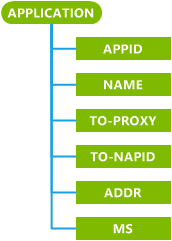

# w4 APPLICATION CSP

Use an **APPLICATION** configuration service provider that has an APPID of w4 to configure Multimedia Messaging Service (MMS).

The default security roles are defined in the root characteristic, and map to each subnode unless specific permission is granted to the subnode. The default security roles are Manager, Operator, and Operator – TPS.

> **Note**   This configuration service provider requires the ID\_CAP\_CSP\_FOUNDATION and ID\_CAP\_CSP\_W4\_APPLICATION capabilities to be accessed from a network configuration application.

 

The following diagram shows the configuration service provider in tree format as used by OMA Client Provisioning.

**APPID**
Required. This parameter takes a string value. The only supported value for configuring MMS is "w4".

**NAME**
Optional. Specifies a user–readable application identity. This parameter is also used to define part of the registry path for the APPLICATION parameters.

This parameter takes a string value. The possible values to configure the NAME parameter are:

-   Character string containing the name.

-   no value specified

> **Note**  MDM servers should resend APPLICATION/NAME to DMAcc after an upgrade because this value is displayed in the UI but not saved in Windows Phone 8.1 and cannot be migrated to Windows 10.

 

If no value is specified, the registry location will default to &lt;unnamed&gt;.

If `Name` is greater than 40 characters, it will be truncated to 40 characters.

**TO-PROXY**
Required. Specifies one logical proxy with a matching PROXY-ID. It is only possible to refer to proxies defined within the same provisioning file. Only one proxy can be listed.

The TO-PROXY value must be set to the value of the PROXY ID in PXLOGICAL that defines the MMS specific-proxy.

**TO-NAPID**
Required. Specifies the network access point identification name (NAPID) defined in the provisioning file. This parameter takes a string value. It is only possible to refer to network access points defined within the same provisioning file (except if the INTERNET attribute is set in the NAPDEF characteristic). For more information about the NAPDEF characteristic, see [NAPDEF configuration service provider](napdef-csp.md).

**ADDR**
Required. Specifies the address of the MMS application server, as a string. The possible values to configure the ADDR parameter are:

-   A Uniform Resource Identifier (URI)

-   An IPv4 address represented in decimal format with dots as delimiters

-   A fully qualified Internet domain name

**MS**
Optional. The maximum authorized size, in KB, for multimedia content. This parameter takes a numeric value in string format. If the value is not a number, or is less than or equal to 10, it will be ignored and outgoing MMS will not be resized.

## Remarks

Windows Phone MMS does not support user–selectable profiles. While multiple MMS profiles can be provisioned and saved simultaneously, only the last received profile is active.

If provisioning XML is received for a profile with an existing name, the values in that profile will be overwritten with the new values.

For more information about the parameters used by the w4 APPLICATION configuration service provider and how they are used, see the OMA MMS Conformance Document (OMA-TS-MMS-CONF-V1\_3-20051027-C) available from the [OMA website](https://go.microsoft.com/fwlink/p/?LinkId=526900).

## Related topics

[Configuration service provider reference](configuration-service-provider-reference.md)

 

 

