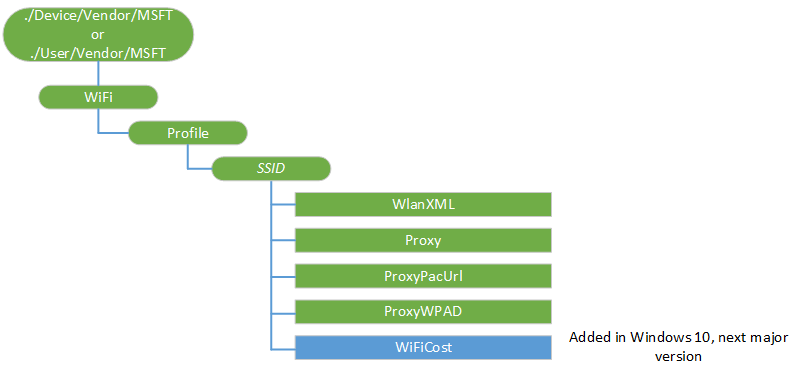

# WiFi CSP


The WiFi configuration service provider provides the functionality to add or delete Wi-Fi networks on a Windows device. The configuration service provider accepts SyncML input and converts it to a network profile that is installed on the device. This profile enables the device to connect to the Wi-Fi network when it is in range.

Programming considerations:

-   If the authentication method needs a certificate, for example, EAP-TLS requires client certificates, you must configure it through the CertificateStore configuration service provider. The WiFi configuration service provider does not provide that functionality; instead, the Wi-Fi profile can specify characteristics of the certificate to be used for choosing the right certificate for that network. The server must successfully enroll the certificate first before deploying the Wi-Fi network configuration. For example, for an EAP-TLS profile, the server must successfully configure and enroll the required client certificate before deploying the Wi-Fi profile. Self-signed certificate works for EAP-TLS/PEAP-MSCHAPv2, but it is not supported in EAP-TLS.
-   Because the Windows 10 Mobile emulator does not support Wi-Fi, you cannot test the Wi-Fi configuration with an emulator. You can still provision a Wi-Fi network using the WiFi CSP, then check it in the Wi-Fi settings page, but you cannot test the network connectivity in the emulator.
-   For WEP, WPA, and WPA2-based networks, include the passkey in the network configuration in plaintext. The passkey is encrypted automatically when it is stored on the device.
-   The SSID of the Wi-Fi network part of the LocURI node must be a valid URI based on RFC 2396. This requires that all non-ASCII characters must be escaped using a %-character. Unicode characters without the necessary escaping are not supported.
-   The &lt;name&gt;*name\_goes\_here*&lt;/name&gt;&lt;SSIDConfig&gt; must match &lt;SSID&gt;&lt;name&gt; *name\_goes\_here*&lt;/name&gt;&lt;/SSID&gt;.
-   For the WiFi CSP, you cannot use the Replace command unless the node already exists.
-   Using Proxyis only supported in Windows 10 Mobile. Using this configuration in Windows 10 for desktop editions (Home, Pro, Enterprise, and Education) will result in failure.

The following image shows the WiFi configuration service provider in tree format.



The following list shows the characteristics and parameters.

<a href="" id="profile"></a>**Profile**  
Identifies the Wi-Fi network configuration. Each Wi-Fi network configuration is represented by a profile object. This network profile includes all the information required for the device to connect to that network – for example, the SSID, authentication and encryption methods and passphrase in case of WEP or WPA2 networks.

Supported operation is Get.

<a href="" id="-ssid-"></a>***&lt;SSID&gt;***  
Specifies the name of the Wi-Fi network (32 bytes maximum) to create, configure, query, or delete. The name is case sensitive and can be represented in ASCII. The SSID is added when the WlanXML node is added. When the SSID node is deleted, then all the subnodes are also deleted.

SSID is the name of network you are connecting to, while Profile name is the name of the Profile which contains the WiFi settings information. If the Profile name is not set right in the MDM SyncML, as per the information in the WiFi settings XML, it could lead to some unexpected errors. For example, &lt;LocURI&gt;./Vendor/MSFT/WiFi/Profile/&lt;*MUST BE NAME OF PROFILE AS PER WIFI XML*&gt;/WlanXml&lt;/LocURI&gt;.

The supported operations are Add, Get, Delete, and Replace.

<a href="" id="wlanxml"></a>**WlanXML**  
The XML that describes the network configuration and follows the [WLAN\_profile Schema](http://go.microsoft.com/fwlink/p/?LinkId=325608) on MSDN.

Supported operations are Get, Add, Delete, and Replace.

Value type is chr.

The profile XML must be escaped, as shown in the examples below.

If it exists in the blob, the **keyType** and **protected** elements must come before **keyMaterial**, as shown in the example in [WPA2-Personal Profile Sample](http://go.microsoft.com/fwlink/p/?LinkId=523870).

> **Note**  If you need to specify other advanced conditions, such as specifying criteria for certificates that can be used by the Wi-Fi profile, you can do so by specifying this through the EapHostConfig portion of the WlanXML. For more information, see [EAP configuration](http://go.microsoft.com/fwlink/p/?LinkId=618963).

 

The supported operations are Add, Get, Delete, and Replace.

<a href="" id="proxy"></a>**Proxy**  
Optional. Specifies the configuration of the network proxy. A proxy server host and port can be specified per connection for Windows 10 Mobile. This proxy configuration is only supported in Windows 10 Mobile. Using this configuration in Windows 10 for desktop editions will result in failure.

The format is *host:port*, where host can be one of the following:

-   A registered host name, such as server name, FQDN, or Single Label Name, such as myweb instead of myweb.contoso.com.
-   IPV4 address
-   IPv6/IPvFuture address.

If it is an IPvFuture address, then it must be specified as an IP literal as "\[" (IP v6 address / IPvFuture ) "\]", such as "\[2441:4880:28:3:204:76ff:f43f:6eb\]:8080".

Supported operations are Get, Add, Delete, and Replace.

<a href="" id="disableinternetconnectivitychecks"></a>**DisableInternetConnectivityChecks**  
Added in Windows 10, version 1511.Optional. Disable the internet connectivity check for the profile.

Value type is chr.

-   True - internet connectivity check is disabled.
-   False - internet connectivity check is enabled.

Supported operations are Get, Add, Delete, and Replace.

<a href="" id="proxypacurl"></a>**ProxyPacUrl**  
Added in Windows 10, version 1607. Optional. Specifies the value of the URL to the Proxy auto-config (PAC) file location. This proxy configuration is only supported in Windows 10 Mobile.

Value type is chr, e.g. http://www.contoso.com/wpad.dat.

<a href="" id="proxywpad"></a>**ProxyWPAD**  
Added in Windows 10, version 1607. Optional. When set to true it enables Web Proxy Auto-Discovery Protocol (WPAD) for proxy lookup.This proxy configuration is only supported in Windows 10 Mobile.

Value type is bool.

## Examples


These XML examples show how to perform various tasks using OMA DM.

### Add a network

The following example shows how to add PEAP-MSCHAPv2 network with SSID 'MyNetwork,' a proxy URL 'testproxy,' and port 80.

``` syntax
<SyncML xmlns="SYNCML:SYNCML1.2">
  <SyncBody>
    <Atomic>
      <CmdID>301</CmdID>
      <Add>
        <CmdID>302</CmdID>
        <Item>
          <Target>
            <LocURI>./Vendor/MSFT/WiFi/Profile/MyNetwork/WlanXml</LocURI>
          </Target>
          <Meta>
            <Format xmlns="syncml:metinf">chr</Format>
          </Meta>
          <Data>&lt;?xml version=&quot;1.0&quot;?&gt;&lt;WLANProfile xmlns=&quot;http://contoso.com/networking/WLAN/profile/v1&quot;&gt;&lt;name&gt;MyNetwork&lt;/name&gt;&lt;SSIDConfig&gt;&lt;SSID&gt;&lt;hex&gt;412D4D534654574C414E&lt;/hex&gt;&lt;name&gt;MyNetwork&lt;/name&gt;&lt;/SSID&gt;&lt;nonBroadcast&gt;false&lt;/nonBroadcast&gt;&lt;/SSIDConfig&gt;&lt;connectionType&gt;ESS&lt;/connectionType&gt;&lt;connectionMode&gt;manual&lt;/connectionMode&gt;&lt;MSM&gt;&lt;security&gt;&lt;authEncryption&gt;&lt;authentication&gt;WPA2&lt;/authentication&gt;&lt;encryption&gt;AES&lt;/encryption&gt;&lt;useOneX&gt;true&lt;/useOneX&gt;&lt;/authEncryption&gt;&lt;OneX xmlns=&quot;http://contoso.com/networking/OneX/v1&quot;&gt;&lt;authMode&gt;user&lt;/authMode&gt;&lt;EAPConfig&gt;&lt;EapHostConfig xmlns=&quot;http://contoso.com/provisioning/EapHostConfig&quot;&gt;&lt;EapMethod&gt;&lt;Type xmlns=&quot;http://contoso.com/provisioning/EapCommon&quot;&gt;25&lt;/Type&gt;&lt;VendorId xmlns=&quot;http://contoso.com/provisioning/EapCommon&quot;&gt;0&lt;/VendorId&gt;&lt;VendorType xmlns=&quot;http://contoso.com/provisioning/EapCommon&quot;&gt;0&lt;/VendorType&gt;&lt;AuthorId xmlns=&quot;http://contoso.com/provisioning/EapCommon&quot;&gt;0&lt;/AuthorId&gt;&lt;/EapMethod&gt;&lt;Config xmlns=&quot;http://contoso.com/provisioning/EapHostConfig&quot;&gt;&lt;Eap xmlns=&quot;http://contoso.com/provisioning/BaseEapConnectionPropertiesV1&quot;&gt;&lt;Type&gt;25&lt;/Type&gt;&lt;EapType xmlns=&quot;http://contoso.com/provisioning/MsPeapConnectionPropertiesV1&quot;&gt;&lt;ServerValidation&gt;&lt;DisableUserPromptForServerValidation&gt;true&lt;/DisableUserPromptForServerValidation&gt;&lt;ServerNames&gt;&lt;/ServerNames&gt;&lt;/ServerValidation&gt;&lt;FastReconnect&gt;true&lt;/FastReconnect&gt;&lt;InnerEapOptional&gt;false&lt;/InnerEapOptional&gt;&lt;Eap xmlns=&quot;http://contoso.com/provisioning/BaseEapConnectionPropertiesV1&quot;&gt;&lt;Type&gt;26&lt;/Type&gt;&lt;EapType xmlns=&quot;http://contoso.com/provisioning/MsChapV2ConnectionPropertiesV1&quot;&gt;&lt;UseWinLogonCredentials&gt;false&lt;/UseWinLogonCredentials&gt;&lt;/EapType&gt;&lt;/Eap&gt;&lt;EnableQuarantineChecks&gt;false&lt;/EnableQuarantineChecks&gt;&lt;RequireCryptoBinding&gt;false&lt;/RequireCryptoBinding&gt;&lt;PeapExtensions&gt;&lt;PerformServerValidation xmlns=&quot;http://contoso.com/provisioning/MsPeapConnectionPropertiesV2&quot;&gt;false&lt;/PerformServerValidation&gt;&lt;AcceptServerName xmlns=&quot;http://contoso.com/provisioning/MsPeapConnectionPropertiesV2&quot;&gt;false&lt;/AcceptServerName&gt;&lt;/PeapExtensions&gt;&lt;/EapType&gt;&lt;/Eap&gt;&lt;/Config&gt;&lt;/EapHostConfig&gt;&lt;/EAPConfig&gt;&lt;/OneX&gt;&lt;/security&gt;&lt;/MSM&gt;&lt;/WLANProfile&gt; </Data>
        </Item>
      </Add>
      <Add>
        <CmdID>$CmdID$</CmdID>
        <Item>
          <Target>
            <LocURI>./Vendor/MSFT/WiFi/Profile/MyNetwork/Proxy</LocURI>
          </Target>
          <Meta>
            <Format xmlns="syncml:metinf">chr</Format>
          </Meta>
          <Data>testproxy:80</Data>
        </Item>
      </Add>
    </Atomic>
    <Final/>
  </SyncBody>
</SyncML>
```

### Query network profiles

The following example shows how to query Wi-Fi profiles installed on an MDM server.

``` syntax
<Get> 
   <CmdID>301</CmdID> 
   <Item> 
      <Target> 
         <LocURI>./Vendor/MSFT/WiFi/Profile</LocURI> 
      </Target> 
   </Item> 
</Get>
```

The following example shows the response.

``` syntax
<Results> 
   <CmdID>3</CmdID> 
   <MsgRef>1</MsgRef> 
   <CmdRef>301</CmdRef>
   <Item> 
      <Source><LocURI>./Vendor/MSFT/WiFi/Profile</LocURI></Source> 
      <Meta><Format xmlns="syncml:metinf">node</Format></Meta> 
      <Data>TestWLAN1/TestWLAN2</Data> 
   </Item> 
</Results>
```

### Remove a network

The following example shows how to remove a network with SSID ‘MyNetwork’ and no proxy. Removing all network authentication types is done in this same manner.

``` syntax
<Atomic>
      <CmdID>300</CmdID>
      <Delete>
        <CmdID>301</CmdID>
        <Item>
          <Target>
            <LocURI>./Vendor/MSFT/WiFi/Profile/MyNetwork/WlanXml</LocURI>
          </Target>
        </Item>
      </Delete>
</Atomic>
```

### Add a network and certification authority for a server certificate

The following example shows how to add PEAP-MSCHAPv2 network with SSID ‘MyNetwork’ and root CA validation for server certificate.

``` syntax
<Atomic>
      <CmdID>300</CmdID>
      <Add>
        <CmdID>301</CmdID>
        <Item>
          <Target>
            <LocURI>./Vendor/MSFT/WiFi/Profile/MyNetwork/WlanXml</LocURI>
          </Target>
          <Meta>
            <Format xmlns="syncml:metinf">chr</Format>
          </Meta>
          <Data>&lt;?xml version=&quot;1.0&quot;?&gt;&lt;WLANProfile xmlns=&quot;http://www.microsoft.com/networking/WLAN/profile/v1&quot;&gt;&lt;name&gt;MyNetwork&lt;/name&gt;&lt;SSIDConfig&gt;&lt;SSID&gt;&lt;name&gt;MyNetwork&lt;/name&gt;&lt;/SSID&gt;&lt;nonBroadcast&gt;false&lt;/nonBroadcast&gt;&lt;/SSIDConfig&gt;&lt;connectionType&gt;ESS&lt;/connectionType&gt;&lt;connectionMode&gt;manual&lt;/connectionMode&gt;&lt;MSM&gt;&lt;security&gt;&lt;authEncryption&gt;&lt;authentication&gt;WPA2&lt;/authentication&gt;&lt;encryption&gt;AES&lt;/encryption&gt;&lt;useOneX&gt;true&lt;/useOneX&gt;&lt;/authEncryption&gt;&lt;OneX xmlns=&quot;http://www.microsoft.com/networking/OneX/v1&quot;&gt;&lt;authMode&gt;user&lt;/authMode&gt;&lt;EAPConfig&gt;&lt;EapHostConfig xmlns=&quot;http://www.microsoft.com/provisioning/EapHostConfig&quot;&gt;&lt;EapMethod&gt;&lt;Type xmlns=&quot;http://www.microsoft.com/provisioning/EapCommon&quot;&gt;25&lt;/Type&gt;&lt;VendorId xmlns=&quot;http://www.microsoft.com/provisioning/EapCommon&quot;&gt;0&lt;/VendorId&gt;&lt;VendorType xmlns=&quot;http://www.microsoft.com/provisioning/EapCommon&quot;&gt;0&lt;/VendorType&gt;&lt;AuthorId xmlns=&quot;http://www.microsoft.com/provisioning/EapCommon&quot;&gt;0&lt;/AuthorId&gt;&lt;/EapMethod&gt;&lt;Config xmlns=&quot;http://www.microsoft.com/provisioning/EapHostConfig&quot;&gt;&lt;Eap xmlns=&quot;http://www.microsoft.com/provisioning/BaseEapConnectionPropertiesV1&quot;&gt;&lt;Type&gt;25&lt;/Type&gt;&lt;EapType xmlns=&quot;http://www.microsoft.com/provisioning/MsPeapConnectionPropertiesV1&quot;&gt;&lt;ServerValidation&gt;&lt;DisableUserPromptForServerValidation&gt;true&lt;/DisableUserPromptForServerValidation&gt;&lt;ServerNames&gt;&lt;/ServerNames&gt;&lt;TrustedRootCA&gt; InsertCertThumbPrintHere &lt;/TrustedRootCA&gt;&lt;/ServerValidation&gt;&lt;FastReconnect&gt;true&lt;/FastReconnect&gt;&lt;InnerEapOptional&gt;false&lt;/InnerEapOptional&gt;&lt;Eap xmlns=&quot;http://www.microsoft.com/provisioning/BaseEapConnectionPropertiesV1&quot;&gt;&lt;Type&gt;26&lt;/Type&gt;&lt;EapType xmlns=&quot;http://www.microsoft.com/provisioning/MsChapV2ConnectionPropertiesV1&quot;&gt;&lt;UseWinLogonCredentials&gt;false&lt;/UseWinLogonCredentials&gt;&lt;/EapType&gt;&lt;/Eap&gt;&lt;EnableQuarantineChecks&gt;false&lt;/EnableQuarantineChecks&gt;&lt;RequireCryptoBinding&gt;false&lt;/RequireCryptoBinding&gt;&lt;PeapExtensions&gt;&lt;PerformServerValidation xmlns=&quot;http://www.microsoft.com/provisioning/MsPeapConnectionPropertiesV2&quot;&gt;true&lt;/PerformServerValidation&gt;&lt;AcceptServerName xmlns=&quot;http://www.microsoft.com/provisioning/MsPeapConnectionPropertiesV2&quot;&gt;false&lt;/AcceptServerName&gt;&lt;/PeapExtensions&gt;&lt;/EapType&gt;&lt;/Eap&gt;&lt;/Config&gt;&lt;/EapHostConfig&gt;&lt;/EAPConfig&gt;&lt;/OneX&gt;&lt;/security&gt;&lt;/MSM&gt;&lt;/WLANProfile&gt; </Data>
        </Item>
      </Add>
</Atomic>
```

## Related topics


[Configuration service provider reference](configuration-service-provider-reference.md)

 

 


