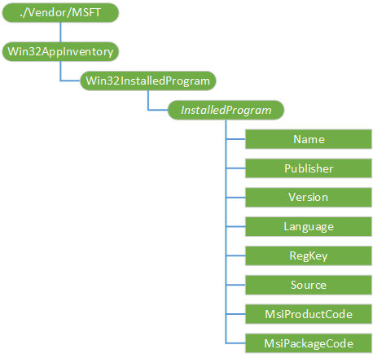

# Win32AppInventory CSP

The Win32AppInventory configuration service provider is used to provide an inventory of installed applications on a device.

The following diagram shows the Win32AppInventory configuration service provider management objects in tree format as used by Open Mobile Alliance Device Management (OMA DM), OMA Client Provisioning, and Enterprise DM.

**./Vendor/MSFT/Win32AppInventory**  
The root node for the Win32AppInventory configuration service provider.

The supported operation is Get.

**Win32InstalledProgram**  
This represents an inventory of installed Win32 applications on the device.

The supported operation is Get.

**Win32InstalledProgram/***InstalledProgram*  
A node that contains information for a specific application.

**Win32InstalledProgram/***InstalledProgram***/Name**  
A string that specifies the name of the application.

The supported operation is Get.

**Win32InstalledProgram/***InstalledProgram***/Publisher**  
A string that specifies the publisher of the application.

The supported operation is Get.

**Win32InstalledProgram/***InstalledProgram***/Version**  
A string that specifies the version of the application.

The supported operation is Get.

**Win32InstalledProgram/***InstalledProgram***/Language**  
A string that specifies the language of the application.

The supported operation is Get.

**Win32InstalledProgram/***InstalledProgram***/RegKey**  
A string that specifies product code or registry subkey.

For MSI-based applications this is the product code.

For applications found in Add/Remove Programs, this is the registry subkey.

The supported operation is Get.

**Win32InstalledProgram/***InstalledProgram***/Source**  
A string that specifies where the application was discovered, such as MSI or Add/Remove Programs.

The supported operation is Get.

**Win32InstalledProgram/***InstalledProgram***/MsiProductCode**  
A GUID that uniquely identifies a particular MSI product.

The supported operation is Get.

**Win32InstalledProgram/***InstalledProgram***/MsiPackageCode**  
A GUID that identifies an MSI package. Multiple products can make up a single package.

The supported operation is Get.

## Related topics

[Configuration service provider reference](configuration-service-provider-reference.md)

 

 

