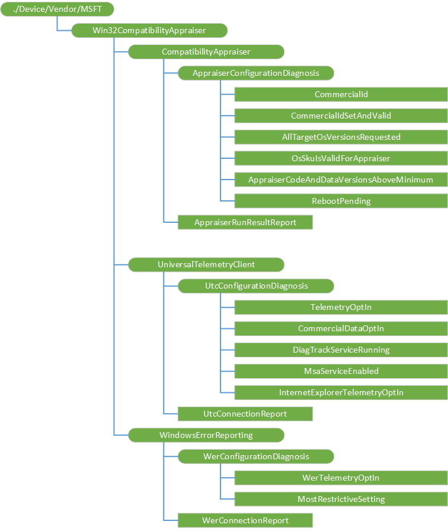

#  Win32CompatibilityAppraiser CSP 

> [!WARNING]
> Some information relates to prereleased product which may be substantially modified before it's commercially released. Microsoft makes no warranties, express or implied, with respect to the information provided here.

The Win32CompatibilityAppraiser configuration service provider enables the IT admin to query the current status of the Appraiser and UTC telementry health. This CSP was added in Windows 10, version 1809.

The following diagram shows the Win32CompatibilityAppraiser configuration service provider in tree format.



<a href="" id="accountmanagement"></a>**./Vendor/MSFT/Win32CompatibilityAppraiser**  
The root node for the Win32CompatibilityAppraiser configuration service provider.

<a href="" id="compatibilityappraiser"></a>**CompatibilityAppraiser**  
This represents the state of the Compatibility Appraiser.


<a href="" id="compatibilityappraiser-appraiserconfigurationdiagnosis"></a>**CompatibilityAppraiser/AppraiserConfigurationDiagnosis**  
This represents various settings that affect whether the Compatibility Appraiser can collect and upload compatibility data. 


<a href="" id="compatibilityappraiser-appraiserconfigurationdiagnosis-commercialid"></a>**CompatibilityAppraiser/AppraiserConfigurationDiagnosis/CommercialId**  
The unique identifier specifying what organization owns this device.  This helps correlate telemetry after it has been uploaded.

Value type is string. Supported operation is Get.

<a href="" id="compatibilityappraiser-appraiserconfigurationdiagnosiscommercialidsetandvalid"></a>**CompatibilityAppraiser/AppraiserConfigurationDiagnosis/CommercialIdSetAndValid**  
A boolean value representing whether the CommercialId is set to a valid value.  Valid values are strings in the form of GUIDs, with no surrounding braces.

Value type is bool. Supported operation is Get.

<a href="" id="compatibilityappraiser-appraiserconfigurationdiagnosis-alltargetosversionsrequested"></a>**CompatibilityAppraiser/AppraiserConfigurationDiagnosis/AllTargetOsVersionsRequested**  
A boolean value representing whether the flag to request that the Compatibility Appraiser check compatibility with all possible Windows 10 versions has been set.  By default, versions 1507 and 1511, and any version equal to or less than the current version, are not checked.

Value type is bool. Supported operation is Get.

<a href="" id="compatibilityappraiser-appraiserconfigurationdiagnosis-osskuisvalidforappraiser"></a>**CompatibilityAppraiser/AppraiserConfigurationDiagnosis/OsSkuIsValidForAppraiser**  
A boolean value indicating whether the current Windows SKU is able to run the Compatibility Appraiser.

Value type is bool. Supported operation is Get.

<a href="" id="compatibilityappraiser-appraiserconfigurationdiagnosis-appraisercodeanddataversionsaboveminimum"></a>**CompatibilityAppraiser/AppraiserConfigurationDiagnosis/AppraiserCodeAndDataVersionsAboveMinimum**  
An integer value representing whether the installed versions of the Compatibility Appraiser code and data meet the minimum requirement to provide useful data.  

The values are:  
-  0 == Neither the code nor data is of a sufficient version  
-  1 == The code version is insufficient but the data version is sufficient 
-  2 == The code version is sufficient but the data version is insufficient
-  3 == Both the code and data are of a sufficient version

Value type is integer. Supported operation is Get.

<a href="" id="compatibilityappraiser-appraiserconfigurationdiagnosis-rebootpending"></a>**CompatibilityAppraiser/AppraiserConfigurationDiagnosis/RebootPending**  
A boolean value representing whether a reboot is pending on this computer.  A newly-installed version of the Compatibility Appraiser may require a reboot before useful data is able to be sent.

Value type is bool. Supported operation is Get.

<a href="" id="compatibilityappraiser-appraiserrunresultreport"></a>**CompatibilityAppraiser/AppraiserRunResultReport**  
This provides an XML representation of the last run of Appraiser and the last runs of Appraiser of certain types or configurations.

For the report XML schema see [Appraiser run result report](#appraiser-run-result-report).

<a href="" id="universaltelemetryclient"></a>**UniversalTelemetryClient**  
This represents the state of the Universal Telemetry Client, or DiagTrack service.

<a href="" id="universaltelemetryclient-utcconfigurationdiagnosis"></a>**UniversalTelemetryClient/UtcConfigurationDiagnosis**  
This represents various settings that affect whether the Universal Telemetry Client can upload data and how much data it can upload.

<a href="" id="universaltelemetryclient-utcconfigurationdiagnosis-telemetryoptin"></a>**UniversalTelemetryClient/UtcConfigurationDiagnosis/TelemetryOptIn**  
An integer value representing what level of telemetry will be uploaded.  

Value type is integer. Supported operation is Get.

The values are:  
-  0 == Security data will be sent 
-  1 == Basic telemetry will be sent 
-  2 == Enhanced telemetry will be sent 
-  3 == Full telemetry will be sent

<a href="" id="universaltelemetryclient-utcconfigurationdiagnosis-commercialdataoptin"></a>**UniversalTelemetryClient/UtcConfigurationDiagnosis/CommercialDataOptIn**  
An integer value representing whether the CommercialDataOptIn setting is allowing any data to upload.  

Value type is integer. Supported operation is Get.

The values are:  
-  0 == Setting is disabled
-  1 == Setting is enabled
-  2 == Setting is not applicable to this version of Windows

<a href="" id="universaltelemetryclient-utcconfigurationdiagnosis-diagtrackservicerunning"></a>**UniversalTelemetryClient/UtcConfigurationDiagnosis/DiagTrackServiceRunning**  
A boolean value representing whether the DiagTrack service is running.  This service must be running in order to upload UTC data.

Value type is bool. Supported operation is Get.

<a href="" id="universaltelemetryclient-utcconfigurationdiagnosis-msaserviceenabled"></a>**UniversalTelemetryClient/UtcConfigurationDiagnosis/MsaServiceEnabled**  
A boolean value representing whether the MSA service is enabled.  This service must be enabled for UTC data to be indexed with Global Device IDs.

Value type is bool. Supported operation is Get.

<a href="" id="universaltelemetryclient-utcconfigurationdiagnosis-internetexplorertelemetryoptin"></a>**UniversalTelemetryClient/UtcConfigurationDiagnosis/InternetExplorerTelemetryOptIn**  
An integer value representing what websites Internet Explorer will collect telemetry data for.    

Value type is integer. Supported operation is Get.

The values are:  
-  0 == Telemetry collection is disabled 
-  1 == Telemetry collection is enabled for websites in the local intranet, trusted websites, and machine local zones 
-  2 == Telemetry collection is enabled for internet websites and restricted website zones
-  3 == Telemetry collection is enabled for all websites
-  0x7FFFFFFF == Telemetry collection is not configured

<a href="" id="universaltelemetryclient-utcconnectionreport"></a>**UniversalTelemetryClient/UtcConnectionReport**  
This provides an XML representation of the UTC connections during the most recent summary period.

For the report XML schema, see [UTC connection report](#utc-connection-report).

<a href="" id="windowserrorreporting"></a>**WindowsErrorReporting**  
This represents the state of the Windows Error Reporting service.

<a href="" id="windowserrorreporting-werconfigurationdiagnosis"></a>**WindowsErrorReporting/WerConfigurationDiagnosis**  
This represents various settings that affect whether the Windows Error Reporting service can upload data and how much data it can upload.

<a href="" id="windowserrorreporting-werconfigurationdiagnosis-wertelemetryoptin"></a>**WindowsErrorReporting/WerConfigurationDiagnosis/WerTelemetryOptIn**  
An integer value indicating the amount of WER data that will be uploaded.  

Value type integer. Supported operation is Get.

The values are:  
-  0 == Data will not send due to UTC opt-in 
-  1 == Data will not send due to WER opt-in 
-  2 == Basic WER data will send but not the complete set of data 
-  3 == The complete set of WER data will send


<a href="" id="windowserrorreporting-werconfigurationdiagnosis-mostrestrictivesetting"></a>**WindowsErrorReporting/WerConfigurationDiagnosis/MostRestrictiveSetting**  
An integer value representing which setting category (system telemetry, WER basic policies, WER advanced policies, and WER consent policies) is causing the overall WerTelemetryOptIn value to be restricted.  

Value type integer. Supported operation is Get.

The values are:  
-  0 == System telemetry settings are restricting uploads 
-  1 == WER basic policies are restricting uploads 
-  2 == WER advanced policies are restricting uploads 
-  3 == WER consent policies are restricting uploads 
-  4 == There are no restrictive settings

<a href="" id="windowserrorreporting-werconnectionreport"></a>**WindowsErrorReporting/WerConnectionReport**  
This provides an XML representation of the most recent WER connections of various types.

For the report XML schema, see [Windows Error Reporting connection report](#windows-error-reporting-connection-report).

## XML schema for the reports

### Appraiser run result report

```
<?xml version="1.0" encoding="utf-8"?>
<xs:schema xmlns:xs="http://www.w3.org/2001/XMLSchema" >
    <xs:annotation>
        <xs:documentation>CSP schema for the Compatibility Appraiser Diagnostic CSP.</xs:documentation>
        <xs:documentation>Schema defining the Win32CompatibilityAppraiser\CompatibilityAppraiser\AppraiserRunResultReport CSP node.</xs:documentation>
        <xs:documentation>Copyright (c) Microsoft Corporation, all rights reserved.</xs:documentation>
    </xs:annotation>
    <xs:simpleType name="RunCategoryType">
        <xs:annotation>
            <xs:documentation>Defines a category of Appraiser run.</xs:documentation>
        </xs:annotation>
        <xs:restriction base="xs:string">
            <xs:enumeration value="LastSecurityModeRunAttempt">
                <xs:annotation>
                    <xs:documentation>LastSecurityModeRunAttempt - The most recent run that was skipped because the "Allow Telemetry" setting was set to "Security".</xs:documentation>
                </xs:annotation>
            </xs:enumeration>
            <xs:enumeration value="LastEnterpriseRun">
                <xs:annotation>
                    <xs:documentation>LastEnterpriseRun - The most recent run that was invoked with the "ent" command line.</xs:documentation>
                </xs:annotation>
            </xs:enumeration>
            <xs:enumeration value="LastFatallyErroredRun">
                <xs:annotation>
                    <xs:documentation>LastFatallyErroredRun - The most recent run that returned a failed "ErrorCode".</xs:documentation>
                </xs:annotation>
            </xs:enumeration>
            <xs:enumeration value="LastSuccessfulRun">
                <xs:annotation>
                    <xs:documentation>LastSuccessfulRun - The most recent run that returned a successful "ErrorCode".</xs:documentation>
                </xs:annotation>
            </xs:enumeration>
            <xs:enumeration value="LastFullSyncRun">
                <xs:annotation>
                    <xs:documentation>LastFullSyncRun - The most recent run that attempted to upload a complete set of compatibility data (instead of only new data that was found since the previous run).</xs:documentation>
                </xs:annotation>
            </xs:enumeration>
            <xs:enumeration value="LastSuccessfulFullSyncRun">
                <xs:annotation>
                    <xs:documentation>LastSuccessfulFullSyncRun - The most recent run that attempted to upload a complete set of compatibility data (instead of only new data that was found since the previous run) and also returned a successful "ErrorCode".</xs:documentation>
                </xs:annotation>
            </xs:enumeration>
            <xs:enumeration value="LastSuccessfulFromEnterprisePerspectiveRun">
                <xs:annotation>
                    <xs:documentation>LastSuccessfulFromEnterprisePerspectiveRun - The most recent run that returned a successful "EnterpriseErrorCode".</xs:documentation>
                </xs:annotation>
            </xs:enumeration>
            <xs:enumeration value="LastSuccessfulFromEnterprisePerspectiveFullSyncRun">
                <xs:annotation>
                    <xs:documentation>LastSuccessfulFromEnterprisePerspectiveEnterpriseRun - The most recent run that attempted to upload a complete set of compatibility data (instead of only new data that was found since the previous run) and also returned a successful "EnterpriseErrorCode".</xs:documentation>
                </xs:annotation>
            </xs:enumeration>
            <xs:enumeration value="LastSuccessfulFromEnterprisePerspectiveEnterpriseRun">
                <xs:annotation>
                    <xs:documentation>LastSuccessfulFromEnterprisePerspectiveEnterpriseRun - The most recent run that was invoked with the "ent" command line and also returned a successful "EnterpriseErrorCode".</xs:documentation>
                </xs:annotation>
            </xs:enumeration>
        </xs:restriction>
    </xs:simpleType>
    <xs:complexType name="LastRunResultOfAnyCategoryType">
        <xs:annotation>
            <xs:documentation>Represents the most recent run of the Compatibility Appraiser.</xs:documentation>
        </xs:annotation>
        <xs:sequence>
            <xs:element name="CurrentlyRunning" type="xs:boolean" minOccurs="1" maxOccurs="1">
                <xs:annotation>
                    <xs:documentation>CurrentlyRunning - A boolean representing whether the specified Compatibility Appraiser run is still in progress.</xs:documentation>
                </xs:annotation>
            </xs:element>
            <xs:element name="CrashedOrInterrupted" type="xs:boolean" minOccurs="1" maxOccurs="1">
                <xs:annotation>
                    <xs:documentation>CrashedOrInterrupted - A boolean representing whether the specified Compatibility Appraiser run ended before it finished scanning for compatibility data.</xs:documentation>
                </xs:annotation>
            </xs:element>
            <xs:element name="ErrorCode" type="xs:unsignedInt" minOccurs="1" maxOccurs="1">
                <xs:annotation>
                    <xs:documentation>ErrorCode - An integer which is the HRESULT error code, of a type that is relevant to any computer, from the specified Compatibility Appraiser run.  This may be a successful HRESULT code or a failure HRESULT code.</xs:documentation>
                </xs:annotation>
            </xs:element>
            <xs:element name="EnterpriseErrorCode" type="xs:unsignedInt" minOccurs="1" maxOccurs="1">
                <xs:annotation>
                    <xs:documentation>EnterpriseErrorCode - An integer which is the HRESULT error code, of a type that is relevant mainly to enterprise computers, from the specified Compatibility Appraiser run.  This may be a successful HRESULT code or a failure HRESULT code.</xs:documentation>
                </xs:annotation>
            </xs:element>
            <xs:element name="RunStartTimestamp" type="xs:unsignedLong" minOccurs="1" maxOccurs="1">
                <xs:annotation>
                    <xs:documentation>RunStartTimestamp - The time when the specified Compatibility Appraiser run started.</xs:documentation>
                </xs:annotation>
            </xs:element>
            <xs:element name="RunEndTimestamp" type="xs:unsignedLong" minOccurs="1" maxOccurs="1">
                <xs:annotation>
                    <xs:documentation>RunEndTimestamp - The time when the specified Compatibility Appraiser run ended.</xs:documentation>
                </xs:annotation>
            </xs:element>
            <xs:element name="ComponentWhichCausedErrorCode" type="xs:string" minOccurs="0" maxOccurs="1">
                <xs:annotation>
                    <xs:documentation>ComponentWhichCausedErrorCode - The name of the internal component, if any, which caused the ErrorCode node to be a failure value during the specified Compatibility Appraiser run.  Note that the ErrorCode node might be a failure value for a reason other than an internal component failure.</xs:documentation>
                </xs:annotation>
            </xs:element>
            <xs:element name="ErroredComponent" type="xs:string" minOccurs="0" maxOccurs="unbounded">
                <xs:annotation>
                    <xs:documentation>ErroredComponent - The name of one of the internal components, if any, which encountered failure HRESULT codes during the specified Compatibility Appraiser run.  A failure of an internal component may not necessarily cause the ErrorCode node to contain a failed HRESULT code.</xs:documentation>
                </xs:annotation>
            </xs:element>
        </xs:sequence>
    </xs:complexType>
    <xs:complexType name="RunResultOfSpecificCategoryType">
        <xs:annotation>
            <xs:documentation>Represents the most recent run of the Compatibility Appraiser that satisfied a particular condition.</xs:documentation>
        </xs:annotation>
        <xs:sequence>
            <xs:element name="ErrorCode" type="xs:unsignedInt" minOccurs="1" maxOccurs="1">
                <xs:annotation>
                    <xs:documentation>ErrorCode - An integer which is the HRESULT error code, of a type that is relevant to any computer, from the specified Compatibility Appraiser run.  This may be a successful HRESULT code or a failure HRESULT code.</xs:documentation>
                </xs:annotation>
            </xs:element>
            <xs:element name="EnterpriseErrorCode" type="xs:unsignedInt" minOccurs="1" maxOccurs="1">
                <xs:annotation>
                    <xs:documentation>EnterpriseErrorCode - An integer which is the HRESULT error code, of a type that is relevant mainly to enterprise computers, from the specified Compatibility Appraiser run.  This may be a successful HRESULT code or a failure HRESULT code.</xs:documentation>
                </xs:annotation>
            </xs:element>
            <xs:element name="RunStartTimestamp" type="xs:unsignedLong" minOccurs="1" maxOccurs="1">
                <xs:annotation>
                    <xs:documentation>RunStartTimestamp - The time when the specified Compatibility Appraiser run started.</xs:documentation>
                </xs:annotation>
            </xs:element>
            <xs:element name="RunEndTimestamp" type="xs:unsignedLong" minOccurs="1" maxOccurs="1">
                <xs:annotation>
                    <xs:documentation>RunEndTimestamp - The time when the specified Compatibility Appraiser run ended.</xs:documentation>
                </xs:annotation>
            </xs:element>
            <xs:element name="ComponentWhichCausedErrorCode" type="xs:string" minOccurs="0" maxOccurs="1">
                <xs:annotation>
                    <xs:documentation>ComponentWhichCausedErrorCode - The name of the internal component, if any, which caused the ErrorCode node to be a failure value during the specified Compatibility Appraiser run.  Note that the ErrorCode node might be a failure value for a reason other than an internal component failure.</xs:documentation>
                </xs:annotation>
            </xs:element>
            <xs:element name="ErroredComponent" type="xs:string" minOccurs="0" maxOccurs="unbounded">
                <xs:annotation>
                    <xs:documentation>ErroredComponent - The name of one of the internal components, if any, which encountered failure HRESULT codes during the specified Compatibility Appraiser run.  A failure of an internal component may not necessarily cause the ErrorCode node to contain a failed HRESULT code.</xs:documentation>
                </xs:annotation>
            </xs:element>
        </xs:sequence>
        <xs:attribute name="RunCategory" type="RunCategoryType" use="required">
            <xs:annotation>
                <xs:documentation>RunCategory - A string which details the category of Appraiser run.</xs:documentation>
            </xs:annotation>
        </xs:attribute>
    </xs:complexType>
    <xs:complexType name="RunResultReportType">
        <xs:annotation>
            <xs:documentation>Defines the latest run results for all known categories.</xs:documentation>
        </xs:annotation>
        <xs:sequence>
            <xs:element name="LastRunResult" type="LastRunResultOfAnyCategoryType" minOccurs="0" maxOccurs="1">
                <xs:annotation>
                    <xs:documentation>LastRunResult - Represents the most recent run of the Compatibility Appraiser.</xs:documentation>
                </xs:annotation>
            </xs:element>
            <xs:element name="LastRunResultForCategory" type="RunResultOfSpecificCategoryType" minOccurs="0" maxOccurs="unbounded">
                <xs:annotation>
                    <xs:documentation>LastRunResultForCategory - Represents the most recent run of the Compatibility Appraiser that satisfied a particular condition.</xs:documentation>
                </xs:annotation>
            </xs:element>
        </xs:sequence>
    </xs:complexType>
    <xs:element name="RunResultReport" type="RunResultReportType"/>
</xs:schema>
```

### UTC connection report

```
<?xml version="1.0" encoding="utf-8"?>
<xs:schema xmlns:xs="http://www.w3.org/2001/XMLSchema" xmlns:fusion="urn:schemas-microsoft-com:asm.v1" elementFormDefault="qualified" xmlns:xsi="http://www.w3.org/2001/XMLSchema-instance" >
    <xs:annotation>
        <xs:documentation>CSP schema for the Compatibility Appraiser Diagnostic CSP.</xs:documentation>
        <xs:documentation>Schema defining the Win32CompatibilityAppraiser\UniversalTelemetryClient\UtcConnectionReport CSP node.</xs:documentation>
        <xs:documentation>Copyright (c) Microsoft Corporation, all rights reserved.</xs:documentation>
    </xs:annotation>
    <xs:complexType name="ConnectionSummaryType">
        <xs:annotation>
            <xs:documentation>Defines the latest UTC connection results, if any.</xs:documentation>
        </xs:annotation>
        <xs:sequence>
            <xs:element name="ConnectionSummaryStartingTimestamp" type="xs:unsignedLong" minOccurs="1" maxOccurs="1">
                <xs:annotation>
                    <xs:documentation>ConnectionSummaryStartingTimestamp - The starting time of the most recent UTC summary window.</xs:documentation>
                </xs:annotation>
            </xs:element>
            <xs:element name="ConnectionSummaryEndingTimestamp" type="xs:unsignedLong" minOccurs="1" maxOccurs="1">
                <xs:annotation>
                    <xs:documentation>ConnectionSummaryEndingTimestamp - The ending time of the most recent UTC summary window.</xs:documentation>
                </xs:annotation>
            </xs:element>
            <xs:element name="TimestampOfLastSuccessfulUpload" type="xs:unsignedLong" minOccurs="0" maxOccurs="1">
                <xs:annotation>
                    <xs:documentation>TimestampOfLastSuccessfulUpload - The ending time of the most recent UTC summary window that included a successful data upload.</xs:documentation>
                </xs:annotation>
            </xs:element>
            <xs:element name="LastHttpErrorCode" type="xs:unsignedInt" minOccurs="0" maxOccurs="1">
                <xs:annotation>
                    <xs:documentation>LastHttpErrorCode - The HTTP error code from the last failed internet connection.</xs:documentation>
                </xs:annotation>
            </xs:element>
            <xs:element name="ProxyDetected" type="xs:boolean" minOccurs="0" maxOccurs="1">
                <xs:annotation>
                    <xs:documentation>ProxyDetected - A boolean value representing whether an internet connection during the summary window was directed through a proxy.</xs:documentation>
                </xs:annotation>
            </xs:element>
            <xs:element name="ConnectionsSuccessful" type="xs:unsignedInt" minOccurs="0" maxOccurs="1">
                <xs:annotation>
                    <xs:documentation>ConnectionsSuccessful - An integer value summarizing the success of internet connections during the summary window.  The values are: 0 == "All connections failed", 1 == "Some connections succeeded and some failed", and 2 == "All connections succeeded".</xs:documentation>
                </xs:annotation>
            </xs:element>
            <xs:element name="DataUploaded" type="xs:unsignedInt" minOccurs="0" maxOccurs="1">
                <xs:annotation>
                    <xs:documentation>DataUploaded - An integer value summarizing the success of data uploads during the summary window.  The values are: 0 == "All data was dropped", 1 == "Some data was dropped and some was sent successfully", 2 == "All data was sent successfully", and 3 == "No data was present to upload".</xs:documentation>
                </xs:annotation>
            </xs:element>
            <xs:element name="AnyCertificateValidationFailures" type="xs:boolean" minOccurs="0" maxOccurs="1">
                <xs:annotation>
                    <xs:documentation>AnyCertificateValidationFailures - A boolean value representing whether there were any failed attempts to validate certificates in the summary window.</xs:documentation>
                </xs:annotation>
            </xs:element>
            <xs:element name="LastCertificateValidationFailureCode" type="xs:unsignedInt" minOccurs="0" maxOccurs="1">
                <xs:annotation>
                    <xs:documentation>LastCertificateValidationFailureCode - The most recent error code from a failed attempt at validating a certificate.</xs:documentation>
                </xs:annotation>
            </xs:element>
        </xs:sequence>
    </xs:complexType>
    <xs:complexType name="ConnectionReportType">
        <xs:annotation>
            <xs:documentation>Lists results of UTC connections.</xs:documentation>
        </xs:annotation>
        <xs:sequence>
            <xs:element name="ConnectionSummary" type="ConnectionSummaryType" minOccurs="0" maxOccurs="1">
                <xs:annotation>
                    <xs:documentation>Defines the latest UTC connection results, if any.</xs:documentation>
                </xs:annotation>
            </xs:element>
        </xs:sequence>
    </xs:complexType>
    <xs:element name="ConnectionReport" type="ConnectionReportType"/>
</xs:schema>
```

### Windows Error Reporting connection report

```
<?xml version="1.0" encoding="utf-8"?>
<xs:schema xmlns:xs="http://www.w3.org/2001/XMLSchema" xmlns:fusion="urn:schemas-microsoft-com:asm.v1" elementFormDefault="qualified" xmlns:xsi="http://www.w3.org/2001/XMLSchema-instance" >
    <xs:annotation>
        <xs:documentation>CSP schema for the Compatibility Appraiser Diagnostic CSP.</xs:documentation>
        <xs:documentation>Schema defining the Win32CompatibilityAppraiser\WindowsErrorReporting\WerConnectionReport CSP node.</xs:documentation>
        <xs:documentation>Copyright (c) Microsoft Corporation, all rights reserved.</xs:documentation>
    </xs:annotation>
    <xs:complexType name="LastNormalUploadSuccessType">
        <xs:annotation>
            <xs:documentation>LastNormalUploadSuccess - A summary of the last time WER successfully performed a normal data upload, if any.</xs:documentation>
        </xs:annotation>
        <xs:sequence>
            <xs:element name="Timestamp" type="xs:unsignedLong" minOccurs="1" maxOccurs="1">
                <xs:annotation>
                    <xs:documentation>Timestamp - The time when WER attempted the upload.</xs:documentation>
                </xs:annotation>
            </xs:element>
            <xs:element name="UploadDuration" type="xs:unsignedInt" minOccurs="1" maxOccurs="1">
                <xs:annotation>
                    <xs:documentation>UploadDuration - The time taken while attempting the upload.</xs:documentation>
                </xs:annotation>
            </xs:element>
            <xs:element name="PayloadSize" type="xs:unsignedLong" minOccurs="1" maxOccurs="1">
                <xs:annotation>
                    <xs:documentation>PayloadSize - The size of the payload that WER attempted to upload.</xs:documentation>
                </xs:annotation>
            </xs:element>
            <xs:element name="Protocol" type="xs:string" minOccurs="1" maxOccurs="1">
                <xs:annotation>
                    <xs:documentation>Protocol - The communication protocol that WER used during the upload.</xs:documentation>
                </xs:annotation>
            </xs:element>
            <xs:element name="Stage" type="xs:string" minOccurs="1" maxOccurs="1">
                <xs:annotation>
                    <xs:documentation>Stage - The processing stage that WER was in when the upload ended.</xs:documentation>
                </xs:annotation>
            </xs:element>
            <xs:element name="BytesUploaded" type="xs:unsignedLong" minOccurs="1" maxOccurs="1">
                <xs:annotation>
                    <xs:documentation>BytesUploaded - The number of bytes that WER successfully uploaded.</xs:documentation>
                </xs:annotation>
            </xs:element>
            <xs:element name="ServerName" type="xs:string" minOccurs="1" maxOccurs="1">
                <xs:annotation>
                    <xs:documentation>ServerName - The name of the server that WER attempted to upload data to.</xs:documentation>
                </xs:annotation>
            </xs:element>
        </xs:sequence>
    </xs:complexType>
    <xs:complexType name="LastNormalUploadFailureType">
        <xs:annotation>
            <xs:documentation>LastNormalUploadFailure - A summary of the last time WER failed to perform a normal data upload, if any.</xs:documentation>
        </xs:annotation>
        <xs:sequence>
            <xs:element name="Timestamp" type="xs:unsignedLong" minOccurs="1" maxOccurs="1">
                <xs:annotation>
                    <xs:documentation>Timestamp - The time when WER attempted the upload.</xs:documentation>
                </xs:annotation>
            </xs:element>
            <xs:element name="HttpExchangeResult" type="xs:unsignedInt" minOccurs="1" maxOccurs="1">
                <xs:annotation>
                    <xs:documentation>HttpExchangeResult - The result of the HTTP connection between WER and the server that it tried to upload to.</xs:documentation>
                </xs:annotation>
            </xs:element>
            <xs:element name="UploadDuration" type="xs:unsignedInt" minOccurs="1" maxOccurs="1">
                <xs:annotation>
                    <xs:documentation>UploadDuration - The time taken while attempting the upload.</xs:documentation>
                </xs:annotation>
            </xs:element>
            <xs:element name="PayloadSize" type="xs:unsignedLong" minOccurs="1" maxOccurs="1">
                <xs:annotation>
                    <xs:documentation>PayloadSize - The size of the payload that WER attempted to upload.</xs:documentation>
                </xs:annotation>
            </xs:element>
            <xs:element name="Protocol" type="xs:string" minOccurs="1" maxOccurs="1">
                <xs:annotation>
                    <xs:documentation>Protocol - The communication protocol that WER used during the upload.</xs:documentation>
                </xs:annotation>
            </xs:element>
            <xs:element name="Stage" type="xs:string" minOccurs="1" maxOccurs="1">
                <xs:annotation>
                    <xs:documentation>Stage - The processing stage that WER was in when the upload ended.</xs:documentation>
                </xs:annotation>
            </xs:element>
            <xs:element name="RequestStatusCode" type="xs:unsignedInt" minOccurs="1" maxOccurs="1">
                <xs:annotation>
                    <xs:documentation>RequestStatusCode - The status code returned by the server in response to the upload request.</xs:documentation>
                </xs:annotation>
            </xs:element>
            <xs:element name="BytesUploaded" type="xs:unsignedLong" minOccurs="1" maxOccurs="1">
                <xs:annotation>
                    <xs:documentation>BytesUploaded - The number of bytes that WER successfully uploaded.</xs:documentation>
                </xs:annotation>
            </xs:element>
            <xs:element name="ServerName" type="xs:string" minOccurs="1" maxOccurs="1">
                <xs:annotation>
                    <xs:documentation>ServerName - The name of the server that WER attempted to upload data to.</xs:documentation>
                </xs:annotation>
            </xs:element>
            <xs:element name="TransportHr" type="xs:unsignedInt" minOccurs="1" maxOccurs="1">
                <xs:annotation>
                    <xs:documentation>TransportHr - The HRESULT code encountered when transferring data to the server.</xs:documentation>
                </xs:annotation>
            </xs:element>
        </xs:sequence>
    </xs:complexType>
    <xs:complexType name="LastResumableUploadSuccessType">
        <xs:annotation>
            <xs:documentation>LastResumableUploadSuccess - A summary of the last time WER successfully performed a resumable data upload, if any.</xs:documentation>
        </xs:annotation>
        <xs:sequence>
            <xs:element name="Timestamp" type="xs:unsignedLong" minOccurs="1" maxOccurs="1">
                <xs:annotation>
                    <xs:documentation>Timestamp - The time when WER attempted the upload.</xs:documentation>
                </xs:annotation>
            </xs:element>
            <xs:element name="LastBlockId" type="xs:unsignedInt" minOccurs="1" maxOccurs="1">
                <xs:annotation>
                    <xs:documentation>LastBlockId - The identifier of the most recent block of the payload that WER attempted to upload.</xs:documentation>
                </xs:annotation>
            </xs:element>
            <xs:element name="TotalBytesUploaded" type="xs:unsignedLong" minOccurs="1" maxOccurs="1">
                <xs:annotation>
                    <xs:documentation>TotalBytesUploaded - The number of bytes that WER successfully uploaded so far, possibly over multiple resumable upload attempts.</xs:documentation>
                </xs:annotation>
            </xs:element>
        </xs:sequence>
    </xs:complexType>
    <xs:complexType name="LastResumableUploadFailureType">
        <xs:annotation>
            <xs:documentation>LastResumableUploadFailure - A summary of the last time WER failed to perform a resumable data upload, if any.</xs:documentation>
        </xs:annotation>
        <xs:sequence>
            <xs:element name="Timestamp" type="xs:unsignedLong" minOccurs="1" maxOccurs="1">
                <xs:annotation>
                    <xs:documentation>Timestamp - The time when WER attempted the upload.</xs:documentation>
                </xs:annotation>
            </xs:element>
            <xs:element name="HttpExchangeResult" type="xs:unsignedInt" minOccurs="1" maxOccurs="1">
                <xs:annotation>
                    <xs:documentation>HttpExchangeResult - The result of the HTTP connection between WER and the server that it tried to upload to.</xs:documentation>
                </xs:annotation>
            </xs:element>
            <xs:element name="LastBlockId" type="xs:unsignedInt" minOccurs="1" maxOccurs="1">
                <xs:annotation>
                    <xs:documentation>LastBlockId - The identifier of the most recent block of the payload that WER attempted to upload.</xs:documentation>
                </xs:annotation>
            </xs:element>
            <xs:element name="TotalBytesUploaded" type="xs:unsignedLong" minOccurs="1" maxOccurs="1">
                <xs:annotation>
                    <xs:documentation>TotalBytesUploaded - The number of bytes that WER successfully uploaded so far, possibly over multiple resumable upload attempts.</xs:documentation>
                </xs:annotation>
            </xs:element>
        </xs:sequence>
    </xs:complexType>
    <xs:complexType name="ConnectionSummaryType">
        <xs:annotation>
            <xs:documentation>Defines the latest WER connection results, if any.</xs:documentation>
        </xs:annotation>
        <xs:sequence>
            <xs:element name="LastNormalUploadSuccess" type="LastNormalUploadSuccessType" minOccurs="0" maxOccurs="1">
                <xs:annotation>
                    <xs:documentation>LastNormalUploadSuccess - A summary of the last time WER successfully performed a normal data upload, if any.</xs:documentation>
                </xs:annotation>
            </xs:element>
            <xs:element name="LastNormalUploadFailure" type="LastNormalUploadFailureType" minOccurs="0" maxOccurs="1">
                <xs:annotation>
                    <xs:documentation>LastNormalUploadFailure - A summary of the last time WER failed to perform a normal data upload, if any.</xs:documentation>
                </xs:annotation>
            </xs:element>
            <xs:element name="LastResumableUploadSuccess" type="LastResumableUploadSuccessType" minOccurs="0" maxOccurs="1">
                <xs:annotation>
                    <xs:documentation>LastResumableUploadSuccess - A summary of the last time WER successfully performed a resumable data upload, if any.</xs:documentation>
                </xs:annotation>
            </xs:element>
            <xs:element name="LastResumableUploadFailure" type="LastResumableUploadFailureType" minOccurs="0" maxOccurs="1">
                <xs:annotation>
                    <xs:documentation>LastResumableUploadFailure - A summary of the last time WER failed to perform a resumable data upload, if any.</xs:documentation>
                </xs:annotation>
            </xs:element>
        </xs:sequence>
    </xs:complexType>
    <xs:complexType name="ConnectionReportType">
        <xs:annotation>
            <xs:documentation>Lists results of WER connections.</xs:documentation>
        </xs:annotation>
        <xs:sequence>
            <xs:element name="ConnectionSummary" type="ConnectionSummaryType" minOccurs="0" maxOccurs="1">
                <xs:annotation>
                    <xs:documentation>Defines the latest WER connection results, if any.</xs:documentation>
                </xs:annotation>
            </xs:element>
        </xs:sequence>
    </xs:complexType>
    <xs:element name="ConnectionReport" type="ConnectionReportType"/>
</xs:schema>
```
