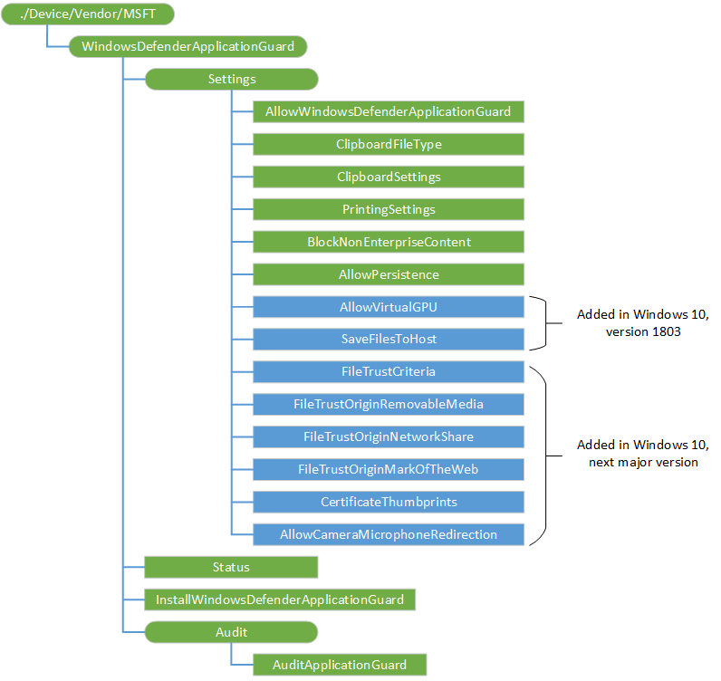

# WindowsDefenderApplicationGuard CSP

> [!WARNING]
> Some information relates to prereleased product which may be substantially modified before it's commercially released. Microsoft makes no warranties, express or implied, with respect to the information provided here.

The WindowsDefenderApplicationGuard configuration service provider (CSP) is used by the enterprise to configure the settings in Windows Defender Application Guard. This CSP was added in Windows 10, version 1709.

The following diagram shows the WindowsDefenderApplicationGuard configuration service provider in tree format.

**./Device/Vendor/MSFT/WindowsDefenderApplicationGuard**  
Root node. Supported operation is Get.

**Settings**  
Interior node. Supported operation is Get.

**Settings/AllowWindowsDefenderApplicationGuard**  
Turn on Windows Defender Application Guard in Enterprise Mode. Value type is integer. Supported operations are Add, Get, Replace, and Delete.

- 0 - Stops Application Guard in Enterprise Mode. Trying to access non-enterprise domains on the host will not automatically get transferred into the insolated environment.
- 1 - Enables Application Guard in Enterprise Mode. Trying to access non-enterprise websites on the host will automatically get transferred into the container. 

**Settings/ClipboardFileType**  
Determines the type of content that can be copied from the host to Application Guard environment and vice versa. Value type is integer. Supported operations are Add, Get, Replace, and Delete.

- 0 - Disables content copying. 
- 1 - Allow text copying.
- 2 - Allow image copying.
- 3 - Allow text and image copying.

**Settings/ClipboardSettings**  
This policy setting allows you to decide how the clipboard behaves while in Application Guard. Value type is integer. Supported operations are Add, Get, Replace, and Delete

- 0 (default) - Completely turns Off the clipboard functionality for the Application Guard.
- 1 - Turns On clipboard operation from an isolated session to the host
- 2 - Turns On clipboard operation from the host to an isolated session
- 3 - Turns On clipboard operation in both the directions

> [!IMPORTANT]
> Allowing copied content to go from Microsoft Edge into Application Guard can cause potential security risks and isn't recommended. 

**Settings/PrintingSettings**  
This policy setting allows you to decide how the print functionality behaves while in Application Guard. Value type is integer. Supported operations are Add, Get, Replace, and Delete.

- 0 - Disables all print functionality (default)
- 1 - Enables only XPS printing
- 2 - Enables only PDF printing
- 3 - Enables both PDF and XPS printing
- 4 - Enables only local printing
- 5 - Enables both local and XPS printing    - 6 - Enables both local and PDF printing
- 7 - Enables local, PDF, and XPS printing
- 8 - Enables only network printing
- 9 - Enables both network and XPS printing
- 10 - Enables both network and PDF printing
- 11 - Enables network, PDF, and XPS printing
- 12 - Enables both network and local printing
- 13 - Enables network, local, and XPS printing
- 14 - Enables network, local, and PDF printing
- 15 - Enables all printing

**Settings/BlockNonEnterpriseContent**  
This policy setting allows you to decide whether websites can load non-enterprise content in Microsoft Edge and Internet Explorer. Value type is integer. Supported operations are Add, Get, Replace, and Delete.

- 0 (default) -  Non-enterprise content embedded in enterprise sites is allowed to open outside of the Windows Defender Application Guard container, directly in Internet Explorer and Microsoft Edge..
- 1  - Non-enterprise content embedded on enterprise sites are stopped from opening in Internet Explorer or Microsoft Edge outside of Windows Defender Application Guard.

**Settings/AllowPersistence**  
This policy setting allows you to decide whether data should persist across different sessions in Application Guard. Value type is integer. Supported operations are Add, Get, Replace, and Delete.

- 0 - Application Guard discards user-downloaded files and other items (such as, cookies, Favorites, and so on) during machine restart or user log-off.
- 1 - Application Guard saves user-downloaded files and other items (such as, cookies, Favorites, and so on) for use in future Application Guard sessions.

**Settings/AllowVirtualGPU**  
Added in Windows 10, version 1803. This policy setting allows you to determine whether Application Guard can use the virtual GPU to process graphics. Supported operations are Add, Get, Replace, and Delete. Value type is integer.  

- 0 (default) - Cannot access the vGPU and uses the CPU to support rendering graphics. When the policy is not configured, it is the same as disabled (0).
- 1 - Turns on the functionality to access the vGPU offloading graphics rendering from the CPU. This can create a faster experience when working with graphics intense websites or watching video within the container. 

**Settings/SaveFilesToHost**  
Added in Windows 10, version 1803. This policy setting allows you to determine whether users can elect to download files from Edge in the container and persist files them from container to the host operating system. Supported operations are Add, Get, Replace, and Delete. Value type is integer. 

- 0 (default) - The user cannot download files from Edge in the container to the host file system. When the policy is not configured, it is the same as disabled (0).
- 1 - Turns on the functionality to allow users to download files from Edge in the container to the host file system.  

**Settings/FileTrustCriteria**  
Placeholder for future use. Do not use in production code.

**Settings/FileTrustOriginRemovableMedia**  
Placeholder for future use. Do not use in production code.

**Settings/FileTrustOriginNetworkShare**  
Placeholder for future use. Do not use in production code.

**Settings/FileTrustOriginMarkOfTheWeb**  
Placeholder for future use. Do not use in production code.

**Settings/CertificateThumbprints**  
Added in Windows 10, version 1809. This policy setting allows certain Root Certificates to  be shared with the Windows Defender Application Guard container. 

Value type is string. Supported operations are Add, Get, Replace, and Delete.

If you enable this setting, certificates with a thumbprint matching the ones specified will be transferred into the container. You can specify multiple certificates using a comma to separate the thumbprints for each certificate you want to transfer.

Example:  b4e72779a8a362c860c36a6461f31e3aa7e58c14,1b1d49f06d2a697a544a1059bd59a7b058cda924

If you disable or don’t configure this setting, certificates are not shared with the Windows Defender Application Guard container.

**Settings/AllowCameraMicrophoneRedirection**  
Added in Windows 10, version 1809. The policy allows you to determine whether applications inside Windows Defender Application Guard can access the device’s camera and microphone when these settings are enabled on the user’s device.

Value type is integer. Supported operations are Add, Get, Replace, and Delete.

If you enable this policy, applications inside Windows Defender Application Guard will be able to access the camera and microphone on the user’s device.

If you disable or don't configure this policy, applications inside Windows Defender Application Guard will be unable to access the camera and microphone on the user’s device.

> [!IMPORTANT]
> If you turn on this policy, a compromised container could bypass camera and microphone permissions and access the camera and microphone without the user's knowledge.  To prevent unauthorized access, we recommend that camera and microphone privacy settings be turned off on the user's device when they are not needed.

**Status**  
Returns bitmask that indicates status of Application Guard installation and pre-requisites on the device. Value type is integer. Supported operation is Get.

- Bit 0   - Set to 1 when	WDAG is enabled into enterprise manage mode
- Bit 1	- Set to 1 when	the client machine is Hyper-V capable
- Bit 2	- Set to 1 when	the client machine has a valid OS license and SKU 
- Bit 3	- Set to 1 when	WDAG installed on the client machine
- Bit 4	- Set to 1 when	required Network Isolation Policies are configured
- Bit 5	- Set to 1 when the client machine meets minimum hardware requirements

**InstallWindowsDefenderApplicationGuard**  
Initiates remote installation of Application Guard feature. Supported operations are Get and Execute.

- Install - Will initiate feature install
- Uninstall - Will initiate feature uninstall

**Audit**  
Interior node. Supported operation is Get

**Audit/AuditApplicationGuard**  
This policy setting allows you to decide whether auditing events can be collected from Application Guard. Value type in integer. Supported operations are Add, Get, Replace, and Delete.

- 0 (default) - - Audit event logs aren't collected for Application Guard.
- 1 - Application Guard inherits its auditing policies from Microsoft Edge and starts to audit system events specifically for Application Guard.
