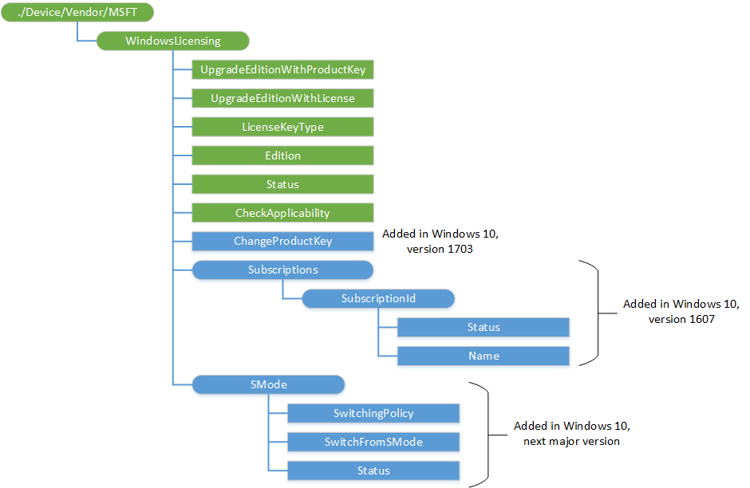

# WindowsLicensing CSP

The WindowsLicensing configuration service provider is designed for licensing related management scenarios. Currently the scope is limited to edition upgrades of Windows 10 desktop and mobile devices, such as Windows 10 Pro to Windows 10 Enterprise. In addition, this CSP provides the capability to activate or change the product key of Windows 10 desktop devices.

The following diagram shows the WindowsLicensing configuration service provider in tree format.



<a href="" id="--device-vendor-msft-windowslicensing"></a>**./Device/Vendor/MSFT/WindowsLicensing**  
This is the root node for the WindowsLicensing configuration service provider.

The supported operation is Get.

<a href="" id="upgradeeditionwithproductkey"></a>**UpgradeEditionWithProductKey**  
Enters a product key for an edition upgrade of Windows 10 desktop devices.

> [!NOTE]   
> This upgrade process requires a system restart.

 

The date type is a chr.

The supported operation is Exec.

When a product key is pushed from an MDM server to a user's device, **changepk.exe** runs using the product key. After it completes, a notification is shown to the user that a new edition of Windows 10 is available. The user can then restart their system manually or, after two hours, the device will restart automatically to complete the upgrade. The user will receive a reminder notification 10 minutes before the automatic restart.

After the device restarts, the edition upgrade process completes. The user will receive a notification of the successful upgrade.

> [!IMPORTANT]   
> If another policy requires a system reboot that occurs when **changepk.exe** is running, the edition upgrade will fail.

 

If a product key is entered in a provisioning package and the user begins installation of the package, a notification is shown to the user that their system will restart to complete the package installation. Upon explicit consent from the user to proceed, the package continues installation and **changepk.exe** runs using the product key. The user will receive a reminder notification 30 seconds before the automatic restart.

After the device restarts, the edition upgrade process completes. The user will receive a notification of the successful upgrade.

This node can also be used to activate or change a product key on a particular edition of Windows 10 desktop device by entering a product key. Activation or changing a product key does not require a reboot and is a silent process for the user.

> [!IMPORTANT]   
> The product key entered must be 29 characters (that is, it should include dashes), otherwise the activation, edition upgrade, or product key change on Windows 10 desktop devices will fail. The product key is acquired from Microsoft Volume Licensing Service Center. Your organization must have a Volume Licensing contract with Microsoft to access the portal.

 

The following are valid edition upgrade paths when using this node through an MDM:

-   Windows 10 Enterprise to Windows 10 Education
-   Windows 10 Home to Windows 10 Education
-   Windows 10 Pro to Windows 10 Education
-   Windows 10 Pro to Windows 10 Enterprise

Activation or changing a product key can be carried out on the following editions:

-   Windows 10 Education
-   Windows 10 Enterprise
-   Windows 10 Home
-   Windows 10 Pro

<a href="" id="edition"></a>**Edition**  
Returns a value that maps to the Windows 10 edition running on desktop or mobile devices. Take the value, convert it into its hexadecimal equivalent and search the GetProductInfo function page on MSDN for edition information.

The data type is an Int.

The supported operation is Get.

<a href="" id="status"></a>**Status**  
Returns the status of an edition upgrade on Windows 10 desktop or mobile devices. The status corresponds to one of the following values:

-   0 = Failed
-   1 = Pending
-   2 = In progress
-   3 = Completed
-   4 = Unknown

The data type is an Int.

The supported operation is Get.

<a href="" id="upgradeeditionwithlicense"></a>**UpgradeEditionWithLicense**  
Provides a license for an edition upgrade of Windows 10 mobile devices.

> [!NOTE]   
> This upgrade process does not require a system restart.

 

The date type is XML.

The supported operation is Execute.

> [!IMPORTANT]   
> The XML license file contents must be properly escaped (that is, it should not simply be a copied XML), otherwise the edition upgrade on Windows 10 mobile devices will fail. For more information on proper escaping of the XML license file, see Section 2.4 of the [W3C XML spec](http://www.w3.org/TR/xml/) . The XML license file is acquired from the Microsoft Volume Licensing Service Center. Your organization must have a Volume Licensing contract with Microsoft to access the portal.

 

The following are valid edition upgrade paths when using this node through an MDM or provisioning package:

-   Windows 10 Mobile to Windows 10 Mobile Enterprise

> [!Warning]
> Edition upgrades do not support Volume Licence (VL) keys.

<a href="" id="licensekeytype"></a>**LicenseKeyType**  
Returns the parameter type used by Windows 10 devices for an edition upgrade, activation, or product key change.

-   Windows 10 for desktop devices require a product key.
-   Windows 10 Mobile devices require a XML license file for an edition upgrade.

The data type is a chr.

The supported operation is Get.

<a href="" id="checkapplicability"></a>**CheckApplicability**  
Returns TRUE if the entered product key can be used for an edition upgrade, activation or changing a product key of Windows 10 for desktop devices.

The data type is a chr.

The supported operation is Exec.

<a href="" id="changeproductkey"></a>**ChangeProductKey**  
Added in Windows 10, version 1703. Installs a product key for Windows 10 desktop devices. Does not reboot.

The data type is a chr.

The supported operation is Execute.

<a href="" id="subscriptions"></a>**Subscriptions**  
Added in Windows 10, version 1607. Node for subscriptions.

<a href="" id="subscriptions-subscriptionid"></a>**Subscriptions/SubscriptionId**  
Added in Windows 10, version 1607. Node for subscription IDs.

<a href="" id="subscriptions-subscriptionid-status"></a>**Subscriptions/SubscriptionId/Status**  
Added in Windows 10, version 1607. Returns the status of the subscription.

The data type is an Int.

The supported operation is Get.

<a href="" id="subscriptions-subscriptionid-name"></a>**Subscriptions/SubscriptionId/Name**  
Added in Windows 10, version 1607. Returns the name of the subscription.

The data type is a chr.

The supported operation is Get.


## SyncML examples


**CheckApplicability**

``` syntax
<SyncML xmlns="SYNCML:SYNCML1.2">
  <SyncBody>
    <Exec>
    <CmdID>$CmdID$</CmdID>
    <Item>
      <Target>
        <LocURI>./Device/Vendor/MSFT/WindowsLicensing/CheckApplicability</LocURI>
      </Target>
      <Meta>
        <Format xmlns="syncml:metinf">chr</Format>
      </Meta>
      <Data>XXXXX-XXXXX-XXXXX-XXXXX-XXXXX</Data> 
    </Item>
   </Exec>
   <Final/>
  </SyncBody>
</SyncML>
```

> [!NOTE]   
> `XXXXX-XXXXX-XXXXX-XXXXX-XXXXX` in the **Data** tag should be replaced with your product key.

 

**Edition**

``` syntax
<SyncML xmlns="SYNCML:SYNCML1.2">
  <SyncBody>
    <Get>
      <CmdID>$CmdID$</CmdID>
        <Item>
          <Target>
            <LocURI>./Device/Vendor/MSFT/WindowsLicensing/Edition</LocURI>
          </Target>
        </Item>
    </Get>
    <Final/>
  </SyncBody>
</SyncML>
```

**LicenseKeyType**

``` syntax
<SyncML xmlns="SYNCML:SYNCML1.2">
  <SyncBody>
    <Get>
      <CmdID>$CmdID$</CmdID>
        <Item>
          <Target>
            <LocURI>./Device/Vendor/MSFT/WindowsLicensing/LicenseKeyType</LocURI>
          </Target>
        </Item>
    </Get>
    <Final/>
  </SyncBody>
</SyncML>
```

**Status**

``` syntax
<SyncML xmlns="SYNCML:SYNCML1.2">
  <SyncBody>
    <Get>
      <CmdID>$CmdID$</CmdID>
        <Item>
          <Target>
            <LocURI>./Device/Vendor/MSFT/WindowsLicensing/Status</LocURI>
          </Target>
        </Item>
    </Get>
    <Final/>
  </SyncBody>
</SyncML>
```

**UpgradeEditionWithProductKey**

``` syntax
<SyncML xmlns="SYNCML:SYNCML1.2">
  <SyncBody>
    <Exec>
    <CmdID>$CmdID$</CmdID>
    <Item>
      <Target>
        <LocURI>./Device/Vendor/MSFT/WindowsLicensing/UpgradeEditionWithProductKey</LocURI>
      </Target>
      <Meta>
        <Format xmlns="syncml:metinf">chr</Format>
      </Meta>
      <Data>XXXXX-XXXXX-XXXXX-XXXXX-XXXXX</Data> 
    </Item>
   </Exec>
   <Final/>
  </SyncBody>
</SyncML>
```

> [!NOTE]   
> `XXXXX-XXXXX-XXXXX-XXXXX-XXXXX` in the **Data** tag should be replaced with your product key.

 

**UpgradeEditionWithLicense**

``` syntax
<SyncML xmlns="SYNCML:SYNCML1.2">
  <SyncBody>
    <Exec>
      <CmdID>$CmdID$</CmdID>
      <Item>
        <Target>
          <LocURI>./Device/Vendor/MSFT/WindowsLicensing/UpgradeEditionWithLicense</LocURI>
        </Target>
        <Meta>
          <Format xmlns="syncml:metinf">chr</Format>
        </Meta>
        <Data><!-- XML ENCODED LICENSE GOES HERE --></Data>
      </Item>
    </Exec>
    <Final/>
  </SyncBody>
</SyncML>
```

## Related topics


[Configuration service provider reference](configuration-service-provider-reference.md)

 

 


