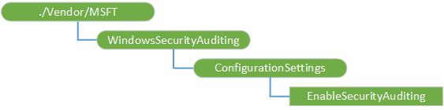

# WindowsSecurityAuditing CSP


The WindowsSecurityAuditing configuration service provider (CSP) is used to enable logging of security audit events. This CSP was added in Windows 10, version 1511 for Mobile and Mobile Enterprise. Make sure to consult the [Configuration service provider reference](https://docs.microsoft.com/windows/client-management/mdm/configuration-service-provider-reference) to see if this CSP and others are supported on your Windows installation.

The following diagram shows the WindowsSecurityAuditing configuration service provider in tree format.



<a href="" id="windowssecurityauditing"></a>**WindowsSecurityAuditing**  
Root node.

<a href="" id="configurationsettings"></a>**ConfigurationSettings**  
Interior node for handling all the audit configuration settings. Do not use the Get operation in this node. It is only used of grouping configuration settings.

<a href="" id="configurationsettings-enablesecurityauditing"></a>**ConfigurationSettings/EnableSecurityAuditing**  
Specifies whether to enable or disable auditing for the device.

Value type is boolean. If true, a default set of audit events will be captured to a log file for upload; if false, auditing is disabled and events are not logged. Default value is false.

Supported operations are Get and Replace.

## Examples


Enable logging of audit events.

``` syntax
<SyncML xmlns="SYNCML:SYNCML1.2">
  <SyncBody>
    <Replace>
      <CmdID>1</CmdID>
      <Item>
        <Target>
          <LocURI>
            ./Vendor/MSFT/WindowsSecurityAuditing/ConfigurationSettings/EnableSecurityAuditing
          </LocURI>
        </Target>
        <Meta>
          <Format xmlns="syncml:metinf">bool</Format>
          <Type>text/plain</Type>
        </Meta>
        <Data>true</Data>
      </Item>
    </Replace>
    <Final/> 
  </SyncBody>
</SyncML>
```

For more information about Windows security auditing, see [What's new in security auditing](https://technet.microsoft.com/itpro/windows/whats-new/security-auditing).

 

 


