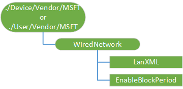

# WiredNetwork CSP 

> [!WARNING]
> Some information relates to prereleased product which may be substantially modified before it's commercially released. Microsoft makes no warranties, express or implied, with respect to the information provided here.

The WiredNetwork configuration service provider (CSP) is used by the enterprise to configure wired Internet on devices that do not have GP to enable them to access corporate Internet over ethernet. This CSP was added in Windows 10, version 1809.

The following diagram shows the WiredNetwork configuration service provider in tree format.

 

**./Device/Vendor/MSFT/WiredNetwork**  
Root node.

**LanXML**  
Optional. XML describing the wired network configuration and follows the LAN_profile schemas https://msdn.microsoft.com/library/windows/desktop/aa816366(v=vs.85).aspx.

Supported operations are Add, Get, Replace, and Delete. Value type is string.

**EnableBlockPeriod**  
 Optional. Enable block period (minutes), used to specify the duration for which automatic authentication attempts will be blocked from occurring after a failed authentication attempt.

Supported operations are Add, Get, Replace, and Delete. Value type is integer.
