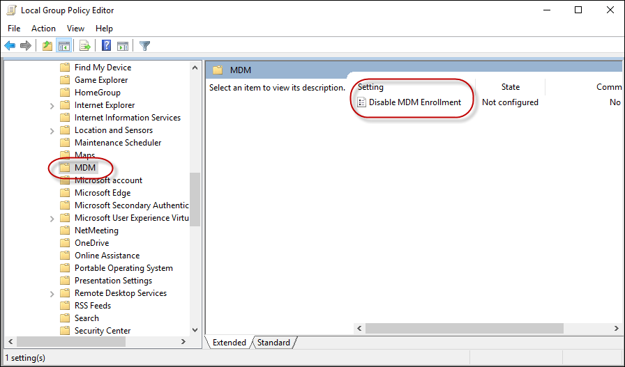

# Mobile device enrollment

Mobile device enrollment is the first phase of enterprise management. The device is configured to communicate with the MDM server using security precautions during the enrollment process. The enrollment service verifies that only authenticated and authorized devices are managed by the enterprise.

The enrollment process includes the following steps:

1. **Discovery of the enrollment endpoint**: This step provides the enrollment endpoint configuration settings.
1. **Certificate installation**: This step handles user authentication, certificate generation, and certificate installation. The installed certificates will be used in the future to manage client/server (TLS/SSL) mutual authentication.
1. **DM Client provisioning**: This step configures the Device Management (DM) client to connect to a Mobile Device Management (MDM) server after enrollment via DM SyncML over HTTPS (also known as Open Mobile Alliance Device Management (OMA DM) XML).

## Enrollment protocol

There are many changes made to the enrollment protocol to better support various scenarios across all platforms. For detailed information about the mobile device enrollment protocol, see:

- [[MS-MDM]: Mobile Device Management Protocol](/openspecs/windows_protocols/ms-mdm/33769a92-ac31-47ef-ae7b-dc8501f7104f).
- [[MS-MDE2]: Mobile Device Enrollment Protocol Version 2]( https://go.microsoft.com/fwlink/p/?LinkId=619347).

The enrollment process involves the following steps:

### Discovery request

The discovery request is a simple HTTP post call that returns XML over HTTP. The returned XML includes the authentication URL, the management service URL, and the user credential type.

### Certificate enrollment policy

The certificate enrollment policy configuration is an implementation of the MS-XCEP protocol, which is described in [MS-XCEP]: X.509 Certificate Enrollment Policy Protocol Specification. Section 4 of the specification provides an example of the policy request and response. The X.509 Certificate Enrollment Policy Protocol is a minimal messaging protocol that includes a single client request message (GetPolicies) with a matching server response message (GetPoliciesResponse).

For more information, see [\[MS-XCEP\]: X.509 Certificate Enrollment Policy Protocol](/openspecs/windows_protocols/ms-xcep/08ec4475-32c2-457d-8c27-5a176660a210)

### Certificate enrollment

The certificate enrollment is an implementation of the MS-WSTEP protocol.

### Management configuration

The server sends provisioning XML that contains a server certificate (for TLS/SSL server authentication), a client certificate issued by enterprise CA, DMClient bootstrap information (for the client to communicate with the management server), an enterprise application token (for the user to install enterprise applications), and the link to download the Company Hub application.

The following articles describe the end-to-end enrollment process using various authentication methods:

- [Federated authentication device enrollment](federated-authentication-device-enrollment.md)
- [Certificate authentication device enrollment](certificate-authentication-device-enrollment.md)
- [On-premises authentication device enrollment](on-premise-authentication-device-enrollment.md)

> [!NOTE]
> As a best practice, don't use hardcoded server-side checks on values such as:
>
> - User agent string
> - Any fixed URIs that are passed during enrollment
> - Specific formatting of any value unless otherwise noted, such as the format of the device ID.

## Enrollment support for domain-joined devices

Devices that are joined to an on-premises Active Directory can enroll into MDM via **Settings** > **Access work or school**. However, the enrollment can only target the user enrolled with user-specific policies. Device targeted policies continue to target all users of the device.

## Enrollment scenarios not supported

The following scenarios don't allow MDM enrollments:

- Built-in administrator accounts on Windows desktop can't enroll into MDM.
- Standard users can't enroll in MDM. Only admin users can enroll.

## Disable MDM enrollments

IT admin can disable MDM enrollments for domain-joined PCs using the **Disable MDM Enrollment** group policy.

Group Policy Path: **Computer configuration** > **Administrative Templates** > **Windows Components** > **MDM** > **Disable MDM Enrollment**.
Corresponding registry key: `HKLM\SOFTWARE\Policies\Microsoft\Windows\CurrentVersion\MDM\DisableRegistration (REG_DWORD)`



## Enrollment error messages

The enrollment server can decline enrollment messages using the SOAP Fault format. Errors created can be sent as follows:

```xml
<s:envelope xmlns:s="http://www.w3.org/2003/05/soap-envelope" xmlns:a="http://www.w3.org/2005/08/addressing">
    <s:header>
        <a:action s:mustunderstand="1">http://schemas.microsoft.com/windows/pki/2009/01/enrollment/rstrc/wstep</a:action>
        <activityid correlationid="2493ee37-beeb-4cb9-833c-cadde9067645" xmlns="http://schemas.microsoft.com/2004/09/servicemodel/diagnostics">2493ee37-beeb-4cb9-833c-cadde9067645</activityid>
        <a:relatesto>urn:uuid:urn:uuid:0d5a1441-5891-453b-becf-a2e5f6ea3749</a:relatesto>
    </s:header>
    <s:body>
        <s:fault>
            <s:code>
                <s:value>s:receiver</s:value>
                <s:subcode>
                    <s:value>s:authorization</s:value>
                </s:subcode>
            </s:code>
            <s:reason>
                <s:text xml:lang="en-us">This User is not authorized to enroll</s:text>
            </s:reason>
        </s:fault>
    </s:body>
</s:envelope>
```

**Sample error messages**:

| Namespace | Subcode              | Error                                     | Description                                                                                                                                          | HRESULT  |
|-----------|----------------------|-------------------------------------------|------------------------------------------------------------------------------------------------------------------------------------------------------|----------|
| s:        | MessageFormat        | MENROLL_E_DEVICE_MESSAGE_FORMAT_ERROR     | Invalid message from the Mobile Device Management (MDM) server.                                                                                      | 80180001 |
| s:        | Authentication       | MENROLL_E_DEVICE_AUTHENTICATION_ERROR     | The Mobile Device Management (MDM) server failed to authenticate the user. Try again or contact your system administrator.                           | 80180002 |
| s:        | Authorization        | MENROLL_E_DEVICE_AUTHORIZATION_ERROR      | The user isn't authorized to enroll to Mobile Device Management (MDM). Try again or contact your system administrator.                               | 80180003 |
| s:        | CertificateRequest   | MENROLL_E_DEVICE_CERTIFICATEREQUEST_ERROR | The user has no permission for the certificate template or the certificate authority is unreachable. Try again or contact your system administrator. | 80180004 |
| s:        | EnrollmentServer     | MENROLL_E_DEVICE_CONFIGMGRSERVER_ERROR    | The Mobile Device Management (MDM) server encountered an error. Try again or contact your system administrator.                                      | 80180005 |
| a:        | InternalServiceFault | MENROLL_E_DEVICE_INTERNALSERVICE_ERROR    | There was an unhandled exception on the Mobile Device Management (MDM) server. Try again or contact your system administrator.                       | 80180006 |
| a:        | InvalidSecurity      | MENROLL_E_DEVICE_INVALIDSECURITY_ERROR    | The Mobile Device Management (MDM) server wasn't able to validate your account. Try again or contact your system administrator.                     | 80180007 |

SOAP format also includes `deviceenrollmentserviceerror` element. Here's an example:

```xml
<s:envelope xmlns:s="http://www.w3.org/2003/05/soap-envelope" xmlns:a="http://www.w3.org/2005/08/addressing">
    <s:header>
        <a:action s:mustunderstand="1">http://schemas.microsoft.com/windows/pki/2009/01/enrollment/rstrc/wstep</a:action>
        <activityid correlationid="2493ee37-beeb-4cb9-833c-cadde9067645" xmlns="http://schemas.microsoft.com/2004/09/servicemodel/diagnostics">2493ee37-beeb-4cb9-833c-cadde9067645</activityid>
        <a:relatesto>urn:uuid:urn:uuid:0d5a1441-5891-453b-becf-a2e5f6ea3749</a:relatesto>
    </s:header>
    <s:body>
        <s:fault>
            <s:code>
                <s:value>s:receiver</s:value>
                <s:subcode>
                    <s:value>s:authorization</s:value>
                </s:subcode>
            </s:code>
            <s:reason>
                <s:text xml:lang="en-us">device cap reached</s:text>
            </s:reason>
            <s:detail>
                <deviceenrollmentserviceerror xmlns="http://schemas.microsoft.com/windows/pki/2009/01/enrollment">
                    <errortype>devicecapreached</errortype>
                    <message>device cap reached</message>
                    <traceid>2493ee37-beeb-4cb9-833c-cadde9067645</traceid>
                </deviceenrollmentserviceerror>
            </s:detail>
        </s:fault>
    </s:body>
</s:envelope>
```

**Sample error messages**:

| Subcode               | Error                           | Description                                                                                                                                                | HRESULT  |
|-----------------------|---------------------------------|------------------------------------------------------------------------------------------------------------------------------------------------------------|----------|
| DeviceCapReached      | MENROLL_E_DEVICECAPREACHED      | The account has too many devices enrolled to Mobile Device Management (MDM). Delete or unenroll old devices to fix this error.                             | 80180013 |
| DeviceNotSupported    | MENROLL_E_DEVICENOTSUPPORTED    | The Mobile Device Management (MDM) server doesn't support this platform or version, consider upgrading your device.                                        | 80180014 |
| NotSupported          | MENROLL_E_NOT_SUPPORTED         | Mobile Device Management (MDM) is generally not supported for this device.                                                                                 | 80180015 |
| NotEligibleToRenew    | MENROLL_E_NOTELIGIBLETORENEW    | The device is attempting to renew the Mobile Device Management (MDM) certificate, but the server rejected the request. Check renew schedule on the device. | 80180016 |
| InMaintenance         | MENROLL_E_INMAINTENANCE         | The Mobile Device Management (MDM) server states your account is in maintenance, try again later.                                                          | 80180017 |
| UserLicense           | MENROLL_E_USER_LICENSE          | There was an error with your Mobile Device Management (MDM) user license. Contact your system administrator.                                               | 80180018 |
| InvalidEnrollmentData | MENROLL_E_ENROLLMENTDATAINVALID | The Mobile Device Management (MDM) server rejected the enrollment data. The server may not be configured correctly.                                        | 80180019 |

TraceID is a freeform text node that is logged. It should identify the server side state for this enrollment attempt. This information may be used by support to look up why the server declined the enrollment.

## Related articles

- [MDM enrollment of Windows-based devices](mdm-enrollment-of-windows-devices.md)
- [Federated authentication device enrollment](federated-authentication-device-enrollment.md)
- [Certificate authentication device enrollment](certificate-authentication-device-enrollment.md)
- [On-premises authentication device enrollment](on-premise-authentication-device-enrollment.md)
