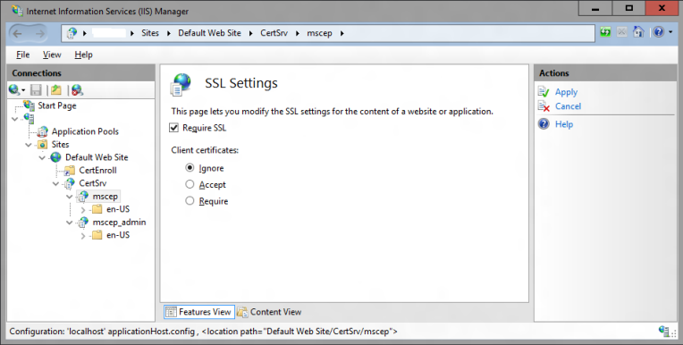

# What's new in mobile device enrollment and management

This article provides information about what's new in Windows 10 and Windows 11 mobile device management (MDM) enrollment and management experience across all Windows 10 and Windows 11 devices. This article also provides details about the breaking changes and known issues and frequently asked questions.

For details about Microsoft mobile device management protocols for Windows 10 and Windows 11, see [\[MS-MDM\]: Mobile Device Management Protocol](/openspecs/windows_protocols/ms-mdm/33769a92-ac31-47ef-ae7b-dc8501f7104f) and [\[MS-MDE2\]: Mobile Device Enrollment Protocol Version 2]( https://go.microsoft.com/fwlink/p/?LinkId=619347).

## What's new in MDM for Windows 11, version 22H2

| New or updated article | Description |
|--|--|
| [DeviceStatus](mdm/devicestatus-csp.md) | Added the following node:<br><li>MDMClientCertAttestation |
| [eUUICs](mdm/euiccs-csp.md) | Added the following node:<br><li>IsDiscoveryServer |
| [PersonalDataEncryption](mdm/personaldataencryption-csp.md) | New CSP |
| [Policy CSP](mdm/policy-configuration-service-provider.md) | Added the following nodes:<br><li>Accounts/RestrictToEnterpriseDeviceAuthenticationOnly<br><li>DesktopAppInstaller/EnableAdditionalSources<br><li>DesktopAppInstaller/EnableAllowedSources<br><li>DesktopAppInstaller/EnableAppInstaller<br><li>DesktopAppInstaller/EnableDefaultSource<br><li>DesktopAppInstaller/EnableExperimentalFeatures<br><li>DesktopAppInstaller/EnableHashOverride<br><li>DesktopAppInstaller/EnableLocalManifestFiles<br><li>DesktopAppInstaller/EnableMicrosoftStoreSource<br><li>DesktopAppInstaller/EnableMSAppInstallerProtocol<br><li>DesktopAppInstaller/EnableSettings<br><li>DesktopAppInstaller/SourceAutoUpdateInterval<br><li>Education/EnableEduThemes<br><li>Experience/AllowSpotlightCollectionOnDesktop<br><li>FileExplorer/DisableGraphRecentItems<br><li>HumanPresence/ForceInstantDim<br><li>InternetExplorer/EnableGlobalWindowListInIEMode<br><li>InternetExplorer/HideIEAppRetirementNotification<br><li>InternetExplorer/ResetZoomForDialogInIEMode<br><li>LocalSecurityAuthority/AllowCustomSSPsAPs<br><li>LocalSecurityAuthority/ConfigureLsaProtectedProcess<br><li>MixedReality/AllowCaptivePortalBeforeLogon<br><li>MixedReality/AllowLaunchUriInSingleAppKiosk<br><li>MixedReality/AutoLogonUser<br><li>MixedReality/ConfigureMovingPlatform<br><li>MixedReality/ConfigureNtpClient<br><li>MixedReality/ManualDownDirectionDisabled<br><li>MixedReality/NtpClientEnabled<br><li>MixedReality/SkipCalibrationDuringSetup<br><li>MixedReality/SkipTrainingDuringSetup<br><li>NetworkListManager/AllowedTlsAuthenticationEndpoints<br><li>NetworkListManager/ConfiguredTLSAuthenticationNetworkName<br><li>Printers/ConfigureCopyFilesPolicy<br><li>Printers/ConfigureDriverValidationLevel<br><li>Printers/ConfigureIppPageCountsPolicy<br><li>Printers/ConfigureRedirectionGuard<br><li>Printers/ConfigureRpcConnectionPolicy<br><li>Printers/ConfigureRpcListenerPolicy<br><li>Printers/ConfigureRpcTcpPort<br><li>Printers/ManageDriverExclusionList<br><li>Printers/RestrictDriverInstallationToAdministrators<br><li>RemoteDesktopServices/DoNotAllowWebAuthnRedirection<br><li>Search/AllowSearchHighlights<br><li>Search/DisableSearch<br><li>SharedPC/EnabledSharedPCModeWithOneDriveSync<br><li>Start/DisableControlCenter<br><li>Start/DisableEditingQuickSettings<br><li>Start/HideRecommendedSection<br><li>Start/HideTaskViewButton<br><li>Start/SimplifyQuickSettings<br><li>Stickers/EnableStickers<br><li>Textinput/allowimenetworkaccess<br><li>Update/NoUpdateNotificationDuringActiveHours<br><li>WebThreatDefense/EnableService<br><li>WebThreatDefense/NotifyMalicious<br><li>WebThreatDefense/NotifyPasswordReuse<br><li>WebThreatDefense/NotifyUnsafeApp<br><li>Windowslogon/EnableMPRNotifications |
| [SecureAssessment](mdm/secureassessment-csp.md) | Added the following node:<br><li>Asssessments |
| [WindowsAutopilot](mdm/windowsautopilot-csp.md) | Added the following node:<br><li>HardwareMismatchRemediationData |

## What's new in MDM for Windows 11, version 21H2

| New or updated article | Description |
|--|--|
| [Policy CSP](mdm/policy-configuration-service-provider.md) |  Added the following nodes:<br><li>Kerberos/PKInitHashAlgorithmConfiguration<br><li>Kerberos/PKInitHashAlgorithmSHA1<br><li>Kerberos/PKInitHashAlgorithmSHA256<br><li>Kerberos/PKInitHashAlgorithmSHA384<br><li>Kerberos/PKInitHashAlgorithmSHA512<br><li>NewsAndInterests/AllowNewsAndInterests<br><li>Experiences/ConfigureChatIcon<br><li>Start/ConfigureStartPins<br><li>Virtualizationbasedtechnology/HypervisorEnforcedCodeIntegrity<br><li>Virtualizationbasedtechnology/RequireUEFIMemoryAttributesTable |
| [DMClient CSP](mdm/dmclient-csp.md) | Updated the description of the following nodes:<br><li>Provider/ProviderID/ConfigLock/Lock<br><li>Provider/ProviderID/ConfigLock/UnlockDuration<br><li>Provider/ProviderID/ConfigLock/SecuredCore |
| [PrinterProvisioning](mdm/universalprint-csp.md) | New CSP |

## What's new in MDM for Windows 10, version 20H2

|New or updated article|Description|
|-----|-----|
| [Policy CSP](mdm/policy-configuration-service-provider.md) |  Added the following nodes:<br><li>Experience/DisableCloudOptimizedContent<br><li>LocalUsersAndGroups/Configure<br><li>MixedReality/AADGroupMembershipCacheValidityInDays<br><li>MixedReality/BrightnessButtonDisabled<br><li>MixedReality/FallbackDiagnostics<br><li>MixedReality/MicrophoneDisabled<br><li>MixedReality/VolumeButtonDisabled<br><li>Multitasking/BrowserAltTabBlowout|
| [SurfaceHub CSP](mdm/surfacehub-csp.md) | Added the following new node:<br><li>Properties/SleepMode |
| [WindowsDefenderApplicationGuard CSP](mdm/windowsdefenderapplicationguard-csp.md) | Updated the description of the following node:<br><li>Settings/AllowWindowsDefenderApplicationGuard |

## What's new in MDM for Windows 10, version 2004

| New or updated article | Description |
|-----|-----|
| [Policy CSP](mdm/policy-configuration-service-provider.md) |  Added the following nodes:<br><li>ApplicationManagement/BlockNonAdminUserInstall<br><li>Bluetooth/SetMinimumEncryptionKeySize<br><li>DeliveryOptimization/DOCacheHostSource<br><li>DeliveryOptimization/DOMaxBackgroundDownloadBandwidth<br><li>DeliveryOptimization/DOMaxForegroundDownloadBandwidth<br><li>Education/AllowGraphingCalculator<br><li>TextInput/ConfigureJapaneseIMEVersion<br><li>TextInput/ConfigureSimplifiedChineseIMEVersion<br><li>TextInput/ConfigureTraditionalChineseIMEVersion<br><br>Updated the following policy in Windows 10, version 2004:<br><li>DeliveryOptimization/DOCacheHost<br><br>Deprecated the following policies in Windows 10, version 2004:<br><li>DeliveryOptimization/DOMaxDownloadBandwidth<br><li>DeliveryOptimization/DOMaxUploadBandwidth<br><li>DeliveryOptimization/DOPercentageMaxDownloadBandwidth |
| [DevDetail CSP](mdm/devdetail-csp.md) | Added the following new node:<br><li>Ext/Microsoft/DNSComputerName |
| [EnterpriseModernAppManagement CSP](mdm/enterprisemodernappmanagement-csp.md) | Added the following node:<br><li>IsStub |
| [SUPL CSP](mdm/supl-csp.md) | Added the following node:<br><li>FullVersion |

## What's new in MDM for Windows 10, version 1909

| New or updated article | Description |
|-----|-----|
| [BitLocker CSP](mdm/bitlocker-csp.md) | Added the following nodes:<br><li>ConfigureRecoveryPasswordRotation<br><li>RotateRecoveryPasswords<br><li>RotateRecoveryPasswordsStatus<br><li>RotateRecoveryPasswordsRequestID|

## What's new in MDM for Windows 10, version 1903

| New or updated article | Description |
|-----|-----|
|[Policy CSP](mdm/policy-configuration-service-provider.md) | Added the following nodes:<br><li>DeliveryOptimization/DODelayCacheServerFallbackBackground<br><li>DeliveryOptimization/DODelayCacheServerFallbackForeground<br><li>DeviceHealthMonitoring/AllowDeviceHealthMonitoring<br><li>DeviceHealthMonitoring/ConfigDeviceHealthMonitoringScope<br><li>DeviceHealthMonitoring/ConfigDeviceHealthMonitoringUploadDestination<br><li>DeviceInstallation/AllowInstallationOfMatchingDeviceInstanceIDs<br><li>DeviceInstallation/PreventInstallationOfMatchingDeviceInstanceIDs<br><li>Experience/ShowLockOnUserTile<br><li>InternetExplorer/AllowEnhancedSuggestionsInAddressBar<br><li>InternetExplorer/DisableActiveXVersionListAutoDownload<br><li>InternetExplorer/DisableCompatView<br><li>InternetExplorer/DisableFeedsBackgroundSync<br><li>InternetExplorer/DisableGeolocation<br><li>InternetExplorer/DisableWebAddressAutoComplete<br><li>InternetExplorer/NewTabDefaultPage<br><li>Power/EnergySaverBatteryThresholdOnBattery<br><li>Power/EnergySaverBatteryThresholdPluggedIn<br><li>Power/SelectLidCloseActionOnBatterybr><li>Power/SelectLidCloseActionPluggedIn<br><li>Power/SelectPowerButtonActionOnBattery<br><li>Power/SelectPowerButtonActionPluggedIn<br><li>Power/SelectSleepButtonActionOnBattery<br><li>Power/SelectSleepButtonActionPluggedIn<br><li>Power/TurnOffHybridSleepOnBattery<br><li>Power/TurnOffHybridSleepPluggedIn<br><li>Power/UnattendedSleepTimeoutOnBattery<br><li>Power/UnattendedSleepTimeoutPluggedIn<br><li>Privacy/LetAppsActivateWithVoice<br><li>Privacy/LetAppsActivateWithVoiceAboveLock<br><li>Search/AllowFindMyFiles<br><li>ServiceControlManager/SvchostProcessMitigation<br><li>System/AllowCommercialDataPipelinebr><li>System/TurnOffFileHistory<br><li>TimeLanguageSettings/ConfigureTimeZonebr><li>Troubleshooting/AllowRecommendations<br><li>Update/AutomaticMaintenanceWakeUp<br><li>Update/ConfigureDeadlineForFeatureUpdates<br><li>Update/ConfigureDeadlineForQualityUpdates<br><li>Update/ConfigureDeadlineGracePeriod<br><li>WindowsLogon/AllowAutomaticRestartSignOn<br><li>WindowsLogon/ConfigAutomaticRestartSignOn<br><li>WindowsLogon/EnableFirstLogonAnimation|
| [Policy CSP - Audit](mdm/policy-csp-audit.md) | Added the new Audit policy CSP. |
| [ApplicationControl CSP](mdm/applicationcontrol-csp.md) | Added the new CSP. |
| [Defender CSP](mdm/defender-csp.md) | Added the following new nodes:<br><li>Health/TamperProtectionEnabled<br><li>Health/IsVirtualMachine<br><li>Configuration<br><li>Configuration/TamperProtection<br><li>Configuration/EnableFileHashComputation |
| [DiagnosticLog CSP](mdm/diagnosticlog-csp.md) <br> [DiagnosticLog DDF](mdm/diagnosticlog-ddf.md) | Added version 1.4 of the CSP in Windows 10, version 1903. <br>Added the new 1.4 version of the DDF. <br>Added the following new nodes:<br><li>Policy<br><li>Policy/Channels<br><li>Policy/Channels/ChannelName<br><li>Policy/Channels/ChannelName/MaximumFileSize<br><li>Policy/Channels/ChannelName/SDDL<br><li>Policy/Channels/ChannelName/ActionWhenFull<br><li>Policy/Channels/ChannelName/Enabled<br><li>DiagnosticArchive<br><li>DiagnosticArchive/ArchiveDefinition<br><li>DiagnosticArchive/ArchiveResults |
| [EnrollmentStatusTracking CSP](mdm/enrollmentstatustracking-csp.md) | Added the new CSP. |
| [PassportForWork CSP](mdm/passportforwork-csp.md) | Added the following new nodes:<br><li>SecurityKey<br><li>SecurityKey/UseSecurityKeyForSignin |


## What's new in MDM for Windows 10, version 1809

| New or updated article | Description |
|-----|-----|
|[Policy CSP](mdm/policy-configuration-service-provider.md) |  Added the following nodes:<br><li>ApplicationManagement/LaunchAppAfterLogOn<br><li>ApplicationManagement/ScheduleForceRestartForUpdateFailures<br><li>Authentication/EnableFastFirstSignIn (Preview mode only<br><li>Authentication/EnableWebSignIn (Preview mode only<br><li>Authentication/PreferredAadTenantDomainName<br><li>Browser/AllowFullScreenMode<br><li>Browser/AllowPrelaunch<br><li>Browser/AllowPrinting<br><li>Browser/AllowSavingHistory<br><li>Browser/AllowSideloadingOfExtensions<br><li>Browser/AllowTabPreloading<br><li>Browser/AllowWebContentOnNewTabPage<br><li>Browser/ConfigureFavoritesBar<br><li>Browser/ConfigureHomeButton<br><li>Browser/ConfigureKioskMode<br><li>Browser/ConfigureKioskResetAfterIdleTimeout<br><li>Browser/ConfigureOpenMicrosoftEdgeWith<br><li>Browser/ConfigureTelemetryForMicrosoft365Analytics<br><li>Browser/PreventCertErrorOverrides<br><li>Browser/SetHomeButtonURL<br><li>Browser/SetNewTabPageURL<br><li>Browser/UnlockHomeButton<br><li>Defender/CheckForSignaturesBeforeRunningScan<br><li>Defender/DisableCatchupFullScan<br><li>Defender/DisableCatchupQuickScan<br><li>Defender/EnableLowCPUPriority<br><li>Defender/SignatureUpdateFallbackOrder<br><li>Defender/SignatureUpdateFileSharesSources<br><li>DeviceGuard/ConfigureSystemGuardLaunch<br><li>DeviceInstallation/AllowInstallationOfMatchingDeviceIDs<br><li>DeviceInstallation/AllowInstallationOfMatchingDeviceSetupClasses<br><li>DeviceInstallation/PreventDeviceMetadataFromNetwork<br><li>DeviceInstallation/PreventInstallationOfDevicesNotDescribedByOtherPolicySettings<br><li>DmaGuard/DeviceEnumerationPolicy<br><li>Experience/AllowClipboardHistory<br><li>Experience/DoNotSyncBrowserSettings<br><li>Experience/PreventUsersFromTurningOnBrowserSyncing<br><li>Kerberos/UPNNameHints<br><li>Privacy/AllowCrossDeviceClipboard<br><li>Privacy/DisablePrivacyExperience<br><li>Privacy/UploadUserActivities<br><li>Security/RecoveryEnvironmentAuthentication<br><li>System/AllowDeviceNameInDiagnosticData<br><li>System/ConfigureMicrosoft365UploadEndpoint<br><li>System/DisableDeviceDelete<br><li>System/DisableDiagnosticDataViewer<br><li>Storage/RemovableDiskDenyWriteAccess<br><li>TaskManager/AllowEndTask<br><li>Update/DisableWUfBSafeguards<br><li>Update/EngagedRestartDeadlineForFeatureUpdates<br><li>Update/EngagedRestartSnoozeScheduleForFeatureUpdates<br><li>Update/EngagedRestartTransitionScheduleForFeatureUpdates<br><li>Update/SetDisablePauseUXAccess<br><li>Update/SetDisableUXWUAccess<br><li>WindowsDefenderSecurityCenter/DisableClearTpmButton<br><li>WindowsDefenderSecurityCenter/DisableTpmFirmwareUpdateWarning<br><li>WindowsDefenderSecurityCenter/HideWindowsSecurityNotificationAreaControl<br><li>WindowsLogon/DontDisplayNetworkSelectionUI |
| [BitLocker CSP](mdm/bitlocker-csp.md) | Added a new node AllowStandardUserEncryption.<br><li>Added support for Windows 10 Pro. |
| [Defender CSP](mdm/defender-csp.md) | Added a new node Health/ProductStatus. |
| [DevDetail CSP](mdm/devdetail-csp.md) | Added a new node SMBIOSSerialNumber. |
| [EnterpriseModernAppManagement CSP](mdm/enterprisemodernappmanagement-csp.md) | Added NonRemovable setting under AppManagement node. |
| [Office CSP](mdm/office-csp.md) | Added FinalStatus setting. |
| [PassportForWork CSP](mdm/passportforwork-csp.md) | Added new settings. |
| [RemoteWipe CSP](mdm/remotewipe-csp.md) | Added new settings. |
| [SUPL CSP](mdm/supl-csp.md) | Added three new certificate nodes. |
| [TenantLockdown CSP](mdm/tenantlockdown-csp.md) | Added new CSP. |
| [Wifi CSP](mdm/wifi-csp.md) | Added a new node WifiCost. |
| [WindowsDefenderApplicationGuard CSP](mdm/windowsdefenderapplicationguard-csp.md) | Added new settings. |
| [WindowsLicensing CSP](mdm/windowslicensing-csp.md) | Added S mode settings and SyncML examples. |
| [Win32CompatibilityAppraiser CSP](mdm/win32compatibilityappraiser-csp.md) | New CSP. |

## Breaking changes and known issues

### Get command inside an atomic command isn't supported

In Windows 10 and Windows 11, a Get command inside an atomic command isn't supported.

### Apps installed using WMI classes are not removed

Applications installed using WMI classes aren't removed when the MDM account is removed from device.

### Passing CDATA in SyncML does not work

Passing CDATA in data in SyncML to ConfigManager and CSPs doesn't work in Windows 10 and Windows 11.

### SSL settings in IIS server for SCEP must be set to "Ignore"

The certificate setting under "SSL Settings" in the IIS server for SCEP must be set to "Ignore" in Windows 10 and Windows 11.



### MDM enrollment fails on the Windows device when traffic is going through proxy

When the Windows device is configured to use a proxy that requires authentication, the enrollment will fail. To work around this issue, the user can use a proxy that doesn't require authentication or remove the proxy setting from the connected network.

### Server-initiated unenrollment failure

Server-initiated unenrollment for a device enrolled by adding a work account silently fails to leave the MDM account active. MDM policies and resources are still in place and the client can continue to sync with the server.

Remote server unenrollment is disabled for mobile devices enrolled via Azure Active Directory Join. It returns an error message to the server. The only way to remove enrollment for a mobile device that is Azure AD joined is by remotely wiping the device.

### Certificates causing issues with Wi-Fi and VPN

In Windows 10 and Windows 11, when using the ClientCertificateInstall to install certificates to the device store and the user store and both certificates are sent to the device in the same MDM payload, the certificate intended for the device store will also get installed in the user store. This dual installation may cause issues with Wi-Fi or VPN when choosing the correct certificate to establish a connection. We're working to fix this issue.

### Version information for Windows 11

The software version information from **DevDetail/Ext/Microsoft/OSPlatform** doesn't match the version in **Settings** under **System/About**.

### Multiple certificates might cause Wi-Fi connection instabilities in Windows 10 and Windows 11

In your deployment, if you have multiple certificates provisioned on the device and the Wi-Fi profile provisioned doesn't have a strict filtering criteria, you may see connection failures when connecting to Wi-Fi. The solution is to ensure that the Wi-Fi profile provisioned has strict filtering criteria such that it matches only one certificate.

Enterprises deploying certificate-based EAP authentication for VPN/Wi-Fi can face a situation where there are multiple certificates that meet the default criteria for authentication. This situation can lead to issues such as:

-   The user may be prompted to select the certificate.
-   The wrong certificate may get auto selected and cause an authentication failure.

A production ready deployment must have the appropriate certificate details as part of the profile being deployed. The following information explains how to create or update an EAP Configuration XML such that the extraneous certificates are filtered out and the appropriate certificate can be used for the authentication.

EAP XML must be updated with relevant information for your environment. This task can be done either manually by editing the XML sample below, or by using the step by step UI guide. After the EAP XML is updated, refer to instructions from your MDM to deploy the updated configuration as follows:

-   For Wi-Fi, look for the &lt;EAPConfig&gt; section of your current WLAN Profile XML (This detail is what you specify for the WLanXml node in the Wi-Fi CSP). Within these tags, you'll find the complete EAP configuration. Replace the section under &lt;EAPConfig&gt; with your updated XML and update your Wi-Fi profile. You might need to refer to your MDM’s guidance on how to deploy a new Wi-Fi profile.
-   For VPN, EAP Configuration is a separate field in the MDM Configuration. Work with your MDM provider to identify and update the appropriate Field.

For information about EAP Settings, see <https://technet.microsoft.com/library/hh945104.aspx#BKMK_Cfg_cert_Selct>.

For information about generating an EAP XML, see [EAP configuration](mdm/eap-configuration.md).

For more information about extended key usage, see <https://datatracker.ietf.org/doc/html/rfc5280#section-4.2.1.12>.

For information about adding extended key usage (EKU) to a certificate, see <https://technet.microsoft.com/library/cc731792.aspx>.

The following list describes the prerequisites for a certificate to be used with EAP:

-   The certificate must have at least one of the following EKU (Extended Key Usage) properties:

    -   Client Authentication.
    -   As defined by RFC 5280, this property is a well-defined OID with Value 1.3.6.1.5.5.7.3.2.
    -   Any Purpose.
    -   An EKU Defined and published by Microsoft, is a well-defined OID with value 1.3.6.1.4.1.311.10.12.1. The inclusion of this OID implies that the certificate can be used for any purpose. The advantage of this EKU over the All Purpose EKU is that other non-critical or custom EKUs can still be added to the certificate for effective filtering.
    -   All Purpose.
    -   As defined by RFC 5280, If a CA includes extended key usages to satisfy some application needs, but doesn't want to restrict usage of the key, the CA can add an Extended Key Usage Value of 0. A certificate with such an EKU can be used for all purposes.
-   The user or the computer certificate on the client chains to a trusted root CA.
-   The user or the computer certificate doesn't fail any one of the checks that are performed by the CryptoAPI certificate store, and the certificate passes requirements in the remote access policy.
-   The user or the computer certificate doesn't fail any one of the certificate object identifier checks that are specified in the Internet Authentication Service (IAS)/Radius Server.
-   The Subject Alternative Name (SubjectAltName) extension in the certificate contains the user principal name (UPN) of the user.

The following XML sample explains the properties for the EAP TLS XML including certificate filtering.

> [!NOTE]
> For PEAP or TTLS Profiles the EAP TLS XML is embedded within some PEAP or TTLS specific elements.

```xml
<EapHostConfig xmlns="http://www.microsoft.com/provisioning/EapHostConfig">
 <EapMethod>
  <Type xmlns="http://www.microsoft.com/provisioning/EapCommon">13</Type>
  <!--The above property defines the Method type for EAP, 13 means EAP TLS -->

  <VendorId xmlns="http://www.microsoft.com/provisioning/EapCommon">0</VendorId>
  <VendorType xmlns="http://www.microsoft.com/provisioning/EapCommon">0</VendorType>
  <AuthorId xmlns="http://www.microsoft.com/provisioning/EapCommon">0</AuthorId>
  <!--The 3 properties above define the method publishers, this is seen primarily in 3rd party Vendor methods.-->
  <!-- For Microsoft EAP TLS the value of the above fields will always be 0 -->
 </EapMethod>
 <!-- Now that the EAP Method is Defined we will go into the Configuration -->
 <Config xmlns="http://www.microsoft.com/provisioning/EapHostConfig">
  <Eap xmlns="http://www.microsoft.com/provisioning/BaseEapConnectionPropertiesV1">
   <Type>13</Type>
   <EapType xmlns="http://www.microsoft.com/provisioning/EapTlsConnectionPropertiesV1">
    <CredentialsSource>
     <!-- Credential Source can be either CertificateStore or SmartCard -->
     <CertificateStore>
      <SimpleCertSelection>true</SimpleCertSelection>
      <!--SimpleCertSelection automatically selects a cert if there are mutiple identical (Same UPN, Issuer, etc.) certs.-->
      <!--It uses a combination of rules to select the right cert-->
     </CertificateStore>
    </CredentialsSource>
    <ServerValidation>
     <!-- ServerValidation fields allow for checks on whether the server being connected to and the server cert being used are trusted -->
     <DisableUserPromptForServerValidation>false</DisableUserPromptForServerValidation>
     <ServerNames/>
    </ServerValidation>
    <DifferentUsername>false</DifferentUsername>
    <PerformServerValidation xmlns="http://www.microsoft.com/provisioning/EapTlsConnectionPropertiesV2">false</PerformServerValidation>
    <AcceptServerName xmlns="http://www.microsoft.com/provisioning/EapTlsConnectionPropertiesV2">false</AcceptServerName>
    <TLSExtensions xmlns="http://www.microsoft.com/provisioning/EapTlsConnectionPropertiesV2">
     <!-- For filtering the relevant information is below -->
     <FilteringInfo xmlns="http://www.microsoft.com/provisioning/EapTlsConnectionPropertiesV3">
      <CAHashList Enabled="true">
       <!-- The above implies that you want to filter by Issuer Hash -->
       <IssuerHash>ff ff ff ff ff ff ff ff ff ff ff ff ff ff ff ff ff ff ff ff
        <!-- Issuing certs thumbprint goes here-->
       </IssuerHash>
       <!-- You can add multiple entries and it will find the list of certs that have at least one of these certs in its chain-->
      </CAHashList>
      <EKUMapping>
       <!-- This section defines Custom EKUs that you may be adding-->
       <!-- You do not need this section if you do not have custom EKUs -->
       <!-- You can have multiple EKUs defined here and then referenced below as shown -->
       <EKUMap>
        <EKUName>
         <!--Add a friendly Name for an EKU here for example -->ContostoITEKU</EKUName>
        <EKUOID>
         <!--Add the OID Value your CA adds to the certificate here, for example -->1.3.6.1.4.1.311.42.1.15</EKUOID>
       </EKUMap>
        <!-- All the EKU Names referenced in the example below must first be defined here
       <EKUMap>
        <EKUName>Example1</EKUName>
        <EKUOID>2.23.133.8.3</EKUOID>

       </EKUMap>
       <EKUMap>
        <EKUName>Example2</EKUName>
        <EKUOID>1.3.6.1.4.1.311.20.2.1</EKUOID>
       </EKUMap>
       -->
      </EKUMapping>
      <ClientAuthEKUList Enabled="true">
       <!-- The above implies that you want certs with Client Authentication EKU to be used for authentication -->
       <EKUMapInList>
        <!-- This section implies that the certificate should have the following custom EKUs in addition to the Client Authentication EKU -->
        <EKUName>
         <!--Use the name from the EKUMap Field above-->ContostoITEKU</EKUName>
       </EKUMapInList>
       <!-- You can have multiple Custom EKUs mapped here, Each additional EKU will be processed with an AND operand -->
       <!-- For example, Client Auth EKU AND ContosoITEKU AND Example1 etc. -->
       <EKUMapInList>
        <EKUName>Example1</EKUName>
       </EKUMapInList>
      </ClientAuthEKUList>
      <AllPurposeEnabled>true</AllPurposeEnabled>
      <!-- Implies that a certificate with the EKU field = 0 will be selected -->
      <AnyPurposeEKUList Enabled="true"/>
      <!-- Implies that a certificate with the EKU oid Value of 1.3.6.1.4.1.311.10.12.1 will be selected -->
      <!-- Like for Client Auth you can also add Custom EKU properties with AnyPurposeEKUList (but not with AllPurposeEnabled) -->
      <!-- So here is what the above policy implies.
      The certificate selected will have
      Issuer Thumbprint = ff ff ff ff ff ff ff ff ff ff ff ff ff ff ff ff ff ff ff ff
      AND
      ((Client Authentication EKU AND ContosoITEKU) OR (AnyPurposeEKU) OR AllPurpose Certificate)

      Any certificate(s) that match these criteria will be utilised for authentication
      -->
     </FilteringInfo>
    </TLSExtensions>
   </EapType>
  </Eap>
 </Config>
</EapHostConfig>
```

> [!NOTE]
> The EAP TLS XSD is located at **%systemdrive%\\Windows\\schemas\\EAPMethods\\eaptlsconnectionpropertiesv3.xsd**

Alternatively you can use the following procedure to create an EAP Configuration XML.

1.  Follow steps 1 through 7 in [EAP configuration](mdm/eap-configuration.md).

2.  In the Microsoft VPN SelfHost Properties dialog box, select **Microsoft : Smart Card or other Certificate** from the drop-down menu (this drop-down menu selects EAP TLS.).

    :::image type="content" alt-text="vpn selfhost properties window." source="images/certfiltering1.png":::

    > [!NOTE]
    > For PEAP or TTLS, select the appropriate method and continue following this procedure.

3.  Click the **Properties** button underneath the drop-down menu.

4.  In the **Smart Card or other Certificate Properties** menu, select the **Advanced** button.

	:::image type="content" alt-text="smart card or other certificate properties window." source="images/certfiltering2.png":::

5.  In the **Configure Certificate Selection** menu, adjust the filters as needed.

	:::image type="content" alt-text="configure certificate selection window." source="images/certfiltering3.png":::

6.  Click **OK** to close the windows to get back to the main rasphone.exe dialog box.

7.  Close the rasphone dialog box.

8.  Continue following the procedure in [EAP configuration](mdm/eap-configuration.md) from Step 9 to get an EAP TLS profile with appropriate filtering.

> [!NOTE]
> You can also set all the other applicable EAP Properties through this UI as well. A guide to what these properties mean can be found in [Extensible Authentication Protocol (EAP) Settings for Network Access](/previous-versions/windows/it-pro/windows-server-2012-R2-and-2012/hh945104(v=ws.11)).


### MDM client will immediately check in with the MDM server after client renews WNS channel URI

After the MDM client automatically renews the WNS channel URI, the MDM client will immediately check-in with the MDM server. Henceforth, for every MDM client check-in, the MDM server should send a GET request for "ProviderID/Push/ChannelURI" to retrieve the latest channel URI and compare it with the existing channel URI; then update the channel URI if necessary.

### User provisioning failure in Azure Active Directory-joined Windows 10 and Windows 11 devices

In Azure AD joined Windows 10 and Windows 11, provisioning /.User resources fails when the user isn't logged in as an Azure AD user. If you attempt to join Azure AD from **Settings** &gt; **System** &gt; **About** user interface, ensure to sign out and sign in with Azure AD credentials to get your organizational configuration from your MDM server. This behavior is by design.

### Requirements to note for VPN certificates also used for Kerberos Authentication

If you want to use the certificate used for VPN authentication also for Kerberos authentication (required if you need access to on-premises resources using NTLM or Kerberos), the user's certificate must meet the requirements for smart card certificate, the Subject field should contain the DNS domain name in the DN or the SAN should contain a fully qualified UPN so that the DC can be located from the DNS registrations. If certificates that don't meet these requirements are used for VPN, users may fail to access resources that require Kerberos authentication.

### Device management agent for the push-button reset is not working

The DM agent for [push-button reset](/windows-hardware/manufacture/desktop/push-button-reset-overview) keeps the registry settings for OMA DM sessions, but deletes the task schedules. The client enrollment is retained, but it never syncs with the MDM service.


## Frequently Asked Questions


### Can there be more than one MDM server to enroll and manage devices in Windows 10 or 11?

No. Only one MDM is allowed.

### How do I set the maximum number of Azure Active Directory-joined devices per user?

1. Sign in to the portal as tenant admin: https://portal.azure.com.
2. Select Active Directory on the left pane.
3. Choose your tenant.
4. Select **Configure**.
5. Set quota to unlimited.

  :::image type="content" alt-text="aad maximum joined devices." source="images/faq-max-devices.png":::

### What is dmwappushsvc?

Entry | Description
--------------- | --------------------
What is dmwappushsvc? | It's a Windows service that ships in Windows 10 and Windows 11 operating system as a part of the windows management platform. It's used internally by the operating system as a queue for categorizing and processing all Wireless Application Protocol (WAP) messages, which include Windows management messages, and Service Indication/Service Loading (SI/SL). The service also initiates and orchestrates management sync sessions with the MDM server. |
What data is handled by dmwappushsvc? | It's a component handling the internal workings of the management platform and involved in processing messages that have been received by the device remotely for management. The messages in the queue are serviced by another component that is also part of the Windows management stack to process messages. The service also routes and authenticates WAP messages received by the device to internal OS components that process them further. This service doesn't send telemetry.|
How do I turn if off? | The service can be stopped from the "Services" console on the device (Start > Run > services.msc) and locating *Device Management Wireless Application Protocol (WAP) Push message Routing Service*. However, since this service is a component part of the OS and  required for the proper functioning of the device, we strongly recommend not to disable the service. Disabling this service will cause your management to fail.|


## Change history for MDM documentation

To know what's changed in MDM documentation, see [Change history for MDM documentation](change-history-for-mdm-documentation.md).
