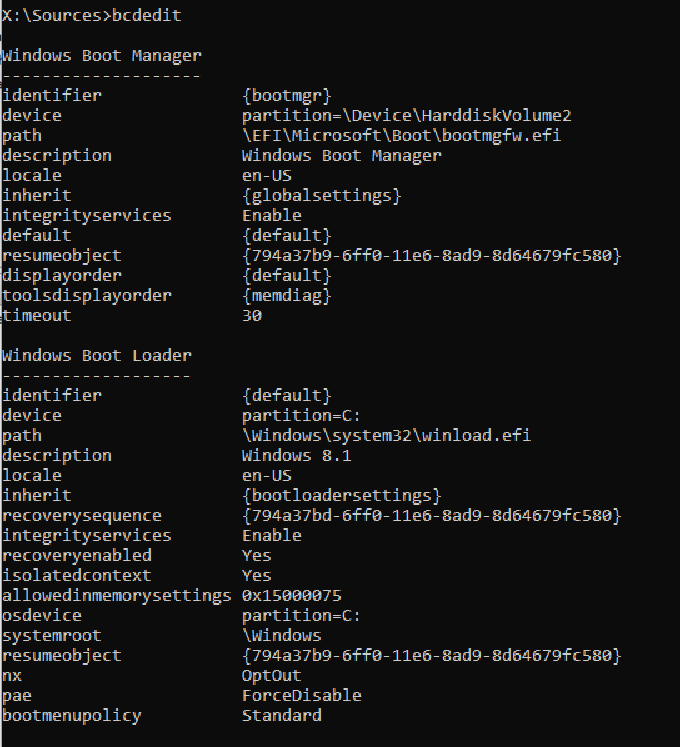
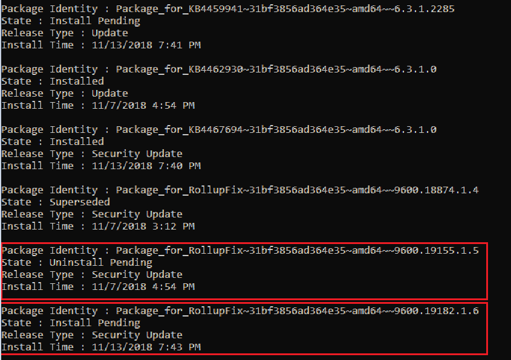
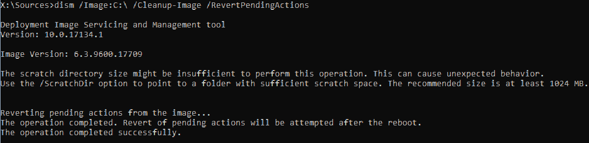
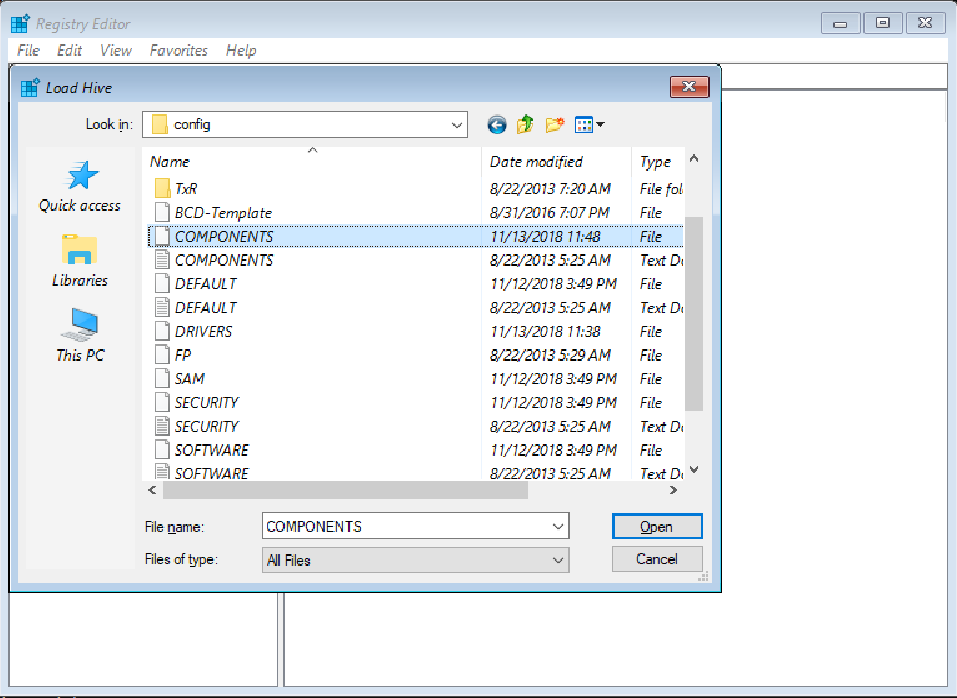
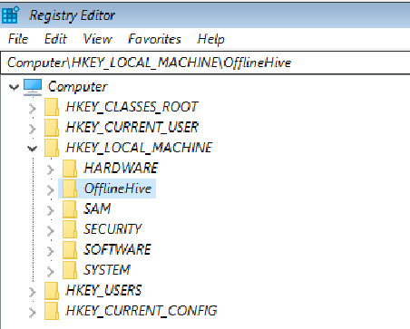
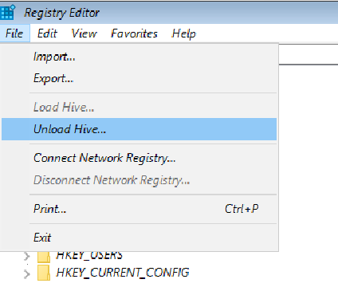
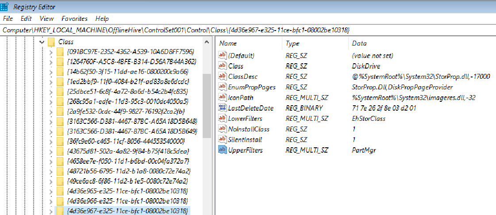
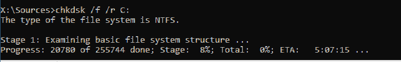
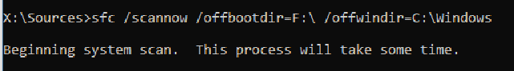

# Advanced troubleshooting for Stop error 7B or Inaccessible_Boot_Device

This article provides steps to troubleshoot **Stop error 7B: Inaccessible_Boot_Device**. This error may occur after some changes are made to the computer, or immediately after you deploy Windows on the computer.

## Causes of the  Inaccessible_Boot_Device  Stop error

Any one of the following factors may cause the stop error:

*	Missing, corrupted, or misbehaving filter drivers that are related to the storage stack

*	File system corruption

*	Changes to the storage controller mode or settings in the BIOS 

*	Using a different storage controller than the one that was used when Windows was installed

*	Moving the hard disk to a different computer that has a different controller

*	A faulty motherboard or storage controller, or faulty hardware 

*	In unusual cases: the failure of the TrustedInstaller service to commit newly installed updates because of Component Based Store corruptions

*	Corrupted files in the **Boot**  partition (for example, corruption in the volume that is labeled **SYSTEM**  when you run the `diskpart`  > `list vol`  command)

## Troubleshoot this error

Start the computer in [Windows Recovery Mode (WinRE)](https://docs.microsoft.com/windows-hardware/manufacture/desktop/windows-recovery-environment--windows-re--technical-reference#span-identrypointsintowinrespanspan-identrypointsintowinrespanspan-identrypointsintowinrespanentry-points-into-winre). To do this, follow these steps.

1. Start the system by using [the installation media for the installed version of Windows](https://support.microsoft.com/help/15088).

2. On the **Install Windows**  screen, select **Next**  > **Repair your computer** .

3. On the **System Recovery Options**  screen, select **Next**  > **Command Prompt** .

### Verify that the boot disk is connected and accessible

#### Step 1

 At the WinRE Command prompt, run `diskpart`, and then run `list disk`.

A list of the physical disks that are attached to the computer should be displayed and resemble the following display:

```
  Disk ###  Status         Size     Free     Dyn  Gpt

  --------  -------------  -------  -------  ---  ---

  Disk 0    Online         **size*  GB      0 B        *
``` 

If the computer uses a Unified Extensible Firmware Interface (UEFI) startup interface, there will be an asterisk (<em>) in the **GPT</em>*  column.

If the computer uses a basic input/output system (BIOS) interface, there will not be an asterisk in the **Dyn**  column.

#### Step 2

If the `list disk` command lists the OS disks correctly, run the `list vol` command in `diskpart`.

`list vol` generates an output that resembles the following display:

```
  Volume ###  Ltr  Label        Fs     Type        Size     Status     Info

  ----------  ---  -----------  -----  ----------  -------  ---------  --------

  Volume 0         Windows RE   NTFS   Partition    499 MB  Healthy

  Volume 1     C   OSDisk       NTFS   Partition    222 GB  Healthy    Boot

  Volume 2         SYSTEM       FAT32  Partition    499 MB  Healthy    System
```

>[!NOTE]
>If the disk that contains the OS is not listed in the output, you will have to engage the OEM or virtualization manufacturer.

### Verify the integrity of Boot Configuration Database

Check whether the Boot Configuration Database (BCD) has all the correct entries. To do this, run `bcdedit` at the WinRE command prompt.

To verify the BCD entries:

1. Examine the **Windows Boot Manager**  section that has the **{bootmgr}** identifier. Make sure that the **device**  and **path**  entries point to the correct device and boot loader file.
 
   An example output if the computer is UEFI-based:
    
   ```
   device                  partition=\Device\HarddiskVolume2
   path                    \EFI\Microsoft\Boot\bootmgfw.efi
   ```

   An example output if the machine is BIOS based:
   ```
   Device                partition=C:
   ```
   >[!NOTE]
   >This output may not contain a path.

2. In the **Windows Boot Loader**  that has the **{default}** identifier, make sure that **device** , **path** , **osdevice,**  and **systemroot**  point to the correct device or partition, winload file, OS partition or device, and OS folder.
 
   >[!NOTE]
   >If the computer is UEFI-based, the **bootmgr**  and **winload**  entires under **{default}**  will contain an **.efi**  extension.

   

If any of the information is wrong or missing, we recommend that you create a backup of the BCD store. To do this, run `bcdedit /export C:\temp\bcdbackup`. This command creates a backup in **C:\\temp\\** that is named **bcdbackup** . To restore the backup, run `bcdedit /import C:\temp\bcdbackup`. This command overwrites all BCD settings by using the settings in **bcdbackup** .

After the backup is completed, run the following command to make the changes:

<pre>bcdedit /set *{identifier}* option value</pre>

For example, if the device under {default} is wrong or missing, run the following command to set it: `bcdedit /set {default} device partition=C:`

 If you want to re-create the BCD completely, or if you get a message that states that "**The boot configuration data store could not be opened. The system could not find the file specified,** " run `bootrec /rebuildbcd`.

If the BCD has the correct entries, check whether the **winload** and **bootmgr** entries exist in the correct location per the path that is specified in the **bcdedit**  command. By default, **bootmgr**  in the BIOS partition will be in the root of the **SYSTEM**  partition. To see the file, run `Attrib -s -h -r`.

If the files are missing, and you want to rebuild the boot files, follow these steps:

1. Copy all the contents under the **SYSTEM**  partition to another location. Alternatively, you can use the command prompt to navigate to the OS drive, create a new folder, and then copy all the files and folders from the **SYSTEM**  volume, as follows:

```
D:\> Mkdir  BootBackup
R:\> Copy *.* D:\BootBackup 
```

2. If you are using Windows 10, or if you are troubleshooting by using a Windows 10 ISO at the Windows Pre-Installation Environment command prompt, you can use the **bcdboot**  command to re-create the boot files, as follows:

   ```cmd
   Bcdboot <**OSDrive* >:\windows /s <**SYSTEMdrive* >: /f ALL
   ```

   For example: if we assign the `<System Drive>` (WinRE drive) the letter R and the `<OSdrive>` is the letter D, this command would be the following:

   ```cmd
   Bcdboot D:\windows /s R: /f ALL
   ```

   >[!NOTE]
   >The **ALL** part of the **bcdboot** command writes all the boot files (both UEFI and BIOS) to their respective locations.

If you do not have a Windows 10 ISO, you must format the partition and copy **bootmgr**  from another working computer that has a similar Windows build. To do this, follow these steps:

1. Start **Notepad** .

2. Press Ctrl+O.

3. Navigate to the system partition (in this example, it is R).

4. Right-click the partition, and then format it.

### Troubleshooting if this issue occurs after a Windows Update installation

Run the following command to verify the Windows update installation and dates:

```cmd
Dism /Image:<Specify the OS drive>: /Get-packages
```

After you run this command, you will see the **Install pending** and **Uninstall Pending** packages:



1. Run the `dism /Image:C:\ /Cleanup-Image /RevertPendingActions` command. Replace **C:** with the system partition for your computer.

    

2. Navigate to ***OSdriveLetter* :\Windows\WinSxS** , and then check whether the **pending.xml**  file exists. If it does, rename it to **pending.xml.old**.

3. To revert the registry changes, type **regedit**  at the command prompt to open **Registry Editor**.

4. Select **HKEY_LOCAL_MACHINE**, and then go to **File**  > **Load Hive**.

5. Navigate to **OSdriveLetter:\Windows\System32\config**, select the file that is named **COMPONENT** (with no extension), and then select **Open**. When you are prompted, enter the name **OfflineComponentHive** for the new hive
    
    

6. Expand **HKEY_LOCAL_MACHINE\OfflineComponentHive**, and check whether the **PendingXmlIdentifier** key exists. Create a backup of the **OfflineComponentHive** key, and then delete the **PendingXmlIdentifier** key.

7. Unload the hive. To do this, highlight **OfflineComponentHive**, and then select **File**  > **Unload hive**.

    

8. Select **HKEY_LOCAL_MACHINE**, go to **File** > **Load Hive**, navigate to ***OSdriveLetter* :\Windows\System32\config**, select the file that is named **SYSTEM** (with no extension), and then select **Open** . When you are prompted, enter the name **OfflineSystemHive** for the new hive.

9. Expand **HKEY_LOCAL_MACHINE\OfflineSystemHive**, and then select the **Select** key. Check the data for the **Default** value.

10. If the data in **HKEY_LOCAL_MACHINE\OfflineSystemHive\Select\Default**  is **1** , expand **HKEY_LOCAL_MACHINE\OfflineHive\ControlSet001**. If it is **2**, expand **HKEY_LOCAL_MACHINE\OfflineHive\ControlSet002**, and so on.

11.	 Expand **Control\Session Manager**. Check whether the **PendingFileRenameOperations** key exists. If it does, back up the **SessionManager** key, and then delete the **PendingFileRenameOperations** key.

### Verifying boot critical drivers and services

#### Check services	

1.	 Follow steps 1-10 in the "Troubleshooting if this issue occurs after an Windows Update installation" section. (Step 11 does not apply to this procedure.)

2. Expand **Services**.

3. Make sure that the following registry keys exist under **Services**: 

    * ACPI

    * DISK
    
    *	VOLMGR
    
    *	PARTMGR
    
    *	VOLSNAP
    
    *	VOLUME

If these keys exist, check each one to make sure that it has a value that is named **Start** and that it is set to **0**. If not, set the value to **0**.

If any of these keys do not exist, you can try to replace the current registry hive by using the hive from **RegBack**. To do this, run the following commands:

```cmd
cd OSdrive:\Windows\System32\config
ren SYSTEM SYSTEM.old
copy OSdrive:\Windows\System32\config\RegBack\SYSTEM OSdrive:\Windows\System32\config\
```

#### Check upper and lower filter drivers

Check whether there are any non-Microsoft upper and lower filter drivers on the computer and that they do not exist on another, similar working computer. if they do exist, remove the upper and lower filter drivers:

1. Expand **HKEY_LOCAL_MACHINE\OfflineHive\ControlSet001\Control**.

2. Look for any **UpperFilters** or **LowerFilters**  entries.

   >[!NOTE]
   >These filters are mainly related to storage. After you expand the **Control** key in the registry, you can search for **UpperFilters** and **LowerFilters**.

   The following are some of the different registry entries in which you may find these filter drivers. These entries are located under **ControlSet**  and are designated as **Default** :

\Control\Class\\{4D36E96A-E325-11CE-BFC1-08002BE10318} 

\Control\Class\\{4D36E967-E325-11CE-BFC1-08002BE10318} 

\Control\Class\\{4D36E97B-E325-11CE-BFC1-08002BE10318} 

\Control\Class\\{71A27CDD-812A-11D0-BEC7-08002BE2092F}

 

If an **UpperFilters**  or **LowerFilters**  entry is non-standard (for example, it is not a Windows default filter driver, such as PartMgr), remove the entry by double-clicking it in the right pane, and then deleting only that value.

>[!NOTE]
>There could be multiple entries.

The reason that these entries may affect us is because there may be an entry in the **Services** branch that has a START type set to 0 or 1 (indicating that it is loaded at the Boot or Automatic part of the boot process). Also, either the file that is referred to is missing or corrupted, or it may be named differently than what is listed in the entry. 

>[!NOTE]
>If there actually is a service that is set to **0** or **1** that corresponds to an **UpperFilters** or **LowerFilters** entry, setting the service to disabled in the **Services** registry (as discussed in steps 2 and 3 of the Check services section) without removing the **Filter Driver** entry causes the computer to crash and generate a 0x7b Stop error.

### Running SFC and Chkdsk

 If the computer still does not start, you can try to run a **chkdisk**  process on the system drive, and also run System File Checker. To do this, run the following commands at a WinRE command prompt:

*	`chkdsk /f /r OsDrive:`

    

*	`sfc /scannow /offbootdir=OsDrive:\ /offwindir=OsDrive:\Windows`

    

