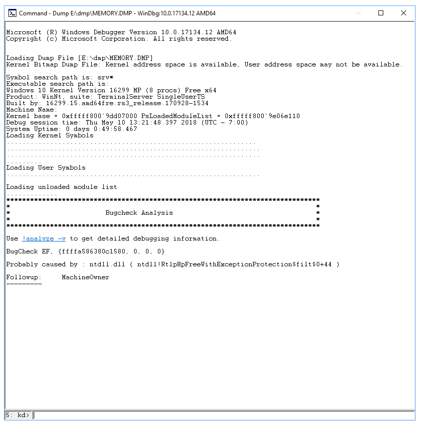
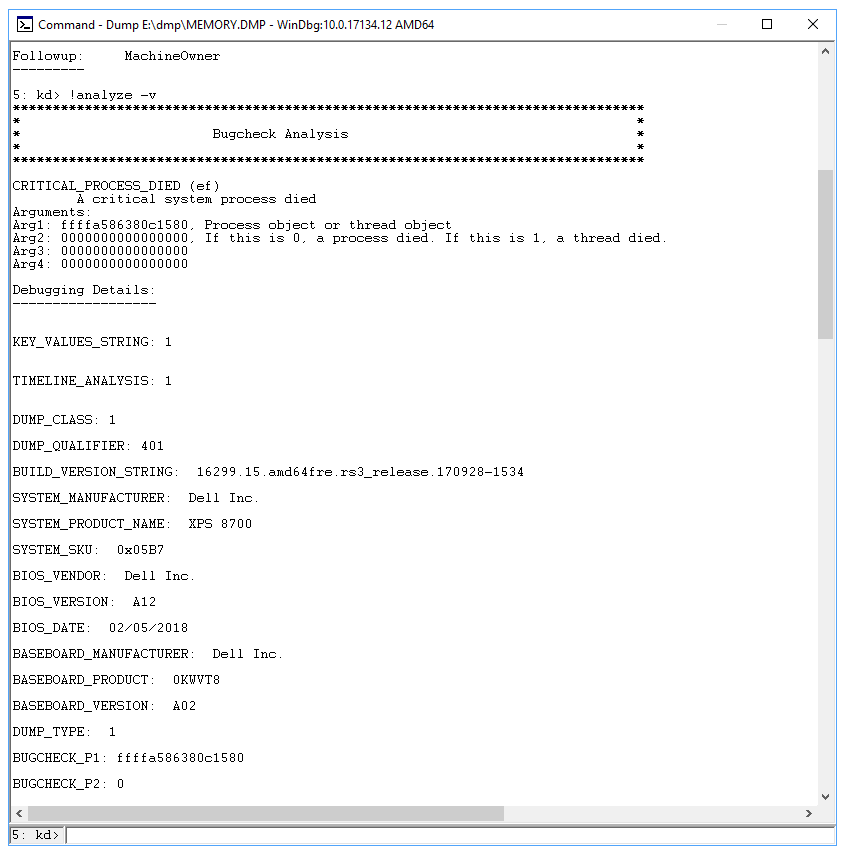

# Advanced troubleshooting for Stop error or blue screen error issue

>[!NOTE]
>If you're not a support agent or IT professional, you'll find more helpful information about Stop error ("blue screen") messages in [Troubleshoot blue screen errors](https://support.microsoft.com/help/14238).

 
## What causes Stop errors?

A Stop error is displayed as a blue screen that contains the name of the faulty driver, such as any of the following example drivers:

- atikmpag.sys
- igdkmd64.sys
- nvlddmkm.sys

There is no simple explanation for the cause of Stop errors (also known as blue screen errors or bug check errors). Many different factors can be involved. However, various studies indicate that Stop errors usually are not caused by Microsoft Windows components. Instead, these errors are generally related to malfunctioning hardware drivers or drivers that are installed by third-party software. This includes video cards, wireless network cards, security programs, and so on.

Our analysis of the root causes of crashes indicates the following:

- 70 percent are caused by third-party driver code
- 10 percent are caused by hardware issues 
- 5 percent are caused by Microsoft code
- 15 percent have unknown causes (because the memory is too corrupted to analyze)

## General troubleshooting steps

To troubleshoot Stop error messages, follow these general steps:

1. Review the Stop error code that you find in the event logs. Search online for the specific Stop error codes to see whether there are any known issues, resolutions, or workarounds for the problem.
2. As a best practice, we recommend that you do the following:

    a. Make sure that you install the latest Windows updates, cumulative updates, and rollup updates. To verify the update status, refer to the appropriate update history for your system:
    
    - [Windows 10, version 1809](https://support.microsoft.com/help/4464619)
    - [Windows 10, version 1803](https://support.microsoft.com/help/4099479)
    - [Windows 10, version 1709](https://support.microsoft.com/help/4043454)
    - [Windows 10, version 1703](https://support.microsoft.com/help/4018124)
    - [Windows Server 2016 and Windows 10, version 1607](https://support.microsoft.com/help/4000825)
    - [Windows 10, version 1511](https://support.microsoft.com/help/4000824)
    - [Windows Server 2012 R2 and Windows 8.1](https://support.microsoft.com/help/4009470)
    - [Windows Server 2008 R2 and Windows 7 SP1](https://support.microsoft.com/help/4009469)

    b. Make sure that the BIOS and firmware are up-to-date.

    c. Run any relevant hardware and memory tests.

3. Run the [Machine Memory Dump Collector](https://home.diagnostics.support.microsoft.com/selfhelp?knowledgebasearticlefilter=2027760&wa=wsignin1.0) Windows diagnostic package. This diagnostic tool is used to collect machine memory dump files and check for known solutions.

4. Run [Microsoft Safety Scanner](http://www.microsoft.com/security/scanner/en-us/default.aspx) or any other virus detection program that includes checks of the Master Boot Record for infections.

5. Make sure that there is sufficient free space on the hard disk. The exact requirement varies, but we recommend 10 to 15 percent free disk space.

6. Contact the respective hardware or software vendor to update the drivers and applications in the following scenarios:
  
    - The error message indicates that a specific driver is causing the problem.
    - You are seeing an indication of a service that is starting or stopping before the crash occurred. In this situation, determine whether the service behavior is consistent across all instances of the crash.
    - You have made any software or hardware changes.

    >[!NOTE]
    >If there are no updates available from a specific manufacturer, it is recommended that you disable the related service.
    >
    >To do this, see [How to perform a clean boot in Windows](https://support.microsoft.com/help/929135)
    >
    >You can disable a driver by following the steps in [How to temporarily deactivate the kernel mode filter driver in Windows](https://support.microsoft.com/help/816071).
    >
    >You may also want to consider the option of rolling back changes or reverting to the last-known working state. For more information, see [Roll Back a Device Driver to a Previous Version](https://docs.microsoft.com/previous-versions/windows/it-pro/windows-server-2008-R2-and-2008/cc732648(v=ws.11)).

### Memory dump collection

To configure the system for memory dump files, follow these steps:

1. [Download DumpConfigurator tool](https://codeplexarchive.blob.core.windows.net/archive/projects/WinPlatTools/WinPlatTools.zip).
2. Extract the .zip file and navigate to **Source Code** folder.
3. Run the tool DumpConfigurator.hta, and then select **Elevate this HTA**.
3. Select **Auto Config Kernel**.
4. Restart the computer for the setting to take effect. 
5. Stop and disable Automatic System Restart Services (ASR) to prevent dump files from being written. 
6. If the server is virtualized, disable auto reboot after the memory dump file is created. This lets you take a snapshot of the server in-state and also if the problem recurs.

The memory dump file is saved at the following locations.

| Dump file type | Location |
|----------------|----------|
|(none) | %SystemRoot%\MEMORY.DMP (inactive, or greyed out) |
|Small memory dump file (256kb) | %SystemRoot%\Minidump |
|Kernel memory dump file | %SystemRoot%\MEMORY.DMP |
| Complete memory dump file | %SystemRoot%\MEMORY.DMP |
| Automatic memory dump file | %SystemRoot%\MEMORY.DMP |
| Active memory dump file | %SystemRoot%\MEMORY.DMP |

You can use the Microsoft DumpChk (Crash Dump File Checker) tool to verify that the memory dump files are not corrupted or invalid. For more information, see the following video: 

>[!video https://www.youtube.com/embed/xN7tOfgNKag]

More information on how to use Dumpchk.exe to check your dump files:

-	[Using DumpChk]( https://docs.microsoft.com/windows-hardware/drivers/debugger/dumpchk)
-	[Download DumpCheck](https://developer.microsoft.com/windows/downloads/windows-10-sdk)

### Pagefile Settings

- [Introduction of page file in Long-Term Servicing Channel and Semi-Annual Channel of Windows](https://support.microsoft.com/help/4133658) 
- [How to determine the appropriate page file size for 64-bit versions of Windows](https://support.microsoft.com/help/2860880) 
- [How to generate a kernel or a complete memory dump file in Windows Server 2008 and Windows Server 2008 R2](https://support.microsoft.com/help/969028)

### Memory dump analysis

Finding the root cause of the crash may not be easy. Hardware problems are especially difficult to diagnose because they may cause erratic and unpredictable behavior that can manifest itself in a variety of symptoms.

When a Stop error occurs, you should first isolate the problematic components, and then try to cause them to trigger the Stop error again. If you can replicate the problem, you can usually determine the cause.

You can use the tools such as Windows Software Development KIT (SDK) and Symbols to diagnose dump logs. The next section discusses how to use this tool.

## Advanced troubleshooting steps

>[!NOTE]
>Advanced troubleshooting of crash dumps can be very challenging if you are not experienced with programming and internal Windows mechanisms. We have attempted to provide a brief insight here into some of the techniques used, including some examples. However, to really be effective at troubleshooting a crash dump, you should spend time becoming familiar with advanced debugging techniques. For a video overview, see [Advanced Windows Debugging](https://channel9.msdn.com/Blogs/Charles/Advanced-Windows-Debugging-An-Introduction) and [Debugging Kernel Mode Crashes and Hangs](https://channel9.msdn.com/Shows/Defrag-Tools/DefragTools-137-Debugging-kernel-mode-dumps). Also see the advanced references listed below.

### Advanced debugging references

[Advanced Windows Debugging](https://www.amazon.com/Advanced-Windows-Debugging-Mario-Hewardt/dp/0321374460)<br>
[Debugging Tools for Windows (WinDbg, KD, CDB, NTSD)](https://docs.microsoft.com/windows-hardware/drivers/debugger/index)

### Debugging steps

1. Verify that the computer is set up to generate a complete memory dump file when a crash occurs. See the steps [here](troubleshoot-windows-freeze.md#method-1-memory-dump) for more information. 
2. Locate the memory.dmp file in your Windows directory on the computer that is crashing, and copy that file to another computer.
3. On the other computer, download the [Windows 10 SDK](https://developer.microsoft.com/en-US/windows/downloads/windows-10-sdk).
4. Start the install and choose **Debugging Tools for Windows**. This will install the WinDbg tool.
5. Open the WinDbg tool and set the symbol path by clicking **File** and then clicking **Symbol File Path**.<br>
    a. If the computer is connected to the Internet, enter the [Microsoft public symbol server](https://docs.microsoft.com/windows-hardware/drivers/debugger/microsoft-public-symbols) (https://msdl.microsoft.com/download/symbols) and click **OK**. This is the recommended method.<br>
    b. If the computer is not connected to the Internet, you must specify a local [symbol path](https://docs.microsoft.com/en-in/windows-hardware/drivers/debugger/symbol-path).
6. Click on **Open Crash Dump**, and then open the memory.dmp file that you copied. See the example below.
    
7. There should be a link that says **!analyze -v** under **Bugcheck Analysis**. Click that link. This will enter the command !analyze -v in the prompt at the bottom of the page.
8. A detailed bugcheck analysis will appear. See the example below.
    
9. Scroll down to the section where it says **STACK_TEXT**. There will be rows of numbers with each row followed by a colon and some text. That text should tell you what DLL is causing the crash and if applicable what service is crashing the DLL.
10. See [Using the !analyze Exension](https://docs.microsoft.com/windows-hardware/drivers/debugger/using-the--analyze-extension) for details about how to interpret the STACK_TEXT output.

There are many possible causes of a bugcheck and each case is unique. In the example provided above, the important lines that can be identified from the STACK_TEXT are 20, 21, and 22:

(HEX data is removed here and lines are numbered for clarity)

```
1  : nt!KeBugCheckEx
2  : nt!PspCatchCriticalBreak+0xff
3  : nt!PspTerminateAllThreads+0x1134cf
4  : nt!PspTerminateProcess+0xe0
5  : nt!NtTerminateProcess+0xa9
6  : nt!KiSystemServiceCopyEnd+0x13
7  : nt!KiServiceLinkage
8  : nt!KiDispatchException+0x1107fe
9  : nt!KiFastFailDispatch+0xe4
10 : nt!KiRaiseSecurityCheckFailure+0x3d3
11 : ntdll!RtlpHpFreeWithExceptionProtection$filt$0+0x44
12 : ntdll!_C_specific_handler+0x96
13 : ntdll!RtlpExecuteHandlerForException+0xd
14 : ntdll!RtlDispatchException+0x358
15 : ntdll!KiUserExceptionDispatch+0x2e
16 : ntdll!RtlpHpVsContextFree+0x11e
17 : ntdll!RtlpHpFreeHeap+0x48c
18 : ntdll!RtlpHpFreeWithExceptionProtection+0xda
19 : ntdll!RtlFreeHeap+0x24a
20 : FWPolicyIOMgr!FwBinariesFree+0xa7c2
21 : mpssvc!FwMoneisDiagEdpPolicyUpdate+0x1584f
22 : mpssvc!FwEdpMonUpdate+0x6c
23 : ntdll!RtlpWnfWalkUserSubscriptionList+0x29b
24 : ntdll!RtlpWnfProcessCurrentDescriptor+0x105
25 : ntdll!RtlpWnfNotificationThread+0x80
26 : ntdll!TppExecuteWaitCallback+0xe1
27 : ntdll!TppWorkerThread+0x8d0
28 : KERNEL32!BaseThreadInitThunk+0x14
29 : ntdll!RtlUserThreadStart+0x21
```

The problem here is with **mpssvc** which is a component of the Windows Firewall. The problem was repaired by disabling the firewall temporarily and then resetting firewall policies. 

Additional examples are provided in the [Debugging examples](#debugging-examples) section at the bottom of this article.

## Video resources

The following videos illustrate various troubleshooting techniques for analyzing dump files.

- [Analyze Dump File](https://www.youtube.com/watch?v=s5Vwnmi_TEY)
- [Installing Debugging Tool for Windows (x64 and x86)](https://channel9.msdn.com/Shows/Defrag-Tools/Defrag-Tools-Building-your-USB-thumbdrive/player#time=22m29s:paused)
- [Debugging kernel mode crash memory dumps](https://channel9.msdn.com/Shows/Defrag-Tools/DefragTools-137-Debugging-kernel-mode-dumps)
- [Special Pool](https://www.youtube.com/watch?v=vHXYS9KdU1k)
 
## Advanced troubleshooting using Driver Verifier

We estimate that about 75 percent of all Stop errors are caused by faulty drivers. The Driver Verifier tool provides several methods to help you troubleshoot. These include running drivers in an isolated memory pool (without sharing memory with other components), generating extreme memory pressure, and validating parameters. If the tool encounters errors in the execution of driver code, it proactively creates an exception to let that part of the code be examined further.

>[!WARNING]
>Driver Verifier consumes lots of CPU and can slow down the computer significantly. You may also experience additional crashes. Verifier disables faulty drivers after a Stop error occurs, and continues to do this until you can successfully restart the system and access the desktop. You can also expect to see several dump files created.
>
>Don’t try to verify all the drivers at one time. This can degrade performance and make the system unusable. This also limits the effectiveness of the tool.

Use the following guidelines when you use Driver Verifier:  

- Test any “suspicious” drivers (drivers that were recently updated or that are known to be problematic).
- If you continue to experience non-analyzable crashes, try enabling verification on all third-party and unsigned drivers.
- Enable concurrent verification on groups of 10 to 20 drivers.
- Additionally, if the computer cannot boot into the desktop because of Driver Verifier, you can disable the tool by starting in Safe mode. This is because the tool cannot run in Safe mode.

For more information, see [Driver Verifier](https://docs.microsoft.com/windows-hardware/drivers/devtest/driver-verifier).

## Common Windows Stop errors

This section doesn't contain a list of all error codes, but since many error codes have the same potential resolutions, your best bet is to follow the steps below to troubleshoot your error.

The following table lists general troubleshooting procedures for common Stop error codes.

Stop error message and code | Mitigation
--- | ---
VIDEO_ENGINE_TIMEOUT_DETECTED or VIDEO_TDR_TIMEOUT_DETECTED<br>Stop error code 0x00000141, or 0x00000117 | Contact the vendor of the listed display driver to get an appropriate update for that driver.
DRIVER_IRQL_NOT_LESS_OR_EQUAL <br>Stop error code 0x0000000D1 | Apply the latest updates for the driver by applying the latest cumulative updates for the system through the Microsoft Update Catalog website.Update an outdated NIC driver. Virtualized VMware systems often run “Intel(R) PRO/1000 MT Network Connection” (e1g6032e.sys). This driver is available at [http://downloadcenter.intel.com](http://downloadcenter.intel.com). Contact the hardware vendor to update the NIC driver for a resolution. For VMware systems, use the VMware integrated NIC driver (types VMXNET or VMXNET2 , VMXNET3 can be used) instead of Intel e1g6032e.sys.
PAGE_FAULT_IN_NONPAGED_AREA <br>Stop error code 0x000000050 | If a driver is identified in the Stop error message, contact the manufacturer for an update.If no updates are available, disable the driver, and monitor the system for stability. Run Chkdsk /f /r to detect and repair disk errors. You must restart the system before the disk scan begins on a system partition. Contact the manufacturer for any diagnostic tools that they may provide for the hard disk subsystem. Try to reinstall any application or service that was recently installed or updated. It's possible that the crash was triggered while the system was starting applications and reading the registry for preference settings. Reinstalling the application can fix corrupted registry keys.If the problem persists, and you have run a recent system state backup, try to restore the registry hives from the backup.
SYSTEM_SERVICE_EXCEPTION <br>Stop error code c000021a {Fatal System Error} The Windows SubSystem system process terminated unexpectedly with a status of 0xc0000005. The system has been shut down. | Use the System File Checker tool to repair missing or corrupted system files. The System File Checker lets users scan for corruptions in Windows system files and restore corrupted files.  For more information, see [Use the System File Checker tool](https://support.microsoft.com/en-us/help/929833/use-the-system-file-checker-tool-to-repair-missing-or-corrupted-system-files).
NTFS_FILE_SYSTEM <br>Stop error code 0x000000024 | This Stop error is commonly caused by corruption in the NTFS file system or bad blocks (sectors) on the hard disk. Corrupted drivers for hard disks (SATA or IDE) can also adversely affect the system's ability to read and write to disk. Run any hardware diagnostics that are provided by the manufacturer of the storage subsystem. Use the scan disk tool to verify that there are no file system errors. To do this, right-click the drive that you want to scan, select Properties, select Tools, and then select the Check now button.We also suggest that you update the NTFS file system driver (Ntfs.sys), and apply the latest cumulative updates for the current operating system that is experiencing the problem. 
KMODE_EXCEPTION_NOT_HANDLED <br>Stop error code 0x0000001E | If a driver is identified in the Stop error message, disable or remove that driver. Disable or remove any drivers or services that were recently added. <br><br>If the error occurs during the startup sequence, and the system partition is formatted by using the NTFS file system, you might be able to use Safe mode to disable the driver in Device Manager. To do this, follow these steps:<br><br>Go to **Settings > Update &amp; security > Recovery**. Under **Advanced startup**, select **Restart now**. After your PC restarts to the **Choose an option** screen, select **Troubleshoot &gt; Advanced options &gt; Startup Settings &gt; Restart**. After the computer restarts, you'll see a list of options. Press **4** or **F4** to start the computer in Safe mode. Or, if you intend to use the Internet while in Safe mode, press **5** or **F5** for the Safe Mode with Networking option.
DPC_WATCHDOG_VIOLATION <br>Stop error code 0x00000133 | This Stop error code is caused by a faulty driver that does not complete its work within the allotted time frame in certain conditions. To enable us to help mitigate this error, collect the memory dump file from the system, and then use the Windows Debugger to find the faulty driver. If a driver is identified in the Stop error message, disable the driver to isolate the problem. Check with the manufacturer for driver updates. Check the system log in Event Viewer for additional error messages that might help identify the device or driver that is causing Stop error 0x133. Verify that any new hardware that is installed is compatible with the installed version of Windows. For example, you can get information about required hardware at Windows 10 Specifications. If Windows Debugger is installed, and you have access to public symbols, you can load the c:\windows\memory.dmp file into the Debugger, and then refer to [Determining the source of Bug Check 0x133 (DPC_WATCHDOG_VIOLATION) errors on Windows Server 2012](https://blogs.msdn.microsoft.com/ntdebugging/2012/12/07/determining-the-source-of-bug-check-0x133-dpc_watchdog_violation-errors-on-windows-server-2012/) to find the problematic driver from the memory dump.  
USER_MODE_HEALTH_MONITOR <br>Stop error code 0x0000009E		| This Stop error indicates that a user-mode health check failed in a way that prevents graceful shutdown. Therefore, Windows restores critical services by restarting or enabling application failover to other servers. The Clustering Service incorporates a detection mechanism that may detect unresponsiveness in user-mode components.<br>This Stop error usually occurs in a clustered environment, and the indicated faulty driver is RHS.exe.Check the event logs for any storage failures to identify the failing process.Try to update the component or process that is indicated in the event logs. You should see the following event recorded:<br>Event ID: 4870<br>Source: Microsoft-Windows-FailoverClustering<br>Description: User mode health monitoring has detected that the system is not being responsive. The Failover cluster virtual adapter has lost contact with the Cluster Server process with a process ID ‘%1’, for ‘%2’ seconds. Recovery action will be taken. Review the Cluster logs to identify the process and investigate which items might cause the process to hang. <br />For more information, see ["Why is my Failover Clustering node blue screening with a Stop 0x0000009E?"](https://blogs.technet.microsoft.com/askcore/2009/06/12/why-is-my-failover-clustering-node-blue-screening-with-a-stop-0x0000009e) Also, see the following Microsoft video [What to do if a 9E occurs](https://www.youtube.com/watch?v=vOJQEdmdSgw).

## Debugging examples

### Example 1

This bugcheck is caused by a driver hang during upgrade, resulting in a bugcheck D1 in NDIS.sys (a Microsoft driver).  The **IMAGE_NAME** will tell you the faulting driver, but since this is Microsoft driver it cannot be replaced or removed. The resolution method is to disable the network device in device manager and try the upgrade again.

```
2: kd> !analyze -v
*******************************************************************************
*                                                                             *
*                        Bugcheck Analysis                                    *
*                                                                             *
*******************************************************************************

DRIVER_IRQL_NOT_LESS_OR_EQUAL (d1)
An attempt was made to access a pageable (or completely invalid) address at an
interrupt request level (IRQL) that is too high.  This is usually
caused by drivers using improper addresses.
If kernel debugger is available get stack backtrace.
Arguments:
Arg1: 000000000011092a, memory referenced
Arg2: 0000000000000002, IRQL
Arg3: 0000000000000001, value 0 = read operation, 1 = write operation
Arg4: fffff807aa74f4c4, address which referenced memory
Debugging Details:
------------------

KEY_VALUES_STRING: 1
STACKHASH_ANALYSIS: 1
TIMELINE_ANALYSIS: 1
DUMP_CLASS: 1
DUMP_QUALIFIER: 400
SIMULTANEOUS_TELSVC_INSTANCES:  0
SIMULTANEOUS_TELWP_INSTANCES:  0
BUILD_VERSION_STRING:  16299.15.amd64fre.rs3_release.170928-1534
SYSTEM_MANUFACTURER:  Alienware
SYSTEM_PRODUCT_NAME:  Alienware 15 R2
SYSTEM_SKU:  Alienware 15 R2
SYSTEM_VERSION:  1.2.8
BIOS_VENDOR:  Alienware
BIOS_VERSION:  1.2.8
BIOS_DATE:  01/29/2016
BASEBOARD_MANUFACTURER:  Alienware
BASEBOARD_PRODUCT:  Alienware 15 R2
BASEBOARD_VERSION:  A00
DUMP_TYPE:  2
BUGCHECK_P1: 11092a
BUGCHECK_P2: 2
BUGCHECK_P3: 1
BUGCHECK_P4: fffff807aa74f4c4
WRITE_ADDRESS: fffff80060602380: Unable to get MiVisibleState
Unable to get NonPagedPoolStart
Unable to get NonPagedPoolEnd
Unable to get PagedPoolStart
Unable to get PagedPoolEnd
000000000011092a 
CURRENT_IRQL:  2
FAULTING_IP: 
NDIS!NdisQueueIoWorkItem+4 [minio\ndis\sys\miniport.c @ 9708]
fffff807`aa74f4c4 48895120        mov     qword ptr [rcx+20h],rdx
CPU_COUNT: 8
CPU_MHZ: a20
CPU_VENDOR:  GenuineIntel
CPU_FAMILY: 6
CPU_MODEL: 5e
CPU_STEPPING: 3
CPU_MICROCODE: 6,5e,3,0 (F,M,S,R)  SIG: BA'00000000 (cache) BA'00000000 (init)
BLACKBOXPNP: 1 (!blackboxpnp)
DEFAULT_BUCKET_ID:  WIN8_DRIVER_FAULT
BUGCHECK_STR:  AV
PROCESS_NAME:  System
ANALYSIS_SESSION_HOST:  SHENDRIX-DEV0
ANALYSIS_SESSION_TIME:  01-17-2019 11:06:05.0653
ANALYSIS_VERSION: 10.0.18248.1001 amd64fre
TRAP_FRAME:  ffffa884c0c3f6b0 -- (.trap 0xffffa884c0c3f6b0)
NOTE: The trap frame does not contain all registers.
Some register values may be zeroed or incorrect.
rax=fffff807ad018bf0 rbx=0000000000000000 rcx=000000000011090a
rdx=fffff807ad018c10 rsi=0000000000000000 rdi=0000000000000000
rip=fffff807aa74f4c4 rsp=ffffa884c0c3f840 rbp=000000002408fd00
r8=ffffb30e0e99ea30  r9=0000000001d371c1 r10=0000000020000080
r11=0000000000000000 r12=0000000000000000 r13=0000000000000000
r14=0000000000000000 r15=0000000000000000
iopl=0         nv up ei ng nz na pe nc
NDIS!NdisQueueIoWorkItem+0x4:
fffff807`aa74f4c4 48895120        mov     qword ptr [rcx+20h],rdx ds:00000000`0011092a=????????????????
Resetting default scope

LAST_CONTROL_TRANSFER:  from fffff800603799e9 to fffff8006036e0e0

STACK_TEXT:  
ffffa884`c0c3f568 fffff800`603799e9 : 00000000`0000000a 00000000`0011092a 00000000`00000002 00000000`00000001 : nt!KeBugCheckEx [minkernel\ntos\ke\amd64\procstat.asm @ 134] 
ffffa884`c0c3f570 fffff800`60377d7d : fffff78a`4000a150 ffffb30e`03fba001 ffff8180`f0b5d180 00000000`000000ff : nt!KiBugCheckDispatch+0x69 [minkernel\ntos\ke\amd64\trap.asm @ 2998] 
ffffa884`c0c3f6b0 fffff807`aa74f4c4 : 00000000`00000002 ffff8180`f0754180 00000000`00269fb1 ffff8180`f0754180 : nt!KiPageFault+0x23d [minkernel\ntos\ke\amd64\trap.asm @ 1248] 
ffffa884`c0c3f840 fffff800`60256b63 : ffffb30e`0e18f710 ffff8180`f0754180 ffffa884`c0c3fa18 00000000`00000002 : NDIS!NdisQueueIoWorkItem+0x4 [minio\ndis\sys\miniport.c @ 9708] 
ffffa884`c0c3f870 fffff800`60257bfd : 00000000`00000008 00000000`00000000 00000000`00269fb1 ffff8180`f0754180 : nt!KiProcessExpiredTimerList+0x153 [minkernel\ntos\ke\dpcsup.c @ 2078] 
ffffa884`c0c3f960 fffff800`6037123a : 00000000`00000000 ffff8180`f0754180 00000000`00000000 ffff8180`f0760cc0 : nt!KiRetireDpcList+0x43d [minkernel\ntos\ke\dpcsup.c @ 1512] 
ffffa884`c0c3fb60 00000000`00000000 : ffffa884`c0c40000 ffffa884`c0c39000 00000000`00000000 00000000`00000000 : nt!KiIdleLoop+0x5a [minkernel\ntos\ke\amd64\idle.asm @ 166] 

RETRACER_ANALYSIS_TAG_STATUS:  Failed in getting KPCR for core 2
THREAD_SHA1_HASH_MOD_FUNC:  5b59a784f22d4b5cbd5a8452fe39914b8fd7961d
THREAD_SHA1_HASH_MOD_FUNC_OFFSET:  5643383f9cae3ca39073f7721b53f0c633bfb948
THREAD_SHA1_HASH_MOD:  20edda059578820e64b723e466deea47f59bd675
FOLLOWUP_IP: 
NDIS!NdisQueueIoWorkItem+4 [minio\ndis\sys\miniport.c @ 9708]
fffff807`aa74f4c4 48895120        mov     qword ptr [rcx+20h],rdx
FAULT_INSTR_CODE:  20518948
FAULTING_SOURCE_LINE:  minio\ndis\sys\miniport.c
FAULTING_SOURCE_FILE:  minio\ndis\sys\miniport.c
FAULTING_SOURCE_LINE_NUMBER:  9708
FAULTING_SOURCE_CODE:  
  9704:     _In_ _Points_to_data_      PVOID                       WorkItemContext
  9705:     )
  9706: {
  9707: 
> 9708:     ((PNDIS_IO_WORK_ITEM)NdisIoWorkItemHandle)->Routine = Routine;
  9709:     ((PNDIS_IO_WORK_ITEM)NdisIoWorkItemHandle)->WorkItemContext = WorkItemContext;
  9710: 
  9711:     IoQueueWorkItem(((PNDIS_IO_WORK_ITEM)NdisIoWorkItemHandle)->IoWorkItem,
  9712:                     ndisDispatchIoWorkItem,
  9713:                     CriticalWorkQueue,

SYMBOL_STACK_INDEX:  3
SYMBOL_NAME:  NDIS!NdisQueueIoWorkItem+4
FOLLOWUP_NAME:  ndiscore
MODULE_NAME: NDIS
IMAGE_NAME:  NDIS.SYS
DEBUG_FLR_IMAGE_TIMESTAMP:  0
IMAGE_VERSION:  10.0.16299.99
DXGANALYZE_ANALYSIS_TAG_PORT_GLOBAL_INFO_STR:  Hybrid_FALSE
DXGANALYZE_ANALYSIS_TAG_ADAPTER_INFO_STR:  GPU0_VenId0x1414_DevId0x8d_WDDM1.3_Active;
STACK_COMMAND:  .thread ; .cxr ; kb
BUCKET_ID_FUNC_OFFSET:  4
FAILURE_BUCKET_ID:  AV_NDIS!NdisQueueIoWorkItem
BUCKET_ID:  AV_NDIS!NdisQueueIoWorkItem
PRIMARY_PROBLEM_CLASS:  AV_NDIS!NdisQueueIoWorkItem
TARGET_TIME:  2017-12-10T14:16:08.000Z
OSBUILD:  16299
OSSERVICEPACK:  98
SERVICEPACK_NUMBER: 0
OS_REVISION: 0
SUITE_MASK:  784
PRODUCT_TYPE:  1
OSPLATFORM_TYPE:  x64
OSNAME:  Windows 10
OSEDITION:  Windows 10 WinNt TerminalServer SingleUserTS Personal
OS_LOCALE:  
USER_LCID:  0
OSBUILD_TIMESTAMP:  2017-11-26 03:49:20
BUILDDATESTAMP_STR:  170928-1534
BUILDLAB_STR:  rs3_release
BUILDOSVER_STR:  10.0.16299.15.amd64fre.rs3_release.170928-1534
ANALYSIS_SESSION_ELAPSED_TIME:  8377
ANALYSIS_SOURCE:  KM
FAILURE_ID_HASH_STRING:  km:av_ndis!ndisqueueioworkitem
FAILURE_ID_HASH:  {10686423-afa1-4852-ad1b-9324ac44ac96}
FAILURE_ID_REPORT_LINK: http://go.microsoft.com/fwlink/?LinkID=397724&FailureHash=10686423-afa1-4852-ad1b-9324ac44ac96
Followup:     ndiscore
---------
```
### Example 2

In this example, a non-Microsoft driver caused page fault, so we don’t have symbols for this driver.  However, looking at **IMAGE_NAME** and or **MODULE_NAME** indicates it’s **WwanUsbMP.sys** that caused the issue.  Disconnecting the device and retrying the upgrade is a possible solution.

```

1: kd> !analyze -v
*******************************************************************************
*                                                                             *
*                        Bugcheck Analysis                                    *
*                                                                             *
*******************************************************************************

PAGE_FAULT_IN_NONPAGED_AREA (50)
Invalid system memory was referenced.  This cannot be protected by try-except.
Typically the address is just plain bad or it is pointing at freed memory.
Arguments:
Arg1: 8ba10000, memory referenced.
Arg2: 00000000, value 0 = read operation, 1 = write operation.
Arg3: 82154573, If non-zero, the instruction address which referenced the bad memory
                address.
Arg4: 00000000, (reserved)

Debugging Details:
------------------

*** WARNING: Unable to verify timestamp for WwanUsbMp.sys
*** ERROR: Module load completed but symbols could not be loaded for WwanUsbMp.sys

KEY_VALUES_STRING: 1
STACKHASH_ANALYSIS: 1
TIMELINE_ANALYSIS: 1
DUMP_CLASS: 1
DUMP_QUALIFIER: 400
BUILD_VERSION_STRING:  16299.15.x86fre.rs3_release.170928-1534
MARKER_MODULE_NAME:  IBM_ibmpmdrv
SYSTEM_MANUFACTURER:  LENOVO
SYSTEM_PRODUCT_NAME:  20AWS07H00
SYSTEM_SKU:  LENOVO_MT_20AW_BU_Think_FM_ThinkPad T440p
SYSTEM_VERSION:  ThinkPad T440p
BIOS_VENDOR:  LENOVO
BIOS_VERSION:  GLET85WW (2.39 )
BIOS_DATE:  09/29/2016
BASEBOARD_MANUFACTURER:  LENOVO
BASEBOARD_PRODUCT:  20AWS07H00
BASEBOARD_VERSION:  Not Defined
DUMP_TYPE:  2
BUGCHECK_P1: ffffffff8ba10000
BUGCHECK_P2: 0
BUGCHECK_P3: ffffffff82154573
BUGCHECK_P4: 0
READ_ADDRESS: 822821d0: Unable to get MiVisibleState
8ba10000 
FAULTING_IP: 
nt!memcpy+33 [minkernel\crts\crtw32\string\i386\memcpy.asm @ 213
82154573 f3a5            rep movs dword ptr es:[edi],dword ptr [esi]
MM_INTERNAL_CODE:  0
CPU_COUNT: 4
CPU_MHZ: 95a
CPU_VENDOR:  GenuineIntel
CPU_FAMILY: 6
CPU_MODEL: 3c
CPU_STEPPING: 3
CPU_MICROCODE: 6,3c,3,0 (F,M,S,R)  SIG: 21'00000000 (cache) 21'00000000 (init)
BLACKBOXBSD: 1 (!blackboxbsd)
BLACKBOXPNP: 1 (!blackboxpnp)
DEFAULT_BUCKET_ID:  WIN8_DRIVER_FAULT
BUGCHECK_STR:  AV
PROCESS_NAME:  System
CURRENT_IRQL:  2
ANALYSIS_SESSION_HOST:  SHENDRIX-DEV0
ANALYSIS_SESSION_TIME:  01-17-2019 10:54:53.0780
ANALYSIS_VERSION: 10.0.18248.1001 amd64fre
TRAP_FRAME:  8ba0efa8 -- (.trap 0xffffffff8ba0efa8)
ErrCode = 00000000
eax=8ba1759e ebx=a2bfd314 ecx=00001d67 edx=00000002 esi=8ba10000 edi=a2bfe280
eip=82154573 esp=8ba0f01c ebp=8ba0f024 iopl=0         nv up ei pl nz ac pe nc
cs=0008  ss=0010  ds=0023  es=0023  fs=0030  gs=0000             efl=00010216
nt!memcpy+0x33:
82154573 f3a5            rep movs dword ptr es:[edi],dword ptr [esi]
Resetting default scope
LOCK_ADDRESS:  8226c6e0 -- (!locks 8226c6e0)
Cannot get _ERESOURCE type
Resource @ nt!PiEngineLock (0x8226c6e0)    Available
1 total locks
PNP_TRIAGE_DATA: 
                Lock address  : 0x8226c6e0
                Thread Count  : 0
                Thread address: 0x00000000
                Thread wait   : 0x0

LAST_CONTROL_TRANSFER:  from 82076708 to 821507e8

STACK_TEXT:  
8ba0ede4 82076708 00000050 8ba10000 00000000 nt!KeBugCheckEx [minkernel\ntos\ke\i386\procstat.asm @ 114] 
8ba0ee40 8207771e 8ba0efa8 8ba10000 8ba0eea0 nt!MiSystemFault+0x13c8 [minkernel\ntos\mm\mmfault.c @ 4755] 
8ba0ef08 821652ac 00000000 8ba10000 00000000 nt!MmAccessFault+0x83e [minkernel\ntos\mm\mmfault.c @ 6868] 
8ba0ef08 82154573 00000000 8ba10000 00000000 nt!_KiTrap0E+0xec [minkernel\ntos\ke\i386\trap.asm @ 5153] 
8ba0f024 86692866 a2bfd314 8ba0f094 0000850a nt!memcpy+0x33 [minkernel\crts\crtw32\string\i386\memcpy.asm @ 213] 
8ba0f040 866961bc 8ba0f19c a2bfd0e8 00000000 NDIS!ndisMSetPowerManagementCapabilities+0x8a [minio\ndis\sys\miniport.c @ 7969] 
8ba0f060 866e1f66 866e1caf adfb9000 00000000 NDIS!ndisMSetGeneralAttributes+0x23d [minio\ndis\sys\miniport.c @ 8198] 
8ba0f078 ac50c15f a2bfd0e8 0000009f 00000001 NDIS!NdisMSetMiniportAttributes+0x2b7 [minio\ndis\sys\miniport.c @ 7184] 
WARNING: Stack unwind information not available. Following frames may be wrong.
8ba0f270 ac526f96 adfb9000 a2bfd0e8 8269b9b0 WwanUsbMp+0x1c15f
8ba0f3cc 866e368a a2bfd0e8 00000000 8ba0f4c0 WwanUsbMp+0x36f96
8ba0f410 867004b0 a2bfd0e8 a2bfd0e8 a2be2a70 NDIS!ndisMInvokeInitialize+0x60 [minio\ndis\sys\miniport.c @ 13834] 
8ba0f7ac 866dbc8e a2acf730 866b807c 00000000 NDIS!ndisMInitializeAdapter+0xa23 [minio\ndis\sys\miniport.c @ 601] 
8ba0f7d8 866e687d a2bfd0e8 00000000 00000000 NDIS!ndisInitializeAdapter+0x4c [minio\ndis\sys\initpnp.c @ 931] 
8ba0f800 866e90bb adfb64d8 00000000 a2bfd0e8 NDIS!ndisPnPStartDevice+0x118 [minio\ndis\sys\configm.c @ 4235] 
8ba0f820 866e8a58 adfb64d8 a2bfd0e8 00000000 NDIS!ndisStartDeviceSynchronous+0xbd [minio\ndis\sys\ndispnp.c @ 3096] 
8ba0f838 866e81df adfb64d8 8ba0f85e 8ba0f85f NDIS!ndisPnPIrpStartDevice+0xb4 [minio\ndis\sys\ndispnp.c @ 1067] 
8ba0f860 820a7e98 a2bfd030 adfb64d8 8ba0f910 NDIS!ndisPnPDispatch+0x108 [minio\ndis\sys\ndispnp.c @ 2429] 
8ba0f878 8231f07e 8ba0f8ec adf5d4c8 872e2eb8 nt!IofCallDriver+0x48 [minkernel\ntos\io\iomgr\iosubs.c @ 3149] 
8ba0f898 820b8569 820c92b8 872e2eb8 8ba0f910 nt!PnpAsynchronousCall+0x9e [minkernel\ntos\io\pnpmgr\irp.c @ 3005] 
8ba0f8cc 820c9a76 00000000 820c92b8 872e2eb8 nt!PnpSendIrp+0x67 [minkernel\ntos\io\pnpmgr\irp.h @ 286] 
8ba0f914 8234577b 872e2eb8 adf638b0 adf638b0 nt!PnpStartDevice+0x60 [minkernel\ntos\io\pnpmgr\irp.c @ 3187] 
8ba0f94c 82346cc7 872e2eb8 adf638b0 adf638b0 nt!PnpStartDeviceNode+0xc3 [minkernel\ntos\io\pnpmgr\start.c @ 1712] 
8ba0f96c 82343c68 00000000 a2bdb3d8 adf638b0 nt!PipProcessStartPhase1+0x4d [minkernel\ntos\io\pnpmgr\start.c @ 114] 
8ba0fb5c 824db885 8ba0fb80 00000000 00000000 nt!PipProcessDevNodeTree+0x386 [minkernel\ntos\io\pnpmgr\enum.c @ 6129] 
8ba0fb88 8219571b 85852520 8c601040 8226ba90 nt!PiRestartDevice+0x91 [minkernel\ntos\io\pnpmgr\enum.c @ 4743] 
8ba0fbe8 820804af 00000000 00000000 8c601040 nt!PnpDeviceActionWorker+0xdb4b7 [minkernel\ntos\io\pnpmgr\action.c @ 674] 
8ba0fc38 8211485c 85852520 421de295 00000000 nt!ExpWorkerThread+0xcf [minkernel\ntos\ex\worker.c @ 4270] 
8ba0fc70 82166785 820803e0 85852520 00000000 nt!PspSystemThreadStartup+0x4a [minkernel\ntos\ps\psexec.c @ 7756] 
8ba0fc88 82051e07 85943940 8ba0fcd8 82051bb9 nt!KiThreadStartup+0x15 [minkernel\ntos\ke\i386\threadbg.asm @ 82] 
8ba0fc94 82051bb9 8b9cc600 8ba10000 8ba0d000 nt!KiProcessDeferredReadyList+0x17 [minkernel\ntos\ke\thredsup.c @ 5309] 
8ba0fcd8 00000000 00000000 00000000 00000000 nt!KeSetPriorityThread+0x249 [minkernel\ntos\ke\thredobj.c @ 3881] 


RETRACER_ANALYSIS_TAG_STATUS:  Failed in getting KPCR for core 1
THREAD_SHA1_HASH_MOD_FUNC:  e029276c66aea80ba36903e89947127118d31128
THREAD_SHA1_HASH_MOD_FUNC_OFFSET:  012389f065d31c8eedd6204846a560146a38099b
THREAD_SHA1_HASH_MOD:  44dc639eb162a28d47eaeeae4afe6f9eeccced3d
FOLLOWUP_IP: 
WwanUsbMp+1c15f
ac50c15f 8bf0            mov     esi,eax
FAULT_INSTR_CODE:  f33bf08b
SYMBOL_STACK_INDEX:  8
SYMBOL_NAME:  WwanUsbMp+1c15f
FOLLOWUP_NAME:  MachineOwner
MODULE_NAME: WwanUsbMp
IMAGE_NAME:  WwanUsbMp.sys
DEBUG_FLR_IMAGE_TIMESTAMP:  5211bb0c
DXGANALYZE_ANALYSIS_TAG_PORT_GLOBAL_INFO_STR:  Hybrid_FALSE
DXGANALYZE_ANALYSIS_TAG_ADAPTER_INFO_STR:  GPU0_VenId0x1414_DevId0x8d_WDDM1.3_NotActive;GPU1_VenId0x8086_DevId0x416_WDDM1.3_Active_Post;
STACK_COMMAND:  .thread ; .cxr ; kb
BUCKET_ID_FUNC_OFFSET:  1c15f
FAILURE_BUCKET_ID:  AV_R_INVALID_WwanUsbMp!unknown_function
BUCKET_ID:  AV_R_INVALID_WwanUsbMp!unknown_function
PRIMARY_PROBLEM_CLASS:  AV_R_INVALID_WwanUsbMp!unknown_function
TARGET_TIME:  2018-02-12T11:33:51.000Z
OSBUILD:  16299
OSSERVICEPACK:  15
SERVICEPACK_NUMBER: 0
OS_REVISION: 0
SUITE_MASK:  272
PRODUCT_TYPE:  1
OSPLATFORM_TYPE:  x86
OSNAME:  Windows 10
OSEDITION:  Windows 10 WinNt TerminalServer SingleUserTS
OS_LOCALE:  
USER_LCID:  0
OSBUILD_TIMESTAMP:  2017-09-28 18:32:28
BUILDDATESTAMP_STR:  170928-1534
BUILDLAB_STR:  rs3_release
BUILDOSVER_STR:  10.0.16299.15.x86fre.rs3_release.170928-1534
ANALYSIS_SESSION_ELAPSED_TIME:  162bd
ANALYSIS_SOURCE:  KM
FAILURE_ID_HASH_STRING:  km:av_r_invalid_wwanusbmp!unknown_function
FAILURE_ID_HASH:  {31e4d053-0758-e43a-06a7-55f69b072cb3}
FAILURE_ID_REPORT_LINK: http://go.microsoft.com/fwlink/?LinkID=397724&FailureHash=31e4d053-0758-e43a-06a7-55f69b072cb3

Followup:     MachineOwner
---------

ReadVirtual: 812d1248 not properly sign extended
```

## References

[Bug Check Code Reference](https://docs.microsoft.com/windows-hardware/drivers/debugger/bug-check-code-reference2)
