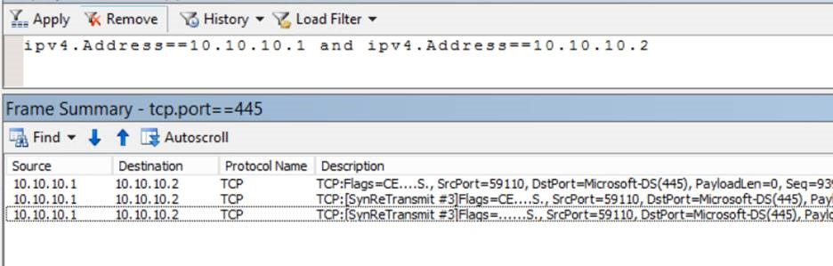
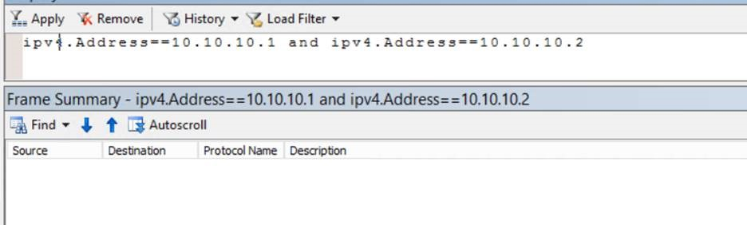
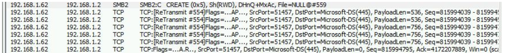
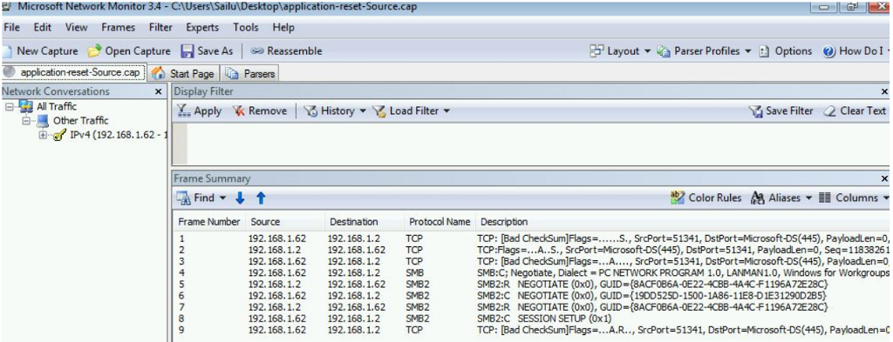
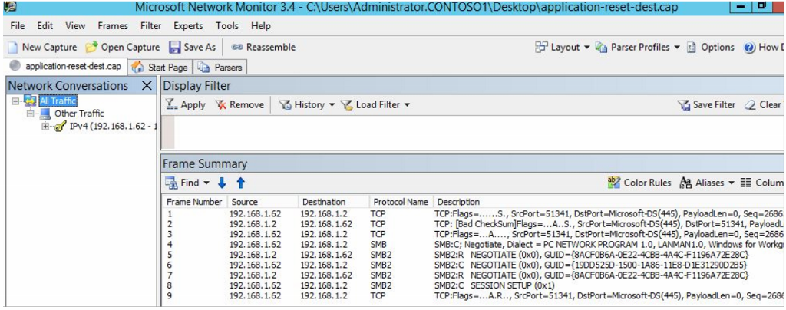
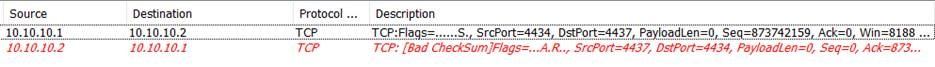
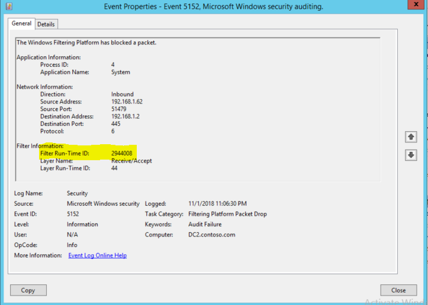
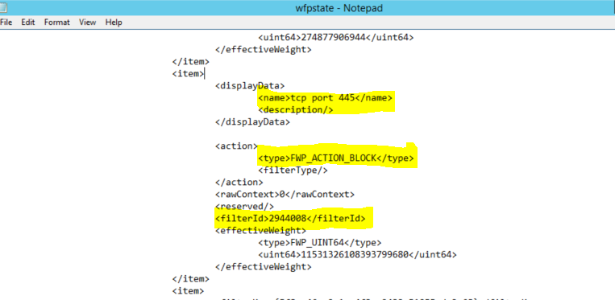

# Troubleshoot TCP/IP connectivity

You might come across connectivity errors on the application end or timeout errors. The following are the most common scenarios:
- Application connectivity to a database server
- SQL timeout errors
- BizTalk application timeout errors
- Remote Desktop Protocol (RDP) failures
- File share access failures
- General connectivity
 
When you suspect that the issue is on the network, you collect a network trace. The network trace would then be filtered. During troubleshooting connectivity errors, you might come across TCP reset in a network capture that could indicate a network issue.  
 
* TCP is defined as connection-oriented and reliable protocol. One of the ways in which TCP ensures reliability is through the handshake process. Establishing a TCP session would begin with a three-way handshake, followed by data transfer, and then a four-way closure. The four-way closure where both sender and receiver agree on closing the session is termed as *graceful closure*. After the 4-way closure, the server will allow 4 minutes of time (default), during which any pending packets on the network are to be processed, this is the TIME_WAIT state. After the TIME_WAIT state completes, all the resources allocated for this connection are released.  
 
* TCP reset is an abrupt closure of the session; it causes the resources allocated to the connection to be immediately released and all other information about the connection is erased.  
 
* TCP reset is identified by the RESET flag in the TCP header set to `1`.  
 
A network trace on the source and the destination helps you to determine the flow of the traffic and see at what point the failure is observed.  
 
The following sections describe some of the scenarios when you will see a RESET. 
 
## Packet drops
 
When one TCP peer is sending out TCP packets for which there is no response received from the other end, the TCP peer would end up retransmitting the data and when there is no response received, it would end the session by sending an ACK RESET (this means that the application acknowledges whatever data is exchanged so far, but because of packet drop, the connection is closed).  
 
The simultaneous network traces on source and destination will help you verify this behavior where on the source side you would see the packets being retransmitted and on the destination none of these packets are seen. This would mean, the network device between the source and destination is dropping the packets. 
 
If the initial TCP handshake is failing because of packet drops, then you would see that the TCP SYN packet is retransmitted only three times. 
    
Source side connecting on port 445:



Destination side: applying the same filter, you do not see any packets.



For the rest of the data, TCP will retransmit the packets five times.

**Source 192.168.1.62 side trace:**



**Destination 192.168.1.2 side trace:**
     
You would not see any of the above packets. Engage your network team to investigate with the different hops and see if any of them are potentially causing drops in the network.
    
If you are seeing that the SYN packets are reaching the destination, but the destination is still not responding, then verify if the port that you are trying to connect to is in the listening state. (Netstat output will help). If the port is listening and still there is no response, then there could be a wfp drop.  
 
## Incorrect parameter in the TCP header
 
You see this behavior when the packets are modified in the network by middle devices and TCP on the receiving end is unable to accept the packet, such as the sequence number being modified, or packets being replayed by middle device by changing the sequence number. Again, the simultaneous network trace on the source and destination will be able to tell you if any of the TCP headers are modified. Start by comparing the source trace and destination trace, you will be able to notice if there is a change in the packets itself or if any new packets are reaching the destination on behalf of the source.  
 
In this case, you'll again need help from the network team to identify any device that's modifying packets or replaying packets to the destination. The most common ones are RiverBed devices or WAN accelerators. 
 
     
## Application side reset
 
When you have identified that the resets are not due to retransmits or incorrect parameter or packets being modified with the help of network trace, then you have narrowed it down to application level reset.
    
The application resets are the ones where you see the Acknowledgment flag set to `1` along with the reset flag. This would mean that the server is acknowledging the receipt of the packet but for some reason it will not accept the connection. This is when the application that received the packet did not like something it received.  
 
In the below screenshots, you see that the packets seen on the source and the destination are the same without any modification or any drops, but you see an explicit reset sent by the destination to the source.
    
**Source Side**



**On the destination-side trace** 



You also see an ACK+RST flag packet in a case when the TCP establishment packet SYN is sent out. The TCP SYN packet is sent when the client wants to connect on a particular port, but if the destination/server for some reason does not want to accept the packet, it would send an ACK+RST packet.  



The application that's causing the reset (identified by port numbers) should be investigated to understand what is causing it to reset the connection. 
 
>[!Note]
>The above information is about resets from a TCP standpoint and not UDP. UDP is a connectionless protocol and the packets are sent unreliably. You would not see retransmission or resets when using UDP as a transport protocol. However, UDP makes use of ICMP as a error reporting protocol. When you have the UDP packet sent out on a port and the destination does not have port listed, you will see the destination sending out  **ICMP Destination host unreachable: Port unreachable** message immediately after the UDP packet
 
 
```
10.10.10.1  10.10.10.2  UDP UDP:SrcPort=49875,DstPort=3343
 
10.10.10.2  10.10.10.1  ICMP    ICMP:Destination Unreachable Message, Port Unreachable,10.10.10.2:3343
```
 
 
During the course of troubleshooting connectivity issue, you might also see in the network trace that a machine receives packets but does not respond to. In such cases, there could be a drop at the server level. To understand whether the local firewall is dropping the packet, enable the firewall auditing on the machine.
 
```
auditpol /set /subcategory:"Filtering Platform Packet Drop" /success:enable /failure:enable
```
 
You can then review the Security event logs to see for a packet drop on a particular port-IP and a filter ID associated with it.



Now, run the command `netsh wfp show state`, this will generate a wfpstate.xml file. After you open this file and filter for the ID that you find in the above event (2944008), you'll be able to see a firewall rule name that's associated with this ID that's blocking the connection.


