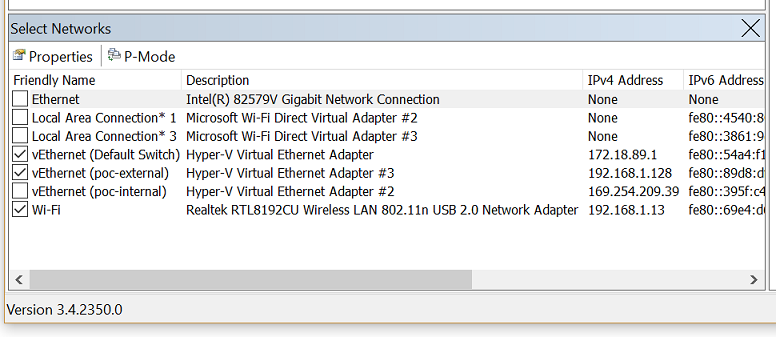
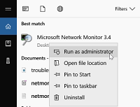
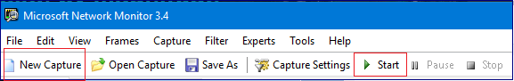
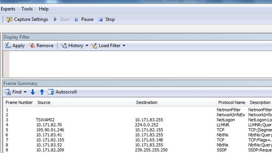

# Collect data using Network Monitor

In this topic, you will learn how to use Microsoft Network Monitor 3.4, which is a tool for capturing network traffic.

To get started, [download and run NM34_x64.exe](https://www.microsoft.com/download/details.aspx?id=4865). When you install Network Monitor, it installs its driver and hooks it to all the network adapters installed on the device. You can see the same on the adapter properties, as shown in the following image.

When the driver gets hooked to the network interface card (NIC) during installation, the NIC is reinitialized, which might cause a brief network glitch.

**To capture traffic**

1. Run netmon in an elevated status by choosing Run as Administrator.

    

2. Network Monitor opens with all network adapters displayed. Select the network adapters where you want to capture traffic, click **New Capture**, and then click **Start**.

    

3. Reproduce the issue, and you will see that Network Monitor grabs the packets on the wire.

    

4. Select **Stop**, and go to **File > Save as** to save the results. By default, the file will be saved as a ".cap" file.

The saved file has captured all the traffic that is flowing to and from the selected network adapters on the local computer. However, your interest is only to look into the traffic/packets that are related to the specific connectivity problem you are facing. So you will need to filter the network capture to see only the related traffic. 
 
**Commonly used filters**
 
- Ipv4.address=="client ip" and ipv4.address=="server ip"
- Tcp.port==
- Udp.port==
- Icmp 
- Arp 
- Property.tcpretranmits
- Property.tcprequestfastretransmits
- Tcp.flags.syn==1
 
>[!TIP]
>If you want to filter the capture for a specific field and do not know the syntax for that filter, just right-click that field and select **Add *the selected value* to Display Filter**. 
 
Network traces which are collected using the **netsh** commands built in to Windows are of the extension "ETL". However, these ETL files can be opened using Network Monitor for further analysis. 

## More information

[Intro to Filtering with Network Monitor 3.0](https://blogs.technet.microsoft.com/netmon/2006/10/17/intro-to-filtering-with-network-monitor-3-0/) 
[Network Monitor Filter Examples](https://blogs.technet.microsoft.com/rmilne/2016/08/11/network-monitor-filter-examples/) 
[Network Monitor Wireless Filtering](https://social.technet.microsoft.com/wiki/contents/articles/1900.network-monitor-wireless-filtering.aspx) 
[Network Monitor TCP Filtering](https://social.technet.microsoft.com/wiki/contents/articles/1134.network-monitor-tcp-filtering.aspx) 
[Network Monitor Conversation Filtering](https://social.technet.microsoft.com/wiki/contents/articles/1829.network-monitor-conversation-filtering.aspx) 
[How to setup and collect network capture using Network Monitor tool](https://blogs.technet.microsoft.com/msindiasupp/2011/08/10/how-to-setup-and-collect-network-capture-using-network-monitor-tool/) 
