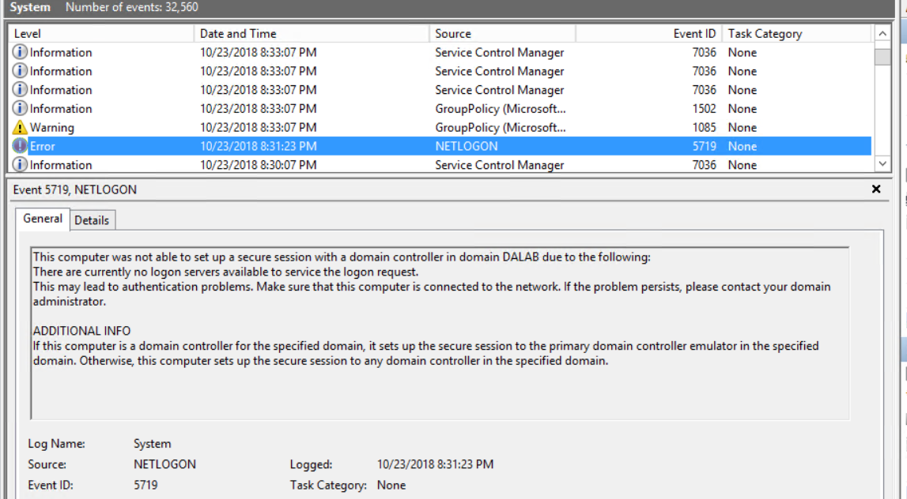
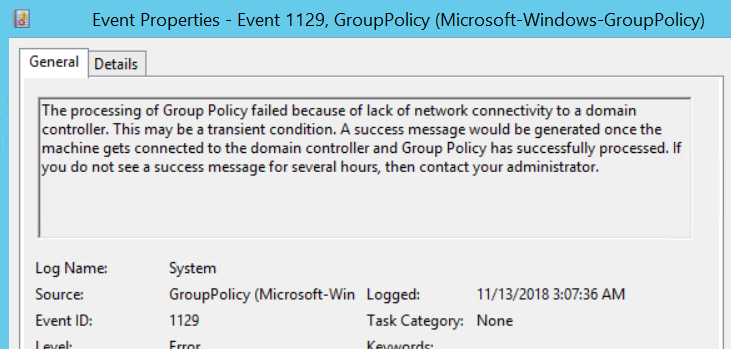
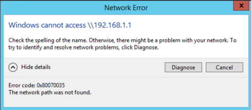
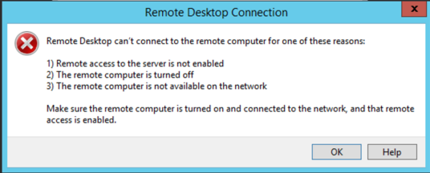
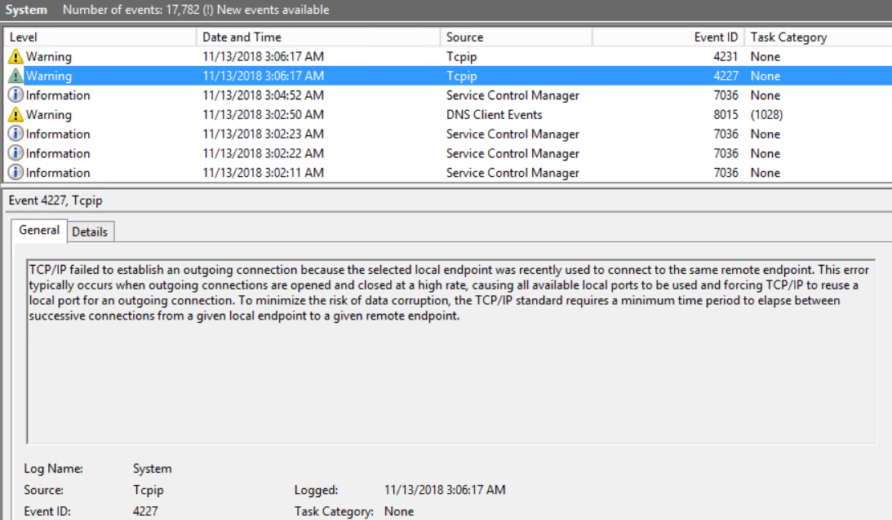
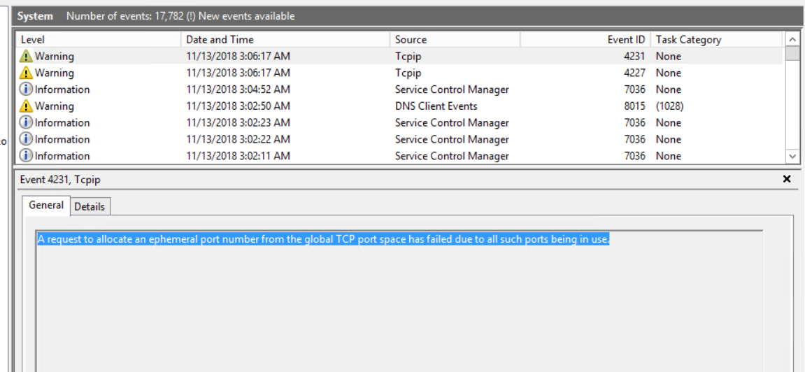
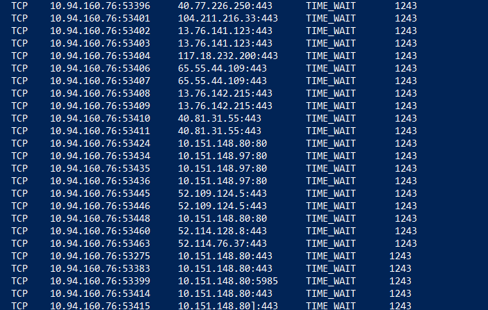
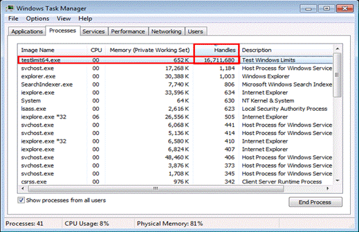
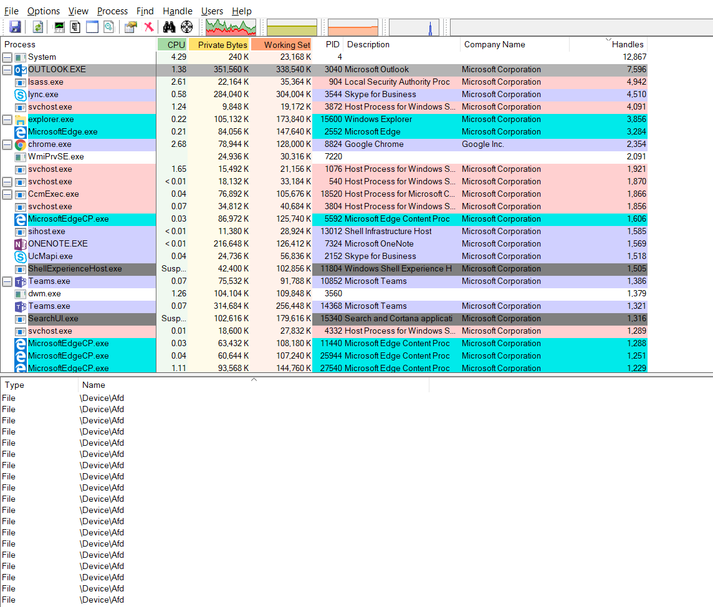

# Troubleshoot port exhaustion issues

TCP and UDP protocols work based on port numbers used for establishing connection. Any application or a service that needs to establish a TCP/UDP connection will require a port on its side. 
 
There are two types of ports:

- *Ephemeral ports*, which are usually dynamic ports, are the set of ports that every machine by default will have them to make an outbound connection.
- *Well-known ports* are the defined port for a particular application or service. For example, file server service is on port 445, HTTPS is 443, HTTP is 80, and RPC is 135. Custom application will also have their defined port numbers.
 
Clients when connecting to an application or service will make use of an ephemeral port from its machine to connect to a well-known port defined for that application or service. A browser on a client machine will use an ephemeral port to connect to https://www.microsoft.com on port 443.
 
In a scenario where the same browser is creating a lot of connections to multiple website, for any new connection that the browser is attempting, an ephemeral port is used. After some time, you will notice that the connections will start to fail and one high possibility for this would be because the browser has used all the available ports to make connections outside and any new attempt to establish a connection will fail as there are no more ports available. When all the ports are on a machine are used, we term it as *port exhaustion*. 
 
## Default dynamic port range for TCP/IP
 
To comply with [Internet Assigned Numbers Authority (IANA)](http://www.iana.org/assignments/port-numbers) recommendations, Microsoft has increased the dynamic client port range for outgoing connections. The new default start port is **49152**, and the new default end port is **65535**. This is a change from the configuration of earlier versions of Windows that used a default port range of **1025** through **5000**. 
 
You can view the dynamic port range on a computer by using the following netsh commands: 

- `netsh int ipv4 show dynamicport tcp` 
- `netsh int ipv4 show dynamicport udp` 
- `netsh int ipv6 show dynamicport tcp` 
- `netsh int ipv6 show dynamicport udp` 
 

The range is set separately for each transport (TCP or UDP). The port range is now a range that has a starting point and an ending point. Microsoft customers who deploy servers that are running Windows Server may have problems that affect RPC communication between servers if firewalls are used on the internal network. In these situations, we recommend that you reconfigure the firewalls to allow traffic between servers in the dynamic port range of **49152** through **65535**. This range is in addition to well-known ports that are used by services and applications. Or, the port range that is used by the servers can be modified on each server. You adjust this range by using the netsh command, as follows. The above command sets the dynamic port range for TCP. 
 
```cmd
netsh int <ipv4|ipv6> set dynamic <tcp|udp> start=number num=range
```
 
The start port is number, and the total number of ports is range. The following are sample commands:
 
- `netsh int ipv4 set dynamicport tcp start=10000 num=1000`
- `netsh int ipv4 set dynamicport udp start=10000 num=1000`
- `netsh int ipv6 set dynamicport tcp start=10000 num=1000`
- `netsh int ipv6 set dynamicport udp start=10000 num=1000`
 
These sample commands set the dynamic port range to start at port 10000 and to end at port 10999 (1000 ports). The minimum range of ports that can be set is 255. The minimum start port that can be set is 1025. The maximum end port (based on the range being configured) cannot exceed 65535. To duplicate the default behavior of Windows Server 2003, use 1025 as the start port, and then use 3976 as the range for both TCP and UDP. This results in a start port of 1025 and an end port of 5000.
 
Specifically, about outbound connections as incoming connections will not require an Ephemeral port for accepting connections.
 
Since outbound connections start to fail, you will see a lot of the below behaviors:
 
- Unable to sign in to the machine with domain credentials, however sign-in with local account works. Domain sign-in will require you to contact the DC for authentication which is again an outbound connection. If you have cache credentials set, then domain sign-in might still work.

    

- Group Policy update failures:

    

- File shares are inaccessible:

    

- RDP from the affected server fails:

    

- Any other application running on the machine will start to give out errors

Reboot of the server will resolve the issue temporarily, but you would see all the symptoms come back after a period of time.

If you suspect that the machine is in a state of port exhaustion: 
 
1.	Try making an outbound connection. From the server/machine, access a remote share or try an RDP to another server or telnet to a server on a port. If the outbound connection fails for all of these, go to the next step.

2.	Open event viewer and under the system logs, look for the events which clearly indicate the current state: 

    a.	**Event ID 4227**

    

    b.	**Event ID 4231**

    

3. Collect a `netstat -anob output` from the server. The netstat output will show you a huge number of entries for TIME_WAIT state for a single PID.

    

After a graceful closure or an abrupt closure of a session, after a period of 4 minutes (default), the port used the process or application would be released back to the available pool. During this 4 minutes, the TCP connection state will be TIME_WAIT state. In a situation where you suspect port exhaustion, an application or process will not be able to release all the ports that it has consumed and will remain in the TIME_WAIT state.
 
You may also see CLOSE_WAIT state connections in the same output, however CLOSE_WAIT state is a state when one side of the TCP peer has no more data to send (FIN sent) but is able to receive data from the other end. This state does not necessarily indicate port exhaustion.
 
>[!Note]
>Having huge connections in TIME_WAIT state does not always indicate that the server is currently out of ports unless the first two points are verified. Having lot of TIME_WAIT connections does indicate that the process is creating lot of TCP connections and may eventually lead to port exhaustion.
>
>Netstat has been updated in Windows 10 with the addition of the **-Q** switch to show ports that have transitioned out of time wait as in the BOUND state.  An update for Windows 8.1 and Windows Server 2012 R2 has been released that contains this functionality. The PowerShell cmdlet `Get-NetTCPConnection` in Windows 10 also shows these BOUND ports.
>
>Until 10/2016, netstat was inaccurate. Fixes for netstat, back-ported to 2012 R2, allowed Netstat.exe and Get-NetTcpConnection to correctly report TCP or UDP port usage in Windows Server 2012 R2. See [Windows Server 2012 R2: Ephemeral ports hotfixes](https://support.microsoft.com/help/3123245/update-improves-port-exhaustion-identification-in-windows-server-2012) to learn more.
 
4.	Open a command prompt in admin mode and run the below command

    ```cmd
    Netsh trace start scenario=netconnection capture=yes tracefile=c:\Server.etl
    ```

5.	Open the server.etl file with [Network Monitor](troubleshoot-tcpip-netmon.md) and in the filter section, apply the filter **Wscore_MicrosoftWindowsWinsockAFD.AFD_EVENT_BIND.Status.LENTStatus.Code == 0x209**. You should see entries which say **STATUS_TOO_MANY_ADDRESSES**. If you do not find any entries, then the server is still not out of ports. If you find them, then you can confirm that the server is under port exhaustion.
 
## Troubleshoot Port exhaustion
 
The key is to identify which process or application is using all the ports. Below are some of the tools that you can use to isolate to one single process
 
### Method 1

Start by looking at the netstat output. If you are using Windows 10 or Windows Server 2016, then you can run the command `netstat -anobq` and check for the process ID which has maximum entries as BOUND. Alternately, you can also run the below Powershell command to identify the process:

```Powershell
Get-NetTCPConnection | Group-Object -Property State, OwningProcess | Select -Property Count, Name, @{Name="ProcessName";Expression={(Get-Process -PID ($_.Name.Split(',')[-1].Trim(' '))).Name}}, Group | Sort Count -Descending 
```

Most port leaks are caused by user-mode processes not correctly closing the ports when an error was encountered. At the user-mode level ports (actually sockets) are handles. Both **TaskManager** and **ProcessExplorer** are able to display handle counts which allows you to identify which process is consuming all of the ports.
 
For Windows 7 and Windows Server 2008 R2, you can update your Powershell version to include the above cmdlet. 
 
### Method 2

If method 1 does not help you identify the process (prior to Windows 10 and Windows Server 2012 R2), then have a look at Task Manager: 

1.	Add a column called “handles” under details/processes.
2.	Sort the column handles to identify the process with the highest number of handles. Usually the process with handles greater than 3000 could be the culprit except for processes like System, lsass.exe, store.exe, sqlsvr.exe.

    

3.	If any other process than these has a higher number, stop that process and then try to login using domain credentials and see if it succeeds.
 
### Method 3

If Task Manager did not help you identify the process, then use Process Explorer to investigate the issue.
 
Steps to use Process explorer: 

1.	[Download Process Explorer](https://docs.microsoft.com/sysinternals/downloads/process-explorer) and run it **Elevated**. 
2.	Alt + click the column header, select **Choose Columns**, and on the **Process Performance** tab, add **Handle Count**.
3.	Select **View \ Show Lower Pane**.
4.	Select **View \ Lower Pane View \ Handles**.
5.	Click the **Handles** column to sort by that value.
6.	Examine the processes with higher handle counts than the rest (will likely be over 10,000 if you can't make outbound connections).
7.	Click to highlight one of the processes with a high handle count.
8.	In the lower pane, the handles listed as below are sockets. (Sockets are technically file handles).
    
    File   \Device\AFD

    

10. Some are normal, but large numbers of them are not (hundreds to thousands). Close the process in question. If that restores outbound connectivity, then you have further proven that the app is the cause. Contact the vendor of that app.
 
Finally, if the above methods did not help you isolate the process, we suggest you collect a complete memory dump of the machine in the issue state. The dump will tell you which process has the maximum handles.
 
As a workaround, rebooting the computer will get the it back in normal state and would help you resolve the issue for the time being. However, when a reboot is impractical, you can also consider increasing the number of ports on the machine using the below commands:

```cmd
netsh int ipv4 set dynamicport tcp start=10000 num=1000
```

This will set the dynamic port range to start at port 10000 and to end at port 10999 (1000 ports). The minimum range of ports that can be set is 255. The minimum start port that can be set is 1025. The maximum end port (based on the range being configured) cannot exceed 65535.
 
>[!NOTE]
>Note that increasing the dynamic port range is not a permanent solution but only temporary. You will need to track down which process/processors are consuming max number of ports and troubleshoot from that process standpoint as to why its consuming such high number of ports. 

For Windows 7 and Windows Server 2008 R2, you can use the below script to collect the netstat output at defined frequency. From the outputs, you can see the port usage trend.

```
@ECHO ON
set v=%1
:loop
set /a v+=1
ECHO %date% %time% >> netstat.txt
netstat -ano >> netstat.txt
 
PING 1.1.1.1 -n 1 -w 60000 >NUL
 
goto loop
```


 
## Useful links

- [Port Exhaustion and You!](https://blogs.technet.microsoft.com/askds/2008/10/29/port-exhaustion-and-you-or-why-the-netstat-tool-is-your-friend/) - this article gives a detail on netstat states and how you can use netstat output to determine the port status

- [Detecting ephemeral port exhaustion](https://blogs.technet.microsoft.com/yongrhee/2018/01/09/windows-server-2012-r2-ephemeral-ports-a-k-a-dynamic-ports-hotfixes/): this article has a script which will run in a loop to report the port status. (Applicable for Windows 2012 R2, Windows 8, Windows 10)

