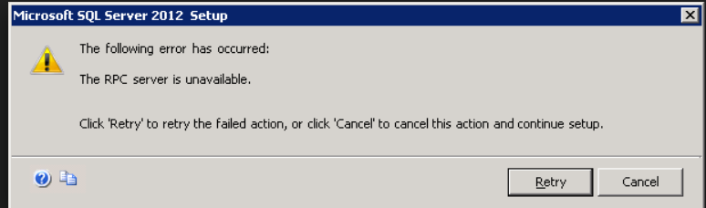
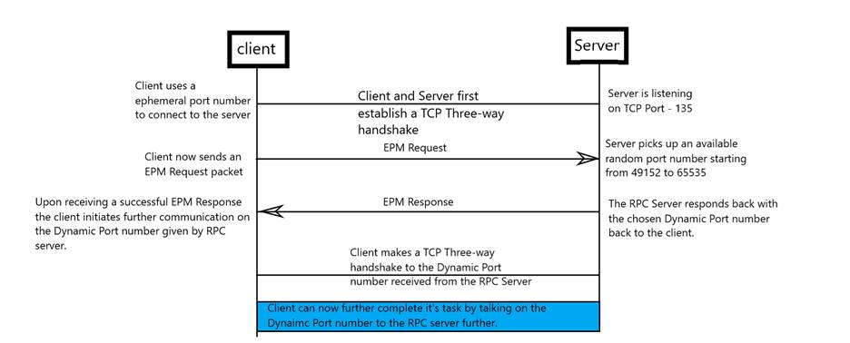
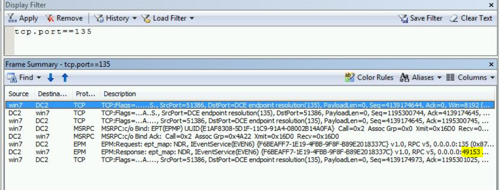
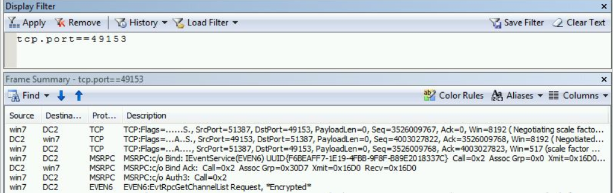
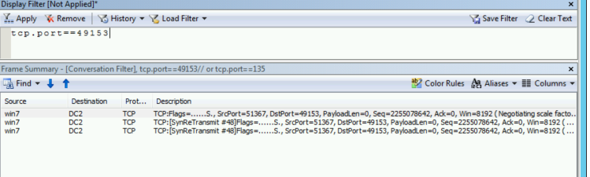

# Troubleshoot Remote Procedure Call (RPC) errors

You might encounter an **RPC server unavailable** error when connecting to Windows Management Instrumentation (WMI), SQL Server, during a remote connection, or for some Microsoft Management Console (MMC) snap-ins. The following image is an example of an RPC error.



This is a commonly encountered error message in the networking world and one can lose hope very fast without trying to understand much, as to what is happening ‘under the hood’. 

Before getting in to troubleshooting the **RPC server unavailable*- error, let’s first understand basics about the error. There are a few important terms to understand:

- Endpoint mapper – a service listening on the server, which guides client apps to server apps by port and UUID.
- Tower – describes the RPC protocol, to allow the client and server to negotiate a connection.
- Floor – the contents of a tower with specific data like ports, IP addresses, and identifiers.
- UUID – a well-known GUID that identifies the RPC application. The UUID is what you use to see a specific kind of RPC application conversation, as there are likely to be many.
- Opnum – the identifier of a function that the client wants the server to execute. It’s just a hexadecimal number, but a good network analyzer will translate the function for you. If neither knows, your application vendor must tell you.
- Port – the communication endpoints for the client and server applications.
- Stub data – the information given to functions and data exchanged between the client and server. This is the payload, the important part.
 
>[!Note]
> A lot of the above information is used in troubleshooting, the most important is the Dynamic RPC port number you get while talking to EPM.
 
## How the connection works

Client A wants to execute some functions or wants to make use of a service running on the remote server, will first establish the connection with the Remote Server by doing a three-way handshake.  



RPC ports can be given from a specific range as well.
### Configure RPC dynamic port allocation
 
Remote Procedure Call (RPC) dynamic port allocation is used by server applications and remote administration applications such as Dynamic Host Configuration Protocol (DHCP) Manager, Windows Internet Name Service (WINS) Manager, and so on. RPC dynamic port allocation will instruct the RPC program to use a particular random port in the range configured for TCP and UDP, based on the implementation of the operating system used. 
 
Customers using firewalls may want to control which ports RPC is using so that their firewall router can be configured to forward only these Transmission Control Protocol (UDP and TCP) ports. Many RPC servers in Windows let you specify the server port in custom configuration items such as registry entries. When you can specify a dedicated server port, you know what traffic flows between the hosts across the firewall, and you can define what traffic is allowed in a more directed manner.
 
As a server port, please choose a port outside of the range you may want to specify below. You can find a comprehensive list of server ports that are used in Windows and major Microsoft products in the article [Service overview and network port requirements for Windows](https://support.microsoft.com/help/832017).
The article also lists the RPC servers and which RPC servers can be configured to use custom server ports beyond the facilities the RPC runtime offers. 
 
Some firewalls also allow for UUID filtering where it learns from a RPC Endpoint Mapper request for a RPC interface UUID. The response has the server port number, and a subsequent RPC Bind on this port is then allowed to pass.
 
With Registry Editor, you can modify the following parameters for RPC. The RPC Port key values discussed below are all located in the following key in the registry:
 
**HKEY_LOCAL_MACHINE\Software\Microsoft\Rpc\Internet\ Entry name Data Type**

**Ports REG_MULTI_SZ**
 
- Specifies a set of IP port ranges consisting of either all the ports available from the Internet or all the ports not available from the Internet. Each string represents a single port or an inclusive set of ports. For example, a single port may be represented by **5984**, and a set of ports may be represented by **5000-5100**. If any entries are outside the range of 0 to 65535, or if any string cannot be interpreted, the RPC runtime treats the entire configuration as invalid.
 
**PortsInternetAvailable REG_SZ Y or N (not case-sensitive)**
 
- If Y, the ports listed in the Ports key are all the Internet-available ports on that computer. If N, the ports listed in the Ports key are all those ports that are not Internet-available.
 
**UseInternetPorts REG_SZ ) Y or N (not case-sensitive)**
 
- Specifies the system default policy.
- If Y, the processes using the default will be assigned ports from the set of Internet-available ports, as defined previously.
- If N, the processes using the default will be assigned ports from the set of intranet-only ports.
 
**Example:**

In this example ports 5000 through 6000 inclusive have been arbitrarily selected to help illustrate how the new registry key can be configured. This is not a recommendation of a minimum number of ports needed for any particular system.

1.	Add the Internet key under: HKEY_LOCAL_MACHINE\Software\Microsoft\Rpc

2.	Under the Internet key, add the values "Ports" (MULTI_SZ), "PortsInternetAvailable" (REG_SZ), and "UseInternetPorts" (REG_SZ).

    For example, the new registry key appears as follows:
    Ports: REG_MULTI_SZ: 5000-6000
    PortsInternetAvailable: REG_SZ: Y
    UseInternetPorts: REG_SZ: Y

3.	Restart the server. All applications that use RPC dynamic port allocation use ports 5000 through 6000, inclusive. 

You should open up a range of ports above port 5000. Port numbers below 5000 may already be in use by other applications and could cause conflicts with your DCOM application(s). Furthermore, previous experience shows that a minimum of 100 ports should be opened, because several system services rely on these RPC ports to communicate with each other.
 
>[!Note]
>The minimum number of ports required may differ from computer to computer. Computers with higher traffic may run into a port exhaustion situation if the RPC dynamic ports are restricted. Take this into consideration when restricting the port range.
 
>[!WARNING]
>If there is an error in the port configuration or there are insufficient ports in the pool, the Endpoint Mapper Service will not be able to register RPC servers with dynamic endpoints. When there is a configuration error, the error code will be 87 (0x57) ERROR_INVALID_PARAMETER. This can affect Windows RPC servers as well, such as Netlogon. It will log event 5820 in this case:
> 
>Log Name: System
>Source: NETLOGON
>Event ID: 5820
>Level: Error
>Keywords: Classic
>Description:
>The Netlogon service could not add the AuthZ RPC interface. The service was terminated. The following error occurred: 'The parameter is incorrect.'
 
If you would like to do a deep dive as to how it works, see [RPC over IT/Pro](https://blogs.technet.microsoft.com/askds/2012/01/24/rpc-over-itpro/).
 
 
## Troubleshooting RPC error
 
### PortQuery

The best thing to always troubleshoot RPC issues before even getting in to traces is by making use of tools like **PortQry**. You can quickly determine if you are able to make a connection by running the command:

```cmd
Portqry.exe -n <ServerIP> -e 135
``` 
 
This would give you a lot of output to look for, but you should be looking for **ip_tcp*- and the port number in the brackets, which tells whether you were successfully able to get a dynamic port from EPM and also make a connection to it. If the above fails, you can typically start collecting simultaneous network traces. Something like this from the output of “PortQry”:

```cmd 
Portqry.exe -n 169.254.0.2 -e 135
```
Partial output below:
 
>Querying target system called:
>169.254.0.2
>Attempting to resolve IP address to a name...
>IP address resolved to RPCServer.contoso.com
>querying...
>TCP port 135 (epmap service): LISTENING
>Using ephemeral source port
>Querying Endpoint Mapper Database...
>Server's response:
>UUID: d95afe70-a6d5-4259-822e-2c84da1ddb0d
>ncacn_ip_tcp:169.254.0.10**[49664]**

 
The one in bold is the ephemeral port number that you made a connection to successfully. 
 
### Netsh

You can run the commands below to leverage Windows inbuilt netsh captures, to collect a simultaneous trace. Remember to execute the below on an “Admin CMD”, it requires elevation.
 
- On the client
```cmd
Netsh trace start scenario=netconnection capture=yes tracefile=c:\client_nettrace.etl maxsize=512 overwrite=yes report=yes
```
 
- On the Server
```cmd
Netsh trace start scenario=netconnection capture=yes tracefile=c:\server_nettrace.etl maxsize=512 overwrite=yes report=yes
```

Now try to reproduce your issue from the client machine and as soon as you feel the issue has been reproduced, go ahead and stop the traces using the command
```cmd
Netsh trace stop
```

Open the traces in [Microsoft Network Monitor 3.4](troubleshoot-tcpip-netmon.md) or Message Analyzer and filter the trace for

- Ipv4.address==<client-ip> and ipv4.address==<server-ip> and tcp.port==135 or just tcp.port==135 should help.

- Look for the “EPM” Protocol Under the “Protocol” column.

- Now check if you are getting a response from the server. If you get a response, note the dynamic port number that you have been allocated to use.

    

- Check if we are connecting successfully to this Dynamic port successfully.

- The filter should be something like this: tcp.port==<dynamic-port-allocated> and ipv4.address==<server-ip> 

    

This should help you verify the connectivity and isolate if any network issues are seen.


### Port not reachable

The most common reason why we would see the RPC server unavailable is when the dynamic port that the client tries to connect is not reachable. The client side trace would then show TCP SYN retransmits for the dynamic port.
 

 
The port cannot be reachable due to one of the following reasons:

- The dynamic port range is blocked on the firewall in the environment. 
- A middle device is dropping the packets. 
- The destination server is dropping the packets (WFP drop / NIC drop/ Filter driver etc).


