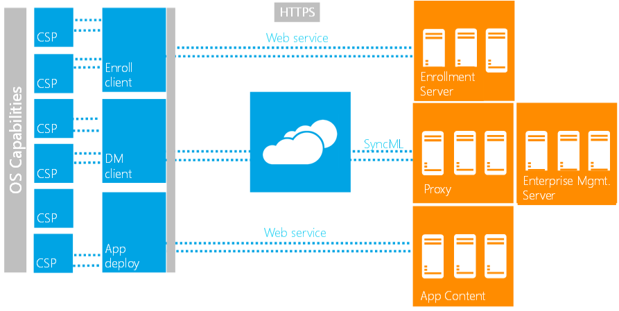

# Enterprise settings and policy management

The actual management interaction between the device and server is done via the DMClient. The DMClient communicates with the enterprise management server via DM v1.2 SyncML syntax. The full description of the OMA DM protocol v1.2 can be found at the [OMA website](https://technical.openmobilealliance.org/).

Enterprise MDM settings are exposed via various configuration service providers to the DMClient. For the list of available configuration service providers, see [Configuration service provider reference](mdm/index.yml).

Windows currently supports one MDM server. The DMClient that is configured via the enrollment process is granted access to enterprise related settings. During the enrollment process, the task scheduler is configured to invoke the DMClient to periodically poll the MDM server.

The following diagram shows the work flow between server and client.

## Management workflow

This protocol defines an HTTPS-based client/server communication with DM SyncML XML as the package payload that carries management requests and execution results. The configuration request is addressed via a managed object (MO). The settings supported by the managed object are represented in a conceptual tree structure. This logical view of configurable device settings simplifies the way the server addresses the device settings by isolating the implementation details from the conceptual tree structure.

To facilitate security-enhanced communication with the remote server for enterprise management, Windows supports certificate-based mutual authentication over an encrypted TLS/SSL HTTP channel between the DMClient and management service. The server and client certificates are provisioned during the enrollment process.

The DMClient configuration, company policy enforcement, business application management, and device inventory are all exposed or expressed via configuration service providers (CSPs). CSPs are the Windows term for managed objects. The DMClient communicates with the server and sends configuration request to CSPs. The server only needs to know the logical local URIs defined by those CSP nodes in order to use the DM protocol XML to manage the device.

Here's a summary of the DM tasks supported for enterprise management:

- **Company policy management**: Company policies are supported via the Policy CSP allows the enterprise to manage various settings. It enables the management service to configure device lock related policies, disable/enable the storage card, and query the device encryption status. The RemoteWipe CSP allows IT pros to remotely fully wipe the internal user data storage.
- **Enterprise application management**: This task is addressed via the Enterprise ModernApp Management CSP and several ApplicationManagement-related policies. It's used to install the enterprise token, query installed business application names and versions, etc. This CSP is only accessible by the enterprise service.
- **Certificate management**: CertificateStore CSP, RootCACertificate CSP, and ClientCertificateInstall CSP are used to install certificates.
- **Basic device inventory and asset management**: Some basic device information can be retrieved via the DevInfo CSP, DevDetail CSPs and the DeviceStatus CSP. These provide basic device information such as OEM name, device model, hardware version, OS version, processor types, etc. This information is for asset management and device targeting. The NodeCache CSP enables the device to only send out delta inventory settings to the server to reduce over-the-air data usage. The NodeCache CSP is only accessible by the enterprise service.
