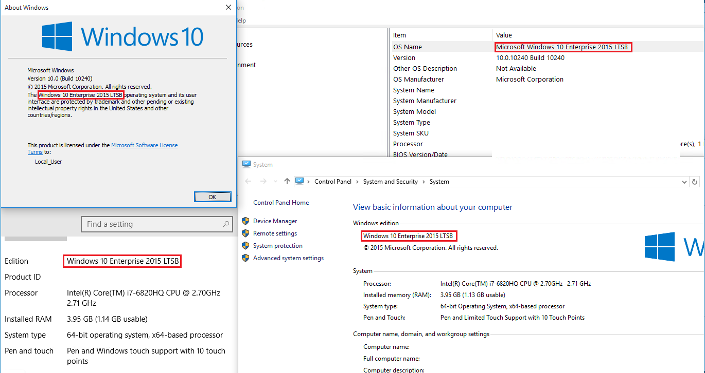
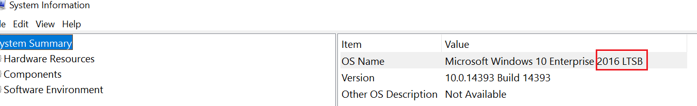

# What version of Windows am I running?

To determine if your device is enrolled in the [Long-Term Servicing Channel](https://docs.microsoft.com/windows/deployment/update/waas-overview#servicing-channels) (LTSC, formerly LTSB) or the [Semi-Annual Channel](https://docs.microsoft.com/windows/deployment/update/waas-overview#servicing-channels) (SAC) you'll need to know what version of Windows 10 you're running. There are a few ways to figure this out. Each method provides a different set of details, so it’s useful to learn about all of them. 

## System Properties
Click **Start** > **Settings** > **System** > click **About** from the bottom of the left-hand menu

You'll now see **Edition**, **Version**, and **OS Build** information. Something like this:

## Using Keyword Search
You can simply type the following in the search bar and press **ENTER** to see version details for your device. 

**“winver”**

**“msinfo”** or **"msinfo32"** to open **System Information**:

## Using Command Prompt or PowerShell
At the Command Prompt or PowerShell interface, type **"systeminfo | findstr /B /C:"OS Name" /B /C:"OS Version"** and then press **ENTER**

At the Command Prompt or PowerShell, type **"slmgr /dlv"**, and then press ENTER. The /dlv command displays the detailed licensing information. Notice the output displays "EnterpriseS" as seen in the image below:

## What does it all mean?

The Long-term Servicing Channel is available only in the Windows 10 Enterprise LTSB edition. This build of Windows doesn’t contain many in-box applications, such as Microsoft Edge, Microsoft Store, Cortana (you do have some limited search capabilities), Microsoft Mail, Calendar, OneNote, Weather, News, Sports, Money, Photos, Camera, Music, and Clock. It’s important to remember that the LTSC model is primarily for specialized devices.

In the Semi-Annual Channel, you can set feature updates as soon as Microsoft releases them. This servicing modal is ideal for pilot deployments and to test Windows 10 feature updates and for users like developers who need to work with the latest features immediately. Once you've tested the latest release, you can choose when to roll it out broadly in your deployment.
