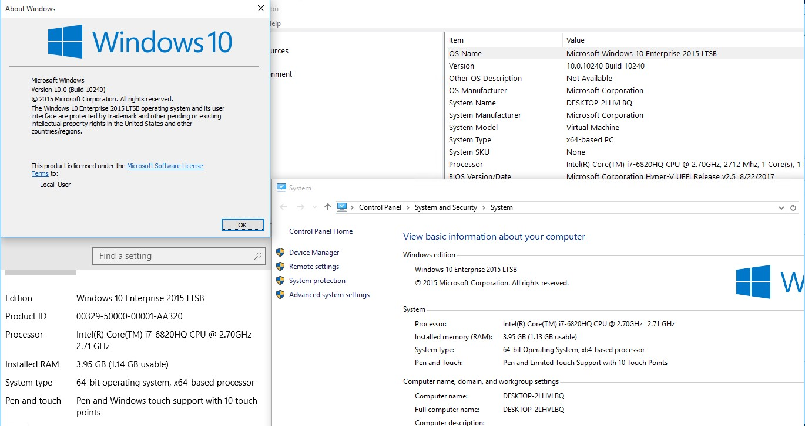
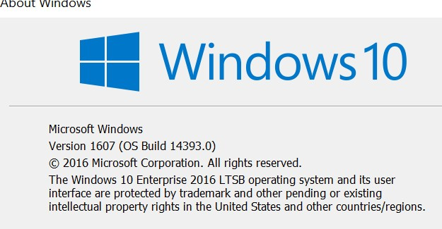
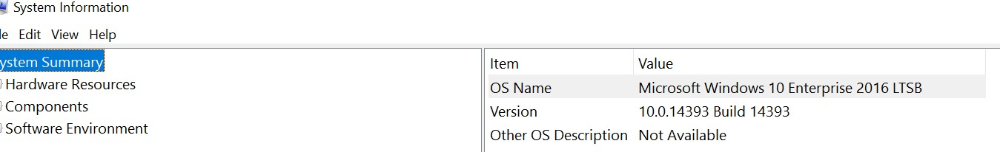

# What version of Windows am I running?

To determine if your device is enrolled in the [Long-Term Servicing Channel](https://docs.microsoft.com/en-us/windows/deployment/update/waas-overview#servicing-channels) (LTSC, formerly LTSB) or the [Semi-Annual Channel](https://docs.microsoft.com/en-us/windows/deployment/update/waas-overview#servicing-channels) (SAC) you will need to know what version of Windows 10 you are running. There are a few separate ways to figure out which version of Windows you are running. Each method will reveal a varied set of details, so it’s useful to learn about all of them. 

## System Properties
1.	Click the **start** button
2.	Select **settings** using the cog icon
3.	Choose **settings** from the Windows Settings menu
4.	Select **about** from the bottom of the left-hand menu 

You will now see **Edition**, **Version**, and **OS Build** information listed below. 

## Keyword Search
You can simply type **“winver”** in the search bar to display version details of your device. 

Alternatively, in the search bar you can type **“msinfo”** to display the information below:

## What does it all mean?

The Long-term Servicing Channel is available only in the Windows 10 Enterprise LTSB edition. This build of Windows doesn’t contain many in-box applications, such as Microsoft Edge, Microsoft Store, Cortana (limited search capabilities remain available), Microsoft Mail, Calendar, OneNote, Weather, News, Sports, Money, Photos, Camera, Music, and Clock. Therefore, it’s important to remember that Microsoft has positioned the LTSC model primarily for specialized devices.

In the Semi-Annual servicing channel, feature updates are available as soon as Microsoft releases them. This servicing modal is ideal for pilot deployments and testing of Windows 10 feature updates and for users such as developers who need to work with the latest features immediately. Once the latest release went through pilot deployment and testing, you choose the timing at which it goes into broad deployment.