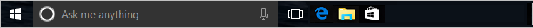

# Configure Windows 10 taskbar

Starting in Windows 10, version 1607, administrators can pin additional apps to the taskbar and remove default pinned apps from the taskbar by adding a `<TaskbarLayout>` section to a layout modification XML file. This method never removes user-pinned apps from the taskbar.

> [!NOTE]
> The only aspect of the taskbar that can currently be configured by the layout modification XML file is the layout.

You can specify different taskbar configurations based on device locale and region. There is no limit on the number of apps that you can pin. You specify apps using the [Application User Model ID (AUMID)](https://go.microsoft.com/fwlink/p/?LinkId=614867) or Desktop Application Link Path (the local path to the application). 

If you specify an app to be pinned that is not provisioned for the user on the computer, the pinned icon won't appear on the taskbar.

The order of apps in the XML file dictates the order of pinned apps on the taskbar from left to right, to the right of any existing apps pinned by the user.

> [!NOTE]
> In operating systems configured to use a right-to-left language, the taskbar order will be reversed.

The following example shows how apps will be pinned: Windows default apps to the left (blue circle), apps pinned by the user in the center (orange triangle), and apps that you pin using the XML file to the right (green square).


## Configure taskbar (general)

**To configure the taskbar:**

1. Create the XML file.
   * If you are also [customizing the Start layout](customize-and-export-start-layout.md), use `Export-StartLayout` to create the XML, and then add the `<CustomTaskbarLayoutCollection>` section from [the following sample](#sample-taskbar-configuration-added-to-start-layout-xml-file) to the file.
   * If you are only configuring the taskbar, use [the following sample](#sample-taskbar-configuration-xml-file) to create a layout modification XML file.
2. Edit and save the XML file. You can use [AUMID](https://go.microsoft.com/fwlink/p/?LinkId=614867) or Desktop Application Link Path to identify the apps to pin to the taskbar.
   * Add `xmlns:taskbar="http://schemas.microsoft.com/Start/2014/TaskbarLayout"` to the first line of the file, before the closing \>.
   * Use `<taskbar:UWA>` and [AUMID](https://go.microsoft.com/fwlink/p/?LinkId=614867) to pin Universal Windows Platform apps.
   * Use `<taskbar:DesktopApp>` and Desktop Application Link Path to pin desktop applications. 
3. Apply the layout modification XML file to devices using [Group Policy](customize-windows-10-start-screens-by-using-group-policy.md) or a [provisioning package created in Windows Imaging and Configuration Designer (Windows ICD)](customize-windows-10-start-screens-by-using-provisioning-packages-and-icd.md).

>[!IMPORTANT]
>If you use a provisioning package or import-startlayout to configure the taskbar, your configuration will be reapplied each time the explorer.exe process restarts. If your configuration pins an app and the user then unpins that app, the user's change will be overwritten the next time the configuration is applied. To apply a taskbar configuration that allows users to make changes that will persist, apply your configuration by using Group Policy.
>
>If you use Group Policy and your configuration only contains a taskbar layout, the default Windows tile layout will be applied and cannot be changed by users. If you use Group Policy and your configuration includes taskbar and a full Start layout, users can only make changes to the taskbar. If you use Group Policy and your configuration includes taskbar and a [partial Start layout](https://technet.microsoft.com/itpro/windows/manage/customize-and-export-start-layout#configure-a-partial-start-layout), users can make changes to the taskbar and to tile groups not defined in the partial Start layout.

### Tips for finding AUMID and Desktop Application Link Path

In the layout modification XML file, you will need to add entries for applications in the XML markup. In order to pin an application, you need either its AUMID or Desktop Application Link Path. 

The easiest way to find this data for an application is to:
1.  Pin the application to the Start menu on a reference or testing PC.
2.  Open Windows PowerShell and run the `Export-StartLayout` cmdlet. 
3.  Open the generated XML file. 
4.  Look for an entry corresponding to the app you pinned.
5.  Look for a property labeled `AppUserModelID` or `DesktopApplicationLinkPath`. 


### Sample taskbar configuration XML file

```xml
<?xml version="1.0" encoding="utf-8"?>
<LayoutModificationTemplate
    xmlns="http://schemas.microsoft.com/Start/2014/LayoutModification"
    xmlns:defaultlayout="http://schemas.microsoft.com/Start/2014/FullDefaultLayout"
    xmlns:start="http://schemas.microsoft.com/Start/2014/StartLayout"
    xmlns:taskbar="http://schemas.microsoft.com/Start/2014/TaskbarLayout"
    Version="1">
  <CustomTaskbarLayoutCollection>
    <defaultlayout:TaskbarLayout>
      <taskbar:TaskbarPinList>
        <taskbar:UWA AppUserModelID="Microsoft.MicrosoftEdge_8wekyb3d8bbwe!MicrosoftEdge" />
        <taskbar:DesktopApp DesktopApplicationLinkPath="%APPDATA%\Microsoft\Windows\Start Menu\Programs\System Tools\File Explorer.lnk" />
      </taskbar:TaskbarPinList>
    </defaultlayout:TaskbarLayout>
 </CustomTaskbarLayoutCollection>
</LayoutModificationTemplate>
```
### Sample taskbar configuration added to Start layout XML file

```xml
<?xml version="1.0" encoding="utf-8"?>
<LayoutModificationTemplate
    xmlns="http://schemas.microsoft.com/Start/2014/LayoutModification"
    xmlns:defaultlayout="http://schemas.microsoft.com/Start/2014/FullDefaultLayout"
    xmlns:start="http://schemas.microsoft.com/Start/2014/StartLayout"
    xmlns:taskbar="http://schemas.microsoft.com/Start/2014/TaskbarLayout"
    Version="1">
  <LayoutOptions StartTileGroupCellWidth="6" StartTileGroupsColumnCount="1" />
  <DefaultLayoutOverride>
    <StartLayoutCollection>
      <defaultlayout:StartLayout GroupCellWidth="6" xmlns:defaultlayout="http://schemas.microsoft.com/Start/2014/FullDefaultLayout">
        <start:Group Name="Life at a glance" xmlns:start="http://schemas.microsoft.com/Start/2014/StartLayout">
          <start:Tile Size="2x2" Column="0" Row="0" AppUserModelID="Microsoft.MicrosoftEdge_8wekyb3d8bbwe!MicrosoftEdge" />
          <start:Tile Size="2x2" Column="4" Row="0" AppUserModelID="Microsoft.Windows.Cortana_cw5n1h2txyewy!CortanaUI" />
          <start:Tile Size="2x2" Column="2" Row="0" AppUserModelID="Microsoft.BingWeather_8wekyb3d8bbwe!App" />
        </start:Group>        
      </defaultlayout:StartLayout>
    </StartLayoutCollection>
  </DefaultLayoutOverride>
    <CustomTaskbarLayoutCollection>
      <defaultlayout:TaskbarLayout>
        <taskbar:TaskbarPinList>
          <taskbar:UWA AppUserModelID="Microsoft.MicrosoftEdge_8wekyb3d8bbwe!MicrosoftEdge" />
          <taskbar:DesktopApp DesktopApplicationLinkPath="%APPDATA%\Microsoft\Windows\Start Menu\Programs\System Tools\File Explorer.lnk" />
        </taskbar:TaskbarPinList>
      </defaultlayout:TaskbarLayout>
    </CustomTaskbarLayoutCollection>
</LayoutModificationTemplate>
```

## Keep default apps and add your own

The `<CustomTaskbarLayoutCollection>` section will append listed apps to the taskbar by default. The following sample keeps the default apps pinned and adds pins for Paint, Microsoft Reader, and a command prompt.

```xml
<?xml version="1.0" encoding="utf-8"?>
<LayoutModificationTemplate
    xmlns="http://schemas.microsoft.com/Start/2014/LayoutModification"
    xmlns:defaultlayout="http://schemas.microsoft.com/Start/2014/FullDefaultLayout"
    xmlns:start="http://schemas.microsoft.com/Start/2014/StartLayout"
    xmlns:taskbar="http://schemas.microsoft.com/Start/2014/TaskbarLayout"
    Version="1">
  <CustomTaskbarLayoutCollection>
    <defaultlayout:TaskbarLayout>
      <taskbar:TaskbarPinList>
        <taskbar:DesktopApp DesktopApplicationLinkPath="%ALLUSERSPROFILE%\Microsoft\Windows\Start Menu\Programs\Accessories\Paint.lnk" />
        <taskbar:UWA AppUserModelID="Microsoft.Reader_8wekyb3d8bbwe!Microsoft.Reader" />
        <taskbar:DesktopApp DesktopApplicationLinkPath="%appdata%\Microsoft\Windows\Start Menu\Programs\System Tools\Command Prompt.lnk" />
      </taskbar:TaskbarPinList>
    </defaultlayout:TaskbarLayout>
  </CustomTaskbarLayoutCollection>
</LayoutModificationTemplate>
```
**Before:**



**After:**

 

## Remove default apps and add your own

By adding `PinListPlacement="Replace"` to `<CustomTaskbarLayoutCollection>`, you remove all default pinned apps; only the apps that you specify will be pinned to the taskbar.

If you only want to remove some of the default pinned apps, you would use this method to remove all default pinned apps and then include the default app that you want to keep in your list of pinned apps.

```xml
<?xml version="1.0" encoding="utf-8"?>
<LayoutModificationTemplate
    xmlns="http://schemas.microsoft.com/Start/2014/LayoutModification"
    xmlns:defaultlayout="http://schemas.microsoft.com/Start/2014/FullDefaultLayout"
    xmlns:start="http://schemas.microsoft.com/Start/2014/StartLayout"
    xmlns:taskbar="http://schemas.microsoft.com/Start/2014/TaskbarLayout"
    Version="1">
  <CustomTaskbarLayoutCollection PinListPlacement="Replace">
    <defaultlayout:TaskbarLayout>
      <taskbar:TaskbarPinList>
        <taskbar:DesktopApp DesktopApplicationLinkPath="%APPDATA%\Microsoft\Windows\Start Menu\Programs\Accessories\Internet Explorer.lnk"/>
        <taskbar:DesktopApp DesktopApplicationLinkPath="%ALLUSERSPROFILE%\Microsoft\Windows\Start Menu\Programs\Accessories\Paint.lnk" />
        <taskbar:UWA AppUserModelID="Microsoft.Office.Word_8wekyb3d8bbwe!microsoft.word" />
      </taskbar:TaskbarPinList>
    </defaultlayout:TaskbarLayout>
  </CustomTaskbarLayoutCollection>
</LayoutModificationTemplate>
```
**Before:**


**After:**


## Remove default apps

By adding `PinListPlacement="Replace"` to `<CustomTaskbarLayoutCollection>`, you remove all default pinned apps.


```xml
<?xml version="1.0" encoding="utf-8"?>
<LayoutModificationTemplate
    xmlns="http://schemas.microsoft.com/Start/2014/LayoutModification"
    xmlns:defaultlayout="http://schemas.microsoft.com/Start/2014/FullDefaultLayout"
    xmlns:start="http://schemas.microsoft.com/Start/2014/StartLayout"
    xmlns:taskbar="http://schemas.microsoft.com/Start/2014/TaskbarLayout"
    Version="1">
  <CustomTaskbarLayoutCollection PinListPlacement="Replace">
    <defaultlayout:TaskbarLayout>
      <taskbar:TaskbarPinList>
        <taskbar:DesktopApp DesktopApplicationLinkPath="#leaveempty"/>
      </taskbar:TaskbarPinList>
    </defaultlayout:TaskbarLayout>
  </CustomTaskbarLayoutCollection>
</LayoutModificationTemplate>
```

## Configure taskbar by country or region

The following example shows you how to configure taskbars by country or region. When the layout is applied to a computer, if there is no `<TaskbarPinList>` node with a region tag for the current region, the first `<TaskbarPinList>` node that has no specified region will be applied. When you specify one or more countries or regions in a `<TaskbarPinList>` node, the specified apps are pinned on computers configured for any of the specified countries or regions. 

```xml
<?xml version="1.0" encoding="utf-8"?>
<LayoutModificationTemplate
    xmlns="http://schemas.microsoft.com/Start/2014/LayoutModification"
    xmlns:defaultlayout="http://schemas.microsoft.com/Start/2014/FullDefaultLayout"
    xmlns:start="http://schemas.microsoft.com/Start/2014/StartLayout"
    xmlns:taskbar="http://schemas.microsoft.com/Start/2014/TaskbarLayout"
    Version="1">

  <CustomTaskbarLayoutCollection PinListPlacement="Replace">
    <defaultlayout:TaskbarLayout region="US|UK">
      <taskbar:TaskbarPinList >
        <taskbar:UWA AppUserModelID="Microsoft.MicrosoftEdge_8wekyb3d8bbwe!MicrosoftEdge" />
        <taskbar:DesktopApp DesktopApplicationLinkPath="%APPDATA%\Microsoft\Windows\Start Menu\Programs\System Tools\File Explorer.lnk" />
        <taskbar:UWA AppUserModelID="Microsoft.Office.Word_8wekyb3d8bbwe!microsoft.word" />
        <taskbar:DesktopApp DesktopApplicationLinkPath="%ALLUSERSPROFILE%\Microsoft\Windows\Start Menu\Programs\Accessories\Paint.lnk"/>
        <taskbar:UWA AppUserModelID="Microsoft.Reader_8wekyb3d8bbwe!Microsoft.Reader" />
      </taskbar:TaskbarPinList>
    </defaultlayout:TaskbarLayout>
    <defaultlayout:TaskbarLayout region="DE|FR">
      <taskbar:TaskbarPinList>
        <taskbar:DesktopApp DesktopApplicationLinkPath="%APPDATA%\Microsoft\Windows\Start Menu\Programs\System Tools\File Explorer.lnk" />
        <taskbar:UWA AppUserModelID="Microsoft.Office.Word_8wekyb3d8bbwe!microsoft.word" />
        <taskbar:UWA AppUserModelID="Microsoft.Office.Excel_8wekyb3d8bbwe!microsoft.excel" />
        <taskbar:DesktopApp DesktopApplicationLinkPath="%ALLUSERSPROFILE%\Microsoft\Windows\Start Menu\Programs\Accessories\Paint.lnk"/>
        <taskbar:UWA AppUserModelID="Microsoft.Reader_8wekyb3d8bbwe!Microsoft.Reader" />
      </taskbar:TaskbarPinList>
    </defaultlayout:TaskbarLayout>
    <defaultlayout:TaskbarLayout>
      <taskbar:TaskbarPinList>
        <taskbar:DesktopApp DesktopApplicationLinkPath="%APPDATA%\Microsoft\Windows\Start Menu\Programs\System Tools\File Explorer.lnk" />
        <taskbar:UWA AppUserModelID="Microsoft.Office.Word_8wekyb3d8bbwe!microsoft.word" />
        <taskbar:DesktopApp DesktopApplicationLinkPath="%ALLUSERSPROFILE%\Microsoft\Windows\Start Menu\Programs\Accessories\Paint.lnk"/>
        <taskbar:UWA AppUserModelID="Microsoft.Reader_8wekyb3d8bbwe!Microsoft.Reader" />
      </taskbar:TaskbarPinList>
    </defaultlayout:TaskbarLayout>
  </CustomTaskbarLayoutCollection>
</LayoutModificationTemplate>
```

When the preceding example XML file is applied, the resulting taskbar for computers in the US or UK:


The resulting taskbar for computers in Germany or France:


The resulting taskbar for computers in any other country region:


> [!NOTE]
> [Look up country and region codes (use the ISO Short column)](https://go.microsoft.com/fwlink/p/?LinkId=786445)


## Layout Modification Template schema definition

```xml
<?xml version="1.0" encoding="utf-8"?>
<xsd:schema xmlns:xsd="http://www.w3.org/2001/XMLSchema"
            xmlns:local="http://schemas.microsoft.com/Start/2014/TaskbarLayout"
            targetNamespace="http://schemas.microsoft.com/Start/2014/TaskbarLayout"
            elementFormDefault="qualified">

  <xsd:complexType name="ct_PinnedUWA">
    <xsd:attribute name="AppUserModelID" type="xsd:string" />
  </xsd:complexType>

  <xsd:complexType name="ct_PinnedDesktopApp">
    <xsd:attribute name="DesktopApplicationID" type="xsd:string" />
    <xsd:attribute name="DesktopApplicationLinkPath" type="xsd:string" />
  </xsd:complexType>

  <xsd:complexType name="ct_TaskbarPinList">
    <xsd:sequence>
      <xsd:choice minOccurs="1" maxOccurs="unbounded">
        <xsd:element name="UWA" type="local:ct_PinnedUWA" />
        <xsd:element name="DesktopApp" type="local:ct_PinnedDesktopApp" />
      </xsd:choice>
    </xsd:sequence>
    <xsd:attribute name="Region" type="xsd:string" use="optional" />
  </xsd:complexType>

  <xsd:simpleType name="st_TaskbarPinListPlacement">
    <xsd:restriction base="xsd:string">
      <xsd:enumeration value="Append" />
      <xsd:enumeration value="Replace" />
    </xsd:restriction>
  </xsd:simpleType>

  <xsd:attributeGroup name="ag_SelectionAttributes">
    <xsd:attribute name="SKU" type="xsd:string" use="optional"/>
    <xsd:attribute name="Region" type="xsd:string" use="optional"/>
  </xsd:attributeGroup>

  <xsd:complexType name="ct_TaskbarLayout">
    <xsd:sequence>
      <xsd:element name="TaskbarPinList" type="local:ct_TaskbarPinList" minOccurs="1" maxOccurs="1" />
    </xsd:sequence>
    <xsd:attributeGroup ref="local:ag_SelectionAttributes"/>
  </xsd:complexType>

</xsd:schema>
```

## Related topics

- [Manage Windows 10 Start and taskbar layout](windows-10-start-layout-options-and-policies.md)
- [Customize and export Start layout](customize-and-export-start-layout.md)
- [Add image for secondary tiles](start-secondary-tiles.md)
- [Start layout XML for desktop editions of Windows 10 (reference)](start-layout-xml-desktop.md)
- [Customize Windows 10 Start and taskbar with Group Policy](customize-windows-10-start-screens-by-using-group-policy.md)
- [Customize Windows 10 Start and taskbar with provisioning packages](customize-windows-10-start-screens-by-using-provisioning-packages-and-icd.md)
- [Customize Windows 10 Start and tasbkar with mobile device management (MDM)](customize-windows-10-start-screens-by-using-mobile-device-management.md)
- [Changes to Start policies in Windows 10](changes-to-start-policies-in-windows-10.md)
