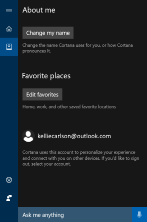

# Cortana integration in your business or enterprise
**Applies to:**

-   Windows 10, version 1703
-   Windows 10 Mobile, version 1703

## Who is Cortana?
Cortana is Microsoft’s personal digital assistant, who helps busy people get things done, even while at work.
Cortana has powerful configuration options, specifically optimized for your business. By signing in with an Azure Active Directory (Azure AD) account, your employees can give Cortana access to their enterprise/work identity, while getting all the functionality Cortana provides to them outside of work.

Using Azure AD also means that you can remove an employee’s profile (for example, when an employee leaves your organization) while respecting Windows Information Protection (WIP) policies and ignoring enterprise content, such as emails, calendar items, and people lists that are marked as enterprise data.

## Where is Cortana available for use in my organization?
You can use Cortana at work in all countries/regions where Cortana is supported for consumers. This includes the United States, United Kingdom, Canada, France, Italy, Germany, Spain, China, Japan, India, and Australia. As Cortana comes to more countries, she will also become available to enterprise customers.

Cortana is available on Windows 10, version 1703 and with limited functionality on Windows 10 Mobile, version 1703.

## Required hardware and software
Cortana requires the following hardware and software to successfully run the included scenario in your organization.

|Hardware |Description |
|---------|------------|
|Microphone |For speech interaction with Cortana. If you don't have a microphone, you can still interact with Cortana by typing in the Cortana Search Box in the taskbar. |
|Windows Phone |For location-specific reminders. You can also use a desktop device to run through this scenario, but location accuracy is usually better on phones. |
|Desktop devices |For non-phone-related scenarios. |

|Software |Minimum version |
|---------|------------|
|Client operating system |<ul><li>**Desktop:** Windows 10, version 1703</li><li>**Mobile:** Windows 10 Mobile, version 1703 (with limited functionality)</li> |
|Azure Active Directory (Azure AD) |While all employees signing into Cortana need an Azure AD account; an Azure AD premium tenant isn’t required. |
|Additional policies (Group Policy and Mobile Device Management (MDM)) |There is a rich set of policies that can be used to manage various aspects of Cortana. Most of these policies will limit the abilities of Cortana, but won't turn Cortana off.
For example:
If you turn **Location** off, Cortana won't be able to provide location-based reminders, such as reminding you to visit the mail room when you get to work.
If you turn **Speech** off, your employees won't be able to use “Hello Cortana” for hands free usage or voice commands to easily ask for help. |
|Windows Information Protection (WIP) (optional) |If you want to secure the calendar, email, and contact info provided to Cortana on a device, you can use WIP. For more info about WIP, see [Protect your enterprise data using Windows Information Protection (WIP)](/windows/threat-protection/windows-information-protection/protect-enterprise-data-using-wip)
If you decide to use WIP, you must also have a management solution. This can be Microsoft Intune, Microsoft System Center Configuration Manager (version 1606 or later), or your current company-wide 3rd party mobile device management (MDM) solution.|

## Signing in using Azure AD
Your organization must have an Azure AD tenant and your employees’ devices must all be Azure AD-joined for Cortana to work properly. For info about what an Azure AD tenant is, how to get your devices joined, and other Azure AD maintenance info, see [What is an Azure AD directory?](https://msdn.microsoft.com/library/azure/jj573650.aspx)

## Cortana and privacy
We understand that there are some questions about Cortana and your organization’s privacy, including concerns about what info is collected by Cortana, where the info is saved, how to manage what data is collected, how to turn Cortana off, how to opt completely out of data collection, and what info is shared with other Microsoft apps and services. For more details about these concerns, see the [Cortana, Search, and privacy: FAQ](https://windows.microsoft.com/windows-10/cortana-privacy-faq) topic.

Cortana is covered under the [Microsoft Privacy Statement](https://privacy.microsoft.com/privacystatement) and [Microsoft Services Agreement](https://www.microsoft.com/servicesagreement).

## See also
- [What is Cortana?](https://go.microsoft.com/fwlink/p/?LinkId=746818)

- [Known issues for Windows Desktop Search and Cortana in Windows 10](https://support.microsoft.com/help/3206883/known-issues-for-windows-desktop-search-and-cortana-in-windows-10)

- [Cortana for developers](https://go.microsoft.com/fwlink/?LinkId=717385)
