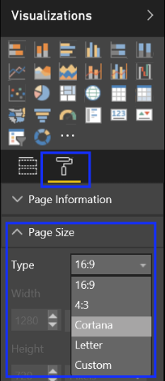

# Set up and test Cortana for Power BI in your organization
**Applies to:**

-   Windows 10, version 1703
-   Windows 10 Mobile, version 1703

Integration between Cortana and Power BI shows how Cortana can work with custom business analytics solutions to enable you to get answers directly from your key business data, including introducing new features that let you create custom Cortana “answers” using the full capabilities of Power BI Desktop.

>[!Note]
>Cortana for Power BI is currently only available in English. For more info about Cortana and Power BI, see [Use Power BI to create a custom Answer Page for Cortana](https://powerbi.microsoft.com/documentation/powerbi-service-cortana-desktop-entity-cards/).

## Before you begin
To use this walkthrough, you’ll need:

- **Windows 10**. You’ll need to be running at least Windows 10, version 1703.

- **Cortana**. You need to have Cortana turned on and be logged into your account.

- **Power BI account with data**. You can use an existing Power BI account, or else you can get a trial account by signing up at http://powerbi.com. Just make sure that either way, you enter some data that you can use.

- **Azure Active Directory (Azure AD)/Work or School account**. You can use the account that you created for Office 365, or you can create a new one while you’re establishing your Power BI account. If you choose to use Azure AD, you must connect your Azure AD account to your Windows account.

    **To connect your account to Windows**
    a. Open **Windows Settings**, click **Accounts**, click **Access work or school**, and then in the **Connect to work or school** section, click **Connect**.
    
    b. Follow the instructions to add your Azure Active Directory (Azure AD) account to Windows.

## Set up your test environment for Cortana for Power BI
Before you can start this testing scenario, you must first set up your test environment and data, and then you must turn on and set up Cortana to connect and work with Power BI.

**To set up your test environment with Cortana and Power BI**

1. Go to http://powerbi.com and sign-in with the same O365 credentials you used in the Set up and use Cortana with Office 365 topic.

2. Expand the left rail by clicking the **Show the navigation pane** icon.

    

3. Click **Get Data** from the left-hand navigation in Power BI.

    

4. Click **Samples** from the **Content Pack Library** area of the **Get Data** screen.

    

5. Click **Retail Analysis Sample**, and then click **Connect**.

    
 
    The sample data is imported and you’re returned to the **Power BI** screen.

6. Click **Dashboards** from the left pane of the **Power BI** screen, and then click **Retail Analysis Sample**.

        
 
7. In the upper right-hand menu, click the **Settings** icon, and then click **Settings**.

     

8. Click the **Datasets** tab, and then pick the **Retail Analysis Sample** dataset from the list.

9. Click **Q&A and Cortana**, check the **Allow Cortana to access this dataset** box, and then click **Apply**.

    

    >[!NOTE]
    >It can take up to 30 minutes for a new dataset to appear for Power BI and Cortana. Logging in and out of Windows 10, or otherwise restarting Cortana, causes the new content to appear immediately.
If you enable a dataset for Cortana, and that dataset is part of a content pack you own, you’ll need to re-publish for your colleagues to also use it with Cortana.

## Create a custom Answer Page for Cortana
You must create special reports, known as _Answer Pages_, to display the most commonly asked answers in Cortana. For example, if you want Cortana to quickly show sales data to your employees, you can create a 2016 sales data Answer Page that shows sales data, with various pivots, in Cortana.

After you’ve finished creating your Answer Page, you can continue to the included testing scenarios.

>[!NOTE]
>It can take up to 30 minutes for a custom Answer Page to appear for Power BI and Cortana. Logging in and out of Windows 10, or otherwise restarting Cortana, causes the new content to appear immediately.

**To create a custom sales data Answer Page for Cortana**
1. In Power BI, click **My Workspace**, click **Create**, and then click **Report**.

    
 
2. In the **Create Report** screen, click the **Retail Analysis Sample**, and then click **Create**.

    A blank report page appears.

3. In the **Visualizations** pane, click the paint roller icon, expand **Page Size**, and then pick **Cortana** from the **Type** drop-down list.

    

4. In the **Fields** pane, click to expand **Sales**, expand **This year sales**, and then add both **Value** and **Goal**.

    
 
    The automatically generated graph is added to your blank report. You have the option to change colors, add borders, add additional visualizations, and modify this page so that it answers the question about sales data as precisely, and in as custom a way, as you want. You just need to make sure that it all stays within the page borders.

5. In the **Visualizations** pane, click the paint roller icon again, expand **Page Information**, type _Sales data 2016_ into the **Name** box, turn on **Q&A**, and then add alternate report names (separated by commas) into the text box.

    The alternate names help Cortana to know what questions to look for and when to show this report. To also improve your results, you should avoid using the names of your report columns.

    
    
6. Click **File**, click **Save as**, and save the report as _Sales data 2016_. 

    Because this is part of the Retail Analysis Sample, it will automatically be included as part of the dataset you included for Cortana. However, you will still need to log in and out of Windows 10, or otherwise restart Cortana, before the new content appears.

## Test Scenario: Use Cortana to show info from Power BI in your organization
Now that you’ve set up your device, you can use Cortana to show your info from within Power BI.

**To use Cortana with Power BI**
1. Click on the **Cortana** icon in the taskbar, and then click in the **Search** bar.

2. Type _This year in sales_.

    Cortana shows you the available results.

    
 	 
3. In the **Power BI** area, click **This year in sales – in Retail Analysis Sample**.

 	Cortana returns your custom report.

    
 	 
>[!NOTE]
>For more info about how to connect your own data, build your own custom Power BI cards and Answer Pages for Cortana, and how to share the cards with everyone in your organization, see [Use Power BI to create a custom Answer Page for Cortana](https://powerbi.microsoft.com/documentation/powerbi-service-cortana-desktop-entity-cards/).
