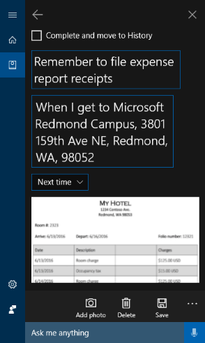

# Test scenario 3 - Set a reminder for a specific location using Cortana at work

-   Windows 10, version 1703
-   Windows 10 Mobile, version 1703

>[!IMPORTANT]
>The data created as part of these scenarios will be uploaded to Microsoft’s Cloud to help Cortana learn and help your employees. This is the same info that Cortana uses in the consumer offering.

This scenario helps you set up, review, and edit a reminder based on a location. For example, reminding yourself to grab your expense report receipts before you leave the house.

>[!NOTE]
>You can set each reminder location individually as you create the reminders, or you can go into the **About me** screen and add both **Work** and **Home** addresses as favorites. Make sure that you use real addresses since you’ll need to go to these locations to complete your testing scenario.
Additionally, if you’ve turned on the **Meeting & reminder cards & notifications** option (in the **Meetings & reminders** option of your Notebook), you’ll also see your pending reminders on the Cortana **Home** page.

## Create a reminder for a specific location
This process helps you to create a reminder based on a specific location.

1. Click on the **Cortana** icon in the taskbar, click on the **Notebook** icon, and then click **Reminders**.

2. Click the **+** sign, add a subject for your reminder, such as _Remember to file expense report receipts_, and then click **Place**.

    
 
3. Choose **Arrive** from the drop-down box, and then type a location to associate with your reminder. For example, you can use the physical address of where you work. Just make sure you can physically get to your location, so you can test the reminder.

    
 
4. Click **Done**.

    >[!NOTE]
    >If you’ve never used this location before, you’ll be asked to add a name for it so it can be added to the **Favorites list** in Windows Maps.

5. Choose to be reminded the **Next time you arrive at the location** or on a specific day of the week from the drop-down box.

6. Take a picture of your receipts and store them locally on your device.

7. Click **Add Photo**, click **Library**, browse to your picture, and then click **OK**.

    The photo is stored with the reminder.

    
 
8. Review the reminder info, and then click **Remind**.

    The reminder is saved and ready to be triggered.

    

## Create a reminder for a specific location by using voice commands
This process helps you to use Cortana at work and voice commands to create a reminder for a specific location.

1. Click on the **Cortana** icon in the taskbar, and then click the **Microphone** icon (to the right of the **Search** box).

2. Say _Remind me to grab my expense report receipts before I leave home_. 

    Cortana opens a new reminder task and asks if it sounds good.

    

3. Say _Yes_ so Cortana can save the reminder.

    

## Edit or archive an existing reminder
This process helps you to edit or archive and existing or completed reminder.

1. Click on the **Cortana** icon in the taskbar, click on the **Notebook** icon, and then click **Reminders**.

    

2. Click the pending reminder you want to edit.

    

3.	Change any text that you want to change, click **Add photo** if you want to add or replace an image, click **Delete** if you want to delete the entire reminder, click **Save** to save your changes, and click **Complete and move to History** if you want to save a completed reminder in your **Reminder History**.
