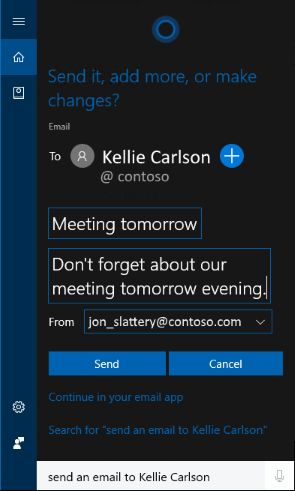

# Test scenario 5 - Use Cortana to send email to a co-worker

-   Windows 10, version 1703
-   Windows 10 Mobile, version 1703

>[!IMPORTANT]
>The data created as part of these scenarios will be uploaded to Microsoft’s Cloud to help Cortana learn and help your employees. This is the same info that Cortana uses in the consumer offering.

This scenario helps you to send an email to a co-worker listed in your work address book, both manually and verbally.

## Send an email to a co-worker
This process helps you to send a quick message to a co-worker from the work address book.

1.	Check to make sure your Microsoft Outlook or mail app is connected and synchronized with your Azure AD account.

2.	Click on the **Cortana** icon in the taskbar, and then click in the **Search** bar.

3.	Type _Send an email to &lt;contact_name&gt;_.

 	Where _&lt;contact_name&gt;_ is the name of someone in your work address book.

4.	Type your email message subject into the **Quick message** (255 characters or less) box and your message into the **Message** (unlimited characters) box, and then click **Send**.

        
 	 
## Send an email to a co-worker by using voice commands
This process helps you to use Cortana at work and voice commands to send a quick message to a co-worker from the work address book.

1.	Click on the **Cortana** icon in the taskbar, and then click the **Microphone** icon (to the right of the **Search** box.

2.	Say _Send an email to &lt;contact_name&gt;_.

 	Where _&lt;contact_name&gt;_ is the name of someone in your work address book.

3.	Add your email message by saying, _Hello this is a test email using Cortana at work._

 	The message is added and you’re asked if you want to **Send it**, **Add more**, or **Make changes**.

        
 	 
4.	Say _Send it_.

 	The email is sent.

    
