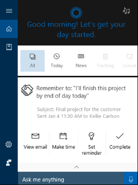

# Test scenario 6 - Review a reminder suggested by Cortana based on what you’ve promised in email

-   Windows 10, version 1703
-   Windows 10 Mobile, version 1703

>[!IMPORTANT]
>The data created as part of these scenarios will be uploaded to Microsoft’s Cloud to help Cortana learn and help your employees. This is the same info that Cortana uses in the consumer offering. For more info, see the [Microsoft Privacy Statement](https://privacy.microsoft.com/privacystatement) and the [Microsoft Services Agreement](https://www.microsoft.com/en-us/servicesagreement).

Cortana automatically finds patterns in your email, suggesting reminders based things that you said you would do so you don’t forget about them. For example, Cortana recognizes that if you include the text, _I’ll get this to you by the end of the week_ in an email, you're making a commitment to provide something by a specific date. Cortana can now suggest that you be reminded about this event, letting you decide whether to keep it or to cancel it.

>[!NOTE]
>The Suggested reminders feature is currently only available in English (en-us). 

**To use Cortana to create Suggested reminders for you**

1. Make sure that you've connected Cortana to Office 365. For the steps to connect, see [Set up and test Cortana with Office 365 in your organization](cortana-at-work-o365.md).

2. Click on the **Cortana** search box in the taskbar, click the **Notebook** icon, and then click **Permissions**.

3. Make sure the **Contacts, email, calendar, and communication history** option is turned on.

    

4. Click the **Notebook** icon again, click the **Suggested reminders** option, click to turn on the **All reminder suggestions cards** option, click the **Notify me when something I mentioned doing is coming up** box, and then click **Save**.

    

5. Create and send an email to yourself (so you can see the Suggested reminder), including the text, _I’ll finish this project by end of day today_.

6. After you get the email, click on the Cortana **Home** icon, and scroll to today’s events. 

    If the reminder has a specific date or time associated with it, like end of day, Cortana notifies you at the appropriate time and puts the reminder into the Action Center. Also from the Home screen, you can view the email where you made the promise, set aside time on your calendar, officially set the reminder, or mark the reminder as completed.

        

