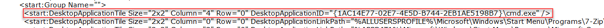

# Customize and export Start layout


**Applies to**

-   Windows 10

>**Looking for consumer information?** See [Customize the Start menu](https://go.microsoft.com/fwlink/p/?LinkId=623630)

The easiest method for creating a customized Start layout to apply to other Windows 10 devices is to set up the Start screen on a test computer and then export the layout.

After you export the layout, decide whether you want to apply a *full* Start layout or a *partial* Start layout.

When a full Start layout is applied, the users cannot pin, unpin, or uninstall apps from Start. Users can view and open all apps in the **All Apps** view, but they cannot pin any apps to Start.

When [a partial Start layout](#configure-a-partial-start-layout) is applied, the contents of the specified tile groups cannot be changed, but users can move those groups, and can also create and customize their own groups.

>[!NOTE]
>Partial Start layout is only supported on Windows 10, version 1511 and later.

 

You can deploy the resulting .xml file to devices using one of the following methods:

-   [Group Policy](customize-windows-10-start-screens-by-using-group-policy.md)

-   [Windows Configuration Designer provisioning package](customize-windows-10-start-screens-by-using-provisioning-packages-and-icd.md)

-   [Mobile device management (MDM)](customize-windows-10-start-screens-by-using-mobile-device-management.md)

<span id="bkmkcustomizestartscreen" />
## Customize the Start screen on your test computer


To prepare a Start layout for export, you simply customize the Start layout on a test computer.

**To prepare a test computer**

1.  Set up a test computer on which to customize the Start layout. Your test computer should have the operating system that is installed on the users’ computers (Windows 10 Pro, Enterprise, or Education). Install all apps and services that the Start layout should display.

2.  Create a new user account that you will use to customize the Start layout.

<a href="" id="bmk-customize-start"></a>
**To customize Start**

1.  Sign in to your test computer with the user account that you created.

2.  Customize the Start layout as you want users to see it by using the following techniques:

    -   **Pin apps to Start**. From Start, type the name of the app. When the app appears in the search results, right-click the app, and then click **Pin to Start**.

        To view all apps, click **All apps** in the bottom-left corner of Start. Right-click any app, and pin or unpin it from Start.

    -   **Unpin apps** that you don’t want to display. To unpin an app, right-click the app, and then click **Unpin from Start**.

    -   **Drag tiles** on Start to reorder or group apps.

    -   **Resize tiles**. To resize tiles, right-click the tile and then click **Resize.**

    -   **Create your own app groups**. Drag the apps to an empty area. To name a group, click above the group of tiles and then type the name in the **Name group** field that appears above the group.
    
>[!IMPORTANT]
>In Windows 10, version 1703, if the Start layout includes tiles for apps that are not installed on the device that the layout is later applied to, the tiles for those apps will be blank. The blank tiles will persist until the next time the user signs in, at which time the blank tiles are removed. Some system events may cause the blank tiles to be removed before the next sign-in.
>
>In earlier versions of Windows 10, no tile would be pinned.

<span id="bmk-exportstartscreenlayout" />
## Export the Start layout


When you have the Start layout that you want your users to see, use the [Export-StartLayout](https://docs.microsoft.com/powershell/module/startlayout/export-startlayout?view=win10-ps) cmdlet in Windows PowerShell to export the Start layout to an .xml file.

>[!IMPORTANT]
>If you include secondary Microsoft Edge tiles (tiles that link to specific websites in Microsoft Edge), see [Add custom images to Microsoft Edge secondary tiles](start-secondary-tiles.md) for instructions.

**To export the Start layout to an .xml file**

1.  While signed in with the same account that you used to customize Start, right-click Start, and select **Windows PowerShell**.

2.  At the Windows PowerShell command prompt, enter the following command:

    `Export-StartLayout –path <path><file name>.xml `

    In the previous command, `-path` is a required parameter that specifies the path and file name for the export file. You can specify a local path or a UNC path (for example, \\\\FileServer01\\StartLayouts\\StartLayoutMarketing.xml).

    Use a file name of your choice—for example, StartLayoutMarketing.xml. Include the .xml file name extension. The [Export-StartLayout](https://docs.microsoft.com/powershell/module/startlayout/export-startlayout?view=win10-ps) cmdlet does not append the file name extension, and the policy settings require the extension.
    
    Example of a layout file produced by `Export-StartLayout`:

    <span codelanguage="XML"></span>
    <table>
    <colgroup>
    <col width="100%" />
    </colgroup>
    <thead>
    <tr class="header">
    <th align="left">XML</th>
    </tr>
    </thead>
    <tbody>
    <tr class="odd">
    <td align="left"><pre><code>&lt;LayoutModificationTemplate Version=&quot;1&quot; xmlns=&quot;http://schemas.microsoft.com/Start/2014/LayoutModification&quot;&gt;
      &lt;DefaultLayoutOverride&gt;
        &lt;StartLayoutCollection&gt;
          &lt;defaultlayout:StartLayout GroupCellWidth=&quot;6&quot; xmlns:defaultlayout=&quot;http://schemas.microsoft.com/Start/2014/FullDefaultLayout&quot;&gt;
            &lt;start:Group Name=&quot;Life at a glance&quot; xmlns:start=&quot;http://schemas.microsoft.com/Start/2014/StartLayout&quot;&gt;
              &lt;start:Tile Size=&quot;2x2&quot; Column=&quot;0&quot; Row=&quot;0&quot; AppUserModelID=&quot;Microsoft.MicrosoftEdge_8wekyb3d8bbwe!MicrosoftEdge&quot; /&gt;
              &lt;start:Tile Size=&quot;2x2&quot; Column=&quot;4&quot; Row=&quot;0&quot; AppUserModelID=&quot;Microsoft.Windows.Cortana_cw5n1h2txyewy!CortanaUI&quot; /&gt;
              &lt;start:Tile Size=&quot;2x2&quot; Column=&quot;2&quot; Row=&quot;0&quot; AppUserModelID=&quot;Microsoft.BingWeather_8wekyb3d8bbwe!App&quot; /&gt;
            &lt;/start:Group&gt;        
          &lt;/defaultlayout:StartLayout&gt;
        &lt;/StartLayoutCollection&gt;
      &lt;/DefaultLayoutOverride&gt;
    &lt;/LayoutModificationTemplate&gt;</code></pre></td>
    </tr>
    </tbody>
    </table>

3. (Optional) Edit the .xml file to add [a taskbar configuration](configure-windows-10-taskbar.md) or to [modify the exported layout](start-layout-xml-desktop.md). When you make changes to the exported layout, be aware that [the order of the elements in the .xml file are critical.](start-layout-xml-desktop.md#required-order)

>[!IMPORTANT]
>If the Start layout that you export contains tiles for desktop (Win32) apps or .url links, **Export-StartLayout** will use **DesktopApplicationLinkPath** in the resulting file. Use a text or XML editor to change **DesktopApplicationLinkPath** to **DesktopApplicationID**. See [Specify Start tiles](start-layout-xml-desktop.md#specify-start-tiles) for details on using the app ID in place of the link path. 

**Known issue when applying the exported layout to another computer**

In Windows 10 that releases later than Windows 10 version 1511, Windows exports the **DesktopApplicationLinkPath** instead of **DesktopApplicationID**. As a result, on the target computer that the xml file apples to, some new shortcuts  may not be pinned to Start if the user has an established profile.

To avoid the issue, use one of the following options:

**Option 1** Export the xml file on a Windows 10 version 1511-based computer.

**Option 2** On a Windows 10 version 1809-based computer, run the **Export-StartLayout** together with a new switch **-UseDesktopApplicationID**. For example:

```PowerShell
Export-StartLayout -UseDesktopApplicationID -Path layout.xml
```

**Option 3** Manually edit the StartLayout XML file to use DesktopApplicationID. To do this, follow these steps:

1. Open an elevated PowerShell window.

2. Run **Get-StartApps** to retrieve the **DesktopApplicationID**. For example, find the **DesktopApplicationID** of command prompt:
Command Prompt                                         {1AC14E77-02E7-4E5D-B744-2EB1AE5198B7}\cmd.exe

3. Run **Export-StartLayout -Path layout.xml**.

4. Start Notepad, and then open the xml file by using the **UTF-8** encoding.

5. Locate the applications that you need to make changes for.

6. Replace **DesktopApplicationLinkPath** with **DesktopApplicationID**.

7. Replace the path with the path from the Get-StartApps export that was collected in step 2. For example:



>[!NOTE]
>All clients that the start layout applies to must have the apps and other shortcuts present on the local system in the same location as the source that the Start layout came.
>
>For Scripts and Application tile pins to work correctly, follow the rule for the location of Scripts and Executables:
>
>* Executables and Scripts should be listed in \Program Files or wherever the installer of the app places them.
>* Shortcuts that will pinned to Start should be placed in \ProgramData\Microsoft\Windows\Start Menu\Programs. 
>* If you place executables or scripts in the \ProgramData\Microsoft\Windows\Start Menu\Programs folder they will not pin to Start.
>* Start on Windows 10 does not support subfolders. We only support one folder. For example, \ProgramData\Microsoft\Windows\Start Menu\Programs\Folder. If you go any deeper than one folder Start will compress the contents of all the subfolder to the top level.


## Configure a partial Start layout


A partial Start layout enables you to add one or more customized tile groups to users' Start screens or menus, while still allowing users to make changes to other parts of the Start layout. All groups that you add are *locked*, meaning users cannot change the contents of those tile groups, however users can change the location of those groups. Locked groups are identified with an icon, as shown in the following image.


When a partial Start layout is applied for the first time, the new groups are added to the users' existing Start layouts. If an app tile is in both an existing group and in a new locked group, the duplicate app tile is removed from the existing (unlocked) group.

When a partial Start layout is applied to a device that already has a StartLayout.xml applied, groups that were added previously are removed and the groups in the new layout are added.

If the Start layout is applied by Group Policy or MDM, and the policy is removed, the groups remain on the devices but become unlocked.

**To configure a partial Start screen layout**

1.  [Customize the Start layout](#bmk-customize-start).

2.  [Export the Start layout](#bmk-exportstartscreenlayout).
3.  Open the layout .xml file. There is a `<DefaultLayoutOverride>` element. Add `LayoutCustomizationRestrictionType="OnlySpecifiedGroups"` to the **DefaultLayoutOverride** element as follows:

    ``` syntax
    <DefaultLayoutOverride LayoutCustomizationRestrictionType="OnlySpecifiedGroups">
    ```

4.  Save the file and apply using any of the deployment methods.

## Related topics


- [Manage Windows 10 Start and taskbar layout](windows-10-start-layout-options-and-policies.md)
- [Configure Windows 10 taskbar](configure-windows-10-taskbar.md)
- [Add image for secondary tiles](start-secondary-tiles.md)
- [Start layout XML for desktop editions of Windows 10 (reference)](start-layout-xml-desktop.md)
- [Customize Windows 10 Start and taskbar with Group Policy](customize-windows-10-start-screens-by-using-group-policy.md)
- [Customize Windows 10 Start and taskbar with provisioning packages](customize-windows-10-start-screens-by-using-provisioning-packages-and-icd.md)
- [Customize Windows 10 Start and tasbkar with mobile device management (MDM)](customize-windows-10-start-screens-by-using-mobile-device-management.md)
- [Changes to Start policies in Windows 10](changes-to-start-policies-in-windows-10.md)


